<table><tr><td colspan="3">Write your name here</td></tr><tr><td>Surname</td><td colspan="2">Other names</td></tr><tr><td>Centre Number</td><td colspan="2">Candidate Number</td></tr><tr><td colspan="3">Edexcel
International GCSE</td></tr><tr><td colspan="3">Chemistry
Unit: 4CH0
Science (Double Award) 4SC0
Paper: 1C</td></tr><tr><td colspan="2">Friday 13 January 2012 – Morning
Time: 2 hours</td><td>Paper Reference
4CH0/1C
4SC0/1C</td></tr><tr><td colspan="3">You must have:
Ruler
Calculator.</td></tr><tr><td colspan="3">Total Marks</td></tr></table>

## Instructions

- Use black ink or ball-point pen.

- Fill in the boxes at the top of this page with your name, centre number and candidate number.

- Answer all questions.

- Answer the questions in the spaces provided

- there may be more space than you need.

- Show all the steps in any calculations and state the units.

## Information

- The total mark for this paper is 120.

- The marks for each question are shown in brackets

- use this as a guide as to how much time to spend on each question.

## Advice

- Read each question carefully before you start to answer it.

- Keep an eye on the time.

- Write your answers neatly and in good English.

- Try to answer every question.

- Check your answers if you have time at the end.

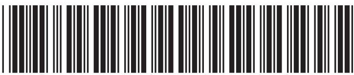

THE PERIODIC TABLE

<table class="table table-bordered"><thead><tr><th>7 Li</th><th>9 Be</th></tr></thead><tbody><tr><td>3 Lithium</td><td>4 Beryllium</td></tr><tr><td>23 Na Sodium</td><td>24 Mg Magnesium</td></tr><tr><td>39 K Potassium</td><td>40 Ca Calcium</td></tr><tr><td>86 Rb Rubidium</td><td>88 Sr Strontium</td></tr><tr><td>133 Cs Caesium</td><td>137 Ba Barium</td></tr><tr><td>223 Fr Francium</td><td>226 Ra Radium</td></tr></tbody></table>

## Answer ALL questions.

1 Salt is soluble in water, but sand is insoluble in water. This difference allows a mixture of salt and sand to be separated using this apparatus.

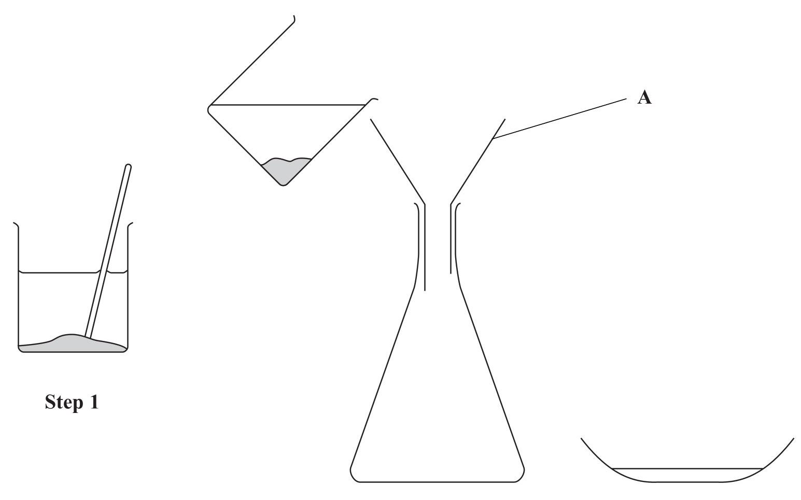

Step 2

Step 3

(a) Use words from the box to complete the sentences. Each word may be used once, more than once or not at all.

<table border="1"><tr><td>beaker</td><td>Bunsen burner</td><td>burette</td><td>conical flask</td></tr><tr><td>funnel</td><td>glass rod</td><td>thermometer</td><td>water</td></tr></table>

(6) 

In Step 1, the mixture of salt and sand is placed in a ... containing ... and stirred with a ...

In Step 3, the liquid is transferred to a basin to allow the to be removed.

(b) (i) What should be placed in A before the mixture from Step 1 is poured through it?

(ii) What is the solid removed in Step 2?

(c) Place crosses ( $ \times $ ) in two boxes to show the names of two processes used in this separation.

chromatography

condensation

distillation

evaporation

filtration

sublimation

(Total for Question 1 = 10 marks)

2 Iron is a useful metal. One problem with using iron is that it can rust.

(a) (i) Name the iron compound present in rust.

(ii) Name the two substances that iron reacts with when it rusts.

(b) What type of reaction occurs in the rusting of iron?

Place a cross ( $ \times $ ) in one box.

combustion

decomposition

displacement

oxidation

(c) Galvanising can prevent iron from rusting. In this process, the iron is coated with another metal.

(i) Identify the other metal.

(ii) Identify one object suitable for galvanising. Place a cross ( $ \bigcirc $ ) in one box.

bicycle chain

bucket

car engine

drink can

(d) State two other methods used to prevent iron from rusting.

(Total for Question 2 = 8 marks)

3 Ammonium chloride contains oppositely charged ions.

(a) State the formula of each ion.

Positive ion

Negative ion

(b) (i) Describe a chemical test to show that a substance contains ammonium ions.

(ii) Describe a chemical test to show that a substance contains chloride ions.

(c) Ammonium chloride decomposes when heated:

$$
\mathrm {N H} _ {4} \mathrm {C l} (\mathrm {s}) \rightleftharpoons \mathrm {N H} _ {3} (\mathrm {g}) + \mathrm {H C l} (\mathrm {g})
$$

What does the $ \rightleftharpoons $ symbol indicate about the reaction?

(d) The reaction between ammonia and hydrogen chloride can be used to illustrate diffusion with the following apparatus.

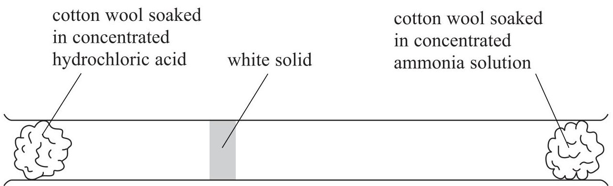

After a few minutes, a white solid appears inside the tube.

(i) Identify the white solid.

(ii) What does the diagram show about the speed of the ammonia molecules compared to the speed of the hydrogen chloride molecules?

(e) State the main hazard when using concentrated hydrochloric acid in the experiment in (d). Suggest one precaution you could use to minimise this hazard.

Hazard

Precaution

(Total for Question 3 = 13 marks)

4 A student set up the following apparatus.

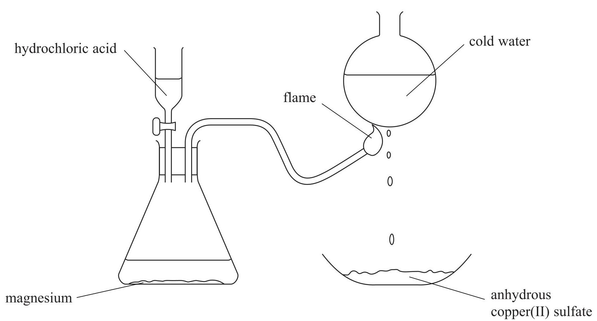

(a) The reaction between magnesium and hydrochloric acid forms hydrogen gas.

(i) State one observation the student would make during this reaction.

(ii) Identify the other product formed during this reaction.

(b) The hydrogen gas burns in air to form steam. The steam changes to water on the surface of the round flask.

(i) Write a chemical equation for the burning of hydrogen in air.

(ii) What name is used for the process in which steam changes into water?

(c) The water drips onto anhydrous copper(II) sulfate and causes a reaction. The product of this reaction has the formula $ \mathrm{C u S O_{4}. 5 H_{2} O} $

(i) State the final colour of the copper(II) sulfate in this reaction.

(ii) The colour change of the anhydrous copper(II) sulfate shows that the liquid contains water. Describe a test to show that the water is pure.

(Total for Question 4 = 8 marks)

5 These are the displayed formulae of six organic compounds.

<table border="1"><tr><td>H
H-C-H
H</td><td>H H
H-C-C-H
H H</td><td>H H H
H-C-C-C-H
H H H</td></tr><tr><td>P</td><td>Q</td><td>R</td></tr><tr><td>H
H-C-Br
H</td><td>C=C
H
H</td><td>C=C
H
H
H</td></tr><tr><td>S</td><td>T</td><td>U</td></tr></table>

(a) Use the letters above to select

(i) the compound that is not a hydrocarbon.

(ii) one compound with the empirical formula $ \mathrm{C H_{2}} $

(iii) one compound that can form a polymer.

(b) Describe a test that will distinguish between compounds Q and T, and state the observation made with compound T.

Test

Observation with compound T

(c) Draw the displayed formula of an alkene containing four carbon atoms.

(d) Three of the compounds belong to the alkane homologous series. All the alkanes in this homologous series have the same general formula.

(i) What is the general formula of the alkanes?

(ii) State two other features of a homologous series.

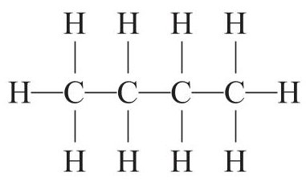

(e) The displayed formulae below represent isomers.

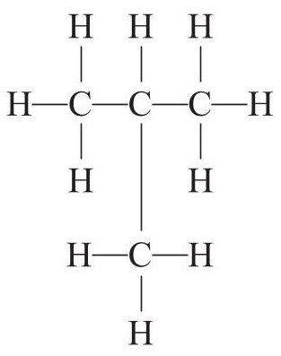

Explain what isomers are.

(2) 

6 The diagram shows how the electrons are arranged in an atom of oxygen.

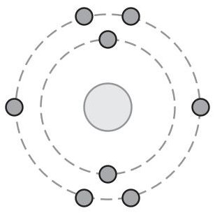

Oxygen atoms form both covalent and ionic bonds.

(a) Water is formed when two atoms of hydrogen combine with one atom of oxygen.

(i) Draw a dot and cross diagram of a molecule of water. You need only show the electrons in the outer shells.

(ii) Explain how the covalent bonds in the water molecule hold the hydrogen and oxygen atoms together.

(b) The electronic configuration of a sodium atom is 2.8.1 Sodium oxide, $ \mathrm{N a_{2} O} $ is an ionic compound formed when sodium reacts with oxygen.

(i) Describe, in terms of electrons, what happens when sodium oxide is formed in this reaction.

(ii) The reaction of sodium to form sodium oxide can be described as oxidation because it involves the addition of oxygen.

State one other reason why this reaction can be described as oxidation.

(c) Explain why water has a much lower melting point than sodium oxide.

(d) A teacher added sodium oxide to water in a beaker. The equation shows the reaction that occurred.

$$
\mathrm {N a} _ {2} \mathrm {O} (\dots \dots) + \mathrm {H} _ {2} \mathrm {O} (\dots \dots) \rightarrow 2 \mathrm {N a O H} (\dots \dots)
$$

(i) Insert the appropriate state symbols in this equation.

(ii) Some universal indicator was then added to the beaker. A colour change occurred. State the final colour of the universal indicator and identify the ion responsible for the colour change.

Final colour

Ion responsible for colour change

(Total for Question 6 = 14 marks)

7 Bromine, chlorine and iodine are elements in Group 7 of the Periodic Table.

(a) (i) Identify which of these elements has (2)

the palest colour

the highest melting point

(ii) Give the name of another Group 7 element that is a solid at room temperature. (1)

(b) When chlorine and hydrogen react together, hydrogen chloride gas forms. Write a chemical equation for this reaction.

(c) Some hydrogen chloride gas is bubbled into separate samples of water and methylbenzene. A piece of blue litmus paper is dipped into each solution.

(i) State, with a reason, the final colour of the litmus paper in the solution in water.

(ii) State, with a reason, the final colour of the litmus paper in the solution in methylbenzene. (2)

(Total for Question 7 = 9 marks)

8 Some students investigated displacement reactions involving three different metals and solutions of their salts. This equation represents one of these reactions:

$$
\mathrm {Z n} (\mathrm {s}) + \mathrm {C u S O} _ {4} (\mathrm {a q}) \rightarrow \mathrm {Z n S O} _ {4} (\mathrm {a q}) + \mathrm {C u} (\mathrm {s})
$$

This reaction occurs because zinc is more reactive than copper.

When a displacement reaction occurs, there is a temperature rise. The bigger the difference in reactivity between the two metals, the bigger the temperature rise.

(a) What word is used to describe reactions in which there is a temperature rise?

(b) The students used this method.

- Pour some metal salt solution into a beaker, place a thermometer in the beaker and record the temperature

- Add some of the metal and stir the mixture

- Record the maximum temperature

(i) State two variables that the students should keep the same to ensure that the experiment was valid.

(ii) The diagrams show the thermometer readings at the start and at the end of one of the experiments.

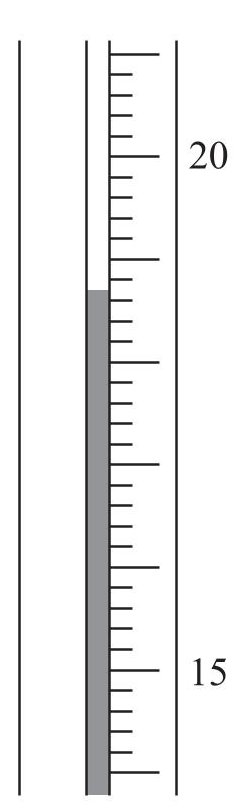

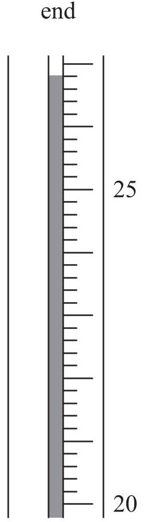

Record the temperatures and calculate the temperature rise in this experiment.

(3) 

<table border="1"><tr><td>Temperature at start</td><td>°C</td></tr><tr><td>Temperature at end</td><td>°C</td></tr><tr><td>Temperature rise</td><td>°C</td></tr></table>

(iii) Each experiment was repeated twice. The table shows the average temperatures obtained.

<table border="1"><tr><td>Metal and metal salt used</td><td>Average temperature rise in℃</td></tr><tr><td>Zn+CuSO4</td><td>12.2</td></tr><tr><td>X+CuSO4</td><td>8.3</td></tr><tr><td>X+ZnSO4</td><td>0.0</td></tr><tr><td>Cu+ZnSO4</td><td>0.0</td></tr><tr><td>Zn+XSO4</td><td>2.7</td></tr><tr><td>Cu+XSO4</td><td>0.0</td></tr></table>

Use these results to identify the more reactive metal in each of the following pairs.

Zn and X

Cu and X

(c) Write an equation for the reaction with a temperature rise of $ 2. 7 \mathrm{~}^{\circ} \mathrm{C}. $

(d) Suggest why the students did not use calcium metal in their experiments.

(Total for Question 8 = 10 marks)

9 AmmoFert Chemicals is a company that manufactures fertilisers.

The flow chart shows how the company manufactures a fertiliser called AmmoBoost.

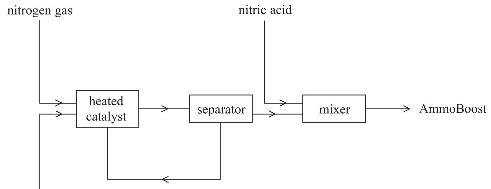

(a) The first step in the process is the conversion of nitrogen gas and hydrogen gas into ammonia.

(i) State a raw material used as the source of each gas.

nitrogen

hydrogen

(ii) Identify the catalyst used in this conversion.

(iii) State one other condition used in this conversion.

(iv) Only a small percentage of the nitrogen gas and hydrogen gas is converted into ammonia.

Explain how the unreacted gases are separated from the ammonia.

(b) The equation for the production of ammonia is

$$
\mathrm {N} _ {2} (\mathrm {g}) + 3 \mathrm {H} _ {2} (\mathrm {g}) \rightleftharpoons 2 \mathrm {N H} _ {3} (\mathrm {g}) \quad \Delta H = - 9 2 \mathrm {k J / m o l}
$$

Calculate the maximum mass of ammonia that can be obtained from 56 tonnes of nitrogen. (1 tonne = 1000000 grams)

(c) EnAitchThree is another company that manufactures ammonia using the same reaction as AmmoFert but using different conditions. EnAitchThree uses a higher temperature and a higher pressure than AmmoFert.

(i) Predict the effect on the rate of reaction and on the equilibrium position by changing to the temperature used by EnAitchThree.

Effect of higher temperature on rate of reaction

Effect of higher temperature on equilibrium position

(ii) Predict the effect on the equilibrium position by changing to the pressure used by EnAitchThree. Justify your prediction.

(d) The main compound in AmmoBoost contains 35% nitrogen and 5% hydrogen by mass. The remainder is oxygen.

(i) Calculate the percentage by mass of oxygen in the compound.

(ii) Determine the empirical formula of the compound.

(iii) What is the name of the main compound in AmmoBoost?

(Total for Question 9 = 18 marks)

10 Like other metals, iron is malleable and is a good conductor of electricity.

(a) (i) Explain why iron is malleable.

(ii) Explain why iron is a good conductor of electricity.

(b) Iron forms two sulfates. One has the formula $ \mathrm{F e S O_{4}} $ and the other has the formula $ \mathrm{F e_{2}(S O_{4})_{3}} $

The addition of sodium hydroxide solution can be used to distinguish between solutions of these sulfates.

(i) State what would be observed in each case.

$$
\mathrm {F e S O} _ {4}
$$

$$
\mathrm {F e} _ {2} \left(\mathrm {S O} _ {4}\right) _ {3}
$$

(ii) Write a chemical equation for the reaction of iron(II) sulfate $ \mathrm{(F e S O_{4})} $ with sodium hydroxide solution.

(Total for Question 10 = 8 marks)

11 Some students investigated the rate of reaction between sodium thiosulfate solution and hydrochloric acid. The equation for the reaction is

$$
\mathrm {N a} _ {2} \mathrm {S} _ {2} \mathrm {O} _ {3} (\mathrm {a q}) + 2 \mathrm {H C l} (\mathrm {a q}) \rightarrow 2 \mathrm {N a C l} (\mathrm {a q}) + \mathrm {H} _ {2} \mathrm {O} (\mathrm {l}) + \mathrm {S} (\mathrm {s}) + \mathrm {S O} _ {2} (\mathrm {g})
$$

The precipitate of sulfur makes the reaction mixture go cloudy.

The students used this method.

- Place a mixture of sodium thiosulfate solution and water in a conical flask

- Add some dilute hydrochloric acid, swirl the mixture and start a timer

- Place the flask over a black cross marked on a piece of paper

- Record the time taken for the cross to disappear when viewed from above

The students used 10 $ cm^{3} $ of dilute hydrochloric acid in each experiment.

They carried out all the experiments at the same temperature.

They used different volumes of sodium thiosulfate solution and water in each experiment. They were told to keep the total volume of sodium thiosulfate solution and water constant.

The table shows their results.

<table border="1"><tr><td>Student</td><td>Volume of sodium thiosulfate solution in $ \mathrm{c m^{3}} $</td><td>Volume of water in $ \mathrm{c m^{3}} $</td><td>Time in s</td></tr><tr><td>1</td><td>50</td><td>0</td><td>26.6</td></tr><tr><td>2</td><td>40</td><td>10</td><td>55.9</td></tr><tr><td>3</td><td>35</td><td>15</td><td>76.4</td></tr><tr><td>4</td><td>30</td><td>20</td><td>105.6</td></tr><tr><td>5</td><td>25</td><td>25</td><td>149.0</td></tr><tr><td>6</td><td>20</td><td>30</td><td>223.5</td></tr><tr><td>7</td><td>15</td><td>40</td><td>321.4</td></tr></table>

(a) Explain why the results of student 7 should not be used.

(b) Plot the results of the six other students on the grid below. Draw a curve of best fit through the points.

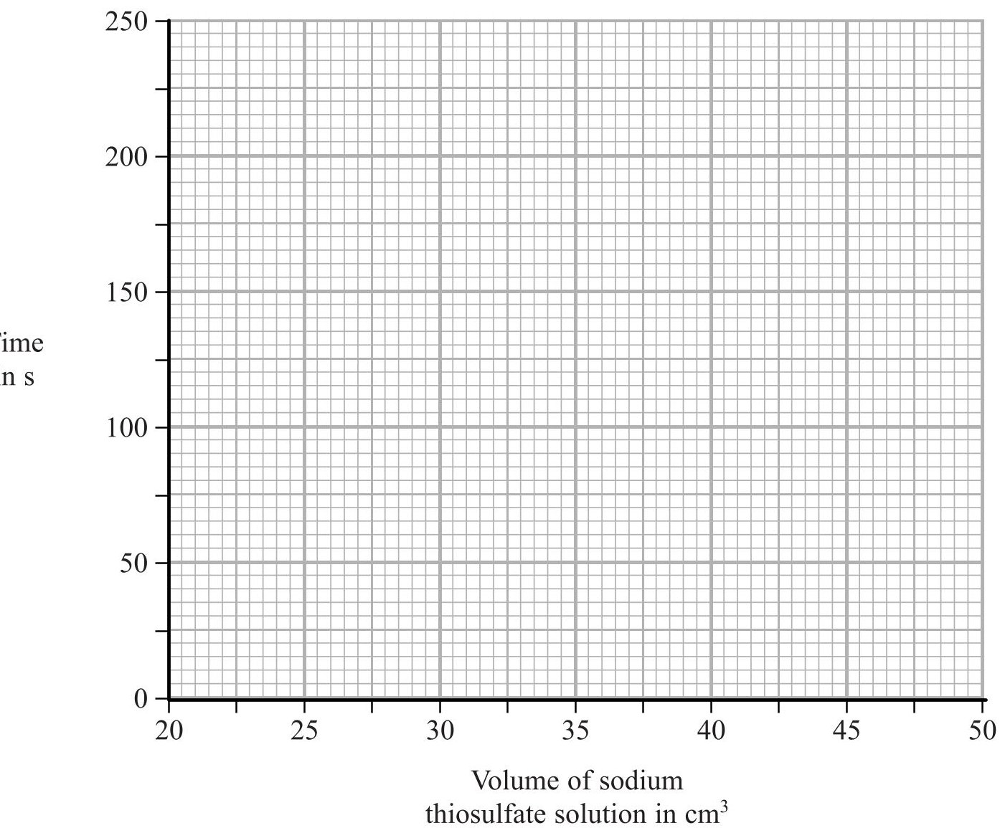

(c) The students used this equation to calculate the rate of each reaction in their investigation.

$$
\mathrm {r a t e o f r e a c t i o n} = \frac {1 0 0 0}{\mathrm {t i m e t a k e n}}
$$

Calculate the rate of reaction for student 1's experiment.

Give your answer to one decimal place.

(d) Another group of students used the same method but with different solutions of sodium thiosulfate and hydrochloric acid. They calculated the rate of reaction for each experiment they did. Their results are shown on the following graph.

Rate of reaction in 1000/s

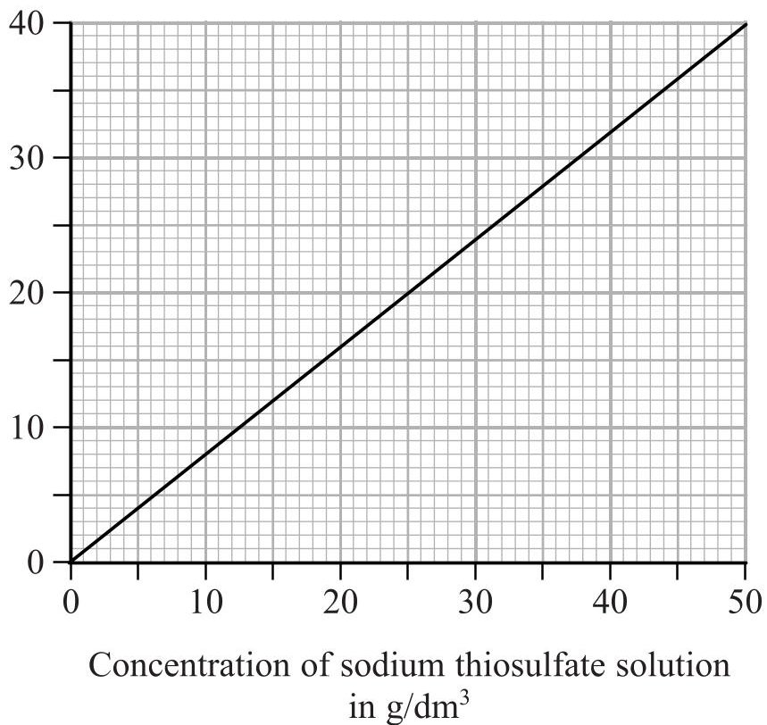

(i) Describe the relationship between rate and concentration as shown by the graph.

(ii) Explain why increasing the concentration has this effect on the rate.

TOTAL FOR PAPER = 120 MARKS

## BLANK PAGE

## BLANK PAGE

