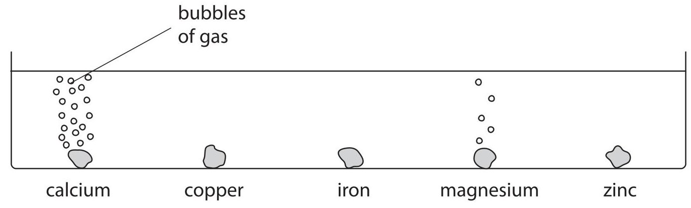
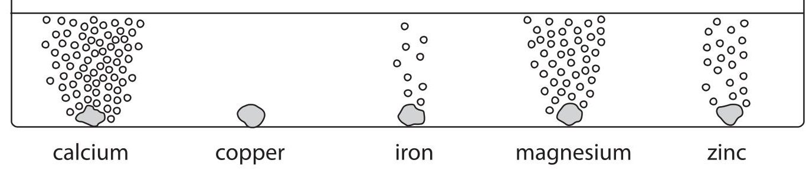
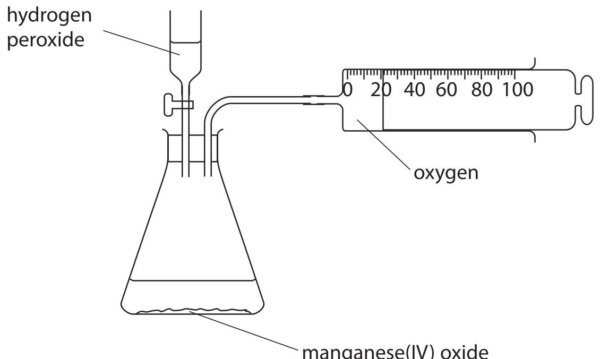
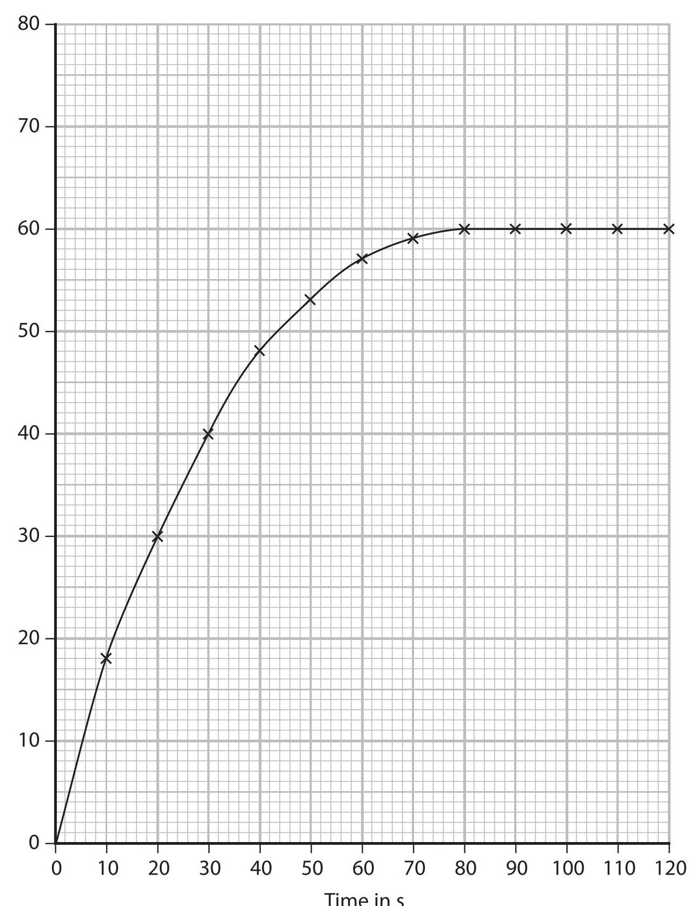
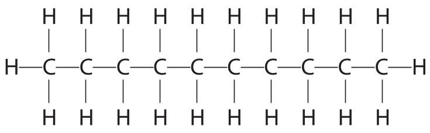
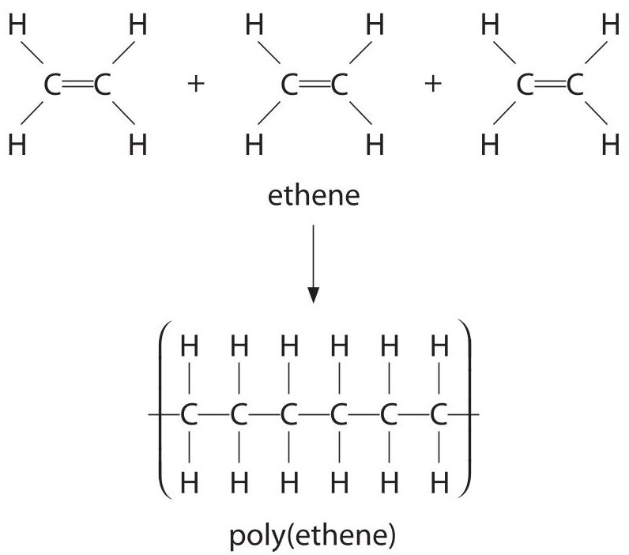
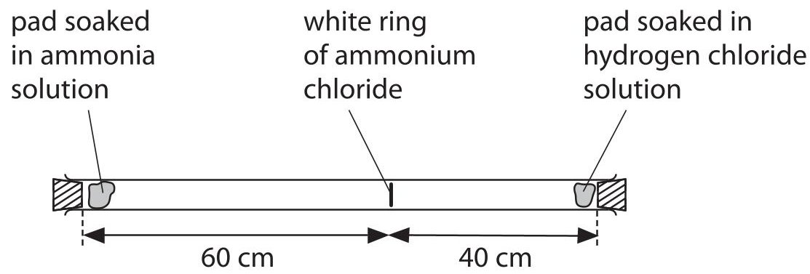
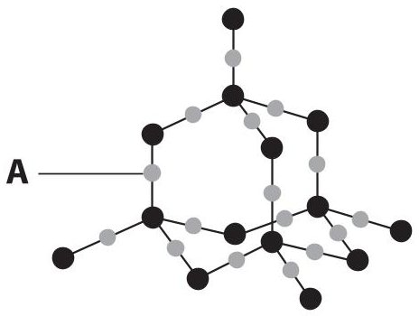
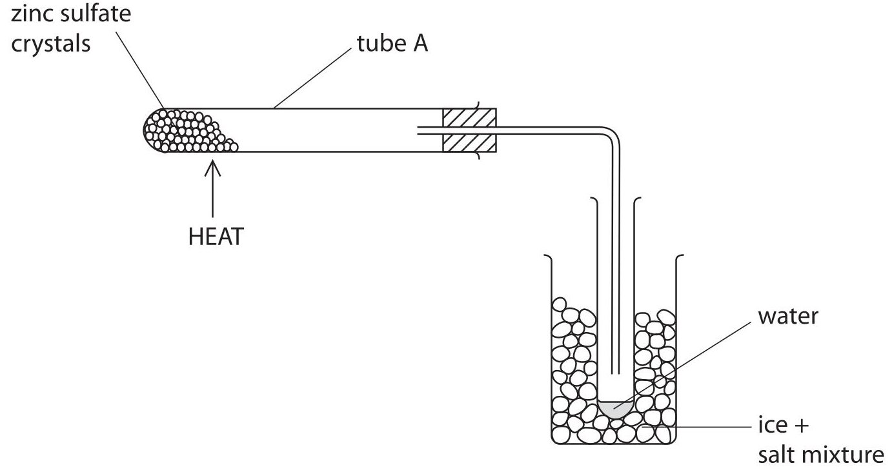

<table><tr><td colspan="3">Write your name here</td></tr><tr><td>Surname</td><td colspan="2">Other names</td></tr><tr><td>Edexcel Certificate</td><td>Centre Number</td><td>Candidate Number</td></tr><tr><td>Edexcel International GCSE</td><td></td><td></td></tr><tr><td colspan="3">Chemistry</td></tr><tr><td colspan="3">Unit: KCH0/4CH0 Science (Double Award) KSC0/4SC0 Paper: 1C</td></tr><tr><td colspan="2">Monday 21 May 2012 – Morning Time: 2 hours</td><td>Paper Reference KCH0/1C 4CH0/1C KSC0/1C 4SC0/1C</td></tr><tr><td colspan="3">You must have: Calculator</td></tr><tr><td colspan="3">Total Marks</td></tr></table>

## Instructions

- Use black ink or ball-point pen.

- Fill in the boxes at the top of this page with your name, centre number and candidate number.

- Answer all questions.

- Answer the questions in the spaces provided

- there may be more space than you need.

- Show all the steps in any calculations and state the units.

## Information

- The total mark for this paper is 120.

- The marks for each question are shown in brackets

- use this as a guide as to how much time to spend on each question.

## Advice

- Read each question carefully before you start to answer it.

- Keep an eye on the time.

- Write your answers neatly and in good English.

- Try to answer every question.

- Check your answers if you have time at the end.

## THE PERIODIC TABLE
<table class="table table-bordered"><thead><tr><th>7 Li Lithium</th><th>9 Be Beryllium</th></tr></thead><tbody><tr><td>23 Na Sodium</td><td>24 Mg Magnesium</td></tr><tr><td>39 K Potassium</td><td>40 Ca Calcium</td></tr><tr><td>86 Rb Rubidium</td><td>88 Sr Strontium</td></tr><tr><td>133 Cs Caesium</td><td>137 Ba Barium</td></tr><tr><td>223 Fr Francium</td><td>226 Ra Radium</td></tr></tbody></table>
## Answer ALL questions.
1 A student was asked to find the mass of salt dissolved in $ 1 0 0 \mathrm{c m}^{3} $ of sea water.
She was given the following instructions.
Step A Weigh an empty evaporating basin
Step B Transfer 50 $ cm^{3} $ of sea water into the basin
Step C Heat the sea water in the basin until all the water has evaporated
Step D Allow the basin and residue to cool
Step E Weigh the basin and residue of salt
(a) During the experiment, the student used several pieces of apparatus. Some of them are shown in the table.
Complete the table.
(6) 
<table border="1"><tr><td>Image of apparatus</td><td>Name of apparatus</td><td>One step in which the apparatus was used</td></tr><tr><td>Image of evaporating basin</td><td>evaporating basin</td><td>C</td></tr><tr><td>Image of a graduated cylinder</td><td></td><td></td></tr><tr><td>Image of a tripod</td><td>tripod</td><td></td></tr><tr><td>Image of a digital scale</td><td></td><td></td></tr></table>
(b) State, with a reason, one safety precaution that the student should take when doing this experiment.
Precaution
Reason
(Total for Question 1 = 9 marks)
2 The diagrams show the reactions of some metals with cold water and with dilute hydrochloric acid.
Metals in cold water

Metals in dilute hydrochloric acid

(a) Answer the following questions, using only the metals that appear in the diagrams.
(i) Name two metals that react with cold water.
(ii) Name one metal that reacts with dilute hydrochloric acid but not with cold water.
(iii) Arrange the five metals in order of reactivity.
(b) Some magnesium powder is added to dilute sulfuric acid in a test tube. A colourless solution is formed and a gas is given off.
When more magnesium is added, the reaction continues for a while and then stops, leaving some magnesium powder in the test tube.
When a flame is placed at the mouth of the test tube, the gas burns with a squeaky pop.
(i) Identify the gas produced.
(ii) Suggest why the reaction stops.
(iii) State the name of the colourless solution.
(iv) How could you separate the magnesium powder from the colourless solution?
(c) In some fireworks, magnesium powder reacts quickly with oxygen in the air. During this reaction heat energy is produced.
(i) What name is given to reactions in which heat energy is produced?
(ii) Name the compound formed when magnesium reacts with oxygen.
(Total for Question 2 = 12 marks)
3 When solutions are mixed together, precipitates sometimes form.
(a) Barium carbonate is an insoluble compound. It is formed as a precipitate when solutions of the soluble compounds barium chloride and sodium carbonate are mixed.
When solutions of the soluble compounds potassium chloride and sodium sulfate are mixed, no precipitate is formed.
Complete the table to show the results of mixing solutions of some compounds.
<table border="1"><tr><td></td><td>sodium carbonate solution</td><td>sodium sulfate solution</td></tr><tr><td>barium chloride solution</td><td>precipitate of barium carbonate</td><td></td></tr><tr><td>potassium chloride solution</td><td></td><td>no precipitate</td></tr><tr><td>calcium chloride solution</td><td>precipitate of calcium carbonate</td><td></td></tr></table>
(b) When solutions of lead(II) nitrate and potassium bromide are mixed, a precipitate of lead(II) bromide and a solution of potassium nitrate are produced.
$$
\mathrm {P b} \left(\mathrm {N O} _ {3}\right) _ {2} (\dots \dots \dots \dots) + 2 \mathrm {K B r} (\dots \dots \dots \dots) \rightarrow \mathrm {P b B r} _ {2} (\dots \dots \dots \dots) + 2 \mathrm {K N O} _ {3} (\dots \dots \dots \dots)
$$
The equation for the reaction is
Complete the equation by inserting the state symbols.
(c) In order to prepare a pure, dry sample of lead(II) bromide, a student took the mixture produced in part (b).
He then
- filtered the mixture
- washed the solid residue with distilled water
- left the solid in a warm place for several hours
(i) Why did the student filter the mixture?
(ii) Why did he wash the solid residue?
(iii) Why is it better to use distilled water rather than tap water to wash the solid residue?
(iv) Why did he leave the solid in a warm place?
(Total for Question 3 = 8 marks)
4 The diagram shows the positions of some elements in the Periodic Table.
1 2
3 4 5 6 7 0

<table border="1"><tr><td></td><td></td><td colspan="11"></td><td></td><td></td><td></td><td></td><td></td><td>F</td><td></td></tr><tr><td>Na</td><td></td><td></td><td></td><td></td><td></td><td></td><td></td><td></td><td></td><td></td><td></td><td></td><td></td><td></td><td></td><td></td><td></td><td>Cl</td><td></td></tr><tr><td>K</td><td></td><td></td><td></td><td></td><td></td><td></td><td></td><td></td><td></td><td></td><td></td><td></td><td></td><td></td><td></td><td></td><td></td><td>Br</td><td></td></tr></table>
(a) Complete the following sentence.
The elements in the Periodic Table are arranged in order of.
(b) Name an element shown in the diagram that is:
(c) (i) Name two elements in the diagram that react together to form an ionic compound. (1) and
(ii) Draw a dot and cross diagram for the ions in the compound formed in (c)(i). Show only the outer electrons. Include the charge on each ion.
(d) Chlorine reacts quickly with hot iron to form iron(III) chloride. Bromine reacts less quickly with hot iron to form iron(III) bromide.
Suggest how fluorine reacts with hot iron and name the compound formed.
(e) When chlorine gas is bubbled through an aqueous solution of sodium bromide, a displacement reaction takes place.
The ionic equation for the reaction is:
$$
\mathrm {C l} _ {2} (\mathrm {g}) + 2 \mathrm {B r} ^ {-} (\mathrm {a q}) \rightarrow 2 \mathrm {C l} ^ {-} (\mathrm {a q}) + \mathrm {B r} _ {2} (\mathrm {a q})
$$
State the colour change that you would observe in the solution during this reaction.
Colour at start
Colour at end
(Total for Question 4 = 11 marks)
5 The apparatus in the diagram is used to collect the oxygen produced by the decomposition of hydrogen peroxide, $ \mathrm{H_{2}O_{2}} $

(a) Write a chemical equation for the decomposition of hydrogen peroxide.
(b) Describe a test to show that the gas collected in the syringe is oxygen.
(c) Manganese(IV) oxide is a catalyst for this reaction.
State and explain the effect of a catalyst on the rate of this reaction.
(d) The graph shows the results from an experiment using a 0.50 mol/dm $ ^{3} $ solution of hydrogen peroxide at $ 2 5 \, \mathrm{^ {\circ} C} $

(i) On the same axes, sketch the curve you would expect with the same volume of a 0.25 mol/dm $ ^{3} $ solution of hydrogen peroxide at $ 2 5 \mathrm{~} ^ {\circ} \mathrm{C} $ . Label this curve A.
(ii) On the same axes, sketch the curve you would expect with the same volume of a 0.50 mol/dm $ ^{3} $ solution of hydrogen peroxide at $ 3 5 \mathrm{~} ^ {\circ} \mathrm{C} $ . Label this curve B.
6 The element carbon has three common isotopes. These are carbon-12, carbon-13 and carbon-14.
(a) Complete the table to show the number of protons and neutrons in each isotope of carbon.
<table border="1"><tr><td>Isotope</td><td>Mass number</td><td>Number of protons</td><td>Number of neutrons</td></tr><tr><td>carbon-12</td><td>12</td><td>6</td><td>6</td></tr><tr><td>carbon-13</td><td>13</td><td></td><td></td></tr><tr><td>carbon-14</td><td>14</td><td></td><td></td></tr></table>
(b) Explain, in terms of electrons, why the three isotopes have the same chemical properties.
(c) (i) State what is meant by the term relative atomic mass, $ A_{r} $
(ii) A sample of carbon contained 98.90% carbon-12 and 1.10% carbon-13.
Use this information to calculate the relative atomic mass of carbon in the sample. Give your answer to two decimal places.
Relative atomic mass
(Total for Question 6 = 8 marks)
## BLANK PAGE
7 Decane is a hydrocarbon found in crude oil.
The diagram shows the structure of a decane molecule.

(a) (i) Explain why decane is described as a hydrocarbon.
(ii) Give the molecular formula for decane.
(b) Decane and ethene, $ C_{2} H_{4} $ are produced during the cracking of eicosane, $ C_{2 0} H_{4 2} $ Ethene is used to make poly(ethene).

(i) What is the name given to this type of polymerisation?
(ii) Use the diagram to state two changes that occur during the formation of poly(ethene).
(c) Explain why cracking is an important process in the oil industry.
8 When ammonia gas and hydrogen chloride gas mix, they react together to form a white solid called ammonium chloride.
The equation for the reaction is:
$$
\mathrm {N H} _ {3} (\mathrm {g}) + \mathrm {H C l} (\mathrm {g}) \rightarrow \mathrm {N H} _ {4} \mathrm {C l} (\mathrm {s})
$$
A cotton wool pad was soaked in ammonia solution and another was soaked in hydrogen chloride solution. The two pads were then put into opposite ends of a dry glass tube at the same time.
After five minutes, a white ring of solid ammonium chloride formed.

(a) (i) What name is given to the movement of the two gases?
(ii) Identify which gas is moving faster and give a reason for your choice.
(b) The experiment was repeated at a higher temperature.
State and explain how this change would affect the time taken for the white ring to form.
(c) Gas particles move at a speed of several hundred metres per second at room temperature.
Suggest one reason why it took five minutes for the white ring to form.
(Total for Question 8 = 6 marks)
9 When water is added to a mixture of sand and cement, a reaction takes place between silicon dioxide in the sand and calcium oxide in the cement. The reaction produces a salt called calcium silicate.
The equation for the reaction is:
$$
\mathrm {S i O} _ {2} + \mathrm {C a O} \rightarrow \mathrm {C a S i O} _ {3}
$$
(a) Explain why silicon dioxide reacts with calcium oxide.
(b) Part of the structure of silicon dioxide is shown in the diagram.

(i) What does particle A represent? Give a reason for your answer.
(ii) Explain, in terms of its bonding and structure, why silicon dioxide has a very high melting point.
(Total for Question 9 = 8 marks)
10 When sodium is burned in air, one of the products is a pale yellow solid, X.
(a) A sample of solid X was found to contain 1.15 g of sodium and 0.80 g of oxygen.
(i) Show, by calculation, that the empirical formula of X is NaO.
(ii) The relative formula mass of X is 78. Deduce the formula of X.
## Formula of X
(b) Solid X reacts with water to form sodium hydroxide, NaOH, and hydrogen peroxide, $ \mathrm{H_{2}O_{2}} $
(i) Write a chemical equation to represent the reaction between X and water.
(ii) The solution formed in the reaction between X and water turns red litmus blue. Identify the ion that causes this change.
(iii) The displayed formula for hydrogen peroxide is H—O—O—H.
Complete the dot and cross diagram to show the arrangement of the outer shell (valence) electrons in a molecule of hydrogen peroxide.
$$
\mathrm {H} _ {\mathrm {X}} ^ {\circ} \mathrm {O} \mathrm {O} _ {\mathrm {X}} ^ {\bullet} \mathrm {H}
$$
11 A student carried out a series of tests on a solid, M, in order to identify the ions that could be present.
The table shows her results.
<table border="1"><tr><td>Test</td><td>Method</td><td>Result</td></tr><tr><td>Test1</td><td>Carry out a flame test on solidM</td><td>Lilac flame</td></tr><tr><td rowspan="4">Test2</td><td>Dissolve solidM in water,and divide the solution into three portions,A,B and C</td><td></td></tr><tr><td>PortionA- add dilute sodium hydroxide solution</td><td>Green precipitate</td></tr><tr><td>PortionB- add dilute hydrochloric acid,then barium chloride solution</td><td>No change</td></tr><tr><td>PortionC- add dilute nitric acid,then silver nitrate solution</td><td>Yellow precipitate</td></tr></table>
(a) Identify the ion responsible for
(i) the lilac colour in the flame test
(ii) the green precipitate when sodium hydroxide solution was added
(iii) the yellow precipitate when silver nitrate solution was added
(b) Describe how the student should carry out a flame test on solid M.
(c) (i) Why was dilute nitric acid added to the solution of solid M before using silver nitrate solution?
(ii) Why should dilute hydrochloric acid not be used in place of dilute nitric acid in this test?
(d) The tests for negative ions that the student carried out involved precipitation. Suggest one negative ion that cannot be identified by a precipitation reaction.
(Total for Question 11 = 10 marks)
12 Lead can be extracted from lead(II) sulfide, PbS, in two stages.
Stage 1: Lead(II) sulfide is heated in air. It reacts with oxygen to produce lead(II) oxide and sulfur dioxide.
Stage 2: The lead(II) oxide is then heated in a blast furnace with coke.
(a) Write a chemical equation for the reaction in Stage 1.
(b) The equation for the reaction that occurs when lead(II) oxide is heated with coke in a blast furnace is:
$$
2 \mathrm {P b O} + \mathrm {C} \rightarrow 2 \mathrm {P b} + \mathrm {C O} _ {2}
$$
(i) State, with a reason, whether PbO is oxidised or reduced in this reaction.
(ii) Calculate the minimum mass, in tonnes, of coke needed to react with 44.6 tonnes of lead(II) oxide. $ [ 1 \mathrm{t o n n e}=1 0^{6} \mathrm{g} ] $
Mass of coke needed =
(c) The molten lead obtained from the blast furnace contains 0.1% silver dissolved as an impurity.
The silver is removed by:
- adding zinc to the mixture of molten lead and silver at 530 $ ^{\circ} \mathrm{C} $ and removing the mixture of molten zinc and silver that forms on top of the molten lead
- heating the mixture of molten zinc and silver until the zinc boils off as a gas, leaving almost pure, solid silver behind
Use the information above to answer the following questions.
(i) What can you deduce about the relative solubility of silver in zinc and in lead?
(ii) What can you deduce about the melting point of the mixture of zinc and silver?
(iii) What can you deduce about the boiling point of zinc compared to that of silver?
Explain your answer.
(iv) Suggest why so much trouble is taken to remove such a small amount of silver from the lead.
(Total for Question 12 = 11 marks)
13 (a) Crystals of hydrated zinc sulfate, $ \mathrm{Z n S O_{4}. x H_{2} O} $ , contain water of crystallisation.
A student used the apparatus shown to remove and collect the water of crystallisation from the crystals in order to find the value of x.
He weighed the empty tube A.
He placed a sample of hydrated zinc sulfate crystals in tube A and reweighed it.
He heated the tube, allowed it to cool and weighed it again.
He repeated this process until two consecutive masses were the same. This is known as 'heating to constant mass'.

When hydrated zinc sulfate crystals are heated gently, they decompose according to the following equation:
$$
\mathrm {Z n S O} _ {4}. \mathrm {x H} _ {2} \mathrm {O} \rightarrow \mathrm {Z n S O} _ {4} + \mathrm {x H} _ {2} \mathrm {O}
$$
The following masses were recorded:
$$
\mathrm {M a s s o f t u b e A} = 1 0. 1 2 \mathrm {g}
$$
$$
\mathrm {M a s s o f t u b e A} + \mathrm {Z n S O} _ {4}. \mathrm {x H} _ {2} \mathrm {O} = 1 8. 7 3 \mathrm {g}
$$
Mass of tube A and $ \mathrm{Z n S O_{4}} $ after heating to constant mass = 14.95 g
(i) Calculate the mass of $ \mathrm{Z n S O}_{4} $ formed after heating to constant mass.
(ii) Calculate the mass of water collected after heating to constant mass.
(iii) The relative formula mass of $ \mathrm{Z n S O_{4}} $ is 161 The relative formula mass of water is 18 Use this information, and your answers to (a)(i) and (a)(ii), to calculate the value of x in the formula $ \mathrm{Z n S O_{4}. x H_{2}O} $
Show your working.
(b) Why is it necessary to heat the crystals to constant mass?
(c) Describe how the student could use a chemical test to show that the liquid collected was water.
(Total for Question 13 = 8 marks)
(TOTAL FOR PAPER = 120 MARKS)
## BLANK PAGE
