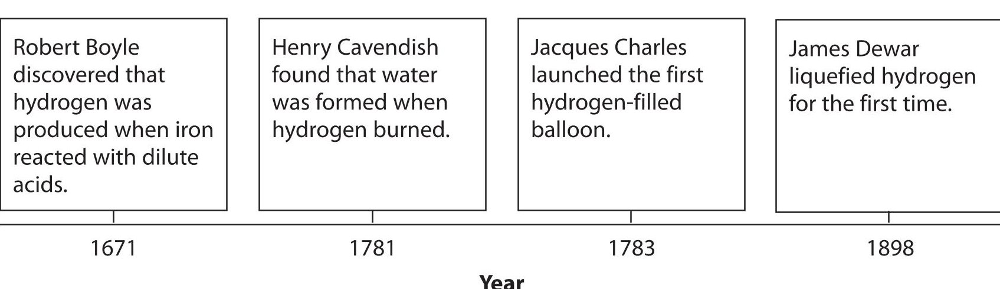
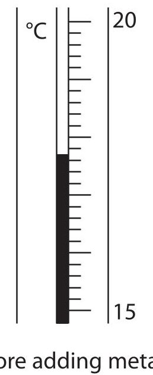
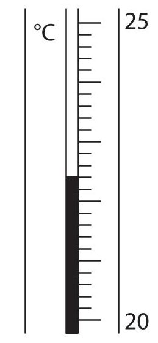
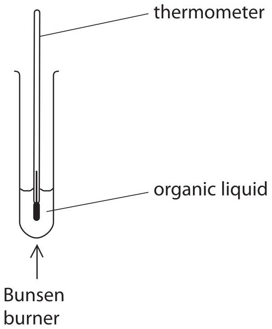
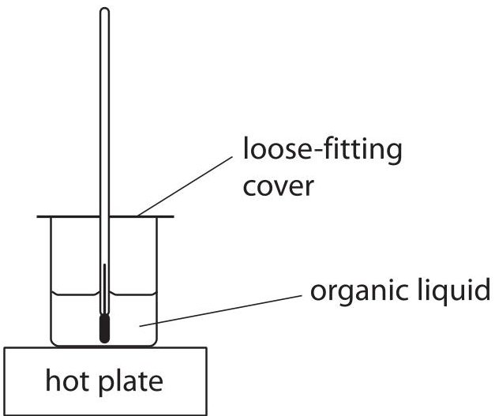
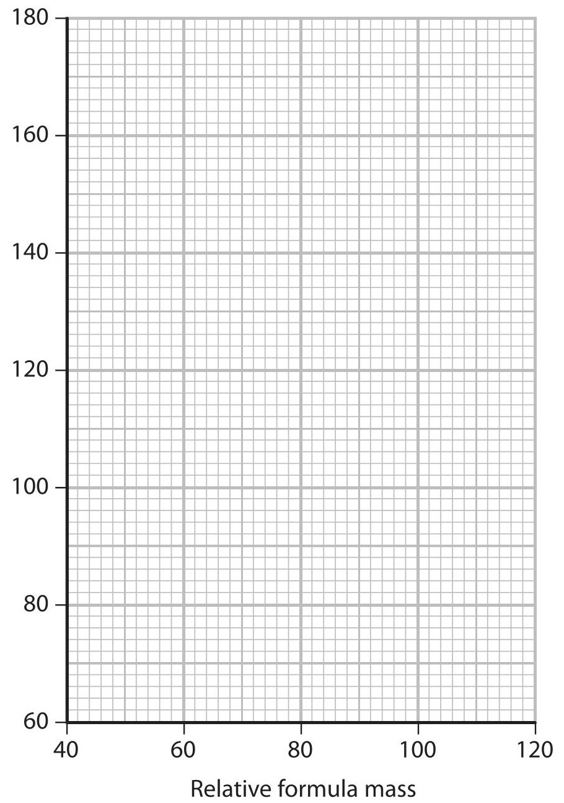

<table><tr><td colspan="3">Write your name here</td></tr><tr><td>Surname</td><td colspan="2">Other names</td></tr><tr><td>Edexcel Certificate</td><td>Centre Number</td><td>Candidate Number</td></tr><tr><td>Edexcel International GCSE</td><td></td><td></td></tr><tr><td colspan="3">Chemistry</td></tr><tr><td colspan="3">Unit: KCH0/4CH0
Science (Double Award) KSC0/4SC0
Paper: 1C</td></tr><tr><td colspan="2">Monday 14 January 2013 – Morning
Time: 2 hours</td><td>Paper Reference
KCH0/1C 4CH0/1C
KSC0/1C 4SC0/1C</td></tr><tr><td colspan="3">You must have:
Calculator
Ruler</td><td>Total Marks</td></tr></table>

## Instructions

- Use black ink or ball-point pen.

- Fill in the boxes at the top of this page with your name, centre number and candidate number.

- Answer all questions.

- Answer the questions in the spaces provided

- there may be more space than you need.

- Show all the steps in any calculations and state the units.

## Information

- The total mark for this paper is 120.

- The marks for each question are shown in brackets

- use this as a guide as to how much time to spend on each question.

## Advice

- Read each question carefully before you start to answer it.

- Keep an eye on the time.

- Write your answers neatly and in good English.

- Try to answer every question.

- Check your answers if you have time at the end.

## THE PERIODIC TABLE
<table class="table table-bordered"><thead><tr><th>1</th><th>2</th><th>3</th><th>4</th><th>5</th><th>6</th><th>7</th><th>8</th><th>9</th><th>10</th><th>11</th><th>12</th><th>13</th><th>14</th><th>15</th><th>16</th><th>17</th><th>18</th></tr></thead><tbody><tr><td>7</td><td>Li</td><td>3</td><td>9</td><td>Be</td><td>Beryllium</td><td></td><td></td><td></td><td></td><td></td><td></td><td></td><td></td><td></td><td></td><td></td><td></td><td></td></tr><tr><td>23</td><td>Na</td><td>11</td><td>24</td><td>Mg</td><td>Magnesium</td><td></td><td></td><td></td><td></td><td></td><td></td><td></td><td></td><td></td><td></td><td></td><td></td><td></td></tr><tr><td>39</td><td>K</td><td>19</td><td>40</td><td>Ca</td><td>Calcium</td><td>45</td><td>Sc</td><td>Scandium</td><td>48</td><td>Ti</td><td>Titanium</td><td>51</td><td>V</td><td>Vanadium</td><td>52</td><td>Cr</td><td>Chromium</td><td>55</td><td>Mn</td><td>Manganese</td><td>56</td><td>Fe</td><td>Iron</td><td>59</td><td>Co</td><td>Cobalt</td><td>27</td><td>Ni</td><td>Nickel</td><td>28</td><td>63.5</td><td>Cu</td><td>Copper</td><td>29</td><td>Zn</td><td>Zinc</td><td>30</td><td>70</td><td>Ga</td><td>Gallium</td><td>31</td><td>73</td><td>Ge</td><td>Germanium</td><td>32</td><td>75</td><td>As</td><td>Arsenic</td><td>33</td><td>79</td><td>Se</td><td>Selenium</td><td>34</td><td>80</td><td>Br</td><td>Bromine</td><td>35</td><td>84</td><td>Kr</td><td>Krypton</td><td>36</td></tr><tr><td>86</td><td>Rb</td><td>37</td><td>88</td><td>Sr</td><td>Strontium</td><td>89</td><td>Y</td><td>Yttrium</td><td>91</td><td>Zr</td><td>Zirconium</td><td>93</td><td>Nb</td><td>Niobium</td><td>96</td><td>Mo</td><td>Molybdenum</td><td>42</td><td>99</td><td>Tc</td><td>Technetium</td><td>43</td><td>101</td><td>Ru</td><td>Ruthenium</td><td>44</td><td>103</td><td>Rh</td><td>Rhodium</td><td>45</td><td>106</td><td>Pd</td><td>Palladium</td><td>46</td><td>108</td><td>Ag</td><td>Silver</td><td>47</td><td>112</td><td>Cd</td><td>Cadmium</td><td>48</td><td>115</td><td>In</td><td>Indium</td><td>49</td><td>119</td><td>Sn</td><td>Tin</td><td>50</td><td>122</td><td>Sb</td><td>Antimony</td><td>51</td><td>128</td><td>Te</td><td>Tellurium</td><td>52</td><td>127</td><td>I</td><td>Iodine</td><td>53</td><td>131</td><td>Xe</td><td>Xenon</td><td>54</td></tr><tr><td>133</td><td>Cs</td><td>55</td><td>137</td><td>Ba</td><td>Barium</td><td>139</td><td>La</td><td>Lanthanum</td><td>179</td><td>Hf</td><td>Hafnium</td><td>72</td><td>Ta</td><td>Tantalum</td><td>181</td><td>W</td><td>Tungsten</td><td>74</td><td>186</td><td>Re</td><td>Rhenium</td><td>75</td><td>190</td><td>Os</td><td>Osmium</td><td>76</td><td>192</td><td>Ir</td><td>Iridium</td><td>77</td><td>195</td><td>Pt</td><td>Platinum</td><td>78</td><td>197</td><td>Au</td><td>Gold</td><td>79</td><td>201</td><td>Hg</td><td>Mercury</td><td>80</td><td>204</td><td>Tl</td><td>Thallium</td><td>81</td><td>207</td><td>Pb</td><td>Lead</td><td>82</td><td>209</td><td>Bi</td><td>Bismuth</td><td>83</td><td>210</td><td>Po</td><td>Polonium</td><td>84</td><td>210</td><td>At</td><td>Astatine</td><td>85</td><td>222</td><td>Rn</td><td>Radon</td><td>86</td></tr><tr><td>223</td><td>Fr</td><td>87</td><td>226</td><td>Ra</td><td>Radium</td><td>227</td><td>Ac</td><td>Actinium</td><td></td><td>
</table>
## BLANK PAGE
## Answer ALL questions.
1 This question is about the element beryllium.
(a) Use words from the box to complete the sentences about beryllium. Each word may be used once, more than once or not at all.
electrons negative neutral neutrons nucleus positive protons shells
An atom of beryllium has a central ... that contains particles called ... and ... . Around these particles there are ... orbiting in ... .
An atom of beryllium has no charge because it contains equal numbers of ... and ... .
The particles with the lowest mass in an atom of beryllium are called ...
(b) Beryllium forms a compound with the formula $ \mathrm{B e(OH)}_{2} $
(i) How many different elements are there in $ \mathrm{B e(OH)}_{2} $?
(ii) What is the total number of atoms in the formula $ \mathrm{B e(OH)}_{2} $?
(Total for Question 1 = 9 marks)
2 The halogens are elements in Group 7 of the Periodic Table.
(a) Put a cross $ \times $ in the box to indicate your answer.
(i) Chlorine gas is
(ii) At room temperature, the physical state of bromine is
A solid
B liquid
C gas
D aqueous solution
(b) Which is the most reactive element in Group 7?
(c) Chlorine reacts with hydrogen to form a colourless gas that dissolves in water to form an acid.
(i) What is the name of the colourless gas?
(ii) What is the name of the acid?
(iii) What is the formula that is used to represent both the colourless gas and the acid?
(Total for Question 2 = 6 marks)
3 A student found this information about hydrogen.

(a) (i) The student repeated Boyle's experiment using iron and dilute sulfuric acid. State two observations that he could have made.
(ii) Complete the word equation for this reaction.
(b) Balance the equation for the complete combustion of hydrogen.
$$
\mathrm {H} _ {2} + \mathrm {O} _ {2} \rightarrow \mathrm {H} _ {2} \mathrm {O}
$$
(c) To show that the liquid produced by burning hydrogen was pure water, a student carried out a chemical test and a physical test.
(i) The chemical test involved adding a few drops of the liquid to a sample of anhydrous copper(II) sulfate.
State the colour change observed.
Initial colour
Final colour
(ii) Place a cross in one box to show the formula of the compound formed in this chemical test.
A $ \mathrm{C u ( O H )}_{2} $
B $ \mathrm{C u S O}_{4} $
$$
\mathrm {C u S O} _ {4} \cdot \mathrm {H} _ {2} \mathrm {O}
$$
$$
\mathrm {C u S O} _ {4}. 5 \mathrm {H} _ {2} \mathrm {O}
$$
(iii) The physical test involved measuring a property of the liquid.
State a suitable physical property and give the value for pure water.
Physical property
Value
(d) (i) Suggest what property of hydrogen makes it suitable for filling balloons.
(ii) Helium is now used instead of hydrogen to fill balloons.
State the property of helium that makes it more suitable than hydrogen for filling balloons.
(e) Write an equation, including state symbols, to show the process that occurs when hydrogen is liquefied.
(Total for Question 3 = 12 marks)
4 Water is needed for iron to rust.
(a) (i) State one other substance needed for iron to rust.
(ii) When iron rusts, a brown compound forms that can be represented by the formula $ \mathrm{F e_{2} O_{3}} $
State the name of this compound.
(b) Three students decided to investigate the rusting of some iron nails. They measured the mass of each nail before placing it in some water. After rusting had occurred, the nails were removed and their masses were measured.
The table shows their results.
<table border="1"><tr><td>Student</td><td>Mass of nail before rusting in g</td><td>Mass of nail after rusting in g</td></tr><tr><td>A</td><td>3.0</td><td>3.3</td></tr><tr><td>B</td><td>1.5</td><td>1.7</td></tr><tr><td>C</td><td>1.8</td><td>1.7</td></tr></table>
(i) Suggest one problem in measuring the mass of a nail after rusting.
(ii) Student A thought that the results showed that his nail had rusted most. Suggest why he thought this.
(iii) Student B thought that the results showed that her nail had rusted most. Suggest why she thought this.
(iv) How do the results of Student C show that he must have made an error in his experiment?
(c) Most methods used to prevent iron objects from rusting use a physical barrier. This involves covering the iron object with another substance to keep out the water.
Complete the table by choosing words from the box to suggest the substance that should be used to prevent each named iron object from rusting.
<table border="1"><tr><td>aluminium</td><td>grease</td><td>oil</td><td>paint</td><td>plastic</td></tr></table>
<table border="1"><tr><td>Iron object</td><td>Substance used to prevent rusting</td></tr><tr><td>bicycle chain</td><td></td></tr><tr><td>railway bridge</td><td></td></tr></table>
(d) Some iron objects are coated with zinc to prevent rusting. The zinc initially acts as a physical barrier, but an extra advantage of using zinc is that it continues to prevent rusting even if the layer of zinc is damaged.
State the name of this type of rust prevention and explain how it works.
(Total for Question 4 = 11 marks)
5 The table shows the displayed formulae of three unsaturated hydrocarbons.
<table border="1"><tr><td>CompoundA</td><td>CompoundB</td><td>CompoundC</td></tr></table>
(a) Explain the meaning of the term hydrocarbon.
(b) Explain the meaning of the term unsaturated.
(c) Compounds A, B and C belong to the same homologous series. One characteristic of the compounds in a homologous series is that they have the same general formula.
(i) State the name of this homologous series.
(ii) State the general formula of this homologous series.
(iii) State two other characteristics of the compounds in a homologous series.
(d) Compound C has several isomers.
(i) What is the name of compound C?
(ii) What is the molecular formula of compound C?
(iii) Explain the meaning of the term isomers.
(iv) Draw the displayed formula of an isomer of compound C.
(e) Bromine water can be used to distinguish compound A from ethane.
(i) Complete the sentence to show the colour change when compound A is bubbled through bromine water.
Bromine water changes from orange to
(ii) Complete the chemical equation for the reaction between compound A and bromine water.
$$
\mathrm {C} _ {2} \mathrm {H} _ {4} + \mathrm {B r} _ {2} \rightarrow
$$
(Total for Question 5 = 14 marks)
## BLANK PAGE
6 The reactivity of metals can be studied using displacement reactions. In these reactions, one metal is added to a solution of a salt of a different metal.
If a displacement reaction occurs, there is a temperature rise.
A student used the following method in a series of experiments.
- Pour some metal salt solution into a polystyrene cup supported in a glass beaker and record the temperature of the solution.
- Add a known mass of a metal and stir.
- Record the maximum temperature of the mixture.
(a) Suggest three variables that should be kept the same for the student's experiments to be a fair test.
(b) The student used a thermometer to measure the temperature rise. The diagrams show the thermometer readings before and after adding the metal.

Use the diagrams to complete the table.
<table border="1"><tr><td>Temperature after adding the metal in $ ^{\circ} \mathrm{C} $</td><td></td></tr><tr><td>Temperature before adding the metal in $ ^{\circ} \mathrm{C} $</td><td></td></tr><tr><td>Temperature change in $ ^{\circ} \mathrm{C} $</td><td></td></tr></table>
(c) The student used copper(II) sulfate solution in all her experiments. She used five different metals. She did not know the identity of the metal labelled X.
The student did each experiment twice. The table shows her results.
<table border="1"><tr><td rowspan="2">Metal</td><td colspan="2">Temperature rise in℃</td><td rowspan="2">Average temperature rise in℃</td></tr><tr><td>Run1</td><td>Run2</td></tr><tr><td>magnesium</td><td>10.5</td><td>15.5</td><td>13.0</td></tr><tr><td>silver</td><td>0.0</td><td>0.0</td><td>0.0</td></tr><tr><td>iron</td><td>3.5</td><td>4.5</td><td>4.0</td></tr><tr><td>X</td><td>0.0</td><td>0.0</td><td>0.0</td></tr><tr><td>zinc</td><td>8.0</td><td>9.0</td><td>8.5</td></tr></table>
(i) Which of the metals gave the least reliable temperature rise? Explain your choice.
(ii) Identify the most reactive of the metals used.
Explain how the results show that it is the most reactive.
Metal ... Explanation
(iii) Why is there no temperature rise when silver is added to copper(II) sulfate solution? (1)
(iv) Why do the results make it impossible to decide which of the metals is the least reactive?
(d) A word equation for one of the reactions is
zinc + copper(II) sulfate $ \rightarrow $ copper + zinc sulfate
Write a chemical equation for this reaction.
(Total for Question 6 = 13 marks)
## BLANK PAGE
7 Most metals are extracted in a blast furnace or by electrolysis.
(a) (i) The chemical equations for two reactions that occur during the extraction of aluminium are
A $ \mathrm{A l}^{3+}+3 \mathrm{e}^{-}\rightarrow \mathrm{A l} $
For each of these reactions, complete the table to show whether the underlined species is being oxidised or reduced. In each case, explain your choice.
<table border="1"><tr><td>Reaction</td><td>Species oxidised or reduced</td><td>Explanation of choice</td></tr><tr><td>A</td><td></td><td></td></tr><tr><td>B</td><td></td><td></td></tr></table>
(ii) Reaction A takes place at the negative electrode during the extraction of aluminium.
Write an ionic half-equation for the reaction at the positive electrode.
(iii) Reaction B gives a waste product during the extraction of aluminium. What effect does this reaction have on the positive electrodes?
(iv) Reaction B is also important in the extraction of iron in a blast furnace.
Name the raw material that reacts with oxygen and state why the reaction is important.
Importance of reaction
(b) Galena (PbS) and cerussite $ \mathrm{(P b C O_{3})} $ are two ores of lead. A mining company is considering which of these two ores to use for the extraction of lead.
The equations for the reactions occurring are
Process using galena:
$$
2 \mathrm {P b S} + 3 \mathrm {O} _ {2} \rightarrow 2 \mathrm {P b O} + 2 \mathrm {S O} _ {2}
$$
$$
2 \mathrm {P b O} + \mathrm {C} \rightarrow 2 \mathrm {P b} + \mathrm {C O} _ {2}
$$
Process using cerussite:
$$
\mathrm {P b C O} _ {3} \rightarrow \mathrm {P b O} + \mathrm {C O} _ {2}
$$
$$
2 \mathrm {P b O} + \mathrm {C} \rightarrow 2 \mathrm {P b} + \mathrm {C O} _ {2}
$$
(i) Both processes form carbon dioxide, which the mining company hopes to sell.
Complete the table to show two uses of carbon dioxide and a property on which each use depends.
<table border="1"><tr><td>Use</td><td>Property</td></tr><tr><td></td><td></td></tr><tr><td></td><td></td></tr></table>
(ii) One disadvantage of using galena is that the sulfur dioxide produced can cause acid rain.
Write a chemical equation to show the formation of an acidic solution from sulfur dioxide and state one effect of acid rain.
Equation
Effect
(c) The company uses a sample of cerussite containing 500 g of PbCO$_3$
Calculate the maximum mass of lead that can be obtained from this sample of cerussite.
Mass of lead = ... g
(Total for Question 7 = 17 marks)
8 The equation for a reaction that occurs in the manufacture of nitric acid is
$$
4 \mathrm {N H} _ {3} (\mathrm {g}) + 5 \mathrm {O} _ {2} (\mathrm {g}) \rightleftharpoons 4 \mathrm {N O} (\mathrm {g}) + 6 \mathrm {H} _ {2} \mathrm {O} (\mathrm {g}) \quad \Delta H = - 9 0 0 \mathrm {k J / m o l}
$$
(a) (i) State the meanings of the symbols $ \rightleftharpoons $ and $ \Delta H. $
$ \Delta H $
(ii) What does the negative sign of $ \Delta H $ indicate about the reaction?
(b) Complete the energy level diagram for this reaction.
Energy
(c) Typical conditions used for this reaction are a temperature of 900 $ ^{\circ} \mathrm{C} $ and a pressure of 10 atmospheres.
Deduce the effects of changing the conditions as shown in the table. Choose from the words increased, decreased or unchanged to complete the table.
<table border="1"><tr><td>Change</td><td>Effect on rate of reaction</td><td>Effect on yield of products</td></tr><tr><td>increase in temperature</td><td></td><td></td></tr><tr><td>addition of catalyst</td><td></td><td></td></tr></table>
(d) A manufacturer considers using a pressure of 5 atm instead of 10 atm.
(i) Predict and explain the effect on the rate of reaction of changing the pressure to 5 atm.
Effect on rate of reaction
Explanation
(ii) Predict and explain the effect on the position of equilibrium of changing the pressure to 5 atm.
Effect on position of equilibrium
Explanation
(e) Balance the equation that represents the last stage in the manufacture of nitric acid.
$$
\dots \dots \mathrm {N O} _ {2} + \dots \dots \mathrm {O} _ {2} + \dots \dots \mathrm {H} _ {2} \mathrm {O} \rightarrow \dots \dots \mathrm {H N O} _ {3}
$$
(Total for Question 8 = 15 marks)
9 This question is about bromine and some of its compounds.
(a) Atoms of bromine can be represented as $ ^{79} \mathrm{B r} $ and $ ^{81} \mathrm{B r} $
(i) State the number of protons, neutrons and electrons in an atom of $ ^{79} \mathrm{B r} $
(ii) What name is used for atoms of bromine that have different numbers of neutrons? (1)
(iii) Why do all atoms of bromine have the same chemical properties?
(iv) The relative atomic mass of bromine is given in the Periodic Table as 80,but a more accurate value is 79.9 Suggest,with a reason,which of the atoms $ ^{79} \mathrm{B r} $ and $ ^{81} \mathrm{B r} $ exists in greater numbers in a sample of bromine.
(b) Hydrogen bromide (HBr) and sodium bromide (NaBr) are compounds of bromine.
(i) Draw a dot and cross diagram to represent a hydrogen bromide molecule. Show only the outer electrons in each atom.
(ii) Explain how the atoms are held together in a hydrogen bromide molecule.
(iii) Explain why sodium bromide has a higher melting point than hydrogen bromide.
(c) A compound has the percentage composition 13.8% sodium, 47.9% bromine and 38.3% oxygen by mass.
Calculate its empirical formula.
Empirical formula =
(Total for Question 9 = 16 marks)
## BLANK PAGE
10 A teacher discussed with her students whether the boiling points of organic compounds are related to the size of their molecules.
The students suggested measuring the boiling points of some organic compounds using this apparatus.

(a) The teacher said that their suggested method was too dangerous. She recommended using the apparatus shown below instead.

Suggest one reason why this apparatus is better than the students' suggestion.

(1) 

(b) The students used the apparatus recommended by the teacher to measure the boiling points of five alcohols.
Their results are shown in the table.
<table border="1"><tr><td></td><td colspan="5">Alcohol</td></tr><tr><td></td><td>A</td><td>B</td><td>C</td><td>D</td><td>E</td></tr><tr><td>Boiling point in℃</td><td>78</td><td>96</td><td>138</td><td>157</td><td>176</td></tr><tr><td>Relative formula mass</td><td>46</td><td>60</td><td>88</td><td>102</td><td>116</td></tr></table>
(i) Plot a graph of the data in the table on the grid.
Draw a straight line of best fit through the points.

Boiling point in $ ^{\circ} \mathrm{C} $

(ii) Describe the relationship shown by your graph.
(iii) Use your graph to predict the boiling point of the alcohol that has a relative formula mass of 74.
(iv) Which of the alcohols A, B, C, D or E is the least volatile?
(Total for Question 10 = 7 marks)

(TOTAL FOR PAPER = 120 MARKS)

## BLANK PAGE
