<table><tr><td colspan="3">Write your name here</td></tr><tr><td>Surname</td><td colspan="2">Other names</td></tr><tr><td>Edexcel International GCSE</td><td>Centre Number</td><td>Candidate Number</td></tr><tr><td colspan="3">Chemistry</td></tr><tr><td colspan="3">Unit: 4CH0
Science (Double Award) 4SC0
Paper: 1CR</td></tr><tr><td colspan="2">Monday 20 May 2013 – Afternoon
Time: 2 hours</td><td>Paper Reference
4CH0/1CR
4SC0/1CR</td></tr><tr><td colspan="3">You must have:
Ruler
Calculator</td><td>Total Marks</td></tr></table>

## Instructions

- Use black ink or ball-point pen.

- Fill in the boxes at the top of this page with your name, centre number and candidate number.

- Answer all questions.

- Answer the questions in the spaces provided

- there may be more space than you need.

- Show all the steps in any calculations and state the units.

- Some questions must be answered with a cross in a box. If you change your mind about an answer, put a line through the box and then mark your new answer with a cross.

## Information

- The total mark for this paper is 120.

- The marks for each question are shown in brackets

- use this as a guide as to how much time to spend on each question.

- Read each question carefully before you start to answer it.

## Advice

- Keep an eye on the time.

- Write your answers neatly and in good English.

- Try to answer every question.

- Check your answers if you have time at the end.

## THE PERIODIC TABLE

<table class="table table-bordered"><thead><tr><th>7 Li Lithium</th><th>9 Be Beryllium</th></tr></thead><tbody><tr><td>23 Na Sodium</td><td>24 Mg Magnesium</td></tr><tr><td>39 K Potassium</td><td>40 Ca Calcium</td></tr><tr><td>86 Rb Rubidium</td><td>88 Sr Strontium</td></tr><tr><td>133 Cs Caesium</td><td>137 Ba Barium</td></tr><tr><td>223 Fr Francium</td><td>226 Ra Radium</td></tr></tbody></table>

## BLANK PAGE

## Answer ALL questions.

1 Some of the gases used in industry are stored in cylinders.

(a) The cylinders are painted in different colours according to which gas is stored in them. Why is it an advantage to use different colours?

(b) The table gives information about five gases. There is no information given about air.

<table border="1"><tr><td>Name of gas</td><td>argon</td><td>carbon dioxide</td><td>helium</td><td>oxygen</td><td>hydrogen</td><td>air</td></tr><tr><td>Formula of gas</td><td>Ar</td><td>CO2</td><td>He</td><td>O2</td><td>H2</td><td></td></tr><tr><td>Relative formula mass(Mr) of gas</td><td>40</td><td>44</td><td>4</td><td>32</td><td>2</td><td></td></tr></table>

(i) Which two gases in the table are noble gases?

(ii) Which gas in the table makes up approximately 21% of air?

(iii) Why is it not possible to give the information about air in the table?

(iv) Hydrogen and helium have both been used in balloons. State one advantage of using helium instead of hydrogen.

(c) State which one of the gases in the table is used in

(i) the manufacture of ammonia

(ii) the manufacture of fire extinguishers

(iii) the manufacture of fizzy drinks

(Total for Question 1 = 8 marks)

2 Some powdered calcium carbonate was heated strongly in a test tube.

The gas given off was bubbled through limewater.

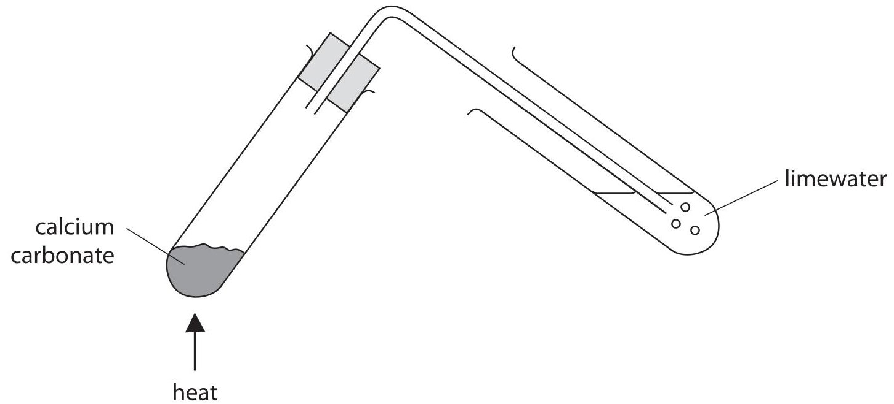

The equation for the reaction taking place in the heated tube is

$$
\mathrm {C a C O} _ {3} (\mathrm {s}) \rightarrow \mathrm {C a O} (\mathrm {s}) + \mathrm {C O} _ {2} (\mathrm {g})
$$

(a) What type of chemical reaction is taking place when calcium carbonate is heated?

A dehydration

B oxidation

reduction

D thermal decomposition

(b) State the appearance of the limewater before and after the gas was bubbled through it.

appearance before

appearance after

(c) The Taj Mahal is a famous building in India. It is made out of a form of calcium carbonate called marble.

The appearance of the marble has changed gradually over the years because of the effects of sulfur dioxide in the atmosphere.

Describe how sulfur dioxide has caused this change in appearance.

(Total for Question 2 = 6 marks)

3 The table gives information about barium salts.

<table border="1"><tr><td>Barium salt</td><td>Formula</td><td>Solubility in water</td><td>Toxic(poisonous)</td></tr><tr><td>barium chloride</td><td></td><td>soluble</td><td>yes</td></tr><tr><td>barium nitrate</td><td>Ba(NO3)2</td><td>soluble</td><td>yes</td></tr><tr><td>barium carbonate</td><td></td><td>insoluble</td><td>no</td></tr><tr><td>barium sulfate</td><td>BaSO4</td><td>insoluble</td><td>no</td></tr></table>

(a) Complete the table by giving the formula of barium chloride and of barium carbonate.

(b) The human stomach contains hydrochloric acid.

Suggest why barium carbonate may cause poisoning when it enters the stomach.

(c) Before patients have stomach X-rays they are given a barium salt to swallow. Which salt in the table is safe to use?

(d) A student accidentally swallowed a small amount of barium hydroxide solution, which is poisonous.

Suggest a reason why a solution of magnesium sulfate could be given to the student to swallow as a first aid treatment. Write a word equation for the reaction that takes place.

Reason.

Word equation

(e) The table gives information about the first five elements in Group 2 of the Periodic Table.

<table border="1"><tr><td>Element</td><td>Atomic number</td><td>Reaction with cold water</td><td>Reaction with air</td></tr><tr><td>beryllium</td><td>4</td><td>no reaction</td><td>burns when strongly heated</td></tr><tr><td>magnesium</td><td>12</td><td>reacts very slowly</td><td>burns when heated</td></tr><tr><td>calcium</td><td>20</td><td>reacts slowly</td><td>reacts slowly without heating</td></tr><tr><td>strontium</td><td>38</td><td>reacts quickly</td><td>reacts quickly without heating</td></tr><tr><td>barium</td><td>56</td><td></td><td></td></tr></table>

Use the information in the table to help you answer the questions.

(i) Suggest how barium reacts with cold water and with air.

Reaction with cold water

Reaction with air

(ii) Use your answer to (e)(i) to suggest how barium should be stored.

(iii) Suggest a connection between the atomic number and the reactivity of the elements in Group 2.

(Total for Question 3 = 12 marks)

4 This question is about the extraction and uses of aluminium.

(a) Aluminium is extracted from aluminium oxide by electrolysis.

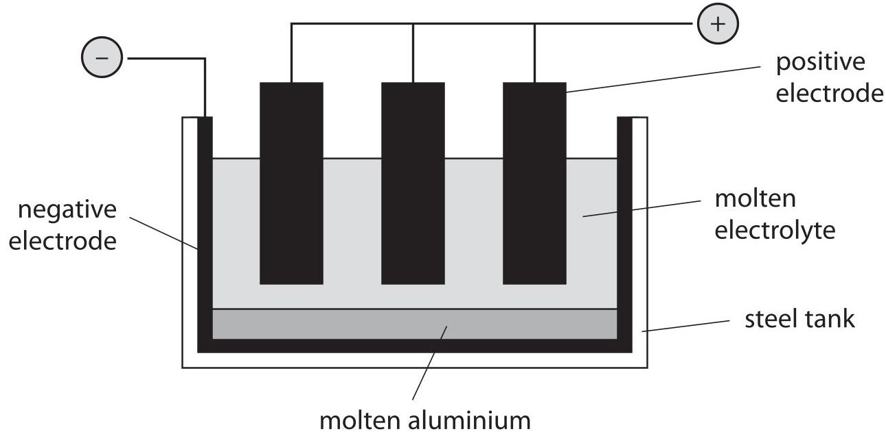

What are the electrodes made of?

Negative electrode

Positive electrode

(b) (i) Explain why the operating temperature would need to be very high if pure aluminium oxide were used as the electrolyte.

(ii) Describe how the operating temperature is kept low.

(c) The ionic half-equation for the reaction at the negative electrode is

$$
\mathrm {A l} ^ {3 +} + 3 \mathrm {e} ^ {-} \rightarrow \mathrm {A l}
$$

What type of reaction is occurring at the negative electrode? Explain your answer.

(d) The waste gases escaping from the electrolysis cell contain carbon dioxide. Describe how the carbon dioxide is formed.

(e) Aluminium is used to make cans for food and drinks.

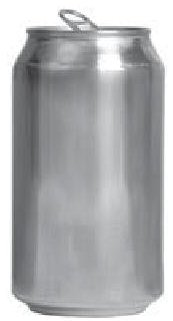

State two properties of aluminium that make it suitable for this use. You should not refer to cost in your answers.

(Total for Question 4 = 10 marks)

5 (a) Explain what is meant by the term isomerism.

(b) The displayed formula of heptane $ \left( \mathrm{C}_{7} \mathrm{H}_{1 6} \right) $ is

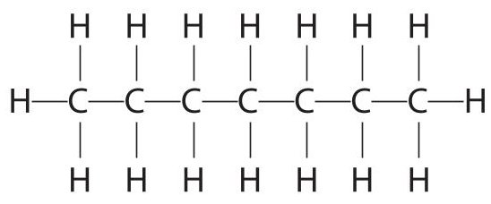

Which one of the displayed formulae below does not represent an isomer of heptane? Place a cross ( $ \times $ ) in the box to indicate your answer.

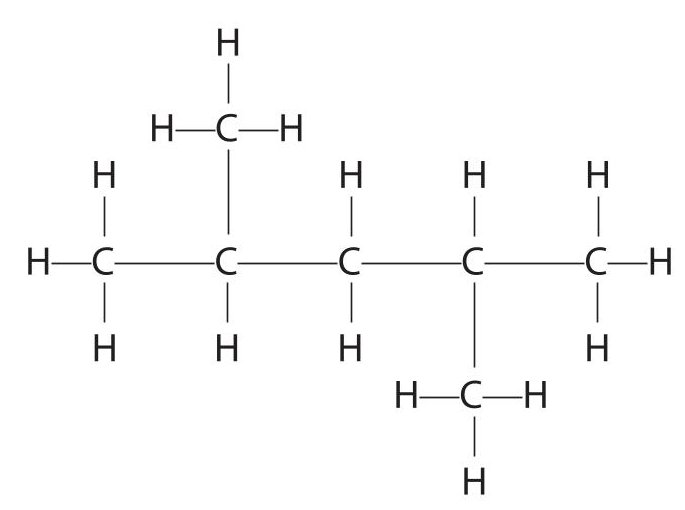

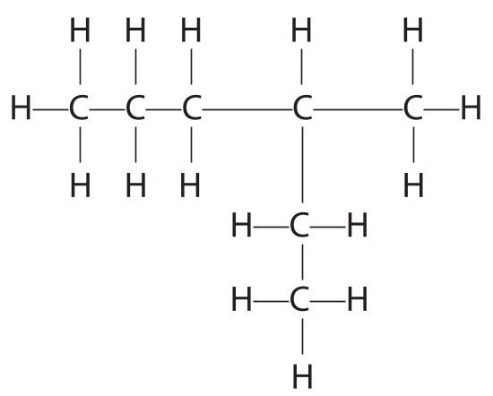

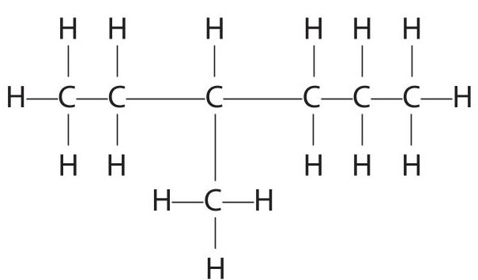

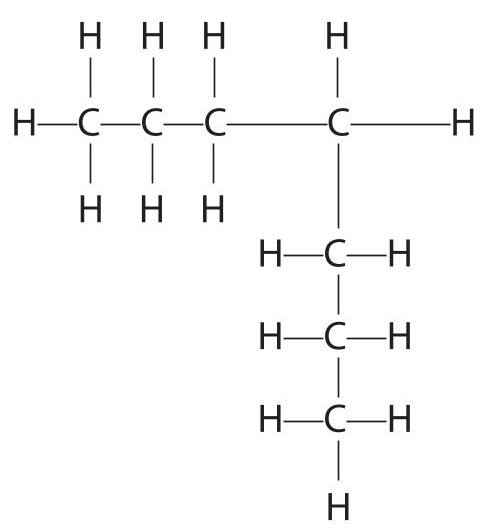

(c) Heptane belongs to a homologous series of compounds called alkanes. The general formula of the alkanes is $ C_{n} H_{2 n+2} $

(i) Heptene belongs to a homologous series of compounds called alkenes. Give the general formula of the alkenes.

(ii) Complete the following diagram to show the structural formula of heptene $ \mathrm{(C_{7}H_{14})} $ by inserting lines to represent the covalent bonds between the carbon atoms.

$$
\begin{array}{c c c c c c c} H & H & H & H & H & H \\ | & | & | & | & | \\ C & C & C & C & C & C \\ | & & | & | & | \\ H & & H & H & H & H \end{array}
$$

(d) When heptene is added to bromine water, and the mixture is shaken, a reaction occurs.

State the type of reaction and give the colour of the bromine water before and after the reaction with heptene.

Type of reaction.

Colour before..

Colour after..

(e) Explain, in terms of the bonds present, why heptane is described as saturated and heptene as unsaturated.

(Total for Question 5 = 11 marks)

## BLANK PAGE

6 The table gives information about the first four elements in Group 7 of the Periodic Table.

<table border="1"><tr><td>Element</td><td>Atomic number</td><td>Electronic configuration</td><td>Physical state at 20℃</td><td>Colour at 20℃</td></tr><tr><td>fluorine</td><td>9</td><td>2.7</td><td>gas</td><td>pale yellow</td></tr><tr><td>chlorine</td><td>17</td><td>2.8.7</td><td>gas</td><td>pale green</td></tr><tr><td>bromine</td><td>35</td><td>2.8.18.7</td><td>liquid</td><td>red-brown</td></tr><tr><td>iodine</td><td>53</td><td>2.8.18.18.7</td><td>solid</td><td>dark grey</td></tr></table>

(a) Astatine (At) has an atomic number of 85 and is the fifth element in Group 7. It is possible to make predictions about astatine by comparison with the other elements in Group 7.

(i) How many electrons does an atom of astatine have in its outer shell?

(ii) What physical state and colour would you expect for astatine at $ 2 0^{\circ} \mathrm{C}? $

Physical state

Colour.

(iii) Predict the formula of the compound formed between astatine and hydrogen. Suggest a name for this compound.

Formula

Name ...

(iv) Suggest how the reactivity of astatine compares to that of iodine. Explain your answer.

(b) Chlorine gas can be prepared by heating a mixture of concentrated hydrochloric acid and manganese(IV) oxide using this apparatus.

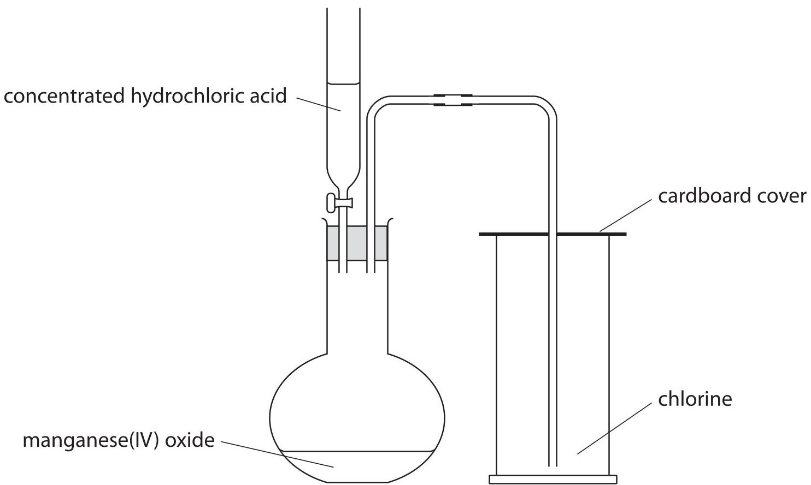

(i) Balance the equation for the reaction.

$$
\mathrm {H C l} (\mathrm {a q}) + \mathrm {M n O} _ {2} (\mathrm {s}) \rightarrow \mathrm {M n C l} _ {2} (\mathrm {a q}) + \mathrm {H} _ {2} \mathrm {O} (\mathrm {l}) + \mathrm {C l} _ {2} (\mathrm {g})
$$

(ii) State what you would observe when a piece of damp litmus paper is placed into the gas jar containing chlorine.

(c) Chlorine can be used to obtain bromine $ \left(\mathrm{B r}_{2}\right) $ from sea water.

Sea water contains bromide ions, Br $ ^{一} $

The pH of sea water is usually within the range of 7.5 to 8.4

The stages in the extraction of bromine from sea water are

Stage1 The pH of the sea water is lowered to about 3.5

Stage 2 An excess of chlorine is bubbled through the sea water

Stage 3 The bromine $ \mathrm{(B r_{2})} $ is removed from the mixture and reacted with sulfur dioxide $ \mathrm{(S O_{2})} $ and water. This reaction converts the bromine to hydrogen bromide (HBr) and sulfuric acid $ \mathrm{(H_{2} S O_{4})} $

Stage 4 The hydrogen bromide is reacted with chlorine to form bromine $ \left(\mathrm{B r}_{2}\right) $

(i) Suggest a substance that could be added to lower the pH of sea water in Stage 1.

(ii) Why is an excess of chlorine added in Stage 2?

(iii) Write a chemical equation for the reaction in Stage 3.

(iv) Write a chemical equation for the reaction in Stage 4.

(d) State the colour change observed when bromine is added to an aqueous solution of potassium iodide.

Colour of potassium iodide solution at start...

Colour of final reaction mixture...

(Total for Question 6 = 16 marks)

## BLANK PAGE

7 Some students investigated the rate of the reaction between marble chips (calcium carbonate) and dilute hydrochloric acid.

(a) The equation for the reaction is

$$
\mathrm {C a C O} _ {3} (\dots \dots \dots) + 2 \mathrm {H C l} (\dots \dots \dots) \rightarrow \mathrm {C a C l} _ {2} (\dots \dots \dots) + \mathrm {H} _ {2} \mathrm {O} (\dots \dots \dots) + \mathrm {C O} _ {2} (\dots \dots \dots)
$$

Insert state symbols after each formula.

(b) One of the students used this apparatus.

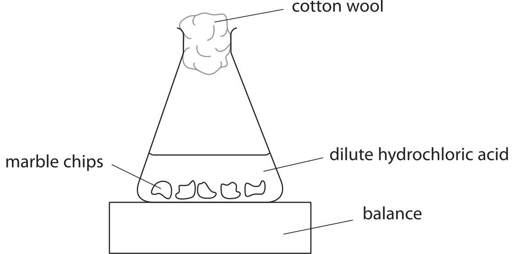

(i) What is the purpose of the cotton wool?

(ii) He recorded the total mass of the conical flask and contents every 30 seconds for several minutes. He plotted the results as a graph of total mass (y-axis) against time.

Which of the graphs could represent his results?

Put a cross ( $ \times $ ) in a box to indicate your answer.

(1) 

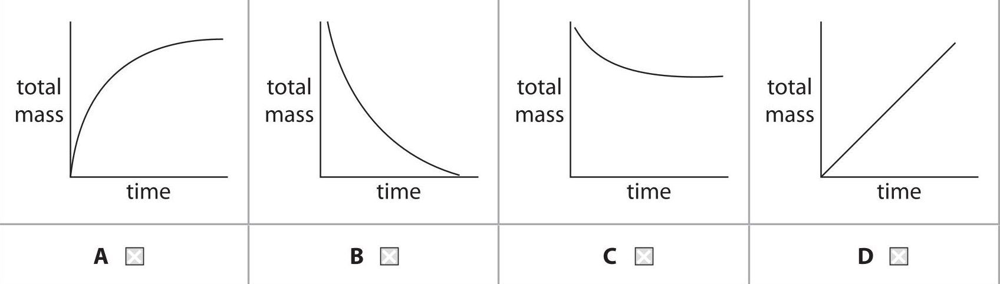

(c) Another student carried out three experiments to investigate the effect of changing the concentration and temperature of hydrochloric acid on the rate of reaction.

She kept the number and size of marble chips the same in each experiment.

The marble chips were in excess.

In each experiment she measured the volume of gas collected at different times, using this apparatus.

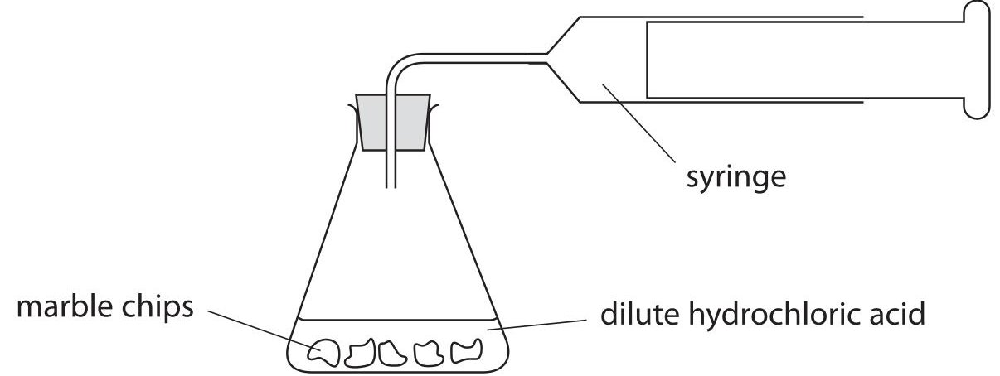

The graph shows the results of her experiments.

Volume of gas collected in $ \mathrm{c m^{3}} $

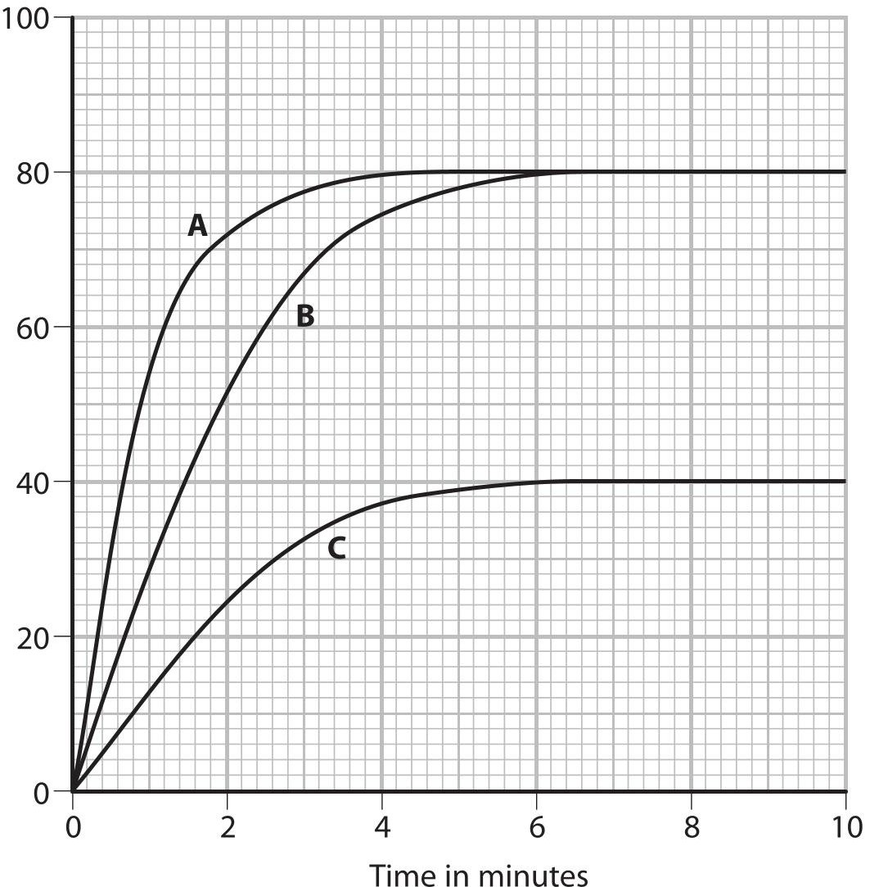

(i) Experiments A and B represent experiments using the same concentration of hydrochloric acid but at different temperatures.

Which letter represents the experiment at the higher temperature?

Give a reason for your choice.

## Letter

Reason

(ii) Experiments B and C represent experiments at the same temperatures and using the same volumes of hydrochloric acid.

The concentration of hydrochloric acid used in experiment B is 0.20 mol/dm $ ^{3} $

What is the concentration of hydrochloric acid used in experiment C?

Explain how you worked out your answer.

Concentration

Explanation

<table border="1"><tr><td>Rate of reaction in $ \mathrm{c m^{3}/min} $</td><td>4.0</td><td>9.0</td><td>13.5</td><td>18.5</td><td>23.0</td></tr><tr><td>Concentration of acid in mol/dm3</td><td>0.4</td><td>0.8</td><td>1.2</td><td>1.6</td><td>2.0</td></tr></table>

Plot these results on the grid. Draw a straight line of best fit through the points.

Rate of reaction in $ \mathrm{c m^{3} / m i n} $

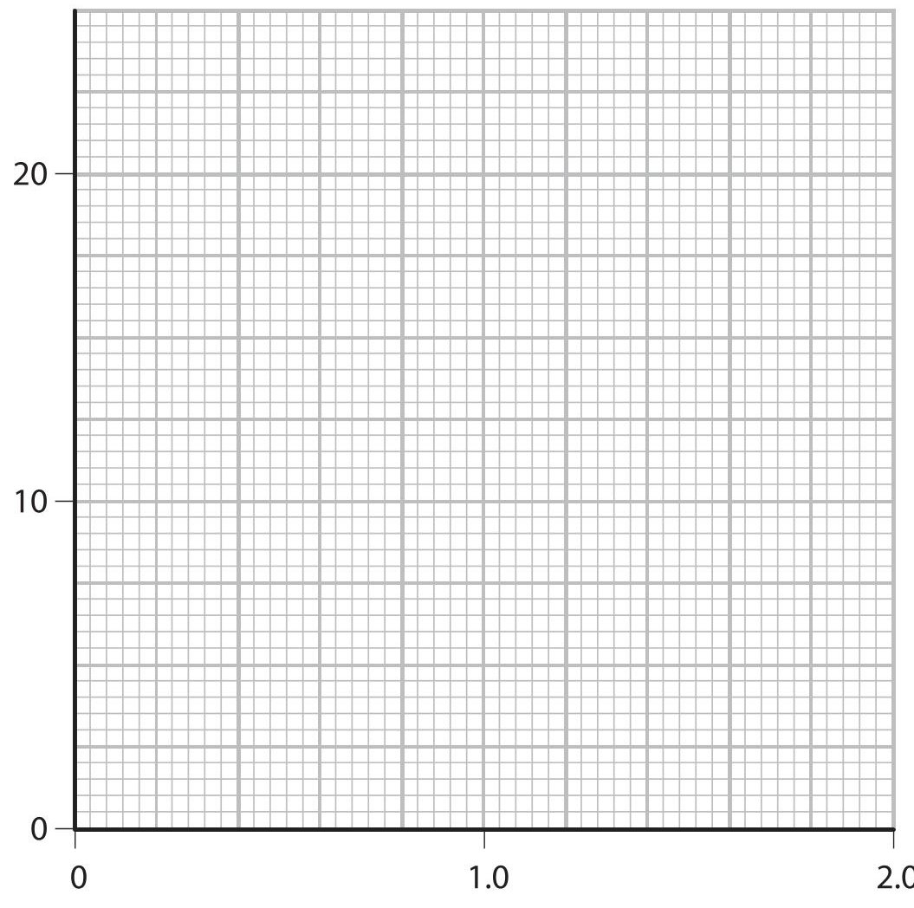

Concentration of acid in mol/dm $ ^{3} $

(ii) Describe the relationship between rate of reaction and concentration of acid shown by the graph.

(2) 

(iii) Explain why increasing the concentration has this effect on the rate of reaction.

(Total for Question 7 = 16 marks)

8 A student was asked by his teacher to perform a flame test on a solid. He used this method.

- dip the tip of a clean platinum wire into hydrochloric acid and then into the solid

- adjust the air hole of the Bunsen burner to obtain a non-roaring, non-luminous Bunsen flame

- place the tip of the platinum wire into the edge of the flame

- observe the colour in the flame

(a) (i) Why is it important that the platinum wire is clean?

(ii) Why is it important to use a non-luminous flame?

(iii) What colour would be observed in the flame if the solid contained sodium ions? (1)

(b) Another student was given a pale violet solid. He was told that it contained two cations (positive ions) from this list

$$
\mathrm {L i} ^ {+} \quad \mathrm {C a} ^ {2 +} \quad \mathrm {F e} ^ {2 +} \quad \mathrm {N H} _ {4} ^ {+} \quad \mathrm {F e} ^ {3 +}
$$

He performed a flame test on the solid.

He then dissolved a small sample of the solid in water. A yellow solution was formed. He added sodium hydroxide solution and then warmed the mixture.

The table shows his observations.

<table border="1"><tr><td>Test</td><td>Observation</td></tr><tr><td>flame test</td><td>no positive result</td></tr><tr><td>add sodium hydroxide solution and warm</td><td>brown precipitatea pungent-smelling gas was evolvedthe gas turned damp red litmus paper blue</td></tr></table>

(i) The flame test gave no positive result.

State the two cations from the list that are not present in the solid.

(ii) Identify the pungent-smelling gas given off and explain why the red litmus paper must be damp before it is used.

(iii) Identify the two cations present in the pale violet solid.

(Total for Question 8 = 8 marks)

9 The piece of apparatus shown contains 0.010 mol/dm $ ^{3} $ hydrochloric acid.

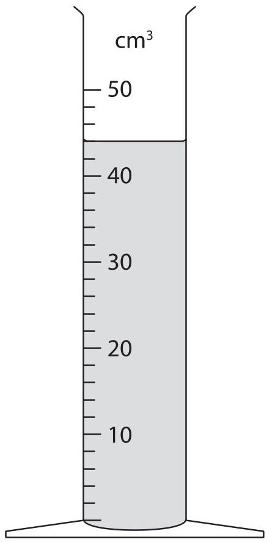

(a) (i) Give the name of this piece of apparatus.

(ii) What volume of hydrochloric acid is in the apparatus?

(iii) Use your answer in (a)(ii) to calculate the amount, in moles, of hydrochloric acid in the apparatus.

(b) A student poured a solution containing 0.010 mol of hydrochloric acid into a beaker. He then added 0.0075 mol of zinc powder and collected the hydrogen given off in a gas syringe.

The equation for the reaction is

$$
\mathrm {Z n} (\mathrm {s}) + 2 \mathrm {H C l} (\mathrm {a q}) \rightarrow \mathrm {Z n C l} _ {2} (\mathrm {a q}) + \mathrm {H} _ {2} (\mathrm {g})
$$

Is the zinc or the hydrochloric acid in excess? Explain your answer.

(c) The student repeated the experiment with 0.0075 mol of magnesium powder with the same total surface area as the zinc.

The equation for the reaction is

$$
\mathrm {M g} (\mathrm {s}) + 2 \mathrm {H C l} (\mathrm {a q}) \rightarrow \mathrm {M g C l} _ {2} (\mathrm {a q}) + \mathrm {H} _ {2} (\mathrm {g})
$$

(i) What effect would this change have on the rate at which the hydrogen is given off?

(ii) What effect would this change have on the volume of hydrogen produced?

10 Ammonia $ \mathrm{(N H_{3})} $ can be made by reacting nitrogen and hydrogen, in the presence of an iron catalyst, according to the equation

$$
\mathrm {N} _ {2} (\mathrm {g}) + 3 \mathrm {H} _ {2} (\mathrm {g}) \rightleftharpoons 2 \mathrm {N H} _ {3} (\mathrm {g}) \quad \Delta H = - 9 2 \mathrm {k J / m o l}
$$

The reaction is reversible and the reaction mixture can, if left for long enough, reach a position of dynamic equilibrium.

The graph shows how the percentage of ammonia at equilibrium depends on the temperature and pressure used.

Percentage of ammonia at equilibrium

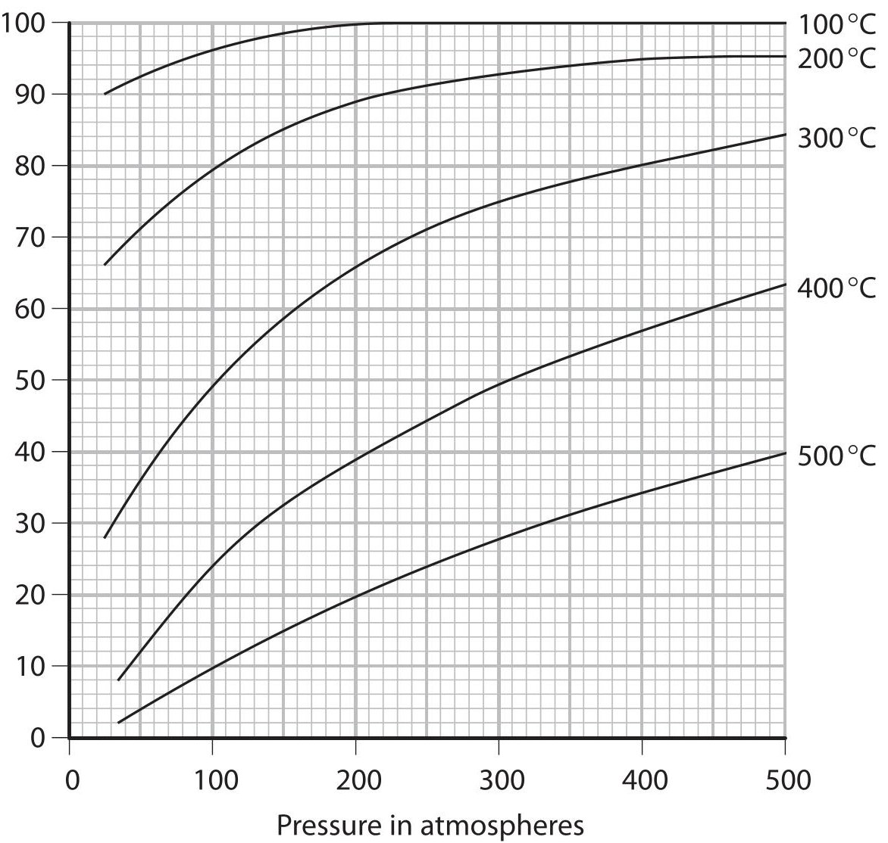

(a) State two features of a reaction mixture that is in dynamic equilibrium.

(b) (i) Use the graph to state the effect on the percentage of ammonia at equilibrium of the following changes

- an increase in temperature at constant pressure

- an increase in pressure at constant temperature.

Write your answers in the table.

<table border="1"><tr><td></td><td>Effect on percentage of ammonia at equilibrium</td></tr><tr><td>increase in temperature</td><td></td></tr><tr><td>increase in pressure</td><td></td></tr></table>

(ii) Explain why these changes have the effects you have given in (b)(i).

Increase in temperature.

Increase in pressure.

(c) The reaction between nitrogen and hydrogen is used to manufacture ammonia in the Haber process. This process operates at a pressure of 200 atmospheres and a temperature of $ 4 5 0^{\circ} \mathrm{C} $ , with an iron catalyst.

If the reaction mixture reached a position of equilibrium, the expected yield of ammonia would be about 30%.

The actual yield of ammonia obtained in the Haber process is about 15%.

(i) Suggest why the actual yield of ammonia is lower than the expected yield.

(ii) How is the ammonia separated from the unreacted nitrogen and hydrogen?

(iii) What happens to the unreacted nitrogen and hydrogen?

(d) The reaction would be faster if a higher temperature were used. Suggest why a higher temperature is not used in the Haber process.

(e) The equation for the formation of ammonia is

$$
\mathrm {N} _ {2} (\mathrm {g}) + 3 \mathrm {H} _ {2} (\mathrm {g}) \rightleftharpoons 2 \mathrm {N H} _ {3} (\mathrm {g})
$$

(i) Calculate the amount, in moles, of ammonia, that could be formed in the Haber process from 112 kilograms of nitrogen, assuming all the nitrogen is converted into ammonia.

(ii) Only 15% of the nitrogen is converted into ammonia.

Calculate the actual amount, in moles, of ammonia that is formed from 112 kilograms of nitrogen.

(Total for Question 10 = 15 marks)

11 A student burned four liquid fuels in order to compare the amount of energy they released, in the form of heat.

She used this apparatus.

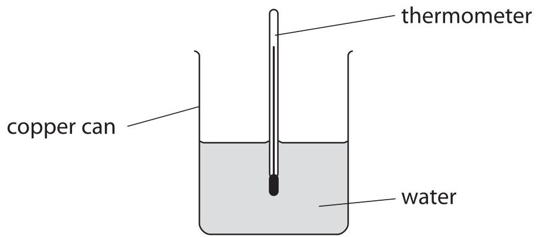

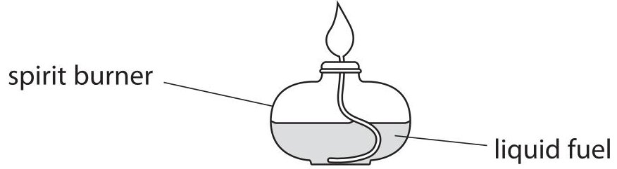

The energy released when each fuel was burned was used to raise the temperature of 100 g of water. For each fuel, the student recorded the mass of fuel burned and the increase in temperature of the water.

Her results are shown in the table.

<table border="1"><tr><td>Fuel</td><td>Average relative formula mass</td><td>Mass of fuel burned in g</td><td>Amount of fuel burned in mol</td><td>Increase in temperature in $ ^{\circ} \mathrm{C} $</td></tr><tr><td>diesel</td><td>170</td><td>4</td><td>0.024</td><td>15</td></tr><tr><td>ethanol</td><td>46</td><td>3</td><td>0.065</td><td>10</td></tr><tr><td>methanol</td><td>32</td><td>2</td><td>0.063</td><td>5</td></tr><tr><td>petrol</td><td>114</td><td>1</td><td>0.009</td><td>4</td></tr></table>

The best fuel is the one that releases the most energy.

(a) The student suggested that petrol was the best fuel.

Explain why, using the information in the table.

(b) Another student suggested that diesel was the best fuel. Explain why, using the information in the table.

(c) In another experiment, a student burned propanol and then used his results to calculate the energy released when one mole of propanol was burned.

He then compared his result with a value from a data book.

The values are shown in the table.

<table border="1"><tr><td></td><td>Energy released per mole of propanol burned in kJ</td></tr><tr><td>Student&#x27;s result</td><td>1020</td></tr><tr><td>Data book value</td><td>2010</td></tr></table>

Suggest two reasons why the student's result is lower than the data book value.

(d) The diagram shows the energy profile for burning a fuel.

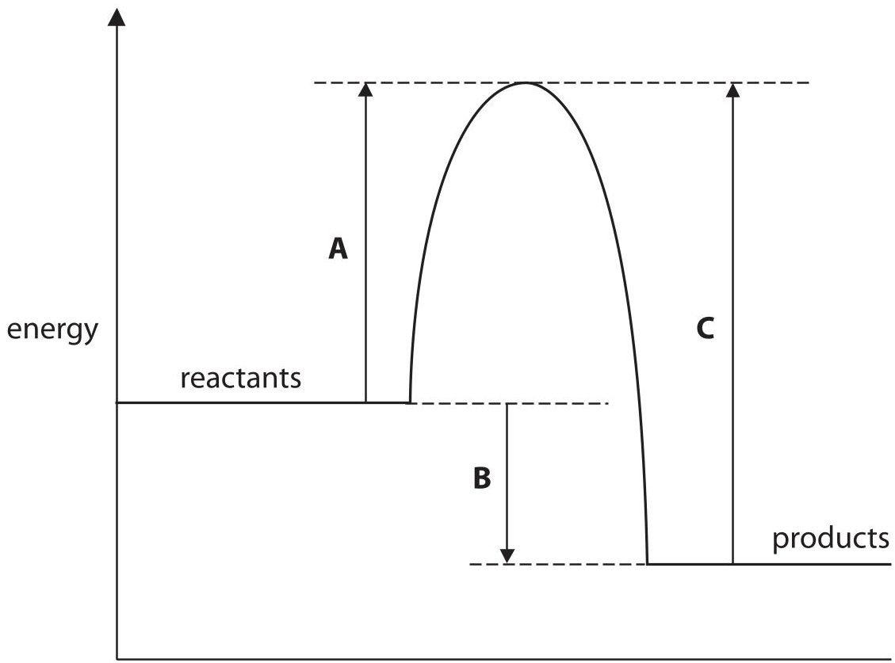

Which of the energy changes A, B or C represents

- the activation energy for the reaction

- the amount of energy given out during the reaction?

Activation energy =

Energy released =

(e) Explain, in terms of bond breaking and bond making, why this reaction gives out energy.

(Total for Question 11 = 9 marks)

TOTAL FOR PAPER = 120 MARKS

## BLANK PAGE

## BLANK PAGE

## BLANK PAGE

