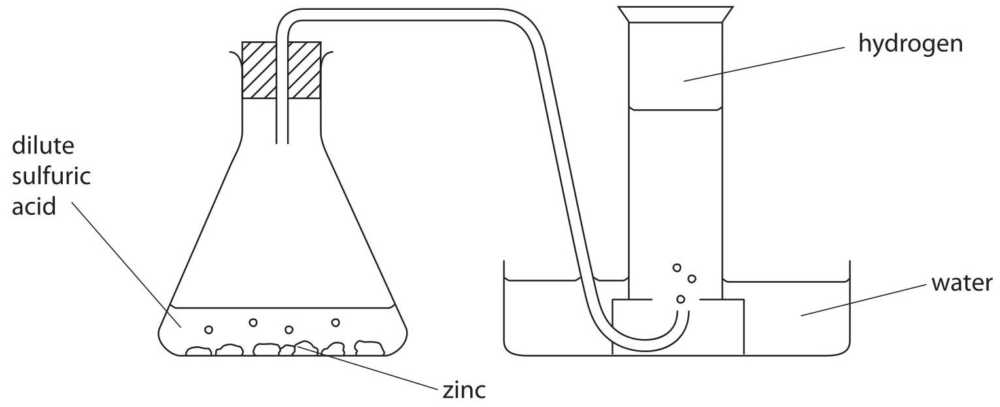
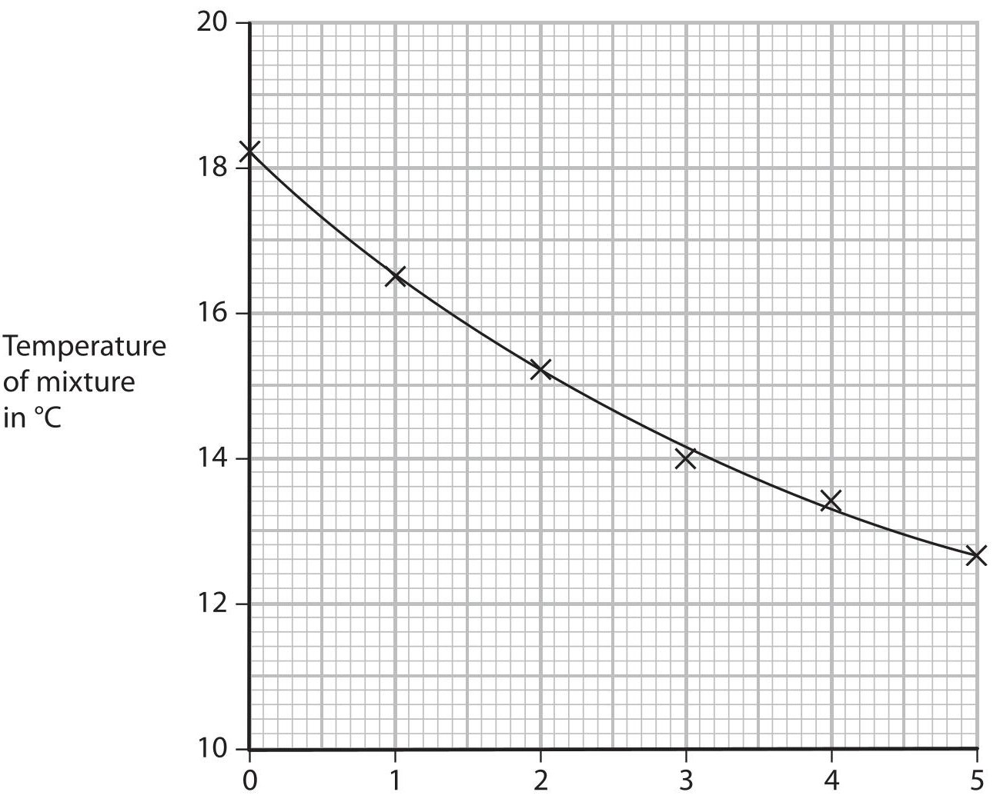
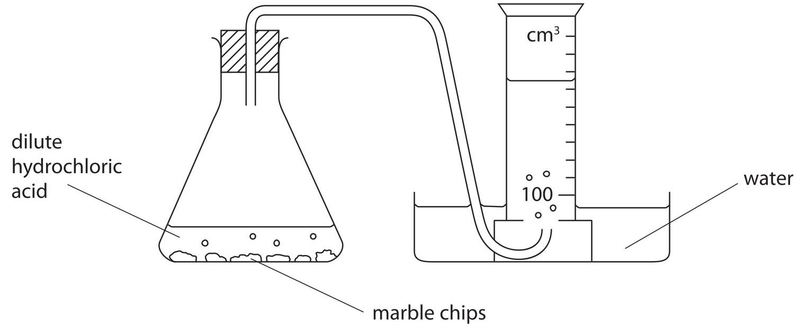
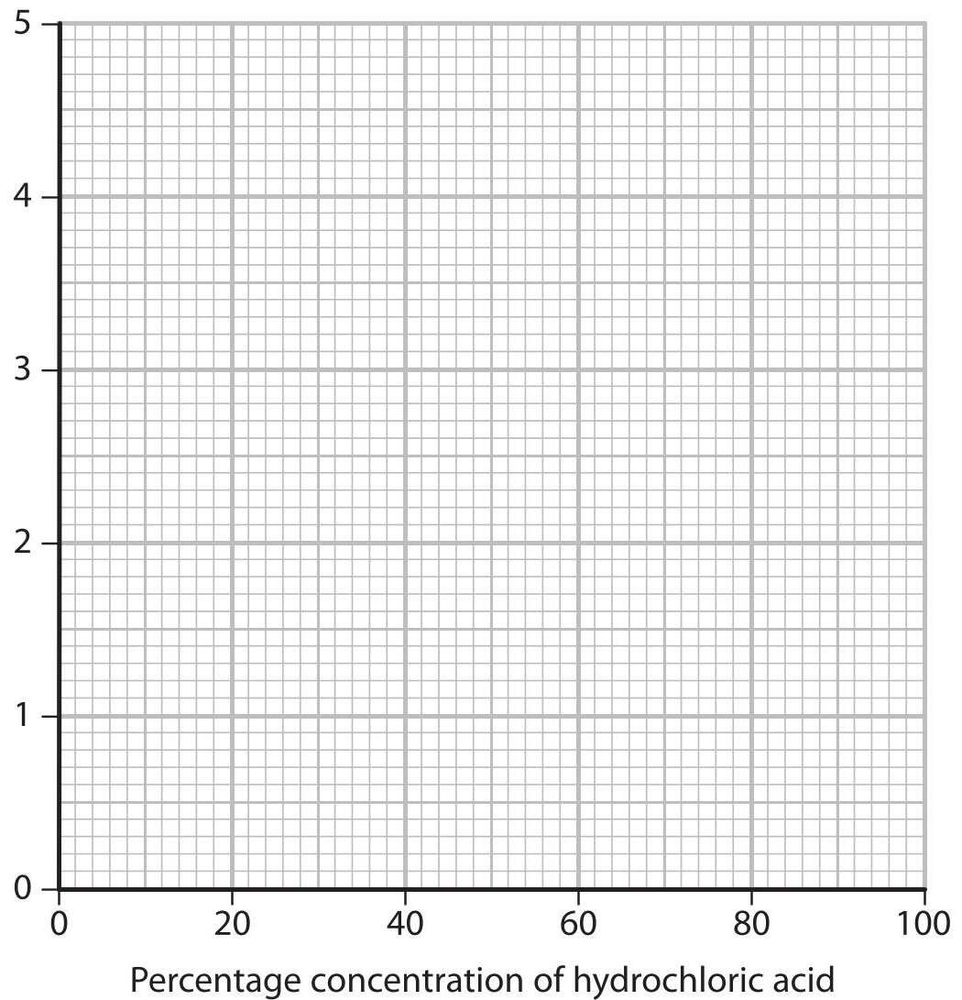
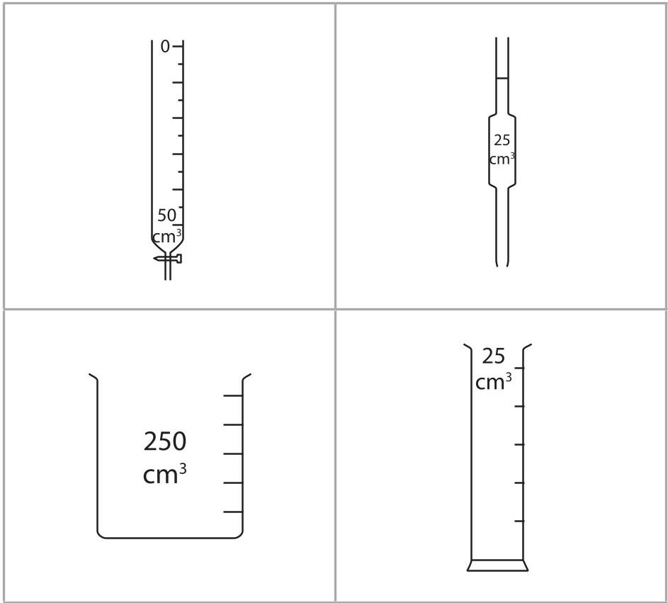
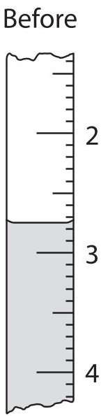
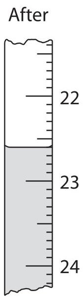
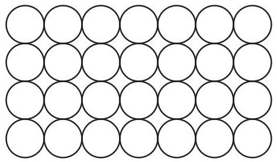
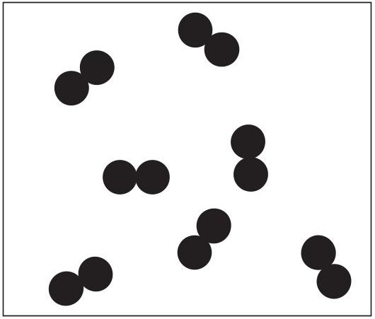
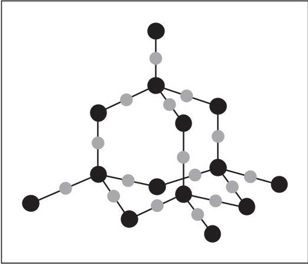

<table><tr><td colspan="2">Write your name here</td></tr><tr><td>Surname</td><td>Other names</td></tr><tr><td>Edexcel Certificate</td><td>Centre Number</td><td>Candidate Number</td></tr><tr><td>Edexcel International GCSE</td><td></td><td></td></tr><tr><td colspan="3">Chemistry</td></tr><tr><td colspan="3">Unit: KCH0/4CH0
Science (Double Award) KSC0/4SC0
Paper: 1C</td></tr><tr><td colspan="2">Monday 20 May 2013 – Afternoon
Time: 2 hours</td><td>Paper Reference
KCH0/1C 4CH0/1C
KSC0/1C 4SC0/1C</td></tr><tr><td colspan="3">You must have:
Calculator, ruler</td><td>Total Marks</td></tr></table>

## Instructions

- Use black ink or ball-point pen.

- Fill in the boxes at the top of this page with your name, centre number and candidate number.

- Answer all questions.

- Answer the questions in the spaces provided

- there may be more space than you need.

- Show all the steps in any calculations and state the units.

- Some questions must be answered with a cross in a box. If you change your mind about an answer, put a line through the box and then mark your new answer with a cross.

## Information

- The total mark for this paper is 120.

- The marks for each question are shown in brackets

- use this as a guide as to how much time to spend on each question.

## Advice

- Read each question carefully before you start to answer it.

- Keep an eye on the time.

- Write your answers neatly and in good English.

- Try to answer every question.

- Check your answers if you have time at the end.

## THE PERIODIC TABLE
<table class="table table-bordered"><thead><tr><th>1</th><th>2</th><th>3</th><th>4</th><th>5</th><th>6</th><th>7</th><th>8</th><th>9</th><th>10</th><th>11</th><th>12</th><th>13</th><th>14</th><th>15</th><th>16</th><th>17</th><th>18</th></tr></thead><tbody><tr><td>7</td><td>Li</td><td>3</td><td>9</td><td>Be</td><td>Beryllium</td><td></td><td></td><td></td><td></td><td></td><td></td><td></td><td></td><td></td><td></td><td></td><td></td><td></td></tr><tr><td>23</td><td>Na</td><td>11</td><td>24</td><td>Mg</td><td>Magnesium</td><td></td><td></td><td></td><td></td><td></td><td></td><td></td><td></td><td></td><td></td><td></td><td></td><td></td></tr><tr><td>39</td><td>K</td><td>19</td><td>40</td><td>Ca</td><td>Calcium</td><td>45</td><td>Sc</td><td>Scandium</td><td>48</td><td>Ti</td><td>Titanium</td><td>51</td><td>V</td><td>Vanadium</td><td>52</td><td>Cr</td><td>Chromium</td><td>55</td><td>Mn</td><td>Manganese</td><td>56</td><td>Fe</td><td>Iron</td><td>59</td><td>Co</td><td>Cobalt</td><td>27</td><td>Ni</td><td>Nickel</td><td>28</td><td>63.5</td><td>Cu</td><td>Copper</td><td>29</td><td>Zn</td><td>Zinc</td><td>30</td><td>70</td><td>Ga</td><td>Gallium</td><td>31</td><td>73</td><td>Ge</td><td>Germanium</td><td>32</td><td>75</td><td>As</td><td>Arsenic</td><td>33</td><td>79</td><td>Se</td><td>Selenium</td><td>34</td><td>80</td><td>Br</td><td>Bromine</td><td>35</td><td>84</td><td>Kr</td><td>Krypton</td><td>36</td></tr><tr><td>86</td><td>Rb</td><td>Rubidium</td><td>37</td><td>88</td><td>Sr</td><td>Strontium</td><td>89</td><td>Y</td><td>Yttrium</td><td>91</td><td>Zr</td><td>Zirconium</td><td>40</td><td>93</td><td>Nb</td><td>Niobium</td><td>94</td><td>Mo</td><td>Molybdenum</td><td>42</td><td>99</td><td>Tc</td><td>Technetium</td><td>43</td><td>101</td><td>Ru</td><td>Ruthenium</td><td>44</td><td>103</td><td>Rh</td><td>Rhodium</td><td>45</td><td>106</td><td>Pd</td><td>Palladium</td><td>46</td><td>108</td><td>Ag</td><td>Silver</td><td>47</td><td>112</td><td>Cd</td><td>Cadmium</td><td>48</td><td>115</td><td>In</td><td>Indium</td><td>49</td><td>119</td><td>Sn</td><td>Tin</td><td>50</td><td>122</td><td>Sb</td><td>Antimony</td><td>51</td><td>128</td><td>Te</td><td>Tellurium</td><td>52</td><td>127</td><td>I</td><td>Iodine</td><td>53</td><td>131</td><td>Xe</td><td>Xenon</td><td>54</td></tr><tr><td>133</td><td>Cs</td><td>Caesium</td><td>55</td><td>137</td><td>Ba</td><td>Barium</td><td>139</td><td>La</td><td>Lanthanum</td><td>179</td><td>Hf</td><td>Hafnium</td><td>72</td><td>181</td><td>Ta</td><td>Tantalum</td><td>173</td><td>W</td><td>Tungsten</td><td>74</td><td>186</td><td>Re</td><td>Rhenium</td><td>75</td><td>190</td><td>Os</td><td>Osmium</td><td>76</td><td>192</td><td>Ir</td><td>Iridium</td><td>77</td><td>195</td><td>Pt</td><td>Platinum</td><td>78</td><td>197</td><td>Au</td><td>Gold</td><td>79</td><td>201</td><td>Hg</td><td>Mercury</td><td>80</td><td>204</td><td>Ti</td><td>Thallium</td><td>81</td><td>207</td><td>Pb</td><td>Lead</td><td>82</td><td>209</td><td>Bi</td><td>Bismuth</td><td>83</td><td>210</td><td>Po</td><td>Polonium</td><td>84</td><td>210</td><td>At</td><td>Astatine</td><td>85</td><td>222</td><td>Rn</td><td>Radon</td><td>86</td></tr><tr><td>223</td><td>Fr</td><td>Francium</td><td>87</td><td>226</td><td>Ra</td><td>Radium</td><td>88</td><td>Ac</td><td>Actinium</td><td>89</td><td></td><td>
## BLANK PAGE
## Answer ALL questions.
1 Boron is an element in Group 3 of the Periodic Table.
An atom of boron can be represented as $ ^{1 1} _ {5} \mathrm{B} $
(a) Use numbers from the box to complete the sentences about this atom of boron.
<table border="1"><tr><td>3</td><td>5</td><td>6</td><td>11</td><td>16</td></tr></table>
Each number may be used once, more than once or not at all.
(i) The atomic number of boron is ...
(ii) The mass number of boron is ...
(iii) This atom of boron contains ... protons.
(iv) This atom of boron contains neutrons.
(v) This atom of boron contains ... electrons.
(b) Aluminium is another element in Group 3 of the Periodic Table.
Select a word or phrase from the box to complete each sentence about an atom of aluminium.
<table border="1"><tr><td>fewer</td><td>more</td><td>the same number of</td></tr></table>
Each word or phrase may be used once, more than once or not at all.
(i) Compared to an atom of boron, an atom of aluminium has protons.
(ii) Compared to an atom of boron, an atom of aluminium has ... neutrons.
(iii) Compared to an atom of boron, an atom of aluminium has electrons in its outer shell.
(c) The electronic configuration of aluminium is
2 A student used this apparatus to make and collect a sample of hydrogen gas.

(a) The reaction in the flask can be shown by this word equation.
metal + acid $ \rightarrow $ salt + hydrogen
(i) The name of the salt formed in the student's experiment is
A zinc sulfate
B zinc sulfide
zinc sulfite
D zinc sulfur
(ii) The student could have used other metals in this experiment.
Place crosses ( $ \times $ ) in two boxes to show the names of two other metals that could be safely used to make hydrogen.
A copper
B iron
C magnesium
D potassium
E silver
(b) Describe a test to show that the gas collected is hydrogen.
(c) Water is formed when hydrogen combines with oxygen. Balance the equation for this reaction.
$$
\mathrm {H} _ {2} + \mathrm {O} _ {2} \rightarrow \mathrm {H} _ {2} \mathrm {O}
$$
(d) Equation 1 represents a reaction using cobalt(II) chloride that can be used to show a liquid contains water.
Equation 1
$$
\mathrm {C o C l} _ {2}. 2 \mathrm {H} _ {2} \mathrm {O} (\mathrm {s}) + 4 \mathrm {H} _ {2} \mathrm {O} (\mathrm {l}) \rightarrow \mathrm {C o C l} _ {2}. 6 \mathrm {H} _ {2} \mathrm {O} (\mathrm {s})
$$
In this reaction there is a colour change from blue to pink.
(i) Which word describes both cobalt compounds in equation 1?
A anhydrous
B aqueous
C hydrated
D saturated
(ii) When the product in equation 1 is gently heated, another reaction occurs. Equation 2 represents this reaction.
Equation 2
$$
\mathrm {C o C l} _ {2}. 6 \mathrm {H} _ {2} \mathrm {O} (\mathrm {s}) \rightarrow \mathrm {C o C l} _ {2}. 2 \mathrm {H} _ {2} \mathrm {O} (\mathrm {s}) + 4 \mathrm {H} _ {2} \mathrm {O} (\mathrm {g})
$$
What do equations 1 and 2 suggest about the reactions?
3 The halogens are elements in Group 7 of the Periodic Table. The halogens react with metals to form compounds called halides. Table 1 shows information about some halogens and their halides.
<table border="1"><tr><td>Halogen</td><td>Appearance at room temperature</td><td>Halide</td><td>Melting point in℃</td></tr><tr><td>chlorine</td><td>green gas</td><td>lithium chloride</td><td>605</td></tr><tr><td>bromine</td><td>red-brown liquid</td><td>sodium bromide</td><td>747</td></tr><tr><td>iodine</td><td>grey solid</td><td>potassium iodide</td><td>681</td></tr></table>

Table 1

(a) (i) Predict the physical state of fluorine at room temperature.
(ii) Predict how the colour of astatine at room temperature compares with the colour of iodine.
(b) Each of the halides in table 1 was dissolved in water to form a solution. A sample of each of the halogens was then added to some of the halide solutions. Table 2 shows the results.
<table border="1"><tr><td rowspan="2">Halide</td><td colspan="3">Halogen added</td></tr><tr><td>Chlorine</td><td>Bromine</td><td>Iodine</td></tr><tr><td>lithium chloride</td><td>not done</td><td>no reaction</td><td>no reaction</td></tr><tr><td>sodium bromide</td><td>orange solution</td><td>not done</td><td>no reaction</td></tr><tr><td>potassium iodide</td><td>brown solution</td><td>brown solution</td><td>not done</td></tr></table>

Table 2

(i) Suggest why there is no reason to add chlorine to lithium chloride solution.
(ii) Why was there no reaction when iodine was added to sodium bromide solution?
(iii) Name the substance with the brown colour that formed when chlorine was added to potassium iodide solution.
(iv) The reaction between bromine and potassium iodide solution is a displacement reaction.
What is the correct description of this reaction?
A bromide displaces iodide
B bromine displaces iodide
C bromide displaces iodine
D bromine displaces iodine
(v) Complete the chemical equation for the reaction between chlorine and potassium bromide solution.
$$
\mathrm {C l} _ {2} + 2 \mathrm {K B r} \rightarrow \dots \dots
4 Ethene can be converted into many useful substances.
(a) Draw a dot and cross diagram to show the covalent bonding in a molecule of ethene. Only the outer electrons in each atom need to be shown.
(b) Compound X is made from ethene and is used in cars to prevent the engine coolant from freezing in cold weather.
(i) Compound X contains 38.7% carbon, 9.7% hydrogen and 51.6% oxygen by mass. Calculate the empirical formula of X.
Empirical formula
(ii) The relative formula mass $ ( M_{r} ) $ of X is 62 What is the molecular formula of X?
(Total for Question 4 = 6 marks)
5 A student was asked to compare the industrial processes used to extract aluminium and iron from their ores.
(a) (i) Name the main ore used as the source of iron.
(ii) Aluminium is extracted from purified aluminium oxide. What is the formula of aluminium oxide?
(iii) One solid element is used in the extraction of both metals. Identify this element and state its purpose in the extraction of aluminium.
Element
(iv) One gaseous element takes part in a reaction needed in the extraction of iron. Identify this element and state its purpose in the extraction of iron.
Element
Purpose
(b) The student wrote this statement:
The extractions of aluminium and iron both involve reduction and oxidation reactions.
(i) What name is given to a reaction that involves both reduction and oxidation?
(ii) Why does this equation represent a reduction reaction?
$$
\mathrm {A l} ^ {3 +} + 3 \mathrm {e} ^ {-} \rightarrow \mathrm {A l}
$$
(iii) The equation for a reaction that occurs in some extractions of iron is
$$
\mathrm {C} + \mathrm {H} _ {2} \mathrm {O} \rightarrow \mathrm {C O} + \mathrm {H} _ {2}
$$
Identify the substance oxidised in this reaction, giving a reason for your choice.
Substance oxidised
Reason
(c) Both extractions occur at a high temperature. Neither extraction uses a catalyst.
(i) What is meant by the term catalyst?
(ii) State one reason why cryolite is used in the extraction of aluminium.
(d) Several equations can be written for the reactions occurring in the extractions.
(i) Write the chemical equation for the reaction between iron(III) oxide $ \mathrm{(F e_{2} O_{3})} $ and carbon monoxide (CO).
(ii) This equation represents a reaction used to remove impurities in the extraction of iron.
$$
\mathrm {C a O} + \mathrm {S i O} _ {2} \rightarrow \mathrm {C a S i O} _ {3}
$$
State the type of reaction occurring in this equation.
(iii) Complete the table by giving the common name for calcium silicate.
<table border="1"><tr><td>Formula of compound</td><td>Chemical name</td><td>Common name</td></tr><tr><td>CaO</td><td>calcium oxide</td><td>quicklime</td></tr><tr><td>CaSiO3</td><td>calcium silicate</td><td></td></tr></table>

(Total for Question 5 = 17 marks)

6 The table shows the structures of six organic compounds, A to F.
<table border="1"><tr><td>A</td><td>H
H-C-Br
H</td><td>H
C=C
H
H</td><td>C
CH3
CH3-C-CH3
CH3</td></tr><tr><td>D</td><td>H H
H-C-C-H
H H</td><td>H H H
H-C-C-C-H
H H H</td><td>F
H H H H H
H-C-C-C-C-C-H
H H H H H</td></tr></table>
(a) The letter of the compound in the table that is not shown as a displayed formula is.
(b) (i) State what is meant by the term hydrocarbon, and give the letter of one compound in the table that is not a hydrocarbon.
Hydrocarbon
Letter
(ii) State what is meant by the term unsaturated, and give the letter of one compound in the table that is unsaturated.
Unsaturated
Letter
(iii) State what is meant by the term isomers, and give the letters of two compounds in the table that are isomers of each other.
Isomers
Letters
(c) Some of the compounds in the table are members of the same homologous series.
(i) One feature of a homologous series is that adjacent members have formulae that differ by $ \mathrm{C H_{2}} $
State two other features of members of the same homologous series.
(ii) Give the letters of two adjacent members of the same homologous series shown in the table.
## Letters
(d) (i) Compound G has the molecular formula $ \mathrm{C_{2} H_{4} Br_{2}} $
It can be made from a compound in the table by a reaction that does not need UV light.
Draw the displayed formula of compound G.
(ii) Compound H reacts with bromine to form one of the compounds in the table. The reaction needs UV light.
Draw the displayed formula of compound H.
7 A teacher asked her students to suggest some experiments that could be done using chemicals found in the home. One student planned an experiment to measure the temperature change when baking soda is added to vinegar.
She wrote this plan.
- pour 100 $ cm^{3} $ of vinegar into a polystyrene cup
- weigh out five separate 1 g portions of baking soda
- measure the temperature of the vinegar
- add 1 g of baking soda to the vinegar and stir
- record the new temperature
- add the other portions of baking soda, stirring and recording the temperature after each portion is added
The graph shows her results.

Mass of baking soda added in grams
(a) The student said that the reaction in her experiment was not complete. How does the graph support her statement?
(b) The student used a polystyrene cup rather than a glass beaker. Why is it better to use a polystyrene cup?
(c) Vinegar contains ethanoic acid. Baking soda contains sodium hydrogencarbonate. The student found this equation for the reaction:
$$
\mathrm {C H} _ {3} \mathrm {C O O H} + \mathrm {N a H C O} _ {3} \rightarrow \mathrm {C H} _ {3} \mathrm {C O O N a} + \mathrm {H} _ {2} \mathrm {O} + \mathrm {C O} _ {2}
$$
(i) There is no colour change during this reaction.
Suggest one observation, other than the change in temperature, that could be made during the reaction.
(ii) The compound $ \mathrm{C H_{3} C O O H} $ is an acid and the compound $ \mathrm{C H_{3} C O O N a} $ is a salt. The graph shows that the temperature goes down during the reaction. Use this information to state the two types of reaction occurring.
(d) (i) Complete the energy level diagram by showing the products of the reaction.
$$
\text{Energy} \xrightarrow {\mathrm {C H} _ {3} \mathrm {C O O H} + \mathrm {N a H C O} _ {3}}
$$
(ii) Label the diagram to show the energy change, $ \Delta H $ , for the reaction.
(e) The student repeated the experiment using the same method with a different sample of vinegar. She recorded these results.
$$
\text{Volume of vinegar} = 1 0 0 \mathrm {c m} ^ {3}
$$
$$
\mathrm {M a s s o f b a k i n g s o d a} = 5. 0 \mathrm {g}
$$
$$
\text{Temperature at start} = 1 8. 7 ^ {\circ} \mathrm {C}
$$
$$
\text{Temperature at end} = 1 3. 2 ^ {\circ} \mathrm {C}
$$
(i) Calculate the heat energy change in this experiment using the expression heat energy change = volume of vinegar $ \times4.2\times $ temperature change
Heat energy change =
(ii) The student wanted to calculate the amount, in moles, of ethanoic acid in the vinegar.
Apart from the volume of vinegar, what other information would she need to be able to calculate the amount of ethanoic acid?
(Total for Question 7 = 10 marks)
## BLANK PAGE
8 A group of students investigated the reaction between marble chips (calcium carbonate) and dilute hydrochloric acid.
The equation for this reaction is
$$
\mathrm {C a C O} _ {3} (\mathrm {s}) + 2 \mathrm {H C l} (\mathrm {a q}) \rightarrow \mathrm {C a C l} _ {2} (\mathrm {a q}) + \mathrm {H} _ {2} \mathrm {O} (\mathrm {l}) + \mathrm {C O} _ {2} (\mathrm {g})
$$
They wanted to find the effect of changing the concentration of hydrochloric acid on the rate of reaction. The teacher provided a solution that she had labelled 100% hydrochloric acid.
The teacher told them to do all their experiments
- using different concentrations of hydrochloric acid made by diluting the 100% hydrochloric acid
- by timing how long it took to collect carbon dioxide
- at room temperature
The students used this apparatus.

(a) The students tried to keep the amount of calcium carbonate constant by using the same number of marble chips in each experiment.
State two other properties of the marble chips that should be the same in each experiment.
(b) The table shows how some of the students wrote down their results.
<table border="1"><tr><td>Student</td><td>Results</td></tr><tr><td>1</td><td>I used 6 marble chips and 100% hydrochloric acid and collected 100cm3of gas in 40 seconds.</td></tr><tr><td>2</td><td>In my experiment there were 6 marble chips and 80% hydrochloric acid and I collected 100cm3of carbon dioxide by the end of the experiment.</td></tr><tr><td>3</td><td>The marble chips and 60% hydrochloric acid formed 100cm3of gas in 70 seconds.</td></tr><tr><td>4</td><td>I used 40% hydrochloric acid and 6 marble chips.It took 105 seconds to collect the gas.</td></tr><tr><td>5</td><td>I collected 100cm3of gas in 135 seconds when I used 6 marble chips.</td></tr></table>
The teacher said that she could only use the results from student 1 because the other students had not recorded enough information.
Identify the piece of information that each student failed to record.
Student 2
Student 3
Student 4
Student 5
(c) The students repeated the experiment to make sure that it was a fair test. They used a different supply of hydrochloric acid. They all measured the time to collect $ 1 0 0 \mathrm{c m}^{3} $ of carbon dioxide and calculated the rate of each reaction.
Their results are shown in the table.
<table border="1"><tr><td>Percentage concentration of hydrochloric acid</td><td>Time to collect 100cm3of gas in seconds</td><td>Rate of reaction in cm3/s</td></tr><tr><td>20</td><td>66.7</td><td>1.5</td></tr><tr><td>40</td><td>52.6</td><td>1.9</td></tr><tr><td>60</td><td>34.5</td><td>2.9</td></tr><tr><td>70</td><td>30.3</td><td>3.3</td></tr><tr><td>80</td><td>25.6</td><td>3.9</td></tr><tr><td>100</td><td>20.8</td><td>4.8</td></tr></table>

(i) Plot these results on the grid and draw a straight line of best fit.

Rate of reaction in $ \mathrm{c m^{3}/s} $

(ii) One of the points is anomalous. Circle this point on the graph.

(iii) Suggest two errors in the experiment that could have caused this anomalous result.
(iv) Use your graph to estimate the rate of reaction using an acid concentration of 50%. Show on your graph how you obtained your answer.
(Total for Question 8 = 14 marks)
9 The diagram shows some pieces of apparatus used to measure volumes.

A student was given a large bottle containing sodium hydroxide solution and a supply of dilute sulfuric acid of known concentration.
He was allowed to use normal laboratory apparatus, including the pieces of apparatus shown in the diagram.
He was told to plan an experiment to find the concentration of the sodium hydroxide solution. This is his plan.
Step1 Obtain about 150 $ cm^{3} $ of each solution.
Step 2 Use a measuring cylinder to add exactly 25.0 $ cm^{3} $ of sodium hydroxide solution to a conical flask.
Step 3 Add a few drops of universal indicator to the conical flask.
Step 4 Use a burette to add the sulfuric acid to the conical flask until the indicator changes colour.
(a) (i) Give the name of the most suitable piece of apparatus in the diagram that should be used in Step 1.
(ii) Give the name of the piece of apparatus in the diagram that should be used instead of a measuring cylinder in Step 2.
(iii) State why universal indicator is not a good choice for this experiment and suggest an indicator that would be more suitable.
(iv) Why is a pipette not suitable for adding the acid in Step 4?
(b) The diagram shows the burette readings in one experiment before and after adding the acid.

Use the readings to complete the table, entering all values to the nearest 0.05 $ cm^{3}. $
<table border="1"><tr><td>Burette reading after adding acid in $ \mathrm{c m^{3}} $</td><td></td></tr><tr><td>Burette reading before adding acid in $ \mathrm{c m^{3}} $</td><td></td></tr><tr><td>Volume of acid added in $ \mathrm{c m^{3}} $</td><td></td></tr></table>
(c) The student repeated the experiment using a different concentration of sodium hydroxide solution and recorded these results.
<table border="1"><tr><td>Burette reading after adding acid in $ \mathrm{c m^{3}} $</td><td>24.90</td><td>25.85</td><td>24.85</td><td>25.55</td></tr><tr><td>Burette reading before adding acid in $ \mathrm{c m^{3}} $</td><td>1.20</td><td>2.75</td><td>1.50</td><td>2.10</td></tr><tr><td>Volume of acid added in $ \mathrm{c m^{3}} $</td><td>23.70</td><td>23.10</td><td>23.35</td><td>23.45</td></tr><tr><td>Titration results to be used(√)</td><td></td><td></td><td></td><td></td></tr></table>
The volumes of acid added during these titrations are not all the same. The average (mean) volume of acid should be calculated using only concordant results.
Concordant results are those volumes that differ from each other by 0.20 $ cm^{3} $ or less.
(i) Identify the concordant results by placing ticks ( $ \checkmark $ ) in the table where appropriate.
(ii) Use your ticked results to calculate the average (mean) volume of acid added.
Average (mean) volume of acid =
(d) The student used the same method to find the concentration of a solution of potassium hydroxide. The equation for the reaction is
$$
2 \mathrm {K O H} + \mathrm {H} _ {2} \mathrm {S O} _ {4} \rightarrow \mathrm {K} _ {2} \mathrm {S O} _ {4} + 2 \mathrm {H} _ {2} \mathrm {O}
$$
These are his results.
<table border="1"><tr><td>Volume of potassium hydroxide solution</td><td>25.0cm3</td></tr><tr><td>Volume of sulfuric acid</td><td>23.60cm3</td></tr><tr><td>Concentration of sulfuric acid</td><td>0.0500mol/dm3</td></tr></table>
He used these results to calculate the concentration of the potassium hydroxide solution.
$$
\text{Step 1} \quad \text{amount of } \mathrm{H}_{2} \mathrm{SO}_{4} = \frac{0.0500 \times 23.60}{100} = 0.0118 \mathrm{~mol}
$$
$$
\text{Step 2} \quad \mathrm{amount of KOH} = \frac {0 . 0 1 1 8}{2} = 0. 0 0 5 9 0 \mathrm{~ mol}
$$
$$
\mathrm {S t e p 3} \quad \mathrm {c o n c e n t r a t i o n o f K O H} = \frac {0 . 0 0 5 9 0}{2 3 . 6 0} \times 1 0 0 0 = 0. 2 5 0 \mathrm {m o l} / \mathrm {d m} ^ {3}
$$
There is one mistake in each step of the calculation. What correction should the student make in each step?
(i) Step 1
(ii) Step 2
(Total for Question 9 = 14 marks)
10 The Haber process is used to convert nitrogen and hydrogen into ammonia.
(a) Which raw material is the source of the nitrogen?
(b) The hydrogen for this process is obtained using reactions 1 and 2
Reaction 1
Reaction 2
$$
\begin{array}{l} \mathrm {C H} _ {4} (\mathrm {g}) + \mathrm {H} _ {2} \mathrm {O} (\mathrm {g}) \rightleftharpoons \mathrm {C O} (\mathrm {g}) + 3 \mathrm {H} _ {2} (\mathrm {g}) \quad \Delta H = + 2 1 0 \mathrm {k J} \mathrm {m o l} ^ {- 1} \\ \mathrm {C O} (\mathrm {g}) + \mathrm {H} _ {2} \mathrm {O} (\mathrm {g}) \rightleftharpoons \mathrm {C O} _ {2} (\mathrm {g}) + \mathrm {H} _ {2} (\mathrm {g}) \quad \Delta H = - 4 2 \mathrm {k J} \mathrm {m o l} ^ {- 1} \\ \end{array}
$$
(i) Predict what will happen to the equilibrium position in reaction 1 when the pressure is increased. Give a reason for your prediction.
Prediction
Reason
(ii) Predict what will happen to the equilibrium position in reaction 2 when the temperature is increased. Give a reason for your prediction.
Prediction
Reason
(c) Predict what will happen to the rate of reaction 1 when the pressure and temperature are increased.
Effect of increased pressure
Effect of increased temperature.
(d) Some of the ammonia from the Haber process is made into fertilisers such as ammonium nitrate.
The equation for the formation of ammonium nitrate is
$$
\mathrm {N H} _ {3} + \mathrm {H N O} _ {3} \rightarrow \mathrm {N H} _ {4} \mathrm {N O} _ {3}
$$
A manufacturer makes a batch of 40 kg of ammonium nitrate.
(i) Calculate the amount, in moles, of $ \mathrm{N H_{4} N O_{3}} $ in 40 kg of ammonium nitrate.
$$
f N H _ {4} N O _ {3}
$$
(ii) Deduce the amount, in moles, of ammonia needed to make this amount of ammonium nitrate.
## Amount of ammonia.
(iii) Calculate the mass, in kg, of ammonia needed.
(e) The manufacturer also produces fertilisers that are labelled NPK.
Suggest the names of two elements, other than nitrogen, that are likely to be present in NPK fertilisers.
11 The properties of substances can be explained in terms of their bonding and structure. Electricity can be transmitted by overhead power lines. This method of transmission requires electrical conductors and insulators.
(a) Aluminium is used for the overhead lines because it is a good conductor of electricity and is ductile (can be pulled into a wire).
This diagram can be used to represent the structure of aluminium.

aluminium atom
(i) Explain why aluminium is a good conductor of electricity.
(ii) Suggest why aluminium is ductile.
(b) The main substance that acts as an insulator in this method of transmission of electricity is air, which is mostly nitrogen.
The power lines are supported by solid insulators. Most solid insulators are manufactured using silica.
The diagram shows the structures of nitrogen and silica.

Nitrogen

Silica
Explain, in terms of bonding and structure, why nitrogen is a gas at room temperature but silica is a solid with a high melting point.
Nitrogen
Silica
(Total for Question 11 = 9 marks)
TOTAL FOR PAPER = 120 MARKS
## BLANK PAGE
