<table><tr><td colspan="3">Write your name here</td></tr><tr><td>Surname</td><td colspan="2">Other names</td></tr><tr><td>Pearson Edexcel International GCSE</td><td>Centre Number</td><td>Candidate Number</td></tr><tr><td colspan="3">Chemistry
Unit: 4CH0
Science (Double Award) 4SC0
Paper: 1CR</td></tr><tr><td colspan="2">Tuesday 13 May 2014 – Morning
Time: 2 hours</td><td>Paper Reference
4CH0/1CR
4SC0/1CR</td></tr><tr><td colspan="3">You must have:
Ruler
Calculator</td><td>Total Marks</td></tr></table>

## Instructions

- Use black ink or ball-point pen.

- Fill in the boxes at the top of this page with your name, centre number and candidate number.

- Answer all questions.

- Answer the questions in the spaces provided

- there may be more space than you need.

- Show all the steps in any calculations and state the units.

- Some questions must be answered with a cross in a box. If you change your mind about an answer, put a line through the box and then mark your new answer with a cross.

## Information

- The total mark for this paper is 120.

- The marks for each question are shown in brackets

- use this as a guide as to how much time to spend on each question.

## Advice

- Read each question carefully before you start to answer it.

- Keep an eye on the time.

- Write your answers neatly and in good English.

- Try to answer every question.

- Check your answers if you have time at the end.

## THE PERIODIC TABLE
<table class="table table-bordered"><thead><tr><th>$7 Li</th><th>9 Be</th></tr></thead><tbody><tr><td>3 Lithium</td><td>4 Beryllium</td></tr><tr><td>23 Na Sodium</td><td>24 Mg Magnesium</td></tr><tr><td>39 K Potassium</td><td>40 Ca Calcium</td></tr><tr><td>86 Rb Rubidium</td><td>88 Sr Strontium</td></tr><tr><td>133 Cs Caesium</td><td>137 Ba Barium</td></tr><tr><td>223 Fr Francium</td><td>226 Ra Radium</td></tr></tbody></table>
## Answer ALL questions.
1 The compound with the formula $ \mathrm{H}_{2} \mathrm{O} $ can exist in three states of matter. The names of these three states are shown in the boxes.
The numbers 1,2,3 and 4 represent changes of state.
(a) The particles of $ \mathrm{H}_{2} \mathrm{O} $ are arranged differently in each state.
(i) In which state are the particles furthest apart?
(ii) In which state do the particles have the least energy?
(iii) In which state are the particles arranged in a regular pattern?
(b) (i) Change of state 1 is called
A boiling
B condensing
C freezing
D melting
(ii) Change of state 4 is called
A boiling
B condensing
C freezing
D melting
(c) The term sublimation is also used for a change of state Sublimation is the change of state from
A solid to liquid
B liquid to gas
C gas to liquid
D solid to gas
(d) Heat energy is released when steam changes to water.
(i) What term is used to describe this type of energy change?
(ii) Write an equation, including state symbols, for the change of state from steam to water.
(Total for Question 1 = 8 marks)
2 The diagram shows four pieces of apparatus used in the separation of mixtures.

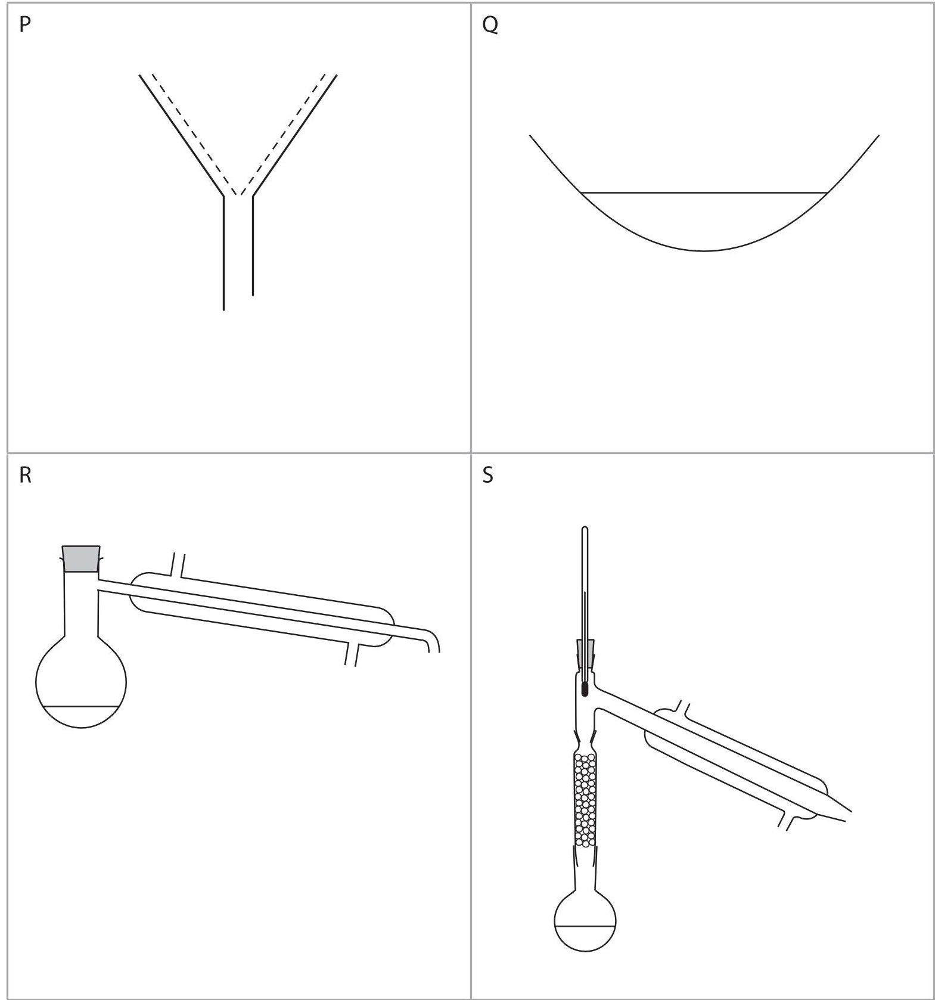

(a) (i) The apparatus labelled P is used for
A crystallisation
B filtration
C fractional distillation
D simple distillation
(ii) The apparatus labelled S is used for
A crystallisation
B filtration
C fractional distillation
D simple distillation
(b) (i) Which method of separation should be used to obtain sand from a mixture containing salt, sand and water?
A crystallisation
B filtration
C fractional distillation
D simple distillation
(ii) Which method of separation should be used to obtain pure water from a mixture containing salt, sand and water?
A crystallisation
B filtration
C fractional distillation
D simple distillation
(iii) Which method of separation should be used to obtain copper(II) sulfate from a mixture containing copper(II) sulfate and water?
A crystallisation
B filtration
C fractional distillation
D simple distillation
(c) Food colourings contain one or more food dyes.
A student used paper chromatography to separate the dyes contained in food colourings. She placed spots of three known food colourings (E, F and G) and one unknown food colouring (H) on the chromatography paper.
The diagram shows the appearance of the paper before and after her experiment.

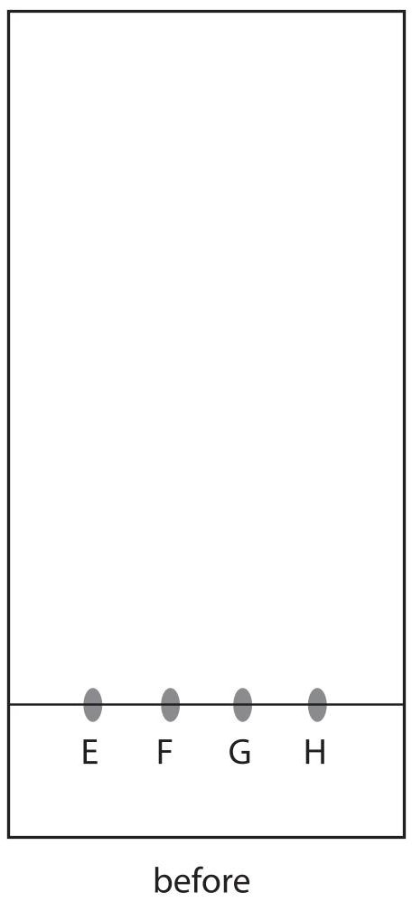

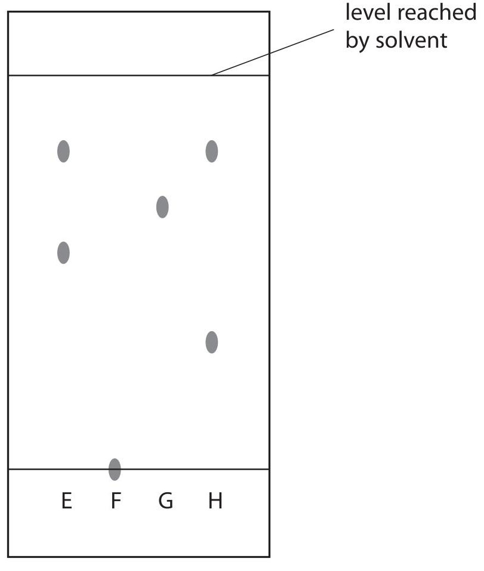

(i) Describe how the student should complete the experiment after placing the four spots on the paper.

(3) 

(ii) Suggest why food colouring F did not move during the experiment.
(iii) How many food dyes are there in food colouring E?
(iv) How many known food dyes are there in food colouring H?
(v) Dyes are often identified by their $ R_{\mathrm{f}} $ values.
$$
R _ {\mathrm {f}} = \frac {\mathrm {d i s t a n c e m o v e d b y d y e}}{\mathrm {d i s t a n c e m o v e d b y s o l v e n t}}
$$
Record the results for the dye in G and calculate its $ R_{\mathrm{f}} $ value.
<table border="1"><tr><td>distance moved by dye in mm</td><td></td></tr><tr><td>distance moved by solvent in mm</td><td></td></tr><tr><td>Rfvalue of G</td><td></td></tr></table>

(Total for Question 2 = 14 marks)

3 This question is about ways of preventing iron nails from rusting.
(a) This experiment is set up with three iron nails.

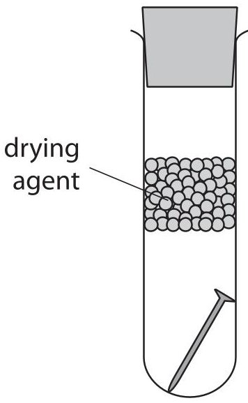

tube 1

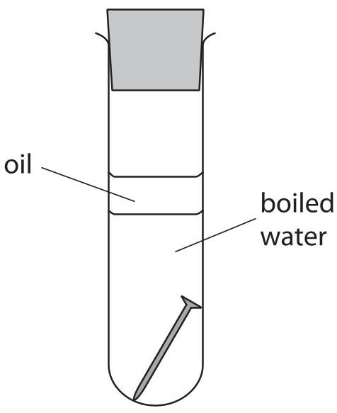

tube 2

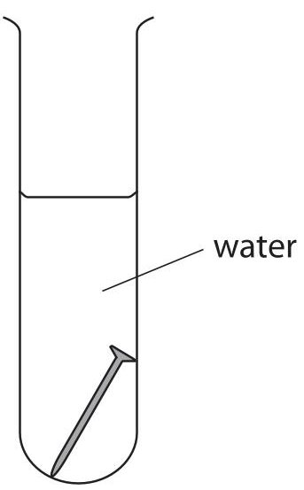

tube 3

(i) What is the name of the main compound in rust?

(1) 

(ii) Why does the nail in tube 1 not rust?

(1) 

(iii) What is the purpose of the layer of oil in tube 2?

(1) 

(b) Zinc can be used to coat iron nails to prevent them from rusting.
(i) What is the name of this process?
(ii) If the layer of zinc on the nail is scratched, sacrificial protection prevents the iron from rusting.
Explain, with the help of two ionic half-equations, how this type of sacrificial protection works.
Use symbols from the box in your equations. You may use each symbol once, more than once or not at all.

(c) Electroplating is another method of rust prevention.
This apparatus can be used to electroplate an iron nail.

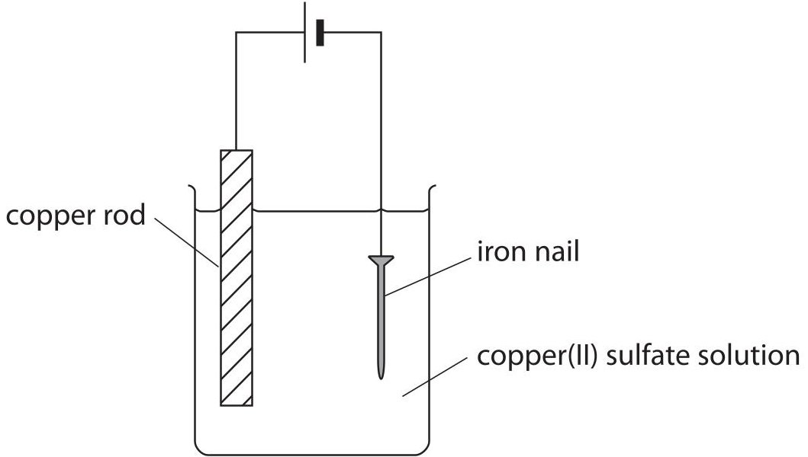

(i) Equation 1 shows the reaction at the copper rod.
Equation 1
$$
\mathrm {C u} \rightarrow \mathrm {C u} ^ {2 +} + 2 \mathrm {e} ^ {-}
$$
Name this type of reaction, giving a reason for your answer.
type of reaction reason...
(ii) Equation 2 shows the reaction at the iron nail.
Equation 2
$$
\mathrm {C u} ^ {2 +} + 2 \mathrm {e} ^ {-} \rightarrow \mathrm {C u}
$$
Use equations 1 and 2 to explain why the colour of the copper(II) sulfate solution does not change during the experiment.
4 This question is about elements in Group 1 of the Periodic Table.
(a) Which statement about lithium is correct?
A It is a good electrical conductor and forms an acidic oxide
B It is a poor electrical conductor and forms an acidic oxide
C It is a good electrical conductor and forms a basic oxide
D It is a poor electrical conductor and forms a basic oxide
(b) A small piece of sodium is added to a large trough of water.
(i) State two observations that could be made.
(ii) Complete the equation for this reaction by inserting the appropriate state symbols.
$$
2 \mathrm {N a} (\mathrm {s}) + 2 \mathrm {H} _ {2} \mathrm {O} (\dots \dots \dots \dots \dots \dots) \rightarrow 2 \mathrm {N a O H} (\dots \dots \dots \dots \dots \dots) + \mathrm {H} _ {2} (\dots \dots \dots \dots \dots \dots)
$$
(c) Potassium reacts in a similar way to sodium, but is more reactive.
State one observation that could be made when a small piece of potassium is added to a large trough of water, but would not be observed with sodium.
(d) Explain why elements in Group 1 have similar reactions.
(Total for Question 4 = 7 marks)
5 This question is about elements in Group 7 of the Periodic Table.
(a) Complete the table to show the physical state at room temperature of fluorine and astatine, and the colour of liquid bromine.
(2) 
<table border="1"><tr><td>Element</td><td>Colour</td><td>Physical state at room temperature</td></tr><tr><td>fluorine</td><td>pale yellow</td><td></td></tr><tr><td>chlorine</td><td>pale green</td><td>gas</td></tr><tr><td>bromine</td><td></td><td>liquid</td></tr><tr><td>iodine</td><td>dark grey</td><td>solid</td></tr><tr><td>astatine</td><td>black</td><td></td></tr></table>
(b) Chlorine reacts with hydrogen to form hydrogen chloride.
A piece of magnesium ribbon is added to hydrogen chloride in three separate experiments under different conditions.
The table below shows the observations made under these different conditions.
<table border="1"><tr><td>Experiment</td><td>Conditions</td><td>Observations</td></tr><tr><td>1</td><td>Hydrogen chloride gas</td><td>No visible change</td></tr><tr><td>2</td><td>Hydrogen chloride dissolved in water</td><td>The magnesium ribbon gets smaller and bubbles are seen</td></tr><tr><td>3</td><td>Hydrogen chloride dissolved in methylbenzene</td><td>No visible change</td></tr></table>
(i) Write the formulae of two ions formed in the solution produced in experiment 2.
Positive ion...
Negative ion...
(ii) Identify the gas formed in experiment 2 and give a test for it.
(iii) Silver nitrate solution and dilute nitric acid are added to the solution produced in experiment 2.
State what is observed and name the substance responsible for this observation.
Explain why dilute nitric acid is added.
observation..
substance responsible
explanation...
(iv) Explain why there is no reaction in experiment 3.
(Total for Question 5 = 10 marks)
6 Crude oil is an important source of organic compounds.
(a) The diagram shows how crude oil is separated into fractions in the oil industry.

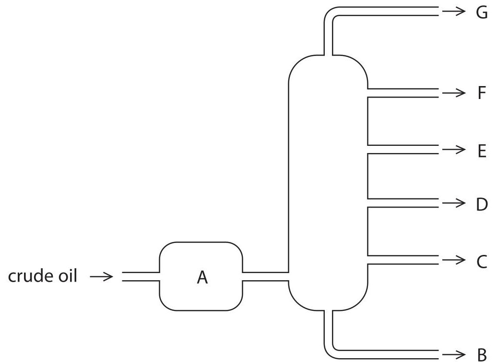

(i) What happens to the crude oil in A?
(ii) Most of the compounds in crude oil are hydrocarbons.
What is meant by the term hydrocarbons?
(iii) Compare the hydrocarbons in fractions D and F in terms of
- boiling point
- size of molecules
- viscosity
(b) Some of the fractions are catalytically cracked. The general equation for some reactions in this process is
$$
\mathrm {a l k a n e} \rightarrow \mathrm {a l k a n e} + \mathrm {a l k e n e}
$$
(i) State two conditions used in catalytic cracking.
(ii) How does the bonding in an alkene molecule differ from the bonding in an alkane molecule?
(iii) The chemical equation for one cracking reaction is
$$
\mathrm {C} _ {1 6} \mathrm {H} _ {3 4} \rightarrow \mathrm {C} _ {8} \mathrm {H} _ {1 8} + 2 \mathrm {C} _ {3} \mathrm {H} _ {6} + \mathrm {c o m p o u n d Q}
$$
Deduce the molecular formula of Q.
(c) The compound with molecular formula $ \mathrm{C_{3} H_{6}} $ can be used to make a polymer.
(i) Give the name of the compound $ \mathrm{C_{3} H_{6}} $
(ii) Complete the table of information about this compound.
<table border="1"><tr><td>Type of formula</td><td>Formula</td></tr><tr><td>molecular</td><td>C3H6</td></tr><tr><td></td><td>CnH2n</td></tr><tr><td></td><td>CH2</td></tr><tr><td>displayed</td><td></td></tr></table>
(iii) Complete this structure to show the part of the polymer formed from two molecules of $ \mathrm{C_{3} H_{6}} $

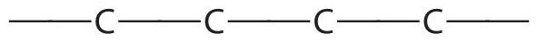

7 Hydrogen peroxide solution decomposes very slowly at room temperature.
The equation for this reaction is
$$
2 \mathrm {H} _ {2} \mathrm {O} _ {2} \rightarrow 2 \mathrm {H} _ {2} \mathrm {O} + \mathrm {O} _ {2}
$$
Very few bubbles can be seen in the solution because of the slow decomposition.
The rate of this reaction is greatly increased by adding a catalyst.
(a) A student added a solid to some hydrogen peroxide solution to see if the solid acted as a catalyst.
He noticed that a lot of bubbles formed, and that the solid was still present at the end of the reaction.
Outline a method to show that the solid acted as a catalyst and not as a reactant.
(b) The student investigated the effect that changing the concentration of the hydrogen peroxide solution has on the rate of the reaction.
He used solid manganese(IV) oxide as the catalyst in each experiment.
This is the method he used.
- pour some hydrogen peroxide solution into a conical flask on a top-pan balance
- add the catalyst and place some cotton wool loosely in the neck of the flask
- record the balance reading and start a timer
- record the balance reading every minute until the mass no longer changes
- repeat the experiment several times using different concentrations of hydrogen peroxide solution
(i) State one property of each substance that the student should keep the same in each experiment.
hydrogen peroxide solution
manganese(IV) oxide.
(ii) What is the purpose of the cotton wool?
(c) The graph shows the results of one of the student's experiments.
Balance reading in grams

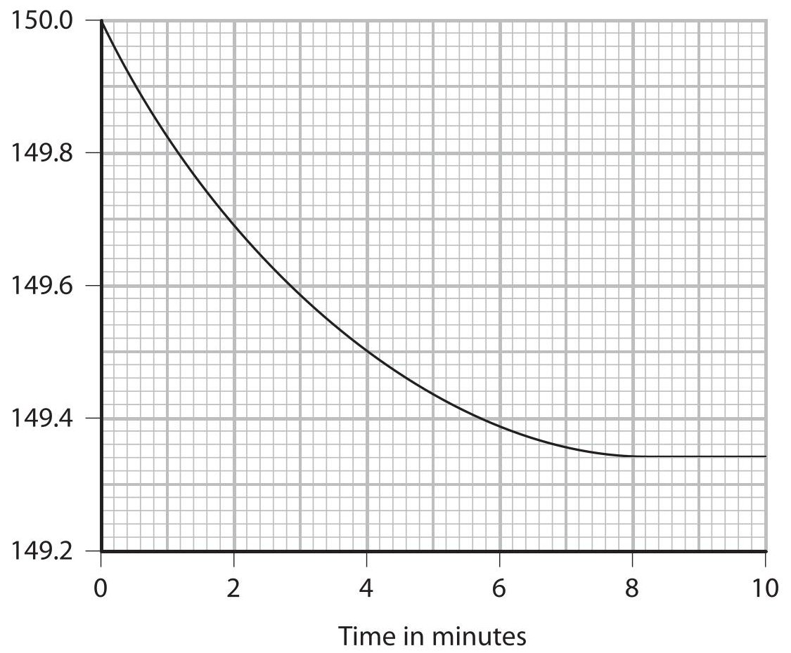

(i) Why does the balance reading decrease during the experiment?
(ii) What does the slope of the curve indicate about the reaction?
(iii) How long does the reaction take to complete?
(d) The results of some of the student's other experiments are shown on this graph.
Balance reading in grams

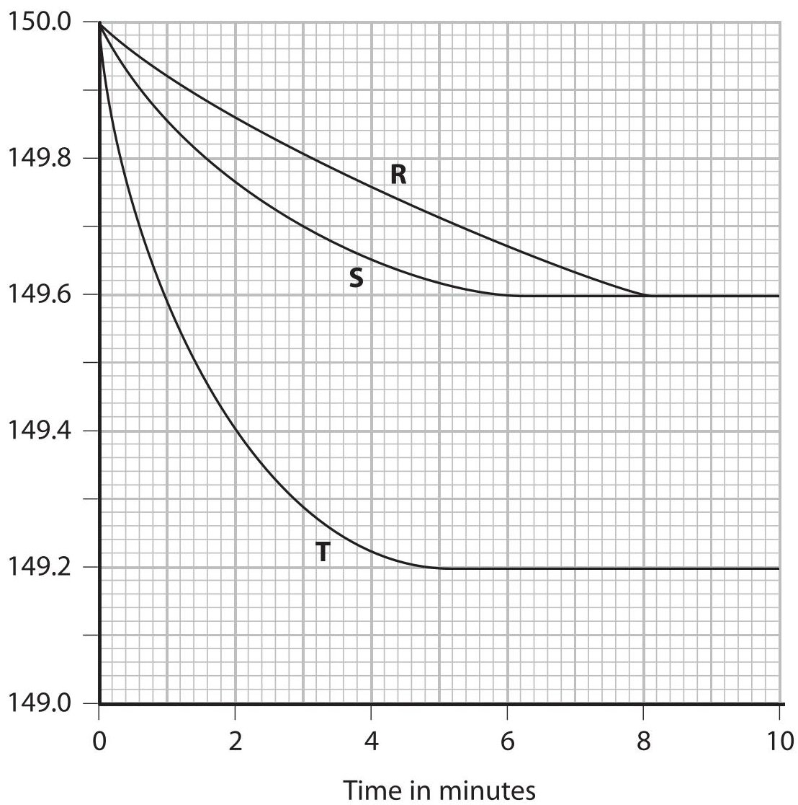

(i) Which one of the experiments, R, S or T, was the fastest?
(ii) The concentration of the hydrogen peroxide solution in experiment S was $ 0. 4 0 \mathrm{m o l} / \mathrm{d m}^{3}. $ Use the graph to deduce the concentration of the hydrogen peroxide solution in experiment T.
State how you deduced your answer.

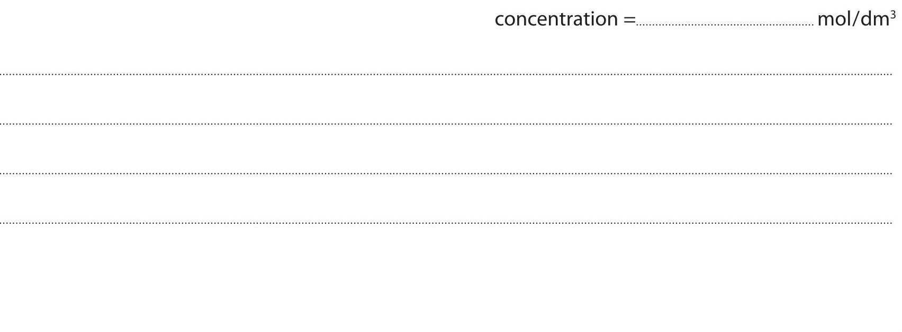

(e) Another student repeated the investigation.
She recorded the time for the total mass of the beaker and contents to decrease by 0.50 g in each experiment. She then converted the times to relative rates of reaction.
The table shows the concentrations she used and the relative rates of reaction she calculated.
<table border="1"><tr><td>Relative rate of reaction</td><td>1.5</td><td>2.2</td><td>3.0</td><td>4.4</td><td>5.1</td><td>6.0</td><td>7.4</td></tr><tr><td>Concentration in mol/dm3</td><td>0.40</td><td>0.60</td><td>0.80</td><td>1.20</td><td>1.40</td><td>1.60</td><td>2.00</td></tr></table>
Plot a graph of these results on the grid.
Draw a straight line of best fit through the points.

Relative rate of reaction

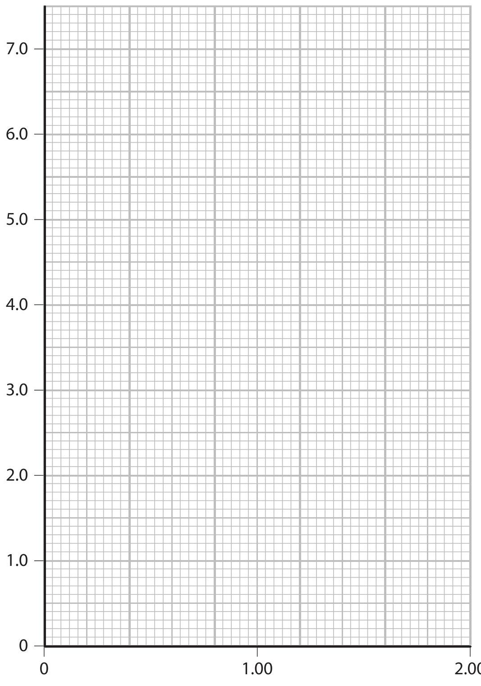

Concentration of hydrogen peroxide in mol/dm $ ^{3} $
(f) Explain, in terms of particles, why the rate of a reaction increases as the concentration of a reactant increases.
(Total for Question 7 = 16 marks)
## BLANK PAGE
8 (a) The flow chart shows how ammonia is made using the Haber process.

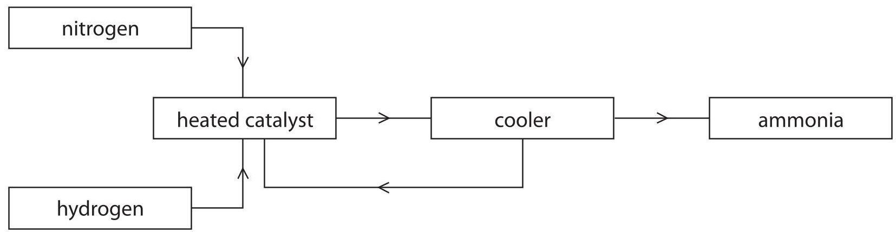

(i) State one raw material that is used as the source of
(ii) Identify the catalyst and state the pressure, in atmospheres, used in the Haber process. (2)
catalyst
pressure
(iii) Which substances pass from the cooler to the heated catalyst?
A ammonia, hydrogen and nitrogen
B hydrogen only
C hydrogen and nitrogen
D nitrogen only
(iv) When ammonia leaves the cooler it is
(iv) When ammonia leaves the co
A an aqueous solution
B a gas
C a liquid
D a solid
(b) Hydrazine $ \left( \mathrm{N}_{2} \mathrm{H}_{4} \right) $ is a useful compound that can be manufactured from ammonia.
(i) Hydrogen peroxide can be used to convert ammonia to hydrazine.
Balance the equation for this reaction.
$$
\mathrm {N H} _ {3} + \mathrm {H} _ {2} \mathrm {O} _ {2} \rightarrow \mathrm {N} _ {2} \mathrm {H} _ {4} + \mathrm {H} _ {2} \mathrm {O}
$$
(ii) The bonding in ammonia and hydrazine can be represented by dot and cross diagrams. The diagram for ammonia has been drawn.
All the bonds in hydrazine are single bonds. Complete the diagram for hydrazine. Show only the outer electrons.
<table border="1"><tr><td>ammonia</td><td colspan="2">hydrazine</td></tr><tr><td>H
Ox
H
Ox
N
Ox
H</td><td>H</td><td>H</td></tr><tr><td></td><td>N</td><td>N</td></tr><tr><td></td><td>H</td><td>H</td></tr></table>
(c) Hydrazine was used as the fuel in the first rocket-powered fighter aircraft in World War II. It is now used as a propellant in spacecraft. It slowed the descent of the Phoenix spacecraft as it landed on Mars.
The equations for its use as a rocket fuel and as a propellant are shown in the table.
<table border="1"><tr><td>Use</td><td>Equation</td><td>$\Delta H$ in kJ/mol</td></tr><tr><td>rocket fuel</td><td>$N_{2}H_{4}+O_{2}\rightarrow N_{2}+2H_{2}O$</td><td>-660</td></tr><tr><td>propellant</td><td>$N_{2}H_{4}\rightarrow N_{2}+2H_{2}$</td><td>-50</td></tr></table>
(i) How does the information in the table show that both reactions are exothermic?
(ii) Why is it not correct to describe hydrazine as a fuel when it is used as a propellant?
(d) Some spacecraft use MMH, a compound similar to hydrazine, as a propellant. MMH has the composition by mass of 26.1% carbon, 60.9% nitrogen and 13.0% hydrogen.
(i) Calculate the empirical formula of MMH.
empirical formula.
(ii) The $ M_{r} $ of MMH is 46
What is the molecular formula of MMH?
(Total for Question 8 = 15 marks)
9 Molybdenum (Mo) is a metal. It is often used to make an alloy with iron.
Like iron, it is extracted from its oxide. Unlike iron, it occurs mainly as its sulfide.
(a) Molybdenum sulfide is converted into molybdenum oxide by heating in air. The equation for this reaction is
$$
2 \mathrm {M o S} _ {2} + 7 \mathrm {O} _ {2} \rightarrow 2 \mathrm {M o O} _ {3} + 4 \mathrm {S O} _ {2}
$$
(i) Why is molybdenum said to be oxidised in this reaction?
(ii) The sulfur dioxide formed in the reaction could form acid rain if it escaped into the atmosphere.
Write a chemical equation for the formation of an acid from sulfur dioxide.
(b) The table shows the melting points of molybdenum oxide and sulfur dioxide.
<table border="1"><tr><td></td><td>Melting point in℃</td></tr><tr><td>molybdenum oxide</td><td>800</td></tr><tr><td>sulfur dioxide</td><td>-75</td></tr></table>
The melting point indicates the type of bonding and structure in a compound.
(i) What is the type of bonding in a molecule of sulfur dioxide?
(ii) Explain why the melting point of sulfur dioxide is low.
(iii) The melting point of molybdenum oxide suggests that it has ionic bonding. However, it is often represented as a molecular structure.
Deduce the molecular formula of molybdenum oxide as shown in this structure.

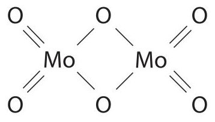

(c) The metallic structure of molybdenum gives it some typical properties.
(i) Describe the metallic structure of molybdenum.
(ii) Explain why molybdenum is a good conductor of electricity.
(iii) Explain why molybdenum is malleable.
(Total for Question 9 = 12 marks)
10 This apparatus can be used to investigate the reduction of metal oxides.

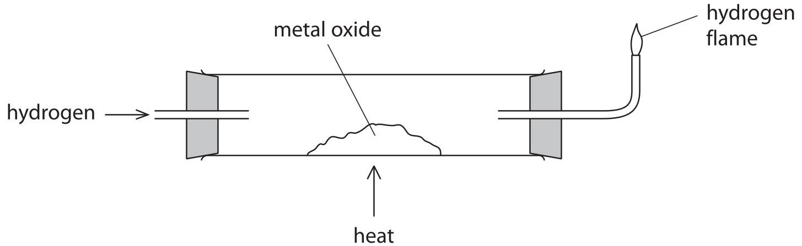

The mass of the metal oxide is measured before and after heating it in hydrogen.
The results can be used to determine the formula of the oxide.
(a) The hydrogen gas burns as it leaves the tube.
(i) What substance is formed when hydrogen burns in air?
(ii) Why is it important to relight the flame if it goes out?
(b) These are the results for one experiment.
Mass of solid before heating = 4.2 g
Mass of solid after heating = 3.4 g
These results may not be sufficient to find the mass of metal for use in determining the formula of the metal oxide.
What further practical steps should be taken to confirm that an accurate value for the mass of metal has been obtained?
(c) In an experiment using a different metal oxide, a mass of 2.8 g of metal is obtained from 3.6 g of the metal oxide.
(i) Calculate the mass of oxygen in the sample of the metal oxide.
(ii) Calculate the amount, in moles, of oxygen atoms in the sample of the metal oxide.
(iii) The formula of the metal oxide is MO, where M is the symbol of the metal. Deduce the amount, in moles, of M in the sample of the metal oxide.
(iv) What is the relative atomic mass of M?
relative atomic mass of M=
(Total for Question 10 = 10 marks)
TOTAL FOR PAPER=120 MARKS
## BLANK PAGE
## BLANK PAGE
## BLANK PAGE
