<table><tr><td colspan="3">Write your name here</td></tr><tr><td>Surname</td><td colspan="2">Other names</td></tr><tr><td>Pearson Edexcel Certificate</td><td>Centre Number</td><td>Candidate Number</td></tr><tr><td>Pearson Edexcel International GCSE</td><td></td><td></td></tr><tr><td colspan="3">Chemistry</td></tr><tr><td colspan="3">Unit: KCH0/4CH0
Science (Double Award) KSC0/4SC0
Paper: 1C</td></tr><tr><td colspan="2">Tuesday 13 May 2014 – Morning
Time: 2 hours</td><td>Paper Reference
KCH0/1C 4CH0/1C
KSC0/1C 4SC0/1C</td></tr><tr><td colspan="3">You must have:
Calculator, ruler</td><td>Total Marks</td></tr></table>

## Instructions

- Use black ink or ball-point pen.

- Fill in the boxes at the top of this page with your name, centre number and candidate number.

- Answer all questions.

- Answer the questions in the spaces provided

- there may be more space than you need.

- Show all the steps in any calculations and state the units.

- Some questions must be answered with a cross in a box. If you change your mind about an answer, put a line through the box and then mark your new answer with a cross.

## Information

- The total mark for this paper is 120.

- The marks for each question are shown in brackets

- use this as a guide as to how much time to spend on each question.

## Advice

- Read each question carefully before you start to answer it.

- Keep an eye on the time.

- Write your answers neatly and in good English.

- Try to answer every question.

- Check your answers if you have time at the end.

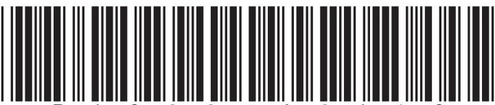

<table class="table table-bordered"><thead><tr><th>7 Li</th><th>9 Be</th></tr></thead><tbody><tr><td>23 Na</td><td>24 Mg</td></tr><tr><td>39 K</td><td>40 Ca</td></tr><tr><td>86 Rb</td><td>88 Sr</td></tr><tr><td>133 Cs</td><td>137 Ba</td></tr><tr><td>223 Fr</td><td>226 Ra</td></tr></tbody></table>

## Answer ALL questions.

1 The diagram shows some pieces of apparatus that you may find in a laboratory.

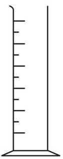

A

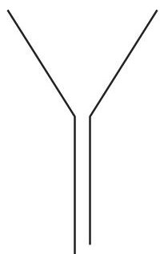

B

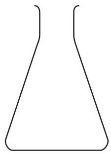

C

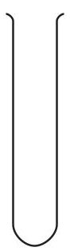

D

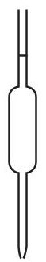

E

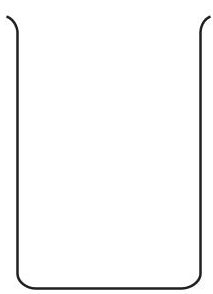

F

(a) Complete the table by giving the name of each piece of apparatus.

(4) 

<table border="1"><tr><td>Letter</td><td>Name</td></tr><tr><td>A</td><td>measuring cylinder</td></tr><tr><td>B</td><td></td></tr><tr><td>C</td><td>conical flask</td></tr><tr><td>D</td><td></td></tr><tr><td>E</td><td></td></tr><tr><td>F</td><td></td></tr></table>

(b) Give the letters of the two pieces of apparatus that could each be used to measure an accurate volume of a liquid.

2 Crude oil is a mixture of substances.

(a) Which word best describes the main substances in crude oil?

A bases

B carbohydrates

C elements

D hydrocarbons

(b) This apparatus can be used to separate the substances present in a sample of crude oil into several fractions.

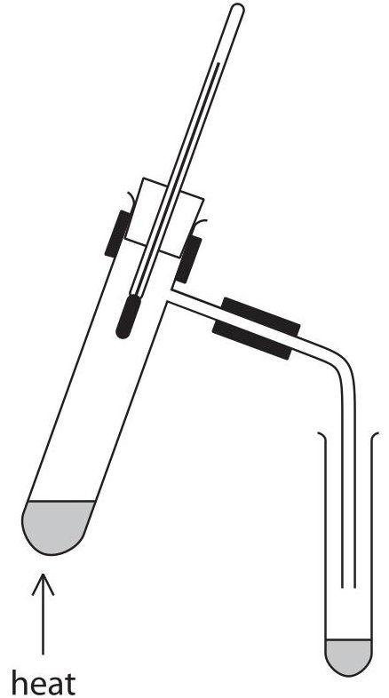

These sentences describe the steps in the method for separating the substances into fractions, but the steps are in the wrong order.

R Connect a delivery tube to the boiling tube.

S Pour crude oil into a boiling tube.

T Collect each fraction in a different test tube.

U Fit a thermometer into the boiling tube.

V Heat the crude oil gently at first, then more strongly.

Put a letter in each box to show the correct order. One has been done for you.

(Total for Question 2 = 3 marks)

3 The diagram shows the electronic configuration of an atom of element X.

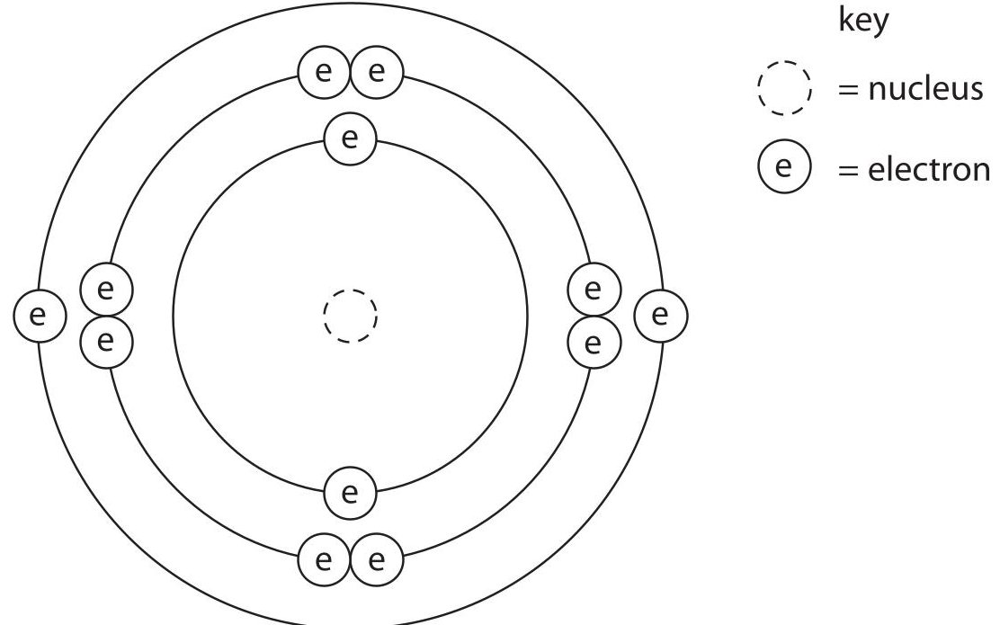

(a) (i) How many protons does the nucleus of the atom contain?

(ii) Which group of the Periodic Table contains element X? Give a reason for your choice.

(iii) Give the formula of the ion formed by element X in its compounds.

(b) Element X has three isotopes.

The table gives the mass number of each isotope and its percentage abundance in a sample of element X.

<table border="1"><tr><td>Mass number</td><td>Percentage abundance(%)</td></tr><tr><td>24</td><td>79.0</td></tr><tr><td>25</td><td>10.0</td></tr><tr><td>26</td><td>11.0</td></tr></table>

Calculate the relative atomic mass $ \left( A_{\mathrm{r}} \right) $ of element X.

Give your answer to one decimal place.

relative atomic mass of X=

(Total for Question 3 = 7 marks)

4 The diagram shows how hydrated copper(II) sulfate crystals can be made by reacting copper(II) oxide with dilute sulfuric acid.

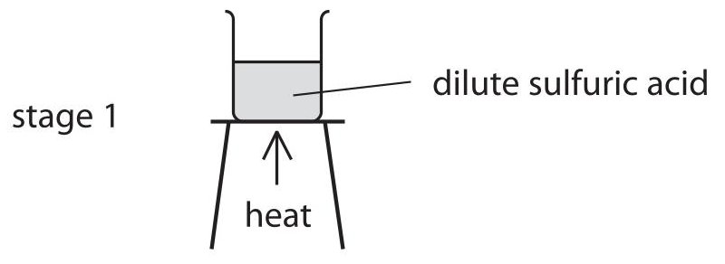

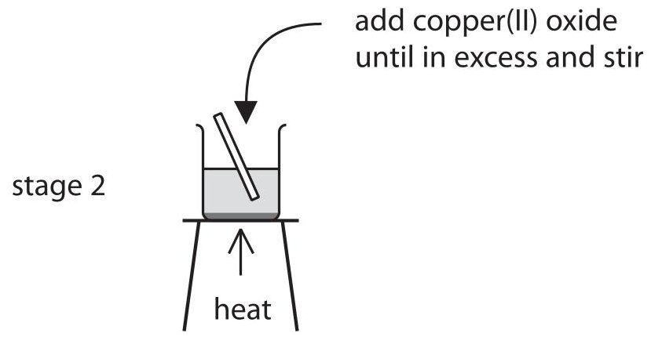

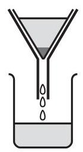

filter the mixture from stage 2

stage 4

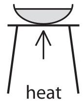

heat the solution from stage 3 until a hot, saturated solution forms

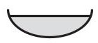

allow the solution to cool so that hydrated copper(II) sulfate crystals form

(a) Why is the sulfuric acid heated in stage 1?

(b) How would you know when the copper(II) oxide is in excess in stage 2?

(c) Why is the mixture filtered in stage 3?

(d) Why do crystals form when the hot saturated solution is cooled in stage 5?

(e) State the colour of the crystals formed in stage 5.

(f) The crystals are removed by filtration and then dried. Suggest a suitable method of drying the crystals.

(Total for Question 4 = 6 marks)

5 The table shows some properties of four substances A,B,C and D.

<table border="1"><tr><td>Substance</td><td>Melting point in℃</td><td>Boiling point in℃</td><td>Conducts electricity when solid?</td><td>Conducts electricity when molten?</td></tr><tr><td>A</td><td>-101</td><td>-35</td><td>no</td><td>no</td></tr><tr><td>B</td><td>1063</td><td>2970</td><td>yes</td><td>yes</td></tr><tr><td>C</td><td>801</td><td>1413</td><td>no</td><td>yes</td></tr><tr><td>D</td><td>3550</td><td>4830</td><td>no</td><td>no</td></tr></table>

(a) Use the information in the table to identify the substance that

(i) is a metal

A B C D

(ii) could be diamond

A B C D

(iii) is a gas at $ 2 0^{\circ} \mathrm{C} $

A B C D

(iv) contains oppositely charged ions

A B C D

(b) Some of the substances in the table are compounds. What is meant by the term compound?

(c) (i) The electronic configurations of atoms of sodium and chlorine are

Na 2.8.1

Cl 2.8.7

Describe the changes in the electronic configurations of sodium and chlorine when these atoms form sodium chloride.

(ii) Calculate the relative formula mass of sodium chloride (NaCl). Use the Periodic Table on page 2 to help you.

relative formula mass=

(Total for Question 5 = 11 marks)

6 A total volume of 50 $ cm^{3} $ of hydrochloric acid is added gradually to $ 50 cm^{3} $ of sodium hydroxide solution containing some universal indicator.

The graph shows how the pH of the solution changes as the acid is added.

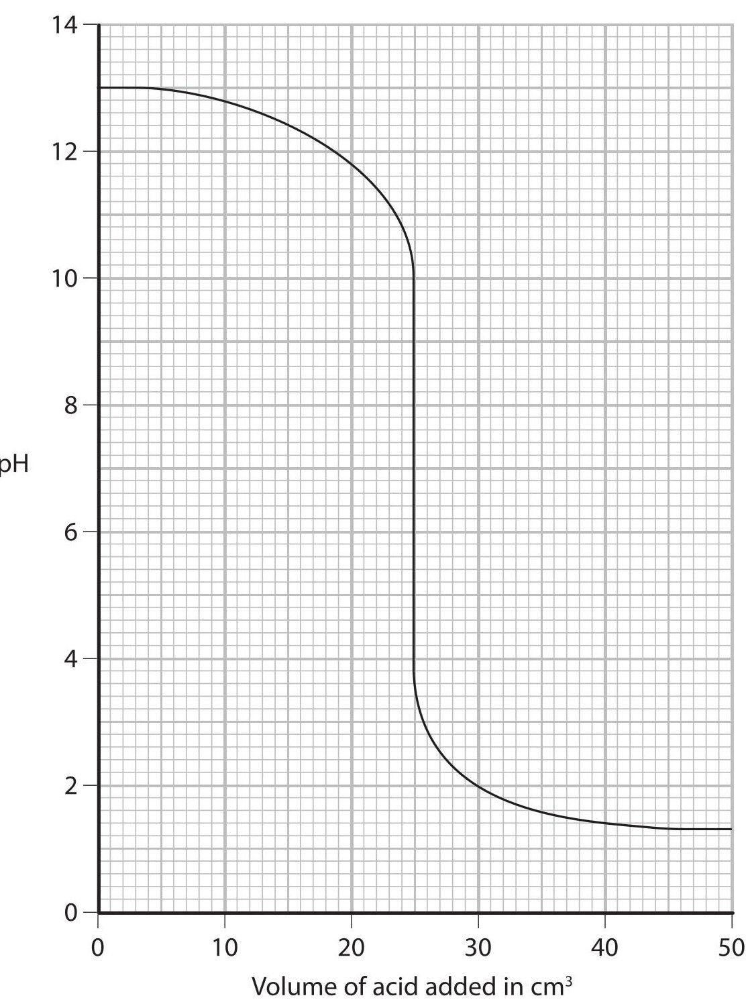

(a) Use the graph to answer these questions.

(i) What is the pH of the sodium hydroxide solution before any acid is added?

(ii) What is the pH of the solution after 40 $ cm^{3} $ of acid is added?

(iii) What volume of acid is needed to completely neutralise the sodium hydroxide?

(b) The table shows the colour of universal indicator at different pH values.

<table border="1"><tr><td>pH</td><td>0-2</td><td>3-4</td><td>5-6</td><td>7</td><td>8-9</td><td>10-12</td><td>13-14</td></tr><tr><td>Colour</td><td>red</td><td>orange</td><td>yellow</td><td>green</td><td>blue</td><td>indigo</td><td>violet</td></tr></table>

Complete the table below to show the colour of the solution when the volume of hydrochloric acid added is 20 $ cm^{3} $ and when the volume added is 35 $ cm^{3}. $

<table border="1"><tr><td>Volume of hydrochloric acid added in $ \mathrm{c m^{3}} $</td><td>Colour of solution</td></tr><tr><td>20</td><td></td></tr><tr><td>35</td><td></td></tr></table>

(c) Write a chemical equation for the reaction between sodium hydroxide and hydrochloric acid.

7 The diagram shows some of the reactions of magnesium.

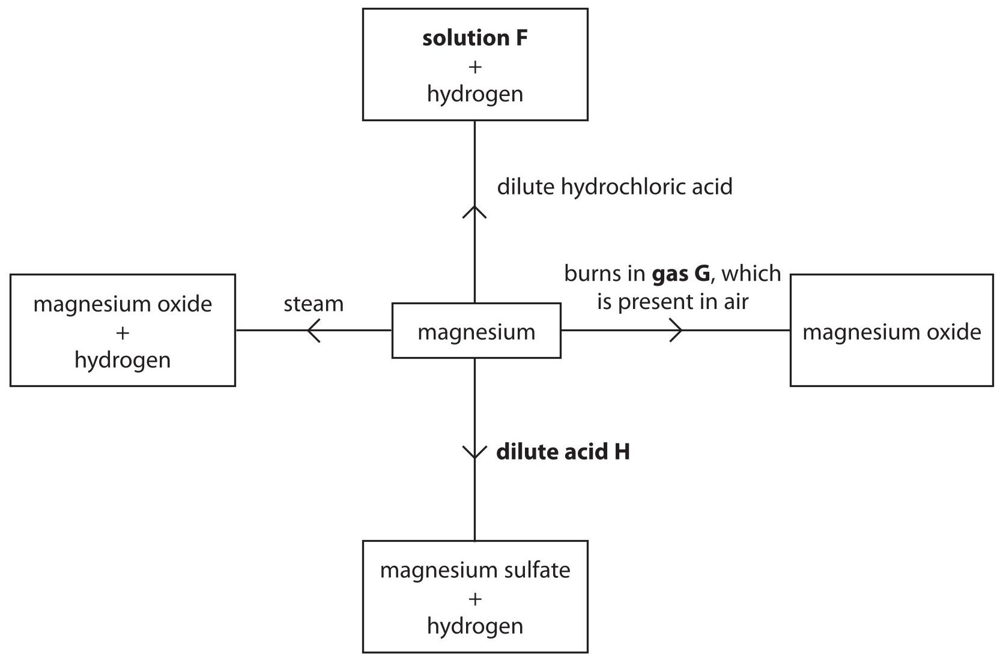

(a) Complete the table to give the identity of substances F,G and H.

<table border="1"><tr><td>Substance</td><td>Identity</td></tr><tr><td>solution F</td><td></td></tr><tr><td>gas G</td><td></td></tr><tr><td>dilute acid H</td><td></td></tr></table>

(b) Write a chemical equation for the reaction between magnesium and steam.

## BLANK PAGE

8 When lithium is burned in air, the two compounds lithium oxide (Li $ _{2} $ O) and lithium nitride (Li $ _{3} $ N) are formed.

Both compounds are ionic and their ions can be represented by dot and cross diagrams.

The dot and cross diagram for the ions in lithium oxide is

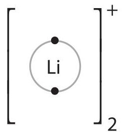

$$
\left[ \left. \mathrm {O} \right. \right] ^ {2 -}
$$

(a) Draw a dot and cross diagram for the ions in lithium nitride.

(b) The chemical equation for the reaction between lithium and oxygen is

$$
4 \mathrm {L i} + \mathrm {O} _ {2} \rightarrow 2 \mathrm {L i} _ {2} \mathrm {O}
$$

Write a chemical equation for the reaction between lithium and nitrogen.

(c) (i) Lithium nitride reacts violently with water to form a solution of lithium hydroxide and ammonia gas.

Complete the following equation by inserting the appropriate state symbols.

$$
\mathrm {L i} _ {3} \mathrm {N} (\mathrm {s}) + 3 \mathrm {H} _ {2} \mathrm {O} (\dots \dots \dots \dots \dots) \rightarrow 3 \mathrm {L i O H} (\dots \dots \dots \dots \dots) + \mathrm {N H} _ {3} (\dots \dots \dots \dots \dots)
$$

(ii) Suggest a value for the pH of the solution formed. Give a reason for your answer.

pH... reason.

(d) Solid lithium nitride conducts electricity and is used in batteries. Why would you expect solid lithium nitride not to conduct electricity?

(Total for Question 8 = 9 marks)

9 The diagram shows the displayed formulae of five hydrocarbons A, B, C, D and E.

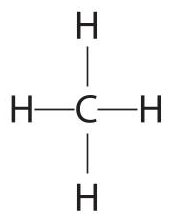

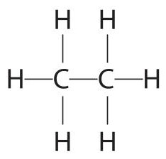

A

B

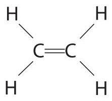

C

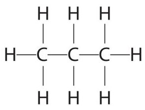

D

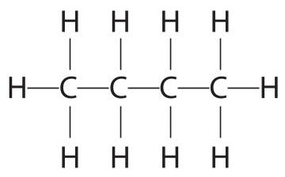

E

(a) Give the letter of a hydrocarbon to answer these questions.

You may use each letter once, more than once or not at all.

(i) Which hydrocarbon is the main component of natural gas?

(ii) Which other hydrocarbon is produced, together with D, when pentane $ \left( \mathrm{C}_{5} \mathrm{H}_{1 2} \right) $ is cracked?

(iii) Which hydrocarbon can undergo an addition reaction with hydrogen to form B?

(b) Give the molecular formula and the empirical formula of E.

molecular formula

empirical formula

(c) Hydrocarbons A, B, D and E all belong to the same homologous series.

(i) Give the name and the general formula of this homologous series.

name.

general formula

(ii) Draw the displayed formula of an isomer of E.

(d) Two reactions that can occur when hydrocarbon A is burned in air are represented by these equations.

Equation for reaction 1

$$
\mathrm {C H} _ {4} + 2 \mathrm {O} _ {2} \rightarrow \mathrm {C O} _ {2} + 2 \mathrm {H} _ {2} \mathrm {O}
$$

Equation for reaction 2

$$
\mathrm {C H} _ {4} + 1 \frac {1}{2} \mathrm {O} _ {2} \rightarrow \mathrm {C O} + 2 \mathrm {H} _ {2} \mathrm {O}
$$

Explain why a different product is formed in reaction 2 and why this product is dangerous.

(Total for Question 9 = 11 marks)

10 Aluminium and iron have some similar properties.

Both metals

- are malleable

- are ductile (can be drawn into a wire)

- are good conductors of electricity

- are good conductors of heat

- have a high melting point

(a) (i) Choose two properties from the list that make iron a suitable metal for saucepans.

(ii) Choose two properties from the list that make aluminium a suitable metal for power cables.

(b) Steel is an alloy containing iron.

These are three differences between steel and aluminium.

- steel can rust but aluminium resists corrosion

- steel has a higher density than aluminium

- steel is much stronger than aluminium

(i) Use information from the list to suggest why steel is the better metal for making bridges.

(ii) Use information from the list to suggest why aluminium is the better metal for making aircraft bodies.

(c) The reaction between aluminium and iron(III) oxide is known as a thermite reaction.

The diagram shows how this thermite reaction can be carried out.

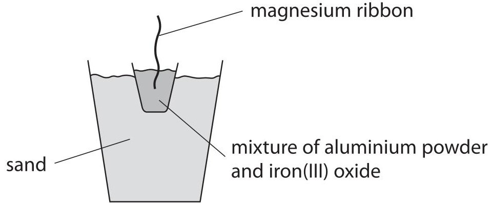

The magnesium ribbon is lit to ignite the reaction mixture.

The reaction is highly exothermic.

The equation for the reaction is

$$
2 \mathrm {A l} + \mathrm {F e} _ {2} \mathrm {O} _ {3} \rightarrow \mathrm {A l} _ {2} \mathrm {O} _ {3} + 2 \mathrm {F e}
$$

(i) What is meant by the term exothermic?

(ii) What does the reaction suggest about the reactivity of aluminium compared to the reactivity of iron?

Explain your answer.

(iii) Which element is oxidised in this thermite reaction?

Give a reason for your answer.

(d) This thermite reaction can be used to join together two rails on a railway line.

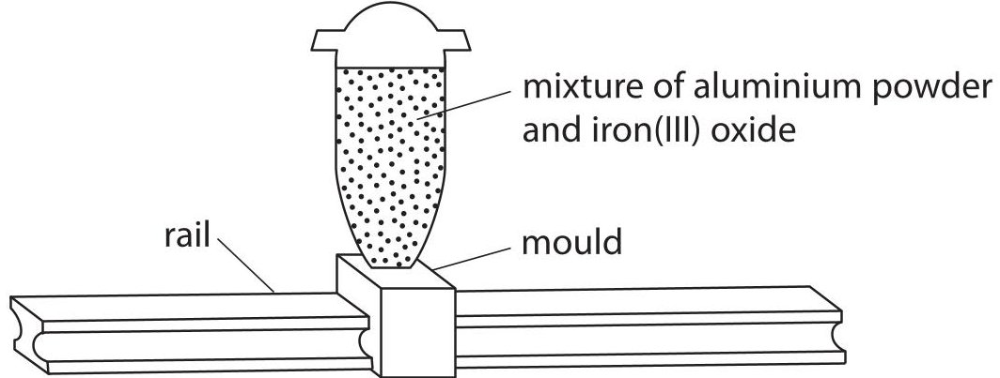

The reaction mixture is ignited and molten iron pours into the mould. The mould is removed and the molten iron solidifies to create a join between the two rails.

Explain why the iron produced in the reaction is molten.

(Total for Question 10 = 12 marks)

11 This apparatus can be used to obtain ethene by cracking a liquid alkane.

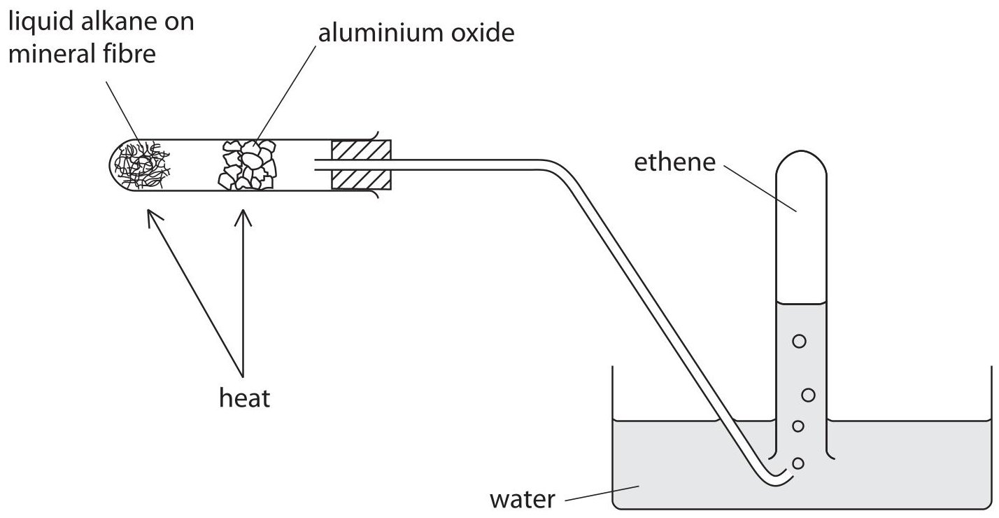

(a) What is meant by the term cracking?

(b) Give a chemical test to show that the gas collected is unsaturated.

(c) Cracking is also carried out in industry.

Give the name of the catalyst and the temperature used in the catalytic cracking of hydrocarbons.

catalyst...

temperature

(Total for Question 11 = 5 marks)

12 A sample of a chlorofluorocarbon (CFC) contains 0.24 g of carbon, 0.38 g of fluorine and 1.42 g of chlorine.

(a) (i) Show, by calculation, that the empirical formula of the CFC is $ \mathrm{C F C} \mathrm{I}_{2} $

(ii) The relative formula mass of the CFC is 204. Deduce the molecular formula of the CFC.

molecular formula

(b) The displayed formula of another CFC is

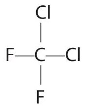

Draw a dot and cross diagram of this CFC. Show only the outer electrons.

13 The diagram shows three different forms of carbon.

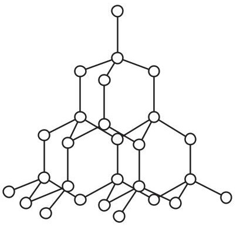

diamond structure

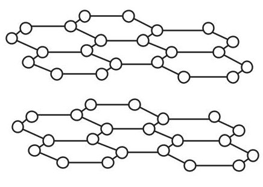

graphite structure

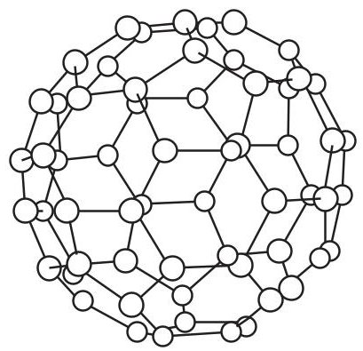

fullerene molecule

(a) Name the type of bond that exists between the carbon atoms in all three structures.

(b) (i) Explain why diamond has a very high melting point.

(ii) Fullerene has a simple molecular structure Explain why it has a low melting point.

(c) There are two theories used to explain why graphite can act as a solid lubricant.

Theory A The forces of attraction between the layers are weak allowing the layers to slide over one another.

Theory B Gas molecules are trapped between the layers allowing the layers to slide over one another.

The table shows the ability of graphite to act as a lubricant in different locations.

<table border="1"><tr><td>Location</td><td>Ability to act as a lubricant</td></tr><tr><td>Earth&#x27;s surface</td><td>good</td></tr><tr><td>high altitude</td><td>average</td></tr><tr><td>outer space</td><td>very poor</td></tr></table>

Suggest which theory is supported by the evidence in the table.

Give a reason for your choice.

(d) Graphite and diamond can be changed from one form to the other according to the equation

$$
\mathrm {C} (\mathrm {g r a p h i t e}) \rightleftharpoons \mathrm {C} (\mathrm {d i a m o n d}) \quad \Delta H = + 1. 9 \mathrm {k J / m o l}
$$

Would a low or a high temperature favour the conversion of graphite into diamond? Give a reason for your choice.

(Total for Question 13 = 9 marks)

14 (a) The table shows information about two common addition polymers. Complete the table for these two polymers.

(4) 

<table border="1"><tr><td>Name of polymer</td><td>Structure of monomer</td><td>Structure of polymer</td><td>One use for the polymer</td></tr><tr><td>poly(ethene)</td><td>C=CHCH3</td><td></td><td></td></tr><tr><td></td><td></td><td>[CH3H]nCCH3</td><td>water pipes</td></tr></table>

(b) State two changes that occur in the formation of an addition polymer from its monomer.

(c) Addition polymers such as poly(ethene) are very difficult to dispose of because they do not biodegrade easily.

(i) State a reason why addition polymers do not biodegrade easily.

(ii) Burning and landfill (burying in the ground) are two methods used to dispose of addition polymers.

Suggest a problem with each method of disposal.

burning.

landfill.

(Total for Question 14 = 9 marks)

15 (a) A student made a solution of sodium hydroxide by dissolving 10.0 g of solid sodium hydroxide in distilled water to make $ 2 5 0 \mathrm{c m}^{3} $ of solution.

(i) Calculate the amount, in moles, of NaOH in 10.0 g of sodium hydroxide.

(ii) Calculate the concentration, in mol/dm $ ^{3} $ , of this solution of sodium hydroxide.

(b) (i) The student uses the sodium hydroxide solution to find the concentration of a solution of hydrochloric acid.

He uses this method

- use a pipette to put 25.0 $ cm^{3} $ of the sodium hydroxide solution into a conical flask

- add a few drops of methyl orange indicator to the solution

- gradually add the hydrochloric acid from a burette until the solution in the flask just changes colour

The diagram shows his burette readings.

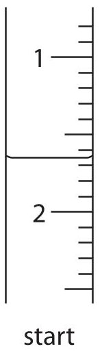

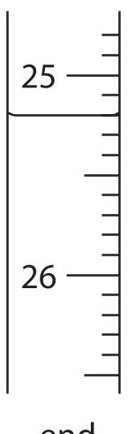

Complete the table, giving all values to the nearest 0.05 $ cm^{3}. $

<table border="1"><tr><td>burette reading at end in $ \mathrm{c m^{3}} $</td><td></td></tr><tr><td>burette reading at start in $ \mathrm{c m^{3}} $</td><td></td></tr><tr><td>volume of acid added in $ \mathrm{c m^{3}} $</td><td></td></tr></table>

(ii) State the colour of the methyl orange at the start and at the end of the experiment.

(iii) Why is a burette used instead of a pipette for adding the acid?

QUESTION 15 CONTINUES ON NEXT PAGE

(c) Sodium hydroxide reacts with carbon dioxide.

The equation for this reaction is

$$
2 \mathrm {N a O H} + \mathrm {C O} _ {2} \rightarrow \mathrm {N a} _ {2} \mathrm {C O} _ {3} + \mathrm {H} _ {2} \mathrm {O}
$$

A solution of sodium hydroxide of concentration 2.00 mol/dm $ ^{3} $ is used.

(i) Calculate the amount, in moles, of sodium hydroxide in $ 2 0 0 \mathrm{c m}^{3} $ of this solution.

(ii) Deduce the maximum mass, in grams, of carbon dioxide that can react with this solution of sodium hydroxide.

## TOTAL FOR PAPER = 120 MARKS

