<table><tr><td colspan="4">Write your name here</td></tr><tr><td>Surname</td><td colspan="3">Other names</td></tr><tr><td>Pearson Edexcel Certificate</td><td>Centre Number</td><td colspan="2">Candidate Number</td></tr><tr><td>Pearson Edexcel International GCSE</td><td></td><td></td><td></td></tr><tr><td colspan="4">Chemistry</td></tr><tr><td colspan="4">Unit: KCH0/4CH0
Science (Double Award) KSC0/4SC0
Paper: 1C</td></tr><tr><td colspan="2">Monday 12 January 2015 – Morning
Time: 2 hours</td><td colspan="2">Paper Reference
KCH0/1C 4CH0/1C
KSC0/1C 4SC0/1C</td></tr><tr><td colspan="4">You must have:
Ruler, calculator</td></tr><tr><td colspan="4">Total Marks</td></tr></table>

## Instructions

- Use black ink or ball-point pen.

- Fill in the boxes at the top of this page with your name, centre number and candidate number.

- Answer all questions.

- Answer the questions in the spaces provided

- there may be more space than you need.

- Show all the steps in any calculations and state the units.

- Some questions must be answered with a cross in a box. If you change your mind about an answer, put a line through the box and then mark your new answer with a cross.

## Information

- The total mark for this paper is 120.

- The marks for each question are shown in brackets

- use this as a guide as to how much time to spend on each question.

## Advice

- Read each question carefully before you start to answer it.

- Keep an eye on the time.

- Write your answers neatly and in good English.

- Try to answer every question.

- Check your answers if you have time at the end.

<table class="table table-bordered"><thead><tr><th>7 Li</th><th>9 Be</th></tr></thead><tbody><tr><td>3 Lithium</td><td>4 Beryllium</td></tr><tr><td>23 Na Sodium</td><td>24 Mg Magnesium</td></tr><tr><td>39 K Potassium</td><td>40 Ca Calcium</td></tr><tr><td>86 Rb Rubidium</td><td>88 Sr Strontium</td></tr><tr><td>133 Cs Caesium</td><td>137 Ba Barium</td></tr><tr><td>223 Fr Francium</td><td>226 Ra Radium</td></tr></tbody></table>
## Answer ALL questions.
1 This question is about the elements hydrogen and oxygen.
(a) The circles in the diagrams represent molecules of hydrogen. Place a cross ( $ \times $ ) in the box under the diagram that represents hydrogen gas.

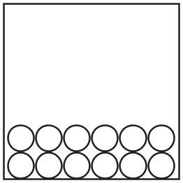

X

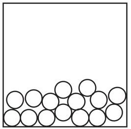

X

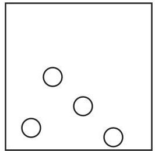

X

(b) The diagram below shows two different atoms of hydrogen.

X

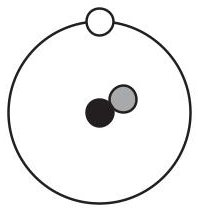

Y

(i) The particle furthest from the centre of each atom is
A an electron
B a neutron
C a nucleus
D a proton
(ii) The particle present in atom Y but not in atom X is
A an electron
B a neutron
C a nucleus
D a proton
(iii) Both atoms are neutral because they have the same number of
A electrons and neutrons
B electrons and protons
C electrons, neutrons and protons
D neutrons and protons
(c) Different atoms of oxygen can be represented as
$ _{8}^{1 6} $ O and $ _{8}^{1 8} $ O
Select words or phrases from the box to complete the sentence about these atoms of oxygen.
You may use each word or phrase once, more than once or not at all.
<table border="1"><tr><td>atomic numbers</td><td>isotopes</td><td>mass numbers</td><td>numbers of electrons</td></tr></table>
These atoms of oxygen are called
because their ... are the same
(Total for Question 1 = 7 marks)
2 This question is about the separation of mixtures.
(a) The table shows some methods used to separate mixtures.
(i) Place a tick ( $ \surd $ ) in one box in each row of the table to show the best method of separation for each mixture.
<table border="1"><tr><td rowspan="2" colspan="2">Separation</td><td colspan="4">Method of separation</td></tr><tr><td>Chromatography</td><td>Simple distillation</td><td>Filtration</td><td>Fractional distillation</td></tr><tr><td>P</td><td>red ink from a mixture of coloured inks</td><td></td><td></td><td></td><td></td></tr><tr><td>Q</td><td>ethanol from a mixture of ethanol and water</td><td></td><td></td><td></td><td></td></tr><tr><td>R</td><td>sand from a mixture of sand and water</td><td></td><td></td><td></td><td></td></tr><tr><td>S</td><td>water from copper(II) sulfate solution</td><td></td><td></td><td></td><td></td></tr></table>
(ii) Which of the mixtures P, Q, R or S contains an undissolved solid?
(b) Pure dry crystals of magnesium nitrate can be obtained from magnesium nitrate solution by crystallisation.
These steps describe the method, but the steps are in the wrong order.
A allow the solution to cool to room temperature
B heat the solution to evaporate some of the water
C pour the mixture of crystals and solution through filter paper
D put the crystals in a warm place to dry
E dip a glass rod into the solution to see if crystals form
Write a letter in each box to show the correct order.
One has been done for you.

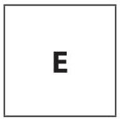

(Total for Question 2 = 7 marks)
3 This question is about tests for some elements and compounds.
(a) What is the test for hydrogen?
(b) The diagram shows hydrogen burning in air, and how some of the gases passing through the apparatus are collected and tested.

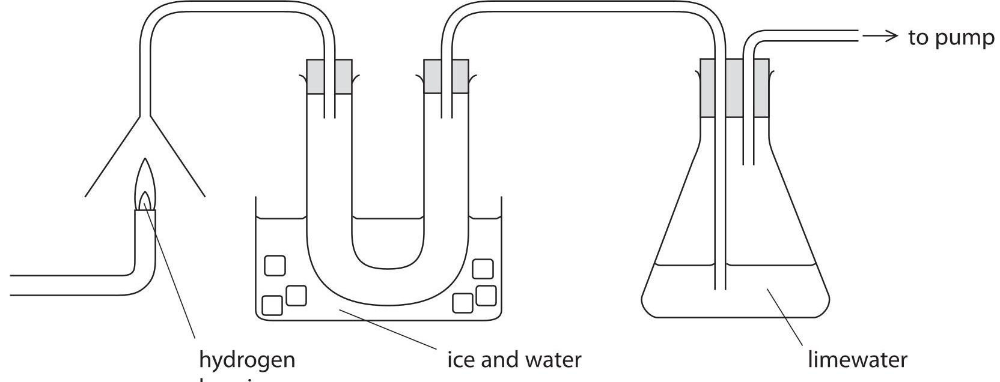

hydrogen burning
A colourless liquid collects in the U-shaped tube and the limewater turns cloudy very slowly.
(i) Describe a chemical test to show that the colourless liquid contains water.
test..
result
(ii) Describe a physical test to show that the colourless liquid is pure water.
test..
result.
(iii) A reaction involving carbon dioxide causes the cloudiness in the limewater.
Place crosses ( $ \times $ ) in two boxes to show the correct statements about this reaction.
carbon dioxide forms when the hydrogen burns
carbon dioxide from the air reacts to cause the cloudiness
the cloudiness is caused by the formation of calcium hydroxide
the cloudiness is caused by the formation of a white precipitate
the reaction in the limewater is an example of oxidation
(Total for Question 3 = 7 marks)
4 A student draws this diagram to show how he plans to prepare and collect oxygen gas in a laboratory.

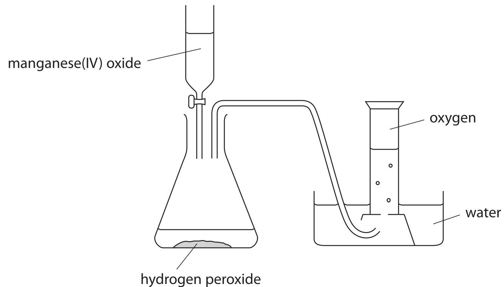

(a) The student makes a mistake in the labelling. He also misses out a piece of apparatus.
(i) State the mistake in the labelling of the diagram.
(ii) Identify the piece of apparatus missing from the diagram.
(iii) State why this piece of apparatus is necessary.
(b) The student adds the missing piece of apparatus, then collects some oxygen gas. This oxygen gas contains water vapour.
Suggest how he could alter the apparatus so that he could collect dry oxygen gas.
(c) Balance the equation for the reaction used in this preparation of oxygen.
$$
\mathrm {H} _ {2} \mathrm {O} _ {2} \rightarrow \mathrm {H} _ {2} \mathrm {O} + \mathrm {O} _ {2}
$$
(d) The manganese(IV) oxide acts as a catalyst.
What is meant by the term catalyst?
(e) The diagram shows the reaction profile for the decomposition of hydrogen peroxide without a catalyst.

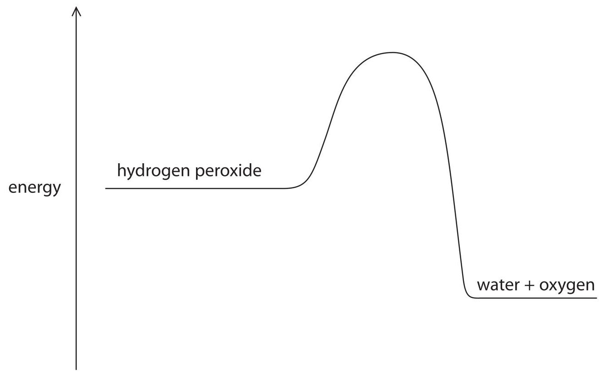

(i) Label the diagram to show the activation energy $ ( E_{a} ) $ for this reaction.
(ii) On the diagram, draw a curve to represent the reaction profile for the same reaction when a catalyst is used.
5 This question is about aluminium sulfate, a soluble salt with many uses.
(a) One type of aluminium sulfate has the formula $ \mathrm{A l}_{2} \left( \mathrm{S O}_{4} \right)_{3}.1 6 \mathrm{H}_{2} \mathrm{O} (s) $
(i) How many different elements are shown in this formula?
(ii) The $ \mathrm{H_{2}O} $ in this formula shows that this type of aluminium sulfate is
A anhydrous
B hydrated
C solid
D soluble
(b) Some types of fire extinguisher use a reaction between aluminium sulfate and sodium hydrogencarbonate.
The equation for this reaction is
$$
\mathrm {A l} _ {2} \left(\mathrm {S O} _ {4}\right) _ {3} + 6 \mathrm {N a H C O} _ {3} \rightarrow 2 \mathrm {A l} (\mathrm {O H}) _ {3} + 3 \mathrm {N a} _ {2} \mathrm {S O} _ {4} + 6 \mathrm {C O} _ {2}
$$
(i) State the names of the two metal-containing products of this reaction.
(ii) Carbon dioxide is used in some fire extinguishers.
Explain why carbon dioxide is effective at extinguishing fires.
(c) Gardeners can use aluminium sulfate to alter the pH of soil.
The reaction that occurs can be represented as
$$
\mathrm {A l} _ {2} \left(\mathrm {S O} _ {4}\right) _ {3} (\mathrm {s}) + 6 \mathrm {H} _ {2} \mathrm {O} (\mathrm {l}) \rightarrow 2 \mathrm {A l} (\mathrm {O H}) _ {3} (\mathrm {s}) + 3 \mathrm {H} _ {2} \mathrm {S O} _ {4} (\mathrm {a q})
$$
(i) The $ \mathrm{A l} (\mathrm{O H})_{3} $ contains $ \mathrm{O H^{-}} $ ions and the $ \mathrm{H_{2} S O_{4}} $ contains $ \mathrm{H^{+}} $ ions.
Suggest, with reference to the state symbols, why this reaction makes the soil more acidic.
(ii) The pH of the soil in a garden is 7.5 A gardener adds some aluminium sulfate to the soil to alter its pH. Which is the most likely pH of this soil after the reaction occurs?
A 1.5
B 5.5
C 9.5
D 13.5
(Total for Question 5 = 8 marks)
6 A teacher uses this apparatus to show the reaction between ammonia gas and hydrogen chloride gas to form ammonium chloride.
cotton wool soaked in concentrated ammonia solution
cotton wool soaked in concentrated hydrochloric acid

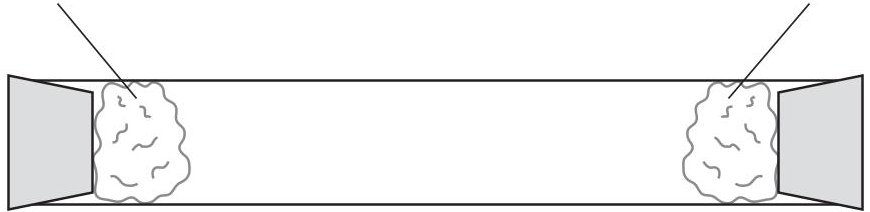

Concentrated ammonia solution gives off ammonia gas.
Concentrated hydrochloric acid gives off hydrogen chloride gas.
The reaction between the gases can be represented by this equation.
$$
\mathrm {N H} _ {3} (\mathrm {g}) + \mathrm {H C l} (\mathrm {g}) \rightarrow \mathrm {N H} _ {4} \mathrm {C l} (\mathrm {s})
$$
The diagram below shows the apparatus after a few minutes.

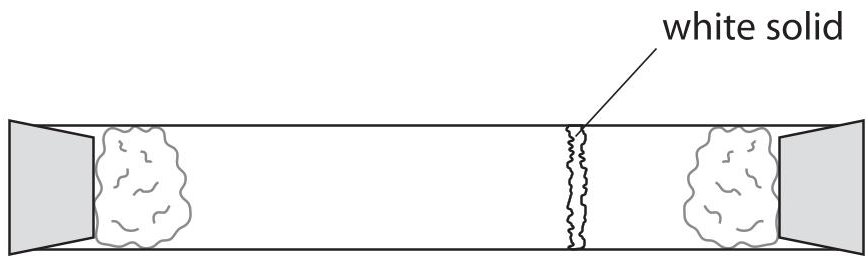

(a) Which process occurs when the gas particles move along the tube?

(1) 

A condensation
B crystallisation
diffusion
evaporation
(b) Explain how the diagram shows which gas moves more quickly during the experiment.
(c) The teacher tests a sample of ammonium chloride solution.
(i) She uses this method to show that the sample contains ammonium ions.
- add solution X
- warm the mixture
- test the gas given off with damp litmus paper
Suggest the identity of solution X, the identity of the gas given off and the final colour of the litmus paper.
solution X..
gas given off...
final colour of litmus paper.
(ii) She uses this method to show that the sample contains chloride ions.
- add solution Y
- see if a white precipitate forms
Why does she add dilute nitric acid?
(iii) Suggest the identities of solution Y and the white precipitate.
solution Y...
white precipitate
(Total for Question 6 = 8 marks)
7 The alkanes are a homologous series of hydrocarbons obtained from the fractions in crude oil.
(a) Describe how crude oil is separated into fractions in industry.
(b) (i) State the general formula of the alkanes.
(ii) State two characteristics, other than having the same general formula, of members of a homologous series.
(c) Propane is an alkane used as a fuel.
Balance the equation for the complete combustion of propane.
$$
\mathrm {C} _ {3} \mathrm {H} _ {8} + \dots \dots \dots \dots \mathrm {O} _ {2} \rightarrow \dots \dots \dots \dots \mathrm {C O} _ {2} + \dots \dots \dots \dots \mathrm {H} _ {2} \mathrm {O}
$$
(d) Incomplete combustion of propane leads to the formation of a poisonous gas.
(i) Identify this gas.
(ii) Explain why the gas is poisonous.
(iii) During the combustion of propane at high temperatures, gases represented by the formula $ \mathrm{N O}_{x} $ can form.
Which two elements combine to form these gases?
(e) The alkane $ \mathrm{C}_{5} \mathrm{H}_{1 2} $ has three isomers.
The displayed formula of one of these isomers is

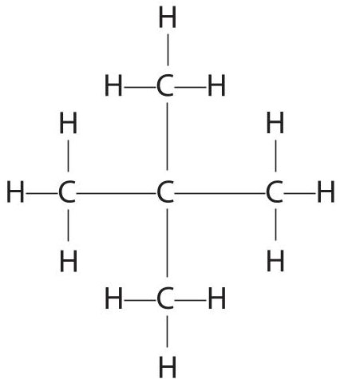

H

Draw the displayed formulae of the other two isomers.

(2) 

(f) Methane is used in many countries as a fuel in houses. It has no smell, so substances are mixed with it to allow any leaks to be identified.
One of these substances is compound X which has this composition by mass.
$$
C = 53.3 \%, H = 11.1 \% \mathrm {a n d} S = 35.6 \%
$$
(i) Use this information to calculate the empirical formula of X.
empirical formula of X.
(ii) The relative formula mass of X is 90 What is the molecular formula of X?
molecular formula of X...
(Total for Question 7 = 17 marks)
8 Ethane $ \left( \mathrm{C}_{2} \mathrm{H}_{6} \right) $ is used as a starting material to manufacture addition polymers. It is first cracked to form ethene $ \left( \mathrm{C}_{2} \mathrm{H}_{4} \right) $
(a) Identify the fuel that also forms in this reaction.
(b) Ethane is described as saturated.
What feature of an ethane molecule is responsible for this description?
(c) Bromine water can be used to show that a hydrocarbon is ethene rather than ethane.
(i) Complete the equation to show the displayed formula of the product of the reaction between ethene and bromine.
$$
\begin{array}{c c c c} \mathrm {H} & \mathrm {H} \\ | & | \\ \mathrm {C} = \mathrm {C} & + \mathrm {B r} - \mathrm {B r} & \rightarrow \\ | & | \\ \mathrm {H} & \mathrm {H} \end{array}
$$
(ii) Which is the correct statement about this test?
A the colour of ethene is brown
B the product of the reaction is a white precipitate
C the product of the reaction is colourless
D the test involves a substitution reaction
(d) Alkenes can be polymerised.
Part of the structure of poly(ethene) can be represented as

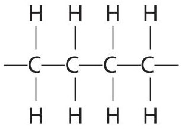

This structure shows the atoms coming from two molecules of ethene.
Draw part of the structure of poly(propene) that shows the atoms coming from two molecules of propene $ \mathrm{(C H_{2}=C H-CH_{3})}. $
(e) The repeat unit of another addition polymer can be represented as

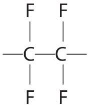

Draw the structure of the monomer used to make this polymer.
(f) The disposal of most addition polymers is a problem because they do not biodegrade.
(i) What is meant by the term biodegrade?
(ii) Identify the property that prevents addition polymers from easily biodegrading.
(Total for Question 8 = 10 marks)
## BLANK PAGE
9 This question is about elements in Group 1 of the Periodic Table.
(a) Which statement is correct about lithium?
A lithium is a non-metal
B lithium forms a sulfate with the formula $ \mathrm{L i S O}_{4} $
C lithium reacts with water to form an alkali
D lithium reacts with water to form a white precipitate
(b) Lithium and potassium have similar chemical properties because their atoms
A have the same number of electrons in the outer shell
B have the same number of protons
C have two electrons in the first shell
D form positive ions
(c) Small pieces of lithium and potassium are added to separate large troughs of water.
State one observation that would be similar for each element, and one that would be different for each element.
similar..
different.
(d) Suggest the formula of the compound formed when potassium reacts with oxygen, and when potassium reacts with chlorine.
oxygen
chlorine
(e) Complete the equation for the reaction between rubidium and water by inserting state symbols.
$$
2 \mathrm {R b} (\dots \dots \dots \dots \dots) + 2 \mathrm {H} _ {2} \mathrm {O} (\dots \dots \dots \dots \dots) \rightarrow 2 \mathrm {R b O H} (\dots \dots \dots \dots \dots) + \mathrm {H} _ {2} (\dots \dots \dots \dots \dots)
$$
(f) The table shows information about the isotopes in a sample of rubidium.
<table border="1"><tr><td>Isotope</td><td>Number of protons</td><td>Number of neutrons</td><td>Percentage of isotope in sample</td></tr><tr><td>1</td><td>37</td><td>48</td><td>72</td></tr><tr><td>2</td><td>37</td><td>50</td><td>28</td></tr></table>
Use information from the table to calculate the relative atomic mass of this sample of rubidium. Give your answer to one decimal place.
relative atomic mass =
(Total for Question 9 = 9 marks)
10 This question is about the insoluble salt lead(II) bromide.
(a) A student uses the precipitation method to prepare lead(II) bromide.
The equation for the reaction she uses is
$$
\mathrm {P b} \left(\mathrm {N O} _ {3}\right) _ {2} (\mathrm {a q}) + 2 \mathrm {N a B r} (\mathrm {a q}) \rightarrow \mathrm {P b B r} _ {2} (\mathrm {s}) + 2 \mathrm {N a N O} _ {3} (\mathrm {a q})
$$
Describe how she could use solutions of lead(II) nitrate and sodium bromide to obtain a pure, dry sample of lead(II) bromide.
(b) The student's teacher uses this apparatus to electrolyse a pure sample of molten lead(II) bromide.

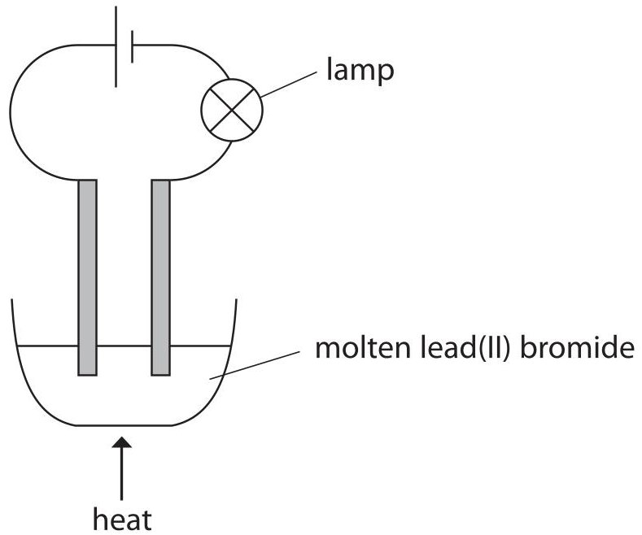

The student records these observations.
a small blob of a silvery liquid appears at one electrode
a brown substance forms at the other electrode
the lamp stops working soon after the teacher stops heating the lead(II) bromide
(i) Which is the correct statement about this electrolysis?
A the brown substance is bromide
B the products are both elements
C the silvery liquid forms at the positive electrode
D the silvery liquid is molten lead(II) bromide
(ii) The student writes this half-equation to show the reaction in which the brown substance forms.
$$
2 \mathrm {B r} ^ {-} + 2 \mathrm {e} ^ {-} \rightarrow 2 \mathrm {B r}
$$
Identify the two mistakes in her half-equation.
(iii) Explain why the lamp stops working after the teacher stops heating the lead(II) bromide.
(Total for Question 10 = 9 marks)
11 A student uses the neutralisation method to make a sample of the soluble salt, sodium sulfate.
The equation for the reaction he uses is
$$
2 \mathrm {N a O H} (\mathrm {a q}) + \mathrm {H} _ {2} \mathrm {S O} _ {4} (\mathrm {a q}) \rightarrow \mathrm {N a} _ {2} \mathrm {S O} _ {4} (\mathrm {a q}) + 2 \mathrm {H} _ {2} \mathrm {O} (\mathrm {l})
$$
(a) He does a titration using these steps to find the ratio of the volumes of reactants needed.
- add 25.0 $ cm^{3} $ solution of dilute sodium hydroxide solution to a conical flask
- add a few drops of phenolphthalein indicator to the conical flask
- add dilute sulfuric acid from a burette until the indicator just changes colour
- repeat the experiment until concordant results are obtained
(i) Which piece of apparatus should the student use to add the sodium hydroxide solution?
(ii) What colour change would the student see when he neutralises the sodium hydroxide solution?
colour before neutralisation
colour after neutralisation
(b) The diagram shows the burette readings in one experiment before and after adding the acid.

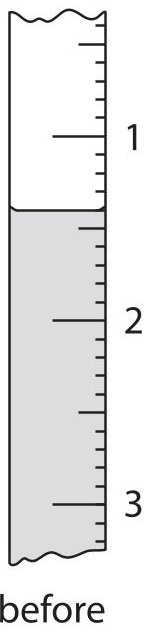

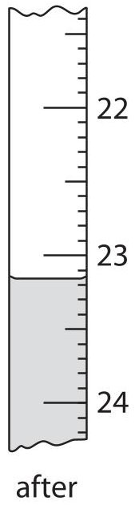

Use the readings to calculate the volume of acid added, entering all values to the nearest 0.05 $ cm^{3}. $
burette reading after adding acid ... $ \mathrm{c m^{3}} $
burette reading before adding acid ... $ \mathrm{c m^{3}} $
volume of acid added ... $ \mathrm{c m^{3}} $
(c) The student repeats the experiment and records these results.
<table border="1"><tr><td>burette reading in $ \mathrm{c m^{3}} $ after adding acid</td><td>25.20</td><td>25.05</td><td>23.65</td><td>23.50</td></tr><tr><td>burette reading in $ \mathrm{c m^{3}} $ before adding acid</td><td>2.90</td><td>3.10</td><td>2.55</td><td>2.30</td></tr><tr><td>volume of acid added in $ \mathrm{c m^{3}} $</td><td>22.30</td><td>21.95</td><td>21.10</td><td>21.20</td></tr><tr><td>titration results to be used(√)</td><td></td><td></td><td></td><td></td></tr></table>
The average (mean) volume of acid added should be calculated using only concordant results (those that differ from each other by $ 0. 2 0 \mathrm{c m}^{3} $ or less).
(i) Identify the concordant results by placing ticks ( $ \checkmark $ ) in the table where appropriate.
(ii) Use your ticked results to calculate the average volume of acid added.
(d) The student uses 200 $ cm^{3} $ of sodium hydroxide solution of concentration 0.300 mol/dm $ ^{3} $ to prepare a sample of sodium sulfate solution.
<table><tr><td>(i)</td><td>Calculate the amount, in moles, of NaOH in the sodium hydroxide solution.</td></tr><tr><td></td><td>amount of NaOH = mol</td></tr><tr><td>(ii)</td><td>Calculate the amount, in moles, of H2SO4 needed to neutralise this amount of NaOH.</td></tr><tr><td></td><td>amount of H2SO4 = mol</td></tr><tr><td>(iii)</td><td>Calculate the mass, in grams, of this amount of H2SO4.</td></tr><tr><td></td><td>mass of H2SO4 = g</td></tr><tr><td colspan="2">(Total for Question 11 = 14 marks)</td></tr></table>
12 A student investigates the rate of the reaction between marble chips (calcium carbonate) and dilute hydrochloric acid. She is given a bottle containing hydrochloric acid labelled 100% She uses this method to find out how changing the concentration of the acid affects the rate of reaction.
- add some marble chips to a conical flask
- pour 50.0 $ cm^{3} $ of dilute hydrochloric acid into the flask
- place the flask on a balance and start a timer
- record the time taken for the mass of the flask and contents to decrease by 1.0 g
- repeat the experiment using different concentrations of hydrochloric acid
(a) Suggest two features of the marble chips that the student should keep the same to ensure that the results are valid (a fair test).
(b) Why does the mass of the flask and contents decrease during the experiment?
(c) The student should have put some cotton wool in the neck of the conical flask after placing the flask on the balance.
How would this improve the accuracy of the results?
(d) The graph shows the student's results for the decrease in the mass of the flask and contents by 1.0 g.

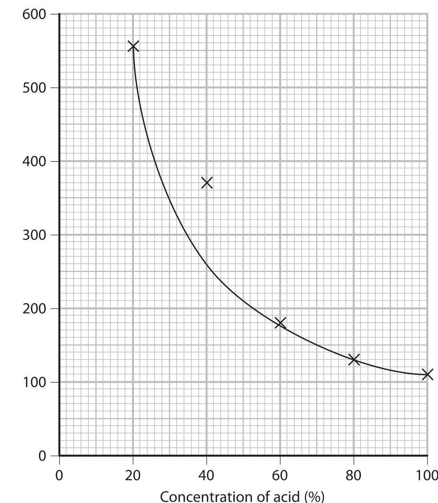

(i) Use the graph to find the time taken for the loss of 1.0 g of mass from the flask when the concentration of acid is 50%.
Show on the graph how you obtained your answer.
(ii) One of the points on the graph is anomalous. What could have caused this anomalous result?
A the concentration of acid was more than 40%
B the loss of mass was greater than 1.0 g
C the mass of marble chips was more than 10 g
D the student started the timer too late
(e) The results of each experiment can be used to calculate the rate of reaction using the expression
$$
\mathrm {r a t e o f r e a c t i o n i n g r a m s p e r s e c o n d} = \frac {1 . 0 \mathrm {g}}{\mathrm {t i m e t o l o s e} 1 . 0 \mathrm {g i n s e c o n d s}}
$$
Calculate the rate of reaction when the concentration of acid is 50%.
$$
\mathrm {r a t e o f r e a c t i o n} =
$$
(f) The student is given a bottle of hydrochloric acid with a concentration different from that used in the previous experiments. She repeats the investigation using different concentrations of hydrochloric acid. She calculates the rate of reaction for each experiment.
The table shows her results.
<table border="1"><tr><td>Rate of reaction in milligrams per second</td><td>15</td><td>29</td><td>40</td><td>56</td><td>70</td></tr><tr><td>Concentration of acid(%)</td><td>20</td><td>40</td><td>60</td><td>80</td><td>100</td></tr></table>
Plot these results on the grid and draw a straight line of best fit.

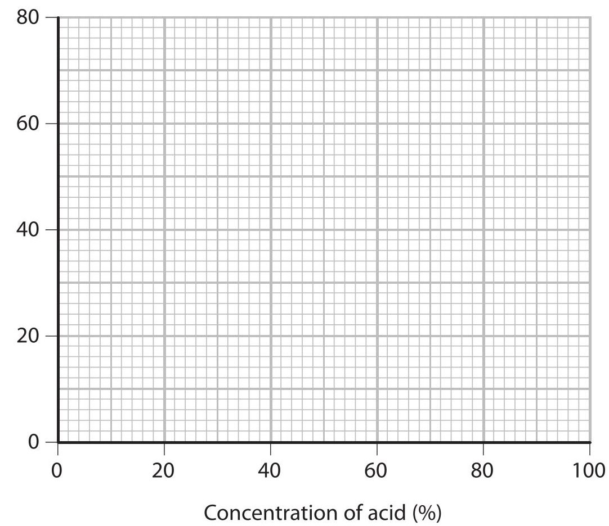

(g) The rate of reaction increases as the concentration of the acid increases. Explain this relationship in terms of particles.
(Total for Question 12 = 15 marks)
TOTAL FOR PAPER = 120 MARKS
## BLANK PAGE
