<table><tr><td colspan="3">Write your name here</td></tr><tr><td>Surname</td><td colspan="2">Other names</td></tr><tr><td>Pearson Edexcel International GCSE</td><td>Centre Number</td><td>Candidate Number</td></tr><tr><td colspan="3">Chemistry</td></tr><tr><td colspan="3">Unit: 4CH0
Science (Double Award) 4SC0
Paper: 1CR</td></tr><tr><td colspan="2">Thursday 19 May 2016 – Morning
Time: 2 hours</td><td>Paper Reference
4CH0/1CR
4SC0/1CR</td></tr><tr><td colspan="3">You must have:
Ruler
Calculator</td><td>Total Marks</td></tr></table>

## Instructions

- Use black ink or ball-point pen.

- Fill in the boxes at the top of this page with your name, centre number and candidate number.

- Answer all questions.

- Answer the questions in the spaces provided

- there may be more space than you need.

- Show all the steps in any calculations and state the units.

- Some questions must be answered with a cross in a box. If you change your mind about an answer, put a line through the box and then mark your new answer with a cross.

## Information

- The total mark for this paper is 120.

- The marks for each question are shown in brackets

- use this as a guide as to how much time to spend on each question.

- Read each question carefully before you start to answer it.

## Advice

- Write your answers neatly and in good English.

- Try to answer every question.

- Check your answers if you have time at the end.

THE PERIODIC TABLE

<table class="table table-bordered"><thead><tr><th>7 Li</th><th>9 Be</th></tr></thead><tbody><tr><td>3 Lithium</td><td>4 Beryllium</td></tr><tr><td>23 Na Sodium</td><td>24 Mg Magnesium</td></tr><tr><td>39 K Potassium</td><td>40 Ca Calcium</td></tr><tr><td>86 Rb Rubidium</td><td>88 Sr Strontium</td></tr><tr><td>133 Cs Caesium</td><td>137 Ba Barium</td></tr><tr><td>223 Fr Francium</td><td>226 Ra Radium</td></tr></tbody></table>

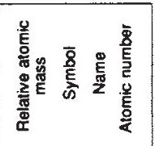

## Answer ALL questions.
1 The Periodic Table is shown on page 2.
(a) In the Periodic Table, which number increases from 3 to 10 in Period 2?
(b) In the Periodic Table, which number increases from 9 to 226 in Group 2?
(c) An atom of boron contains protons, neutrons and electrons Use words from the box to complete the sentences. Your may use each word once, more than once or not at all.
protons neutrons electrons
(i) The particles with the smallest mass are ... .
(ii) The particles with a negative charge are ...
(iii) The two types of particle in the nucleus of a boron atom
(iv) In a boron atom there are equal numbers of
(v) The element boron has isotopes.
These isotopes have different numbers of ...
2 In chemistry, the state symbols (s), (l), (g) and (aq) are often used.
(a) The table shows some changes of state.
Complete the table to show the state symbol before and after the change.
<table border="1"><tr><td>Change of state</td><td>State symbol before change</td><td>State symbol after change</td></tr><tr><td>Water boils in a kettle</td><td></td><td></td></tr><tr><td>Ethene is converted to poly(ethene)</td><td></td><td></td></tr><tr><td>Crystals of iodine sublime on heating</td><td></td><td></td></tr></table>
(b) Some marble chips are added to a solution of hydrochloric acid.
Complete the equation for the reaction that occurs by writing the appropriate state symbol after each formula.
$$
\mathrm {C a C O} _ {3} (\dots \dots 
$$
(c) Which state symbol is used most often for the elements of the Periodic Table at room temperature?

(Total for Question 2 = 6 marks)

3 Techniques used in the separation of mixtures include
A crystallisation
B filtration
C fractional distillation
D simple distillation
For each separation, select the most suitable technique, A, B, C or D, used to obtain the first named substance from the mixture.
Each letter may be used once, more than once or not at all.
(a) Pure water from sea water
(b) Ethanol from a mixture of ethanol and water
(c) Calcium carbonate from a mixture of calcium carbonate and water
(d) $ \mathrm{C u S O}_{4}.5 \mathrm{H}_{2} \mathrm{O} (s) $ from $ \mathrm{C u S O}_{4} $ (aq)
(Total for Question 3 = 4 marks)
4 The table gives information about some of the elements in Group 7 of the Periodic Table.
<table border="1"><tr><td>Element</td><td>Colour</td><td>Melting point in℃</td><td>Boiling point in℃</td></tr><tr><td>fluorine</td><td>yellow</td><td>-220</td><td>-188</td></tr><tr><td>chlorine</td><td></td><td>-101</td><td>-35</td></tr><tr><td>bromine</td><td>red-brown</td><td>-7</td><td>59</td></tr><tr><td>iodine</td><td>grey</td><td>114</td><td></td></tr></table>
(a) What is the colour of chlorine at room temperature?
A black
B blue
C green
D orange
(b) The trend in the boiling points for these elements is similar to the trend in their melting points.
Predict a value for the boiling point of iodine.
(c) Astatine is another element in Group 7.
Predict its colour and physical state at room temperature.
colour
physical state
(d) The elements in Group 7 have similar chemical reactions because they have the same number of
A electrons
B electron shells
C outer electrons
D protons
(e) A student wrote these statements about the reactions of the Group 7 elements.
- The reactivity of the elements decreases down the group.
- The elements form ions with a single positive charge.
- The formula of an astatine molecule is $ \mathrm{A t}_{2} $
- The equation for the reaction between chlorine and potassium bromide solution is $ \mathrm{C l_{2}+2 N a B r\rightarrow 2 N a C l+B r_{2}} $
- In the reaction between bromine and potassium iodide, bromine acts as a reducing agent.
Three of the statements contain one incorrect word.
Complete the table to show each incorrect word and the correct word that should be used to replace it.
<table border="1"><tr><td>Incorrect word</td><td>Correct word</td></tr><tr><td></td><td></td></tr><tr><td></td><td></td></tr><tr><td></td><td></td></tr></table>

(Total for Question 4 = 8 marks)

5 A student investigates the pigments found in some vegetables and fruit.
She obtains some coloured vegetable and fruit extracts from carrots, tomatoes and sweet potatoes.
She places a spot of each extract on chromatography paper, along with spots of the three pigments beta-carotene, chlorophyll and lycopene.
Her teacher provides a solvent containing volatile, flammable organic compounds for the experiment. The diagram shows the apparatus at the start of the experiment.

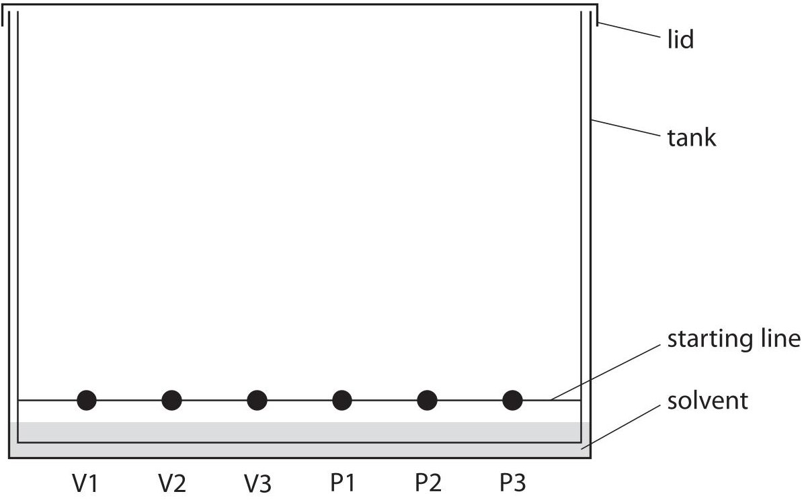

Key to vegetable and fruit extracts and pigments
$$
V 1 = c a r r o t s V 2 = t o m a t o e s V 3 = s w e e t p o t a t o e s
$$
$$
\mathrm {P 1} = \mathrm {b e t a - c a r o t e n e} \quad \mathrm {P 2} = \mathrm {c h l o r o p h y l l} \quad \mathrm {P 3} = \mathrm {l y c o p e n e}
$$
(a) (i) Explain why it is important for the solvent level to be below the spots.
(ii) State two potential problems that are prevented by fitting the tank with a lid.
(b) The diagram shows the chromatogram at the end of the experiment.

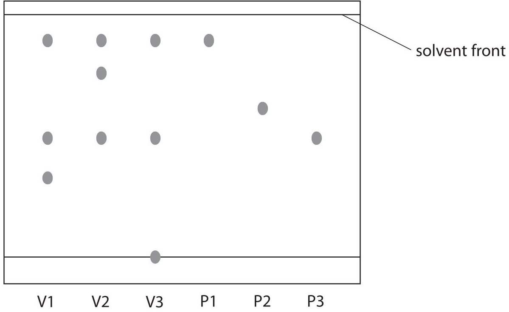

Key to vegetable and fruit extracts and pigments
$$
V 1 = c a r r o t s \quad V 2 = t o m a t o e s \quad V 3 = s w e e t p o t a t o e s
$$
$$
\mathrm {P 1} = \mathrm {b e t a - c a r o t e n e} \quad \mathrm {P 2} = \mathrm {c h l o r o p h y l l} \quad \mathrm {P 3} = \mathrm {l y c o p e n e}
$$
Which three of the statements A, B, C, D and E are supported by the chromatogram?
Place a cross in three boxes to indicate your choice.
A Chlorophyll is not present in carrots, sweet potatoes or tomatoes.
B Beta-carotene is present in carrots but not present in tomatoes.
C Both beta-carotene and lycopene are present in sweet potatoes.
D Lycopene is present in tomatoes but not present in carrots.
E Both carrots and tomatoes contain a pigment other than beta-carotene, chlorophyll and lycopene.

(c) One of the pigments present in the vegetable extracts is not shown in the chromatogram. It appears as a very faint spot 1.3 cm above the starting line.
Calculate its $ R_{\mathrm{f}} $ value using the expression
$$
R _ {\mathrm {f}} = \frac {\mathrm {d i s t a n c e t r a v e l l e d b y p i g m e n t}}{\mathrm {d i s t a n c e t r a v e l l e d b y s o l v e n t}}
$$
$$
R _ {\mathrm {f}} =
$$
(d) Suggest a reason why there is a spot on the starting line in the chromatogram for sweet potatoes.
(Total for Question 5 = 9 marks)
## BLANK PAGE
6 Hydrogen chloride is formed in the reaction between hydrogen and chlorine. The equation for the reaction is
$$
\mathrm {H} _ {2} + \mathrm {C l} _ {2} \rightarrow 2 \mathrm {H C l}
$$
(a) Each molecule in this equation contains the same type of bonding. Name this type of bonding.
(b) The bonding in a hydrogen molecule is strong.
Explain why the boiling point of hydrogen is low.
(c) Explain how the two atoms in a chlorine molecule are held together.
(d) Draw a dot and cross diagram to show the bonding in a hydrogen chloride molecule. Show only the outer electrons in each atom.
(e) Hydrogen chloride gas dissolves in water to form solution A.
Hydrogen chloride gas dissolves in methylbenzene to form solution B.
A teacher adds a piece of magnesium ribbon to each solution.
Explain why she observes effervescence with solution A but not with solution B.
(Total for Question 6 = 10 marks)
7 The table shows the displayed formulae of some organic compounds.
<table border="1"><tr><td>A</td><td>B</td><td>C</td></tr><tr><td>D</td><td>E</td><td>F</td></tr></table>
(a) Explain why all of these compounds are described as hydrocarbons.
(b) Why are B and E described as unsaturated?
(c) Which letter represents the first member of the homologous series of alkanes?
(d) Which letters represent compounds that have the empirical formula $ \mathrm{C H_{2}}? $
(e) Compound F has the same general formula as an alkene. Why does F not decolourise bromine water?
(f) One of the compounds in the table reacts with bromine to form G, a compound with the composition by mass C=22.2% , H=3.7% , Br=74.1%
(i) Show, by calculation, that the empirical formula of G is $ \mathrm{C_{2} H_{4} B r} $
(ii) The relative formula mass of G is 216 Deduce the molecular formula of G.
(Total for Question 7 = 12 marks)
8 Neodymium is a metal used in powerful magnets.
(a) One stage in the extraction of neodymium from its ore is to heat neodymium fluoride with calcium.
The table shows the melting points of the substances in this stage of the extraction.
<table border="1"><tr><td colspan="4">Melting point in℃</td></tr><tr><td>calcium</td><td>calcium fluoride</td><td>neodymium</td><td>neodymium fluoride</td></tr><tr><td>850</td><td>1418</td><td>1024</td><td>1410</td></tr></table>
(i) Balance the equation for this reaction.

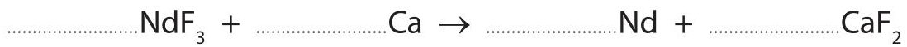

(ii) At one point in this extraction, the temperature of the reaction mixture is $ 1 1 0 0 \mathrm{~} ^ {\circ} \mathrm{C} $ Which two substances are solids at this temperature?
and
(iii) Suggest the most likely type of bonding present in neodymium fluoride.
(iv) Neodymium reacts with oxygen to form neodymium oxide. Suggest the formula of neodymium oxide.
(b) The diagram shows the particles in neodymium

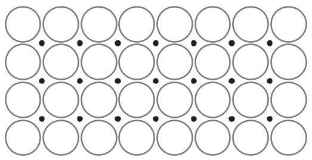

## Key
neodymium ion
- electron
Explain, with reference to the diagram, why neodymium is malleable and a good conductor of electricity.
(Total for Question 8 = 8 marks)
9 A student investigates the reactions between acids and alkalis. He uses this apparatus to measure the temperature change in the reaction between dilute hydrochloric acid (HCl) and aqueous sodium hydroxide (NaOH).

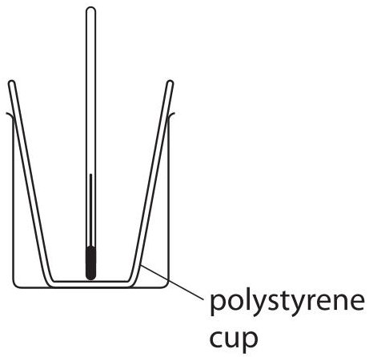

This is his method.
- add 25 $ cm^{3} $ of dilute hydrochloric acid to the polystyrene cup and record the steady temperature
- add some aqueous sodium hydroxide and stir the mixture
- record the maximum temperature of the mixture
The student repeats the experiment using different volumes of aqueous sodium hydroxide.
(a) What is the advantage of using a polystyrene cup rather than a glass beaker?
(b) These are the thermometer readings from one experiment.

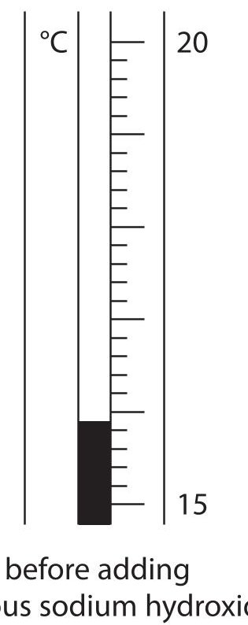

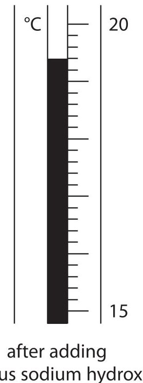

Use these readings to complete the table.
<table border="1"><tr><td>temperature in $ ^{\circ} \mathrm{C} $ after adding aqueous sodium hydroxide</td><td></td></tr><tr><td>temperature in $ ^{\circ} \mathrm{C} $ before adding aqueous sodium hydroxide</td><td></td></tr><tr><td>temperature change in $ ^{\circ} \mathrm{C} $</td><td></td></tr></table>
(c) The table shows the results of some experiments.
The initial temperature of both solutions in all the experiments is $ 1 7. 6 \, \mathrm{^ {\circ} C} $
<table border="1"><tr><td>Volume of aqueous sodium hydroxide added in $ \mathrm{c m^{3}} $</td><td>Temperature of mixture in $ ^{\circ} \mathrm{C} $</td></tr><tr><td>0.0</td><td>17.6</td></tr><tr><td>5.0</td><td>19.7</td></tr><tr><td>10.0</td><td>21.6</td></tr><tr><td>15.0</td><td>23.6</td></tr><tr><td>20.0</td><td>23.8</td></tr><tr><td>25.0</td><td>23.0</td></tr><tr><td>30.0</td><td>22.2</td></tr></table>
(i) Plot these results on the grid. Draw a straight line of best fit through the first four points, and another straight line of best fit through the last three points. Extend both lines so that they cross each other.

Temperature in $ ^{\circ} \mathrm{C} $

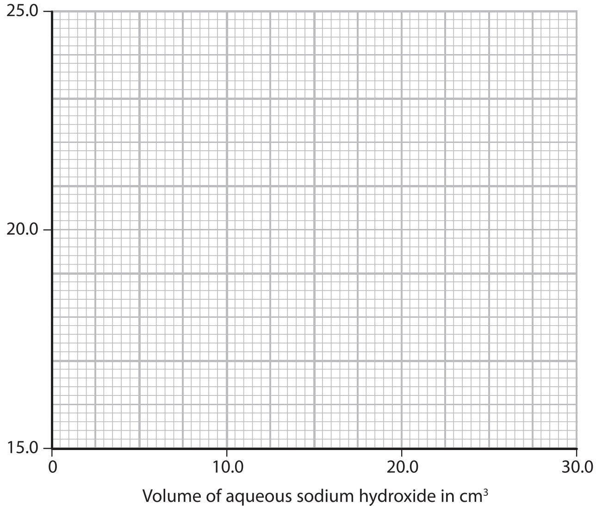

(ii) For the point where the lines cross, write down
$$
\mathrm {t h e t a m e r a t u r e o f t h e m i x t u r e} = \dots \dots
$$
(d) In a similar experiment, using a different acid and alkali, the student records these results.
volume of dilute sulfuric acid = 25.0 $ cm^{3} $
volume of aqueous potassium hydroxide = 22.7 $ cm^{3} $
initial temperature of each solution = 18.9 $ ^{\circ} C $
final temperature of mixture = 24.7 $ ^{\circ} C $
Calculate the heat energy change during this reaction using this equation.
heat energy change = mass $ \times $ 4.2 $ \times $ temperature change
Assume that 1.0 $ cm^{3} $ of each solution has a mass of 1.0 g.
10 Sodium thiosulfate solution and dilute hydrochloric acid react together slowly to form a precipitate of sulfur. This precipitate eventually makes the mixture go cloudy.
A student uses this method.
- place 20 $ cm^{3} $ of sodium thiosulfate solution and $ 20 cm^{3} $ of water in a conical flask
- add 10 $ cm^{3} $ of dilute hydrochloric acid to the flask
- place the flask on a piece of paper marked with a black X
- time how long it takes before the X can no longer be seen

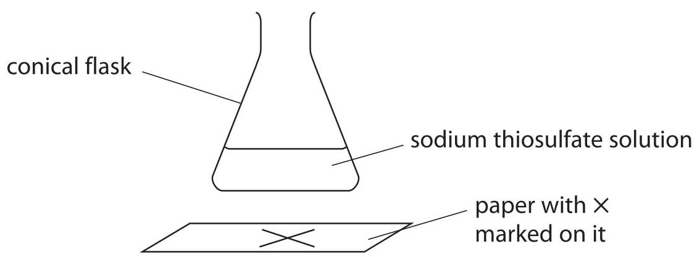

(a) The equation for the reaction is
$$
\mathrm {N a} _ {2} \mathrm {S} _ {2} \mathrm {O} _ {3} (\mathrm {a q}) + 2 \mathrm {H C l} (\mathrm {a q}) \rightarrow 2 \mathrm {N a C l} (\mathrm {a q}) + \mathrm {H} _ {2} \mathrm {O} (\mathrm {I}) + \mathrm {S} (\mathrm {s}) + \mathrm {S O} _ {2} (\mathrm {g})
$$
Before starting her experiments, the student considers the risk to her of sulfur dioxide escaping from the flask. She uses this information.
concentration of sodium thiosulfate solution = 0.300 mol/dm $ ^{3} $
volume of sodium thiosulfate solution = 20 $ cm^{3} $
volume of water = 20 $ cm^{3} $
volume of hydrochloric acid = 10 $ cm^{3} $
(i) Calculate the mass of sulfur dioxide formed in this experiment. The hydrochloric acid is in excess.
mass of sulfur dioxide formed =
(ii) The solubility of sulfur dioxide at room temperature is $ 1 0 0 \mathrm{~ g / d m^{3}} $ Use this additional information to explain whether any sulfur dioxide gas escapes from the flask.
(b) At what point in the experiment should the student have started a timer?
(c) She repeats the experiment using the same volumes and concentrations of solutions, but at different temperatures. The graph shows her results.

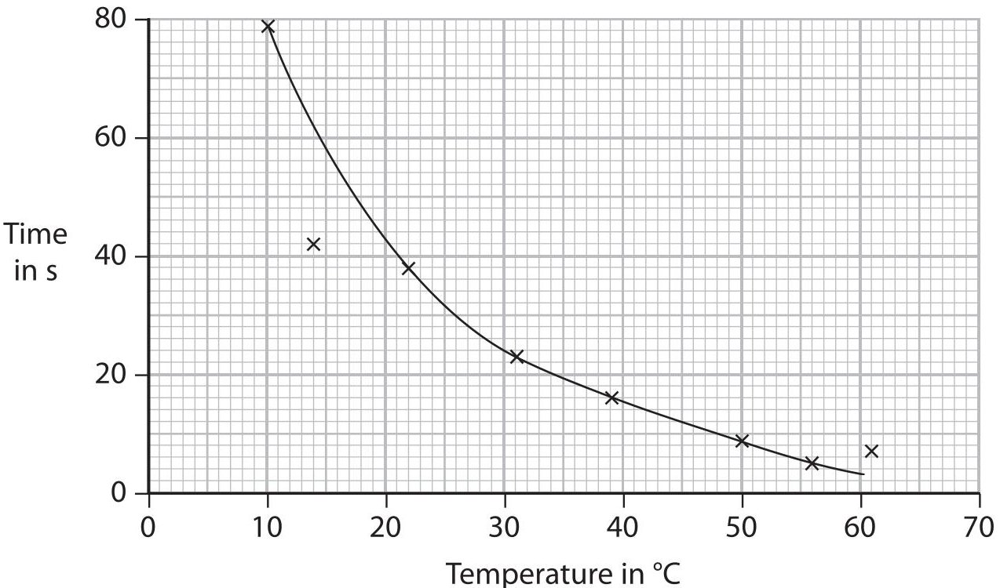

(i) The result at (14,42) is anomalous.
Explain one mistake the student may have made to cause this anomalous result.
(ii) Use the graph to find the time taken for the $ \times $ to be no longer seen at $ 3 5 \, \mathrm{^o C} $
(d) The student repeats the experiments using nitric acid in place of hydrochloric acid. She records the times for the x to no longer be seen, then uses the times to calculate the rate of reaction at each temperature. The graph shows the results she plots.

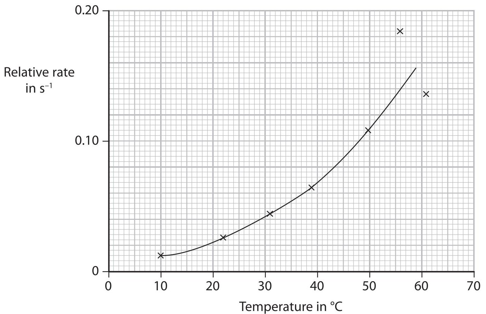

(i) Suggest two reasons why the results are least accurate at higher temperatures.

(2) 

(ii) The student wrote this explanation for the shape of the graph.
As the temperature increases, the rate of reaction increases. This is because there are more frequent collisions between particles of reactants.
Use the particle collision theory to explain another more important reason for the increase in reaction rate.
(e) Another student uses the same reaction to investigate the effect of changing the concentration of the sodium thiosulfate solution on the rate of reaction.
Give three variables that the student must control in this investigation to obtain valid results.
(Total for Question 10 = 15 marks)
11 The flow diagram shows how a fertiliser is manufactured from raw materials.

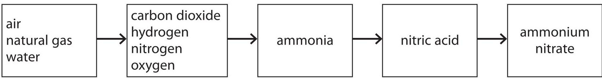

The hydrogen needed is formed in two reactions.
(a) Reaction 1 occurs between steam and methane in natural gas.
Balance the equation for this reaction.
$$
\mathrm {C H} _ {4} + \mathrm {H} _ {2} \mathrm {O} \rightarrow \mathrm {C O} + \mathrm {H} _ {2}
$$
(b) The equation for reaction 2 is
$$
\mathrm {C O} (\mathrm {g}) + \mathrm {H} _ {2} \mathrm {O} (\mathrm {g}) \rightleftharpoons \mathrm {C O} _ {2} (\mathrm {g}) + \mathrm {H} _ {2} (\mathrm {g}) \quad \Delta H = - 4 1 \mathrm {k J / m o l}
$$
(i) Assuming that this reaction reaches equilibrium, explain what happens to the yield of hydrogen if the reaction is carried out at a higher pressure but at the same temperature.
(ii) Assuming that this reaction reaches equilibrium, explain what happens to the yield of hydrogen if the reaction is carried out at a higher temperature but at the same pressure.
(c) Reaction 2 can be represented on an energy profile.

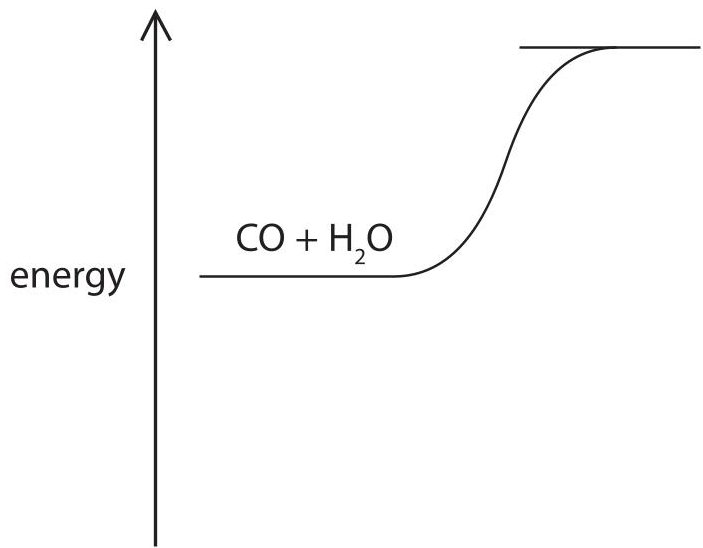

(i) Complete the profile by showing the products of the reaction and the enthalpy change for the reaction.
(ii) Reaction 2 is carried out using an iron oxide catalyst.
State the effect, if any, of using a catalyst on the enthalpy change for the reaction.
(iii) Explain how a catalyst increases the rate of a reaction.
(d) The equations for some other reactions used in the manufacture of ammonium nitrate are
$$
\mathrm {r e a c t i o n} 3 \quad \mathrm {N} _ {2} + 3 \mathrm {H} _ {2} \rightleftharpoons 2 \mathrm {N H} _ {3}
$$
reaction 4
$$
4 \mathrm {N H} _ {3} + 5 \mathrm {O} _ {2} \rightleftharpoons 4 \mathrm {N O} + 6 \mathrm {H} _ {2} \mathrm {O}
$$
reaction 5
$$
2 N O _ {2} \rightleftharpoons N _ {2} O _ {4}
$$
reaction 6
$$
\mathrm {N H} _ {3} + \mathrm {H N O} _ {3} \rightarrow \mathrm {N H} _ {4} \mathrm {N O} _ {3}
$$
Explain which two of these are redox reactions.
(e) The manufacturer produces a batch of 34 kg of ammonia.
Calculate the maximum mass of ammonium nitrate that can be made from this mass of ammonia, using reaction 6 in part (d).
Give a unit for your answer.
maximum mass of ammonium nitrate =
## BLANK PAGE
12 The production of polymers from crude oil involves several processes, including
- fractional distillation
- cracking
- purification
- polymerisation
(a) Three of the fractions obtained from fractional distillation are fuel oil, gasoline and kerosene.
(i) Identify which of these fractions has the darkest colour.
(ii) Identify which of these fractions has the highest boiling point.
(iii) Identify which of these fractions contains molecules with the fewest carbon atoms.
(b) Cracking involves heating some of the fractions to about $ 6 5 0 \, \mathrm{^ \circ C} $
(i) Name a catalyst used in industry for cracking.
(ii) One reaction that occurs in cracking involves the conversion of one molecule of hexadecane into one molecule of octane and two molecules of an alkene. Complete the equation for this reaction.
$$
\mathrm {C} _ {1 6} \mathrm {H} _ {3 4} \rightarrow \mathrm {C} _ {8} \mathrm {H} _ {1 8} +
$$
(iii) Give three reasons why cracking is carried out.
(c) One of the compounds sometimes present in crude oil has the formula $ \mathrm{C_{6} H_{1 2} S} $ Explain why it is important to remove this compound from a fuel.
(d) One compound obtained from crude oil is used as a monomer in polymerisation. It has the displayed formula

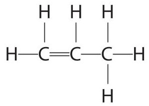

Complete the following structure to show a part of the polymer formed from this monomer.

(Total for Question 12 = 13 marks)
TOTAL FOR PAPER=120 MARKS
## BLANK PAGE
Every effort has been made to contact copyright holders to obtain their permission for the use of copyright material. Pearson Education Ltd. will, if notified, be happy to rectify any errors or omissions and include any such rectifications in future editions.
