<table><tr><td colspan="3">Write your name here</td></tr><tr><td>Surname</td><td colspan="2">Other names</td></tr><tr><td>Pearson Edexcel Certificate</td><td>Centre Number</td><td>Candidate Number</td></tr><tr><td>Pearson Edexcel International GCSE</td><td></td><td></td></tr><tr><td colspan="3">Chemistry</td></tr><tr><td colspan="3">Unit: KCH0/4CH0
Science (Double Award) KSC0/4SC0
Paper: 1C</td></tr><tr><td colspan="2">Wednesday 11 January 2017 – Morning
Time: 2 hours</td><td>Paper Reference
KCH0/1C 4CH0/1C
KSC0/1C 4SC0/1C</td></tr><tr><td colspan="3">You must have:
Calculator, ruler</td></tr><tr><td colspan="3">Total Marks</td></tr></table>

## Instructions

- Use black ink or ball-point pen.

- Fill in the boxes at the top of this page with your name, centre number and candidate number.

- Answer all questions.

- Answer the questions in the spaces provided

- there may be more space than you need.

- Show all the steps in any calculations and state the units.

- Some questions must be answered with a cross in a box. If you change your mind about an answer, put a line through the box and then mark your new answer with a cross.

## Information

- The total mark for this paper is 120.

- The marks for each question are shown in brackets

- use this as a guide as to how much time to spend on each question.

## Advice

- Read each question carefully before you start to answer it.

- Write your answers neatly and in good English.

- Try to answer every question.

- Check your answers if you have time at the end.

Turn over

<table class="table table-bordered"><thead><tr><th>7 Li</th><th>9 Be</th></tr></thead><tbody><tr><td>23 Na</td><td>24 Mg</td></tr><tr><td>39 K</td><td>40 Ca</td></tr><tr><td>86 Rb</td><td>88 Sr</td></tr><tr><td>133 Cs</td><td>137 Ba</td></tr><tr><td>223 Fr</td><td>226 Ra</td></tr></tbody></table>
## Answer ALL questions.
1 Substances can be elements, compounds or mixtures.
(a) Which of these is a correct symbol for an element?
A He
B $ \mathrm{H}_{2} $
C $ \mathrm{H}_{2} \mathrm{O} $
D $ \mathrm{H}_{2} \mathrm{O}_{2} $
(b) Which of these substances is a compound?
A air
B hydrogen
C oxygen
D water
(c) Which of these methods is used to obtain water from a mixture containing salt and water?
A crystallisation
B filtration
C simple distillation
D titration
(d) Paper chromatography is used to separate the dyes present in some inks.
A sample of ink, P, is spotted on to some chromatography paper.
Four known inks, A, B, C and D, are also spotted on to the same paper.
The diagram shows how the experiment is set up and the paper at the end of the experiment.

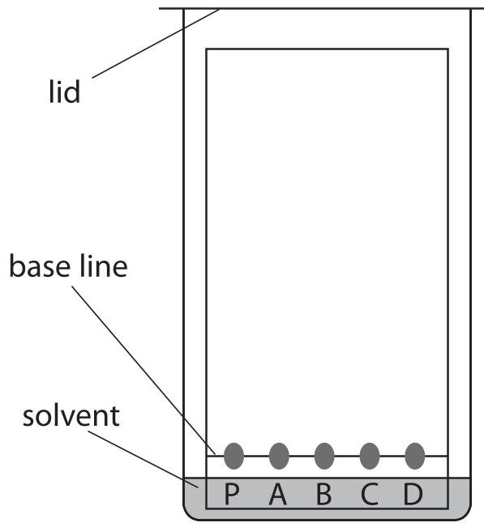

at beginning

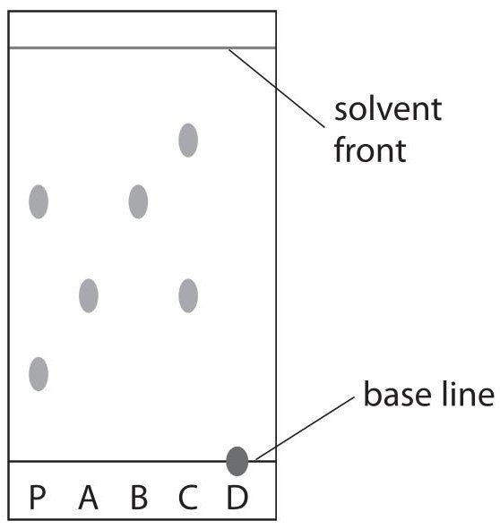

at end

(i) State why the solvent level should not be above the base line at the start of the experiment.
(ii) Explain which dye, present in one of the inks A, B, C or D, is also present in ink P.
(iii) State why ink D does not move during the experiment.
(iv) Dyes have an $ R_{\mathrm{f}} $ value that can be calculated using this expression.
$$
R _ {\mathrm {f}} = \frac {\mathrm {d i s t a n c e m o v e d b y d y e}}{\mathrm {d i s t a n c e m o v e d b y s o l v e n t}}
$$
Complete the table for the dye in ink A.
<table border="1"><tr><td>distance moved by dye in ink A in mm</td><td></td></tr><tr><td>distance moved by solvent in mm</td><td>49</td></tr><tr><td>Rfvalue of dye in ink A</td><td></td></tr></table>
(e) The diagram shows an experiment to demonstrate diffusion.

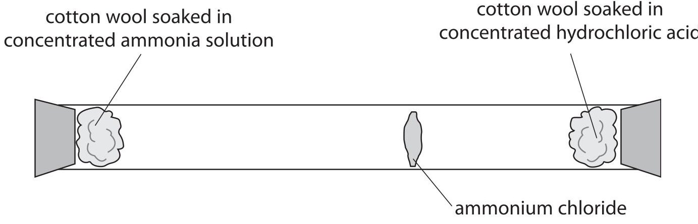

(i) The word equation for the reaction that occurs in this experiment is
$$
\mathrm {a m m o n i a} + \mathrm {h y d r o g e n c h l o r i d e} \rightarrow \mathrm {a m m o n i u m c h l o r i d e}
$$
Complete the chemical equation for this reaction.
$$
\mathrm {N H} _ {3} + \mathrm {H C l} \rightarrow \dots \dots
(ii) Draw a circle around each of the two state symbols that could be included in the chemical equation in part (e)(i).

(Total for Question 1 = 11 marks)
2 The diagram shows the arrangement of the molecules in two of the three states of water. Each circle represents a molecule of water.

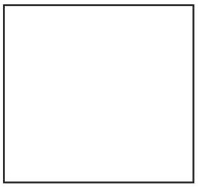

solid

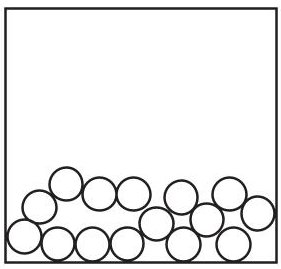

liquid

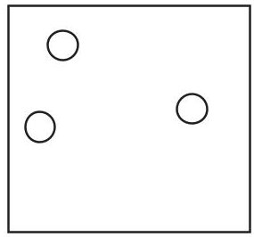

gas
(a) Complete the diagram to show how the molecules of water are arranged in the solid state.
(b) Which row of the table correctly describes the arrangement and movement of molecules of water in the solid state?
A
B
D
C
<table border="1"><tr><td>Arrangement</td><td>Movement</td></tr><tr><td>regular</td><td>moving freely</td></tr><tr><td>random</td><td>moving freely</td></tr><tr><td>regular</td><td>vibrating</td></tr><tr><td>random</td><td>vibrating</td></tr></table>
(c) Which word describes water changing from a liquid to a solid?
(1) 
A boiling
B condensing
freezing
D melting
(d) Give the word used to describe the change of state represented by this equation.
$$
\mathrm {H} _ {2} \mathrm {O} (\mathrm {s}) \rightarrow \mathrm {H} _ {2} \mathrm {O} (\mathrm {g})
$$
(e) Water is the name used for $ \mathrm{H}_{2} \mathrm{O} ( \mathrm{I} ) $
Give the two names used for $ \mathrm{H}_{2} \mathrm{O} (\mathrm{g}) $
(Total for Question 2 = 6 marks)
3 The diagram shows formulae for six organic compounds.
<table border="1"><tr><td>U
CH4</td><td>V
H
H-C-Br
H</td><td>W
CH2=CH2</td></tr><tr><td>X
C8H18</td><td>Y
C2H4Cl2</td><td>Z
C2H6O</td></tr></table>
(a) Which letter represents a compound shown as a displayed formula?
(b) Which two letters represent compounds that are members of the same homologous series?
(c) Which letter represents a compound that is formed from methane by a substitution reaction?
(d) Compounds U and W are burned in air.
Compound U undergoes complete combustion and compound W undergoes incomplete combustion.
(i) Balance the chemical equations for these reactions.
$$
\begin{array}{l} \mathrm {C H} _ {4} + \mathrm {O} _ {2} \rightarrow \mathrm {C O} _ {2} + \mathrm {H} _ {2} \mathrm {O} \\ \mathrm {C} _ {2} \mathrm {H} _ {4} + \mathrm {O} _ {2} \rightarrow \mathrm {C O} + \mathrm {H} _ {2} \mathrm {O} \\ \end{array}
$$
(ii) State why the carbon monoxide formed from compound W is poisonous.
(e) Burning compound X in a car engine can cause an environmental problem.
These steps show how the environmental problem occurs.
step1 two gases react to form nitrogen oxides
step 2 nitrogen oxides react with water in the atmosphere to form an acid
step 3 this acid damages some building materials
(i) Name the two gases that react to form nitrogen oxides.
(ii) Give the formula of the acid formed in step 2.
(iii) Name a building material that is damaged by this acid.
(Total for Question 3 = 9 marks)
4 (a) The term species is sometimes used to refer to neutral atoms and to positive and negative ions.
The table shows the numbers of subatomic particles in eight different species.
<table border="1"><tr><td>Species</td><td>Number of protons</td><td>Number of neutrons</td><td>Number of electrons</td></tr><tr><td>A</td><td>5</td><td>5</td><td>5</td></tr><tr><td>B</td><td>5</td><td>6</td><td>5</td></tr><tr><td>C</td><td>6</td><td>7</td><td>5</td></tr><tr><td>D</td><td>6</td><td>7</td><td>7</td></tr><tr><td>E</td><td>7</td><td>7</td><td>7</td></tr><tr><td>F</td><td>7</td><td>7</td><td>10</td></tr><tr><td>G</td><td>8</td><td>8</td><td>10</td></tr><tr><td>H</td><td>8</td><td>10</td><td>10</td></tr></table>
(i) Explain which two letters represent neutral atoms of the same element.
(ii) Explain which two letters represent negative ions formed from the same element.
(iii) Explain which letter represents the atom with the lowest mass number.
(iv) What is the electronic configuration of species E?
(b) The table shows the percentage composition of a sample of magnesium.
<table border="1"><tr><td>Isotope</td><td>$^{24}$Mg</td><td>$^{25}$Mg</td><td>$^{26}$Mg</td></tr><tr><td>Percentage(%)</td><td>78.6</td><td>10.1</td><td>11.3</td></tr></table>
Calculate the relative atomic mass of magnesium.
Give your answer to one decimal place.
(Total for Question 4 = 12 marks)
5 The diagram shows the positions of some elements in four periods of the Periodic Table.

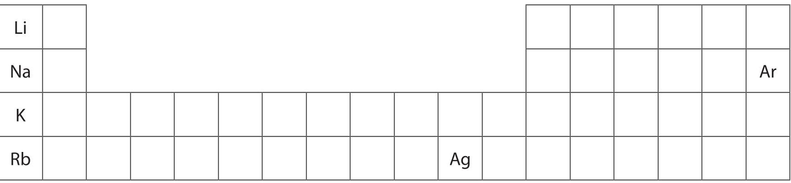

(a) (i) What numbers are used to identify the periods shown in this diagram?
(ii) Explain which element in the diagram is the least reactive.
(iii) State the similarity in the electronic configurations of Na and Ar.
(iv) State the similarity in the electronic configurations of Na and Rb.
(v) State a physical property of Na that shows it is a metal.
(b) The diagram shows the addition of two of these elements to troughs containing water.

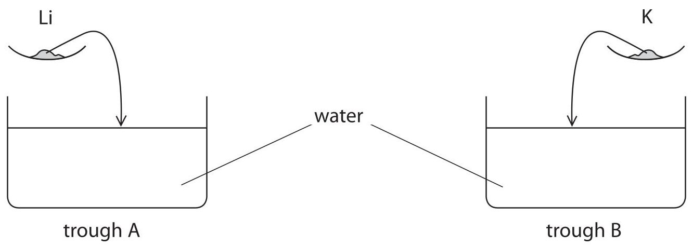

(i) State two observations that could be made in both troughs when the elements are added to water.
(ii) State one observation that could be made only in trough B.
(iii) Complete the chemical equation for the reaction that occurs in trough A.
$$
2 \mathrm {L i} + 2 \mathrm {H} _ {2} \mathrm {O} \rightarrow
$$
(iv) After the reaction in trough A is complete, a few drops of phenolphthalein are added. The phenolphthalein changes colour. State the final colour of the phenolphthalein.
(v) Give the formula of the ion formed during the reaction in trough A that causes phenolphthalein to change colour.
(c) Silver (Ag) can be obtained from silver oxide by heating.
<table><tr><td>(c)</td><td>Silver (Ag) can be obtained from silver oxide by heating.</td></tr><tr><td></td><td>In an experiment, 32.4 g of silver is obtained by completely decomposing 34.8 g of silver oxide.</td></tr><tr><td>(i)</td><td>Calculate the mass of oxygen formed in this decomposition.</td></tr><tr><td></td><td>mass of oxygen = g</td></tr><tr><td>(ii)</td><td>Determine the empirical formula of silver oxide by calculating the amounts, in moles, of silver atoms (Ag) and oxygen atoms (O) obtained in this experiment.</td></tr><tr><td></td><td>empirical formula of silver oxide =</td></tr><tr><td></td><td>(Total for Question 5 = 17 marks)</td></tr></table>
6 Chlorine gas is bubbled through an aqueous solution of potassium bromide until a change in colour is seen.
(a) Write a chemical equation for this reaction.
(b) Explain the reaction that occurs.
In your answer, refer to
- the final colour
- the substance that causes the final colour
- the type of reaction
- the relative reactivities of the two Group 7 elements involved
## (Total for Question 6 = 6 marks)
7 This question is about the formation and reactions of some oxides.
(a) The diagram shows the apparatus that can be used to make hydrogen, which then reduces copper(II) oxide to copper.
The unreacted hydrogen is burned.

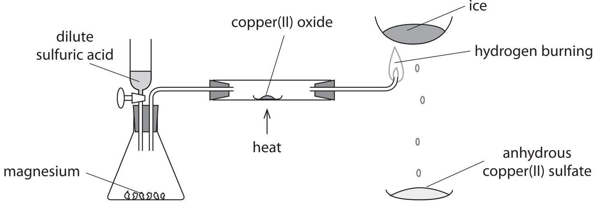

(i) Explain one safety precaution that should be taken after adding the dilute sulfuric acid and before lighting the unreacted hydrogen gas.
(ii) State two observations that could be made when the dilute sulfuric acid reacts with the magnesium.
(iii) State one observation that could be made when the hydrogen is passed over the heated copper(II) oxide.
(iv) State the final colour of the copper(II) sulfate.
(v) Complete the word equations for the reactions that occur.
(b) A sample of sulfur is burned in a gas jar of oxygen.
A piece of damp litmus paper is placed in the gas jar. The litmus paper changes colour.
Explain what this colour change shows about the acid-base character of the oxide of sulfur formed.
(c) The formulae of two oxides are MgO and $ \mathrm{S O_{2}} $
Suggest the formula of the salt formed when these two oxides neutralise each other.
(Total for Question 7 = 12 marks)
8 Dilute sulfuric acid can be used to make soluble and insoluble salts.
(a) A student plans an experiment to obtain a pure, dry sample of the soluble salt, sodium sulfate, from dilute sulfuric acid.
(i) The student does a titration to find the volume of sulfuric acid needed for complete reaction with the other reactant.
Describe the steps she should take in her titration Refer to these pieces of apparatus in your answer.
- pipette
- burette
- conical flask
(ii) The diagram shows the burette readings in one titration.

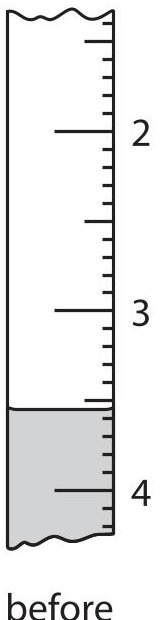

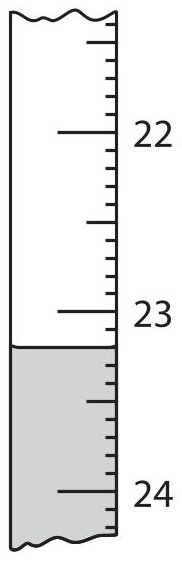

after

Use these readings to complete the table, giving all values to the nearest 0.05 $ cm^{3}. $
<table border="1"><tr><td>burette reading in $ \mathrm{c m^{3}} $ after adding solution</td><td></td></tr><tr><td>burette reading in $ \mathrm{c m^{3}} $ before adding solution</td><td></td></tr><tr><td>volume of solution added in $ \mathrm{c m^{3}} $</td><td></td></tr></table>
(b) The student plans a different experiment to obtain a pure, dry sample of the insoluble salt, barium sulfate, from dilute sulfuric acid.
Describe the steps she should take in her experiment.
9 A student prepares a sample of copper(II) sulfate crystals using this reaction.
$$
\mathrm {C u O (s)} + \mathrm {H} _ {2} \mathrm {S O} _ {4} (\mathrm {a q}) \rightarrow \mathrm {C u S O} _ {4} (\mathrm {a q}) + \mathrm {H} _ {2} \mathrm {O} (\mathrm {l})
$$
He obtains the crystals from the solution formed.
He records this information about the reactants he uses.
mass of copper(II) oxide = 6.3 g
volume of sulfuric acid = 52 $ cm^{3} $
concentration of sulfuric acid = 1.1 mol/dm $ ^{3} $
(i) Calculate the amount, in moles, of copper(II) oxide used.
amount of copper(II) oxide = mol
(ii) Calculate the amount, in moles, of sulfuric acid used.
amount of sulfuric acid = mol
(iii) Why is it important for the amount of copper(II) oxide to be greater than the amount of sulfuric acid?
(iv) Draw a diagram of the apparatus that the student should use to remove the excess copper(II) oxide from the reaction mixture.
(b) In a similar preparation the student uses 0.12 mol of copper(II) oxide to obtain crystals of copper(II) sulfate, $ \mathrm{C u S O_{4}. 5 H_{2}O} $
Calculate the maximum mass of $ \mathrm{C u S O_{4}. 5 H_{2} O} $ that he could obtain using this preparation.
## BLANK PAGE
10 A student does an experiment to investigate how the temperature changes as different masses of solid potassium nitrate are dissolved in water.
She looks at this graph to help her decide the masses of water and potassium nitrate to use in her experiment.
Solubility of potassium nitrate in g per 100 g of water

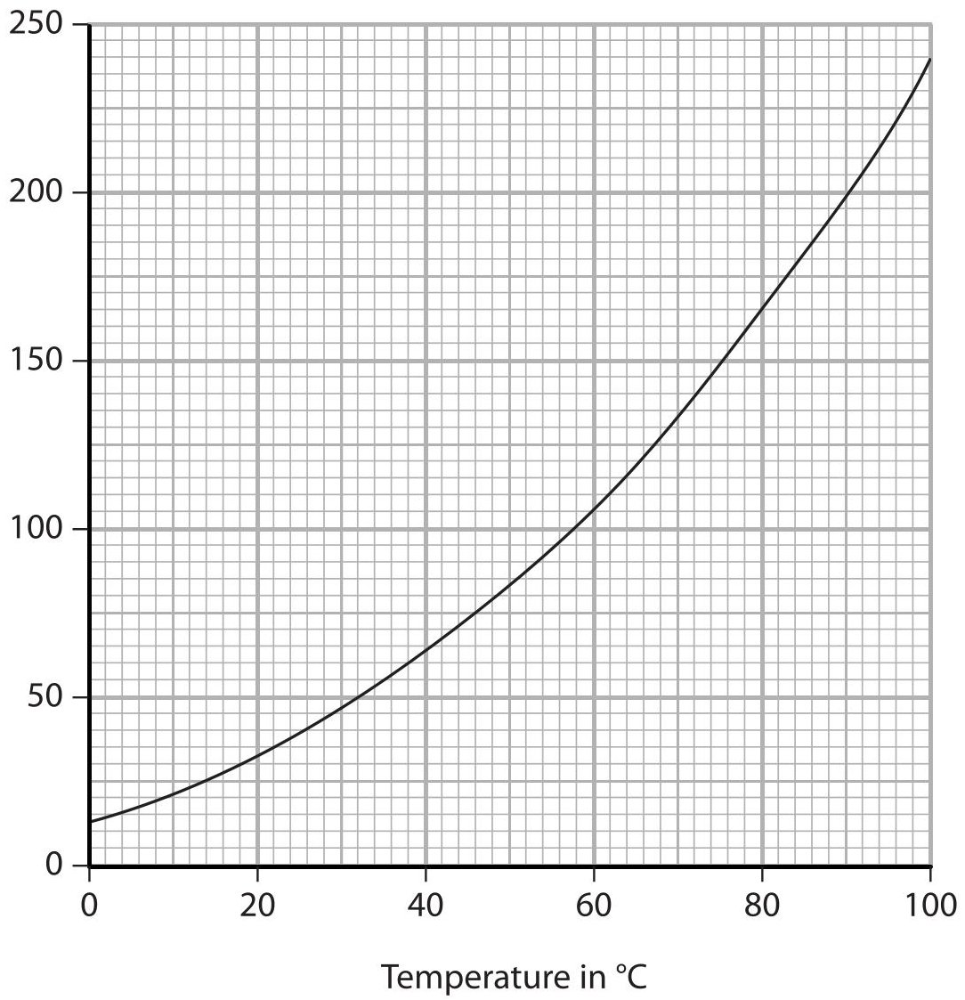

(a) The student decides to use a mass of 50 g of water at a temperature of 25 $ ^{\circ} \mathrm{C} $.
From the graph, find the maximum mass of potassium nitrate that dissolves in this experiment.
(b) The student prepares six samples of potassium nitrate, each with a mass of 2.0 g. She pours $ 5 0 \mathrm{c m}^{3} $ of water into a $ 1 0 0 \mathrm{c m}^{3} $ beaker and records the temperature of the water.
She then uses this method to find the change in temperature as she adds each sample of potassium nitrate.
- add the first sample of potassium nitrate to the beaker and stir until the sample dissolves
- record the temperature of the solution
- add the second sample of potassium nitrate to the solution in the beaker and stir until the sample dissolves
- record the new temperature of the solution
- repeat until all six samples of potassium nitrate have been added
The table shows her results.
<table border="1"><tr><td>Mass of potassium nitrate added in g</td><td>0.0</td><td>2.0</td><td>4.0</td><td>6.0</td><td>8.0</td><td>10.0</td><td>12.0</td></tr><tr><td>Temperature in℃</td><td>25.2</td><td>22.2</td><td>19.4</td><td>16.9</td><td>14.1</td><td>11.4</td><td>8.8</td></tr></table>
(i) Plot the student's results on the grid.
Draw a straight line of best fit.

(3) 

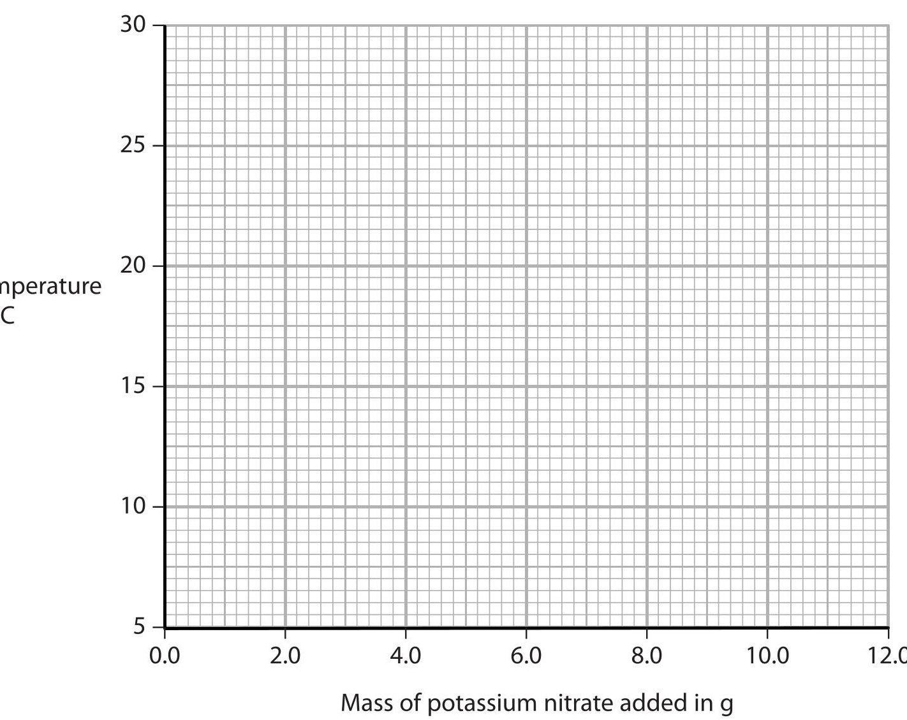

$$
\mathrm {i n} ^ {\circ} \mathrm {C}
$$
(ii) From the graph, find the mass of potassium nitrate that would be needed to produce a temperature change of $ 1 0. 0^{\circ} \mathrm{C} $
(iii) Explain how the student's results show the type of heat change that occurs when potassium nitrate dissolves in water.
(iv) Complete the energy level diagram for this experiment.

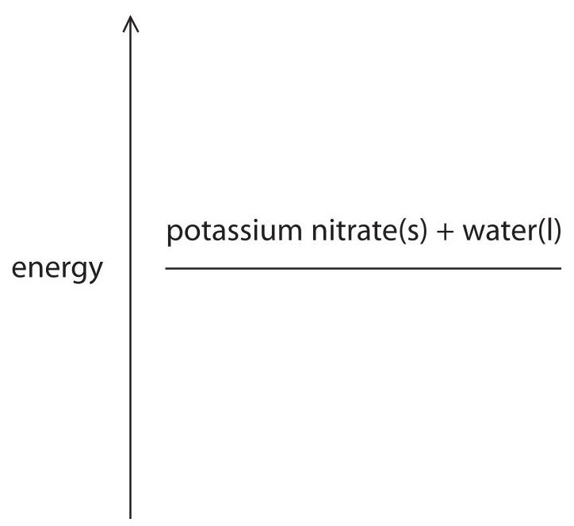

(c) The student repeats the experiment and obtains these results.
mass of water (m) = 50 g
total mass of potassium nitrate added = 15 g
starting temperature = 32 $ ^{\circ} C $
final temperature = 13 $ ^{\circ} C $
Calculate the heat energy change (Q), in joules, using the expression
$$
Q = m \times 4. 2 \times \Delta T
$$
[ $ \Delta T $ is the temperature change]
heat energy change (Q) = J
(Total for Question 10 = 10 marks)
## BLANK PAGE
11 Synthetic polymers are often manufactured from crude oil.
The main stages in the manufacture of one of these polymers are shown in this sequence.
$$
\mathrm {c r u d e o i l} \rightarrow \mathrm {f u e l o i l} \rightarrow \mathrm {p r o p e n e} \rightarrow \mathrm {p o l y (p r o p e n e)}
$$
(a) The diagram represents the fractionating column used in an oil refinery.

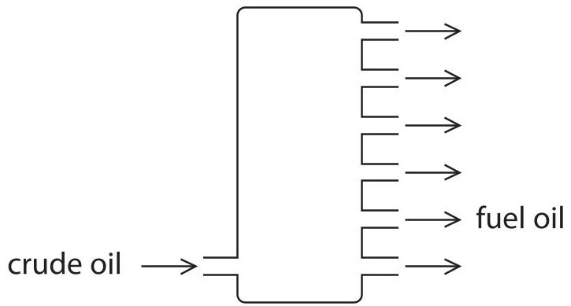

Describe how fractional distillation produces fuel oil from crude oil.
(b) Catalytic cracking at about $ 6 5 0 \, \mathrm{^ {\circ} C} $ converts fuel oil into propene.
(i) Name a catalyst used in this process.
(ii) One of the compounds in fuel oil has the formula $ C_{1 7} H_{3 6} $
Complete the equation for the cracking of one molecule of $ C_{1 7} H_{3 6} $ to form two molecules of propene and one molecule of another compound.
$$
\mathrm {C} _ {1 7} \mathrm {H} _ {3 6} \rightarrow 2 \mathrm {C} _ {3} \mathrm {H} _ {6} +
$$
(iii) Explain why all the compounds in this cracking reaction are classified as hydrocarbons. (2)
(iv) Explain which two compounds in this cracking reaction are described as saturated. (2)
(c) Some crude oil contains an impurity known as DMDS.
DMDS contains atoms of carbon, hydrogen and sulfur in a 1:3:1 ratio.
The relative molecular mass of DMDS is 94.
Determine the molecular formula of DMDS.
molecular formula =
(d) Propene reacts with bromine.
Which of these is the formula of the product of this reaction?
A $ \mathrm{C}_{3} \mathrm{H}_{7} \mathrm{Br} $
B $ \mathrm{C}_{3} \mathrm{H}_{6} \mathrm{Br}_{2} $
C $ \mathrm{C_{3} H_{5} B r_{3}} $
D $ \mathrm{C}_{3} \mathrm{H}_{4} \mathrm{Br}_{4} $
(e) The conversion of propene into poly(propene) can be represented by this equation.
$$
n C _ {3} H _ {6} \rightarrow \left(C _ {3} H _ {6}\right) _ {n}
$$
(i) Draw the displayed formula of propene.
(ii) Draw the repeat unit of poly(propene).
TOTAL FOR PAPER=120 MARKS
## BLANK PAGE
## BLANK PAGE
Every effort has been made to contact copyright holders to obtain their permission for the use of copyright material. Pearson Education Ltd. will, if notified, be happy to rectify any errors or omissions and include any such rectifications in future editions.
