<table><tr><td colspan="3">Write your name here</td></tr><tr><td>Surname</td><td colspan="2">Other names</td></tr><tr><td>Pearson Edexcel International GCSE</td><td>Centre Number</td><td>Candidate Number</td></tr><tr><td colspan="3">Chemistry
Unit: 4CH0
Science (Double Award) 4SC0
Paper: 1CR</td></tr><tr><td colspan="2">Thursday 18 May 2017 – Morning
Time: 2 hours</td><td>Paper Reference
4CH0/1CR
4SC0/1CR</td></tr><tr><td colspan="3">You must have:
Ruler
Calculator</td><td>Total Marks</td></tr></table>

## Instructions

- Use black ink or ball-point pen.

- Fill in the boxes at the top of this page with your name, centre number and candidate number.

- Answer all questions.

- Answer the questions in the spaces provided

- there may be more space than you need.

- Show all the steps in any calculations and state the units.

- Some questions must be answered with a cross in a box. If you change your mind about an answer, put a line through the box and then mark your new answer with a cross.

## Information

- The total mark for this paper is 120.

- The marks for each question are shown in brackets

- use this as a guide as to how much time to spend on each question.

## Advice

- Read each question carefully before you start to answer it.

- Write your answers neatly and in good English.

- Try to answer every question.

- Check your answers if you have time at the end.

Turn over

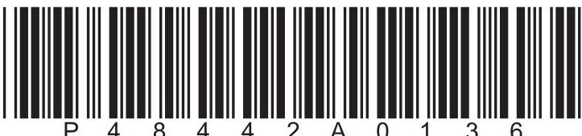

THE PERIODIC TABLE

<table class="table table-bordered"><thead><tr><th>7 Li</th><th>9 Be</th></tr></thead><tbody><tr><td>23 Na</td><td>24 Mg</td></tr><tr><td>39 K</td><td>40 Ca</td></tr><tr><td>86 Rb</td><td>88 Sr</td></tr><tr><td>133 Cs</td><td>137 Ba</td></tr><tr><td>223 Fr</td><td>226 Ra</td></tr></tbody></table>

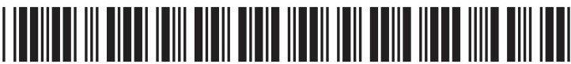

## BLANK PAGE

## Answer ALL questions.

1 Bromine is an element in Group 7 of the Periodic Table.

(a) Which of these is the formula for a molecule of bromine?

A 2Br

B $ \mathrm{B r^{2}} $

Br2 C

D $ \mathrm{B r}_{2} $

(b) A small amount of liquid bromine is placed in a gas jar containing air. The jar is then sealed.

After two minutes, a brown gas is seen just above the surface of the liquid.

After two hours, the whole gas jar is full of the brown gas.

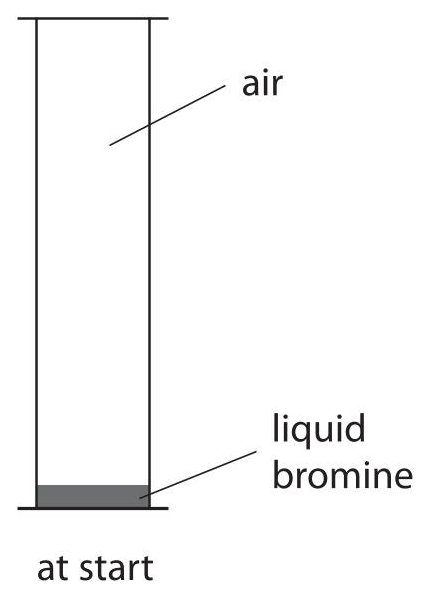

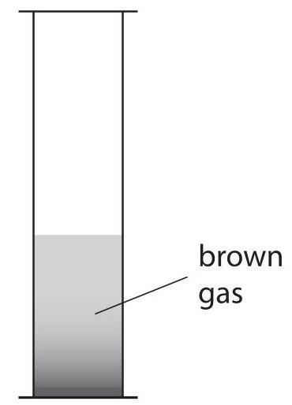

after two minutes

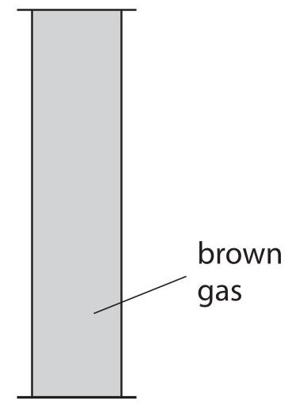

after two hours

(i) Which of these is the process that causes the brown gas to fill the gas jar?

A condensation

B diffusion

evaporation

sublimation

(ii) Explain, using the particle theory, the observations seen in the gas jar.

(c) This apparatus is used to demonstrate the movement of ammonia gas and hydrogen chloride gas.

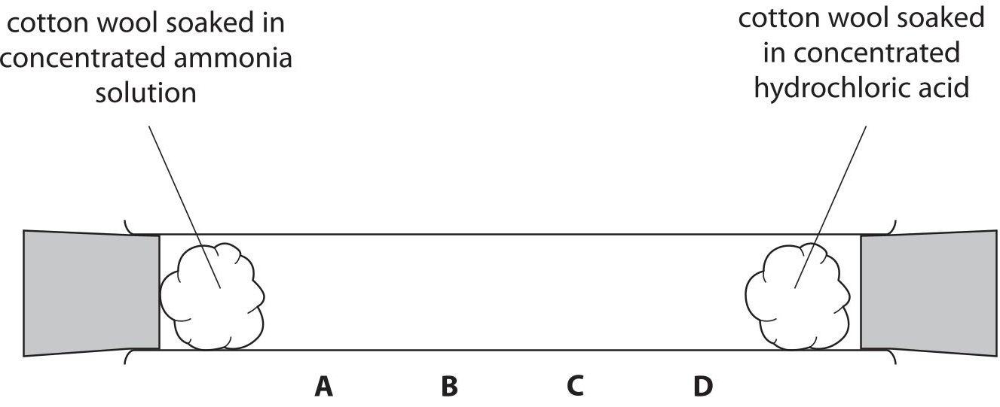

The gases are given off by the solutions at each end of the tube. When the gases meet, they form a white solid. Which letter shows the position where the white solid forms?

A

B

C

D

(Total for Question 1 = 5 marks)

2 Iron is a metal that has many uses. One problem with iron is that it can rust when exposed to air.

(a) Name the two substances that must be present in air for iron to rust.

(b) These are four methods of preventing iron from rusting

- painting

- oiling

- coating in plastic

- galvanising

The table lists three items made from iron.

Complete the table by giving the best method of preventing each item from rusting.

You may use each method once, more than once or not at all.

<table border="1"><tr><td>Item</td><td>Method</td></tr><tr><td>bicycle chain</td><td></td></tr><tr><td>bridge</td><td></td></tr><tr><td>car body</td><td></td></tr></table>

(c) Which of these metals is used to galvanise iron?

(1) 

A aluminium

B lead

C tin

D zinc

(Total for Question 2 = 6 marks)

3 (a) The box shows some methods that can be used to separate mixtures.

<table border="1"><tr><td>crystallisation</td><td>dissolving</td><td>filtration</td></tr><tr><td>fractional distillation</td><td>paper chromatography</td><td>simple distillation</td></tr></table>

The table lists some separations.

Complete the table by giving the best method for each separation.

You may use each method once, more than once or not at all.

<table border="1"><tr><td>Separation</td><td>Method</td></tr><tr><td>to obtain sand from a mixture of sand and water</td><td></td></tr><tr><td>to separate crude oil into its components</td><td></td></tr><tr><td>to obtain pure water from sea water</td><td></td></tr><tr><td>to obtain ethanol from a mixture of ethanol and water</td><td></td></tr></table>

(b) When a mixture of ethanol and water is separated, two colourless liquids, A and B, are obtained.

Liquid A is ethanol containing a small amount of water.

Liquid B is pure water.

(i) Describe a chemical test to show that liquid A contains water.

(ii) Describe a physical test to show that liquid B is pure water.

4 The Periodic Table consists of elements arranged in order of increasing atomic number.

(a) (i) What is meant by the term atomic number?

(1) 

A the number of neutrons in an atom

B the number of protons in an atom

C the number of protons plus the number of electrons in an atom

D the number of protons plus the number of neutrons in an atom

(ii) Elements in the same group of the Periodic Table have similar chemical properties. This is because their atoms contain the same number of

(1) 

A protons

B neutrons

C electrons in the outer shell

D protons and neutrons

(b) The elements in the periods of the Periodic Table show a change in properties across the period from left to right.

The table gives information about some elements in Period 2.

<table border="1"><tr><td></td><td>Li</td><td>Be</td><td>B</td><td>C</td><td>N</td><td>F</td></tr><tr><td>melting point</td><td>low</td><td>high</td><td>high</td><td></td><td></td><td></td></tr><tr><td>structure</td><td></td><td>giant</td><td>giant</td><td></td><td></td><td>molecular</td></tr><tr><td>acid-base character of the oxide</td><td></td><td>basic</td><td>acidic</td><td></td><td></td><td></td></tr></table>

- giant or molecular for structure

- high or low for melting point

Complete the table by writing one of these words in each blank space.

- acidic or basic for acid-base character of the oxide

(Total for Question 4 = 5 marks)

5 A student uses this apparatus to investigate the rate of reaction between an excess of magnesium and two different dilute acids, X and Y.

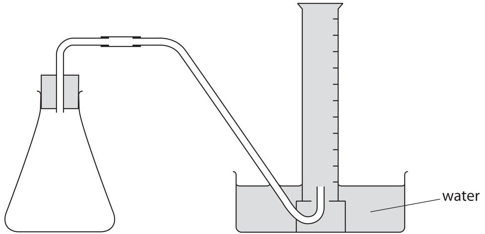

This is the method given to the student.

- place 0.5g of magnesium ribbon into the conical flask

- use a measuring cylinder to add $ 5 0 \mathrm{c m}^{3} $ of dilute acid X and then replace the bung

- record the total volume of gas collected every 20 seconds for two minutes

- repeat the method using $ 5 0 \mathrm{c m}^{3} $ of dilute acid Y instead of dilute acid X

- in each experiment, keep the temperature the same and the magnesium in excess

(a) The student decides to use a burette, rather than a measuring cylinder, to add the acid to the conical flask.

(i) Using a burette would be an improvement only if another change is made to the method.

State the other change needed to the method.

(ii) State the advantage of using a burette.

(b) The table shows the student's results.

<table border="1"><tr><td></td><td>Time in s</td><td>0</td><td>20</td><td>40</td><td>60</td><td>80</td><td>100</td><td>120</td></tr><tr><td>Acid X</td><td>Total volume of gas collected in cm3</td><td>0</td><td>6</td><td>11</td><td>15</td><td>18</td><td>20</td><td>21</td></tr><tr><td>Acid Y</td><td>Total volume of gas collected in cm3</td><td>0</td><td>12</td><td>22</td><td>30</td><td>37</td><td>43</td><td>48</td></tr></table>

Draw a curve of best fit for each set of points.

Plot the results for each acid on the grid.

Label each curve as acid X or acid Y.

(4) 

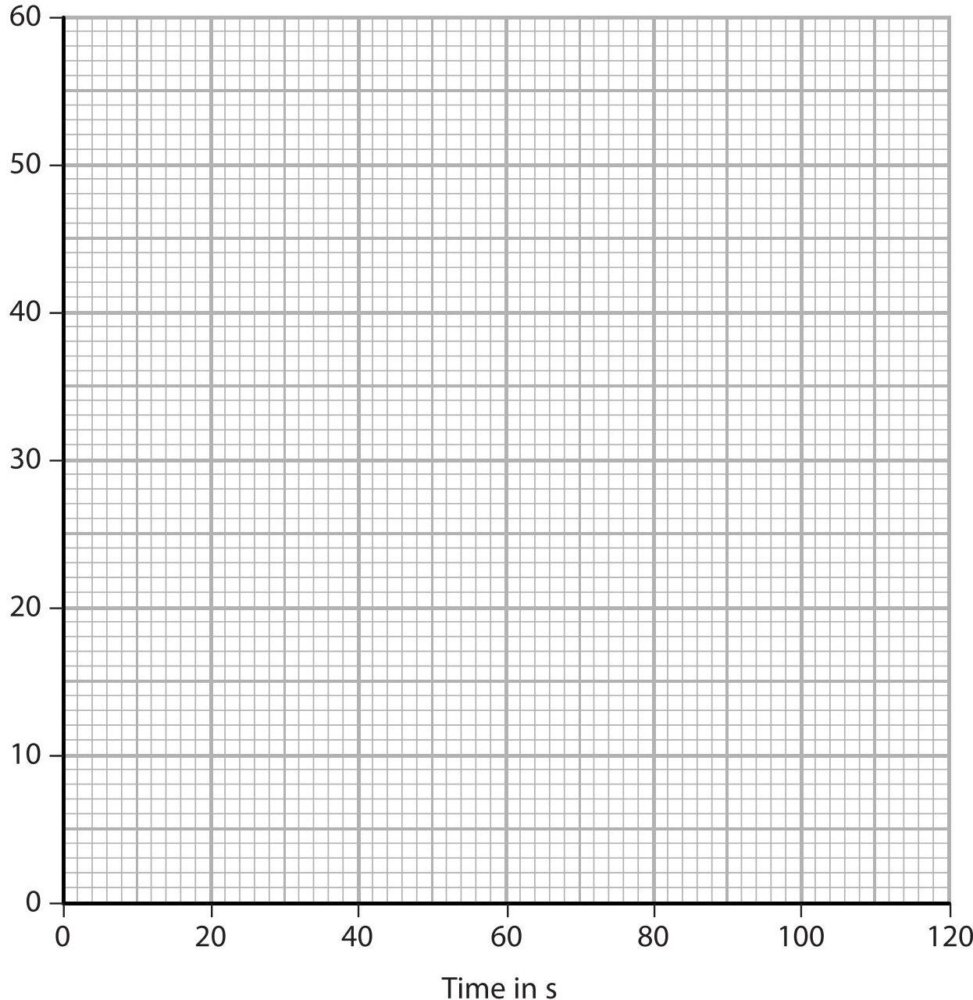

(c) Explain how the curves show which acid has the greater concentration.

(d) Use the graph to find the total volume of gas collected at 70s for acid X. Show on the graph how you obtained your answer.

volume of gas =

(e) The average (mean) rate of the reaction for acid Y can be calculated using the expression

$$
\mathrm {a v e r a g e r a t e} = \frac {\mathrm {t o t a l v o l u m e o f g a s c o l l e c t e d}}{\mathrm {t i m e t o c o l l e c t t h e g a s}}
$$

Calculate the average rate, in $ cm^{3}/s $ , for the first 30s for acid Y.

(Total for Question 5 = 12 marks)

## BLANK PAGE

6 Copper and iron are metals. They have the typical properties of metals, including a high melting point and good electrical conductivity.

(a) (i) Draw a labelled diagram to show the arrangement of the particles involved in the bonding within a metal.

(ii) Explain why metals have good electrical conductivity.

(iii) Suggest why some metals have high melting points.

(b) Copper and iron both form compounds containing ions with a 2+ charge.

Sodium hydroxide is used to distinguish between solutions containing $ \mathrm{C u}^{2+} $ and $ \mathrm{F e}^{2+} $ ions.

What would be observed when aqueous sodium hydroxide is added separately to each solution?

(c) Copper can be found naturally as a pure metal.

Iron is found only in compounds and has to be extracted by chemical reactions.

(i) Suggest why copper can be found as a pure metal.

(ii) The most common method of extracting iron is by the reduction of iron(III) oxide in a blast furnace.

The diagram shows a blast furnace.

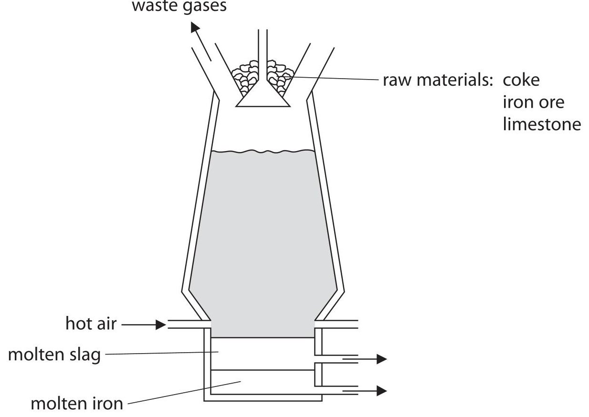

Write a chemical equation to show how carbon monoxide forms in the blast furnace. (1)

(iii) The equation for the reaction between iron(III) oxide and carbon monoxide is

$$
\mathrm {F e} _ {2} \mathrm {O} _ {3} + 3 \mathrm {C O} \rightarrow 2 \mathrm {F e} + 3 \mathrm {C O} _ {2}
$$

Explain which element is reduced in this reaction.

(iv) Describe how molten slag forms in the blast furnace.

(Total for Question 6 = 15 marks)

7 The diagram shows how a student attempts to prepare some hydrogen gas.

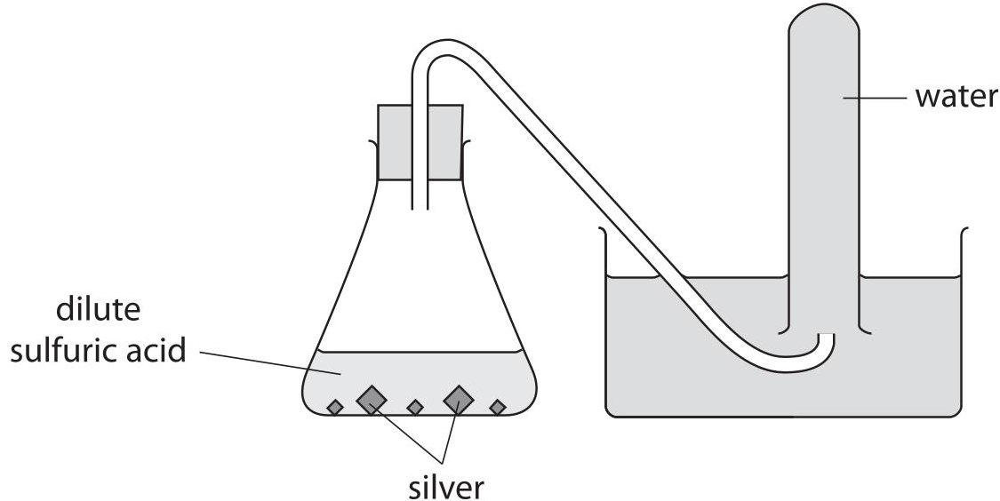

(a) (i) State why no hydrogen is produced.

(ii) Which of these pairs of chemicals could be used to safely prepare hydrogen?

A copper and dilute sulfuric acid

B gold and dilute hydrochloric acid

C potassium and dilute hydrochloric acid

D zinc and dilute sulfuric acid

(b) In an experiment, the student then successfully prepares some hydrogen and measures the volume of hydrogen collected.

She does the same experiment four times.

The table shows her results.

<table border="1"><tr><td>Experiment</td><td>Volume of hydrogen collected in $ \mathrm{c m^{3}} $</td></tr><tr><td>1</td><td>64</td></tr><tr><td>2</td><td>67</td></tr><tr><td>3</td><td>40</td></tr><tr><td>4</td><td>63</td></tr></table>

(i) Explain which experiment produces an anomalous result.

(ii) Calculate the average (mean) volume of hydrogen collected.

average volume =

(iii) Give a reason why it is important for the student to repeat the experiment.

(Total for Question 7 = 6 marks)

8 When iodine reacts with an excess of chlorine at $ - 8 0^{\circ} \mathrm{C} $ , a compound forms. The percentage composition by mass of this compound is

$$
\mathrm {I} = 5 4. 4 \% \quad \mathrm {C I} = 4 5. 6 \%
$$

(a) Show, by calculation, that the empirical formula of this compound is $ \mathrm{I C I}_{3} $

(b) The molecular formula of this compound is $ \mathrm{I}_{2} \mathrm{C l}_{6} $

$ \mathrm{I}_{2} \mathrm{C l}_{6} $ is a yellow solid at room temperature and forms a liquid when heated. A dynamic equilibrium exists in this liquid, represented by this equation.

$$
\mathrm {I} _ {2} \mathrm {C l} _ {6} (\mathrm {I}) \rightleftharpoons \mathrm {I C l} _ {2} ^ {+} (\mathrm {I}) + \mathrm {I C l} _ {4} ^ {-} (\mathrm {I})
$$

(i) When a reaction is in dynamic equilibrium, the forward and backward reactions occur at the same time.

State two other features of a reaction that is in dynamic equilibrium.

(ii) Suggest why liquid $ \mathrm{I}_{2} \mathrm{Cl}_{6} $ conducts electricity, but solid $ \mathrm{I}_{2} \mathrm{Cl}_{6} $ does not.

(Total for Question 8 = 6 marks)

## BLANK PAGE

9 Bromine, chlorine and iodine are halogens in Group 7 of the Periodic Table. The three halogens have similar chemical properties but different reactivities.

(a) A teacher uses this apparatus to demonstrate the difference in reactivity between these halogens.

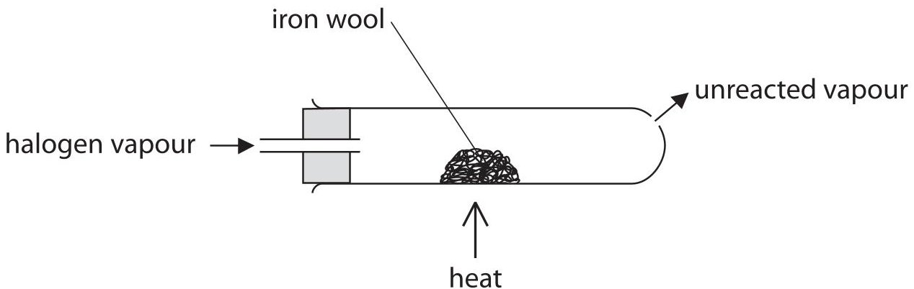

The teacher does each experiment in a fume cupboard.

The table shows the observation for each halogen.

<table border="1"><tr><td>Halogen</td><td>Observation</td></tr><tr><td>bromine</td><td>the iron wool glows brightly</td></tr><tr><td>chlorine</td><td>the iron wool glows very brightly</td></tr><tr><td>iodine</td><td>the iron wool glows dimly</td></tr></table>

(i) Suggest why the teacher uses a fume cupboard.

(ii) Use the information in the table to explain the order of reactivity of the three halogens.

(iii) A student states that the order of reactivity cannot be found from this experiment because bromine is a liquid, chlorine is a gas and iodine is a solid at room temperature. Evaluate the student's statement.

(b) Bromine, chlorine and iodine all react with hydrogen.

In each reaction, a hydrogen halide (HX) is formed, where X represents the halogen.

(i) Write a chemical equation for the reaction between hydrogen and bromine.

(ii) Draw a dot and cross diagram to represent a molecule of hydrogen chloride, HCl. Show only the outer shell electrons.

(iii) Name the solution formed when hydrogen chloride dissolves in water.

10 A student uses this apparatus to find the mass of magnesium oxide that forms when a strip of magnesium ribbon is burned in air.

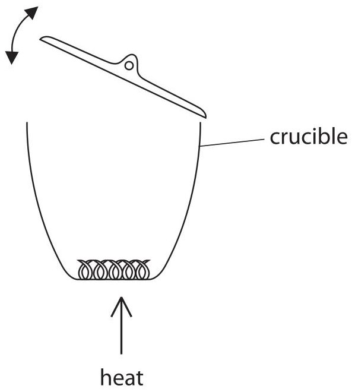

This is the student's method.

- weigh an empty crucible and lid

- place a coiled strip of freshly cleaned magnesium ribbon in the crucible

- weigh the crucible, lid and ribbon

- heat the crucible strongly for several minutes, lifting the lid and quickly replacing it several times

- leave the crucible, lid and contents to cool and then reweigh

(a) (i) Describe the appearance of the freshly cleaned magnesium ribbon and the appearance of the magnesium oxide that forms.

magnesium ribbon

magnesium oxide

(ii) Explain why the student lifts the lid and quickly replaces it several times during the experiment.

lifts lid

replaces lid

(b) Calculate the mass of oxygen required to completely react with 0.6 g of magnesium to form magnesium oxide.

The equation for the reaction is

$$
2 \mathrm {M g} + \mathrm {O} _ {2} \rightarrow 2 \mathrm {M g O}
$$

(c) The mass of magnesium oxide that forms is less than expected.

This could be because some of the magnesium reacts with nitrogen to form magnesium nitride, $ \mathrm{M g_{3} N_{2}} $

Write a chemical equation for the reaction between magnesium and nitrogen to form magnesium nitride.

(Total for Question 10 = 7 marks)

11 The alkanes are a homologous series of hydrocarbons.

The cycloalkanes are another homologous series of hydrocarbons, where the carbon atoms are arranged in a ring structure.

Cyclopropane is the simplest cycloalkane. It can be represented as

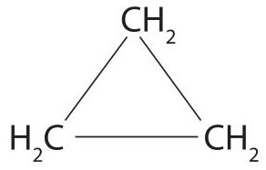

The tables give the names and molecular formulae of the first three members of each series.

<table border="1"><tr><td>Name of alkane</td><td>Molecular formula</td></tr><tr><td>methane</td><td>CH4</td></tr><tr><td>ethane</td><td>C2H6</td></tr><tr><td>propane</td><td>C3H8</td></tr></table>

<table border="1"><tr><td>Name of cycloalkane</td><td>Molecular formula</td></tr><tr><td>cyclopropane</td><td>C3H6</td></tr><tr><td>cyclobutane</td><td>C4H8</td></tr><tr><td>cyclopentane</td><td>C5H10</td></tr></table>

(a) One feature of a homologous series is that each member has the same general formula.

(i) What is the general formula for the homologous series of alkanes?

A $ C_{n} H_{n} $

B $ C_{n} H_{2 n-2} $

C $ C_{n} H_{2 n} $

D $ C_{n} H_{2 n+2} $

(ii) What is the general formula for the homologous series of cycloalkanes?

Use the information from the cycloalkane table to help you answer the question.

A $ C_{n} H_{n} $ B $ C_{n} H_{2 n-2} $ C $ C_{n} H_{2 n} $ D $ C_{n} H_{2 n+2} $

(iii) State two other features of a homologous series of compounds.

(b) Alkanes and cycloalkanes are saturated hydrocarbons.

(i) State what is meant by the term saturated.

(ii) Draw the displayed formula for ethane, $ \mathrm{C_{2} H_{6}} $

(iii) The displayed formula for cyclopropane is

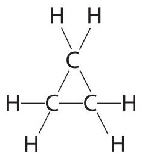

Draw a displayed formula for cyclobutane, $ \mathrm{C_{4} H_{8}} $

(c) The reaction between cyclopropane and bromine is similar to the reaction between methane and bromine.

One product of the reaction between cyclopropane and bromine is hydrogen bromide, HBr.

(i) State the condition required for this reaction to occur.

(ii) Complete the displayed formula for the other product of this reaction.

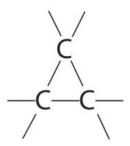

## BLANK PAGE

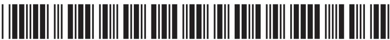

12 A student is given a mixture of two solid ionic compounds, A and B. Each solid contains one cation and one anion.

Compound A is insoluble in water. Compound B is soluble in water.

(a) Describe how the student could separate the mixture to obtain solid A and a solution of B.

(b) The table shows the results of two tests the student does on a solution of B.

<table border="1"><tr><td></td><td>Test</td><td>Observation</td></tr><tr><td>Test1</td><td>add sodium hydroxide solution and warm</td><td>bubbles of gas that turn damp red litmus blue</td></tr><tr><td>Test2</td><td>add silver nitrate solution
add dilute nitric acid to the white precipitate</td><td>white precipitate forms
precipitate does not dissolve</td></tr></table>

(i) Use the information in the table to identify the cation and the anion present in compound B.

cation anion

(ii) Identify the gas given off in test 1.

(c) The student adds dilute hydrochloric acid to solid A. A gas that turns limewater milky is given off.

(i) Explain which anion is present in solid A.

(ii) Give a test to show that solid A contains calcium ions.

(Total for Question 12 = 9 marks)

13 This apparatus can be used to find the volume of dilute sulfuric acid needed to neutralise 25.0 $ cm^{3} $ of aqueous sodium hydroxide, NaOH.

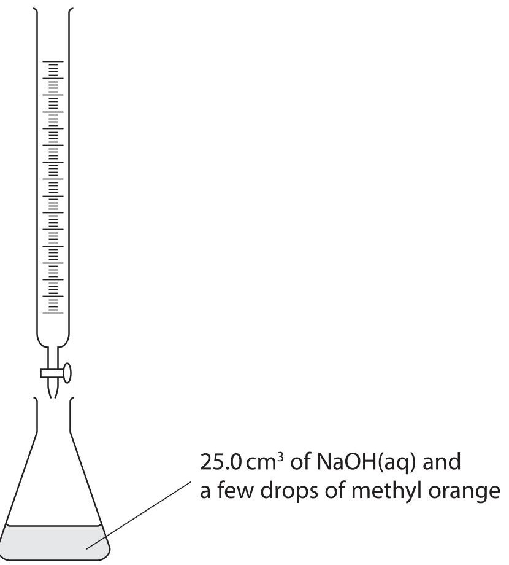

(a) Describe how to use the apparatus to find the volume of dilute sulfuric acid needed to neutralise the sodium hydroxide.

Assume that the apparatus is clean and does not need rinsing.

(4) 

(b) The volume of dilute sulfuric acid needed can also be found by measuring the highest temperature reached when the two solutions are mixed.

In a series of experiments, different volumes of dilute sulfuric acid are added separately to $ 2 5. 0 \mathrm{c m}^{3} $ samples of aqueous sodium hydroxide.

The graph shows the highest temperatures in each experiment.

In each reaction, the starting temperatures of the two solutions are the same.

$$
^{\circ} C
$$

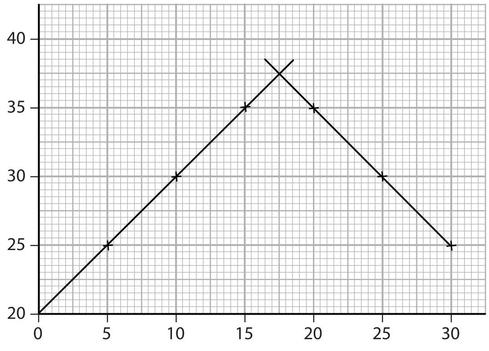

Volume of acid added in $ \mathrm{c m}^{3} $

Use the graph to answer these questions.

(i) State the starting temperature of each experiment.

starting temperature = ... $ ^{\circ} \mathrm{C} $

(ii) Find the volume of acid required to exactly neutralise the sodium hydroxide.

volume of acid=

(iii) Find the two different volumes of acid that produce an increase in temperature of $ 1 0^{\circ} \mathrm{C}. $

(Total for Question 13 = 7 marks)

14 Lithium is an element in Group 1 of the Periodic Table.

Lithium is stored in oil to prevent it from coming into contact with air and water.

(a) When a piece of lithium is removed from the oil, dried and cut, the exposed surface

A bubbles and fizzes

B changes from shiny to dull

C bursts into flame

D does not change

(b) When lithium is added to cold water in a beaker, hydrogen forms.

(i) State the test for hydrogen.

(ii) A few drops of phenolphthalein indicator are added to the solution in the beaker. Explain why the phenolphthalein turns pink.

(c) The table shows some information about lithium oxide and lithium carbonate. Complete the table by giving the two missing formulae.

<table border="1"><tr><td>Name of compound</td><td>Formula of compound</td><td>Formula of cation in compound</td><td>Formula of anion in compound</td></tr><tr><td>lithium oxide</td><td></td><td>Li+</td><td>O2-</td></tr><tr><td>lithium carbonate</td><td>Li2CO3</td><td>Li+</td><td></td></tr></table>

(d) Caesium is another element in Group 1 of the Periodic Table.

(i) The table below lists some statements about the reaction of caesium with cold water compared to the reaction of lithium with cold water.

Place ticks ( $ \checkmark $ ) in the boxes to show the two correct statements.

<table border="1"><tr><td>the reaction with caesium is more vigorous</td><td></td></tr><tr><td>the reaction with caesium produces a different gas</td><td></td></tr><tr><td>the reaction with caesium produces an acidic solution</td><td></td></tr><tr><td>the reaction with caesium produces a different compound</td><td></td></tr><tr><td>the reaction of caesium is endothermic</td><td></td></tr></table>

(ii) Write a chemical equation for the reaction of caesium with water.

(Total for Question 14 = 10 marks)

15 Hydrobromic acid can be neutralised by adding sodium hydroxide solution.

The equation for the reaction is

$$
\mathrm {H B r} + \mathrm {N a O H} \rightarrow \mathrm {N a B r} + \mathrm {H} _ {2} \mathrm {O}
$$

A solution of hydrobromic acid has a concentration of $ 0.200\mathrm{mol / dm}^{3}. $

(a) Calculate the amount, in moles, of HBr in $ 2 0. 0 \mathrm{c m}^{3} $ of the hydrobromic acid solution.

(b) Calculate the volume of $ 0.1 0 0 \mathrm{m o l} / \mathrm{d m}^{3} $ sodium hydroxide solution needed to exactly neutralise the hydrobromic acid.

Give the unit.

## volume of sodium hydroxide =

(c) In another neutralisation reaction, a student uses $ 3 0. 0 \mathrm{c m}^{3} $ of $ 0. 2 0 0 \mathrm{m o l} / \mathrm{d m}^{3} $ aqueous sodium hydroxide solution.

Calculate the mass of sodium hydroxide contained in this solution.

mass of sodium hydroxide =

(Total for Question 15 = 6 marks)

TOTAL FOR PAPER = 120 MARKS

## BLANK PAGE

## BLANK PAGE

Every effort has been made to contact copyright holders to obtain their permission for the use of copyright material. Pearson Education Ltd. will, if notified, be happy to rectify any errors or omissions and include any such rectifications in future editions.

