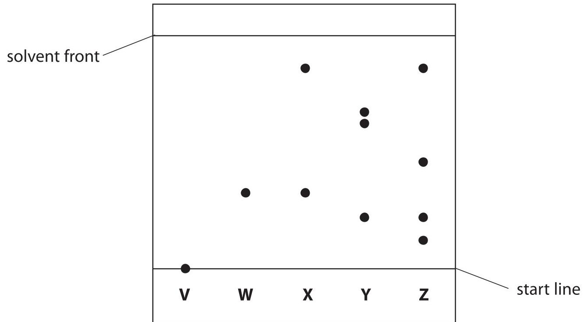
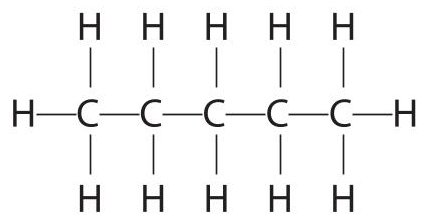
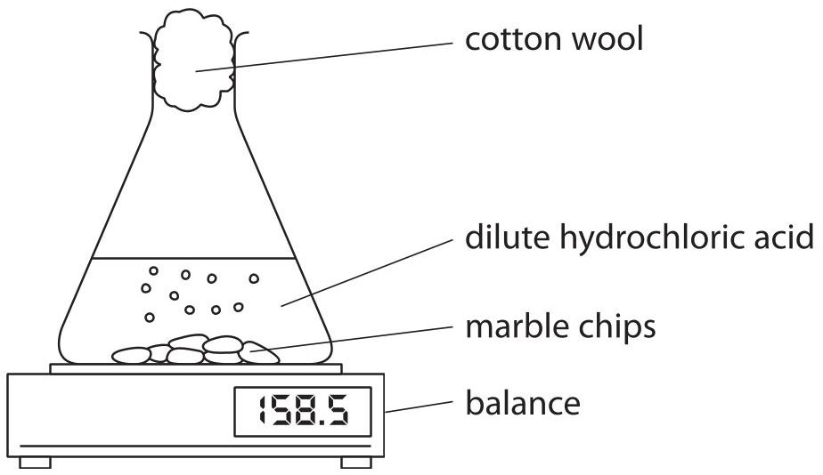
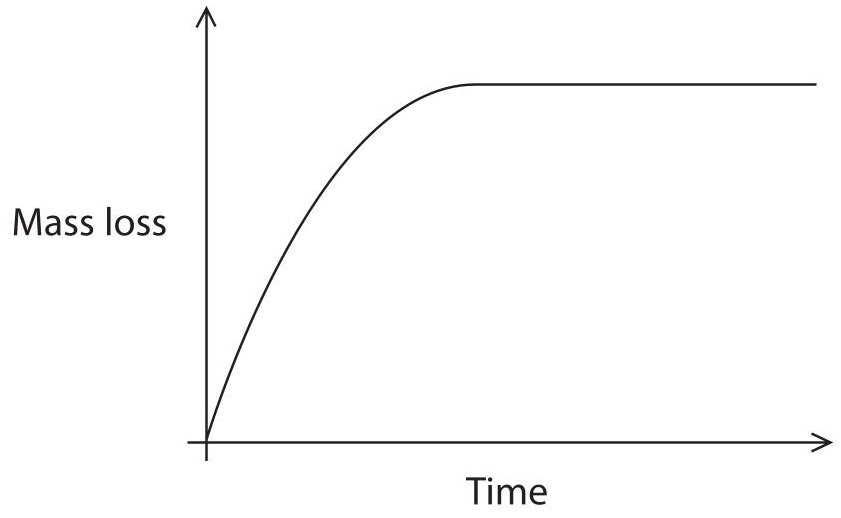
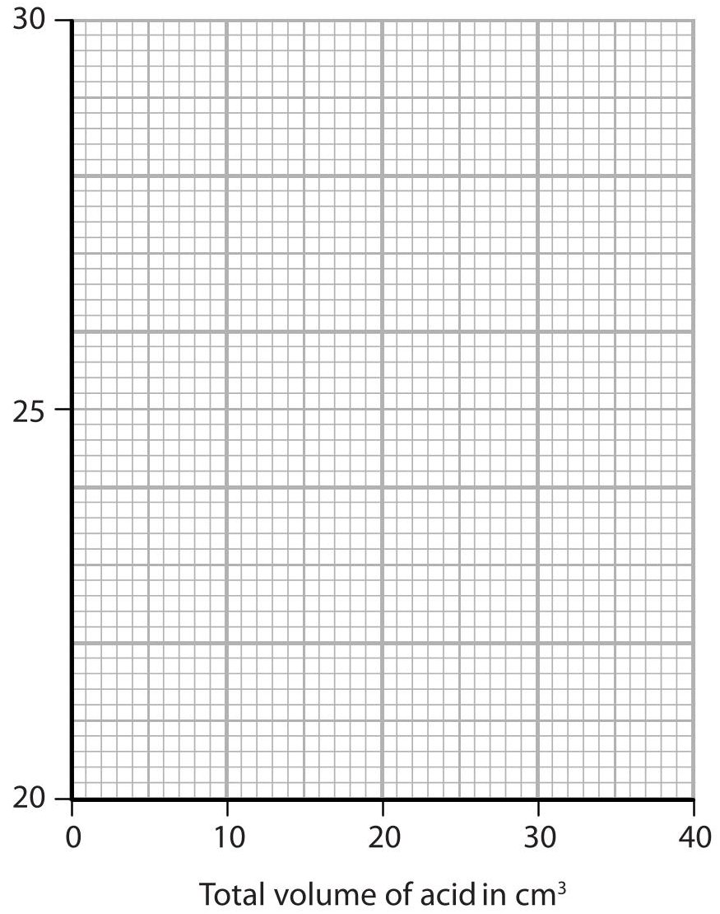
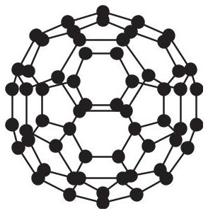

<table><tr><td colspan="3">Please check the examination details below before entering your candidate information</td></tr><tr><td>Candidate surname</td><td colspan="2">Other names</td></tr><tr><td colspan="3">Centre Number Candidate Number</td></tr><tr><td colspan="3">Pearson Edexcel International GCSE (9-1)</td></tr><tr><td colspan="3">Thursday 16 May 2019</td></tr><tr><td>Morning (Time: 2 hours)</td><td colspan="2">Paper Reference 4CH1/1CR 4SD0/1CR</td></tr><tr><td colspan="3">Chemistry
Unit: 4CH1
Science (Double Award) 4SD0
Paper: 1CR</td></tr><tr><td colspan="2">You must have:
Calculator, ruler</td><td>Total Marks</td></tr></table>

## Instructions

- Use black ink or ball-point pen.

- Fill in the boxes at the top of this page with your name, centre number and candidate number.

- Answer all questions.

- Answer the questions in the spaces provided - there may be more space than you need.

- Show all the steps in any calculations and state the units.

- Some questions must be answered with a cross in a box . If you change your mind about an answer, put a line through the box and then mark your new answer with a cross.

## Information

- The total mark for this paper is 110.

- The marks for each question are shown in brackets

- use this as a guide as to how much time to spend on each question.

- Write your answers neatly and in good English.

## Advice

- Try to answer every question.

- Read each question carefully before you start to answer it.

- Check your answers if you have time at the end.

Turn over

The Periodic Table of the Elements

<table border="1"><tr><td>7Li lithium3</td><td>9Be beryllium4</td><td colspan="12">Key</td><td>4He helium2</td></tr><tr><td>23Na sodium11</td><td>24Mg magnesium12</td><td colspan="12">relative atomic massatomic symbolatomic (proton) number</td><td>20Ne neon10</td></tr><tr><td>39K potassium19</td><td>40Ca calcium20</td><td>45Sc scandium21</td><td>48Ti titanium22</td><td>51V vanadium23</td><td>52Cr chromium24</td><td>55Mn manganese25</td><td>56Fe iron26</td><td>59Co cobalt27</td><td>59Ni nickel28</td><td>63.5Cu copper29</td><td>65Zn zinc30</td><td>70Ga gallium31</td><td>73Ge germanium32</td><td>75As arsenic33</td><td>79Se selenium34</td><td>80Br bromine35</td><td>84Kr krypton36</td></tr><tr><td>85Rb rubidium37</td><td>88Sr strontium38</td><td>89Y yttrium39</td><td>91Zr zirconium40</td><td>93Nb niobium41</td><td>96Mo molybdenum42</td><td>[98]Tc technetium43</td><td>101Ru ruthenium44</td><td>103Rh rhodium45</td><td>106Pd palladium46</td><td>108Ag silver47</td><td>112Cd cadmium48</td><td>115In indium49</td><td>119Sn tin50</td><td>122Sb antimony51</td><td>128Te tellurium52</td><td>127I iodine53</td><td>131Xe xenon54</td></tr><tr><td>133Cs caesium55</td><td>137Ba barium56</td><td>139La* lanthanum57</td><td>178Hf hafnium72</td><td>181Ta tantalum73</td><td>184W tungsten74</td><td>186Re rhenium75</td><td>190Os osmium76</td><td>192Ir iridium77</td><td>195Pt platinum78</td><td>197Au gold79</td><td>201Hg mercury80</td><td>204Tl thallium81</td><td>207Pb lead82</td><td>209Bi bismuth83</td><td>[209]Po polonium84</td><td>[210]At astatine85</td><td>[222]Rn radon86</td></tr><tr><td>[223]Fr francium87</td><td>[226]Ra radium88</td><td>[227]Ac* actinium89</td><td>[261]Rf rutherfordium104</td><td>[262]Db dubnium105</td><td>[266]Sg seaborgium106</td><td>[264]Bh bohrium107</td><td>[277]Hs hassium108</td><td>[268]Mt meitnerium109</td><td>[271]Ds darmstadtium110</td><td>[272]Rg roentgenium111</td><td colspan="6">Elements with atomic numbers112-116 have been reported but not fully authenticated</td></tr></table>
$ ^{*} $ The lanthanoids (atomic numbers 58-71) and the actinoids (atomic numbers 90-103) have been omitted.
The relative atomic masses of copper and chlorine have not been rounded to the nearest whole number.
## Answer ALL questions.
1 This question is about the three states of matter, solid, liquid and gas.
(a) Solids, liquids and gases can be changed from one state to another.
The box gives the names of some changes of state.
<table border="1"><tr><td>condensing</td><td>evaporation</td><td>melting</td><td>sublimation</td></tr></table>
Use words from the box to complete the sentences.
Each word may be used once, more than once or not at all.
(i) The change from solid to liquid is called ...
(ii) The change from liquid to gas is called ...
(iii) The change from solid to gas is called ...
(b) Describe the arrangement and the movement of particles in a solid.
(Total for Question 1 = 6 marks)
2 This question is about some elements in Group 1 of the Periodic Table.
(a) The table gives some statements about the reaction of potassium with water. Place ticks ( $ \surd $ ) in three boxes to show which three statements are correct.
<table border="1"><tr><td>Statement</td><td></td></tr><tr><td>potassium reacts more vigorously than sodium when added to water</td><td></td></tr><tr><td>potassium sinks to the bottom of the water</td><td></td></tr><tr><td>bubbles of oxygen gas are produced</td><td></td></tr><tr><td>a lilac flame is seen</td><td></td></tr><tr><td>potassium moves around</td><td></td></tr><tr><td>a solution of potassium oxide is formed</td><td></td></tr></table>
(b) After the reaction of potassium with water is complete, a few drops of universal indicator are added to the solution formed. The universal indicator turns purple.
(i) Suggest a value for the pH of the solution.
(ii) Give the formula of the ion responsible for this pH value.
(c) Sodium burns in oxygen to produce sodium oxide. Complete the equation for this reaction.

(1) 

(Total for Question 2 = 6 marks)
3 A student uses paper chromatography to investigate the dyes in five different inks, V, W, X, Y and Z.
This is what she uses.
- a beaker
- a piece of chromatography paper with a pencil line drawn near the bottom of the paper
- a solvent
- inks V, W, X, Y and Z
(a) Describe how the student should set up and carry out her experiment. You may draw a diagram to help with your answer.
(b) Explain why the line on the paper is drawn in pencil rather than in ink.
(c) The chromatogram shows the results for inks V, W, X, Y and Z.

(i) Explain which ink contains a dye that is insoluble in the solvent.
(ii) Explain which two inks contain the dye that is likely to be the most soluble in the solvent.
(iii) Explain which two inks may contain only one dye.
(d) One dye in ink Y moves 4.3 cm when the solvent front moves 6.5 cm.
Calculate the $ R_{f} $ value for this dye.
Give your answer to 2 significant figures.
(Total for Question 3 = 15 marks)
4 This question is about hydrocarbons.
(a) State the meaning of the term hydrocarbon.
(b) One homologous series of hydrocarbons is the alkanes.
Pentane $ \left( \mathrm{C}_{5} \mathrm{H}_{1 2} \right) $ is an alkane.
(i) When pentane burns completely in oxygen, carbon dioxide and water are produced.
Give a chemical equation for this combustion reaction.
(ii) Incomplete combustion can occur when the oxygen supply is limited.
Give the names of two products of the incomplete combustion of pentane.
(iii) One of the products of incomplete combustion is a poisonous gas. State why this gas is poisonous to humans.
(iv) $ C_{5} H_{1 2} $ has three isomers.
The displayed formula for one of these isomers is

Draw the displayed formulae of the other two isomers.
(c) Another homologous series of hydrocarbons is the alkenes.
Alkenes are unsaturated hydrocarbons.
(i) Give the general formula for the alkenes.
(ii) State the meaning of the term unsaturated.
(iii) Describe a test to show that a hydrocarbon is unsaturated.
(Total for Question 4 = 13 marks)
5 A student uses this apparatus to investigate the rate of reaction between marble chips and dilute hydrochloric acid.

(a) During the reaction, the reading on the balance decreases because mass is lost from the flask.
(i) Explain how using the cotton wool increases the accuracy of this investigation.
(ii) Why is mass lost from the flask?
A acid particles are moving
B gas is given off
heat energy is produced
D marble chips are dissolving
(b) This is the equation for the reaction between marble chips and dilute hydrochloric acid. Complete the equation by adding the state symbols.
$$
\mathrm {C a C O} _ {3} (\dots \dots \dots \dots) + 2 \mathrm {H C l} (\dots \dots \dots \dots) \rightarrow \mathrm {C a C l} _ {2} (\dots \dots \dots \dots) + \mathrm {H} _ {2} \mathrm {O} (\dots \dots \dots \dots) + \mathrm {C O} _ {2} (\dots \dots \dots \dots)
$$
(c) The student uses large marble chips in the investigation.
This is a graph of his results.

The student repeats the experiment using the same total mass of smaller marble chips. On the graph, draw the curve that would be obtained.
[assume the marble chips are in excess]
(d) The rate of this reaction can be altered by increasing the temperature or by increasing the concentration of the hydrochloric acid.
(i) Explain, using the particle collision theory, how increasing the concentration of the hydrochloric acid would affect the rate of this reaction.
(ii) Explain, using the particle collision theory, how increasing the temperature would affect the rate of this reaction.
## (Total for Question 5 = 13 marks)

## BLANK PAGE
6 Poly(chloroethene) is a polymer.
It is made from its monomer, chloroethene.
(a) Chloroethene has the percentage composition by mass
$$
C = 38.4 \% H = 4.8 \% C I = 56.8 \%
$$
Show, by calculation, that the empirical formula of chloroethene is $ \mathrm{C_{2} H_{3} C l} $
(b) The molecular formula of chloroethene is also $ \mathrm{C_{2} H_{3} C l} $
Chloroethene can be prepared by a two-stage process.
In stage 1, ethene reacts with chlorine in the presence of an iron(III) chloride catalyst to form dichloroethane.
The reaction is exothermic.
$$
\mathrm {C} _ {2} \mathrm {H} _ {4} + \mathrm {C l} _ {2} \rightarrow \mathrm {C} _ {2} \mathrm {H} _ {4} \mathrm {C l} _ {2}
$$
(i) Give the formula of iron(III) chloride.
(ii) State the purpose of using a catalyst.
(iii) State the meaning of the term exothermic.
(iv) What type of reaction occurs in stage 1 between ethene and chlorine?
A addition
B displacement
neutralisation
substitution
(v) In stage 2, dichloroethane decomposes into chloroethene and hydrogen chloride. Give a chemical equation for this reaction.
(c) (i) Draw the displayed formula of
- chloroethene
- the repeat unit of poly(chloroethene)
<table border="1"><tr><td>chloroethene</td><td>repeat unit of poly(chloroethene)</td></tr></table>
(ii) Draw a dot-and-cross diagram to represent a molecule of chloroethene.
Show only the outer electrons of each atom.
7 A student makes some magnesium nitrate crystals from magnesium oxide and dilute nitric acid.
The equation for the reaction is
$$
\mathrm {M g O (s)} + 2 \mathrm {H N O} _ {3} (\mathrm {a q}) \rightarrow \mathrm {M g} \left(\mathrm {N O} _ {3}\right) _ {2} (\mathrm {a q}) + \mathrm {H} _ {2} \mathrm {O} (\mathrm {I})
$$
(a) (i) Give the formula of each ion in magnesium nitrate.
(ii) A student has a beaker containing dilute nitric acid.
Describe a method that she could use to prepare a pure, dry sample of magnesium nitrate crystals from magnesium oxide.

(b) Magnesium nitrate crystals contain water of crystallisation with the formula $ \mathrm{M g(NO_{3})_{2}.6 H_{2}O} $
(i) Show by calculation that the relative formula mass of $ \mathrm{M g(NO_{3})_{2}.6 H_{2}O} $ is 256.
(ii) Show that the maximum mass of $ \mathrm{M g(NO_{3})_{2}.6 H_{2}O} $ that could be made from 0.050 mol of nitric acid is about 6 g.
(iii) The actual mass of crystals that the student obtains is 4.8 g. Calculate the percentage yield of $ \mathrm{M g(NO_{3})_{2}.6 H_{2}O} $ in this experiment.
(Total for Question 7 = 14 marks)
8 A student investigates the neutralisation reaction between sodium hydroxide and nitric acid. This is her method.
- pour $ 2 0 \mathrm{c m}^{3} $ of sodium hydroxide solution into a polystyrene cup
- record the temperature of the sodium hydroxide solution
- add 5 $ cm^{3} $ of dilute nitric acid to the cup
- stir the mixture and record the highest temperature reached
- add further $ 5 \mathrm{c m}^{3} $ portions of dilute nitric acid, recording the highest temperature reached each time, until a total of $ 4 0 \mathrm{c m}^{3} $ of acid has been added
(a) (i) Give a word equation for this neutralisation reaction.
(ii) Explain why a polystyrene cup is used rather than a beaker.
(iii) Give a safety precaution that the student should take when using sodium hydroxide solution.
(b) The table shows the student's results.
<table border="1"><tr><td>Total volume of acid in $ \mathrm{c m^{3}} $</td><td>0</td><td>5</td><td>10</td><td>15</td><td>20</td><td>25</td><td>30</td><td>35</td><td>40</td></tr><tr><td>Temperature of reaction mixture in $ ^{\circ} \mathrm{C} $</td><td>20.5</td><td>22.5</td><td>24.4</td><td>26.4</td><td>28.5</td><td>28.3</td><td>27.5</td><td>26.7</td><td>26.0</td></tr></table>

(i) Plot the results on the grid.
Draw a straight line of best fit through the first five points and another straight line of best fit through the last four points.
Make sure that the two lines cross.
$$
\mathrm {i n} ^ {\circ} \mathrm {C}
$$

(ii) The point where the lines cross shows
- the volume of acid needed to exactly neutralise the alkali
- the maximum temperature reached
Use your graph to determine these values.
volume of acid = ... $ cm^{3} $
maximum temperature = ... °C
(Total for Question 8 = 9 marks)
9 (a) Diamond is a naturally-occurring form of carbon.
It has a giant molecular structure.
Explain, with reference to its structure and bonding, why diamond has a high melting point.
(b) $ C_{60} $ fullerene is another form of carbon.
The diagram shows a molecule of $ C_{60} $ fullerene.

(i) Explain why $ C_{60} $ fullerene has a much lower melting point than diamond.
(ii) $ C_{60} $ fullerene is used by doctors when injecting medicines into their patients. $ C_{60} $ fullerene allows medicines, which might damage some parts of the body, to reach the part of the body where they are needed. Suggest why $ C_{60} $ fullerene is suitable for this purpose.

(1) 

(c) Graphite is another naturally-occurring form of carbon. Graphite can be used in pencils because it is soft and can leave marks on paper. Graphite can also be used as a conductor of electricity.
Explain why graphite is soft and conducts electricity. Refer to structure and bonding in your answer.
(Total for Question 9 = 11 marks)
10 A student investigates the reaction between zinc and copper(II) sulfate solution. The equation for the reaction is
$$
\mathrm {Z n} + \mathrm {C u S O} _ {4} \rightarrow \mathrm {C u} + \mathrm {Z n S O} _ {4}
$$
This is his method.
- add exactly 25.0 $ cm^{3} $ of copper(II) sulfate solution to a polystyrene cup
- record the temperature of the solution
- add about 5g of zinc powder (an excess) and stir the mixture
- record the highest temperature reached
(a) (i) Suggest why it is not important to add an exact mass of zinc powder.
(ii) State the colour change of the solution.
from
(b) The table shows the student's results
volume of copper(II) sulfate solution in $ \mathrm{c m^{3}} $ 25.0
initial temperature of copper(II) sulfate solution in $ ^{\circ} \mathrm{C} $ 19.0
final temperature of solution in $ ^{\circ} \mathrm{C} $ 31.5
(i) Show that the heat energy change (Q) is about 1300 J. [for the solution, $ c=4. 1 8 \mathrm{~ J / g / ^ {\circ} C} $ ]
[mass of $ 1. 0 0 \mathrm{~ c m}^{3} $ of solution $ = 1. 0 0 \mathrm{~ g} $ ]
(ii) The mass of anhydrous copper(II) sulfate $ \mathrm{(C u S O_{4})} $ used to make $ 2 5. 0 \mathrm{c m}^{3} $ of solution is 2.00 g.
Calculate the amount, in moles, of $ \mathrm{C u S O_{4}} $ in 2.00 g.
[M $ _{r} $ of $ \mathrm{C u S O_{4}}=1 5 9. 5 $ ]
$$
\mathrm {a m o u n t o f C u S O} _ {4} =
$$
(iii) Calculate the value of the enthalpy change $ (\Delta H) $ , in kilojoules per mole, for the reaction between zinc and copper(II) sulfate.
Include a sign in your answer.
(Total for Question 10 = 10 marks)
TOTAL FOR PAPER = 110 MARKS

