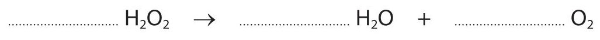
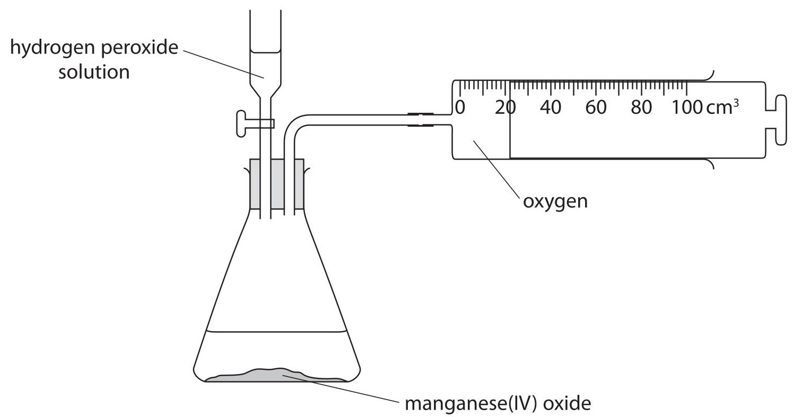
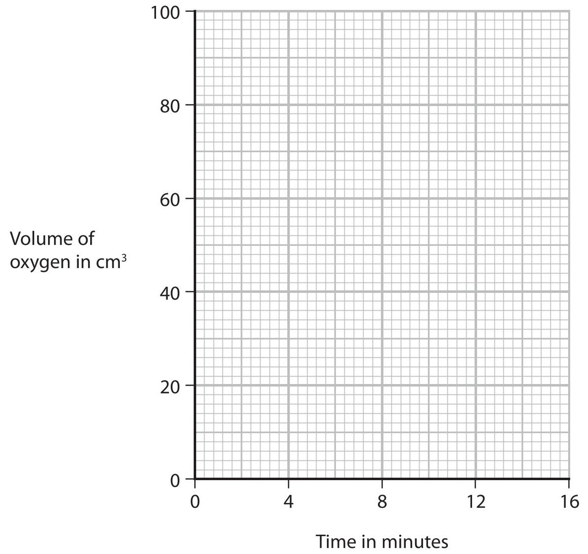
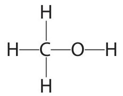
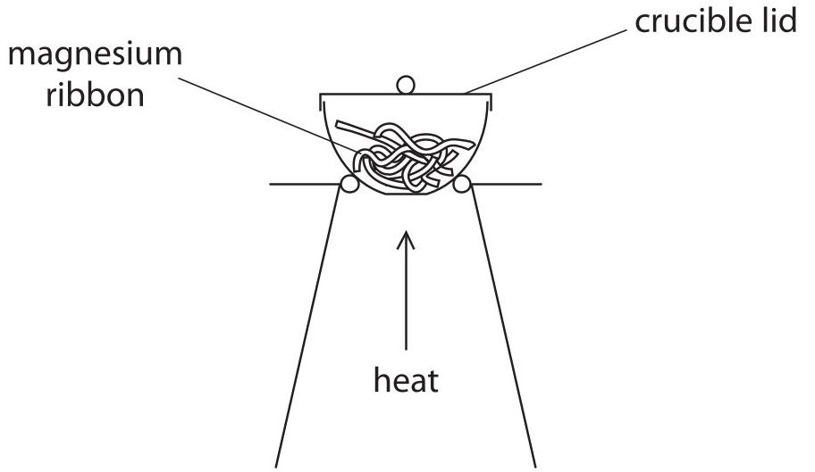
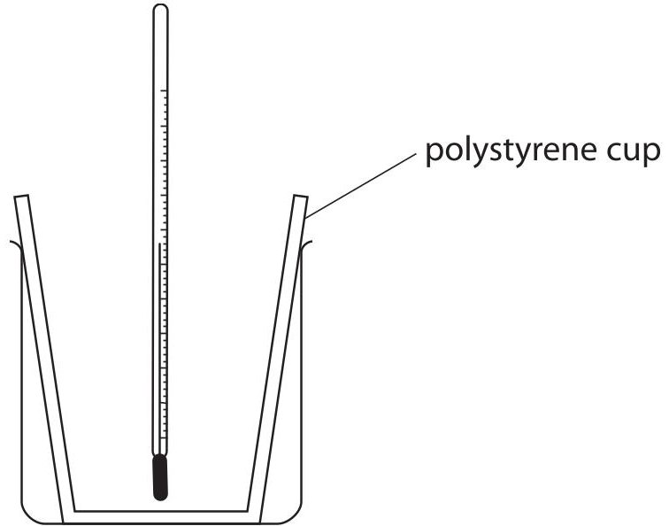
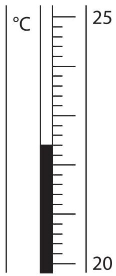

<table><tr><td colspan="3">Please check the examination details below before entering your candidate information</td></tr><tr><td>Candidate surname</td><td colspan="2">Other names</td></tr><tr><td colspan="3">Centre Number Candidate Number</td></tr><tr><td colspan="3">Pearson Edexcel International GCSE (9-1)</td></tr><tr><td colspan="3">Thursday 14 May 2020</td></tr><tr><td>Morning (Time: 2 hours)</td><td colspan="2">Paper Reference 4CH1/1CR 4SD0/1CR</td></tr><tr><td colspan="3">Chemistry
Unit: 4CH1
Science (Double Award) 4SD0
Paper: 1CR</td></tr><tr><td colspan="2">You must have:
Calculator, ruler</td><td>Total Marks</td></tr></table>

## Instructions

- Use black ink or ball-point pen.

- Fill in the boxes at the top of this page with your name, centre number and candidate number.

- Answer all questions.

- Answer the questions in the spaces provided

- there may be more space than you need.

- Show all the steps in any calculations and state the units.

- Some questions must be answered with a cross in a box . If you change your mind about an answer, put a line through the box and then mark your new answer with a cross.

## Information

- The total mark for this paper is 110.

- The marks for each question are shown in brackets

- use this as a guide as to how much time to spend on each question.

## Advice

- Read each question carefully before you start to answer it.

- Write your answers neatly and in good English.

- Try to answer every question.

- Check your answers if you have time at the end.

Turn over

<table border="1"><tr><td>7Li lithium3</td><td>9Be beryllium4</td><td colspan="12">Key</td><td>4He helium2</td></tr><tr><td>23Na sodium11</td><td>24Mg magnesium12</td><td colspan="12">relative atomic massatomic symbolatomic (proton) number</td><td>20Ne neon10</td></tr><tr><td>39K potassium19</td><td>40Ca calcium20</td><td>45Sc scandium21</td><td>48Ti titanium22</td><td>51V vanadium23</td><td>52Cr chromium24</td><td>55Mn manganese25</td><td>56Fe iron26</td><td>59Co cobalt27</td><td>59Ni nickel28</td><td>63.5Cu copper29</td><td>65Zn zinc30</td><td>70Ga gallium31</td><td>73Ge germanium32</td><td>75As arsenic33</td><td>79Se selenium34</td><td>80Br bromine35</td><td>84Kr krypton36</td></tr><tr><td>85Rb rubidium37</td><td>88Sr strontium38</td><td>89Y yttrium39</td><td>91Zr zirconium40</td><td>93Nb niobium41</td><td>96Mo molybdenum42</td><td>[98]Tc technetium43</td><td>101Ru ruthenium44</td><td>103Rh rhodium45</td><td>106Pd palladium46</td><td>108Ag silver47</td><td>112Cd cadmium48</td><td>115In indium49</td><td>119Sn tin50</td><td>122Sb antimony51</td><td>128Te tellurium52</td><td>127I iodine53</td><td>131Xe xenon54</td></tr><tr><td>133Cs caesium55</td><td>137Ba barium56</td><td>139La* lanthanum57</td><td>178Hf hafnium72</td><td>181Ta tantalum73</td><td>184W tungsten74</td><td>186Re rhenium75</td><td>190Os osmium76</td><td>192Ir iridium77</td><td>195Pt platinum78</td><td>197Au gold79</td><td>201Hg mercury80</td><td>204TI thallium81</td><td>207Pb lead82</td><td>209Bi bismuth83</td><td>[209]Po polonium84</td><td>[210]At astatine85</td><td>[222]Rn radon86</td></tr><tr><td>[223]Fr francium87</td><td>[226]Ra radium88</td><td>[227]Ac* actinium89</td><td>[261]Rf rutherfordium104</td><td>[262]Db dubnium105</td><td>[266]Sg seaborgium106</td><td>[264]Bh bohrium107</td><td>[277]Hs hassium108</td><td>[268]Mt meitnerium109</td><td>[271]Ds darmstadtium110</td><td>[272]Rg roentgenium111</td><td colspan="6">Elements with atomic numbers112-116have been reportedbut not fully authenticated</td></tr></table>
* The lanthanoids (atomic numbers 58-71) and the actinoids (atomic numbers 90-103) have been omitted
The relative atomic masses of copper and chlorine have not been rounded to the nearest whole number.
## Answer ALL questions.
1 (a) The box gives some methods used in the separation of mixtures.
chromatography crystallisation evaporation filtration fractional distillation simple distillation
Use words from the box to answer these questions.
(i) Identify the method used to obtain pure water from sea water.
(ii) Identify the method used to separate the dyes in a food colouring.
(iii) Identify the method used to obtain ethanol from a mixture of ethanol and water.
(b) Complete the sentences by writing a suitable word in each blank space.
When salt is added to water and stirred until no more will a saturated solution forms.
The salt is the ...
The water is the ...
(Total for Question 1 = 6 marks)
2 The diagram shows the positions of some elements in the Periodic Table.
<table border="1"><tr><td colspan="11">1 2 H</td><td colspan="2">3 4 5 6 7 0</td></tr><tr><td></td><td></td><td colspan="10"></td><td>He</td><td></td></tr><tr><td>Na</td><td></td><td colspan="10"></td><td>F</td><td></td></tr><tr><td>K</td><td></td><td></td><td></td><td></td><td></td><td></td><td></td><td></td><td></td><td></td><td>Cl</td><td></td></tr><tr><td></td><td></td><td></td><td></td><td></td><td></td><td></td><td></td><td></td><td></td><td></td><td>Br</td><td></td></tr></table>
(a) Use symbols from this table to answer these questions.
Each symbol may be used once, more than once or not at all.
(i) Give the symbol of a metal.
(ii) Give the symbol of a noble gas.
(iii) Give the symbol of a liquid at room temperature.
(iv) Give the symbols of the two elements in Period 3
(b) Deduce the electronic configuration of Na
(Total for Question 2 = 5 marks)
3 This question is about alkenes and alkanes.
(a) Complete the table by giving the missing information about the alkene with the molecular formula $ \mathrm{C_{3}H_{6}} $
<table border="1"><tr><td>Molecular formula</td><td>C3H6</td></tr><tr><td>Name</td><td></td></tr><tr><td>Empirical formula</td><td></td></tr><tr><td>General formula</td><td></td></tr><tr><td>Displayed formula</td><td></td></tr></table>
(b) Alkenes are unsaturated compounds.
(i) State what is meant by the term unsaturated.
(ii) Describe a test to show that a compound is unsaturated.
(c) When the alkane methane reacts with chlorine, the products are chloromethane $ \mathrm{(C H_{3} C l)} $ and hydrogen chloride gas.
(i) Give a chemical equation for this reaction.
(ii) What is the name of this type of reaction?
A addition
B decomposition
neutralisation
substitution
(iii) State the condition needed for this reaction to occur.
(d) When ethane reacts with chlorine, one of the products of the reaction has the formula $ \mathrm{C_{2} H_{4} Cl_{2}} $
There are two isomers with this formula.
(i) State what is meant by the term isomers.

(ii) Draw the displayed formulae of the two isomers with the formula $ \mathrm{C_{2} H_{4} Cl_{2}} $

(2) 

<table border="1"><tr><td>isomer1</td><td>isomer2</td></tr><tr><td colspan="2">(Total for Question3=14 marks)</td></tr></table>
## BLANK PAGE
4 A solution of hydrogen peroxide decomposes when a catalyst of manganese(IV) oxide is added.
The products of the reaction are water and oxygen.
(a) Complete the chemical equation for this reaction.

(b) Give a test for oxygen.
(c) State the reason for adding a catalyst.
(d) A student investigates how changing the concentration of the hydrogen peroxide solution affects the rate of this reaction.
She uses this apparatus.

The student records the volume of oxygen that collects every 2 minutes for 16 minutes. The table shows her results.
<table border="1"><tr><td>Time in minutes</td><td>0</td><td>2</td><td>4</td><td>6</td><td>8</td><td>10</td><td>12</td><td>14</td><td>16</td></tr><tr><td>Volume of oxygen in cm3</td><td>0</td><td>22</td><td>38</td><td>50</td><td>55</td><td>69</td><td>76</td><td>80</td><td>80</td></tr></table>
(i) Plot the student's results on the grid.
(ii) Draw a circle on the grid around the anomalous result.
(iii) Draw a curve of best fit through the points, ignoring the anomalous result.

(iv) Suggest a mistake that the student might have made to cause the anomalous result.
(v) Determine the volume of oxygen collected during the first 3 minutes. Show on your graph how you obtain your answer.
volume of oxygen =
(e) The student repeats the experiment using hydrogen peroxide solution of half the concentration of the original solution.
She keeps the volume of the hydrogen peroxide solution and all other conditions the same.
(i) Draw on the grid the curve you would expect the student to obtain.
(ii) Explain how using hydrogen peroxide solution of half the concentration affects the rate of the reaction.
Refer to particle collision theory in your answer.
(Total for Question 4 = 14 marks)
5 (a) The diagram shows the displayed formula of the organic compound methanol, $ \mathrm{C H_{3} O H} $

(i) Determine the number of atoms in one molecule of methanol.
(ii) State why methanol is not a hydrocarbon.
(b) The atoms in methanol are held together by covalent bonds.
(i) State what is meant by the term covalent bond.
(ii) Draw a dot-and-cross diagram to show the bonding in a molecule of methanol. Show only the outer electrons of each atom.
(c) Another organic compound has the percentage composition by mass
$$
C = 38.7 \% \quad H = 9.7 \% \quad O = 51.6 \%
$$
(i) Calculate the empirical formula of this compound.
## empirical formula =
(ii) The relative molecular mass $ ( M_{r} ) $ of the compound is 62
Determine the molecular formula of the compound.
6 This question is about elements in Group 7 of the Periodic Table and their compounds.
(a) (i) Give the name of this group of elements.
(ii) State the colour of chlorine gas.
(iii) Give a test for chlorine gas.
(b) Give a test to show that a solution contains iodide ions.
(c) A student compares the reactivity of the elements bromine, chlorine and iodine. He mixes these pairs of solutions and observes the reactions that occur.
- chlorine solution and potassium bromide solution
- Explain how the reactions can be used to show the order of reactivity of the three elements.
- bromine solution and potassium iodide solution
Include the colour change that the student would observe in each reaction.
7 A student uses the reaction between zinc and dilute sulfuric acid to prepare some zinc sulfate crystals.
(a) (i) Complete the equation for this reaction by giving the correct state symbols.
$$
\mathrm {Z n} (\dots \dots \dots \dots) + \mathrm {H} _ {2} \mathrm {S O} _ {4} (\dots \dots \dots \dots) \rightarrow \mathrm {Z n S O} _ {4} (\dots \dots \dots \dots) + \mathrm {H} _ {2} (\dots \dots \dots \dots)
$$
(ii) State what would be observed during this reaction.
(b) The student adds excess zinc to a beaker of dilute sulfuric acid.
(i) Explain why it is necessary to add excess zinc.
(ii) Draw a diagram of the apparatus the student should use to remove the unreacted zinc and collect the zinc sulfate solution.
(c) The student obtains a pure, dry sample of zinc sulfate crystals.
The formula of zinc sulfate crystals is $ \mathrm{Z n S O_{4}. 7 H_{2} O} $
(i) Calculate the relative molecular mass $ ( M_{r} ) $ of zinc sulfate crystals.
$$
M _ {\mathrm {r}} =
$$
(ii) The student uses 0.0200 mol of dilute sulfuric acid in her preparation.
Show that the maximum mass of zinc sulfate crystals that the student could obtain is about 6 g.
(iii) The student obtains a mass of 4.28 g of zinc sulfate crystals.
Calculate the percentage yield of the zinc sulfate crystals.
Give your answer to three significant figures.
(Total for Question 7 = 13 marks)
8 (a) A piece of magnesium ribbon is ignited and placed in a gas jar of oxygen. The equation for the reaction is
$$
2 \mathrm {M g} + \mathrm {O} _ {2} \rightarrow 2 \mathrm {M g O}
$$
(i) Give two observations that would be made in this reaction.
(ii) State why this is an oxidation reaction.
(b) A second piece of magnesium ribbon is ignited and placed in a gas jar of carbon dioxide.
A very exothermic reaction occurs, forming magnesium oxide and carbon.
(i) State what is meant by the term exothermic.
(ii) Give the chemical equation for this reaction.
(iii) A fire starts in a warehouse where magnesium is stored.
Suggest why it would not be suitable to use a carbon dioxide fire extinguisher to put out this fire.
(c) A student uses this apparatus to find the mass of magnesium oxide that forms when a known mass of magnesium is heated.

This is his method.
- find the mass of the crucible and lid
- place some magnesium ribbon in the crucible
- heat the crucible with the lid on for a few minutes
- find the mass of the crucible, lid and magnesium
- find the mass of the crucible, lid and magnesium oxide
Using this method, the mass of magnesium oxide formed is less than expected.
Explain two changes that the student should make to his method to obtain a mass of magnesium oxide closer to the expected mass.
9 This question is about some compounds of the elements in Group 4 of the Periodic Table.
(a) When carbon dioxide dissolves in water, a weak acid forms.
(i) Which of these could be the pH of this weak acid?
A 1
B 5
C 7
D 9
(ii) Which of these is a correct statement about acids?
A acids contain OH $ ^{-} $ ions
B acids are electron donors
C acids are proton acceptors
D acids are proton donors
(b) When lead(II) carbonate is heated, lead(II) oxide and carbon dioxide form.
(i) Give the name of this type of reaction.
(ii) Complete the equation for this reaction.
(c) Silicon dioxide, $ \mathrm{S i O_{2}} $ , and silicon(IV) chloride, $ \mathrm{S i C l_{4}} $ , are both covalently bonded compounds.
The table shows the melting and boiling points of these two compounds, and the physical state of silicon dioxide at room temperature.
<table border="1"><tr><td>Compound</td><td>Melting point in℃</td><td>Boiling point in℃</td><td>Physical state at room temperature</td></tr><tr><td>SiO2</td><td>1710</td><td>2230</td><td>solid</td></tr><tr><td>SiCl4</td><td>-69</td><td>58</td><td></td></tr></table>
(i) Complete the table by giving the physical state of silicon(IV) chloride at room temperature.
(ii) Explain, in terms of structure and bonding, why silicon dioxide has a much higher melting point than silicon(IV) chloride.
## BLANK PAGE
10 A student uses this apparatus to investigate the reaction between potassium hydroxide solution and dilute hydrochloric acid.

This is her method.
- pour $ 2 5 \mathrm{c m}^{3} $ of potassium hydroxide solution into a polystyrene cup and record the temperature of the solution
- pour $ 2 5 \mathrm{c m}^{3} $ of dilute hydrochloric acid into a measuring cylinder and record the temperature of the acid
- add the acid to the polystyrene cup and stir the mixture
- record the highest temperature reached
(a) (i) Give a word equation for the reaction between potassium hydroxide and hydrochloric acid.
(ii) Explain why the student needs to stir the mixture.
(b) The table gives the temperatures of the solutions before the student mixes them.
<table border="1"><tr><td>potassium hydroxide solution</td><td>17.8℃</td></tr><tr><td>dilute hydrochloric acid</td><td>18.4℃</td></tr></table>
Calculate the mean (average) temperature of the two solutions.
(c) The student repeats the experiment on a different day, using $ 2 5 \mathrm{c m}^{3} $ of potassium hydroxide solution and $ 2 5 \mathrm{c m}^{3} $ of dilute hydrochloric acid.
The thermometer shows the highest temperature reached at the end of the experiment.

(i) Complete the table by giving the missing information.
Give both temperatures to the nearest 0.1 $ ^{\circ} \mathrm{C}. $

(2) 

<table border="1"><tr><td>mean temperature at start in $ ^{\circ} \mathrm{C} $</td><td></td></tr><tr><td>temperature at end in $ ^{\circ} \mathrm{C} $</td><td></td></tr><tr><td>temperature rise in $ ^{\circ} \mathrm{C} $</td><td>5.2</td></tr></table>
(ii) Show that the heat energy change, Q, in the student's experiment is about 1100 J.
[for the mixture, c = 4.2 J/g/ $ ^{\circ} \mathrm{C} $]
[mass of 1.0 $ cm^{3} $ of mixture = 1.0 g]
(iii) The student uses 0.020 mol of potassium hydroxide in his experiment.
Calculate the enthalpy change $ (\Delta H) $ in kJ/mol, for 1.0 mol of potassium hydroxide.
Include a sign in your answer.
$$
\Delta H =
$$
(Total for Question 10 = 13 marks)
TOTAL FOR PAPER=110 MARKS
## BLANK PAGE
## BLANK PAGE
## BLANK PAGE
