<table><tr><td colspan="3">Please check the examination details below before entering your candidate information</td></tr><tr><td>Candidate surname</td><td colspan="2">Other names</td></tr><tr><td colspan="3">Centre Number Candidate Number</td></tr><tr><td colspan="3">Pearson Edexcel International GCSE (9-1)</td></tr><tr><td colspan="3">Thursday 14 May 2020</td></tr><tr><td>Morning (Time: 2 hours)</td><td colspan="2">Paper Reference 4CH1/1C 4SD0/1C</td></tr><tr><td colspan="3">Chemistry
Unit: 4CH1
Science (Double Award) 4SD0
Paper: 1C</td></tr><tr><td colspan="2">You must have:
Calculator, ruler</td><td>Total Marks</td></tr></table>

## Instructions

- Use black ink or ball-point pen.

- Fill in the boxes at the top of this page with your name, centre number and candidate number.

- Answer all questions.

- Answer the questions in the spaces provided

- there may be more space than you need.

- Show all the steps in any calculations and state the units.

- Some questions must be answered with a cross in a box . If you change your mind about an answer, put a line through the box and then mark your new answer with a cross.

## Information

- The total mark for this paper is 110.

- The marks for each question are shown in brackets

- use this as a guide as to how much time to spend on each question.

## Advice

- Read each question carefully before you start to answer it.

- Write your answers neatly and in good English.

- Try to answer every question.

- Check your answers if you have time at the end.

Turn over

<table border="1"><tr><td>7Li lithium3</td><td>9Be beryllium4</td><td colspan="12">Key</td><td>4He helium2</td></tr><tr><td>23Na sodium11</td><td>24Mg magnesium12</td><td colspan="12">relative atomic mass atomic symbol atomic (proton) number</td><td>20Ne neon10</td></tr><tr><td>39K potassium19</td><td>40Ca calcium20</td><td>45Sc scandium21</td><td>48Ti titanium22</td><td>51V vanadium23</td><td>52Cr chromium24</td><td>55Mn manganese25</td><td>56Fe iron26</td><td>59Co cobalt27</td><td>59Ni nickel28</td><td>63.5Cu copper29</td><td>65Zn zinc30</td><td>70Ga gallium31</td><td>73Ge germanium32</td><td>75As arsenic33</td><td>79Se selenium34</td><td>80Br bromine35</td><td>84Kr krypton36</td></tr><tr><td>85Rb rubidium37</td><td>88Sr strontium38</td><td>89Y yttrium39</td><td>91Zr zirconium40</td><td>93Nb niobium41</td><td>96Mo molybdenum42</td><td>[98]Tc technetium43</td><td>101Ru ruthenium44</td><td>103Rh rhodium45</td><td>106Pd palladium46</td><td>108Ag silver47</td><td>112Cd cadmium48</td><td>115In indium49</td><td>119Sn tin50</td><td>122Sb antimony51</td><td>128Te tellurium52</td><td>127I iodine53</td><td>131Xe xenon54</td></tr><tr><td>133Cs caesium55</td><td>137Ba barium56</td><td>139La* lanthanum57</td><td>178Hf hafnium72</td><td>181Ta tantalum73</td><td>184W tungsten74</td><td>186Re rhenium75</td><td>190Os osmium76</td><td>192Ir iridium77</td><td>195Pt platinum78</td><td>197Au gold79</td><td>201Hg mercury80</td><td>204TI thallium81</td><td>207Pb lead82</td><td>209Bi bismuth83</td><td>[209]Po polonium84</td><td>[210]At astatine85</td><td>[222]Rn radon86</td></tr><tr><td>[223]Fr francium87</td><td>[226]Ra radium88</td><td>[227]Ac* actinium89</td><td>[261]Rf rutherfordium104</td><td>[262]Db dubium105</td><td>[266]Sg seaborgium106</td><td>[264]Bh bohrium107</td><td>[277]Hs hassium108</td><td>[268]Mt meitnerium109</td><td>[271]Ds darmstadtium110</td><td>[272]Rg roentgenium111</td><td colspan="6">Elements with atomic numbers 112-116 have been reported but not fully authenticated</td></tr></table>
The relative atomic masses of copper and chlorine have not been rounded to the nearest whole number.
## BLANK PAGE
## Answer ALL questions.
1 This question is about chemical elements.
Use the Periodic Table to help you answer this question.
(a) (i) Identify the element with atomic number 5
(ii) Give the symbol of a metallic element in Period 3
(iii) Identify the element whose atoms contain 14 protons.
(iv) Identify the element whose atoms have the electronic configuration 2.5
(v) Give the name of the compound formed between oxygen and the element with atomic number 13
(b) The position of an element in the Periodic Table can be used to predict its properties.
(i) Which group contains elements that are all unreactive?
A Group 2
B Group 5
C Group 6
(ii) Which of these is the least reactive element in Group 1?
A caesium
D Group0
B lithium
C potassium
D sodium
(Total for Question 1 = 7 marks)
2 (a) The boxes list changes that may happen in a laboratory and the names of some changes. Draw one straight line from each change to its correct name.
## Change

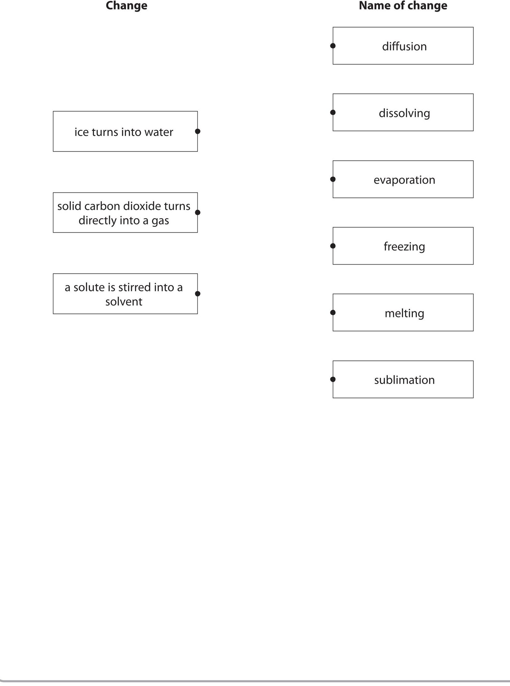

(b) A student has two solids, X and Y.
One of these solids is a pure substance and the other is a mixture.
Describe how the student could identify which solid is pure and which is a mixture by measuring a physical property of each solid.
(Total for Question 2 = 6 marks)
3 This question is about metals.
(a) Metals can be arranged in a reactivity series based on their reactions with water and their reactions with dilute hydrochloric acid.
The table shows how four metals, P, Q, R and S, react with water and with dilute hydrochloric acid.
<table border="1"><tr><td>Metal</td><td>Reaction with water</td><td>Reaction with dilute hydrochloric acid</td></tr><tr><td>P</td><td>no reaction</td><td>hydrogen gas forms very slowly</td></tr><tr><td>Q</td><td>no reaction</td><td>no reaction</td></tr><tr><td>R</td><td>hydrogen gas forms very quickly</td><td>not done</td></tr><tr><td>S</td><td>hydrogen gas forms quickly</td><td>hydrogen gas forms very quickly</td></tr></table>
(i) Identify which of the metals P, Q, R or S could be gold.
(ii) Suggest why the reaction between metal R and dilute hydrochloric acid was not done.
(iii) Use the information in the table to place the metals in order of reactivity from most reactive to least reactive.

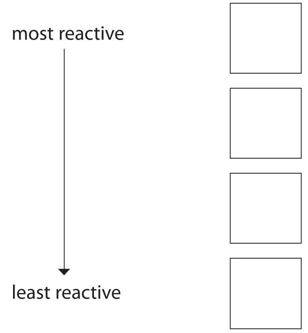

(b) Zinc is used to coat iron gates to prevent the iron from rusting.
(i) State the name of this method of preventing iron from rusting.
(ii) State another method of preventing iron from rusting.
(c) A mixture of zinc powder and copper(II) oxide is heated. The chemical equation for the reaction that takes place is
(i) State how the reaction shows that zinc is more reactive than copper.
$$
\mathrm {Z n} + \mathrm {C u O} \rightarrow \mathrm {Z n O} + \mathrm {C u}
$$
(ii) Explain which substance is the oxidising agent.
(Total for Question 3 = 8 marks)
4 Sodium hydroxide dissolves in water, forming a strongly alkaline solution. Ammonia dissolves in water, forming a slightly less alkaline solution. (a) (i) Identify the ion that makes the sodium hydroxide solution alkaline.
(ii) What is a possible pH of ammonia solution? (1)
A 3
B 6
C 11
D 14
(b) When ammonia solution reacts with sulfuric acid, a neutralisation reaction occurs and ammonium sulfate forms.
(i) How does the sulfuric acid act in this reaction?
A as a neutron donor
B as a neutron acceptor
C as a proton donor
D as a proton acceptor
(ii) The diagram shows a beaker containing some ammonia solution and a few drops of phenolphthalein indicator.

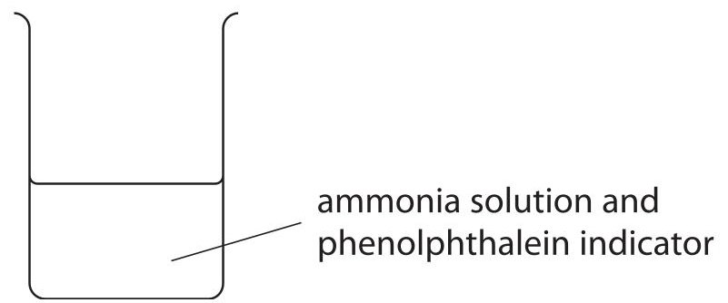

Dilute sulfuric acid is added to the beaker until it is in excess.
What are the colours of the phenolphthalein indicator before and after adding excess sulfuric acid?
<table border="1"><tr><td></td><td>Before</td><td>After</td></tr><tr><td>A</td><td>orange</td><td>red</td></tr><tr><td>B</td><td>yellow</td><td>red</td></tr><tr><td>C</td><td>pink</td><td>colourless</td></tr><tr><td>D</td><td>colourless</td><td>pink</td></tr></table>
(c) Ammonium sulfate is used by gardeners as a fertiliser because it contains nitrogen.
(i) Explain why the chemical formula of ammonium sulfate is $ \mathrm{(N H_{4})_{2} S O_{4}} $ Refer to the charges on the ions in your answer.
(ii) Calculate the relative formula mass of ammonium sulfate, $ \mathrm{(N H_{4})_{2} S O_{4}} $
(iii) Calculate the mass, in grams, of nitrogen in 1.0kg of ammonium sulfate.
## BLANK PAGE
5 (a) Chlorine, bromine and iodine are elements in the Periodic Table.
Explain how the position of these elements in the Periodic Table depends on their electronic configurations.
(b) Chlorine reacts with methane to form $ \mathrm{C H_{3} C I} $ and HCl
(i) State the condition necessary for this reaction.
(ii) Give the equation for this reaction.
(iii) The bonds in a molecule of $ \mathrm{C H_{3} C l} $ are covalent.
Explain, in terms of electrostatic attractions, what is meant by a covalent bond.
(iv) Draw a dot-and-cross diagram for a molecule of $ \mathrm{C H_{3} C l} $ Show only the outer electrons of the atoms.

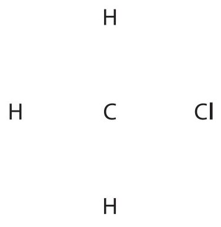

(v) $ \mathrm{C H_{3} C l} $ has a simple molecular structure.
Explain why $ \mathrm{C H_{3} C l} $ has a low boiling point.
(c) Graphite is another substance that contains covalent bonds.
The diagram shows the structure of graphite.

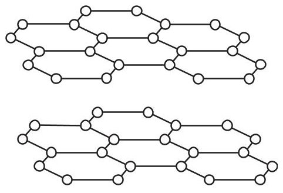

Most covalent substances do not conduct electricity.
Explain why graphite is able to conduct electricity.
(Total for Question 5 = 12 marks)
## BLANK PAGE
6 The table shows the molecular formulae of six organic compounds, A, B, C, D, E and F.
<table border="1"><tr><td>A</td><td>B</td><td>C</td><td>D</td><td>E</td><td>F</td></tr><tr><td>C2H4</td><td>C2H6</td><td>C3H6</td><td>C3H8</td><td>C4H8</td><td>C4H10</td></tr></table>
(a) (i) Explain which homologous series compound B belongs to.
(ii) Give the letter of the compound that has the same empirical formula as its molecular formula.
ii) Compound F exists as two isomers.
Explain what is meant by the term isomers.
Include the structures of the two isomers of compound F in your answer.
(b) Describe how compound D can be obtained from crude oil using the industrial process of fractional distillation.
(c) Compound C can be used to make a polymer.
(i) State the type of polymer formed from compound C.
(ii) Name the polymer formed from compound C.
(iii) Draw the structure of this polymer. Include the displayed formula of the repeat unit.
7 Dilute hydrochloric acid reacts with a solution of sodium thiosulfate $ \mathrm{(N a_{2} S_{2} O_{3})} $ to form a precipitate.
The equation for the reaction is
$$
\mathrm {N a} _ {2} \mathrm {S} _ {2} \mathrm {O} _ {3} (\mathrm {a q}) + 2 \mathrm {H C l} (\mathrm {a q}) \rightarrow 2 \mathrm {N a C l} (\mathrm {a q}) + \mathrm {S} (\mathrm {s}) + \mathrm {H} _ {2} \mathrm {O} (\mathrm {I}) + \mathrm {S O} _ {2} (\mathrm {g})
$$
(a) State the name of the precipitate that forms.
(b) The reaction is often used to investigate rates of reaction.
The diagram shows the apparatus a student uses to investigate the effect of temperature on the rate of the reaction.

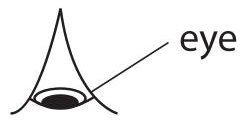

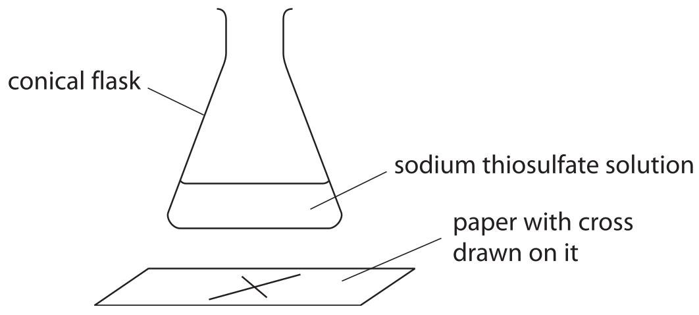

This is the student's method.
- pour $ 5 0 \mathrm{c m}^{3} $ of cold sodium thiosulfate solution into a conical flask and heat it to $ 2 0^{\circ} \mathrm{C} $
- draw a cross (X) on a piece of paper and place it under the flask
- add $ 5 \mathrm{c m}^{3} $ of dilute hydrochloric acid to the flask
- look at the cross from above and record the time taken until the cross cannot be seen
The student repeats the experiment four times, using sodium thiosulfate solution at a different temperature each time.
He keeps the volumes of sodium thiosulfate solution and hydrochloric acid constant in each experiment.
Give two other factors that the student should keep constant.
(c) The table shows the student's results.
<table border="1"><tr><td>Temperature in℃</td><td>Time until cross cannot be seen ins</td></tr><tr><td>20</td><td>400</td></tr><tr><td>30</td><td>188</td></tr><tr><td>40</td><td>84</td></tr><tr><td>50</td><td>44</td></tr><tr><td>60</td><td>24</td></tr></table>
The highest temperature the student uses is $ 6 0^{\circ} \mathrm{C} $ because he thinks the results might not be as accurate at temperatures higher than $ 6 0^{\circ} \mathrm{C}. $
Suggest a reason why the results might not be as accurate at temperatures higher than $ 6 0^{\circ} \mathrm{C} $.
(d) The student wants to compare the rates of the reaction at the different temperatures.
He uses this formula to obtain a value for each rate of reaction
$$
\mathrm {r a t e} = \frac {1}{\mathrm {t i m e i n s}}
$$
The table shows the value of the rate of reaction at each temperature.
<table border="1"><tr><td>Temperature in℃</td><td>Time until cross cannot be seen ins</td><td>Rate of reaction ins-1</td></tr><tr><td>20</td><td>400</td><td>0.0025</td></tr><tr><td>30</td><td>188</td><td>0.0053</td></tr><tr><td>40</td><td>84</td><td>0.012</td></tr><tr><td>50</td><td>44</td><td>0.023</td></tr><tr><td>60</td><td>24</td><td>0.042</td></tr></table>
Plot the values of temperature and rate of reaction on the grid.
Draw a curve of best fit through the points.

(2) 

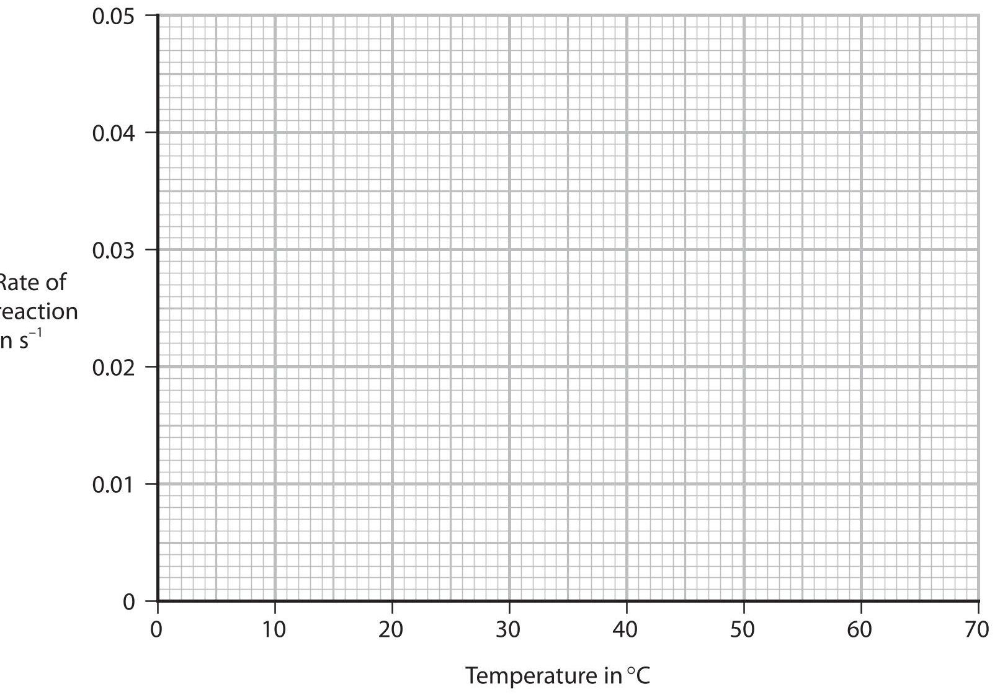

(e) (i) Use the graph to determine a value for the rate of the reaction at $ 4 5^{\circ} \mathrm{C} $ Show on the graph how you obtained your answer.
$$
\mathrm {r a t e o f r e a c t i o n} =
$$
(ii) Calculate the time that it would take for the cross not to be seen at $ 4 5^{\circ} \mathrm{C} $
(iii) Describe the relationship between rate of reaction and temperature shown by the graph.
(f) Explain, in terms of particle collision theory, the effect that increasing the temperature has on the rate of a reaction.
## BLANK PAGE
8 A student uses this apparatus to investigate the heat energy change when a salt dissolves in water to form a solution.

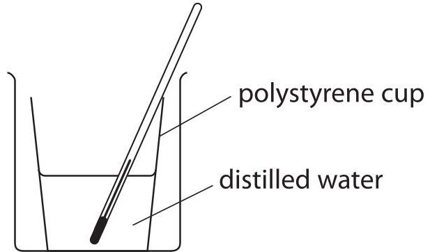

This is the student's method.
- add $ 5 0 \mathrm{c m}^{3} $ of distilled water to a polystyrene cup
- record the initial temperature of the water
- add a known mass of solid anhydrous copper(II) sulfate to the polystyrene cup and stir the solution with the thermometer until all the solid has dissolved
- record the maximum temperature of the copper(II) sulfate solution
(a) (i) Name the piece of apparatus the student should use to add the distilled water to the polystyrene cup.
(ii) The student stirs the solution to help the solid dissolve more quickly. Suggest another reason why the student stirs the solution.
(iii) State the colour of the copper(II) sulfate solution.
(b) The diagram shows the temperatures in one experiment.

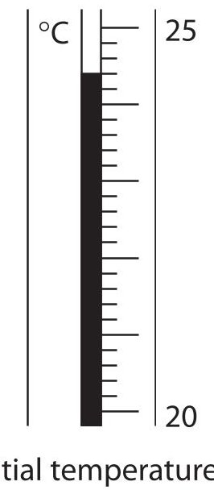

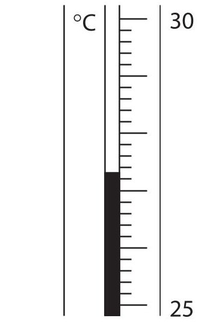

maximum temperature

Complete the table, giving all values to the nearest 0.1 $ ^{\circ} \mathrm{C}. $
<table border="1"><tr><td>maximum temperature in $ ^{\circ} \mathrm{C} $</td><td></td></tr><tr><td>initial temperature in $ ^{\circ} \mathrm{C} $</td><td></td></tr><tr><td>increase in temperature in $ ^{\circ} \mathrm{C} $</td><td></td></tr></table>
(c) In a second experiment, when a student dissolves the anhydrous copper(II) sulfate in $ 5 0 \mathrm{c m}^{3} $ of distilled water, the increase in temperature is $ 3. 3^{\circ} \mathrm{C}. $
(i) Show that the heat energy change (Q) in this second experiment is approximately 700 J. [for water, $ c=4. 2 \mathrm{J} / \mathrm{g} /^{\circ} \mathrm{C} $ ] [mass of $ 1. 0 \mathrm{c m}^{3} $ of water=1.0g]
(ii) In this experiment the student uses 1.70g of the anhydrous copper(II) sulfate Calculate the molar enthalpy change $ (\Delta H) $ in kJ/mol. Include a sign in your answer. $ [M_{r} $ of $ \mathrm{CuSO_{4}}=159.5] $
$ \Delta H= $ kJ/mol
(d) Another student does a similar experiment but uses hydrated copper(II) sulfate instead of anhydrous copper(II) sulfate.
The table shows his results.
<table border="1"><tr><td>initial temperature in $ ^{\circ}C $</td><td>23.8</td></tr><tr><td>final temperature in $ ^{\circ}C $ when all solid dissolves</td><td>22.7</td></tr></table>
Explain what the results show about the type of energy change that occurs when hydrated copper(II) sulfate dissolves.
9 Sodium hydrogencarbonate $ \mathrm{(N a H C O_{3})} $ is also known as baking soda. Baking soda can be used to make cakes increase in size in an oven.
This is the equation for the reaction that takes place when baking soda is heated.
$$
2 \mathrm {N a H C O} _ {3} (\mathrm {s}) \rightarrow \mathrm {N a} _ {2} \mathrm {C O} _ {3} (\mathrm {s}) + \mathrm {C O} _ {2} (\mathrm {g}) + \mathrm {H} _ {2} \mathrm {O} (\mathrm {g})
$$
(a) (i) What type of reaction is this?
A combustion
B decomposition
oxidation
D reduction
(ii) Suggest why the reaction makes the cakes increase in size.
(b) A student uses this apparatus to investigate the reaction that takes place when sodium hydrogencarbonate is heated.

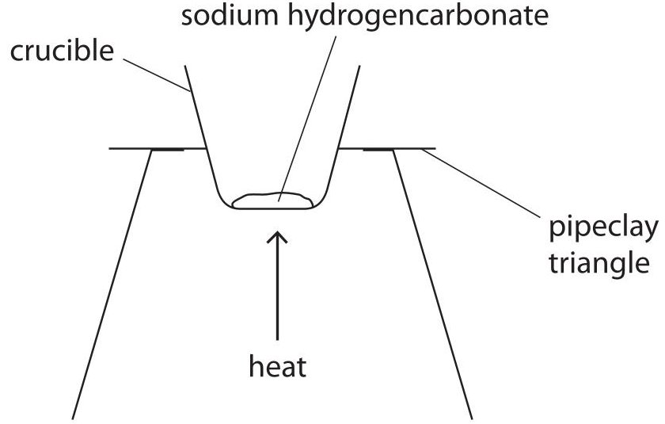

This is the student's method.
- weigh a crucible and record the mass
- add some sodium hydrogencarbonate to the crucible, reweigh it and record the mass
- heat the crucible and contents for five minutes, then allow to cool before weighing and recording the mass
- heat the crucible and contents again for a further three minutes, then allow to cool before weighing and recording the mass
(i) Give a reason why the crucible and contents are heated for a further three minutes.
(ii) The student considered using a lid on the crucible in the experiment. Suggest an advantage and a disadvantage of using a lid on the crucible.
advantage
disadvantage
(c) The table shows some of the student's results.
<table border="1"><tr><td>mass of crucible and sodium hydrogencarbonate in g</td><td>29.75</td></tr><tr><td>mass of empty crucible in g</td><td>26.50</td></tr></table>
(i) Calculate the mass of sodium hydrogencarbonate that the student uses.
(ii) Using this equation, calculate the maximum mass of sodium carbonate $ \mathrm{(N a_{2} C O_{3})} $ that could form in the student's reaction.
$$
2 \mathrm {N a H C O} _ {3} (\mathrm {s}) \rightarrow \mathrm {N a} _ {2} \mathrm {C O} _ {3} (\mathrm {s}) + \mathrm {C O} _ {2} (\mathrm {g}) + \mathrm {H} _ {2} \mathrm {O} (\mathrm {g})
$$
[ $ M_{\mathrm{r}} $ of $ \mathrm{N a H C O_{3}}=8 4 $ $ M_{\mathrm{r}} $ of $ \mathrm{N a_{2} C O_{3}}=1 0 6 $
(d) In a second experiment, the student uses a larger mass of sodium hydrogencarbonate. She calculates that she should obtain 4.8 g of sodium carbonate.
She actually obtains 4.2 g of sodium carbonate.
(i) Calculate the percentage yield from the student's experiment.
percentage yield=
(ii) Other than spillages, suggest a possible reason why the student's actual yield is less than expected.
(Total for Question 9 = 12 marks)
10 The table gives information about some lead compounds.
<table border="1"><tr><td>Compound</td><td>Formula</td><td>Appearance</td><td>Solubility in water</td></tr><tr><td>lead(II) oxide</td><td>PbO</td><td>yellow solid</td><td>insoluble</td></tr><tr><td>lead(IV) oxide</td><td>PbO2</td><td>brown solid</td><td>insoluble</td></tr><tr><td>red lead oxide</td><td>Pb3O4</td><td>red solid</td><td>insoluble</td></tr><tr><td>lead(II) nitrate</td><td>Pb(NO3)2</td><td>white solid</td><td>soluble</td></tr></table>
(a) When a sample of red lead oxide is heated, it changes into a yellow solid and a gas forms that relights a glowing splint.
Complete the word equation for this reaction.
red lead oxide $ \rightarrow $
(b) A sample of one of the oxides of lead contains 86.6% lead and 13.4% oxygen by mass. Show by calculation that the sample is lead(IV) oxide, $ \mathrm{P b O_{2}} $ $ [ A_{r} $ of $ \mathrm{P b}=2 0 7 $ $ A_{r} $ of $ \mathrm{O}=1 6] $
(c) Red lead oxide reacts with warm dilute nitric acid.
(i) Complete the chemical equation for the reaction.
$$
\mathrm {P b} _ {3} \mathrm {O} _ {4} (\dots \dots 
$$
(ii) A student is given a sample of solid red lead oxide and some dilute nitric acid.
Describe how the student could obtain a pure dry sample of lead(II) nitrate crystals.
(Total for Question 10 = 13 marks)
TOTAL FOR PAPER = 110 MARKS
## BLANK PAGE
## BLANK PAGE
## BLANK PAGE
