<table><tr><td colspan="3">Please check the examination details below before entering your candidate information</td></tr><tr><td>Candidate surname</td><td colspan="2">Other names</td></tr><tr><td colspan="3">Centre Number Candidate Number</td></tr><tr><td colspan="3">Pearson Edexcel International GCSE (9-1)</td></tr><tr><td colspan="3">Monday 11 January 2021</td></tr><tr><td>Morning (Time: 2 hours)</td><td colspan="2">Paper Reference 4CH1/1CR 4SD0/1CR</td></tr><tr><td colspan="3">Chemistry
Unit: 4CH1
Science (Double Award) 4SD0
Paper: 1CR</td></tr><tr><td colspan="2">You must have:
Calculator, ruler</td><td>Total Marks</td></tr></table>

## Instructions

- Use black ink or ball-point pen.

- Fill in the boxes at the top of this page with your name, centre number and candidate number.

- Answer all questions.

- Answer the questions in the spaces provided

- there may be more space than you need.

- Show all the steps in any calculations and state the units.

- Some questions must be answered with a cross in a box . If you change your mind about an answer, put a line through the box and then mark your new answer with a cross.

## Information

- The total mark for this paper is 110.

- The marks for each question are shown in brackets

- use this as a guide as to how much time to spend on each question.

## Advice

- Read each question carefully before you start to answer it.

- Write your answers neatly and in good English.

- Try to answer every question.

- Check your answers if you have time at the end.

Turn over

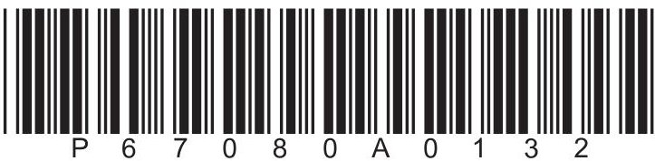

<table border="1"><tr><td>7Li lithium3</td><td>9Be beryllium4</td><td colspan="12">Key</td><td>4He helium2</td></tr><tr><td>23Na sodium11</td><td>24Mg magnesium12</td><td colspan="12">relative atomic mass atomic symbol atomic (proton) number</td><td>20Ne neon10</td></tr><tr><td>39K potassium19</td><td>40Ca calcium20</td><td>45Sc scandium21</td><td>48Ti titanium22</td><td>51V vanadium23</td><td>52Cr chromium24</td><td>55Mn manganese25</td><td>56Fe iron26</td><td>59Co cobalt27</td><td>59Ni nickel28</td><td>63.5Cu copper29</td><td>65Zn zinc30</td><td>70Ga gallium31</td><td>73Ge germanium32</td><td>75As arsenic33</td><td>79Se selenium34</td><td>80Br bromine35</td><td>84Kr krypton36</td></tr><tr><td>85Rb rubidium37</td><td>88Sr strontium38</td><td>89Y yttrium39</td><td>91Zr zirconium40</td><td>93Nb niobium41</td><td>96Mo molybdenum42</td><td>[98]Tc technetium43</td><td>101Ru ruthenium44</td><td>103Rh rhodium45</td><td>106Pd palladium46</td><td>108Ag silver47</td><td>112Cd cadmium48</td><td>115In indium49</td><td>119Sn tin50</td><td>122Sb antimony51</td><td>128Te tellurium52</td><td>127I iodine53</td><td>131Xe xenon54</td></tr><tr><td>133Cs caesium55</td><td>137Ba barium56</td><td>139La* lanthanum57</td><td>178Hf hafnium72</td><td>181Ta tantalum73</td><td>184W tungsten74</td><td>186Re rhenium75</td><td>190Os osmium76</td><td>192Ir iridium77</td><td>195Pt platinum78</td><td>197Au gold79</td><td>201Hg mercury80</td><td>204TI thallium81</td><td>207Pb lead82</td><td>209Bi bismuth83</td><td>[209]Po polonium84</td><td>[210]At astatine85</td><td>[222]Rn radon86</td></tr><tr><td>[223]Fr francium87</td><td>[226]Ra radium88</td><td>[227]Ac* actinium89</td><td>[261]Rf rutherfordium104</td><td>[262]Db dubnium105</td><td>[266]Sg seaborgium106</td><td>[264]Bh bohrium107</td><td>[277]Hs hassium108</td><td>[268]Mt meitnerium109</td><td>[271]Ds darmstadtium110</td><td>[272]Rg roentgenium111</td><td colspan="6">Elements with atomic numbers112-116 have been reported but not fully authenticated</td></tr></table>

* The lanthanoids (atomic numbers 58-71) and the actinoids (atomic numbers 90-103) have been omitted

The relative atomic masses of copper and chlorine have not been rounded to the nearest whole number.

## Answer ALL questions.

1 The box lists some substances.

<table border="1"><tr><td>air</td><td>bromine</td><td>carbon</td><td>copper</td><td>glucose</td></tr><tr><td></td><td>nitrogen</td><td>oxygen</td><td>sulfur</td><td>water</td></tr></table>

Choose substances from the box to answer these questions.

Each substance may be used once, more than once or not at all.

(a) Name a metallic element.

(b) Name a compound.

(c) Name a mixture.

(d) Name an element that is a gas at room temperature.

(e) Name an element that forms a basic oxide.

(f) Name two elements that are in the same group of the Periodic Table.

(Total for Question 1 = 6 marks)

2 A student does a chromatography experiment using ink 1, ink 2, and three known dyes A, B and C. The student uses water as the solvent.

The diagram shows the student's chromatogram.

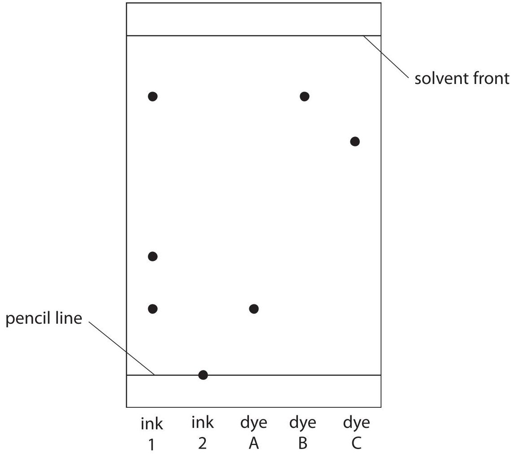

(a) Deduce what conclusions can be made about the composition of ink 1.

(b) (i) Give one conclusion that can be made about ink 2.

(ii) Suggest how the student could change the experiment to find the composition of ink 2.

(c) Calculate the $ R_{f} $ value of dye C, giving your answer to 2 significant figures.

(Total for Question 2 = 7 marks)

3 Crude oil is a mixture of organic compounds.

Most of these compounds are members of the same homologous series.

(a) State the name of this homologous series.

(b) An industrial process is used to separate crude oil into fractions.

(i) The process depends on a difference in a property of the fractions. What is this property?

A boiling point

B density

melting point

D solubility

(ii) The boxes give some uses of fractions and some names of fractions. Draw one straight line from each use to its correct fraction.

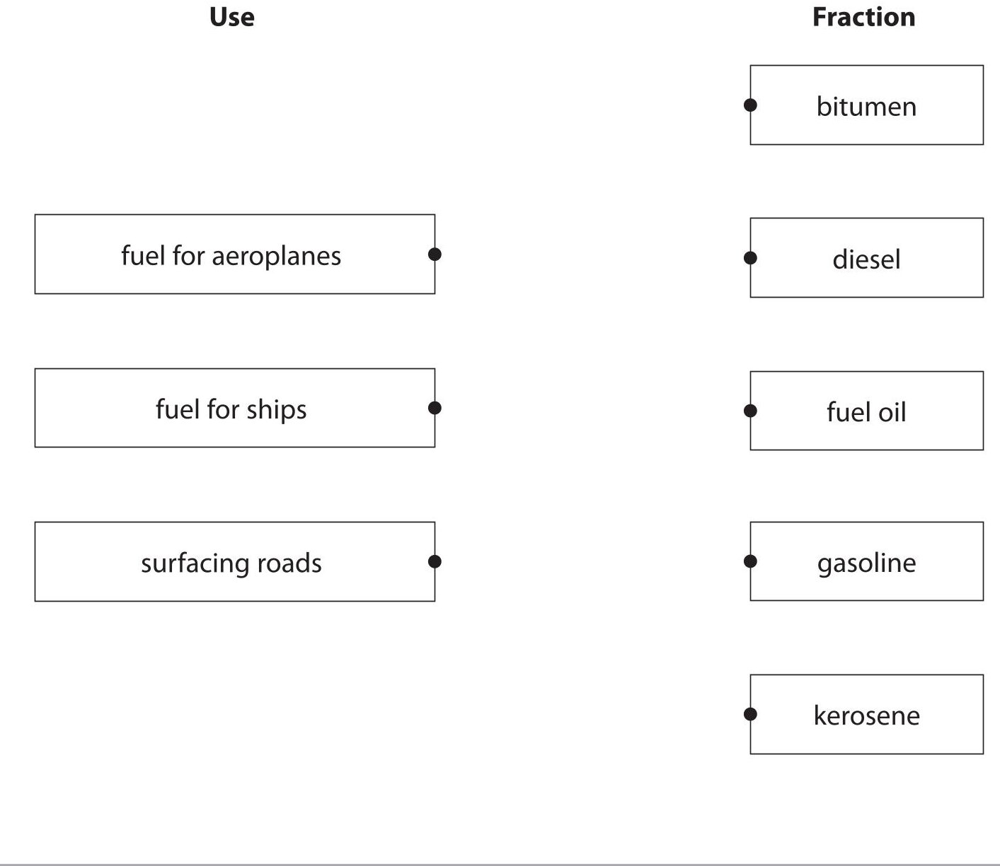

(c) Fuels obtained from the fractions may contain impurities.

Explain how the combustion of a common impurity in fuels may cause an environmental problem.

(d) Some of the fractions contain long-chain molecules which are not very useful.

(i) Give the name of the process used to convert long-chain molecules into more useful shorter-chain molecules.

(ii) Give the catalyst and temperature used in the industrial process to convert long-chain molecules into shorter-chain molecules.

catalyst

temperature

(iii) When $ C_{1 3} H_{2 8} $ is used in this process, three different molecules are formed.

Complete the equation for this reaction.

$$
\mathrm {C} _ {1 3} \mathrm {H} _ {2 8} \rightarrow \mathrm {C} _ {8} \mathrm {H} _ {1 8} +
$$

(Total for Question 3 = 13 marks)

4 When iron is left in damp air, rust forms on its surface.

(a) (i) State the chemical name for rust.

(ii) Explain how a barrier method prevents rusting.

(b) A student uses this apparatus to find the approximate percentage by volume of oxygen in air.

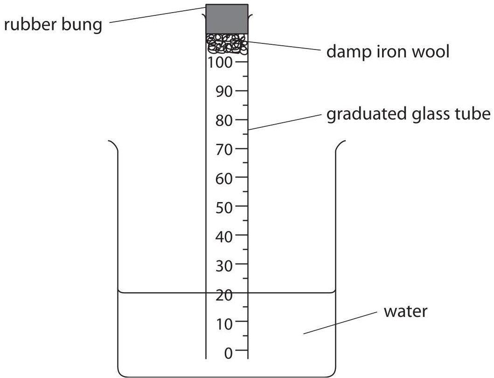

This is the student's method.

- place a graduated glass tube in a beaker of water

- place some damp iron wool and a rubber bung in the top of the tube

- record the reading of the water level in the tube

- leave the apparatus for a few days

- record the reading of the water level again

The diagram shows the readings at the start and at the end of the experiment.

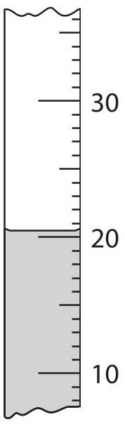

start

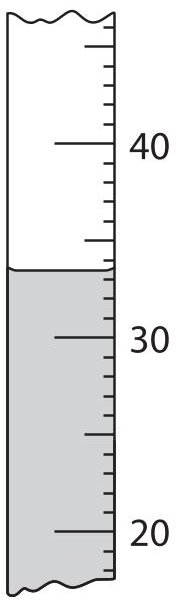

end

(i) Use the readings to complete the table, giving all values to the nearest $ 0. 5 \mathrm{c m}^{3}. $

<table border="1"><tr><td>reading at start in $ \mathrm{c m^{3}} $</td><td>20.5</td></tr><tr><td>reading at end in $ \mathrm{c m^{3}} $</td><td></td></tr><tr><td>volume of oxygen used in $ \mathrm{c m^{3}} $</td><td></td></tr></table>

(2) 

(ii) The student uses these results to calculate the percentage by volume of oxygen in air.

Suggest why her calculated value is lower than the expected value.

(1) 

(c) The student repeats the experiment using the same apparatus.

These are her results for the second experiment.

volume of air in tube at start = 80.0 $ cm^{3} $

reading at start=20.0

reading at end=35.5

Use the results to calculate the percentage by volume of oxygen in air.

## BLANK PAGE

5 A student uses this apparatus to investigate the effect of heat on different solid metal carbonates.

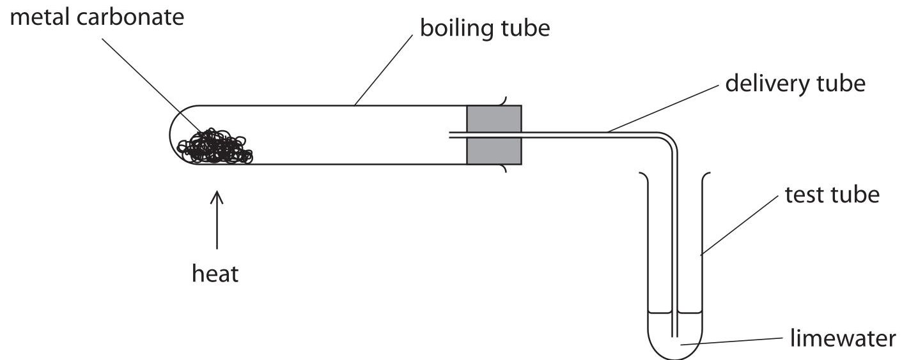

This is the student's method.

- use a spatula to put some metal carbonate in the boiling tube

- fit the delivery tube into position

- pour some limewater into the test tube

- start a timer and immediately begin to heat the metal carbonate

- record the time when a change first occurs in the limewater

The student repeats the method using different metal carbonates.

When a metal carbonate is heated a reaction sometimes occurs.

The equation for the reaction is

$$
\mathrm {m e t a l c a r b o n a t e} \rightarrow \mathrm {m e t a l o x i d e} + \mathrm {c a r b o n d i o x i d e}
$$

(a) State the name given to this type of reaction.

(b) State two variables that the student should control in this investigation.

(c) Suggest why bubbles appear in the limewater immediately after heating has started but before there is any change to the metal carbonate.

(d) Explain the purpose of limewater in this investigation.

(e) The table shows some of the results for the student's investigation.

<table border="1"><tr><td>Metal carbonate</td><td>Colour change of solid</td><td>Time taken for any change in limewater</td></tr><tr><td>calcium carbonate</td><td>remains white</td><td>90 seconds</td></tr><tr><td>sodium carbonate</td><td>remains white</td><td>no change</td></tr><tr><td>copper(II) carbonate</td><td></td><td>50 seconds</td></tr></table>

(i) State the colour change that occurs for copper(II) carbonate.

(ii) Give a chemical equation for this reaction of copper(II) carbonate.

(f) (i) There is a relationship between the position of a metal in the reactivity series and how easily the metal carbonate reacts when heated.

Use the student's results and your own knowledge to deduce this relationship.

(ii) State how you should extend the investigation to see if your deduction is correct.

(Total for Question 5 = 12 marks)

## BLANK PAGE

6 Zinc reacts with dilute hydrochloric acid to form hydrogen.

(a) (i) Give a chemical equation for this reaction.

(ii) Give a test for hydrogen gas.

(b) A student investigates the reaction between pieces of zinc and dilute hydrochloric acid. In each experiment, he uses the same mass of zinc but a different volume of the acid. He collects the hydrogen and measures its volume in each experiment. The graph shows the student's results.

Volume of hydrogen in $ \mathrm{c m}^{3} $

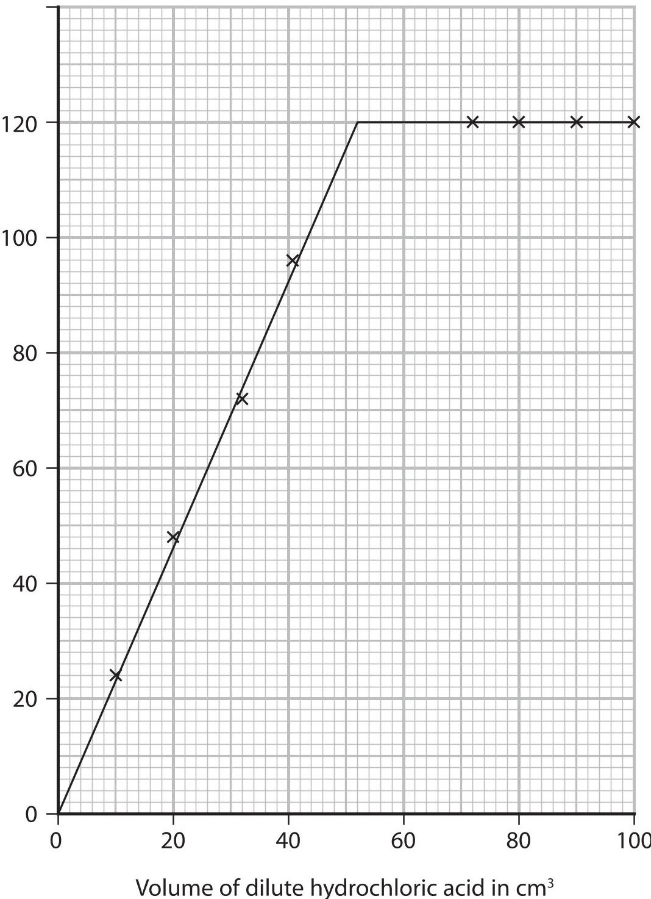

(i) Use the graph to find the minimum volume of acid needed to react with all of the zinc.

(ii) The student repeats the investigation, using hydrochloric acid of double the original concentration.

Determine the volume of hydrogen that would be collected using $ 1 5 \mathrm{c m}^{3} $ of this acid.

Show your working on the graph.

(c) Explain how increasing the concentration of the hydrochloric acid affects the rate of reaction.

(d) The rate of reaction could also be affected by changing the temperature of the hydrochloric acid, or by using a catalyst.

Explain one other way in which the rate of reaction between zinc and hydrochloric acid can be affected.

(Total for Question 6 = 12 marks)

## BLANK PAGE

7 The formation of ions and covalent bonds involves electrons.

The table gives the electronic configurations of atoms of hydrogen, lithium and chlorine.

<table border="1"><tr><td>Element</td><td>Electronic configuration of atom</td></tr><tr><td>hydrogen</td><td>1</td></tr><tr><td>lithium</td><td>2.1</td></tr><tr><td>chlorine</td><td>2.8.7</td></tr></table>

(a) Describe the different roles of electrons in the formation of

- ions in lithium chloride

- covalent bonds in hydrogen chloride

(b) Explain why lithium chloride has a higher melting point than hydrogen chloride. Refer to structure and bonding in your answer.

(Total for Question 7 = 8 marks)

8 (a) (i) Organic compounds can exist as isomers. Explain what is meant by the term isomers.

(ii) Organic compound Q reacts with bromine, without the presence of ultraviolet radiation, to form the compound $ \mathrm{C_{4} H_{8} B r_{2}} $

Draw the displayed formulae of two isomers of Q.

(b) An acrylic polymer can be formed from molecules with this structure.

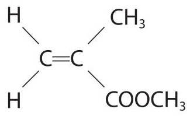

(i) A student describes the molecule as an unsaturated hydrocarbon Explain whether this is a correct description.

(ii) Name the type of polymerisation that occurs in the formation of the polymer.

(iii) Complete the equation for the polymerisation reaction.

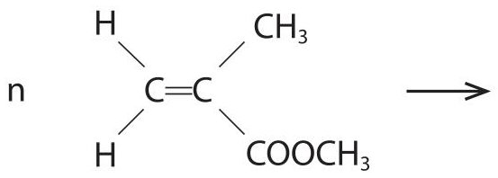

(c) Octane is a compound in petrol.

The equation for the complete combustion of octane is

$$
\mathrm {C} _ {8} \mathrm {H} _ {1 8} + 1 2. 5 \mathrm {O} _ {2} \rightarrow 8 \mathrm {C O} _ {2} + 9 \mathrm {H} _ {2} \mathrm {O}
$$

(i) The fuel tank of a car contains $ 5 0. 0 \mathrm{d m}^{3} $ of octane.

Calculate the mass, in kg, of carbon dioxide formed if all the octane in the fuel tank undergoes complete combustion.

[mass of 1 dm $ ^{3} $ of octane=700 g]

(ii) State an environmental problem caused by carbon dioxide.

## BLANK PAGE

9 Lithium, sodium and potassium are the first three elements in Group 1 of the Periodic Table. (a) Suggest why these three elements are all stored in paraffin oil.

(b) Caesium, Cs, is below potassium in Group 1.

(i) Give a similarity and a difference between the reactions of potassium with water and caesium with water.

similarity.

difference.

(ii) Give the chemical equation for the reaction between caesium and water.

(c) A student investigates the temperature change in the reaction between dilute acids and solutions of Group 1 hydroxides.

He uses this apparatus.

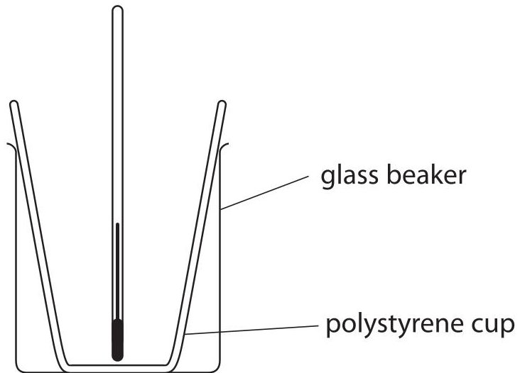

This is the student's method.

- measure the temperature of $ 5 0 \mathrm{c m}^{3} $ of hydrochloric acid

- pour the acid into a polystyrene cup

- add $ 5 0 \mathrm{c m}^{3} $ of sodium hydroxide solution to the acid

- measure the maximum temperature of the mixture

(i) Suggest what could be added to the apparatus to improve the experiment.

(ii) Explain a change to the method that would improve the accuracy of the experiment.

(d) These are the student's results.

$$
\begin{array}{l} \mathrm {t e m p e r a t u r e o f h y d r o c h l o r i c a c i d} = 1 9. 9 ^ {\circ} \mathrm {C} \\ \mathrm {m a x i m u m t e m p e r a t u r e o f m i x t u r e} = 2 6. 5 ^ {\circ} \mathrm {C} \\ \end{array}
$$

(i) Calculate the energy change, Q, in joules for this reaction.

[mass of $ 1. 0 \mathrm{c m}^{3} $ of mixture $ = 1. 0 \mathrm{g} $]

[for the mixture, c=4.2 J/g/ $ ^{\circ} \mathrm{C} $]

(ii) In the student's reaction between hydrochloric acid and sodium hydroxide, 0.050mol of water forms.

Calculate the molar enthalpy change, $ \Delta H $ , in kJ/mol for this reaction.

$$
\Delta H =
$$

(Total for Question 9 = 13 marks)

10 This question is about salts.

(a) Soluble salts can be prepared by the reaction between a metal oxide and an acid. The equation for this type of reaction is

$$
\mathrm {m e t a l o x i d e} + \mathrm {a c i d} \rightarrow \mathrm {s a l t} + \mathrm {w a t e r}
$$

(i) State the name given to this type of reaction.

(ii) State, in terms of protons, what happens in this reaction.

(b) (i) A student is given $ 5 0 \mathrm{c m}^{3} $ of dilute sulfuric acid and a bottle of solid copper(II) carbonate.

Describe the method that the student should use to prepare a saturated solution of copper(II) sulfate.

In your answer, refer to the pieces of apparatus that the student should use.

(ii) The student produces dry crystals of hydrated copper(II) sulfate from the saturated solution.

He calculates that 6.40 g of dry crystals should be formed.

The mass of dry crystals he actually obtains is 1.80 g less than he calculated.

Calculate the student's percentage yield.

Give your answer to one decimal place.

(c) (i) Gypsum is hydrated calcium sulfate.

A sample of gypsum contains 79% of calcium sulfate by mass.

Calculate the value of x in $ \mathrm{C a S O_{4}. x H_{2}O} $

[ $ M_{\mathrm{r}} $ of $ \mathrm{C a S O_{4}}=1 3 6 $ $ M_{\mathrm{r}} $ of $ \mathrm{H_{2}O}=1 8 ] $

(ii) Describe a test for calcium ions in the sample of gypsum.

(Total for Question 10 = 15 marks)

TOTAL FOR PAPER=110 MARKS

## BLANK PAGE

## BLANK PAGE

