<table><tr><td colspan="3">Please check the examination details below before entering your candidate information</td></tr><tr><td>Candidate surname</td><td colspan="2">Other names</td></tr><tr><td colspan="3">Centre Number Candidate Number</td></tr><tr><td colspan="3">Pearson Edexcel International GCSE (9-1)</td></tr><tr><td colspan="3">Monday 11 January 2021</td></tr><tr><td>Morning (Time: 2 hours)</td><td colspan="2">Paper Reference 4CH1/1C 4SD0/1C</td></tr><tr><td colspan="3">Chemistry
Unit: 4CH1
Science (Double Award) 4SD0
Paper: 1C</td></tr><tr><td colspan="2">You must have:
Calculator, ruler</td><td>Total Marks</td></tr></table>

## Instructions

- Use black ink or ball-point pen.

- Fill in the boxes at the top of this page with your name, centre number and candidate number.

- Answer all questions.

- Answer the questions in the spaces provided

- there may be more space than you need.

- Show all the steps in any calculations and state the units.

- Some questions must be answered with a cross in a box . If you change your mind about an answer, put a line through the box and then mark your new answer with a cross.

## Information

- The total mark for this paper is 110.

- The marks for each question are shown in brackets

- use this as a guide as to how much time to spend on each question.

## Advice

- Read each question carefully before you start to answer it.

- Write your answers neatly and in good English.

- Try to answer every question.

- Check your answers if you have time at the end.

Turn over

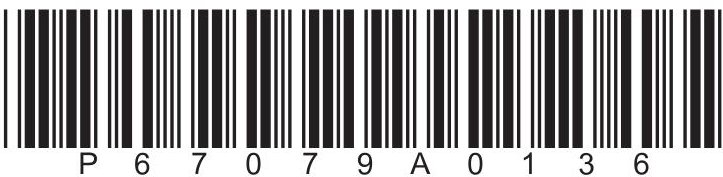

<table border="1"><tr><td>7Li lithium3</td><td>9Be beryllium4</td><td colspan="12">Key</td><td>4He helium2</td></tr><tr><td>23Na sodium11</td><td>24Mg magnesium12</td><td colspan="12">relative atomic massatomic symbolatomic (proton) number</td><td>20Ne neon10</td></tr><tr><td>39K potassium19</td><td>40Ca calcium20</td><td>45Sc scandium21</td><td>48Ti titanium22</td><td>51V vanadium23</td><td>52Cr chromium24</td><td>55Mn manganese25</td><td>56Fe iron26</td><td>59Co cobalt27</td><td>59Ni nickel28</td><td>63.5Cu copper29</td><td>65Zn zinc30</td><td>70Ga gallium31</td><td>73Ge germanium32</td><td>75As arsenic33</td><td>79Se selenium34</td><td>80Br bromine35</td><td>84Kr krypton36</td></tr><tr><td>85Rb rubidium37</td><td>88Sr strontium38</td><td>89Y yttrium39</td><td>91Zr zirconium40</td><td>93Nb niobium41</td><td>96Mo molybdenum42</td><td>[98]Tc technetium43</td><td>101Ru ruthenium44</td><td>103Rh rhodium45</td><td>106Pd palladium46</td><td>108Ag silver47</td><td>112Cd cadmium48</td><td>115In indium49</td><td>119Sn tin50</td><td>122Sb antimony51</td><td>128Te tellurium52</td><td>127I iodine53</td><td>131Xe xenon54</td></tr><tr><td>133Cs caesium55</td><td>137Ba barium56</td><td>139La* lanthanum57</td><td>178Hf hafnium72</td><td>181Ta tantalum73</td><td>184W tungsten74</td><td>186Re rhenium75</td><td>190Os osmium76</td><td>192Ir iridium77</td><td>195Pt platinum78</td><td>197Au gold79</td><td>201Hg mercury80</td><td>204TI thallium81</td><td>207Pb lead82</td><td>209Bi bismuth83</td><td>[209]Po polonium84</td><td>[210]At astatine85</td><td>[222]Rn radon86</td></tr><tr><td>[223]Fr francium87</td><td>[226]Ra radium88</td><td>[227]Ac* actinium89</td><td>[261]Rf rutherfordium104</td><td>[262]Db dubnium105</td><td>[266]Sg seaborgium106</td><td>[264]Bh bohrium107</td><td>[277]Hs hassium108</td><td>[268]Mt meitnerium109</td><td>[271]Ds darmstadtium110</td><td>[272]Rg roentgenium111</td><td colspan="6">Elements with atomic numbers112-116 have been reported but not fully authenticated</td></tr></table>

$ ^{*} $ The lanthanoids (atomic numbers 58-71) and the actinoids (atomic numbers 90-103) have been omitted.

The relative atomic masses of copper and chlorine have not been rounded to the nearest whole number.

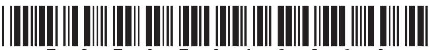

## Answer ALL questions.

1 This question is about states of matter.

(a) Use the words solid, liquid or gas to give the initial and final state of matter for each of the changes listed in the table.

The first one has been done for you.

<table border="1"><tr><td>Change</td><td>Initial state</td><td>Final state</td></tr><tr><td>melting</td><td>solid</td><td>liquid</td></tr><tr><td>sublimation</td><td></td><td></td></tr><tr><td>condensing</td><td></td><td></td></tr><tr><td>evaporation</td><td></td><td></td></tr></table>

(b) Particles in a solid are closely packed, arranged in a regular pattern and vibrate about fixed positions.

Describe the arrangement and movement of the particles in a gas.

(Total for Question 1 = 6 marks)

2 The table gives the melting and boiling points of four pure substances, W, X, Y and Z.

<table border="1"><tr><td></td><td>Melting point in℃</td><td>Boiling point in℃</td></tr><tr><td>W</td><td>-7</td><td>60</td></tr><tr><td>X</td><td>660</td><td>2500</td></tr><tr><td>Y</td><td>180</td><td>1330</td></tr><tr><td>Z</td><td>115</td><td>445</td></tr></table>

(a) (i) Which substance is a gas at 100 $ ^{\circ} \mathrm{C} $?

(1)

A W

B X

C Y

D Z

(ii) Which substance is a liquid for the largest range of temperature?

(1)

A W

B X

C Y

D Z

(iii) Which substance is a liquid at 1000 $ ^{\circ} \mathrm{C} $ and a gas at 2000 $ ^{\circ} \mathrm{C} $?

(1)

A W

B X

C Y

D Z

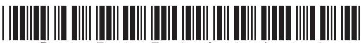

(b) Substance Y does not conduct electricity when solid but does conduct electricity when molten.

Give the type of bonding in substance Y.

(c) Suggest how the melting point of a pure substance changes when an impurity is added.

(Total for Question 2 = 5 marks)

3 Lead nitrate and potassium iodide react to form the insoluble solid lead iodide.

Crystals of lead nitrate and potassium iodide are placed at opposite ends of a container of water.

Solid lead iodide forms after several minutes.

The diagram shows the container at the start and after several minutes.

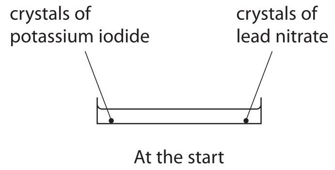

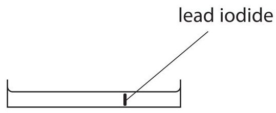

After several minutes

(a) Name the two processes that occur before the solid lead iodide forms.

(b) Explain why solid lead iodide takes less time to form when the reaction is repeated using water at a higher temperature.

(c) The formula for lead nitrate is $ \mathrm{P b ( N O_{3} )_{2}} $ (i) Give the number of different elements in lead nitrate.

(ii) Give the charge on the lead ion in $ \mathrm{P b ( N O_{3} )_{2}} $

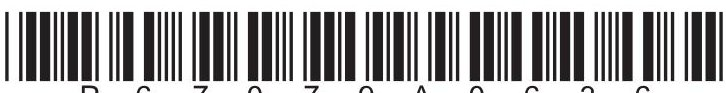

(d) Complete the chemical equation for the reaction between lead nitrate and potassium iodide.

$$
\mathrm {P b} \left(\mathrm {N O} _ {3}\right) _ {2} (\mathrm {a q}) + \dots \dots \dots \dots \dots \dots \dots \mathrm {K I} (\mathrm {a q}) \rightarrow \mathrm {P b I} _ {2} (\mathrm {s}) + \dots \dots \dots \dots \dots \dots \dots \mathrm {K N O} _ {3} (\mathrm {a q})
$$

(Total for Question 3 = 7 marks)

4 This question is about rusting.

(a) When iron rusts, it reacts with oxygen in the air.

A student uses the rusting of iron to find the percentage of oxygen in a sample of air.

The diagram shows the apparatus.

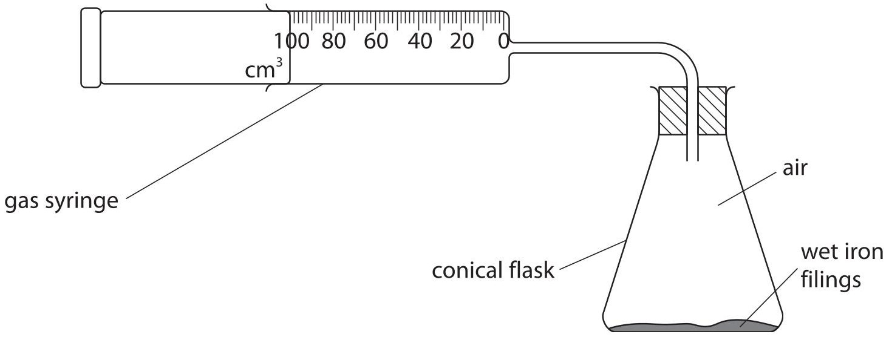

These are the student's results.

volume of air in conical flask and connecting tube $ = 2 6 5 \mathrm{c m}^{3} $

volume of air in gas syringe at start = 100 $ cm^{3} $

volume of air in gas syringe at end = 25 $ cm^{3} $

Calculate the percentage of oxygen in the sample of air using the student's results.

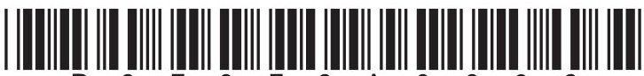

(b) (i) Cars are painted to prevent the iron in car bodies from rusting.

Explain how painting prevents the iron in car bodies from rusting.

(ii) Some car manufacturers use paint containing tiny particles of zinc.

Explain how particles of zinc prevent iron in car bodies from rusting even when this paint is scratched.

(Total for Question 4 = 7 marks)

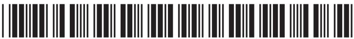

5 This question is about the separation of mixtures.

(a) The box gives some methods used to separate mixtures.

<table border="1"><tr><td>crystallisation</td><td>filtration</td><td>fractional distillation</td><td>simple distillation</td></tr></table>

Complete the table by giving the correct method from the box for each separation.

Each method can be used once, more than once or not at all.

(4) 

<table border="1"><tr><td>Separation</td><td>Method</td></tr><tr><td>insoluble solid from a liquid</td><td></td></tr><tr><td>pure water from a solution</td><td></td></tr><tr><td>liquid from a mixture of liquids with different boiling points</td><td></td></tr><tr><td>soluble solid from a solution</td><td></td></tr></table>

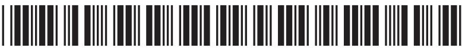

(b) A student uses chromatography to analyse the composition of purple ink.

The diagram shows the student's chromatogram at the end of the experiment.

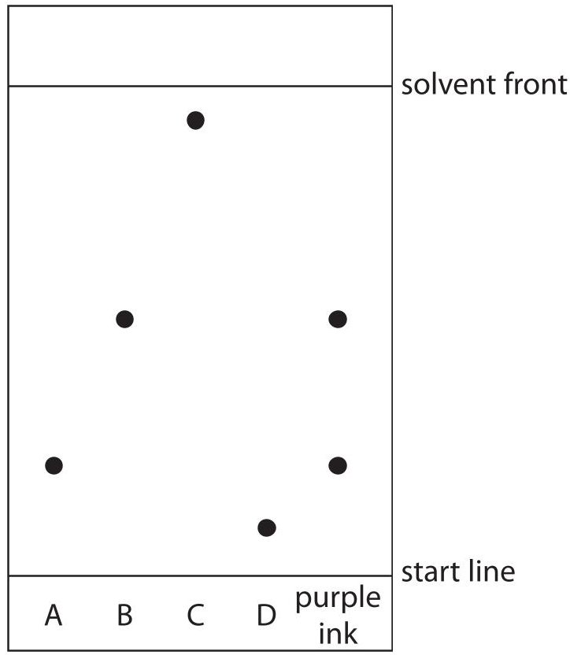

(i) Explain which dyes are contained in the purple ink.

(ii) Explain which dye is least soluble in the solvent.

(c) A different chromatography experiment is set up.

A spot of food colouring is placed on the start line.

A food dye in the colouring has an $ R_{f} $ value of 0.72

The distance between the start line and the solvent front is 120mm.

Calculate the distance the food dye moves from the start line.

(Total for Question 5 = 10 marks)

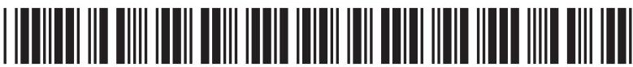

## BLANK PAGE

6 This question is about salts.

(a) When solutions of salts are mixed together, precipitates sometimes form.

The insoluble salt barium carbonate forms as a precipitate when solutions of the soluble salts ammonium carbonate and barium chloride react together.

When solutions of the soluble salts potassium chloride and magnesium sulfate are mixed, no precipitate forms.

Complete the table to show the results of mixing solutions of some soluble salts.

<table border="1"><tr><td></td><td>ammonium carbonate solution</td><td>magnesium sulfate solution</td></tr><tr><td>barium chloride solution</td><td>precipitate of barium carbonate</td><td></td></tr><tr><td>potassium chloride solution</td><td></td><td>no precipitate</td></tr><tr><td>calcium chloride solution</td><td></td><td>precipitate of calcium sulfate</td></tr></table>

(b) A student has four unlabelled beakers, each containing a colourless solution of a different salt.

The four solutions are

- potassium chloride

- potassium carbonate

- potassium iodide

- sodium chloride

Describe a method to identify each solution.

Do not refer to safety in your answer.

## BLANK PAGE

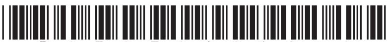

7 This question is about lithium oxide.

(a) The diagram shows the electron configurations of an atom of lithium and an atom of oxygen.

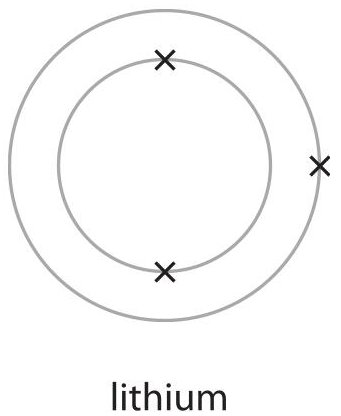

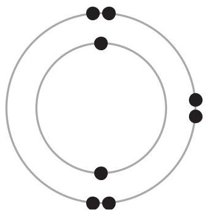

oxygen

Describe the changes in electronic configuration when lithium and oxygen react to form lithium oxide, $ \mathrm{L i_{2} O} $

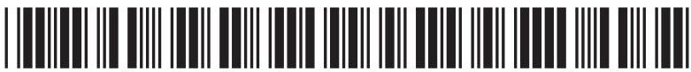

(b) Lithium oxide reacts with water to form lithium hydroxide as the only product. A scientist uses this apparatus to measure the temperature change of the reaction.

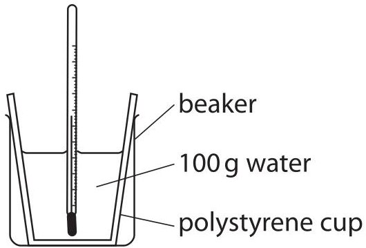

This is the scientist's method.

- pour 100g of water into a polystyrene cup

- record the temperature of the water

- add the lithium oxide and stir the mixture

- record the maximum temperature reached

The diagram shows the thermometer readings before and after adding the lithium oxide.

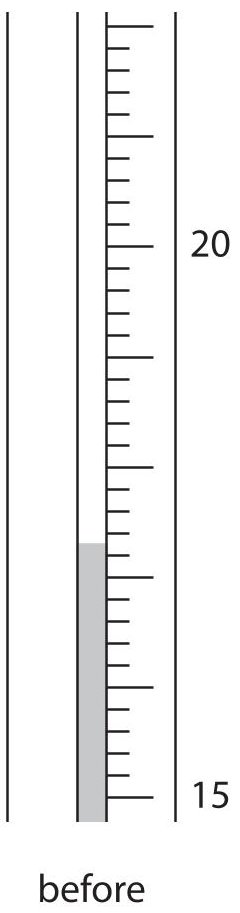

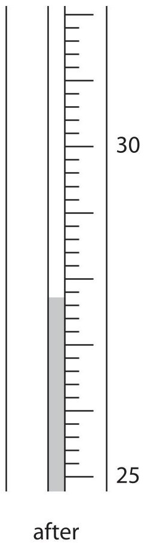

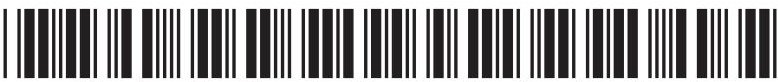

(i) Complete the table, giving all values to the nearest 0.1 $ ^{\circ} \mathrm{C}. $

<table border="1"><tr><td>temperature in $ ^{\circ}C $ after adding the lithium oxide</td><td></td></tr><tr><td>temperature in $ ^{\circ}C $ before adding the lithium oxide</td><td>17.3</td></tr><tr><td>temperature rise in $ ^{\circ}C $</td><td></td></tr></table>

(ii) Calculate the heat energy change in the reaction.

Give your answer to two significant figures.

$$
[ \mathrm {c} = 4. 2 \mathrm {J} / \mathrm {g} / ^ {\circ} \mathrm {C} ]
$$

heat energy change =

(iii) In another experiment the scientist obtains these results.

<table border="1"><tr><td>amount of lithium oxide in mol</td><td>0.0580</td></tr><tr><td>heat energy change in J</td><td>5210</td></tr></table>

Calculate the molar enthalpy change $ (\Delta H) $ in kJ/mol.

Include a sign in your answer.

(iv) Give a reason why the scientist does the experiment in a polystyrene cup.

(Total for Question 7 = 13 marks)

8 This question is about the halogens.

(a) The table gives some information about the halogens.

Complete the table by predicting the physical state of astatine at room temperature and the colour of astatine.

<table border="1"><tr><td>Halogen</td><td>Physical state at room temperature</td><td>Colour</td></tr><tr><td>fluorine</td><td>gas</td><td>yellow</td></tr><tr><td>chlorine</td><td>gas</td><td>pale green</td></tr><tr><td>bromine</td><td>liquid</td><td>red-brown</td></tr><tr><td>iodine</td><td>solid</td><td>grey</td></tr><tr><td>astatine</td><td></td><td></td></tr></table>

(b) Bromine has two isotopes with mass numbers 79 and 81

(i) The relative percentages of each isotope in a sample of bromine are

$$
\mathrm {bromine} - 7 9 = 5 1. 0 \%
$$

bromine-81=49.0%

Calculate the relative atomic mass of this sample of bromine.

Give your answer to one decimal place.

relative atomic mass=

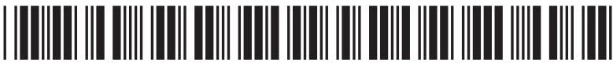

(ii) Give a reason why both isotopes of bromine have the same chemical properties.

(c) A student investigates the reactivity of some halogens.

She uses these solutions of halogens and their halides.

- bromine, chlorine and iodine

- sodium bromide, sodium chloride and sodium iodide

She adds each halogen solution to each halide solution.

The table shows her results.

<table border="1"><tr><td></td><td>Sodium bromide</td><td>Sodium chloride</td><td>Sodium iodide</td></tr><tr><td>Bromine</td><td>no reaction</td><td>no reaction</td><td>reaction occurs</td></tr><tr><td>Chlorine</td><td>reaction occurs</td><td>no reaction</td><td>reaction occurs</td></tr><tr><td>Iodine</td><td>no reaction</td><td>no reaction</td><td>no reaction</td></tr></table>

(i) Explain how these results show the order of reactivity of bromine, chlorine and iodine.

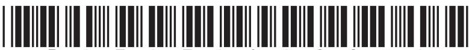

(ii) Suggest why the student does not need to add bromine solution to sodium bromide solution.

(iii) The ionic equation for the reaction between bromine and sodium iodide is

$$
\mathrm {B r} _ {2} (\mathrm {a q}) + 2 \mathrm {I} ^ {-} (\mathrm {a q}) \rightarrow \mathrm {I} _ {2} (\mathrm {a q}) + 2 \mathrm {B r} ^ {-} (\mathrm {a q})
$$

Explain why this is a redox reaction.

(Total for Question 8 = 12 marks)

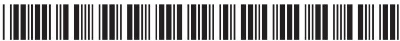

9 Propane is a hydrocarbon with the formula $ \mathrm{C_{3} H_{8}} $ (a) State why propane is a hydrocarbon.

(b) (i) Name the poisonous gas that forms when propane is burned in a limited supply of air.

(ii) State why this gas is poisonous to humans.

(c) The diagram represents a molecule of propane.

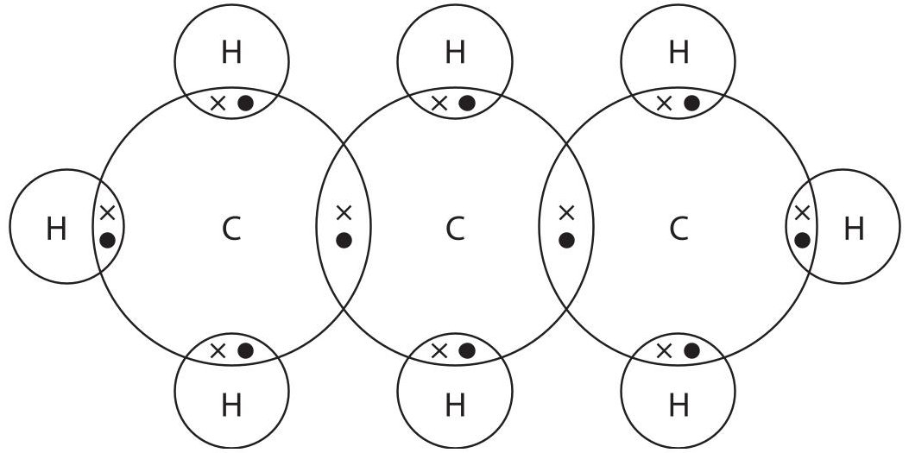

Describe the forces of attraction between the atoms in a molecule of propane.

(d) Propane can be produced by cracking.

An equation for cracking is

$$
\mathrm {C} _ {1 3} \mathrm {H} _ {2 8} \rightarrow \mathrm {C} _ {3} \mathrm {H} _ {8} + 2 \mathrm {C} _ {3} \mathrm {H} _ {6} + 2 \mathrm {C} _ {2} \mathrm {H} _ {4}
$$

Explain why cracking is an important process in the oil industry.

(e) Propane reacts with bromine in the presence of ultraviolet radiation.

(i) Complete the equation for this reaction.

$$
\mathrm {C} _ {3} \mathrm {H} _ {8} + \mathrm {B r} _ {2} \rightarrow
$$

(ii) Give the name of this type of reaction.

(Total for Question 9 = 12 marks)

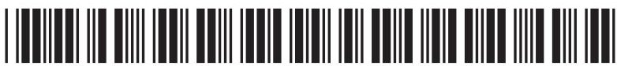

## BLANK PAGE

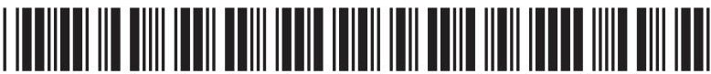

10 This question is about alkanes.

(a) The graph shows the boiling points of several unbranched alkanes.

$$
\mathrm {i n} ^ {\circ} \mathrm {C}
$$

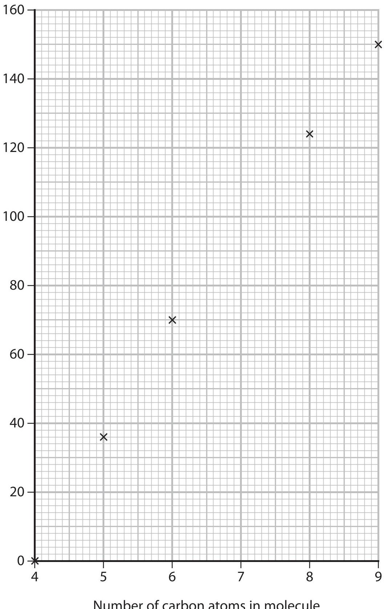

(i) Draw a curve of best fit.

(ii) Use the graph to find the boiling point of the alkane with 7 carbon atoms in its molecule.

Show on the graph how you obtain your answer.

(iii) Explain the trend shown by the graph.

(b) The diagram represents two isomers with the formula $ \mathrm{C}_{5} \mathrm{H}_{1 2} $

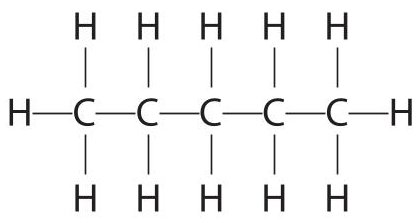

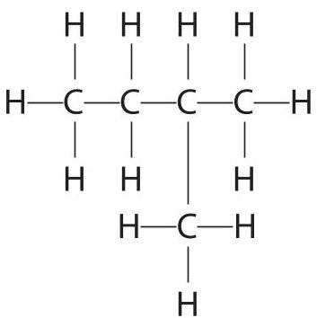

H

Explain why these compounds are isomers.

(2) 

(c) (i) An alkane contains 82.8% carbon and 17.2% hydrogen by mass. Show by calculation that the empirical formula of this alkane is $ C_{2} H_{5} $

(ii) Deduce the molecular formula of this alkane.

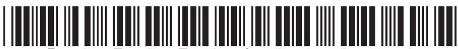

(d) The equation for the complete combustion of one mole of an alkane can be represented by

$$
\mathrm {a l k a n e} + \mathrm {Z O} _ {2} \rightarrow \mathrm {X C O} _ {2} + \mathrm {Y H} _ {2} \mathrm {O}
$$

Complete combustion of one mole of the alkane produces 308 g of carbon dioxide and 144 g of water.

X, Y and Z are the numbers used to balance the equation.

Calculate the values of X, Y and Z.

[M $ _{r} $ of $ CO_{2}=4 4 $ , M $ _{r} $ of $ H_{2}O=1 8 $ ]

## BLANK PAGE

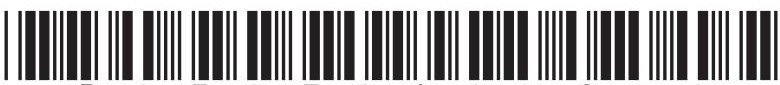

11 This question is about reactions that form gases.

(a) Hydrogen peroxide decomposes to form water and oxygen.

The equation for the reaction is

$$
2 \mathrm {H} _ {2} \mathrm {O} _ {2} \rightarrow 2 \mathrm {H} _ {2} \mathrm {O} + \mathrm {O} _ {2}
$$

25. 0 $ cm^{3} $ of hydrogen peroxide solution are poured into a conical flask and 1.00 g of solid manganese(IV) oxide is added.

Bubbles of oxygen gas are formed.

(i) Give the test for oxygen gas.

(ii) Describe a method to show that solid manganese(IV) oxide is a catalyst in this reaction and not a reactant.

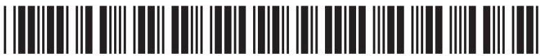

(b) A student uses this apparatus to investigate the rate of the reaction between zinc and an excess of dilute hydrochloric acid.

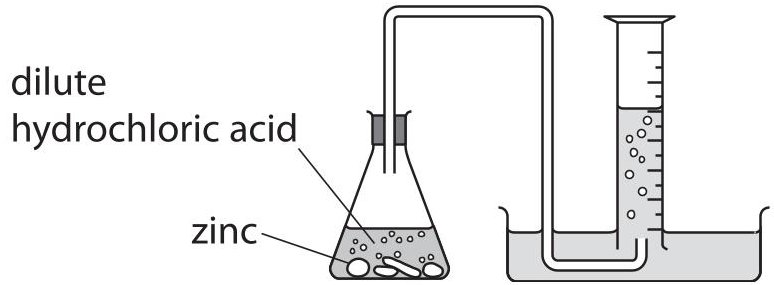

This is the student's method.

- pour $ 5 0 \mathrm{c m}^{3} $ of dilute hydrochloric acid into a conical flask

- add about 1.2g of zinc lumps

- record the volume of hydrogen gas collected every 30s until no more hydrogen is collected

The graph shows the student's results.

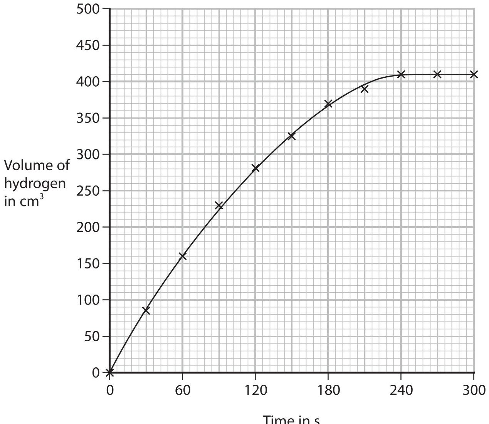

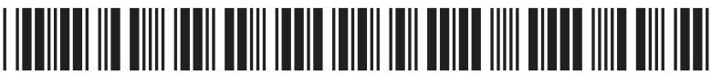

(i) Calculate the mean (average) rate of reaction, in $ cm^{3}/s $ , in the first 120 s.

$$
\mathrm {c m} ^ {3} / \mathrm {s}
$$

(ii) The equation for the reaction between zinc and hydrochloric acid is

$$
\mathrm {Z n} (\mathrm {s}) + 2 \mathrm {H C l} (\mathrm {a q}) \rightarrow \mathrm {Z n C l} _ {2} (\mathrm {a q}) + \mathrm {H} _ {2} (\mathrm {g})
$$

Use this equation and the particle collision theory to explain why the rate of reaction is greatest at the start of the reaction.

(iii) The student repeats the experiment at a higher temperature but keeps all other conditions the same.

On the grid, draw the curve you would expect to see in this experiment.

Question continues on next page

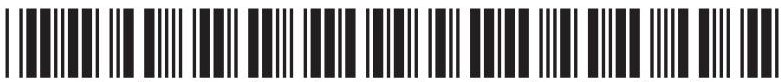

(iv) Explain why the rate of reaction is greater if the same mass of zinc powder is used instead of zinc lumps. All other conditions are kept the same.

(c) In another experiment, the student adds 0.55 g of zinc to a solution containing $ 2. 5 0 \times1 0^{-2} $ moles of hydrochloric acid.

Use the equation to show that hydrochloric acid is in excess.

$$
\mathrm {Z n} (\mathrm {s}) + 2 \mathrm {H C l} (\mathrm {a q}) \rightarrow \mathrm {Z n C l} _ {2} (\mathrm {a q}) + \mathrm {H} _ {2} (\mathrm {g})
$$

[ $ A_{\mathrm{r}} $ of Zn=65]

$$
(\mathrm {T o t a l f o r Q u e s t i o n 1 1 = 1 5 m a r k s})
$$

$$
\mathrm {T O T A L F O R P A P E R} = 1 1 0 \mathrm {M A R K S}
$$

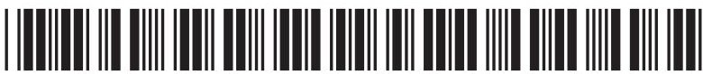
