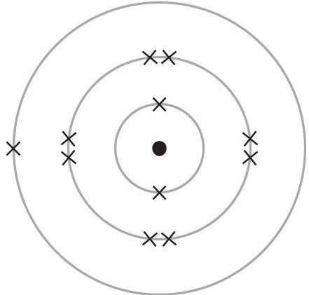
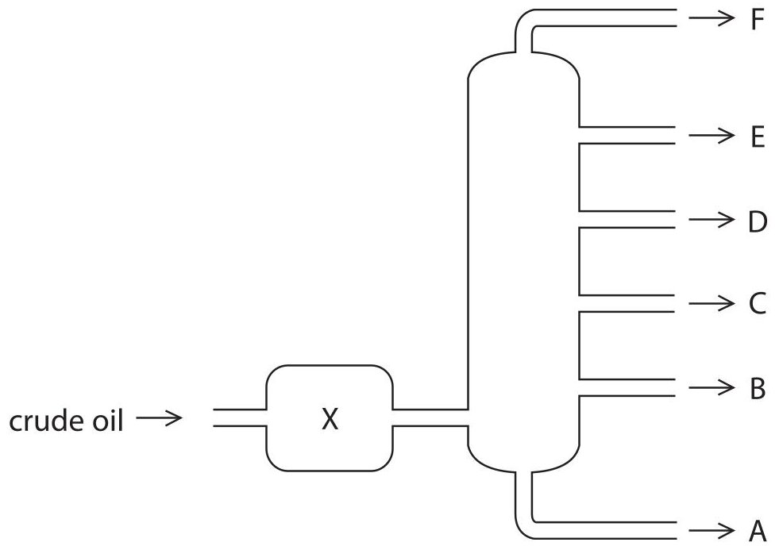
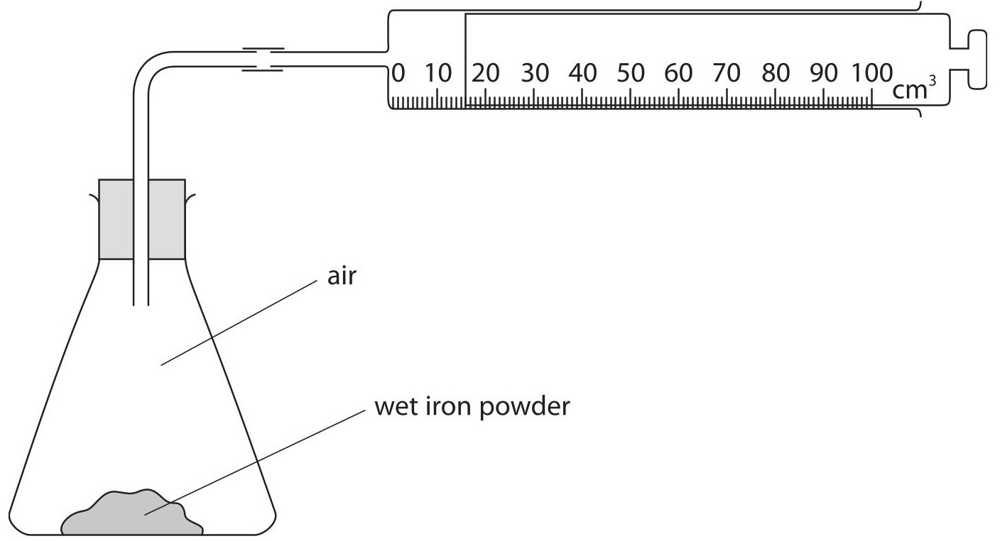
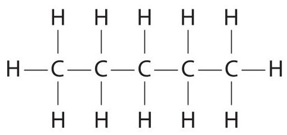
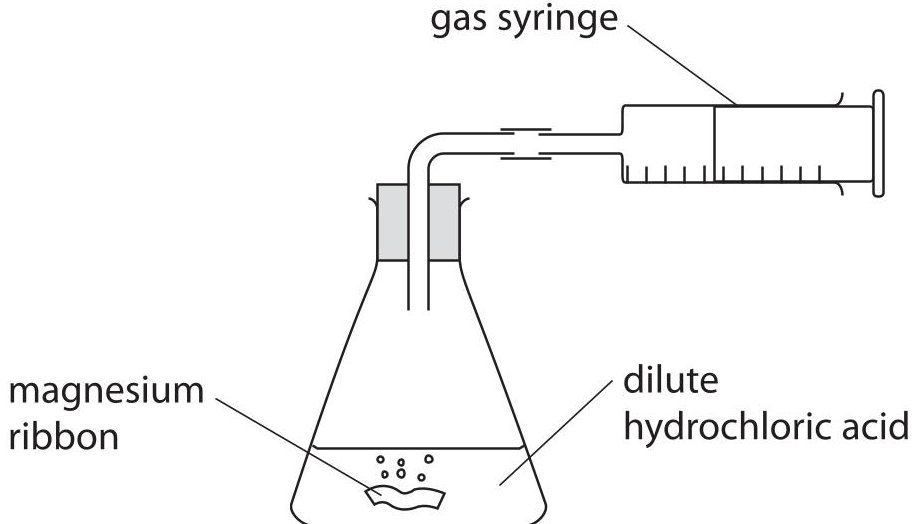
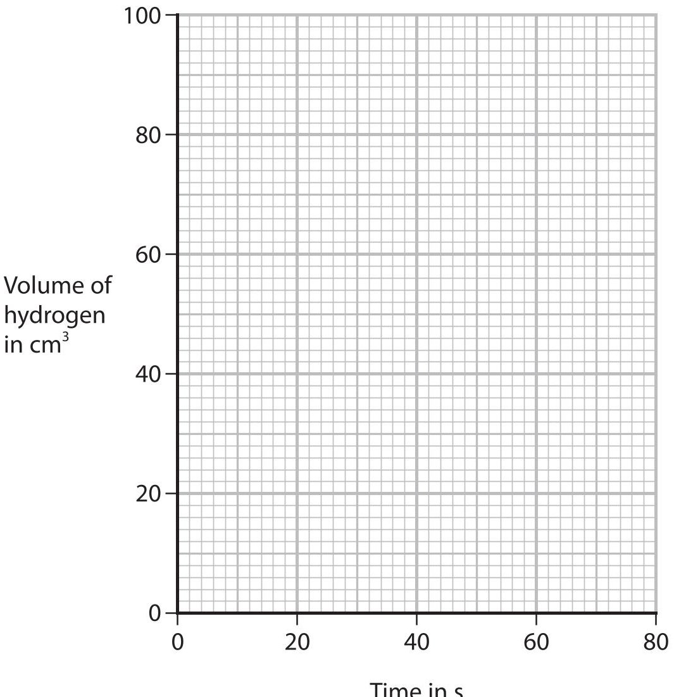
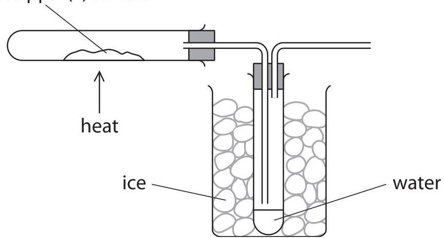
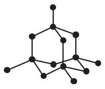
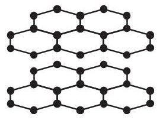
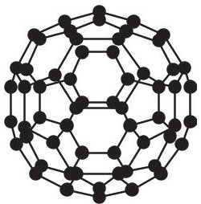

<table><tr><td colspan="3">Please check the examination details below before entering your candidate information</td></tr><tr><td>Candidate surname</td><td colspan="2">Other names</td></tr><tr><td>Centre Number</td><td colspan="2">Candidate Number</td></tr><tr><td colspan="3">Pearson Edexcel International GCSE (9-1)</td></tr><tr><td>Time 2 hours</td><td colspan="2">Paper reference 4CH1/1C 4SD0/1C</td></tr><tr><td colspan="3">Chemistry
UNIT: 4CH1
Science (Double Award) 4SD0
PAPER: 1C</td></tr><tr><td colspan="3">You must have:
Calculator, ruler</td></tr><tr><td colspan="3">Total Marks</td></tr></table>

## Instructions

- Use black ink or ball-point pen.

- Fill in the boxes at the top of this page with your name, centre number and candidate number.

- Answer all questions.

- Answer the questions in the spaces provided

- there may be more space than you need.

- Show all the steps in any calculations and state the units.

## Information

- The total mark for this paper is 110.

- The marks for each question are shown in brackets

- use this as a guide as to how much time to spend on each question.

## Advice

- Read each question carefully before you start to answer it.

- Write your answers neatly and in good English.

- Try to answer every question.

- Check your answers if you have time at the end.

Turn over

<table border="1"><tr><td>7Li lithium3</td><td>9Be beryllium4</td><td colspan="11">Key</td><td>4He helium2</td></tr><tr><td>23Na sodium11</td><td>24Mg magnesium12</td><td colspan="11">relative atomic mass atomic symbol atomic (proton) number</td><td>20Ne neon10</td></tr><tr><td>39K potassium19</td><td>40Ca calcium20</td><td>45Sc scandium21</td><td>48Ti titanium22</td><td>51V vanadium23</td><td>52Cr chromium24</td><td>55Mn manganese25</td><td>56Fe iron26</td><td>59Co cobalt27</td><td>59Ni nickel28</td><td>63.5Cu copper29</td><td>65Zn zinc30</td><td>70Ga gallium31</td><td>73Ge germanium32</td><td>75As arsenic33</td><td>79Se selenium34</td><td>80Br bromine35</td><td>84Kr krypton36</td></tr><tr><td>85Rb rubidium37</td><td>88Sr strontium38</td><td>89Y yttrium39</td><td>91Zr zirconium40</td><td>93Nb niobium41</td><td>96Mo molybdenum42</td><td>[98]Tc technetium43</td><td>101Ru ruthenium44</td><td>103Rh rhodium45</td><td>106Pd palladium46</td><td>108Ag silver47</td><td>112Cd cadmium48</td><td>115In indium49</td><td>119Sn tin50</td><td>122Sb antimony51</td><td>128Te tellurium52</td><td>127I iodine53</td><td>131Xe xenon54</td></tr><tr><td>133Cs caesium55</td><td>137Ba barium56</td><td>139La* lanthanum57</td><td>178Hf hafnium72</td><td>181Ta tantalum73</td><td>184W tungsten74</td><td>186Re rhenium75</td><td>190Os osmium76</td><td>192Ir iridium77</td><td>195Pt platinum78</td><td>197Au gold79</td><td>201Hg mercury80</td><td>204Tl thallium81</td><td>207Pb lead82</td><td>209Bi bismuth83</td><td>[209Po polonium84</td><td>[210At astatine85</td><td>[222Rn radon86</td></tr><tr><td>[223]Fr francium87</td><td>[226]Ra radium88</td><td>[227]Ac* actinium89</td><td>[261]Rf rutherfordium104</td><td>[262]Db dubnium105</td><td>[266]Sg seaborgium106</td><td>[264]Bh bohrium107</td><td>[277]Hs hassium108</td><td>[268]Mt meitnerium109</td><td>[271]Ds darmstadium110</td><td>[272]Rg roentgenium111</td><td colspan="6">Elements with atomic numbers 112-116 have been reported but not fully authenticated</td></tr></table>
$ ^{*} $ The lanthanoids (atomic numbers 58-71) and the actinoids (atomic numbers 90-103) have been omitted.
The relative atomic masses of copper and chlorine have not been rounded to the nearest whole number.
## Answer ALL questions.
Some questions must be answered with a cross in a box. If you change your mind about an answer, put a line through the box and then mark your new answer with a cross.
1 The diagram shows the electronic configuration of an atom of an element.

(a) Name the part of the atom that contains the protons and neutrons.
(b) Give the number of protons in this atom.
(c) Give the number of the group that contains this element.
(d) Give the number of the period that contains this element.
(e) Give the charge on the ion formed from this atom.
(Total for Question 1 = 5 marks)
2 (a) The box shows some changes of state.
<table border="1"><tr><td>boiling</td><td>condensation</td><td>evaporation</td></tr><tr><td>freezing</td><td>melting</td><td>sublimation</td></tr></table>
The table lists some physical changes.
Complete the table using words from the box to show the change of state for each physical change.
<table border="1"><tr><td>Physical change</td><td>Change of state</td></tr><tr><td>water to ice</td><td></td></tr><tr><td>steam to water</td><td></td></tr><tr><td>solid wax to liquid wax</td><td></td></tr><tr><td>iodine crystals to iodine vapour</td><td></td></tr></table>
(b) A student plans to obtain salt crystals from a mixture of salt and sand.
The student adds pure water to the mixture to dissolve the salt.
(i) State two things the student could do to make the salt dissolve quickly.
(ii) State what the student should do next to separate the sand from the salt solution.
(iii) Describe how the student can obtain pure dry crystals of salt from the salt solution.
(Total for Question 2 = 11 marks)
3 Crude oil is an important source of organic compounds.
(a) The diagram shows how crude oil can be separated into fractions by fractional distillation.

(i) State what happens to the crude oil when it is in X.
(ii) Give the name of fraction E.
(iii) Give a use for fraction A.
(b) One of the compounds in fraction D is tridecane $ \left( \mathrm{C}_{1 3} \mathrm{H}_{2 8} \right) $ which can be cracked to form shorter-chain hydrocarbons.
(i) State the catalyst and temperature used in this cracking reaction.
catalyst
temperature
(ii) The equation shows an example of a catalytic cracking reaction.
$$
\mathrm {C} _ {1 3} \mathrm {H} _ {2 8} \rightarrow \mathrm {C} _ {8} \mathrm {H} _ {1 8} + \mathrm {C} _ {2} \mathrm {H} _ {4} + \mathrm {C} _ {3} \mathrm {H} _ {6}
$$
Give two reasons why this reaction is important.
(c) Sulfur is an impurity in crude oil. Explain why this is a problem for the environment.
4 A student uses the reaction between iron and oxygen to find the percentage of oxygen in air.
The diagram shows the apparatus the student uses.

(a) (i) State why the iron powder needs to be wet.
(ii) State the colour of the compound formed in the reaction between iron and oxygen.
(iii) Give the formula of the compound formed.
(iv) Explain the advantage of using iron powder rather than pieces of iron.
(b) The syringe in the diagram shows the reading at the end of the experiment.
Complete table 1 to show the readings on the syringe.
Give both values to the nearest $ 1 \mathrm{c m}^{3}. $
<table border="1"><tr><td>syringe reading at start</td><td></td></tr><tr><td>syringe reading at end</td><td></td></tr><tr><td>change in volume in $ \mathrm{c m}^{3} $</td><td>65</td></tr></table>

Table 1

(c) The student repeats the experiment and obtains a different set of results.
Table 2 shows these results.
<table border="1"><tr><td>volume of air in conical flask and glass tube in $ \mathrm{cm}^{3} $</td><td>260</td></tr><tr><td>syringe reading at start</td><td>90</td></tr><tr><td>syringe reading at end</td><td>22</td></tr></table>

Table 2

Use the results from table 2 to calculate the percentage by volume of oxygen in the air.
percentage by volume of oxygen in air =
(Total for Question 4 = 10 marks)
5 This question is about alkanes and alkenes.
(a) The alkane $ \mathrm{C}_{5} \mathrm{H}_{1 2} $ has three isomers.
(i) State what is meant by the term isomers.
(ii) Calculate the relative formula mass $ ( M_{\mathrm{r}} ) $ of $ \mathrm{C_{5} H_{1 2}} $
$$
M _ {\mathrm {r}} \mathrm {o f} C _ {5} H _ {1 2} =
$$
(iii) This is the displayed formula of one of the isomers.

Give the name of this isomer.
(iv) Draw the displayed formulae of the other two isomers.
<table border="1"><tr><td>Isomer 1</td><td>Isomer 2</td></tr><tr><td></td><td></td></tr></table>
(b) Ethane $ \left( \mathrm{C}_{2} \mathrm{H}_{6} \right) $ and ethene $ \left( \mathrm{C}_{2} \mathrm{H}_{4} \right) $ both react with bromine.
Describe the differences in the reactions of ethane and ethene with bromine.
Refer to the conditions, the products and the types of reaction involved.
(Total for Question 5 = 11 marks)
## BLANK PAGE
6 A student uses this apparatus to investigate the reaction between magnesium and dilute hydrochloric acid.

(a) The word equation for the reaction is
$$
\mathrm {m a n g e s i u m} + \mathrm {h y d r o c h l o r i c a c i d} \rightarrow \mathrm {m a n g e s i u m c h l o r i d e} + \mathrm {h y d r o g e n}
$$
(i) Complete the chemical equation for this reaction.
$$
\mathrm {M g} + 2 \mathrm {H C l} \rightarrow
$$
(ii) Give the test for hydrogen.
(iii) The student uses 0.090 g of magnesium and 0.025 mol of hydrochloric acid. Show by calculation that the hydrochloric acid is in excess.
(b) The student measures the volume of hydrogen collected at regular intervals until the reaction stops.
The table shows the student's results.
<table border="1"><tr><td>Time in s</td><td>0</td><td>15</td><td>30</td><td>45</td><td>60</td><td>75</td></tr><tr><td>Volume of hydrogen in cm3</td><td>0</td><td>40</td><td>68</td><td>80</td><td>88</td><td>88</td></tr></table>
(i) Plot the student's results.
(ii) Draw a curve of best fit.

(iii) Determine the volume of hydrogen collected in the first 10 seconds.
Show on the graph how you obtained your answer.
$$
\mathrm {v o l u m e o f h y d r o g e n} =
$$

(iv) Explain why the rate of reaction is greatest at the start of the reaction.
(c) The student repeats the experiment at a temperature $ 5^{\circ} \mathrm{C} $ higher than the original temperature.
(i) On the grid, draw the curve you would expect the student to obtain.
All other conditions are kept the same.
(ii) Explain, in terms of particle collision theory, how increasing the temperature affects the rate of reaction.
## (Total for Question 6 = 15 marks)
7 This question is about copper and copper compounds.
(a) A sample of copper contains two isotopes.
- Cu-63 with relative abundance 69.5%
- Cu-65 with relative abundance 30.5%
(i) State what is meant by the term isotopes.
(ii) Calculate the relative atomic mass $ ( A_{r} ) $ of this sample of copper. Give your answer to three significant figures.
(b) When copper(II) carbonate is heated, copper(II) oxide and carbon dioxide are formed.
(i) What is the name of this type of reaction?
A decomposition
B neutralisation
oxidation
(ii) Which colour change occurs during this reaction?
D reduction
A blue to black
C green to black
D green to orange
(c) A student uses this apparatus to find the value of x in the formula $ \mathrm{C u S O_{4}. x H_{2} O} $
hydrated copper(II) sulfate

This is the student's method.
- add hydrated copper(II) sulfate to the tube and record the new mass
- find the mass of an empty boiling tube
- heat the hydrated copper(II) sulfate until it changes colour
- allow the tube to cool and record the mass again
The table shows the student's results.
<table border="1"><tr><td>mass of empty tube in g</td><td>20.52</td></tr><tr><td>mass of tube and CuSO4.xH2O in g</td><td>31.77</td></tr><tr><td>mass of tube and CuSO4 in g</td><td>28.20</td></tr></table>
(i) Calculate the mass of $ \mathrm{C u S O_{4}} $ formed.
$$
\mathrm {m a s s o f C u S O} _ {4} =
$$
(ii) Calculate the mass of water formed.
$$
\mathrm {m a s s o f w a t e r} =
$$
(iii) Show that the value of x is approximately 4
$$
[ M _ {\mathrm {r}} \mathrm {o f C u S O} _ {4} = 1 5 9. 5 M _ {\mathrm {r}} \mathrm {o f H} _ {2} \mathrm {O} = 1 8 ]
$$
(iv) The actual value of x is 5
Give a reason why the calculated value of x is lower than the actual value.
8 Diamond and graphite are giant covalent structures made of carbon atoms. The diagram shows their structures.

Diamond

Graphite

(a) Discuss the differences between diamond and graphite.
Refer to structure and bonding, electrical conductivity and hardness in your answer.
(b) $ C_{60} $ fullerene is a simple molecular substance made of 60 carbon atoms.
The diagram shows its structure.

The table shows the approximate melting points of diamond, graphite and $ C_{60} $ fullerene.
<table border="1"><tr><td>Substance</td><td>Approximate melting point in℃</td></tr><tr><td>diamond</td><td>4000</td></tr><tr><td>graphite</td><td>3600</td></tr><tr><td>C60fullerene</td><td>600</td></tr></table>
Explain why $ C_{60} $ fullerene has a much lower melting point than diamond and graphite.
9 This question is about the oxides of lead.
(a) Yellow lead oxide (PbO) can be reacted with hydrogen to produce lead.
(i) Complete the equation for the reaction by adding the missing state symbols.
$$
\mathrm {P b O (s)} + \mathrm {H} _ {2} (\dots \dots 
$$
(ii) What is the charge on the lead ion in PbO?
A 1-
B 1+
C 2-
D 2+
(iii) Explain why the reaction of yellow lead oxide with hydrogen is a redox reaction.
(iv) Describe a physical test to show that the water produced in this reaction is pure.
(b) When red lead oxide $ \mathrm{(P b_{3} O_{4})} $ is heated, yellow lead oxide forms.
The equation for the reaction is
$$
2 \mathrm {P b} _ {3} \mathrm {O} _ {4} \rightarrow 6 \mathrm {P b O} + \mathrm {O} _ {2}
$$
A scientist heats a known mass of red lead oxide in a crucible in a fume cupboard.
The scientist leaves the crucible to cool, then records the total mass of the crucible and its contents.
(i) Describe what the scientist should do next to make sure that all the red lead oxide has reacted.
(ii) The red lead oxide used in the reaction has a mass of 5.48 g.
Calculate the maximum mass of yellow lead oxide that could form.
[M r of Pb $ _{3} $ O $ _{4}=6 8 5 $ M r of PbO=223]
maximum mass of PbO=
(Total for Question 9 = 11 marks)
10 This question is about ammonia and ammonium compounds.
(a) Ammonia $ \mathrm{(N H_{3})} $ is a simple covalent molecule.
Draw a dot-and-cross diagram to show the bonding in a molecule of ammonia.
(b) The table shows the names and formulae of some ammonium compounds.
<table border="1"><tr><td>Name</td><td>ammonium sulfate</td><td></td><td>ammonium carbonate</td></tr><tr><td>Formula</td><td>(NH4)2SO4</td><td>NH4Cl</td><td></td></tr></table>
(i) Complete the table by giving the missing information.

(2) 

(ii) When ammonia reacts with sulfuric acid, ammonium sulfate is formed. Write a chemical equation for this reaction.
(iii) Describe a test for ammonium ions.
(c) The table gives some information about ammonia and ammonium compounds.
<table border="1"><tr><td>Name</td><td>Formula</td><td>Percentage of nitrogen(%)</td><td>Approximate pH in solution</td></tr><tr><td>ammonia</td><td>NH3(g)</td><td>82</td><td>11</td></tr><tr><td>ammonium nitrate</td><td>NH4NO3(s)</td><td></td><td>5.5</td></tr><tr><td>ammonium sulfate</td><td>(NH4)2SO4(s)</td><td>21</td><td>5.5</td></tr></table>
(i) Calculate the percentage of nitrogen in ammonium nitrate. $ [ M_{r} $ of $ \mathrm{N H_{4} N O_{3}}=8 0 ] $

(2) 

(ii) Fertilisers add nitrogen to the soil to help plants grow.
Ammonia and ammonium sulfate can both be used as fertilisers.
Discuss the advantages and disadvantages of using each of these compounds as fertilisers.
Use information from the table in your answer.
[pH of rainwater is approximately 5.6]
## (Total for Question 10 = 14 marks)
TOTAL FOR PAPER=110 MARKS
## BLANK PAGE
