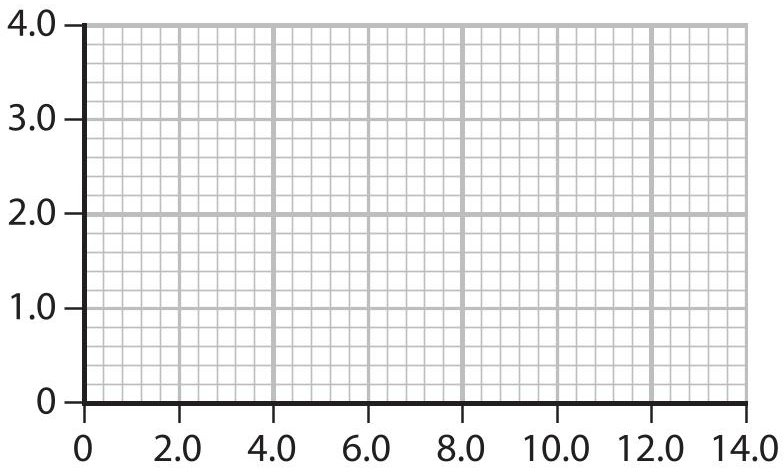
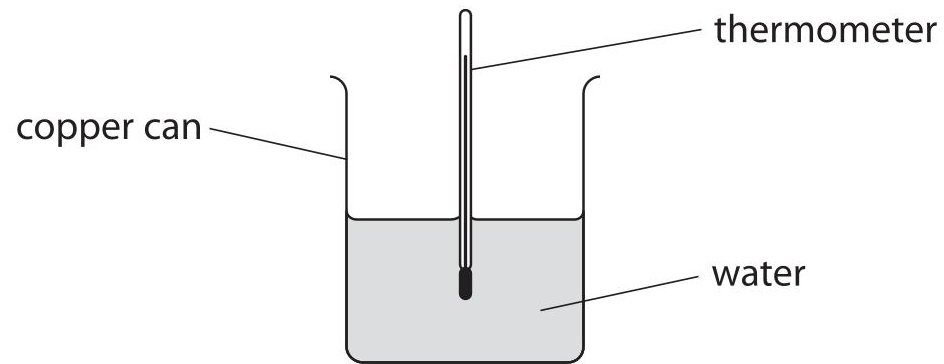
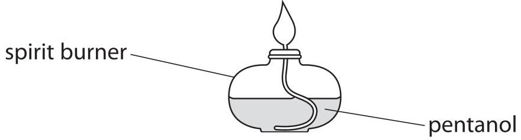
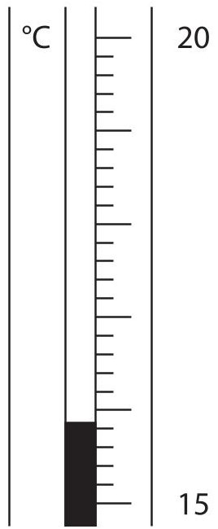
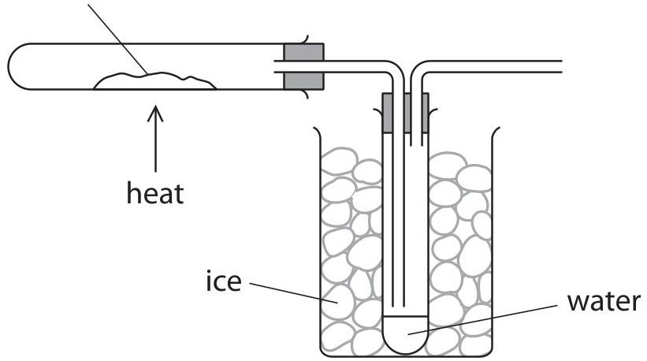
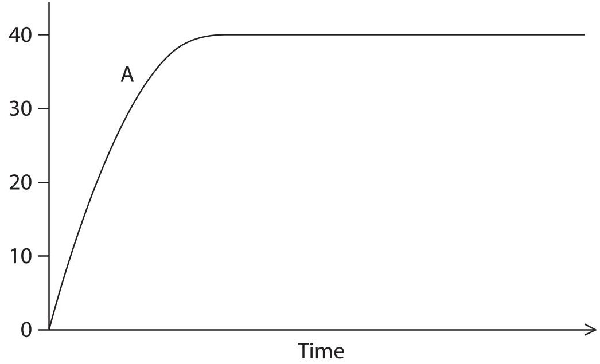
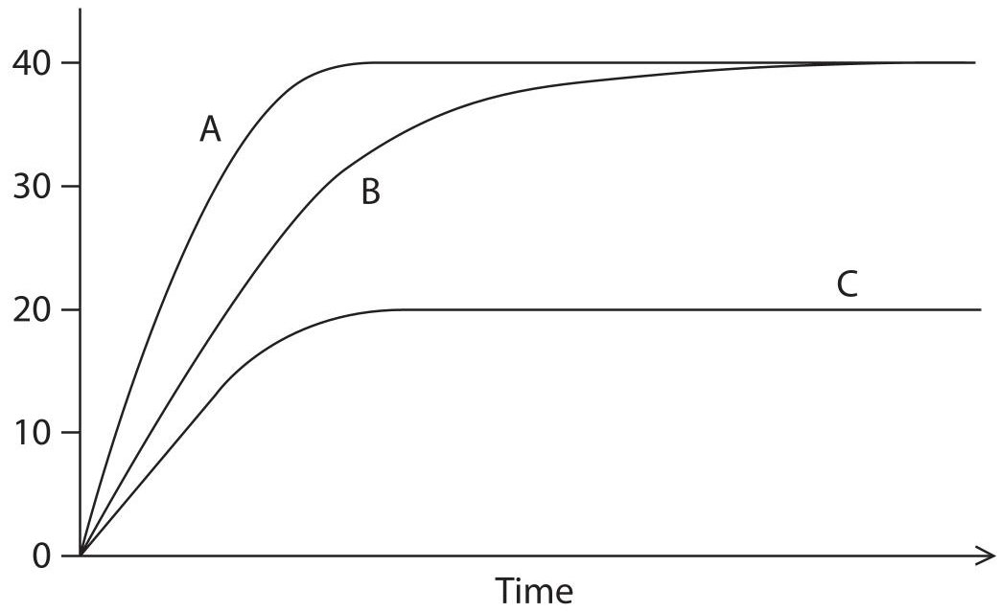

<table><tr><td colspan="3">Please check the examination details below before entering your candidate information</td></tr><tr><td colspan="2">Candidate surname</td><td>Other names</td></tr><tr><td>Centre Number</td><td colspan="2">Candidate Number</td></tr><tr><td colspan="3">Pearson Edexcel International GCSE (9-1)</td></tr><tr><td colspan="3">Monday 22 May 2023</td></tr><tr><td>Morning (Time: 2 hours)</td><td>Paper reference</td><td>4CH1/1C 4SD0/1C</td></tr><tr><td colspan="3">Chemistry
UNIT: 4CH1
Science (Double Award) 4SD0
PAPER: 1C</td></tr><tr><td colspan="2">You must have:
Calculator, ruler</td><td>Total Marks</td></tr></table>

## Instructions

- Use black ink or ball-point pen.

- If pencil is used for diagrams/sketches/graphs it must be dark (HB or B).

- Fill in the boxes at the top of this page with your name, centre number and candidate number.

- Answer all questions.

- Answer the questions in the spaces provided

- there may be more space than you need.

- Show all the steps in any calculations and state the units.

## Information

- The total mark for this paper is 110.

- The marks for each question are shown in brackets

- use this as a guide as to how much time to spend on each question.

## Advice

- Read each question carefully before you start to answer it.

- Write your answers neatly and in good English.

- Try to answer every question.

- Check your answers if you have time at the end.

Turn over

<table class="table table-bordered"><thead><tr><th>7 Li lithium 3</th><th>9 Be beryllium 4</th><th colspan="12">Key</th><th>4 He helium 2</th></tr></thead><tbody><tr><td>23 Na sodium 11</td><td>24 Mg magnesium 12</td><td colspan="12">relative atomic mass atomic symbol atomic (proton) number</td><td>20 Ne neon 10</td></tr><tr><td>39 K potassium 19</td><td>40 Ca calcium 20</td><td>45 Sc scandium 21</td><td>48 Ti titanium 22</td><td>51 V vanadium 23</td><td>52 Cr chromium 24</td><td>55 Mn manganese 25</td><td>56 Fe iron 26</td><td>59 Co cobalt 27</td><td>59 Ni nickel 28</td><td>63.5 Cu copper 29</td><td>65 Zn zinc 30</td><td>70 Ga gallium 31</td><td>73 Ge germanium 32</td><td>75 As arsenic 33</td><td>79 Se selenium 34</td><td>80 Br bromine 35</td><td>84 Kr krypton 36</td></tr><tr><td>85 Rb rubidium 37</td><td>88 Sr strontium 38</td><td>89 Y yttrium 39</td><td>91 Zr zirconium 40</td><td>93 Nb niobium 41</td><td>96 Mo molybdenum 42</td><td>[98] Tc technetium 43</td><td>101 Ru ruthenium 44</td><td>103 Rh rhodium 45</td><td>106 Pd palladium 46</td><td>108 Ag silver 47</td><td>112 Cd cadmium 48</td><td>115 In indium 49</td><td>119 Sn tin 50</td><td>122 Sb antimony 51</td><td>128 Te tellurium 52</td><td>127 I iodine 53</td><td>131 Xe xenon 54</td></tr><tr><td>133 Cs caesium 55</td><td>137 Ba barium 56</td><td>139 La* lanthanum 57</td><td>178 Hf hafnium 72</td><td>181 Ta tantalum 73</td><td>184 W tungsten 74</td><td>186 Re rhenium 75</td><td>190 Os osmium 76</td><td>192 Ir iridium 77</td><td>195 Pt platinum 78</td><td>197 Au gold 79</td><td>201 Hg mercury 80</td><td>204 TI thallium 81</td><td>207 Pb lead 82</td><td>209 Bi bismuth 83</td><td>[209] Po polonium 84</td><td>[210] At astatine 85</td><td>[222] Rn radon 86</td></tr><tr><td>[223] Fr francium 87</td><td>[226] Ra radium 88</td><td>[227] Ac* actinium 89</td><td>[261] Rf rutherfordium 104</td><td>[262] Db dubnium 105</td><td>[266] Sg seaborgium 106</td><td>[264] Bh bohrium 107</td><td>[277] Hs hassium 108</td><td>[268] Mt mettnerium 109</td><td>[271] Ds darmstadtium 110</td><td>[272] Rg roentgenium 111</td><td colspan="6">Elements with atomic numbers 112-116 have been reported but not fully authenticated</td></tr></tbody></table>
* The lanthanoids (atomic numbers 58-71) and the actinoids (atomic numbers 90-103) have been omitted.
The relative atomic masses of copper and chlorine have not been rounded to the nearest whole number.
## Answer ALL questions.
Some questions must be answered with a cross in a box. If you change your mind about an answer, put a line through the box and then mark your new answer with a cross.
1 The box gives some methods that are involved in the separation of mixtures.
chromatography crystallisation dissolving evaporating filtering fractional distillation simple distillation
(a) Use words from the box to identify the method involved in each of these separations.
(i) Give the best method for obtaining gasoline from crude oil.
(ii) Give the best method for separating the dyes in black ink.
(iii) Give the best method for obtaining pure water from seawater.
(b) A sample of solid hydrated copper(II) sulfate can be obtained from a mixture of copper(II) oxide and copper(II) sulfate.
Complete the passage by using words from the box.
The mixture of copper(II) oxide and copper(II) sulfate can be separated by first the copper(II) sulfate in distilled water.
The copper(II) oxide is then removed by
Some of the water from the copper(II) sulfate solution is then removed by
A pure sample of hydrated copper(II) sulfate is then obtained by
(Total for Question 1 = 7 marks)
2 This question is about the reactions of iron.
(a) Iron rusts when exposed to water and oxygen.
(i) Give the chemical name of the compound that forms when iron rusts.
(ii) What type of reaction occurs when iron rusts?
A combustion
B decomposition
neutralisation
oxidation
(iii) Galvanising is a method used to prevent iron from rusting. Give the name of the metal used to galvanise iron.
(b) When iron reacts with dilute sulfuric acid, the products are iron(II) sulfate and hydrogen.
(i) Give a chemical equation for the reaction between iron and sulfuric acid.
(ii) Give a test for hydrogen.
(c) An excess of iron is added to copper(II) sulfate solution.
(i) Name the type of reaction that occurs.
(ii) State the appearance of the solid that forms in the reaction.
(d) Give the reason why no reaction occurs when iron is added to magnesium sulfate solution.
(Total for Question 2 = 8 marks)

3 The table gives some information about three substances, X, Y and Z.

<table border="1"><tr><td>Substance</td><td>Melting point</td><td>Conducts electricity when solid</td><td>Conducts electricity when molten</td><td>Type of bonding</td><td>Type of structure</td></tr><tr><td>X</td><td>low</td><td>no</td><td>no</td><td>covalent</td><td>simple molecular</td></tr><tr><td>Y</td><td>high</td><td>no</td><td>no</td><td></td><td></td></tr><tr><td>Z</td><td>high</td><td>no</td><td>yes</td><td></td><td></td></tr></table>
(a) Complete the table by giving the missing information.
(b) Explain why substance X has a low melting point.

(Total for Question 3 = 6 marks)

4 This question is about unsaturated hydrocarbons.
(a) Ethene $ \left( \mathrm{C}_{2} \mathrm{H}_{4} \right) $ is a member of the homologous series of alkenes.
(i) Give two characteristics of a homologous series.
(ii) Draw a dot-and-cross diagram to show the bonding in a molecule of ethene. Show outer electrons only.
(b) Propene $ \left( \mathrm{C}_{3} \mathrm{H}_{6} \right) $ is another member of the homologous series of alkenes.
(i) State why the empirical formula of all alkenes in this homologous series is $ \mathrm{C H_{2}} $
(ii) Propene can be polymerised to form poly(propene).
Draw the displayed formula of propene and the repeat unit of poly(propene).

(2) 

<table border="1"><tr><td>propene</td><td>repeat unit of poly(propene)</td></tr><tr><td></td><td></td></tr></table>
(c) This is the structural formula of another hydrocarbon compound.
$$
\mathrm {C H} _ {2} = \mathrm {C H} - \mathrm {C H} = \mathrm {C H} _ {2}
$$
(i) Give the molecular formula and the empirical formula of this compound.
molecular formula
empirical formula
(ii) Explain why this compound is an unsaturated hydrocarbon.
(iii) Describe a test to show that this hydrocarbon is unsaturated.
(Total for Question 4 = 14 marks)
5 This question is about lithium and some of its compounds.
(a) A small piece of lithium is added to a trough containing water.
The lithium floats on the surface of the water and a vigorous reaction occurs.
(i) Give two other observations when lithium reacts with water.
(ii) A few drops of methyl orange are added to the solution in the trough Explain the final colour of the solution.
(b) An unlabelled bottle containing a white powder is found in a laboratory.
Describe tests to show that the white powder in the bottle is lithium carbonate.
## (c) Lithium carbonate has ionic bonding.
State what is meant by the term ionic bonding.
## BLANK PAGE
6 When solutions of lead(II) nitrate and potassium chloride are mixed, a precipitate of lead(II) chloride forms.
(a) (i) Complete the equation for the reaction by adding the state symbols.
$$
\mathrm {P b} \left(\mathrm {N O} _ {3}\right) _ {2} (\dots \dots \dots \dots) + 2 \mathrm {K C I} (\dots \dots \dots \dots) \rightarrow \mathrm {P b C I} _ {2} (\dots \dots \dots \dots) + 2 \mathrm {K N O} _ {3} (\dots \dots \dots \dots)
$$
(ii) Give the formula of each ion in lead(II) nitrate.
lead ion
nitrate ion
(iii) Calculate the relative formula mass $ ( M_{r} ) $ of lead(II) nitrate, $ \mathrm{P b ( N O_{3} )_{2}} $
(b) A student investigates the height of the precipitate formed when lead(II) nitrate solution is added to potassium chloride solution.
This is the student's method.
Step 1 pour $ 1 5. 0 \mathrm{c m}^{3} $ of potassium chloride solution into a boiling tube
Step 2 add $ 2. 0 \mathrm{c m}^{3} $ of lead(II) nitrate solution and allow the precipitate to settle
Step 3 measure the height of the precipitate
Repeat steps 2 and 3 until a total of $ 1 4. 0 \mathrm{c m}^{3} $ of lead(II) nitrate solution has been added.
The table shows the student's results.
<table border="1"><tr><td>Volume of lead(II) nitrate in $ \mathrm{c m^{3}} $</td><td>2.0</td><td>4.0</td><td>6.0</td><td>8.0</td><td>10.0</td><td>12.0</td><td>14.0</td></tr><tr><td>Height of precipitate in cm</td><td>0.8</td><td>1.6</td><td>2.9</td><td>3.2</td><td>3.6</td><td>3.6</td><td>3.6</td></tr></table>
(i) Plot the results on the grid.
(ii) Draw a circle around the anomalous result.
(iii) Draw a line of best fit through the first four points and another line of best fit through the last three points. Make sure that the lines cross.
Height of precipitate in cm

Volume of lead(II) nitrate in $ cm^{3} $
(iv) Give two possible mistakes the student could have made to cause the anomalous result.
(v) State why the first line of best fit should pass through the origin.
(vi) Use your graph to determine the volume of lead(II) nitrate solution needed to react completely with $ 1 5. 0 \mathrm{c m}^{3} $ of potassium chloride solution.
volume =
(Total for Question 6 = 12 marks)
7 This question is about the three halogens, bromine, chlorine and iodine.
(a) Give the number of protons and the number of neutrons in an atom of iodine-127 number of protons
number of neutrons
(b) A sample of bromine contains two isotopes.
- Br-79 with relative abundance 52.8%
- Br-81 with relative abundance 47.2%
Calculate the relative atomic mass $ ( A_{\mathrm{r}}) $ of this sample of bromine.
Give your answer to three significant figures.
(c) Aluminium reacts with chlorine to form aluminium chloride.
This is the equation for the reaction.
$$
2 \mathrm {A I} + 3 \mathrm {C l} _ {2} \rightarrow 2 \mathrm {A I C l} _ {3}
$$
Calculate the minimum mass of chlorine needed to form 26.7 g of aluminium chloride.
[for $ \mathrm{C I_{2}} $ $ M_{\mathrm{r}}=7 1 $ for $ \mathrm{A I C I_{3}} $ $ M_{\mathrm{r}}=1 3 3. 5 $

(d) A student mixes the following pairs of solutions.
Pair 1 bromine solution and potassium chloride solution
Pair 2 bromine solution and potassium iodide solution
Explain how the student can use the results of these experiments to show the order of reactivity of the three halogens, bromine, chlorine and iodine.
Include observations in your answer.
(Total for Question 7 = 14 marks)
## BLANK PAGE
8 A student uses this apparatus to find the molar enthalpy change $ (\Delta H) $ of combustion for the liquid fuel, pentanol.

This is the student's method.
- find the initial mass of the spirit burner and pentanol
- add 100 $ cm^{3} $ of water to the copper can
- record the initial temperature of the water
- light the wick of the spirit burner to heat the water
- stir the water until the temperature rises by $ 3 5. 0^{\circ} \mathrm{C} $
- extinguish the flame and immediately find the final mass of the spirit burner and pentanol
(a) (i) State why the student stirs the water.
(ii) Suggest why it is important that the student immediately finds the final mass of the spirit burner and pentanol.

(b) The diagram shows the initial temperature of the water.

Complete the table to show the temperature readings.
Give both values to the nearest 0.1 $ ^{\circ} \mathrm{C}. $
<table border="1"><tr><td>Initial temperature of water in℃</td><td></td></tr><tr><td>Final temperature of water in℃</td><td></td></tr><tr><td>Temperature change in℃</td><td>35.0</td></tr></table>
(c) (i) Show by calculation that the heat energy (Q) supplied by the pentanol is approximately 15000 J.
[for water, c=4.2 J/g/ $ ^{\circ} \mathrm{C} $]
[for $ 1. 0 \mathrm{c m}^{3} $ of water, mass = 1.0 g]
(ii) The table gives the initial and final mass readings.
<table border="1"><tr><td>Initial mass of spirit burner and pentanol in g</td><td>90.11</td></tr><tr><td>Final mass of spirit burner and pentanol in g</td><td>89.75</td></tr></table>
Use your answer to part (c)(i) and the information in the table to calculate the molar enthalpy change $ \Delta H $ of combustion, in kJ/mol, for pentanol.
[for pentanol, $ M_{\mathrm{r}}=8 8 $]
Include a sign in your answer.
(d) The formula of pentanol is $ \mathrm{C_{5} H_{1 1} O H} $
Write a chemical equation for the complete combustion of pentanol.
9 This question is about different hydrated forms of sodium sulfate.
(a) A compound has the formula $ \mathrm{N a_{2} S O_{4}. 7 H_{2} O} $
(i) How many different elements are there in the formula $ \mathrm{N a_{2} S O_{4}. 7 H_{2} O} $?
A 3
B 4
C 5
D 10
(ii) What is the total number of atoms in the formula $ \mathrm{N a_{2} S O_{4}. 7 H_{2} O} $
A 10
B 22
C 27
D 28
(b) Another hydrated form of sodium sulfate has the formula $ \mathrm{N a_{2} S O_{4}. x H_{2} O} $ A student uses this apparatus to find the value of x.
hydrated sodium sulfate

This is the student's method.
- find the mass of an empty tube
- add solid hydrated sodium sulfate to the tube
- find the mass of the tube and hydrated sodium sulfate
- heat the tube for several minutes
- allow the tube to cool and find the mass of the tube and contents
(i) Describe what the student should do next to make sure that all the water is removed from the hydrated sodium sulfate.
(ii) Explain the role of the ice in the beaker.
(iii) Describe how the student could prove that the liquid collected is pure water.
(c) The table gives the student's results.
<table border="1"><tr><td>Mass of empty tube in g</td><td>15.83</td></tr><tr><td>Mass of tube and Na2SO4.xH2O in g</td><td>23.88</td></tr><tr><td>Mass of tube and Na2SO4 in g</td><td>19.38</td></tr></table>
Use the student's results to calculate the value of x.
$$
[ \mathrm {f o r N a} _ {2} \mathrm {S O} _ {4}, M _ {\mathrm {r}} = 1 4 2 \quad \mathrm {f o r H} _ {2} \mathrm {O}, M _ {\mathrm {r}} = 1 8 ]
$$
10 Zinc reacts with dilute hydrochloric acid to form zinc chloride and hydrogen gas. This is the equation for the reaction.
$$
\mathrm {Z n} (\mathrm {s}) + 2 \mathrm {H C l} (\mathrm {a q}) \rightarrow \mathrm {Z n C l} _ {2} (\mathrm {a q}) + \mathrm {H} _ {2} (\mathrm {g})
$$
(a) In an experiment, $ 2 0 \mathrm{c m}^{3} $ of hydrochloric acid containing 0.0036 mol are reacted with 1.3 g of zinc granules at a temperature of $ 3 0^{\circ} \mathrm{C}. $
(i) Show by calculation that the zinc is in excess.
(ii) The volume of hydrogen collected is measured at regular time intervals.
Curve A shows the results of this experiment.
Volume of hydrogen in $ \mathrm{c m}^{3} $

The experiment is repeated using 1.3 g of zinc powder instead of zinc granules.
All other conditions are kept the same.
On the grid, draw the curve you would expect to obtain.
(b) In the original experiment, $ 2 0 \mathrm{c m}^{3} $ of hydrochloric acid containing 0.0036 mol were reacted with 1.3 g of zinc granules at a temperature of $ 3 0^{\circ} \mathrm{C} $ and curve A was obtained.
The student does two more experiments and obtains curves B and C.
Volume of hydrogen in $ \mathrm{c m}^{3} $

(i) In one of these experiments the student repeats the original method but at a temperature of $ 2 0^{\circ} \mathrm{C} $
Explain in terms of particle collision theory why the curve obtained could be curve B.
(ii) In the other experiment the student repeats the original method but uses $ 2 0 \mathrm{c m}^{3} $ of hydrochloric acid containing 0.0018 mol.
Explain why curve C shows the results the student obtained.
(c) Catalysts can be used to speed up reactions. Describe how a catalyst works.
(Total for Question 10 = 12 marks)
TOTAL FOR PAPER = 110 MARKS
## BLANK PAGE
## BLANK PAGE
## BLANK PAGE
