<table><tr><td colspan="3">Please check the examination details below before entering your candidate information</td></tr><tr><td colspan="2">Candidate surname</td><td>Other names</td></tr><tr><td>Centre Number</td><td colspan="2">Candidate Number</td></tr><tr><td colspan="3">Pearson Edexcel International GCSE (9-1)</td></tr><tr><td colspan="3">Friday 17 May 2024</td></tr><tr><td colspan="2">Morning (Time: 2 hours)</td><td>Paper reference 4CH1/1CR 4SD0/1CR</td></tr><tr><td colspan="3">Chemistry
UNIT: 4CH1
Science (Double Award) 4SD0
PAPER: 1CR</td></tr><tr><td colspan="2">You must have:
Calculator, ruler</td><td>Total Marks</td></tr></table>

## Instructions

- Use black ink or ball-point pen.

- Fill in the boxes at the top of this page with your name, centre number and candidate number.

- Answer all questions.

- Answer the questions in the spaces provided - there may be more space than you need.

- Show all the steps in any calculations and state the units.

## Information

- The total mark for this paper is 110.

- The marks for each question are shown in brackets

- use this as a guide as to how much time to spend on each question.

## Advice

- Read each question carefully before you start to answer it.

- Write your answers neatly and in good English.

- Try to answer every question.

- Check your answers if you have time at the end.

Turn over

<table border="1"><tr><td>7Li lithium3</td><td>9Be beryllium4</td><td colspan="12">Key</td><td>4He helium2</td></tr><tr><td>23Na sodium11</td><td>24Mg magnesium12</td><td colspan="12">relative atomic massatomic symbolatomic (proton) number</td><td>20Ne neon10</td></tr><tr><td>39K potassium19</td><td>40Ca calcium20</td><td>45Sc scandium21</td><td>48Ti titanium22</td><td>51V vanadium23</td><td>52Cr chromium24</td><td>55Mn manganese25</td><td>56Fe iron26</td><td>59Co cobalt27</td><td>59Ni nickel28</td><td>63.5Cu copper29</td><td>65Zn zinc30</td><td>70Ga gallium31</td><td>73Ge germanium32</td><td>75As arsenic33</td><td>79Se selenium34</td><td>80Br bromine35</td><td>84Kr krypton36</td></tr><tr><td>85Rb rubidium37</td><td>88Sr strontium38</td><td>89Y yttrium39</td><td>91Zr zirconium40</td><td>93Nb niobium41</td><td>96Mo molybdenum42</td><td>[98]Tc technetium43</td><td>101Ru ruthenium44</td><td>103Rh rhodium45</td><td>106Pd palladium46</td><td>108Ag silver47</td><td>112Cd cadmium48</td><td>115In indium49</td><td>119Sn tin50</td><td>122Sb antimony51</td><td>128Te tellurium52</td><td>127I iodine53</td><td>131Xe xenon54</td></tr><tr><td>133Cs caesium55</td><td>137Ba barium56</td><td>139La* lanthanum57</td><td>178Hf hafnium72</td><td>181Ta tantalum73</td><td>184W tungsten74</td><td>186Re rhenium75</td><td>190Os osmium76</td><td>192Ir iridium77</td><td>195Pt platinum78</td><td>197Au gold79</td><td>201Hg mercury80</td><td>204TI thallium81</td><td>207Pb lead82</td><td>209Bi bismuth83</td><td>[209]Po polonium84</td><td>[210]At astatine85</td><td>[222]Rn radon86</td></tr><tr><td>[223]Fr francium87</td><td>[226]Ra radium88</td><td>[227]Ac* actinium89</td><td>[261]Rf rutherfordium104</td><td>[262]Db dubnium105</td><td>[266]Sg seaborgium106</td><td>[264]Bh bohrium107</td><td>[277]Hs hassium108</td><td>[268]Mt metinerium109</td><td>[271]Ds darmstadium110</td><td>[272]Rg roentgenium111</td><td colspan="6">Elements with atomic numbers112-116 have been reported but not fully authenticated</td></tr></table>
* The lanthanoids (atomic numbers 58-71) and the actinoids (atomic numbers 90-103) have been omitted.
The relative atomic masses of copper and chlorine have not been rounded to the nearest whole number.
## BLANK PAGE
## Answer ALL questions.
Some questions must be answered with a cross in a box. If you change your mind about an answer, put a line through the box and then mark your new answer with a cross.
1 This question is about atomic structure.
(a) The table shows the number of protons, neutrons and electrons in five species, V, W, X, Y and Z.
The letters represent the species but are not symbols from the Periodic Table.
<table border="1"><tr><td>Species</td><td>Number of protons</td><td>Number of neutrons</td><td>Number of electrons</td></tr><tr><td>V</td><td>29</td><td>38</td><td>27</td></tr><tr><td>W</td><td>12</td><td>12</td><td>12</td></tr><tr><td>X</td><td>9</td><td>10</td><td>10</td></tr><tr><td>Y</td><td>6</td><td>6</td><td>8</td></tr><tr><td>Z</td><td>7</td><td>7</td><td>10</td></tr></table>
Choose letters from the table to answer these questions.
Each letter may be used once, more than once or not at all.
(i) Which species is an atom?
(ii) Which species is an ion with a positive charge?
(iii) Which species is an ion with a 3- charge?
(b) (i) State what is meant by the term atomic number.
(ii) State what is meant by the term mass number.
(Total for Question 1 = 5 marks)
2 This question is about methane, $ \mathrm{C H_{4}} $
The diagram shows a Bunsen burner that uses methane.

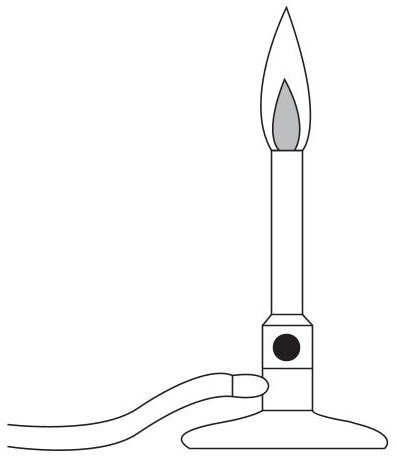

(a) During combustion, methane reacts with a gas in the air. Give the name of this gas.
(b) Give the two products of the complete combustion of methane.
(c) During the incomplete combustion of methane, carbon monoxide forms.
(i) Give a reason why carbon monoxide forms during incomplete combustion.
(ii) State why carbon monoxide is poisonous.
(d) The equation shows the reaction of methane with bromine.
$$
\mathrm {C H} _ {4} + \mathrm {B r} _ {2} \rightarrow \mathrm {C H} _ {3} \mathrm {B r} + \mathrm {H B r}
$$
Give the name of this type of chemical reaction.
(Total for Question 2 = 6 marks)

## BLANK PAGE
3 This question is about elements, mixtures and compounds.
(a) The box gives some methods used to separate mixtures.
<table border="1"><tr><td></td><td>crystallisation</td><td>filtration</td></tr><tr><td></td><td>fractional distillation</td><td>simple distillation</td></tr></table>
Choose methods from the box to answer these questions.
(i) Identify a method to remove sand from a mixture of sand and seawater.
(ii) Identify a method to separate a mixture of liquids with different boiling points.
(b) The diagram shows part of the structure of silicon dioxide.

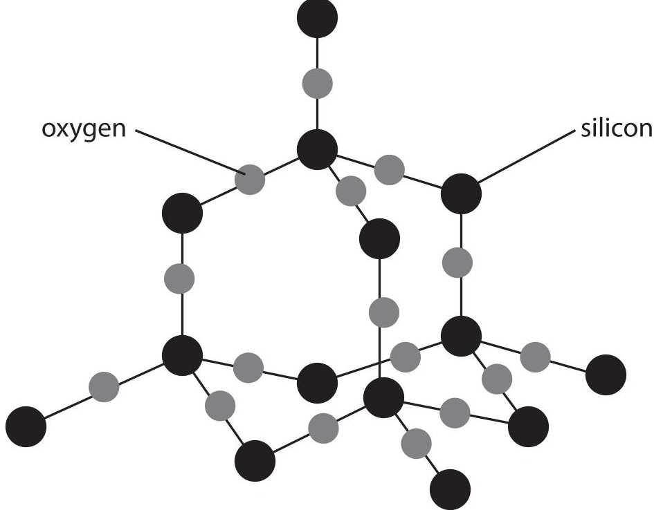

Explain why silicon dioxide is a compound.

(2) 

(c) The molecular formula of the compound insulin is $ C_{2 5 7} H_{3 8 3} N_{6 5} O_{7 7} S_{6} $
(i) Determine the number of different elements in $ C_{2 5 7} H_{3 8 3} N_{6 5} O_{7 7} S_{6} $
(ii) Determine the number of atoms in a molecule of $ C_{2 5 7} H_{3 8 3} N_{6 5} O_{7 7} S_{6} $
## (d) Magnalium is a mixture of magnesium atoms and aluminium atoms.
The diagram shows a sample of magnalium.

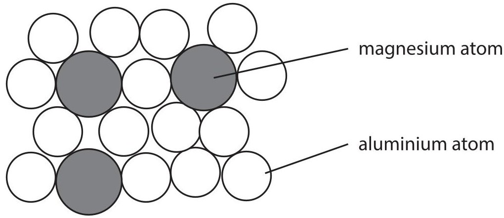

Calculate the percentage of magnesium atoms in this sample.
4 This question is about the alkali metals.
A teacher demonstrates the reaction between sodium and water.
The teacher fills a trough with water and then adds a piece of sodium.

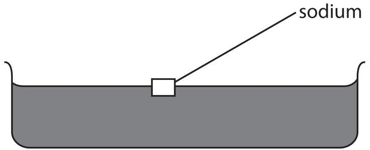

(a) The sodium reacts with the water, forming bubbles of hydrogen gas and a colourless solution.
State two other observations that would be made.
(b) Give a test to show that, at the end of the reaction, the solution contains sodium ions.
(c) Lithium, sodium and potassium react in a similar way when added to water.
(i) State, with reference to the electronic configurations of atoms, why these elements have similar reactions.
(ii) The table shows the atomic radius of a lithium atom, a sodium atom and a potassium atom.
<table border="1"><tr><td>Atom</td><td>Atomic radius in cm</td></tr><tr><td>lithium</td><td>$1.82\times10^{-12}$</td></tr><tr><td>sodium</td><td>$2.27\times10^{-12}$</td></tr><tr><td>potassium</td><td>$2.80\times10^{-12}$</td></tr></table>
Deduce the relationship between the atomic radius and the reactivity of the metals.

(Total for Question 4 = 6 marks)

5 Chromatography is used to separate the components in a mixture.
(a) Diagram 1 shows the apparatus used to separate the different dyes in a food colouring.

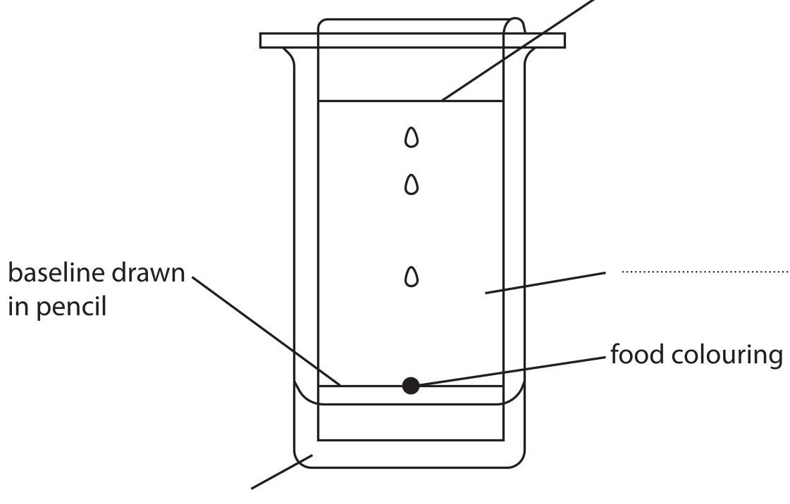

## Diagram 1
(i) Complete the diagram by adding the missing labels.
(ii) Give a reason why the baseline is drawn in pencil.
(b) Diagram 2 shows a chromatogram produced from four different food colourings, W, X, Y and Z.

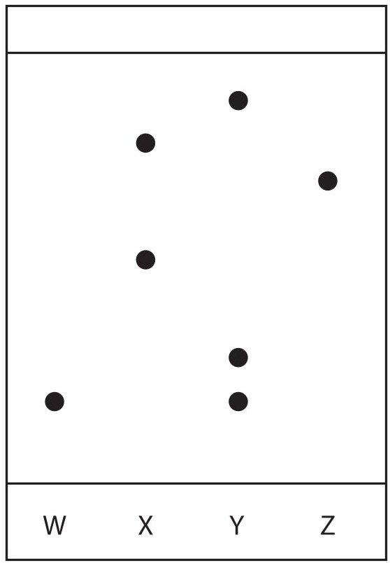

Diagram 2

(i) Which two food colourings contain the same dye?
A W and X

(1) 

B W and Y
X and Z C
D Y and Z
(ii) Calculate the $ R_{\mathrm{f}} $ value of the dye in food colouring W.
6 A student uses this apparatus to find the heat energy released by the combustion of liquid fuels.

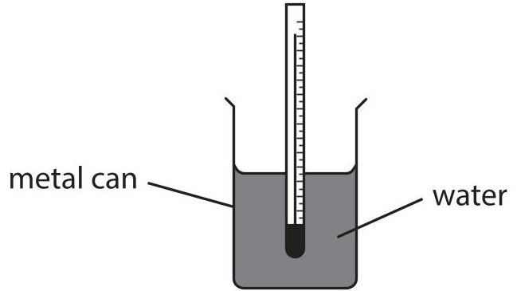

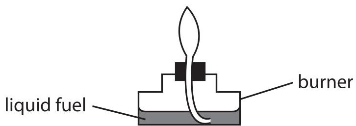

(a) Explain what is meant by the term fuel.
(b) (i) In one experiment, the student uses liquid ethanol as the fuel.
The thermometer shows the temperature of the water at the start of the experiment.

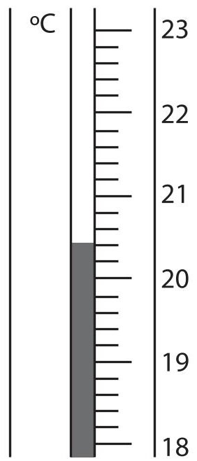

Complete the table by giving the temperatures to the nearest 0.1 $ ^{\circ} \mathrm{C}. $
<table border="1"><tr><td>temperature of the water at the start in $ ^{\circ} \mathrm{C} $</td><td></td></tr><tr><td>highest temperature reached in $ ^{\circ} \mathrm{C} $</td><td></td></tr><tr><td>temperature rise in $ ^{\circ} \mathrm{C} $</td><td>57.2</td></tr></table>
(ii) The metal can contains water of mass 150 g.
Show, by calculation, that the heat energy change (Q) for this reaction is approximately 36000 J.
[for water, c=4.2 J/g/ $ ^{\circ} \mathrm{C} $]
(iii) In the experiment, 2.3 g of ethanol $ ( M_{\mathrm{r}}=4 6) $ is burned.
Calculate the molar enthalpy change $ (\Delta H) $ , in kJ/mol, for the combustion of ethanol, $ \mathrm{C_{2} H_{5} O H} $
Include a sign in your answer.
Give your answer to two significant figures.
(c) In this experiment, the calculated value of $ \Delta H $ is less than the value given in a data book.
Give a possible reason for the difference in values.
(Total for Question 6 = 11 marks)
7 A student uses this apparatus to investigate the rate of reaction between dilute sulfuric acid and an excess of small pieces of zinc.

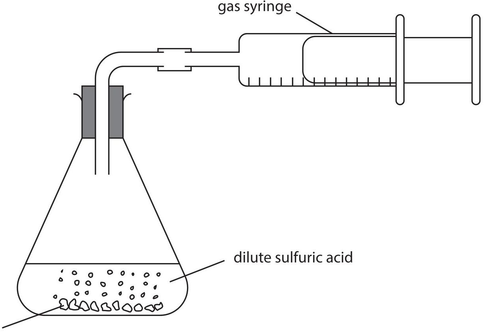

This is the student's method.
Step 1 use 50 $ cm^{3} $ of dilute sulfuric acid
Step 2 add approximately 5 g of small zinc pieces to the sulfuric acid
Step 3 quickly connect the gas syringe
Step 4 record the reading on the gas syringe every 30 seconds until the reaction stops
(a) (i) Name a suitable piece of apparatus to measure the volume of sulfuric acid.
(ii) Give a reason why the mass of zinc pieces does not need to be measured accurately.
(iii) Give a reason why the student quickly connects the gas syringe in step 3.

(iv) State how the student would know when the reaction stops.
(b) The graph shows the volume of gas collected in the syringe during the experiment.

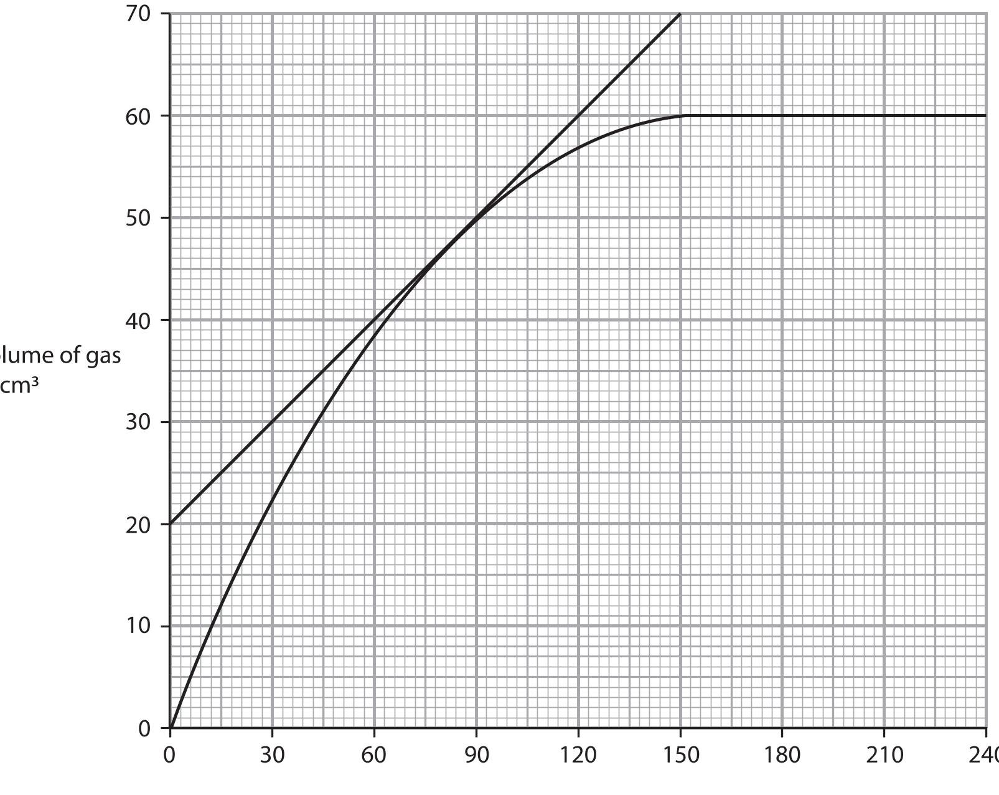

Time in s

(i) A tangent to the curve has been drawn at a time of 80 s.
Use the tangent to calculate the rate of reaction at 80 s.
Show your working on the graph.
Give the unit.

(3) 

(ii) Explain the shape of the graph in these regions.
(6) 
from 0s to 60s
from 60s to 150s
from 150s to 240s
## (Total for Question 7 = 13 marks)

8 This question is about crude oil.
(a) Describe how crude oil is separated into fractions by fractional distillation.
(b) Some of the products of fractional distillation are then cracked.
This equation represents a reaction that occurs during cracking.
$$
\mathrm {C} _ {1 5} \mathrm {H} _ {3 2} \rightarrow \mathrm {C} _ {8} \mathrm {H} _ {1 8} + \mathrm {C} _ {3} \mathrm {H} _ {6} + 2 \mathrm {C} _ {2} \mathrm {H} _ {4}
$$
Explain why cracking is an important process in the oil industry.
(c) Fuels obtained from crude oil may contain impurities.
Explain how an impurity found in fuels can cause an environmental problem.
9 (a) The table shows the formulae of some positive and negative ions, and the formulae of some compounds containing these ions.
<table border="1"><tr><td></td><td>$Cl^{-}$</td><td>$O^{2-}$</td><td>$SO_{4}^{2-}$</td></tr><tr><td>$Na^{+}$</td><td></td><td>$Na_{2}O$</td><td>$Na_{2}SO_{4}$</td></tr><tr><td>$NH_{4}^{+}$</td><td>$NH_{4}Cl$</td><td></td><td></td></tr><tr><td>$Zn^{2+}$</td><td>$ZnCl_{2}$</td><td></td><td>$ZnSO_{4}$</td></tr></table>
(i) Complete the table by giving the formulae of the missing compounds.
(ii) Give the name of the compound with the formula $ \mathrm{Z n S O_{4}} $
(b) Hydrogen chloride and magnesium chloride have different types of bonding and have different structures.
(i) Complete the dot-and-cross diagram to show the outer shell electrons in a molecule of hydrogen chloride.

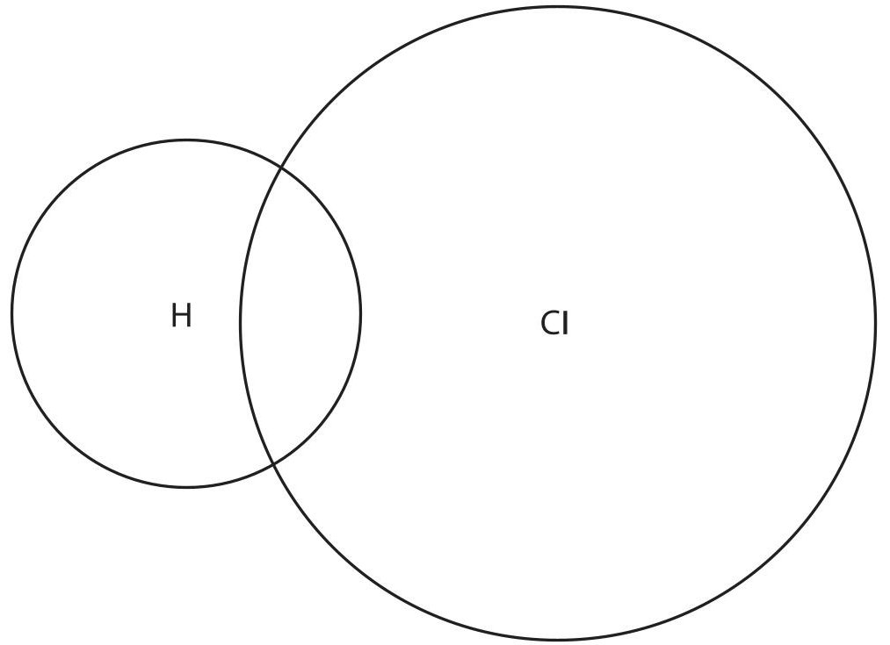

(ii) The diagram shows the electronic configuration of a magnesium atom and of a chlorine atom.

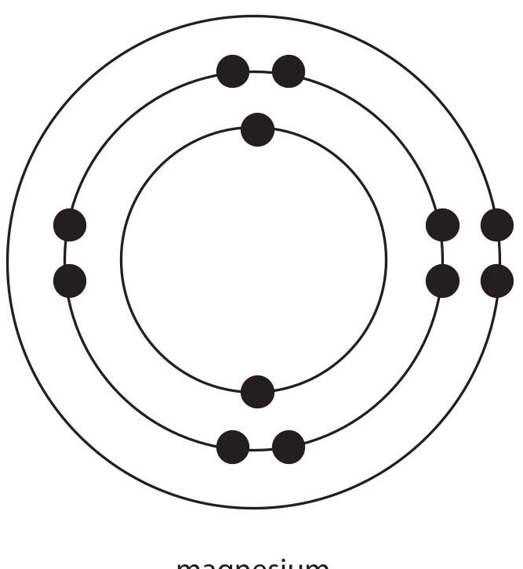

magnesium

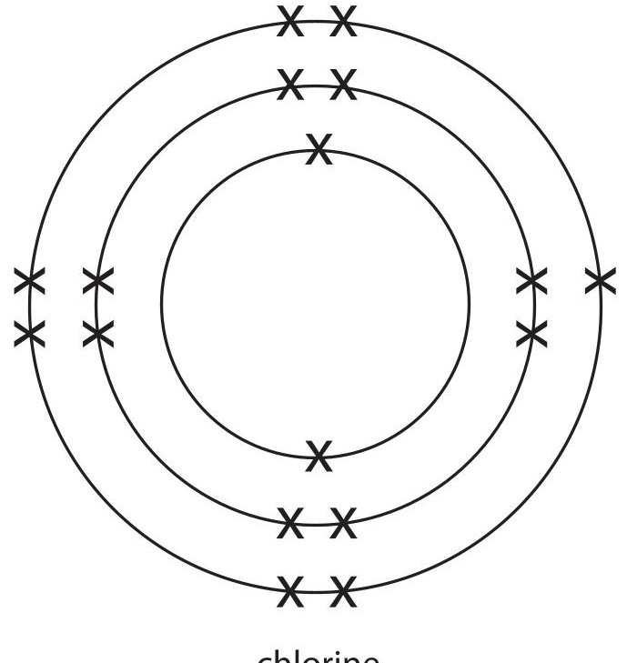

chlorine
Draw the electronic configuration of a magnesium ion and of a chloride ion in the boxes.
Show the charge on each ion.

(3) 

magnesium ion
chloride ion

(iii) Explain why magnesium chloride has a much higher melting point than hydrogen chloride.
Refer to structure and bonding in your answer.
## (Total for Question 9 = 14 marks)
## BLANK PAGE
10 This is the equation for the decomposition of hydrogen peroxide.
$$
2 \mathrm {H} _ {2} \mathrm {O} _ {2} (\mathrm {a q}) \rightarrow 2 \mathrm {H} _ {2} \mathrm {O} (\mathrm {I}) + \mathrm {O} _ {2} (\mathrm {g})
$$
The rate of reaction increases when a catalyst of manganese(IV) oxide is added.
(a) Describe how a catalyst increases the rate of a reaction.
(b) A student adds $ 5 0 \mathrm{c m}^{3} $ of hydrogen peroxide solution to a glass container and then adds 1.0 g of manganese(IV) oxide.
The diagram shows the apparatus the student uses.

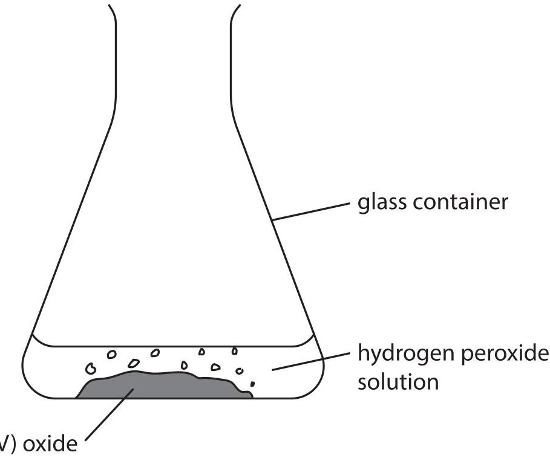

(i) Name the glass container the student uses.
(ii) The student waits until the hydrogen peroxide solution completely decomposes.
Describe how the student could then show that the manganese(IV) oxide was a catalyst and not a reactant.
(Total for Question 10 = 6 marks)
11 Diamond and graphite are both forms of the element carbon. Diamond and graphite both have covalent bonds and giant covalent structures. The diagram represents the structure of diamond and the structure of graphite.

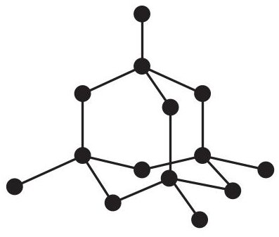

diamond

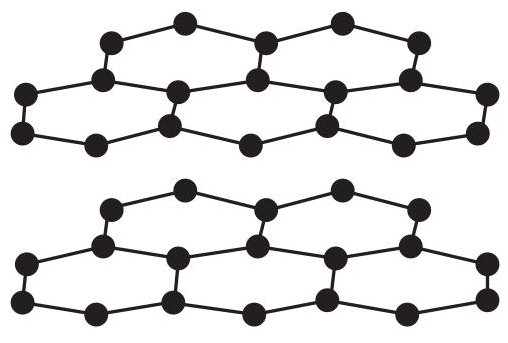

graphite
(a) Give a reason why diamond is an element.

(1) 

(b) Describe the forces of attraction in a covalent bond.
(c) (i) Explain why graphite conducts electricity.
(ii) Explain why diamond is hard but graphite is soft.
d) Another form of carbon has molecules with the formula $ C_{x} $ x represents the number of carbon atoms in each molecule. Each molecule of $ C_{x} $ has a mass of $ 1.40\times10^{-21} \mathrm{~g}。 $ One mole of $ C_{x} $ contains $ 6.02\times10^{23} $ molecules. Calculate the $ M_{r} $ of $ C_{x} $ and the value of x [for carbon, $ A_{r}=12] $
12 This question is about the metal tantalum, Ta.
Tantalum metal can be produced by heating tantalum chloride $ \mathrm{TaCl_{5}} $ and hydrogen gas in a furnace.
The other product of the reaction is hydrogen chloride.
(a) Complete the equation for the reaction.
$ \mathrm{T a C l}_{5} ( \mathrm{s} )+\mathrm{H}_{2} ( \mathrm{g} )\rightarrow\mathrm{T a} ( \mathrm{s} )+\mathrm{H C I} ( \mathrm{g} ) $
(b) As tantalum chloride is heated,the mass of solid in the furnace decreases leaving tantalum as the only solid product.
The table shows the mass of solid in the furnace at one-hour intervals.
<table border="1"><tr><td>Time in hours</td><td>Mass of solid in the furnace in kg</td></tr><tr><td>0</td><td>2510</td></tr><tr><td>1</td><td>2207</td></tr><tr><td>2</td><td>1960</td></tr><tr><td>3</td><td>1506</td></tr><tr><td>4</td><td>1329</td></tr><tr><td>5</td><td>1267</td></tr><tr><td>6</td><td>1267</td></tr><tr><td>7</td><td>1267</td></tr></table>
(i) State how the data in the table shows that the reaction is complete.
(ii) Use the data to show that the formula of tantalum chloride is $ \mathrm{TaCl}_{5} $ [for tantalum, $ A_{\mathrm{r}}=181 $ for chlorine, $ A_{\mathrm{r}}=35.5 $]
(c) Another method of extracting tantalum is by reacting tantalum(V) oxide with carbon.
This is the equation for the reaction.
$$
\mathrm {T a} _ {2} \mathrm {O} _ {5} (\mathrm {s}) + 5 \mathrm {C} (\mathrm {s}) \rightarrow 2 \mathrm {T a} (\mathrm {s}) + 5 \mathrm {C O} (\mathrm {g})
$$
(i) Explain why this is a redox reaction.
(ii) 2000 mol of tantalum(V) oxide is heated with 500000 g of carbon. Show by calculation that the carbon is in excess. [for carbon, $ A_{\mathrm{r}}=1 2 $]
(iii) Calculate the maximum mass, in grams, of tantalum that can be obtained from 2000 mol of tantalum(V) oxide. [for tantalum, $ A_{\mathrm{r}}=1 8 1 $]
(Total for Question 12 = 11 marks)
TOTAL FOR PAPER = 110 MARKS
