<table><tr><td colspan="3">Please check the examination details below before entering your candidate information</td></tr><tr><td colspan="2">Candidate surname</td><td>Other names</td></tr><tr><td>Centre Number</td><td colspan="2">Candidate Number</td></tr><tr><td colspan="3">Pearson Edexcel International GCSE (9-1)</td></tr><tr><td colspan="3">Friday 17 May 2024</td></tr><tr><td colspan="2">Morning (Time: 2 hours)</td><td>Paper reference 4CH1/1C 4SD0/1C</td></tr><tr><td colspan="3">Chemistry
UNIT: 4CH1
Science (Double Award) 4CH1/4SD0
PAPER: 1C</td></tr><tr><td colspan="3">You must have:
Calculator, ruler</td></tr><tr><td colspan="3">Total Marks</td></tr></table>

## Instructions

- Use black ink or ball-point pen.

- Fill in the boxes at the top of this page with your name, centre number and candidate number.

- Answer all questions.

- Answer the questions in the spaces provided

- there may be more space than you need.

- Show all the steps in any calculations and state the units.

## Information

- The total mark for this paper is 110.

- The marks for each question are shown in brackets

- use this as a guide as to how much time to spend on each question.

## Advice

- Read each question carefully before you start to answer it.

- Write your answers neatly and in good English.

- Try to answer every question.

- Check your answers if you have time at the end.

Turn over

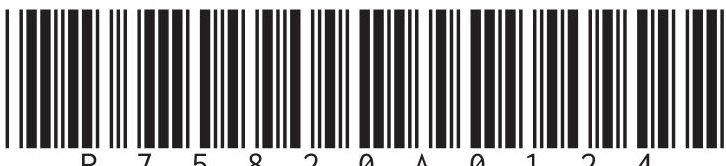

<table border="1"><tr><td>7Li lithium3</td><td>9Be beryllium4</td><td colspan="12">Key</td><td>4He helium2</td></tr><tr><td>23Na sodium11</td><td>24Mg magnesium12</td><td colspan="12">relative atomic mass atomic symbol atomic (proton) number</td><td>20Ne neon10</td></tr><tr><td>39K potassium19</td><td>40Ca calcium20</td><td>45Sc scandium21</td><td>48Ti titanium22</td><td>51V vanadium23</td><td>52Cr chromium24</td><td>55Mn manganese25</td><td>56Fe iron26</td><td>59Co cobalt27</td><td>59Ni nickel28</td><td>63.5Cu copper29</td><td>65Zn zinc30</td><td>70Ga gallium31</td><td>73Ge germanium32</td><td>75As arsenic33</td><td>79Se selenium34</td><td>80Br bromine35</td><td>84Kr krypton36</td></tr><tr><td>85Rb rubidium37</td><td>88Sr strontium38</td><td>89Y yttrium39</td><td>91Zr zirconium40</td><td>93Nb niobium41</td><td>96Mo molybdenum42</td><td>[98]Tc technetium43</td><td>101Ru ruthenium44</td><td>103Rh rhodium45</td><td>106Pd palladium46</td><td>108Ag silver47</td><td>112Cd cadmium48</td><td>115In indium49</td><td>119Sn tin50</td><td>122Sb antimony51</td><td>128Te tellurium52</td><td>127I iodine53</td><td>131Xe xenon54</td></tr><tr><td>133Cs caesium55</td><td>137Ba barium56</td><td>139La* lanthanum57</td><td>178Hf hafnium72</td><td>181Ta tantalum73</td><td>184W tungsten74</td><td>186Re rhenium75</td><td>190Os osmium76</td><td>192Ir iridium77</td><td>195Pt platinum78</td><td>197Au gold79</td><td>201Hg mercury80</td><td>204Tl thallium81</td><td>207Pb lead82</td><td>209Bi bismuth83</td><td>[209]Po polonium84</td><td>[210]At astatine85</td><td>[222]Rn radon86</td></tr><tr><td>[223]Fr francium87</td><td>[226]Ra radium88</td><td>[227]Ac* actinium89</td><td>[261]Rf rutherfordium104</td><td>[262]Db dubnium105</td><td>[266]Sg seaborgium106</td><td>[264]Bh bohrium107</td><td>[277]Hs hassium108</td><td>[268]Mt meitnerium109</td><td>[271]Ds darmstadium110</td><td>[272]Rg roentgenium111</td><td colspan="6">Elements with atomic numbers 112-116 have been reported but not fully authenticated</td></tr></table>

$ ^{*} $ The lanthanoids (atomic numbers 58-71) and the actinoids (atomic numbers 90-103) have been omitted.

The relative atomic masses of copper and chlorine have not been rounded to the nearest whole number.

## Answer ALL questions.

Some questions must be answered with a cross in a box. If you change your mind about an answer, put a line through the box and then mark your new answer with a cross.

1 The box gives the names of some substances.

<table border="1"><tr><td>bromine</td><td>chlorine</td><td>diamond</td><td>ethene</td></tr><tr><td>iodine</td><td>lithium</td><td>methane</td><td>water</td></tr></table>

(a) Complete the table by choosing a substance from the box that matches each description.

Each substance may be used once, more than once or not at all.

<table border="1"><tr><td>Description</td><td>Substance</td></tr><tr><td>a good conductor of electricity</td><td></td></tr><tr><td>an element that is a liquid at room temperature</td><td></td></tr><tr><td>a substance that can be used to form a polymer</td><td></td></tr><tr><td>an element that forms a basic oxide</td><td></td></tr><tr><td>a substance that has a giant covalent structure</td><td></td></tr></table>

(b) Describe a test for chlorine.

(2) 

2 This question is about the reactivities of metals.

(a) The table shows the reactions of four metals, P, Q, R and S, with water and with dilute hydrochloric acid.

The letters are not the symbols of the elements.

<table border="1"><tr><td>Metal</td><td>Reaction with water</td><td>Reaction with dilute hydrochloric acid</td></tr><tr><td>P</td><td>no reaction</td><td>no reaction</td></tr><tr><td>Q</td><td>very fast reaction</td><td>(not done)</td></tr><tr><td>R</td><td>no reaction</td><td>slow reaction</td></tr><tr><td>S</td><td>slow reaction</td><td>fast reaction</td></tr></table>

(i) Deduce the order of reactivity of the metals.

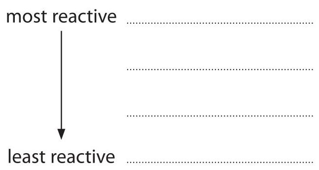

(ii) Give the letter of the metal that could be zinc.

(iii) Give a word equation for the reaction between aluminium and hydrochloric acid.

(iv) Give the name of a metal that could be P.

(v) Give a reason why the reaction of Q with dilute hydrochloric acid is not done.

(b) The diagram shows the apparatus used to demonstrate the reaction between aluminium and iron(III) oxide.

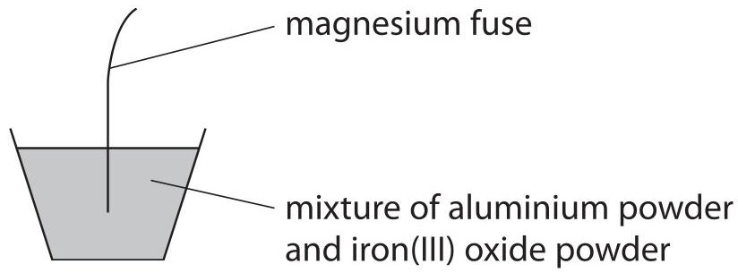

When the magnesium fuse is lit, a very exothermic reaction occurs.

This is the equation for the reaction.

$$
\mathrm {F e} _ {2} \mathrm {O} _ {3} + 2 \mathrm {A I} \rightarrow 2 \mathrm {F e} + \mathrm {A I} _ {2} \mathrm {O} _ {3}
$$

(i) State what is meant by the term exothermic.

(ii) State why aluminium displaces iron.

(iii) Explain why this reaction is a redox reaction.

(Total for Question 2 = 9 marks)

3 The diagram represents an atom of element Z.

Z is not the symbol of the element.

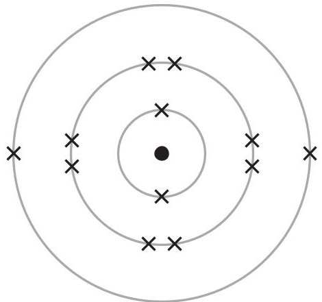

(a) (i) Give the number of the group to which element Z belongs.

(ii) Give the number of the period to which element Z belongs.

(iii) Give the formula of the compound that forms when Z reacts with fluorine.

(b) One mole of Z contains $ 6. 0 \times1 0^{2 3} $ atoms.

Calculate the number of electrons in one mole of atoms of element Z.

Give your answer in standard form.

number of electrons=

(c) A sample of element Z contains three isotopes. The table shows the numbers of particles in the nucleus of each isotope and the percentage abundance of each isotope.

<table border="1"><tr><td>Isotope</td><td>Number of protons</td><td>Number of neutrons</td><td>Percentage abundance</td></tr><tr><td>1</td><td>12</td><td>12</td><td>79.0</td></tr><tr><td>2</td><td>12</td><td>13</td><td>10.0</td></tr><tr><td>3</td><td>12</td><td>14</td><td>11.0</td></tr></table>

Use the information in the table to calculate the relative atomic mass $ ( A_{r} ) $ of element Z.

Give your answer to one decimal place.

(d) Deduce the name of element Z.

(Total for Question 3 = 10 marks)

4 Caffeine is a stimulant found in coffee, tea and some soft drinks.

(a) The molecular formula of caffeine is $ \mathrm{C_{8} H_{10} N_{4}O_{2}} $

(i) Determine the number of atoms in one molecule of caffeine.

(ii) Calculate the relative formula mass $ ( M_{r} ) $ of caffeine.

$$
M _ {\mathrm {r}} =
$$

(iii) Give the empirical formula for caffeine.

(b) Ethanol can be obtained from a solution of caffeine in ethanol using this apparatus.

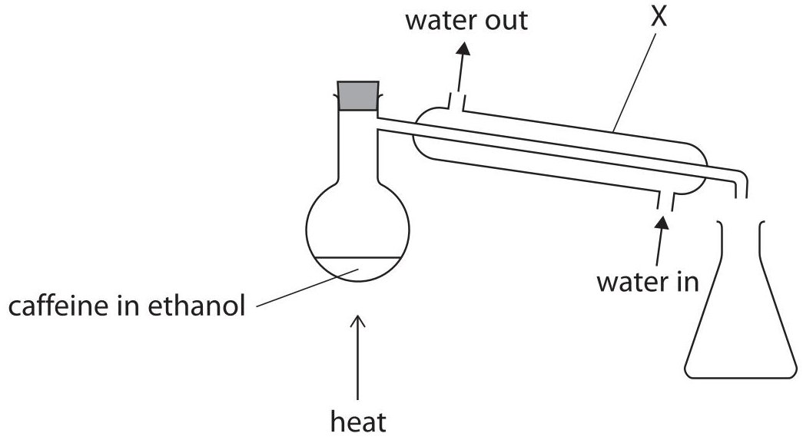

(i) Give the name of the method of separation shown in the diagram.

(ii) Describe what happens to the ethanol vapour in apparatus X.

(c) Calcium bromide is an ionic compound.

The table shows the formulae and melting points of caffeine and calcium bromide.

<table border="1"><tr><td>Name</td><td>Formula</td><td>Melting point in℃</td></tr><tr><td>caffeine</td><td>C8H10N4O2</td><td>235</td></tr><tr><td>calcium bromide</td><td>CaBr2</td><td>730</td></tr></table>

The relative formula mass of calcium bromide is similar to the relative formula mass of caffeine.

Explain why calcium bromide has a much higher melting point than caffeine.

5 A student uses paper chromatography in an experiment to separate the dyes in four different felt tip pens, E, F, G and H.

The diagram shows the appearance of the paper before and after the experiment.

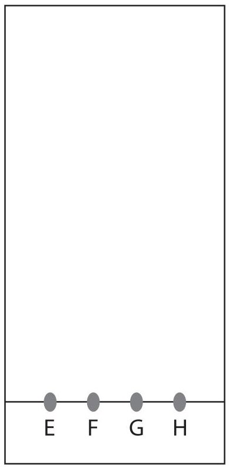

before

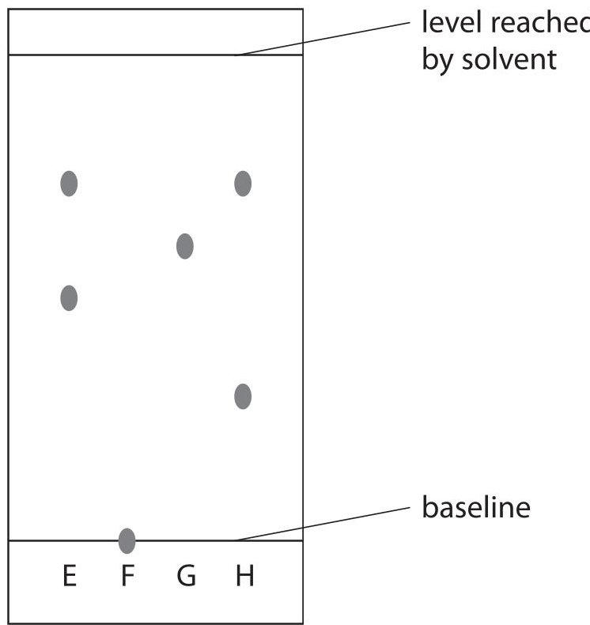

after

(a) (i) The chromatography paper is placed in a solvent. Explain why the spots on the baseline are placed above the level of the solvent.

(2) 

(ii) Explain which two felt tip pens contain the same dye.

(2) 

(iii) The student thought that both F and G contained only one dye.

Explain why the student can only be certain about one of these dyes.

(b) Calculate the $ R_{f} $ value for the dye in G. Show your working.

6 This question is about some Group 1 elements and their compounds.

(a) A teacher adds a small piece of sodium to a trough of water.

(i) Give two observations that are made when sodium reacts with water.

(ii) After the reaction has stopped, the teacher adds a few drops of phenolphthalein to the solution in the trough.

Explain the colour of the phenolphthalein after it is added to the solution.

(b) A student does a flame test to see if a white solid contains lithium ions. They clean a platinum wire before using it for the flame test.

(i) Explain why the student needs to clean the platinum wire.

(ii) What is the colour of the flame if the solid contains lithium ions?

A lilac

B orange

C red

D yellow

(c) Potassium aluminium sulfate can be used in baking.

Anhydrous potassium aluminium sulfate has the formula $ \mathrm{K A I} \left( \mathrm{S O}_{4} \right)_{2} $

(i) Give the formula of each ion in potassium aluminium sulfate.

potassium ion

aluminium ion

sulfate ion

(ii) Potassium aluminium sulfate is normally found as a hydrated salt, with the formula $ \mathrm{K A I ( S O_{4} )_{2}. x H_{2} O} $

When 23.7 g of the hydrated salt is heated to remove all the water, 12.9 g of the anhydrous salt is formed.

Calculate the value of x.

$$
[ \mathrm {f o r K A I} \left(\mathrm {S O} _ {4}\right) _ {2}, M _ {\mathrm {r}} = 2 5 8 \quad \mathrm {f o r H} _ {2} \mathrm {O}, M _ {\mathrm {r}} = 1 8 ]
$$

7 This question is about nitrogen and its compounds.

(a) What is the approximate percentage by volume of nitrogen in the atmosphere?

A 1%

B 20%

C 70%

D 80%

(b) Complete the dot-and-cross diagram for a molecule of nitrogen. Show outer electrons only.

## N N

(c) Nitrogen dioxide produced in car engines reacts with water vapour and oxygen in the atmosphere to form nitric acid.

(i) Give a chemical equation for this reaction.

(ii) Nitric acid forms acid rain.

State one environmental effect of acid rain.

(d) Ammonium carbonate contains nitrogen.

(i) What is the formula of ammonium carbonate?

A $ \mathrm{N H_{3} C O_{3}} $

B $ \mathrm{(N H_{3})_{2} C O_{3}} $

C $ \mathrm{N H_{4} C O_{3}} $

D $ \mathrm{(N H_{4})_{2} C O_{3}} $

(ii) A technician finds an unlabelled bottle on a shelf that could be ammonium carbonate solution.

Describe tests that the technician should do to confirm that the solution contains ammonium ions and carbonate ions.

8 This question is about hydrocarbons.

(a) The molecular formula $ \mathrm{C_{4} H_{8}} $ represents all the isomers of an alkene.

(i) Explain what is meant by the term isomers.

(ii) The displayed formula of one of the isomers of the alkene is shown.

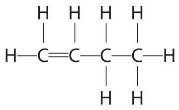

Draw displayed formulae for two other alkene isomers with the molecular formula $ \mathrm{C_{4} H_{8}} $

(2) 

<table border="1"><tr><td>alkene isomer 1</td><td>alkene isomer 2</td></tr><tr><td></td><td></td></tr></table>

(b) But-1-ene reacts with bromine to form a compound with molecular formula $ \mathrm{C_{4}H_{8}Br_{2}} $

What is the name given to this type of reaction?

A addition

(1) 

B combustion

decomposition

D substitution

(c) The alkene $ \mathrm{C}_{3} \mathrm{H}_{6} $ can be polymerised to form the polymer poly(propene).

(i) Draw the repeat unit of poly(propene).

(ii) These are two methods for disposing of polymers such as poly(propene) method 1 burying them in landfill sites method 2 burning them to release heat energy State one environmental problem linked to each of these methods of disposal. (2) method 1

method 2

(d) Complete combustion of one mole of an alkane produces 396 g of carbon dioxide and 180 g of water.

This is the equation for the reaction.

$$
\mathrm {a l k a n e} + \mathrm {x O} _ {2} \rightarrow \mathrm {y C O} _ {2} + \mathrm {z H} _ {2} \mathrm {O}
$$

Calculate the values of x,y and z.

$$
[ \mathrm {f o r C O} _ {2}, M _ {\mathrm {r}} = 4 4 \qquad \mathrm {f o r H} _ {2} \mathrm {O}, M _ {\mathrm {r}} = 1 8 ]
$$

(e) In a petrol engine, incomplete combustion occurs because there is a limited supply of oxygen.

(i) Petrol contains octane, $ C_{8} H_{1 8} $

Complete the equation for this reaction, including state symbols.

$$
\mathrm {C} _ {8} \mathrm {H} _ {1 8} (\mathrm {I}) + \dots \dots \dots \mathrm {O} _ {2} (\dots \dots \dots) \rightarrow \dots \dots \dots \mathrm {C O} (\dots \dots \dots) + 3 \mathrm {C} (\dots \dots \dots) + \dots \dots \dots \mathrm {H} _ {2} \mathrm {O} (\dots \dots \dots)
$$

(ii) Explain one problem for humans caused by a product of this incomplete combustion.

(Total for Question 8 = 15 marks)

9 A student uses this apparatus to investigate the rate of reaction between marble chips and dilute hydrochloric acid.

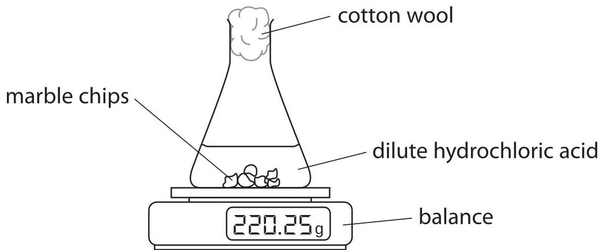

This is the equation for the reaction.

(a) During the reaction the reading on the balance decreases because mass is lost from the flask.

$$
\mathrm {C a C O} _ {3} + 2 \mathrm {H C l} \rightarrow \mathrm {C a C l} _ {2} + \mathrm {H} _ {2} \mathrm {O} + \mathrm {C O} _ {2}
$$

(i) State why mass is lost from the flask.

(ii) State the purpose of the cotton wool.

(b) This is a graph of the student's results.

Loss in mass in g

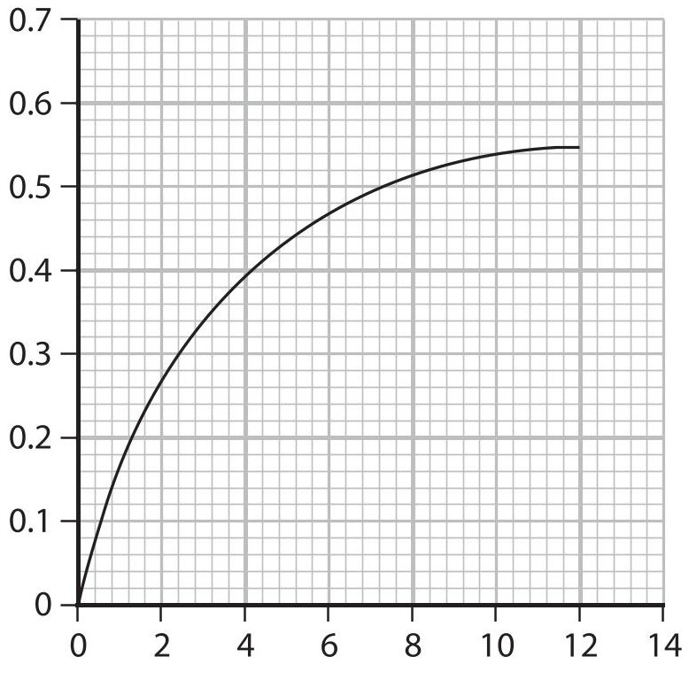

Time in minutes

(i) Explain the shape of the graph.

You should assume that the marble chips are in excess.

(4) 

(ii) On the grid, draw the curve you would expect to obtain if the student uses the same volume of hydrochloric acid but with half the concentration.

Assume that all other conditions are kept the same.

(c) The student repeats the experiment using the same mass of smaller marble chips.

Explain, using particle collision theory, how using smaller marble chips would affect the rate of this reaction.

Assume that all other conditions are kept the same as in the initial experiment.

(Total for Question 9 = 11 marks)

10 A student investigates the reaction between magnesium and nitric acid. The student uses this method.

- add $ 4 0 \mathrm{c m}^{3} $ of dilute nitric acid to a glass beaker

- record the temperature of the acid

- find the mass of a strip of magnesium ribbon

- add the magnesium ribbon to the nitric acid

- when all the magnesium has reacted, record the highest temperature reached

(a) Complete the chemical equation for this reaction.

$$
\mathrm {M g} + 2 \mathrm {H N O} _ {3} \rightarrow
$$

(b) The thermometer shows the highest temperature reached.

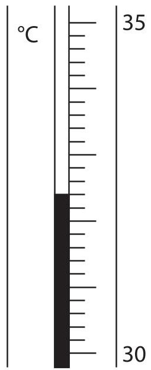

Complete the table by giving the temperatures to the nearest 0.1 $ ^{\circ} \mathrm{C} $

<table border="1"><tr><td>starting temperature of the acid in $ ^{\circ} \mathrm{C} $</td><td></td></tr><tr><td>highest temperature reached in $ ^{\circ} \mathrm{C} $</td><td></td></tr><tr><td>temperature rise in $ ^{\circ} \mathrm{C} $</td><td>16.4</td></tr></table>

(c) (i) Show that the heat energy change (Q) for this reaction is about 2800 J. [for $ 1. 0 \mathrm{c m}^{3} $ of solution, mass = 1.0 g] [for the solution, c = 4.2 J/g/ $ ^{\circ} C $]

(ii) The mass of magnesium used by the student was 0.12 g.

Calculate the value of the enthalpy change $ (\Delta H) $ , in kJ/mol, for the magnesium reacting with nitric acid.

Give your answer to two significant figures, including a sign in your answer.

$$
\Delta H =
$$

(d) Explain why using a polystyrene cup, instead of a glass beaker, would give a more accurate result.

(Total for Question 10 = 11 marks)

TOTAL FOR PAPER=110 MARKS

## BLANK PAGE

