<table><tr><td colspan="2">Write your name here</td></tr><tr><td>Surname</td><td>Other names</td></tr><tr><td>Centre Number</td><td>Candidate Number</td></tr><tr><td colspan="2">Pearson Edexcel
International GCSE (9 - 1)</td></tr><tr><td colspan="2">Chemistry
Paper 1</td></tr><tr><td colspan="2">Sample Assessment Materials for first teaching September 2017
Time: 2 hours</td><td>Paper Reference
4CH1/1C
4SD0/1C</td></tr><tr><td colspan="2">You must have:
Calculator, ruler</td><td>Total Marks</td></tr></table>

## Instructions

- Use black ink or ball-point pen.

- Fill in the boxes at the top of this page with your name, centre number and candidate number.

- Answer all questions.

- Answer the questions in the spaces provided

- there may be more space than you need.

- Calculators may be used.

- Some questions must be answered with a cross in a box. If you change your mind about an answer, put a line through the box and then mark your new answer with a cross.

## Information

- The total mark for this paper is 110.

- The marks for each question are shown in brackets

- use this as a guide as to how much time to spend on each question.

## Advice

- Read each question carefully before you start to answer it.

- Try to answer every question.

- Check your answers if you have time at the end.

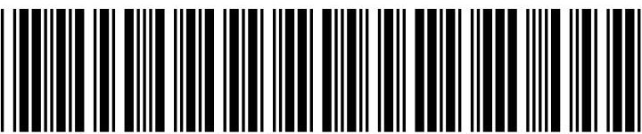

<table border="1"><tr><td>7Li lithium3</td><td>9Be beryllium4</td><td colspan="12">Key</td><td>4He helium2</td></tr><tr><td>23Na sodium11</td><td>24Mg magnesium12</td><td colspan="12">relative atomic mass atomic symbol atomic (proton) number</td><td>20Ne neon10</td></tr><tr><td>39K potassium19</td><td>40Ca calcium20</td><td>45Sc scandium21</td><td>48Ti titanium22</td><td>51V vanadium23</td><td>52Cr chromium24</td><td>55Mn manganese25</td><td>56Fe iron26</td><td>59Co cobalt27</td><td>59Ni nickel28</td><td>63.5Cu copper29</td><td>65Zn zinc30</td><td>70Ga gallium31</td><td>73Ge germanium32</td><td>75As arsenic33</td><td>79Se selenium34</td><td>80Br bromine35</td><td>84Kr krypton36</td></tr><tr><td>85Rb rubidium37</td><td>88Sr strontium38</td><td>89Y yttrium39</td><td>91Zr zirconium40</td><td>93Nb niobium41</td><td>96Mo molybdenum42</td><td>[98]Tc technetium43</td><td>101Ru ruthenium44</td><td>103Rh rhodium45</td><td>106Pd palladium46</td><td>108Ag silver47</td><td>112Cd cadmium48</td><td>115In indium49</td><td>119Sn tin50</td><td>122Sb antimony51</td><td>128Te tellurium52</td><td>127I iodine53</td><td>131Xe xenon54</td></tr><tr><td>133Cs caesium55</td><td>137Ba barium56</td><td>139La* lanthanum57</td><td>178Hf hafnium72</td><td>181Ta tantalum73</td><td>184W tungsten74</td><td>186Re rhenium75</td><td>190Os osmium76</td><td>192Ir iridium77</td><td>195Pt platinum78</td><td>197Au gold79</td><td>201Hg mercury80</td><td>204Tl thallium81</td><td>207Pb lead82</td><td>209Bi bismuth83</td><td>[209]Po polonium84</td><td>[210]At astatine85</td><td>[222]Rn radon86</td></tr><tr><td>[223]Fr francium87</td><td>[226]Ra radium88</td><td>[227]Ac* actinium89</td><td>[261]Rf rutherfordium104</td><td>[262]Db dubnium105</td><td>[266]Sg seaborgium106</td><td>[264]Bh bohrium107</td><td>[277]Hs hassium108</td><td>[268]Mt meitnerium109</td><td>[271]Ds darmstadtium110</td><td>[272]Rg roentgenium111</td><td colspan="6">Elements with atomic numbers 112-116 have been reported but not fully authenticated</td></tr></table>

* The lanthanoids (atomic numbers 58-71) and the actinoids (atomic numbers 90-103) have been omitted.

The relative atomic masses of copper and chlorine have not been rounded to the nearest whole number.

## BLANK PAGE

## Answer ALL questions. Write your answers in the spaces provided.

1 The diagram shows the structure of an atom.

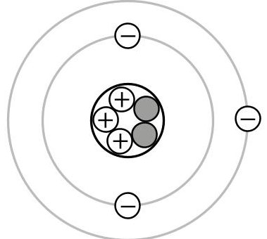

(a) Name the central part of an atom.

(b) Name the positively charged particles in an atom.

(c) State how the diagram shows that this atom is neutral.

(d) Give the mass number of this atom.

(e) Give the name of the element containing this atom. Use the Periodic Table to help you.

(Total for Question 1 = 5 marks)

## BLANK PAGE

2 Substances can be classified as elements, compounds or mixtures.

(a) Each of the boxes in the diagram represents either an element, a compound or a mixture.

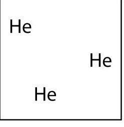

box1

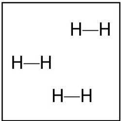

box2

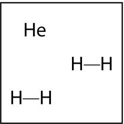

box3

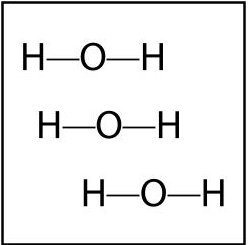

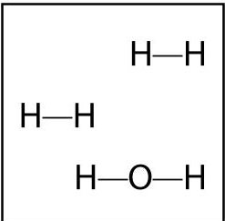

box4

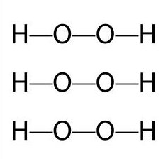

box5

box6

(i) Explain which two boxes represent an element.

(2) 

(ii) Explain which two boxes represent a mixture.

(b) The list gives the names of some methods used in the separation of mixtures:

- chromatography

- Use names from the list to choose a suitable method for each separation.

- crystallisation

- distillation

- Each name may be used once, more than once or not at all.

- filtration

(i) Separating water from sodium chloride solution.

(ii) Separating the blue dye from a mixture of blue and red dyes.

(iii) Separating potassium nitrate from potassium nitrate solution.

(Total for Question 2 = 7 marks)

3 Ammonium chloride decomposes in a reversible reaction. The equation for this reaction is

$$
\mathrm {N H} _ {4} \mathrm {C l} (\mathrm {s}) \rightleftharpoons \mathrm {N H} _ {3} (\mathrm {g}) + \mathrm {H C l} (\mathrm {g})
$$

(a) State how the equation shows that the reaction is reversible.

(b) Some ammonium chloride is heated gently in a test tube.

The diagram shows the test tube after it has been heated gently for a short time.

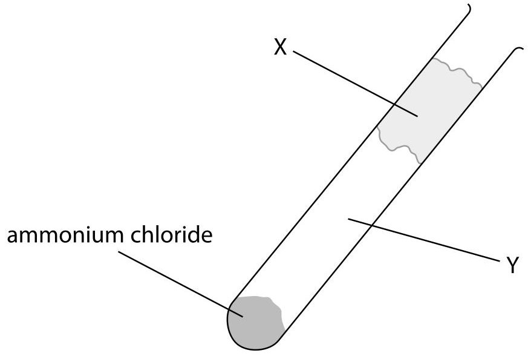

(i) Identify solid X and the two gases formed in region Y of the test tube.

Solid X.

Gases in region Y.

(ii) Which change of state occurs in the test tube during heating?

(1) 

A condensing

B evaporating

C melting

D subliming

(c) An experiment involving ammonium chloride can be used to show the process of diffusion.

The diagram shows the apparatus at the start of the experiment.

cotton wool soaked in concentrated ammonia solution

cotton wool soaked in concentrated hydrochloric acid

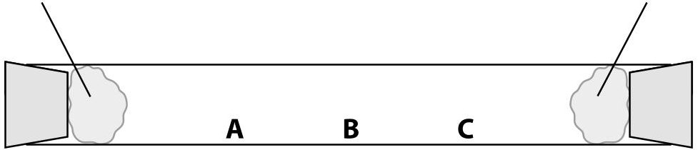

At the end of the experiment, a white solid forms in the test tube.

Explain which position, A, B or C, shows where the white solid forms.

(3) 

(Total for Question 3 = 7 marks)

4 The percentage by volume of oxygen in air can be found by using the rusting of iron.

A student sets up this apparatus to measure the volume of oxygen in a sample of air.

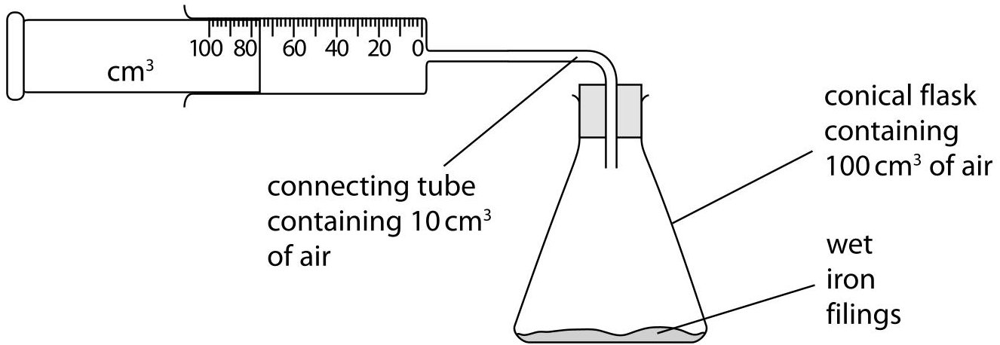

An excess of wet iron filings is used.

At the start of each experiment, the reading on the syringe is recorded and the apparatus is then left for a week so that the reaction is complete.

The reading on the syringe is then recorded again.

(a) The diagram shows the readings in one experiment.

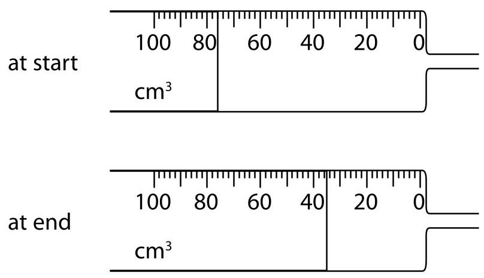

- the syringe reading at the end of this experiment

- Complete the table to show:

- the volume of oxygen used in the experiment.

(2) 

<table border="1"><tr><td>syringe reading at start/cm3</td><td>76</td></tr><tr><td>syringe reading at end/cm3</td><td></td></tr><tr><td>volume of oxygen used/cm3</td><td></td></tr></table>

(b) The table shows the results recorded by a different student in her experiment.

<table border="1"><tr><td>volume of air in conical flask/cm3</td><td>100</td></tr><tr><td>volume of air in connecting tube/cm3</td><td>10</td></tr><tr><td>original volume of air in syringe/cm3</td><td>80</td></tr><tr><td>final volume of air in syringe/cm3</td><td>43</td></tr></table>

Calculate the percentage of oxygen in air using these results.

## percentage of oxygen =

(c) The table shows some possible causes of anomalous results in this experiment.

Use terms from the box to complete the table, showing possible causes and their effects on the volume of oxygen used in this experiment.

decreased increased no effect

Each term may be used once, more than once, or not at all.

<table border="1"><tr><td>Possible cause</td><td>Effect on volume of oxygen used</td></tr><tr><td>wet iron filings not in excess</td><td></td></tr><tr><td>apparatus left for 1 hour instead of 1 week</td><td></td></tr><tr><td>apparatus left in a warmer place for 1 week</td><td></td></tr></table>

(Total for Question 4 = 8 marks)

5 A metal is added to copper(II) sulfate solution.

A displacement reaction only occurs if the metal added is more reactive than copper.

$$
\mathrm {m e t a l} + \mathrm {c o p p e r} (\mathrm {I I}) \mathrm {s u l f a t e} \rightarrow \mathrm {m e t a l} \mathrm {s u l f a t e} + \mathrm {c o p p e r}
$$

Displacement reactions are exothermic. The more reactive the metal added, the greater the temperature rise.

A student uses the following method in an experiment to compare the reactivities of different metals:

- pour some copper(II) sulfate solution into a boiling tube and record its temperature using a thermometer

- add some metal to the tube and stir with the thermometer

- record the maximum temperature of the contents of the tube.

He repeats the method using the same amount, in moles, of different metals.

(a) To make the experiment valid, he starts with the copper(II) sulfate solution and the added metal at the same temperature.

State two other variables that must be controlled if the experiment is to be valid.

2. 

(b) Another student uses the same method three times for each of the metals E,F,G and H. The table shows her results for these metals.

<table border="1"><tr><td rowspan="2">Metal</td><td colspan="3">Temperature increase/℃</td><td rowspan="2">Mean temperature increase/℃</td></tr><tr><td>1</td><td>2</td><td>3</td></tr><tr><td>E</td><td>7.0</td><td>4.0</td><td>8.0</td><td>7.5</td></tr><tr><td>F</td><td>0.0</td><td>0.0</td><td>0.0</td><td>0.0</td></tr><tr><td>G</td><td>6.0</td><td>5.0</td><td>5.4</td><td></td></tr><tr><td>H</td><td>5.5</td><td>11.0</td><td>12.0</td><td></td></tr></table>

(i) The student calculates the mean temperature increase for metals E and F. She does not include anomalous values in her calculations.

Calculate the mean temperature increase for metals G and H, ignoring any anomalous values. Write your answers in the table.

(ii) Explain which metal is the most reactive.

(iii) Explain which metal is less reactive than copper.

(Total for Question 5 = 8 marks)

6 This question is about the elements in Group 1 of the Periodic Table and their reactions with water.

(a) State why sodium and potassium are in Group 1 of the Periodic Table.

(b) A reaction occurs when a small piece of sodium is added to a large volume of water in a trough.

(i) Give two observations that you would make during this reaction.

(ii) After the reaction has finished, a few drops of universal indicator are added to the solution in the trough.

Explain the final colour of the universal indicator.

(iii) What is the most likely pH value of the solution in the trough after the reaction is complete?

A 2

B 5

C 8

D 12

(c) Give the name of a Group 1 metal that is less reactive than sodium.

(d) A small piece of potassium is added to a large volume of water in a trough.

Give one observation that is made when potassium is added to water that is not made when sodium is added to water.

(e) Complete the equation for the reaction of rubidium with water. State symbols are not required.

Rb+ $ \mathrm{H_{2}O}\rightarrow $ RbOH+ $ \mathrm{H_{2}} $

(Total for Question 6 = 9 marks)

7 This question is about hydrocarbons.

(a) The table shows the formulae of some hydrocarbons.

<table border="1"><tr><td>A
CH4</td><td>B
H
C=C
H
H</td><td>C
CH3-CH2-CH3</td></tr><tr><td>D
CH3-CH-CH3
CH3</td><td>E
CH3CH=CH2</td><td>F
CH3CH2CH2CH3</td></tr></table>

(i) Give the letters that represent hydrocarbons with the general formula $ C_{n}H_{2 n} $

(ii) State why B is the only hydrocarbon shown as a displayed formula.

(iii) Explain which two letters represent isomers.

(iv) How many of the hydrocarbons are members of the homologous series of alkanes?

(b) Many hydrocarbons are used as fuels. There are problems associated with this use.

(i) Explain how the combustion of a hydrocarbon can lead to the formation of a poisonous gas.

(ii) State why this gas is poisonous to humans.

(c) Fuels used in cars often have sulfur compounds removed.

Explain how the combustion of these fuels in car engines still leads to the formation of acid rain.

(Total for Question 7 = 13 marks)

8 The copper(II) carbonate in the mineral, malachite, reacts with hydrochloric acid according to this equation.

$$
\mathrm {C u C O} _ {3} (\mathrm {s}) + 2 \mathrm {H C l} (\mathrm {a q}) \rightarrow \mathrm {C u C l} _ {2} (\mathrm {a q}) + \mathrm {H} _ {2} \mathrm {O} (\mathrm {g}) + \mathrm {C O} _ {2} (\mathrm {g})
$$

Some students investigate the effect of changing the concentration of acid on the rate of this reaction. The diagram shows the apparatus they use.

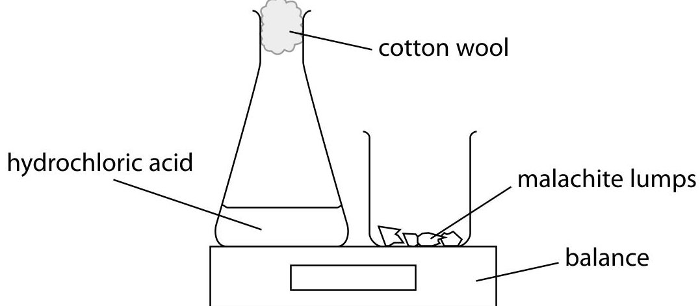

This is the method they use:

- set the balance to zero

- add an excess of malachite lumps to the conical flask and replace the cotton wool

- start a timer and record the balance reading after one minute.

The experiment is repeated using different concentrations of hydrochloric acid. The mass and number of malachite lumps are kept the same in each experiment.

(a) The table shows the results obtained in one series of experiments.

<table border="1"><tr><td>concentration of hydrochloric acid/mol/dm3</td><td>0.6</td><td>0.8</td><td>1.0</td><td>1.6</td><td>1.8</td><td>2.0</td></tr><tr><td>balance reading/g</td><td>-0.20</td><td>-0.27</td><td>-0.44</td><td>-0.54</td><td>-0.60</td><td>-0.67</td></tr></table>

State why the balance readings have negative values.

(b) The graph shows the results of this series of experiments.

loss in mass / g

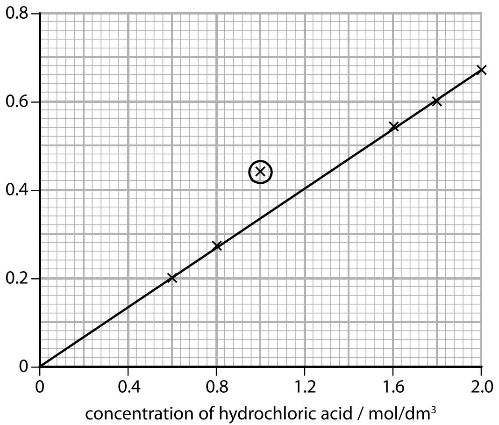

The circled point indicates an anomalous result.

(i) Suggest one mistake the students could have made to produce this result.

(ii) State the relationship shown by the graph.

(c) Explain why an increase in the concentration of the acid causes an increase in the rate of the reaction. You should use the particle collision theory in your answer.

(Total for Question 8 = 5 marks)

## BLANK PAGE

9 The flow chart shows how ethene can be obtained industrially from crude oil.

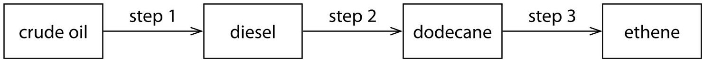

(a) Step 1 involves the use of a tall column.

Describe how the diesel fraction is obtained from the crude oil in step 1.

(b) In step 2, saturated compounds such as dodecane are obtained from the mixture of hydrocarbons in the diesel fraction.

Explain why dodecane is described as a saturated hydrocarbon.

(c) Which of these formulae is that of an alkane?

$$
\square \mathrm {A} \mathrm {C} _ {7} \mathrm {H} _ {1 2}
$$

$$
\square \mathrm {B} \mathrm {C} _ {9} \mathrm {H} _ {1 8}
$$

$$
\square \mathrm {C} \mathrm {C} _ {1 1} \mathrm {H} _ {2 4}
$$

$$
\mathrm {C} _ {1 3} \mathrm {H} _ {3 0}
$$

(d) In step 3, cracking is used to convert alkanes into alkenes.

Complete the equation to show the reaction in which one molecule of dodecane is converted into two molecules of ethene and one molecule of another hydrocarbon.

$$
\mathrm {C} _ {1 2} \mathrm {H} _ {2 6} \rightarrow 2 \mathrm {C} _ {2} \mathrm {H} _ {4} +
$$

(e) Alkanes and alkenes both react with halogens, but in different ways. The equations for two examples of these different reactions are shown.

equation 1

$$
\begin{array}{l} \mathrm {C} _ {2} \mathrm {H} _ {6} + \mathrm {C l} _ {2} \rightarrow \mathrm {C} _ {2} \mathrm {H} _ {5} \mathrm {C l} + \mathrm {c o m p o u n d} X \\ \mathrm {C} _ {2} \mathrm {H} _ {4} + \mathrm {B r} _ {2} \rightarrow \mathrm {C} _ {2} \mathrm {H} _ {4} \mathrm {B r} _ {2} \\ \end{array}
$$

equation 2

(i) State the condition needed for the reaction in equation 1 to occur.

(ii) Deduce the formula of compound X.

(iii) Draw a dot-and-cross diagram to represent a molecule of $ \mathrm{C_{2} H_{5} Cl} $ Show only the outer electrons of each atom.

(iv) Equation 2 shows an example of an addition reaction. State the type of reaction shown by equation 1.

(f) Alkenes can be distinguished from alkanes using bromine water.

(i) What colour change occurs in the reaction between propene and bromine water?

A colourless to orange

B colourless to green

C green to colourless

D orange to colourless

(ii) A compound formed in the reaction between propene and bromine water has the percentage composition by mass

C = 25.9% H = 5.0% Br = 57.6% and O = 11.5%

Calculate the empirical formula of this compound.

empirical formula =

(Total for Question 9 = 19 marks)

10 When aqueous solutions of potassium hydroxide and nitric acid are mixed together, an exothermic reaction occurs. The diagram shows the apparatus used in an experiment to measure the temperature increase.

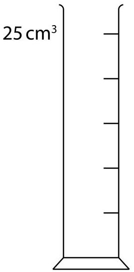

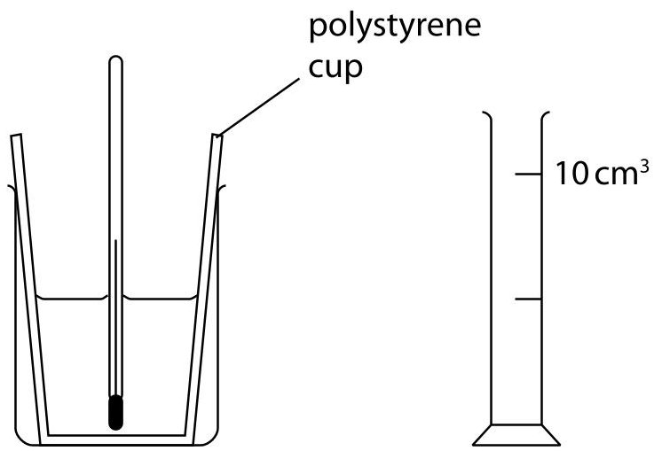

This is the student's method;

- use the larger measuring cylinder to add $ 2 5 \mathrm{c m}^{3} $ of aqueous potassium hydroxide to the polystyrene cup

- record the steady temperature

- use the smaller measuring cylinder to add $ 5 \mathrm{c m}^{3} $ of dilute nitric acid to the cup, stir the mixture with the thermometer

- record the highest temperature of the mixture

- continue adding further $ 5 \mathrm{c m}^{3} $ portions of dilute nitric acid to the cup, stirring and recording the temperature, until a total volume of $ 3 5 \mathrm{c m}^{3} $ has been added.

(a) A teacher advises the student to use a $ 5 0 \mathrm{c m}^{3} $ burette instead of the $ 1 0 \mathrm{c m}^{3} $ measuring cylinder.

Suggest two reasons why it would be better to use a burette instead of a measuring cylinder to add the acid in this experiment.

(b) The diagram shows the thermometer readings at the start and at the end of one experiment.

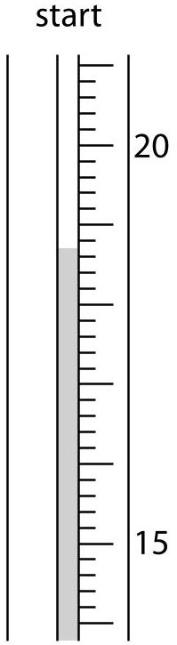

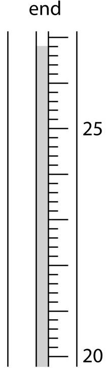

Complete the table to show:

- the thermometer reading at the start of the experiment

- the temperature rise in the experiment.

(2) 

<table border="1"><tr><td>thermometer reading at end/℃</td><td>26.8</td></tr><tr><td>thermometer reading at start/℃</td><td></td></tr><tr><td>thermometer rise/℃</td><td></td></tr></table>

(c) Another student uses the same method, adding the dilute nitric acid from a burette.

The table shows his results.

<table border="1"><tr><td>volume of acid added/cm3</td><td>0.0</td><td>5.0</td><td>10.0</td><td>15.0</td><td>20.0</td><td>25.0</td><td>30.0</td><td>35.0</td></tr><tr><td>temperature of mixture/℃</td><td>18.0</td><td>20.8</td><td>23.5</td><td>24.2</td><td>29.0</td><td>28.6</td><td>27.6</td><td>26.5</td></tr></table>

This is the student's graph.

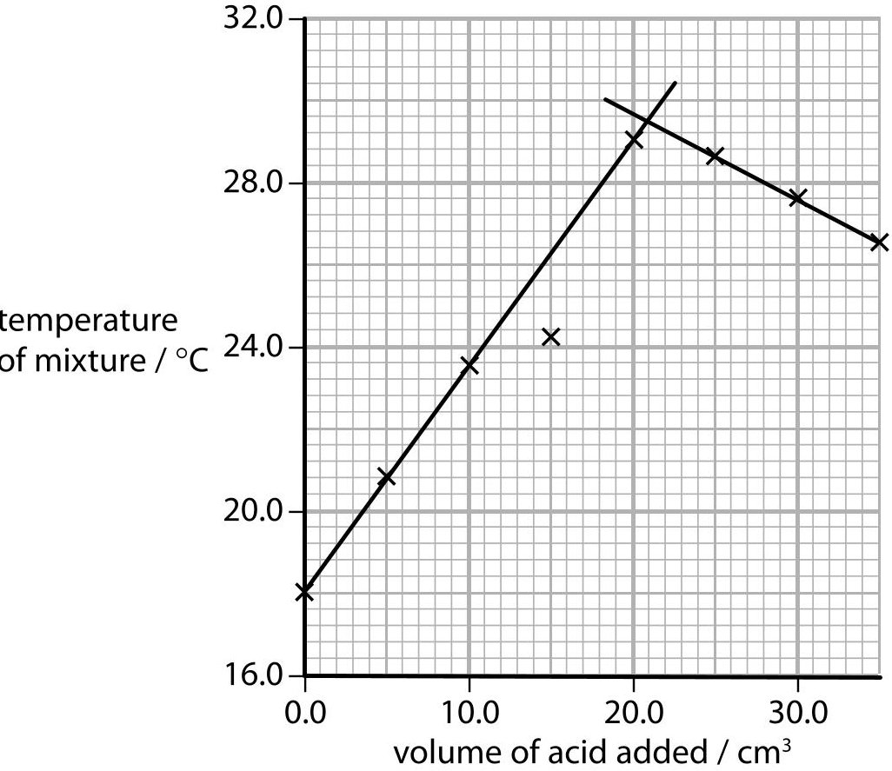

The point where the lines cross represents complete neutralisation.

(i) Identify the maximum temperature reached during the experiment.

maximum temperature=

(ii) Identify the volume of dilute nitric acid that exactly neutralises the $ 2 5 \mathrm{c m}^{3} $ of aqueous potassium hydroxide.

$$
\mathrm {v o l u m e} =
$$

(d) Another student records these results.

volume of aqueous potassium hydroxide = 20.0 $ cm^{3} $

starting temperature of aqueous potassium hydroxide = 18.5 $ ^{\circ} C $

maximum temperature of mixture = 30.0 $ ^{\circ} C $

volume of dilute nitric acid = 20.0 $ cm^{3} $

Calculate the heat energy released in this experiment.

$$
\mathrm {c} = 4. 2 \mathrm {J} / \mathrm {g} / ^ {\circ} \mathrm {C}
$$

mass of 1 $ cm^{3} $ of mixture = 1 g

## heat energy=

(e) In another experiment, the heat energy released is 1600 J when 0.040 mol of potassium hydroxide is neutralised.

Calculate the value of $ \Delta H $ , in kJ/mol, for the neutralisation of potassium hydroxide.

$$
\Delta H =
$$

(Total for Question 10 = 12 marks)

11 Many different salts can be prepared from acids.

(a) The table shows the reactants used in two salt preparations.

Complete the table to show the name of the salt formed and the other product(s) in each case.

<table border="1"><tr><td>Reactants</td><td>Name of salt formed</td><td>Other product(s)</td></tr><tr><td>zinc+hydrochloric acid</td><td></td><td></td></tr><tr><td>calcium carbonate+nitric acid</td><td></td><td></td></tr></table>

(b) A student uses the reaction between aluminium hydroxide and dilute sulfuric acid to prepare a pure, dry sample of aluminium sulfate crystals.

The equation for the reaction used to prepare this salt is

$$
2 \mathrm {A l} (\mathrm {O H}) _ {3} + 3 \mathrm {H} _ {2} \mathrm {S O} _ {4} \rightarrow \mathrm {A l} _ {2} \left(\mathrm {S O} _ {4}\right) _ {3} + 6 \mathrm {H} _ {2} \mathrm {O}
$$

The diagram shows the steps in the student's method.

dilute sulfuric acid

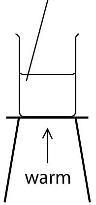

step 1

aluminium hydroxide

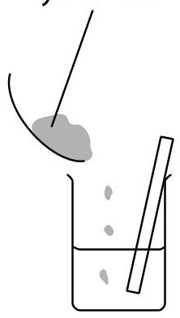

step 2

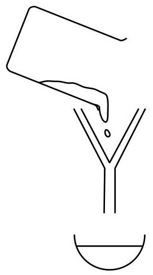

step 3

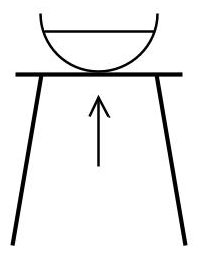

step 4

step 5

(i) State two ways to make sure that all the acid is reacted in step 2.

(ii) State the purpose of filtration in step 3.

(iii) In step 5, the basin is left to cool to room temperature to allow crystals of aluminium sulfate to form.

State one method of drying these crystals.

(c) The student records this information about the reagents she uses in her preparation.

mass of aluminium hydroxide = 3.9 g

amount of sulfuric acid = 0.090 mol

Determine which reagent is in excess, making use of this information and the equation in part (b).

reagent used in excess =

(d) Another student prepares 0.25 mol of aluminium sulfate. The formula of aluminium sulfate is $ \mathrm{A l}_{2} \left( \mathrm{S O}_{4} \right)_{3} $

Calculate the mass of aluminium sulfate prepared.

(e) The equation for another reaction used to prepare a sample of a salt is

$$
\mathrm {P b O} + 2 \mathrm {H N O} _ {3} \rightarrow \mathrm {P b} \left(\mathrm {N O} _ {3}\right) _ {2} + \mathrm {H} _ {2} \mathrm {O}
$$

In one experiment, the amount of lead(II) oxide used was 0.75 mol and the amount of nitric acid used was 1.5 mol. At the end of the experiment, the mass of lead(II) nitrate obtained was 209 g.

Calculate the percentage yield of lead(II) nitrate in this experiment.

[ $ M_{\mathrm{r}} $ of lead(II) nitrate=331]

(Total for Question 11 = 17 marks)

TOTAL FOR PAPER = 110 MARKS

## BLANK PAGE

## BLANK PAGE