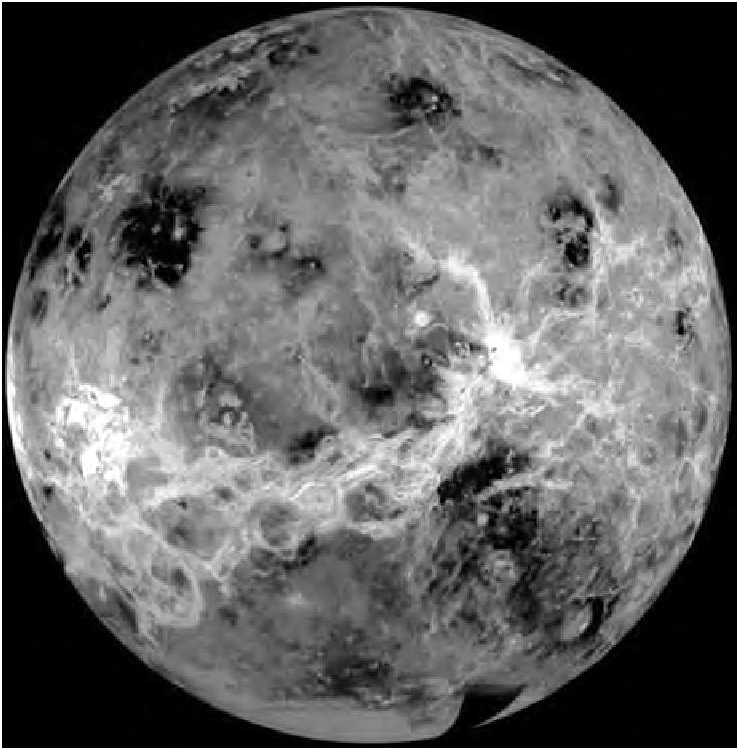
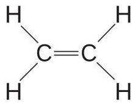
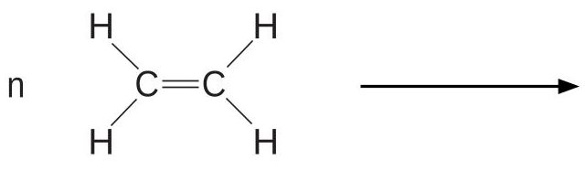
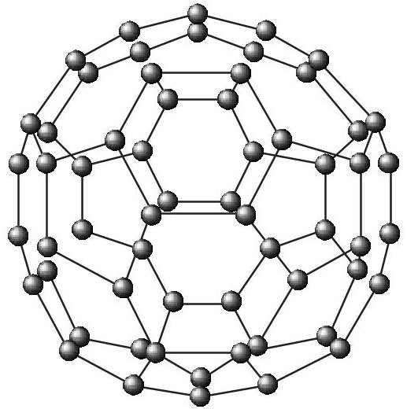

<table><tr><td colspan="3">Write your name here</td></tr><tr><td>Surname</td><td colspan="2">Other names</td></tr><tr><td colspan="3">Centre Number</td></tr><tr><td colspan="3">Candidate Number</td></tr><tr><td colspan="3">Edexcel IGCSE</td></tr><tr><td colspan="3">Chemistry</td></tr><tr><td colspan="3">Unit: 4CH0
Paper: 2C</td></tr><tr><td colspan="3">Wednesday 15 June 2011 – Morning
Time: 1 hour</td></tr><tr><td colspan="3">Paper Reference
4CH0/2C</td></tr><tr><td colspan="3">You must have:
Ruler
Candidates may use a calculator.</td></tr><tr><td colspan="3">Total Marks</td></tr></table>

## Instructions

- Use black ink or ball-point pen.

- Fill in the boxes at the top of this page with your name, centre number and candidate number.

- Answer all questions.

- Answer the questions in the spaces provided

- there may be more space than you need.

- Show all the steps in any calculations and state the units.

## Information

- The total mark for this paper is 60.

- The marks for each question are shown in brackets

- use this as a guide as to how much time to spend on each question.

## Advice

- Read each question carefully before you start to answer it.

- Keep an eye on the time.

- Write your answers neatly and in good English.

- Try to answer every question.

- Check your answers if you have time at the end.

<table class="table table-bordered"><thead><tr><th>1</th><th>2</th><th>3</th><th>4</th><th>5</th><th>6</th><th>7</th><th>8</th><th>9</th><th>10</th><th>11</th><th>12</th><th>13</th><th>14</th><th>15</th><th>16</th><th>17</th><th>18</th></tr></thead><tbody><tr><td>7</td><td>Li</td><td>9</td><td>Be</td><td>Beryllium</td><td></td><td></td><td></td><td></td><td></td><td></td><td></td><td></td><td></td><td></td><td></td><td></td><td></td><td></td></tr><tr><td>3</td><td>Lithium</td><td>4</td><td></td><td></td><td></td><td></td><td></td><td></td><td></td><td></td><td></td><td></td><td></td><td></td><td></td><td></td><td></td><td></td></tr><tr><td>23</td><td>Na</td><td>24</td><td>Mg</td><td>Magnesium</td><td></td><td></td><td></td><td></td><td></td><td></td><td></td><td></td><td></td><td></td><td></td><td></td><td></td><td></td></tr><tr><td>39</td><td>K</td><td>40</td><td>Ca</td><td>Calcium</td><td>45</td><td>Sc</td><td>51</td><td>V</td><td>Chromium</td><td>52</td><td>Mn</td><td>55</td><td>Fe</td><td>56</td><td>Co</td><td>Cobalt</td><td>59</td><td>Ni</td><td>63.5</td><td>Cu</td><td>Copper</td><td>65</td><td>Zn</td><td>Zinc</td><td>70</td><td>Ga</td><td>Galium</td><td>71</td><td>73</td><td>Ge</td><td>Germanium</td><td>72</td><td>75</td><td>As</td><td>Arsenic</td><td>33</td><td>79</td><td>Se</td><td>Selenium</td><td>34</td><td>80</td><td>Br</td><td>Bromine</td><td>35</td><td>84</td><td>Kr</td><td>Krypton</td></tr><tr><td>19</td><td>K</td><td>20</td><td></td><td>
</table>
## Answer ALL questions.
1 A small piece of potassium is added to water.
The list below shows some statements.
Only four of these statements describe what happens when potassium reacts with water.
Place a cross ( $ \times $ ) in the box next to each of the four correct statements.
potassium oxide solution is formed
fizzing occurs
potassium sinks to the bottom of the water
potassium moves around
potassium melts
bubbles of oxygen gas are produced
a lilac flame is seen
potassium reacts to form an acidic solution
(Total for Question 1 = 4 marks)
2 Choose the name of a substance from the box to answer parts (a) to (e). Each name may be used once, more than once or not at all.
ammonia chlorine haematite iron sodium hydroxide
Give the name of
(a) a solid that conducts electricity.
(b) a metal ore.
(c) a substance formed in the Haber process.
(d) a substance used to make soap.
(e) a substance used to make fertilisers.
(Total for Question 2 = 5 marks)
3 The photograph shows the planet Venus.

Although Venus is similar in size to the Earth, it is very different in other ways.
The temperature at the surface of Venus is about 470 $ ^{\circ} \mathrm{C} $ . The atmospheric pressure is 90 times that of the Earth.
The clouds in the atmosphere of Venus are made up of droplets of sulfuric acid.
The table lists some properties of metals that could be used to make a space probe to land on Venus.
<table border="1"><tr><td>Metal</td><td>Melting point in℃</td><td>Relative density</td><td>Reaction with sulfuric acid</td></tr><tr><td>copper</td><td>1083</td><td>8.9</td><td>no reaction</td></tr><tr><td>lead</td><td>328</td><td>11.3</td><td>no reaction</td></tr><tr><td>magnesium</td><td>650</td><td>1.7</td><td>fizzes vigorously</td></tr><tr><td>nickel</td><td>1453</td><td>8.9</td><td>fizzes slowly</td></tr><tr><td>titanium</td><td>1675</td><td>4.5</td><td>no reaction</td></tr><tr><td>zinc</td><td>420</td><td>7.1</td><td>fizzes quite vigorously</td></tr></table>
The probe needs to be launched with enough energy to escape the Earth's gravity. To make this easier, the mass of the probe needs to be as low as possible. The probe also needs to withstand the conditions on the surface of Venus.
Use the information in the table to answer parts (a) to (c).
(a) (i) Which metal in the table could be used to make a probe with the lowest density?
(ii) Why would this metal be unsuitable for making a probe to land on Venus?
(b) Very small amounts of lead can be used in electrical circuits.
Why would lead not be suitable for use in the electrical circuits of a probe to land on Venus?
(c) Choose a metal from the table that would be the most suitable for making a probe to land on Venus. Give two reasons for your choice.
Metal
Reasons
(Total for Question 3 = 6 marks)
4 Here are some statements about the compound ethene.
- ethene has the displayed formula

- ethene is a gas at room temperature
- ethene burns with a smoky flame
- ethene is unsaturated
- ethene is insoluble in water
- ethene can be prepared from ethanol
- ethene is used to make the polymer poly(ethene)
(a) (i) State why ethene is described as unsaturated.
(ii) Describe a chemical test to show that ethene is an alkene.
Test
Result
(b) (i) Complete the following equation that represents the preparation of ethene from ethanol.
$$
\mathrm {C} _ {2} \mathrm {H} _ {5} \mathrm {O H} \rightarrow \mathrm {C} _ {2} \mathrm {H} _ {4} + \dots \dots \dots \dots
$$
(ii) What is the name given to this type of reaction?
(c) Complete the equation to show the formation of poly(ethene) from ethene.

5 When soap is shaken with water, a lather forms. A lather is a collection of small bubbles that form on the surface of the water.
Very little soap is needed to form a lather with pure water.
Water that needs a much larger quantity of soap to form a lather is called hard water.
Water becomes hard when certain compounds are dissolved in it.
A student carried out an experiment to find out which compounds make water hard.
This is the method she used.
- Equal amounts of five different compounds were dissolved in equal volumes of pure water in separate test tubes.
- Soap solution was added to each test tube, one drop at a time. One drop of soap solution has a volume of $ 0. 0 5 \mathrm{c m}^{3}. $
- The test tubes were shaken after each addition of soap solution. Soap solution was added drop by drop until a lather formed on shaking.
- The volume of soap solution needed to form a lather was recorded.
- The experiment was repeated three times with each compound.
- Pure water was also tested in the same way.
Her results are shown in the table:
<table border="1"><tr><td rowspan="2">Compound</td><td colspan="3">Volume of soap solution needed to form a lather in $ \mathrm{c m^{3}} $</td></tr><tr><td>Experiment1</td><td>Experiment2</td><td>Experiment3</td></tr><tr><td>sodium chloride</td><td>0.10</td><td>0.15</td><td>0.10</td></tr><tr><td>magnesium chloride</td><td>1.60</td><td>1.70</td><td>1.65</td></tr><tr><td>calcium chloride</td><td>2.15</td><td>2.30</td><td>2.25</td></tr><tr><td>potassium chloride</td><td>0.10</td><td>0.05</td><td>0.10</td></tr><tr><td>iron(II) chloride</td><td>1.95</td><td>4.30</td><td>1.90</td></tr><tr><td>pure water</td><td>0.10</td><td>0.10</td><td>0.10</td></tr></table>
(a) Name two compounds that made the water hard.
(b) Why did the student carry out the experiment three times with each compound?
(c) (i) Circle the anomalous result in the table.
(ii) What should the student have done after she identified this anomalous result?
(d) Place a cross ( $ \times $ ) in one box next to the name of the apparatus that the student should use to add the soap solution.
beaker
burette
measuring cylinder
pipette
(e) Calculate the average (mean) volume of soap solution needed to form a lather with the magnesium chloride solution. Give your answer to two decimal places.
Average (mean) = ... $ cm^{3} $
(Total for Question 5 = 8 marks)
6 Diamond and graphite are two naturally-occurring forms of carbon.
The diagrams below show the arrangement of the carbon atoms in diamond and in graphite. The black dots ( $ \cdot $ ) represent carbon atoms.
<table border="1"><tr><td>Diamond</td><td>Graphite</td></tr><tr><td>钻石结构</td><td>石墨结构</td></tr></table>
(a) Name the type of structure in diamond and explain, in terms of its bonding, why diamond has a high melting point.
(b) Explain, in terms of its structure, why graphite can act as a lubricant.
(c) The structure of graphite has one feature in common with that of metals. This feature allows graphite to conduct electricity.
Suggest what this feature is and why it allows graphite to conduct electricity.
(d) In 1985, a new form of carbon was discovered. It was called buckminsterfullerene after the architect Buckminster Fuller, who designed buildings with complex geometric shapes.
Buckminsterfullerene $ \left( \mathrm{C}_{60} \right) $ has a simple molecular structure containing 60 carbon atoms per molecule. It looks a little bit like a football.

Suggest why buckminsterfullerene has a much lower melting point than diamond.
7 Sodium azide $ \mathrm{(N a N_{3})} $ is a stable compound at room temperature but decomposes when heated to $ 3 0 0^{\circ} \mathrm{C} $ . The equation for the decomposition is:
$$
2 \mathrm {N a N} _ {3} (\mathrm {s}) \rightarrow 2 \mathrm {N a} (\mathrm {I}) + 3 \mathrm {N} _ {2} (\mathrm {g})
$$
Sodium azide is used to produce nitrogen gas to inflate car airbags.

If a car is involved in a collision, the sodium azide decomposes.
The nitrogen gas is produced very rapidly and the airbag inflates almost immediately.
(a) (i) A fully-inflated airbag has a total volume of 108 dm $ ^{3} $ .
Calculate the amount of nitrogen, in moles, in a fully-inflated airbag. [You should assume that the volume of one mole of nitrogen inside the airbag is $ 2 4 \mathrm{~ d m}^{3} $]
Amount of nitrogen =
(ii) Use your answer to (a)(i) to calculate the mass, in grams, of sodium azide required to produce $ 1 0 8 \mathrm{~ d m}^{3} $ of nitrogen.
## Mass of sodium azide required =
(b) The airbag also contains potassium nitrate. This reacts with sodium formed in the decomposition of sodium azide. The equation for the reaction is:
$$
1 0 \mathrm {N a} (\mathrm {I}) + 2 \mathrm {K N O} _ {3} (\mathrm {s}) \rightarrow \mathrm {K} _ {2} \mathrm {O} (\mathrm {s}) + 5 \mathrm {N a} _ {2} \mathrm {O} (\mathrm {s}) + \mathrm {N} _ {2} (\mathrm {g})
$$
(i) Suggest one reason why the makers of the airbag might want this reaction to occur.
(ii) The airbag also contains silicon dioxide $ \mathrm{(S i O_{2})} $ which reacts with the oxides produced in the reaction above. This forms a glassy solid which seals all the products into the airbag.
The glassy solid contains potassium silicate $ \left(\mathrm{K}_{2} \mathrm{S i O}_{3}\right) $
Construct an equation for the formation of potassium silicate from potassium oxide. Include state symbols.
(c) Another use of sodium azide is to make lead(II) azide, which can be used as a detonator for explosives. Lead(II) azide has the formula of $ \mathrm{P b} \left( \mathrm{N}_{3} \right)_{2} $
Lead(II) azide can be made by the following reaction:
$$
\mathrm {P b} \left(\mathrm {N O} _ {3}\right) _ {2} (\mathrm {a q}) + 2 \mathrm {N a N} _ {3} (\mathrm {a q}) \rightarrow \mathrm {P b} \left(\mathrm {N} _ {3}\right) _ {2} (\mathrm {s}) + 2 \mathrm {N a N O} _ {3} (\mathrm {a q})
$$
(i) What name is given to this type of reaction?
(ii) What method would you use to remove the lead(II) azide from the final reaction mixture?
(Total for Question 7 = 9 marks)
8 The following verse is about water $ \mathrm{(H_{2}O)} $ and dilute sulfuric acid $ \mathrm{(H_{2}SO_{4})}. $
Johnny was a chemist's son
But Johnny is no more
What Johnny thought was $ \mathrm{H}_{2} \mathrm{O} $
$$
\mathrm {W a s H} _ {2} \mathrm {S O} _ {4}
$$
(a) Johnny looked at a beaker containing sulfuric acid and thought that it was water. He then drank the liquid.
Suggest why it is possible to mistake sulfuric acid for water.
(b) Anhydrous copper(II) sulfate changes from white to blue when added to dilute sulfuric acid. Suggest why.
(c) Sulfuric acid is manufactured by the contact process.
One stage of this process involves the reaction of sulfur dioxide with oxygen.
$$
2 \mathrm {S O} _ {2} + \mathrm {O} _ {2} \rightleftharpoons 2 \mathrm {S O} _ {3}
$$
State the conditions used in this stage of the process.
Pressure (in atmospheres)
Temperature (in $ ^{\circ} \mathrm{C} $)
Catalyst
(d) $ 1 0. 0 \mathrm{c m}^{3} $ of a concentrated solution of sulfuric acid was carefully diluted with water. More water was then added until the final volume of the solution was $ 1. 0 0 \mathrm{d m}^{3} $ $ (1 0 0 0 \mathrm{c m}^{3}). $
In an experiment, a student found that $ 2 5. 0 \mathrm{c m}^{3} $ of the diluted sulfuric acid reacted with $ 3 0. 0 0 \mathrm{c m}^{3} $ of sodium hydroxide solution.
The concentration of the sodium hydroxide solution was 0.200 mol/dm $ ^{3}. $
The equation for the reaction is:
$$
2 \mathrm {N a O H} + \mathrm {H} _ {2} \mathrm {S O} _ {4} \rightarrow \mathrm {N a} _ {2} \mathrm {S O} _ {4} + 2 \mathrm {H} _ {2} \mathrm {O}
$$
(i) Calculate the amount, in moles, of sodium hydroxide in $ 3 0. 0 0 \mathrm{c m}^{3} $ of a solution of concentration 0.200 mol/dm $ ^{3} $ .
Amount of sodium hydroxide = mol
(ii) Using your answer to (d)(i), calculate the amount, in moles, of sulfuric acid in $ 2 5. 0 \mathrm{c m}^{3} $ of the diluted acid.
Amount of sulfuric acid in 25.0 $ \mathrm{c m^{3}} $ = ... mol
(iii) Using your answer to (d)(ii), calculate the concentration, in mol/dm $ ^{3} $ , of the diluted sulfuric acid.
Concentration of the diluted sulfuric acid = ... mol/dm $ ^{3} $
(iv) Using your answer to (d) (iii), calculate the concentration, in mol/dm $ ^{3} $ , of the original, concentrated sulfuric acid.
Concentration of the original, concentrated acid = ... mol/dm $ ^{3} $
(Total for Question 8 = 11 marks)
(TOTAL FOR PAPER = 60 MARKS)
## BLANK PAGE
