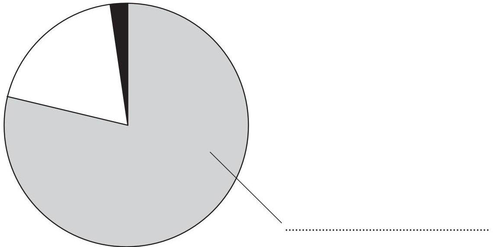
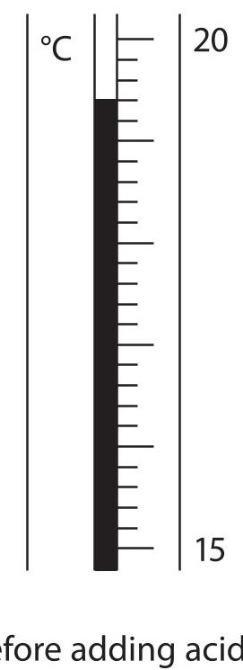
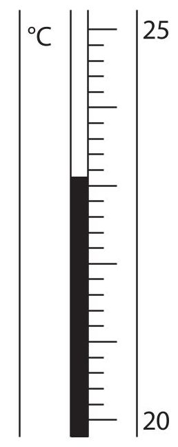
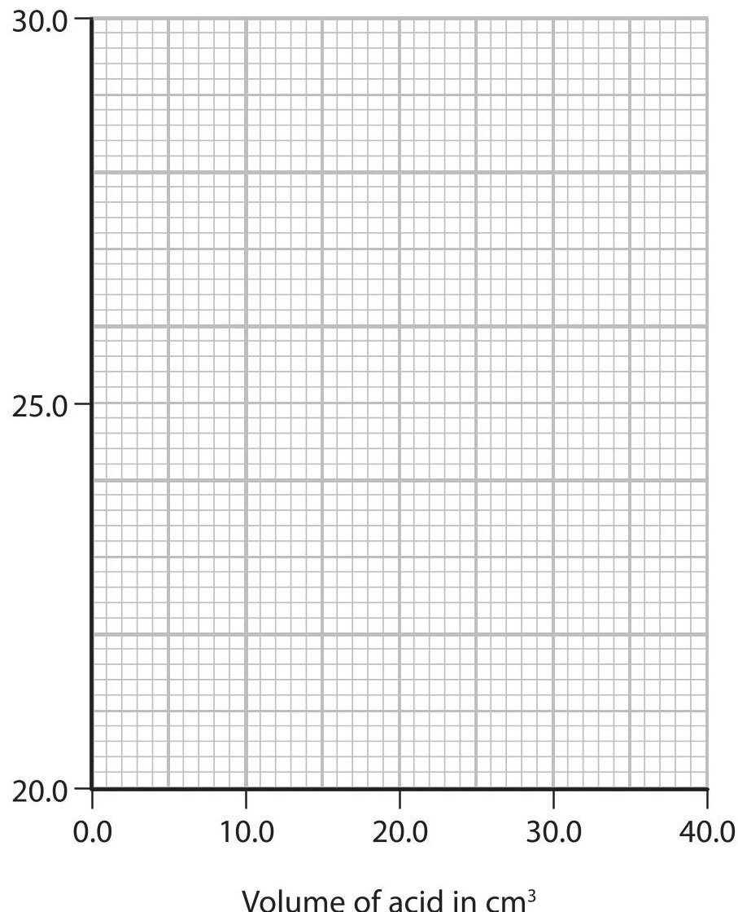
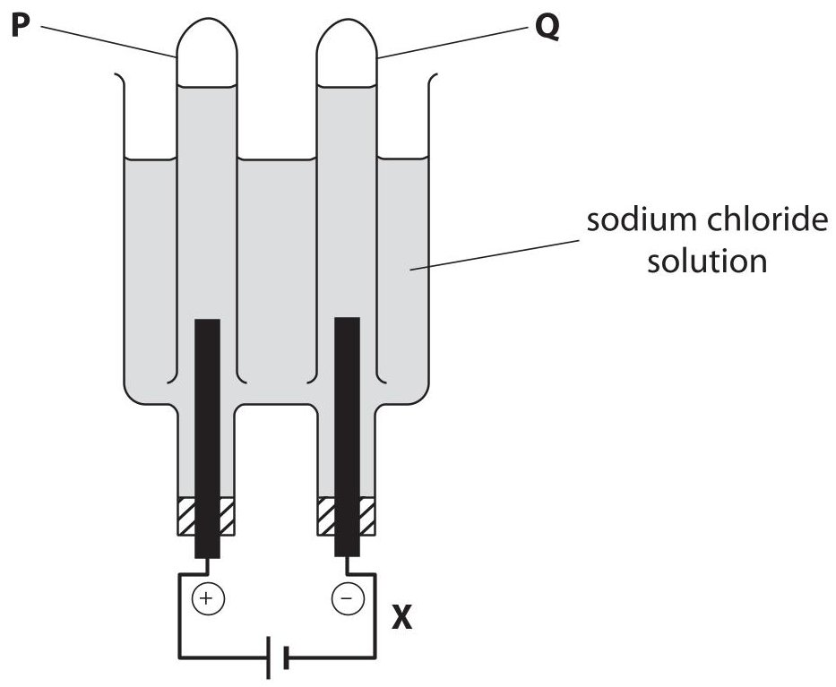

<table><tr><td colspan="3">Write your name here</td></tr><tr><td>Surname</td><td colspan="2">Other names</td></tr><tr><td>Edexcel Certificate</td><td>Centre Number</td><td>Candidate Number</td></tr><tr><td>Edexcel International GCSE</td><td></td><td></td></tr><tr><td colspan="3">Chemistry</td></tr><tr><td colspan="3">Unit: KCH0/4CH0
Paper: 2C</td></tr><tr><td colspan="2">Tuesday 29 May 2012 – Morning
Time: 1 hour</td><td>Paper Reference
KCH0/2C
4CH0/2C</td></tr><tr><td colspan="3">You must have:
Ruler
Calculator</td><td>Total Marks</td></tr></table>

## Instructions

- Use black ink or ball-point pen.

- Fill in the boxes at the top of this page with your name, centre number and candidate number.

- Answer all questions.

- Answer the questions in the spaces provided

- there may be more space than you need.

- Show all the steps in any calculations and state the units.

## Information

- The total mark for this paper is 60.

- The marks for each question are shown in brackets

- use this as a guide as to how much time to spend on each question.

## Advice

- Read each question carefully before you start to answer it.

- Keep an eye on the time.

- Write your answers neatly and in good English.

- Try to answer every question.

- Check your answers if you have time at the end.

<table class="table table-bordered"><thead><tr><th>7 Li Lithium</th><th>9 Be Beryllium</th></tr></thead><tbody><tr><td>23 Na Sodium</td><td>24 Mg Magnesium</td></tr><tr><td>39 K Potassium</td><td>40 Ca Calcium</td></tr><tr><td>86 Rb Rubidium</td><td>88 Sr Strontium</td></tr><tr><td>133 Cs Caesium</td><td>137 Ba Barium</td></tr><tr><td>223 Fr Francium</td><td>226 Ra Radium</td></tr></tbody></table>

## Answer ALL questions.

1 Many chemical reactions occur in the atmosphere.

(a) The pie chart shows the relative amounts of some gases in air.

(i) Label the pie chart with the name of the gas that makes up most of the air.

(ii) What is the approximate percentage of oxygen in air? Place a cross ( $ \bigcirc $ ) in one box.

1

20

25

78

(iii) Use words from the box to complete the sentences about some of the other gases in air.

Each word may be used once, more than once or not at all.

<table border="1"><tr><td>diatomic</td><td>dense</td><td>neon</td><td>nitrogen</td><td>unreactive</td><td>water</td></tr></table>

One of the gases in air is argon. It is called a noble gas because it is very ... .

The percentage of ... vapour in air varies with the weather.

(b) Rain water is naturally slightly acidic because carbon dioxide dissolves in it. The word equation for the reaction that occurs is:

$$
\mathrm {c a r b o n d i o x i d e} + \mathrm {w a t e r} \rightarrow \mathrm {c a r b o n i c a c i d}
$$

Acid rain is more acidic because pollutant gases in the atmosphere also dissolve in water.

(i) Identify the acid formed when sulfur dioxide reacts with water.

(ii) Identify another pollutant gas that forms acid rain.

(iii) State two problems caused by acid rain.

(Total for Question 1 = 8 marks)

2 Iron and aluminium are two important metals extracted from their ores on a large scale.

(a) In the extraction of iron, three different raw materials are put into the top of a blast furnace.

Name the main compound present in the following raw materials.

(i) Haematite

(ii) Limestone

(b) The following equations represent reactions in the blast furnace.

A $ \mathrm{C+O_{2}\rightarrow CO_{2}} $

B $ \mathrm{CaCO_{3}\rightarrow CaO+CO_{2}} $

C $ \mathrm{C+CO_{2}\rightarrow 2CO} $

D $ \mathrm{Fe_{2}O_{3}+3CO\rightarrow 2Fe+3CO_{2}} $

E $ \mathrm{CaO+SiO_{2}\rightarrow CaSiO_{3}} $

Choose from the letters A,B,C,D or E to answer parts (i) - (iv). Each letter may be used once, more than once or not at all.

(i) A reaction that is used to produce heat ...

(ii) A neutralisation reaction

(iii) A decomposition reaction

(iv) A reaction that forms a reducing agent

(c) Molten iron and another molten substance collect at the bottom of the blast furnace. What is the common name of this other molten substance?

(d) Aluminium is extracted from its ore by electrolysis. This is a more expensive process than using a blast furnace.

(i) Why is a different method used for aluminium?

(ii) State the major reason for the high cost of extracting aluminium.

(e) Coke used in the blast furnace contains carbon. Carbon is also used in the extraction of aluminium, but for a different purpose.

What is this purpose?

(f) The extraction of aluminium can be represented by the chemical equation:

$$
2 \mathrm {A l} _ {2} \mathrm {O} _ {3} \rightarrow 4 \mathrm {A l} + 3 \mathrm {O} _ {2}
$$

Write the two ionic half-equations that can also be used to represent this extraction.

Half-equation 1.

Half-equation 2.

(Total for Question 2 = 13 marks)

3 A group of students planned an experiment to find the temperature rise in a neutralisation reaction. This is their method.

- Use a measuring cylinder to add $ 2 5 \mathrm{c m}^{3} $ of an alkali to a $ 1 0 0 \mathrm{c m}^{3} $ beaker

- Record the temperature of the alkali

- Use a burette to add an acid to the alkali in 5.0 $ cm^{3} $ portions

- Record the temperature of the mixture after adding each portion of acid

- Stop the experiment when the neutralisation is complete

(a) The teacher asked the students about their method.

Suggest an answer to each of her questions.

(i) Why would it be better to use a pipette instead of a measuring cylinder?

(ii) It would be better if a polystyrene cup were used instead of a beaker. What property of polystyrene makes this an improvement?

(iii) What extra step should there be between adding each portion of acid and measuring the temperature?

(iv) How would you know when the neutralisation was complete?

(b) The diagrams show the readings on the thermometer before and after one of the students added a portion of acid.

before adding acid

after adding acid

Write down the thermometer readings and calculate the temperature change.

(3) 

Temperature before adding acid ... $ ^{\circ} \mathrm{C} $

Temperature after adding acid ... $ ^{\circ} \mathrm{C} $

Temperature change ... $ ^{\circ} \mathrm{C} $

(c) One student obtained these results from an experiment in which she added a total of $ 4 0. 0 \mathrm{c m}^{3} $ of hydrochloric acid to $ 2 5 \mathrm{c m}^{3} $ of sodium hydroxide solution.

<table border="1"><tr><td>Volume of acid in $ \mathrm{c m^{3}} $</td><td>0.0</td><td>5.0</td><td>10.0</td><td>15.0</td><td>20.0</td><td>25.0</td><td>30.0</td><td>35.0</td><td>40.0</td></tr><tr><td>Temperature in $ ^{\circ} \mathrm{C} $</td><td>21.0</td><td>22.3</td><td>24.4</td><td>26.2</td><td>27.8</td><td>27.8</td><td>27.5</td><td>26.7</td><td>26.2</td></tr></table>

(i) Plot a graph of these results on the grid below.

Draw a straight line of best fit through the first five points and another straight line of best fit through the last four points. Make sure that the two lines cross.

Temperature in $ ^{\circ} \mathrm{C} $

(ii) The point where the lines cross indicates the volume of acid needed to exactly neutralise the alkali, and also the maximum temperature reached.

Use your graph to record these values.

Volume of acid

Maximum temperature ... $ ^{\circ} \mathrm{C} $

(d) A second student used the same method and found that $ 3 0. 0 \mathrm{c m}^{3} $ of acid were needed to neutralise $ 2 5 \mathrm{c m}^{3} $ of alkali.

He obtained a temperature rise of 5.5 $ ^{\circ} \mathrm{C} $ in his experiment.

Calculate the heat energy change in this experiment using the expression:

heat energy change = total volume of mixture $ \times $4.2 $ \times $temperature change

## Heat energy change =

(e) A third student calculated that the heat energy change in her experiment was 1800 J. This heat energy was released by the neutralisation of $ 2 5 \mathrm{c m}^{3} $ of 1.50 mol/dm $ ^{3} $ sodium hydroxide solution.

(i) Calculate the amount, in moles, of sodium hydroxide neutralised.

$$
\mathrm {A m o u n t} =
$$

(ii) Calculate the molar enthalpy change, in kJ/mol, for the neutralisation of sodium hydroxide.

Molar enthalpy change =

(Total for Question 3 = 19 marks)

4 There are two important ways to manufacture ethanol.

Reaction 1

$$
\mathrm {C} _ {2} \mathrm {H} _ {4} + \mathrm {H} _ {2} \mathrm {O} \rightarrow \mathrm {C} _ {2} \mathrm {H} _ {5} \mathrm {O H}
$$

Reaction 2

$$
C _ {6} H _ {1 2} O _ {6} \rightarrow 2 C _ {2} H _ {5} O H + 2 C O _ {2}
$$

(a) (i) Identify one raw material that could be used as the source of $ C_{6} H_{1 2} O_{6} $

(ii) Reaction 2 uses a catalyst called zymase, which is present in yeast. Identify the catalyst used in reaction 1.

(iii) In both reactions it is important to control the temperature State why the temperature in reaction 2 is kept below $ 3 5 \, \mathrm{^ \circ C} $

(b) A manufacturing company plans to build a factory to produce ethanol on a large scale. The factory will be near an oilfield. The ethanol will be used as a solvent for perfume.

Suggest why the company should use reaction 1 rather than reaction 2.

(c) In the future, it may be necessary to convert the ethanol (produced by reaction 2) into ethene.

Write the equation for this reaction and state the type of reaction that occurs.

Equation

Type of reaction

(Total for Question 4 = 8 marks)

5 The diagram shows how sodium chloride solution can be electrolysed and the products of electrolysis collected.

power supply

(a) (i) Draw an arrow on the diagram to show the direction of electron flow at point X.

(ii) The diagram shows one of the gases being collected in test tube Q.

Identify this gas.

(iii) When the concentration of the sodium chloride solution is low, the gas collected in test tube P is mostly oxygen. The formation of this gas can be represented by an ionic half-equation.

Balance the equation.

$$
\mathrm {O H} ^ {-} \rightarrow \mathrm {H} _ {2} \mathrm {O} + \mathrm {O} _ {2} + \mathrm {e} ^ {-}
$$

(b) When the concentration of sodium chloride solution is high, the gas that collects in test tube P is mostly chlorine. The equation for its formation is:

$$
2 \mathrm {C l} ^ {-} \rightarrow \mathrm {C l} _ {2} + 2 \mathrm {e} ^ {-}
$$

In one experiment, the volume of chlorine gas collected was $ 1 8 \mathrm{c m}^{3}. $

(i) Calculate the amount, in moles, of chlorine gas in $ 1 8 \mathrm{c m}^{3}. $

(The volume of 1 mol of a gas at room temperature and pressure is $ 2 4 0 0 0 \mathrm{c m}^{3} $)

(ii) Calculate the quantity of electricity, in coulombs, needed to produce this volume of chlorine gas.

(1 faraday=96500 coulombs)

(c) Chlorine reacts with potassium bromide solution. The equation for this reaction is:

$$
\mathrm {C l} _ {2} (\mathrm {g}) + 2 \mathrm {B r} ^ {-} (\mathrm {a q}) \rightarrow 2 \mathrm {C l} ^ {-} (\mathrm {a q}) + \mathrm {B r} _ {2} (\mathrm {a q})
$$

This reaction can be described as both a displacement reaction and a redox reaction.

(i) Identify the element that is displaced in this reaction.

(ii) State the meaning of the term redox.

QUESTION 5 CONTINUES ON THE NEXT PAGE

(d) Chlorine is used in the manufacture of phosphorus pentachloride, $ \mathrm{P C I}_{5} $ The equation for the reaction is:

$$
\mathrm {P C l} _ {3} (\mathrm {g}) + \mathrm {C l} _ {2} (\mathrm {g}) \rightleftharpoons \mathrm {P C l} _ {5} (\mathrm {g}) \quad \Delta H = - 1 2 4 \mathrm {k J / m o l}
$$

(i) What does the $ \rightleftharpoons $ symbol indicate about this reaction?

(ii) Predict and explain the effect of increasing the pressure on the equilibrium position of this reaction.

Prediction

Explanation

(Total for Question 5 = 12 marks)

(TOTAL FOR PAPER=60 MARKS)

