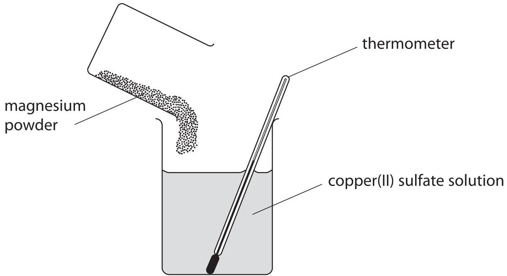
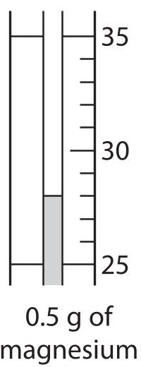
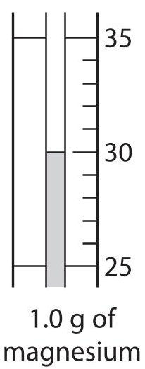
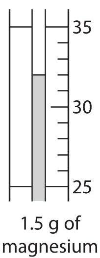
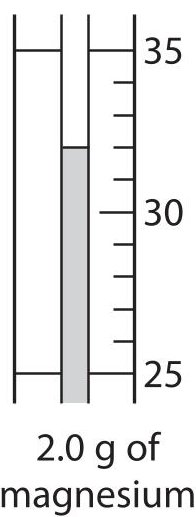
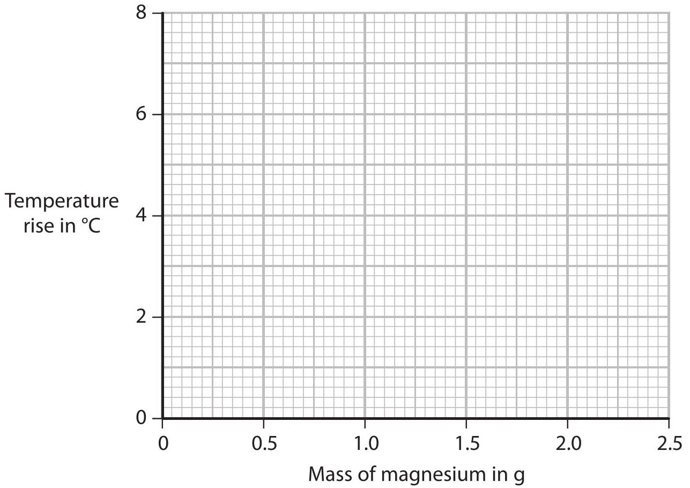
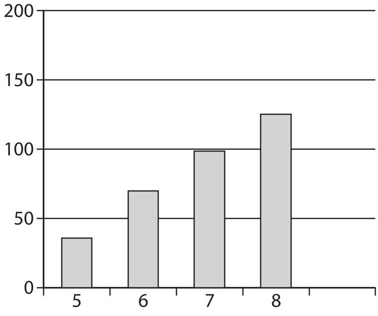
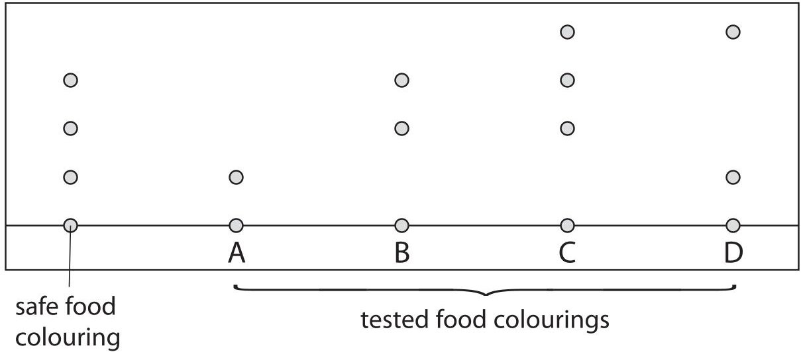
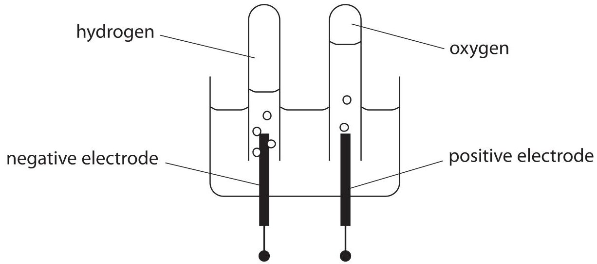

<table><tr><td colspan="3">Write your name here</td></tr><tr><td>Surname</td><td colspan="2">Other names</td></tr><tr><td>Edexcel Certificate</td><td>Centre Number</td><td>Candidate Number</td></tr><tr><td>Edexcel International GCSE</td><td></td><td></td></tr><tr><td colspan="3">Chemistry</td></tr><tr><td colspan="3">Unit: KCH0/4CH0
Paper: 2C</td></tr><tr><td colspan="2">Monday 10 June 2013 – Afternoon
Time: 1 hour</td><td>Paper Reference
KCH0/2C
4CH0/2C</td></tr><tr><td colspan="3">You must have:
Ruler
Calculator</td><td>Total Marks</td></tr></table>

## Instructions

- Use black ink or ball-point pen.

- Fill in the boxes at the top of this page with your name, centre number and candidate number.

- Answer all questions.

- Answer the questions in the spaces provided

- there may be more space than you need.

- Show all the steps in any calculations and state the units.

## Information

- The total mark for this paper is 60.

- The marks for each question are shown in brackets

- use this as a guide as to how much time to spend on each question.

## Advice

- Read each question carefully before you start to answer it.

- Keep an eye on the time.

- Write your answers neatly and in good English.

- Try to answer every question.

- Check your answers if you have time at the end.

<table class="table table-bordered"><thead><tr><th>7 Li Lithium</th><th>9 Be Beryllium</th></tr></thead><tbody><tr><td>23 Na Sodium</td><td>24 Mg Magnesium</td></tr><tr><td>39 K Potassium</td><td>40 Ca Calcium</td></tr><tr><td>86 Rb Rubidium</td><td>88 Sr Strontium</td></tr><tr><td>133 Cs Caesium</td><td>137 Ba Barium</td></tr><tr><td>223 Fr Francium</td><td>226 Ra Radium</td></tr></tbody></table>
## Answer ALL questions.
1 The box shows some methods that can be used in separating mixtures.
<table border="1"><tr><td>crystallisation</td><td>dissolving</td><td>evaporation</td><td>filtration</td></tr><tr><td>paper chromatography</td><td colspan="2">simple distillation</td><td>fractional distillation</td></tr></table>
From the box, select the best method for each of the separations.
You may use each method once, more than once or not at all.
(a) Removing sand from a mixture of sand and water.
(b) Obtaining pure water from a salt solution.
(c) Extracting the red dye from a sample of rose petals.
(d) Separating the coloured dyes in a sample of green ink.
(e) Obtaining ethanol (alcohol) from a mixture of ethanol and water.
(Total for Question 1 = 5 marks)
2 Part of the pH scale is shown.
<table border="1"><tr><td>pH</td><td colspan="3">1-7-14</td></tr><tr><td></td><td>strongly acidic solution</td><td>neutral</td><td>strongly alkaline solution</td></tr></table>
Some of these experiments involve a pH change.
A sodium chloride (common salt) is dissolved in pure water
B carbon dioxide gas is dissolved in pure water
C sodium hydroxide solution is neutralised by adding dilute hydrochloric acid
D excess sodium hydroxide solution is added to a weakly acidic solution
E ammonia gas is dissolved in pure water
The table shows the pH at the start and at the end of the five experiments. Complete the table by inserting the appropriate letter in each box. You may use each letter only once.
The first one has been done for you.
<table border="1"><tr><td>pH at start</td><td>pH at end</td><td>Experiment</td></tr><tr><td>5</td><td>14</td><td>D</td></tr><tr><td>7</td><td>7</td><td></td></tr><tr><td>7</td><td>11</td><td></td></tr><tr><td>14</td><td>7</td><td></td></tr><tr><td>7</td><td>6</td><td></td></tr></table>
(Total for Question 2 = 4 marks)
3 A student measured the temperature change when 0.5 g of magnesium powder was added to $ 5 0 \mathrm{c m}^{3} $ of copper(II) sulfate solution.
She repeated the experiment using 1.0 g, 1.5 g and 2.0 g of magnesium powder.

The diagrams of the thermometer show the highest temperature, in $ ^{\circ} \mathrm{C} $ , reached in each of the experiments.

(a) Use the thermometer readings to complete the table of results.

(2) 

<table border="1"><tr><td>Mass of magnesium in g</td><td>Initial temperature in℃</td><td>Highest temperature in℃</td><td>Temperature rise in℃</td></tr><tr><td>0.5</td><td>25</td><td></td><td></td></tr><tr><td>1.0</td><td>24</td><td></td><td></td></tr><tr><td>1.5</td><td>23</td><td></td><td></td></tr><tr><td>2.0</td><td>23</td><td></td><td></td></tr></table>
(b) A second student carried out the experiment. The table shows his results.
<table border="1"><tr><td>Mass of magnesium in g</td><td>Temperature rise in℃</td></tr><tr><td>0.5</td><td>2</td></tr><tr><td>1.0</td><td>4</td></tr><tr><td>1.5</td><td>6</td></tr><tr><td>2.0</td><td>6</td></tr><tr><td>2.5</td><td>6</td></tr></table>
(i) Plot the points on the grid.
Draw a straight line through the first three points and another straight line through the last two points. Make sure that the two lines cross.

(ii) Use your graph to find the mass of magnesium required to produce a temperature rise of $ 3^{\circ} \mathrm{C}. $
(c) Suggest why the last three temperature rises were the same.
(d) State and explain the effect on the temperature rises if the student were to repeat the experiment using the same masses of zinc powder instead of magnesium powder.
Do not refer to the difference in reactivity of the two metals.
[relative atomic masses: Mg=24; Zn=65]
(Total for Question 3 = 9 marks)
4 (a) Plastic bags used to store food are made from a polymer.
Ethene is the monomer used to make the polymer for some plastic bags.
(i) Name the polymer that is made from ethene.
(ii) Use a word from the box to complete the sentence about ethene.
<table border="1"><tr><td>chromatography</td><td>condensing</td><td>cracking</td><td>crystallising</td></tr></table>

(1) 

Ethene is made by breaking down large hydrocarbon molecules into smaller
hydrocarbon molecules, using a process called ...
(b) The hydrocarbons used to make ethene are called alkanes.
They are obtained from crude oil.
The boiling point of an alkane is related to the number of carbon atoms in the molecule.
<table border="1"><tr><td>Number of carbon atoms in molecule</td><td>5</td><td>6</td><td>7</td><td>8</td><td>9</td></tr><tr><td>Boiling point in℃</td><td>36</td><td>69</td><td>99</td><td>125</td><td>151</td></tr></table>
(i) Use the data in the table to complete the bar chart.

(2) 

Boiling point in $ ^{\circ} \mathrm{C} $

Number of carbon atoms

(ii) What is the relationship between the boiling point of an alkane and the number of carbon atoms in its molecule?
(c) Many plastic bags are not biodegradable.
Used plastic bags can be
A buried underground, which is called landfill
or
B burned to release energy, which also produces large amounts of gases.
Suggest which of these methods of disposal is better for the environment, giving two reasons for your choice.
Choice
Reason 1
Reason 2
(Total for Question 4 = 7 marks)
5 This information was taken from a label on a packet containing a pizza.
<table border="1"><tr><td>Nutritional information</td><td>(per 1/2 pizza)</td></tr><tr><td>Energy</td><td>1260 kJ</td></tr><tr><td>Protein</td><td>14.0 g</td></tr><tr><td>Carbohydrate</td><td>370 g</td></tr><tr><td>sugars</td><td>62 g</td></tr><tr><td>Fat</td><td>106 g</td></tr><tr><td>saturated</td><td>50 g</td></tr><tr><td>unsaturated</td><td>56 g</td></tr></table>
(a) (i) Which type of fat contains a double carbon to carbon (C=C) bond?
(ii) The colour of bromine water is orange.
State the final colour of the mixture after bromine water is shaken with
(iii) What type of reaction takes place when bromine reacts with a compound containing a C=C bond?
(b) In February 2005, some companies had to remove their pizzas from sale because the food colourings in them were found to contain the artificial dye called Sudan 1, which is known to cause cancer.
The chromatogram shows how the dyes in the colourings were detected and identified.

(i) Which one of the food colourings, A, B, C or D, is made up of only one dye?
(ii) Identify the food colourings that may have contained Sudan 1.
(iii) Explain how the chromatogram shows that the five food colourings are different from each other.

(Total for Question 5 = 7 marks)

6 Sodium (Na) and sodium chloride (NaCl) both have lattice structures. Their melting points are shown in the table.
<table border="1"><tr><td></td><td>Melting point in℃</td><td>Type of lattice structure</td></tr><tr><td>sodium</td><td>98</td><td>giant metallic</td></tr><tr><td>sodium chloride</td><td>801</td><td></td></tr></table>
(a) Complete the table by stating the type of lattice structure in sodium chloride.
(b) Explain why sodium and sodium chloride have different melting points. In your answer you should refer to
- the types of particle
- the types of forces between the particles in each substance
(c) The equation shows the reaction of sodium with water.
$$
2 \mathrm {N a} (\mathrm {s}) + 2 \mathrm {H} _ {2} \mathrm {O} (\mathrm {l}) \rightarrow 2 \mathrm {N a O H} (\mathrm {a q}) + \mathrm {H} _ {2} (\mathrm {g})
$$
A sample of sodium of mass 0.138 g reacts with excess water.
Calculate the volume of hydrogen, in $ cm^{3} $ , produced at room temperature and pressure (rtp).
[The volume of one mole of a gas at rtp is $ 2 4 0 0 0 \mathrm{c m}^{3} $]
Volume of gas produced =
(d) Sodium chloride can be made by many different reactions.
A student prepared a sample of sodium chloride using the following method.
Step1 She added an excess of a solid sodium compound, X, to dilute hydrochloric acid. The mixture fizzed as the solid reacted.
Step 2 She filtered the mixture produced to remove the excess solid X. The filtrate was a colourless liquid.
Step 3 She evaporated the colourless liquid. A white solid remained.
(i) Describe a chemical test that the student could do to show that the colourless liquid in Step 2 contained chloride ions, $ \mathrm{C l}^{-} $ .
Test
## Result
(ii) The student concluded that solid X was sodium hydroxide.
State one reason why this conclusion was not correct.
Suggest a possible identity of solid X.
## Reason
Solid X could be
(e) Sodium chloride can also be made by reacting sodium with chlorine gas.
Draw a dot and cross diagram to show the arrangement of the electrons in each of the ions in sodium chloride. Show the charge on each ion.
Show only the outer electrons.
(f) Potassium bromide can be made by reacting potassium with bromine gas.
Explain why it is difficult to be sure whether the reaction between potassium and bromine gas would be more vigorous than the reaction between sodium and chlorine gas.
(Total for Question 6 = 19 marks)
7 (a) The table shows some results of the electrolysis of aqueous solutions using inert electrodes. The solutions were electrolysed under the same conditions. Use the information given to complete the table.

(3) 

<table border="1"><tr><td>Solution</td><td>Product at the negative electrode</td><td>Product at the positive electrode</td><td>Substance left in solution at the end of the electrolysis</td></tr><tr><td>copper(II) sulfate</td><td>copper</td><td>oxygen</td><td>sulfuric acid</td></tr><tr><td>potassium sulfate</td><td>hydrogen</td><td>oxygen</td><td>potassium sulfate</td></tr><tr><td>silver nitrate</td><td>silver</td><td>oxygen</td><td>nitric acid</td></tr><tr><td>silver sulfate</td><td></td><td>oxygen</td><td>sulfuric acid</td></tr><tr><td>potassium nitrate</td><td>hydrogen</td><td></td><td></td></tr></table>
(b) Water can be decomposed by electrolysis using this apparatus.

(i) Suggest a suitable element for the inert electrodes.
(ii) Suggest why a small amount of dilute acid is added to the water before it is electrolysed.
(c) (i) The overall equation for the decomposition of water is
$$
2 \mathrm {H} _ {2} \mathrm {O} (\mathrm {I}) \rightarrow 2 \mathrm {H} _ {2} (\mathrm {g}) + \mathrm {O} _ {2} (\mathrm {g})
$$
Use this equation to explain why the volume of hydrogen collected should be twice that of the volume of oxygen.
(ii) The volume of oxygen collected is always slightly less than expected, even though there are no leaks in the apparatus.
Suggest a reason for this.
(d) The equation represents the formation of hydrogen gas at the negative electrode.
$$
2 \mathrm {H} _ {2} \mathrm {O} (\mathrm {I}) + 2 \mathrm {e} ^ {-} \rightarrow 2 \mathrm {O H} ^ {-} (\mathrm {a q}) + \mathrm {H} _ {2} (\mathrm {g})
$$
During electrolysis, 482 500 coulombs were passed through the solution.
Calculate the amount, in moles, of hydrogen gas formed.
[One faraday=96500coulombs]
Amount of hydrogen gas formed = mol
(Total for Question 7 = 9 marks)
TOTAL FOR PAPER=60 MARKS
## BLANK PAGE
## BLANK PAGE
## BLANK PAGE
