<table><tr><td colspan="3">Write your name here</td></tr><tr><td>Surname</td><td colspan="2">Other names</td></tr><tr><td>Pearson Edexcel Certificate</td><td>Centre Number</td><td>Candidate Number</td></tr><tr><td>Pearson Edexcel International GCSE</td><td></td><td></td></tr><tr><td colspan="3">Chemistry</td></tr><tr><td colspan="3">Unit: KCH0/4CH0
Paper: 2C</td></tr><tr><td colspan="2">Tuesday 10 June 2014 – Afternoon
Time: 1 hour</td><td>Paper Reference
KCH0/2C
4CH0/2C</td></tr><tr><td colspan="3">You must have:
Calculator</td><td>Total Marks</td></tr></table>

## Instructions

- Use black ink or ball-point pen.

- Fill in the boxes at the top of this page with your name, centre number and candidate number.

- Answer all questions.

- Answer the questions in the spaces provided

- there may be more space than you need.

- Show all the steps in any calculations and state the units.

- Some questions must be answered with a cross in a box. If you change your mind about an answer, put a line through the box and then mark your new answer with a cross.

## Information

- The total mark for this paper is 60.

- The marks for each question are shown in brackets

- use this as a guide as to how much time to spend on each question.

## Advice

- Read each question carefully before you start to answer it.

- Keep an eye on the time.

- Write your answers neatly and in good English.

- Try to answer every question.

- Check your answers if you have time at the end.

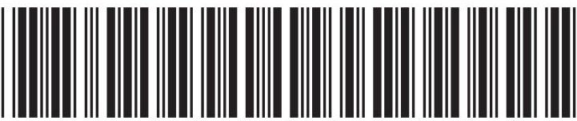

<table class="table table-bordered"><thead><tr><th>7 Li</th><th>9 Be</th></tr></thead><tbody><tr><td>23 Na</td><td>24 Mg</td></tr><tr><td>39 K</td><td>40 Ca</td></tr><tr><td>86 Rb</td><td>88 Sr</td></tr><tr><td>133 Cs</td><td>137 Ba</td></tr><tr><td>223 Fr</td><td>226 Ra</td></tr></tbody></table>

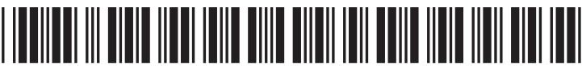

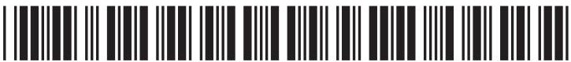

## Answer ALL questions.

1 A student investigates some food colourings, each of which is made up of one or more dyes.

She produces a chromatogram using the safe colourings red (SR), blue (SB) and green (SG) and food colourings red (FR), blue (FB) and green (FG).

The diagram shows her chromatogram.

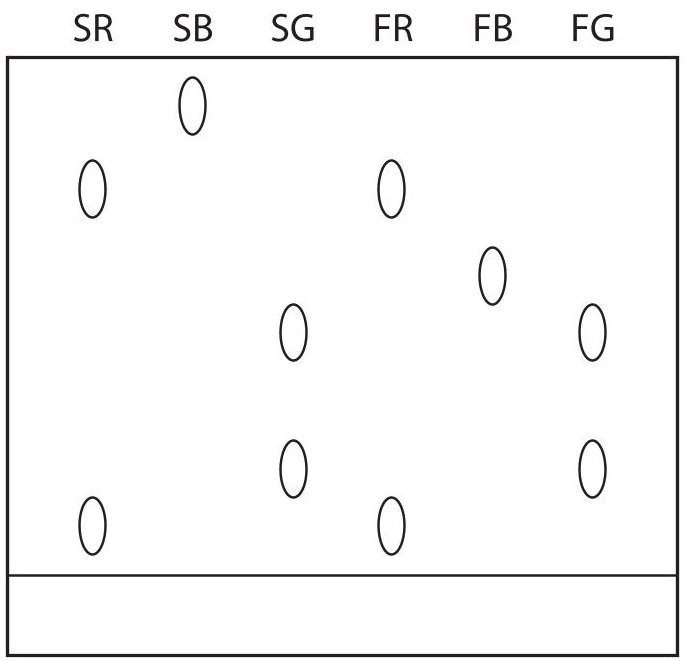

reference line

(a) How many dyes are there in SR?

A1 B2 C3 D4

(b) Complete the table by placing ticks ( $ \checkmark $ ) next to the two food colourings that are definitely safe to use.

Explain your answer.

<table border="1"><tr><td>Food colouring</td><td>Safe to use?</td></tr><tr><td>FR</td><td></td></tr><tr><td>FB</td><td></td></tr><tr><td>FG</td><td></td></tr></table>

explanation

(Total for Question 1 = 3 marks)

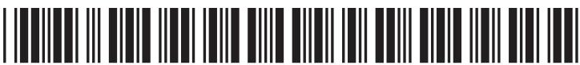

2 This apparatus is used to separate a mixture of ethanol (boiling point 78 $ ^{\circ} \mathrm{C} $) and water (boiling point 100 $ ^{\circ} \mathrm{C} $).

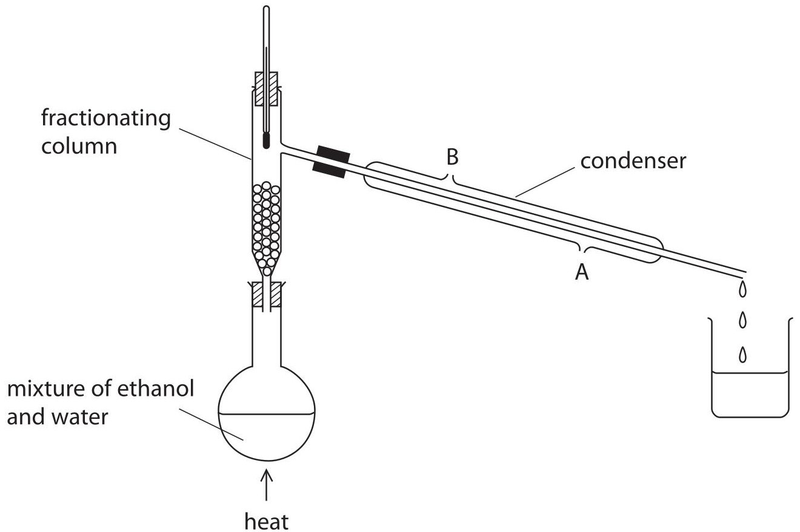

(a) What is the name of this method of separation?

(b) Why can ethanol and water be separated by this method?

(c) Suggest why water should enter the condenser at A rather than B.

(d) Explain why the first liquid to be collected in the beaker is mostly ethanol.

(Total for Question 2 = 4 marks)

3 The diagram shows a section of the Periodic Table and the symbols for the first 20 elements.

<table border="1"><tr><td>Li</td><td>Be</td><td rowspan="3"></td><td rowspan="3"></td><td rowspan="3"></td><td rowspan="3"></td><td rowspan="3"></td><td rowspan="3"></td><td rowspan="3"></td><td rowspan="3"></td><td rowspan="3"></td><td rowspan="3"></td><td>B</td><td>C</td><td>N</td><td>O</td><td>F</td><td>Ne</td></tr><tr><td>Na</td><td>Mg</td><td>Al</td><td>Si</td><td>P</td><td>S</td><td>Cl</td><td>Ar</td></tr><tr><td>K</td><td>Ca</td><td></td><td></td><td></td><td></td><td></td><td></td><td></td><td></td><td></td><td></td></tr></table>

(a) (i) What name is given to a horizontal row of elements such as Na to Ar?

(ii) Name two metals in the row Na to Ar.

(iii) Which is the least reactive element in the row Na to Ar?

Explain your answer.

least reactive element.

explanation ...

(b) State, in terms of electronic configurations, why the elements in the column Li to K have similar chemical properties.

(c) (i) Which element has atomic number 6?

(ii) Which element has atoms with an electronic configuration of 2.8.6?

<table><tr><td>(d) An atom has atomic number 8 and mass number 18.
How many protons, neutrons and electrons does this atom contain?</td><td>(2)</td></tr><tr><td>protons</td><td></td></tr><tr><td>neutrons</td><td></td></tr><tr><td>electrons</td><td></td></tr><tr><td colspan="2">(Total for Question 3 = 9 marks)</td></tr></table>

## BLANK PAGE

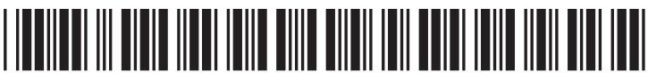

4 A student investigates the rate of reaction between sodium thiosulfate and hydrochloric acid at $ 2 5^{\circ} \mathrm{C} $

The equation for the reaction is

$$
\mathrm {N a} _ {2} \mathrm {S} _ {2} \mathrm {O} _ {3} (\mathrm {a q}) + 2 \mathrm {H C l} (\mathrm {a q}) \rightarrow 2 \mathrm {N a C l} (\mathrm {a q}) + \mathrm {H} _ {2} \mathrm {O} (\mathrm {I}) + \mathrm {S O} _ {2} (\mathrm {g}) + \mathrm {S} (\mathrm {s})
$$

She uses this method.

- pour 50 $ cm^{3} $ of sodium thiosulfate solution into a conical flask

- place the conical flask on top of a sheet of paper with a cross drawn on it

- add 10 $ cm^{3} $ of hydrochloric acid and start the timer

- stop the timer when the cross can no longer be seen and record the time taken

The student repeats the experiment five times with different volumes of sodium thiosulfate solution. She adds water as necessary to keep the total volume of reaction mixture constant.

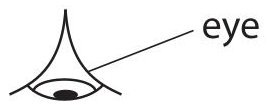

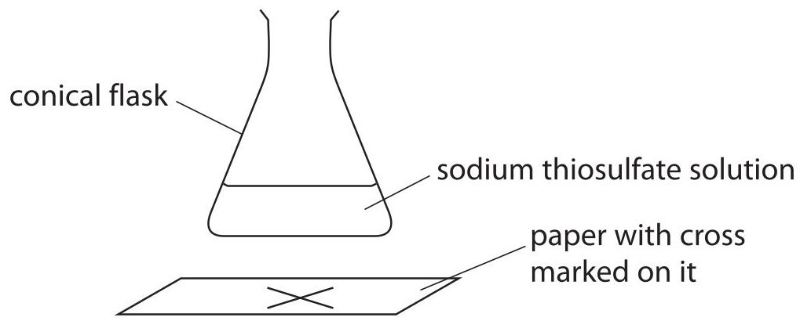

(a) Why can the student no longer see the cross at the end of each experiment?

(b) The student keeps the total volume of the reaction mixture constant in each experiment. Explain how this makes each experiment a fair test.

(c) The table shows the student's results.

<table border="1"><tr><td>Experiment</td><td>Volume of Na2S2O3solution in cm3</td><td>Volume of waterin cm3</td><td>Timein seconds</td></tr><tr><td>1</td><td>50</td><td>0</td><td>45</td></tr><tr><td>2</td><td>40</td><td>10</td><td>60</td></tr><tr><td>3</td><td>30</td><td>20</td><td>80</td></tr><tr><td>4</td><td>20</td><td>30</td><td>130</td></tr><tr><td>5</td><td>15</td><td>35</td><td>180</td></tr><tr><td>6</td><td>10</td><td>40</td><td>255</td></tr></table>

Why is it important for the student to add the water before the acid in experiments 2 to 6?

(d) Sulfur dioxide gas is given off in the reaction.

Suggest a safety precaution that the student should take when doing this experiment. Explain your answer.

precaution.

explanation

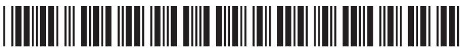

(e) (i) Plot the student's results on the grid and draw a curve of best fit.

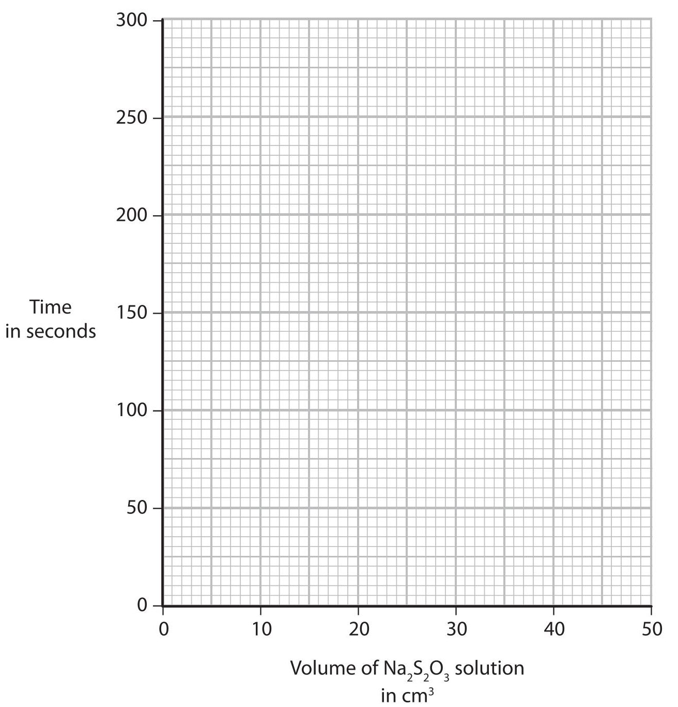

(ii) On the grid, sketch the curve that you would expect if the investigation were repeated at $ 4 0^{\circ} \mathrm{C} $

Assume all other factors remain constant.

(Total for Question 4 = 10 marks)

5 The diagram shows the diaphragm cell used in the electrolysis of concentrated sodium chloride solution, NaCl(aq).

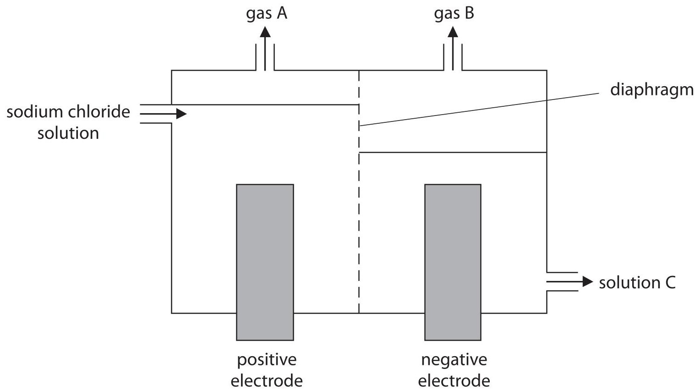

(a) Explain what is meant by the term electrolysis.

(b) Identify gas A, gas B and solution C.

gas A.

gas B.

solution C.

(c) Sodium is manufactured by the electrolysis of molten sodium chloride, NaCl(l).

Sodium is produced at the negative electrode and chlorine is produced at the positive electrode.

(i) Why does the sodium chloride have to be molten before it will conduct electricity?

(ii) The ionic half-equation for the formation of sodium is

$$
\mathrm {N a} ^ {+} + \mathrm {e} ^ {-} \rightarrow \mathrm {N a}
$$

Write the ionic half-equation for the formation of chlorine from chloride ions.

(Total for Question 5 = 8 marks)

6 Solid X contains two cations (positive ions) and one anion (negative ion).

One of the cations is $ \mathrm{F e}^{3+} $

(a) The table describes the tests carried out on an aqueous solution of X and some of the observations made.

Complete the table by giving the missing observation.

<table border="1"><tr><td>Test</td><td>Observation</td></tr><tr><td>add sodium hydroxide solution</td><td></td></tr><tr><td>then heat the mixture and test the gas given off with damp red litmus paper</td><td>litmus paper turns blue</td></tr><tr><td>add dilute hydrochloric acid, then add a few drops of barium chloride solution</td><td>white precipitate forms</td></tr></table>

(b) (i) Which cation, other than $ \mathrm{F e}^{3+} $ , is present in X? Explain your answer.

cation.

explanation

(ii) Identify the anion present in X.

(c) When zinc is added to a solution containing $ \mathrm{F e}^{3+} $ ions, a reaction occurs.

The ionic equation for this reaction is

$$
\mathrm {Z n} (\mathrm {s}) + 2 \mathrm {F e} ^ {3 +} (\mathrm {a q}) \rightarrow \mathrm {Z n} ^ {2 +} (\mathrm {a q}) + 2 \mathrm {F e} ^ {2 +} (\mathrm {a q})
$$

Identify the reducing agent in this reaction and explain your choice.

reducing agent.

explanation

(Total for Question 6 = 6 marks)

7 (a) The first two members of the homologous series of alcohols are methanol and ethanol.

(i) Give two characteristics of the compounds in a homologous series.

(ii) The displayed formula for methanol is

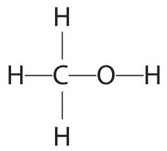

Suggest a displayed formula for ethanol, $ \mathrm{C H_{3} C H_{2} O H} $

(1) 

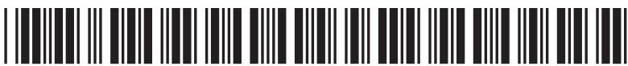

(b) The table shows the two different processes for making ethanol on a large scale.

<table border="1"><tr><td>Process</td><td>Explanation</td></tr><tr><td>batch process</td><td>the fermentation of sugars with yeast</td></tr><tr><td>continuous process</td><td>the hydration of ethene (produced from crude oil) with steam</td></tr></table>

Compare the two processes in terms of

- the rate at which the ethanol can be produced

- the purity of the product

- the use of finite resources

(c) The equation for the fermentation of glucose is

$$
C _ {6} H _ {1 2} O _ {6} \rightarrow 2 C H _ {3} C H _ {2} O H + 2 C O _ {2}
$$

A mass of 3600 kg of glucose was completely fermented.

(i) Calculate the amount, in moles, of glucose that was fermented. $ ( M_{r} $ of glucose=180)

(ii) Deduce the amount, in moles, of ethanol produced in this reaction.

(iii) Calculate the volume, in $ \mathrm{d m^{3}} $ at rtp, of carbon dioxide produced in this reaction. (1 mol of carbon dioxide occupies $ 2 4 \mathrm{d m^{3}} $ at rtp)

<table><tr><td>volume of carbon dioxide =</td><td>dm3</td></tr></table>

## BLANK PAGE

8 The hydrogen needed for the manufacture of ammonia is made by a process called steam reforming.

In this process, a mixture of methane and steam is passed over a nickel catalyst.

The equation for the reaction is

$$
\mathrm {C H} _ {4} (\mathrm {g}) + \mathrm {H} _ {2} \mathrm {O} (\mathrm {g}) \rightleftharpoons \mathrm {C O} (\mathrm {g}) + 3 \mathrm {H} _ {2} (\mathrm {g}) \quad \Delta H = + 2 1 0 \mathrm {k J / m o l}
$$

(a) In this part of the question, assume that the reaction reaches a position of equilibrium.

(i) Predict whether a high or low temperature would produce the highest yield of hydrogen. Give a reason for your choice.

prediction reason ...

(ii) Predict whether a high or low pressure would produce the highest yield of hydrogen. Give a reason for your choice.

prediction reason ...

(b) Explain how a catalyst increases the rate of a reaction.

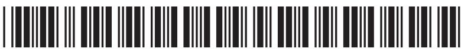

(c) Some of the carbon monoxide produced is removed in another reaction. In this reaction, carbon monoxide is mixed with steam and passed over a heated catalyst. The reaction is reversible and the carbon monoxide is oxidised to carbon dioxide.

(i) Write a chemical equation for this reaction.

(ii) Explain why the carbon in carbon monoxide is oxidised in this reaction.

(iii) The carbon dioxide produced can be removed by passing the gas through a solution of potassium carbonate, $ \mathrm{K_{2} C O_{3}} $

The potassium carbonate reacts with carbon dioxide and water to form potassium hydrogencarbonate, $ \mathrm{KHCO}_{3} $

Write a chemical equation for this reaction.

(Total for Question 8 = 9 marks)

## TOTAL FOR PAPER = 60 MARKS

## BLANK PAGE

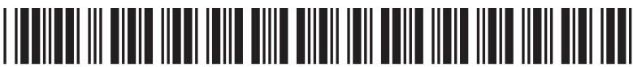

## BLANK PAGE

## BLANK PAGE

