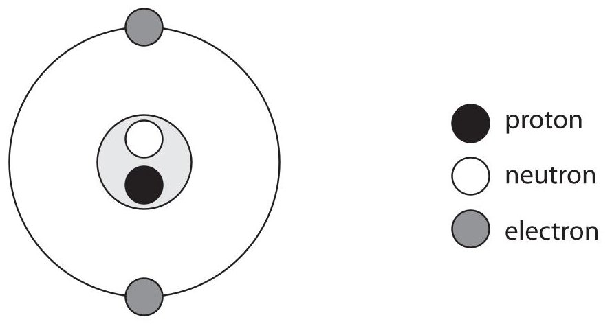
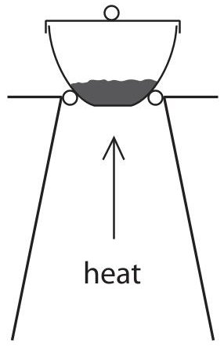
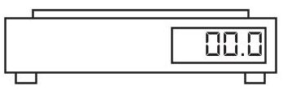
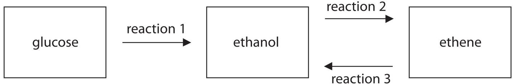
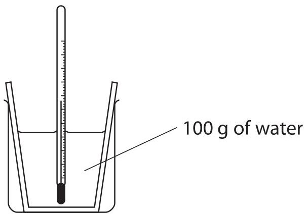
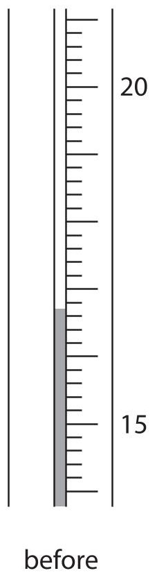
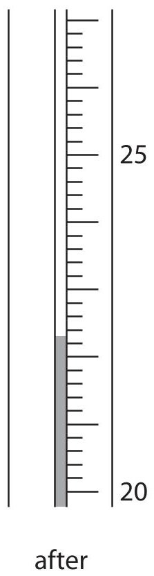
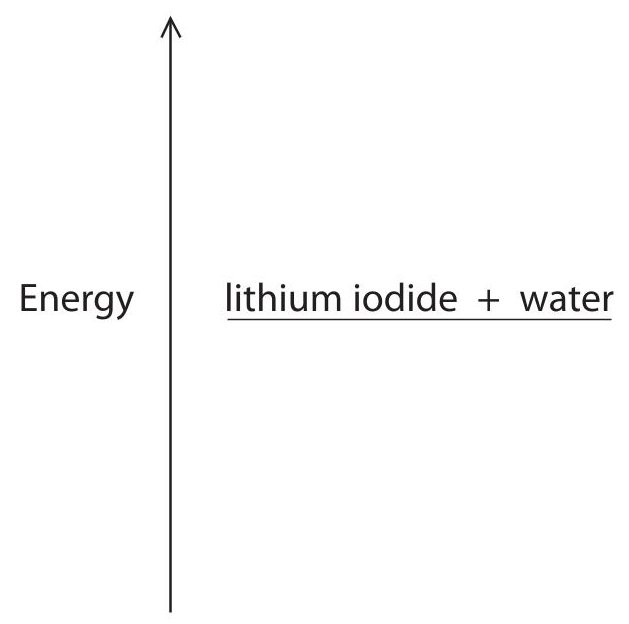

<table><tr><td colspan="2">Write your name here</td></tr><tr><td>Surname</td><td>Other names</td></tr><tr><td>Pearson Edexcel Certificate</td><td>Centre Number</td><td>Candidate Number</td></tr><tr><td>Pearson Edexcel International GCSE</td><td></td><td></td></tr><tr><td colspan="3">Chemistry</td></tr><tr><td colspan="3">Unit: KCH0/4CH0
Paper: 2C</td></tr><tr><td colspan="2">Tuesday 9 June 2015 – Afternoon
Time: 1 hour</td><td>Paper Reference
KCH0/2C
4CH0/2C</td></tr><tr><td colspan="3">You must have:
Calculator, ruler</td><td>Total Marks</td></tr></table>

## Instructions

- Use black ink or ball-point pen.

- Fill in the boxes at the top of this page with your name, centre number and candidate number.

- Answer all questions.

- Answer the questions in the spaces provided

- there may be more space than you need.

- Show all the steps in any calculations and state the units.

- Some questions must be answered with a cross in a box. If you change your mind about an answer, put a line through the box and then mark your new answer with a cross.

## Information

- The total mark for this paper is 60.

- The marks for each question are shown in brackets

- use this as a guide as to how much time to spend on each question.

## Advice

- Read each question carefully before you start to answer it.

- Keep an eye on the time.

- Write your answers neatly and in good English.

- Try to answer every question.

- Check your answers if you have time at the end.

<table class="table table-bordered"><thead><tr><th>7 Li</th><th>9 Be</th></tr></thead><tbody><tr><td>23 Na</td><td>24 Mg</td></tr><tr><td>39 K</td><td>40 Ca</td></tr><tr><td>86 Rb</td><td>88 Sr</td></tr><tr><td>133 Cs</td><td>137 Ba</td></tr><tr><td>223 Fr</td><td>226 Ra</td></tr></tbody></table>
## Answer ALL questions.
1 The table shows the numbers of protons, neutrons and electrons in some atoms and ions.
<table border="1"><tr><td>Atom or ion</td><td>Protons</td><td>Neutrons</td><td>Electrons</td></tr><tr><td>P</td><td>6</td><td>8</td><td>6</td></tr><tr><td>Q</td><td>5</td><td>6</td><td>5</td></tr><tr><td>R</td><td>9</td><td>10</td><td>10</td></tr><tr><td>S</td><td>3</td><td>4</td><td>2</td></tr><tr><td>T</td><td>6</td><td>6</td><td>6</td></tr></table>
(a) (i) Which particles have the same mass?
A electrons and protons
B electrons and neutrons
C neutrons and protons
D electrons, neutrons and protons
(ii) What is the atomic number of P?
A 6
B 8
C 12
D 14
(iii) What is the mass number of Q?
A 5
B 6
C 10
D 11
(b) Which group of the Periodic Table contains element T?
(c) (i) Which two letters represent isotopes of the same element?
(ii) Which letter represents a positive ion?
(d) The diagram shows the arrangement of particles in another ion.

How does the diagram show that this ion has a negative charge?

(Total for Question 1 = 7 marks)

2 The equation for the thermal decomposition of copper(II) carbonate is
$$
\mathrm {C u C O} _ {3} (\mathrm {s}) \rightarrow \mathrm {C u O} (\mathrm {s}) + \mathrm {C O} _ {2} (\mathrm {g})
$$
A student investigates the decomposition of copper(II) carbonate using this apparatus.

She uses this method.
- weigh the crucible, lid and copper(II) carbonate
- heat the crucible, lid and contents for 2 minutes
- allow to cool and then reweigh
- heat for a second period of 2 minutes
- allow to cool and then reweigh
- heat for a third period of 2 minutes
- allow to cool and then reweigh
The table shows the student's results.
<table border="1"><tr><td></td><td colspan="4">Mass of crucible, lid and contents in grams</td></tr><tr><td>Experiment</td><td>before heating</td><td>after heating for2minutes</td><td>after heating for4minutes</td><td>after heating for6minutes</td></tr><tr><td>1</td><td>26.3</td><td>23.0</td><td>21.9</td><td>21.4</td></tr><tr><td>2</td><td>25.8</td><td>22.7</td><td>21.5</td><td>21.5</td></tr><tr><td>3</td><td>26.0</td><td>23.0</td><td>21.2</td><td>21.2</td></tr><tr><td>4</td><td>26.1</td><td>23.2</td><td>21.8</td><td>21.8</td></tr></table>
(a) Why does the mass decrease during heating?
(b) State the colours of the solids in the reaction.
$$
\mathrm {C u C O} _ {3} (\mathrm {s})
$$
(c) (i) In which experiment might the decomposition not be complete?
(ii) Give a reason for your choice.
(iii) Which statement could explain why the decomposition might not be complete?
A The student used a higher temperature than in the other experiments.
B The student used less copper(II) carbonate than in the other experiments.
C The student heated the crucible without a lid on.
D The student used a spirit burner instead of a Bunsen burner.
(d) In another experiment, the student calculates that she should obtain a mass of 3.7 g of $ \mathrm{C u O} ( \mathrm{s} ) $ after completely decomposing a sample of $ \mathrm{C u C O}_{3} ( \mathrm{s} ) $ .
She actually obtains a mass of 3.4 g of CuO(s).
Calculate the percentage yield in her experiment.
## BLANK PAGE
3 This question is about halogens and halides.
(a) At room temperature bromine is
A a brown gas
B a red-brown liquid
C a colourless liquid
D a grey solid
(b) Sodium reacts with bromine to form sodium bromide.
Balance the equation for this reaction.
(c) A student carries out some experiments to investigate displacement reactions. She adds some halogen solutions to halide solutions and observes whether a reaction occurs.
The table shows her results.
<table border="1"><tr><td></td><td colspan="3">Halogen solution added</td></tr><tr><td>Halide solution</td><td>bromine</td><td>chlorine</td><td>iodine</td></tr><tr><td>lithium chloride</td><td>no reaction</td><td>(not done)</td><td>no reaction</td></tr><tr><td>sodium bromide</td><td>(not done)</td><td>reaction occurs</td><td>no reaction</td></tr><tr><td>potassium iodide</td><td>reaction occurs</td><td>reaction occurs</td><td>(not done)</td></tr></table>
(i) The table shows that she did not do three experiments. Suggest why she did not do these experiments.
(ii) The table shows that there was no reaction in three experiments. Why was there no reaction in these experiments?
(iii) The student writes this word equation for one of the experiments in which a reaction occurs.
$$
\mathrm {b r o m i n e} + \mathrm {p o t a s s i u m i o d i d e} \rightarrow \mathrm {p o t a s s i u m b r o m i n e} + \mathrm {i o d i n e}
$$
The name of one of the substances is incorrect.
Write the correct name of this substance.
(iv) A reaction occurs when the student adds chlorine solution to potassium iodide solution.
Complete the chemical equation for this reaction.
$$
\mathrm {C l} _ {2} +
$$
(v) All displacement reactions are examples of redox reactions.
State the meaning of the term redox.
(vi) The ionic equation for another reaction is
$$
\mathrm {B r} _ {2} + 2 \mathrm {I} ^ {-} \rightarrow 2 \mathrm {B r} ^ {-} + \mathrm {I} _ {2}
$$
Explain which species is oxidised in this reaction.
(Total for Question 3 = 10 marks)
4 The scheme shows some reactions involving ethanol.

(a) (i) Two conditions used in reaction 1 are
- a temperature of about 30 $ ^{\circ} \mathrm{C} $
- the use of water as a solvent for the glucose
State the name of the catalyst used in this reaction.
(ii) Complete the equation for reaction 1.
$$
\mathrm {C} _ {6} \mathrm {H} _ {1 2} \mathrm {O} _ {6} \rightarrow 2 \mathrm {C} _ {2} \mathrm {H} _ {5} \mathrm {O H} + \dots \dots
(b) Ethanol can also be manufactured by reaction 3, which uses steam, a catalyst of phosphoric acid and a pressure of about 65 atm.
State the temperature used in reaction 3.
(c) State the type of reaction that occurs in
reaction 1
reaction 3
(d) State two advantages of using reaction 3 to manufacture ethanol rather than reaction 1.
(e) Give a reason why some countries use reaction 1 to manufacture ethanol.
(f) Reaction 2 may be used in the future to manufacture ethene.
(i) Write an equation for this reaction.
(ii) What type of reaction is this?
(Total for Question 4 = 10 marks)
5 A student uses this apparatus to measure the temperature change when lithium iodide dissolves in water.

He measures the steady temperature of the water before adding the lithium iodide.
He then adds the lithium iodide, stirs the mixture until all the solid dissolves and records the maximum temperature reached.
The diagram shows the thermometer readings before and after dissolving the lithium iodide.

(a) Use the readings to complete the table.
<table border="1"><tr><td>Temperature in $ ^{\circ} \mathrm{C} $ after adding lithium iodide</td><td></td></tr><tr><td>Temperature in $ ^{\circ} \mathrm{C} $ before adding lithium iodide</td><td></td></tr><tr><td>Temperature change in $ ^{\circ} \mathrm{C} $</td><td></td></tr></table>
(b) In a second experiment, using the same mass of water, the student records a temperature increase of $ 4. 9 \mathrm{~} ^ {\circ} \mathrm{C}. $
(i) Use this expression to calculate the heat energy change in this experiment.
heat energy change = mass of water $ \times $ 4.2 $ \times $ temperature change (in joules) (in grams) (in $ ^{\circ} C $)
heat energy change =
(ii) In this experiment, 6.3 g of lithium iodide were used.
Calculate the amount, in moles, of lithium iodide in 6.3 g.
[ $ M_{\mathrm{r}} $ of lithium iodide=134]
(c) In a third experiment the student obtains these results.
<table border="1"><tr><td>heat energy change in J</td><td>2400</td></tr><tr><td>amount of lithium iodide in mol</td><td>0.048</td></tr></table>
(i) Calculate the molar enthalpy change, in kJ/mol, in this experiment.
(ii) The temperature change in this experiment shows that dissolving lithium iodide in water to form lithium iodide solution is an exothermic process.
Complete the energy level diagram to show the position of the lithium iodide solution.
Label the diagram to show $ \Delta H $ , the molar enthalpy change.

6 Magnesium and its compounds have many uses.
Magnesium is never found as an element in the Earth's crust, but its compounds occur naturally in rocks and seawater.
(a) Suggest why magnesium is not found as an element in the Earth's crust.
(b) Magnesium can be extracted from seawater by a multi-stage process.
stage1 calcium hydroxide reacts with magnesium chloride in seawater to form a precipitate of magnesium hydroxide
stage 2 the magnesium hydroxide is filtered off and converted into magnesium chloride solution by reacting it with hydrochloric acid
stage 3 the magnesium chloride solution is converted into solid magnesium chloride
stage 4 the solid magnesium chloride is melted and electrolysed
(i) Which stage involves a neutralisation reaction?
A stage 1
B stage 2
C stage 3
D stage 4
(ii) Suggest the name of the other product formed in stage 1.
(iii) What happens to the ions in magnesium chloride during melting?
(iv) The ionic half-equation for the reaction at the negative electrode in stage 4 is
$$
\mathrm {M g} ^ {2 +} + 2 \mathrm {e} ^ {-} \rightarrow \mathrm {M g}
$$
Write the ionic half-equation for the reaction at the positive electrode.
(c) A manufacturer makes a batch of magnesium by electrolysing magnesium chloride.
(i) Calculate the mass of magnesium chloride $ \mathrm{(M g C l_{2})} $ needed to make 48 kg of magnesium.
(ii) Calculate the amount, in moles, of electrons needed to make 48 kg of magnesium.
## QUESTION 6 CONTINUES ON THE NEXT PAGE
(d) Magnesium oxide can be used to make magnesium sulfate by this reaction.
$$
\mathrm {M g O (s)} + \mathrm {H} _ {2} \mathrm {S O} _ {4} (\mathrm {a q}) \rightarrow \mathrm {M g S O} _ {4} (\mathrm {a q}) + \mathrm {H} _ {2} \mathrm {O (I)}
$$
A student is provided with a beaker of dilute sulfuric acid.
Outline the steps she should use to obtain a pure sample of hydrated magnesium sulfate crystals using this reaction.
## (Total for Question 6 = 14 marks)
## TOTAL FOR PAPER = 60 MARKS
Every effort has been made to contact copyright holders to obtain their permission for the use of copyright material. Pearson Education Ltd. will, if notified, be happy to rectify any errors or omissions and include any such rectifications in future editions.
