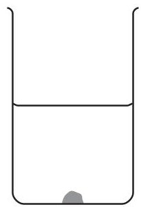
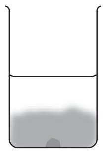
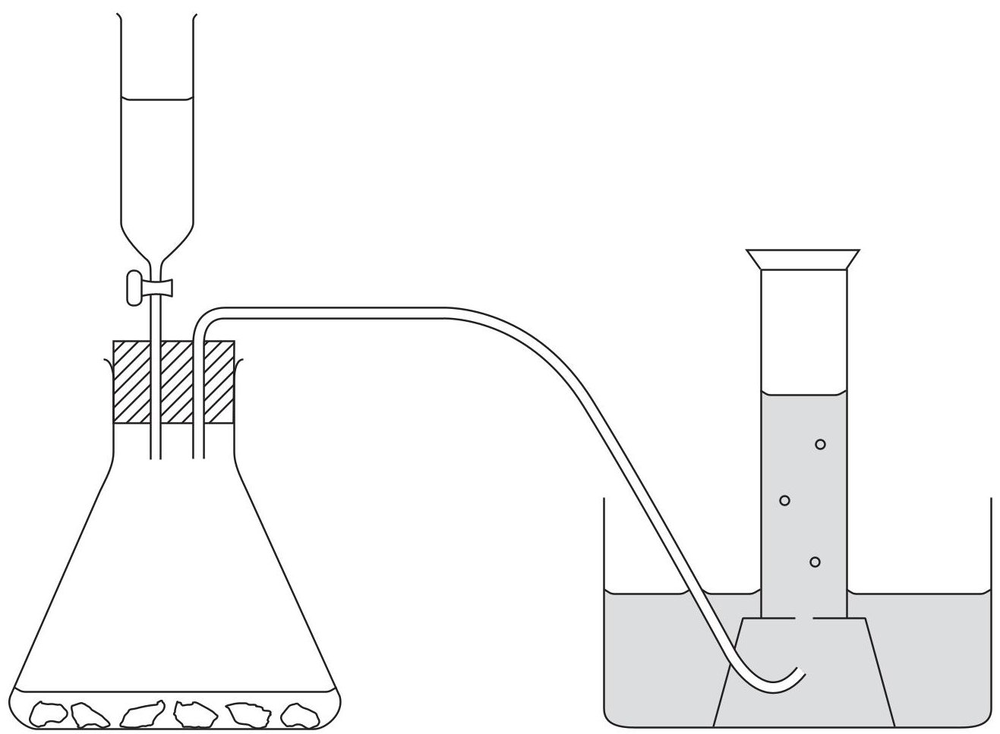
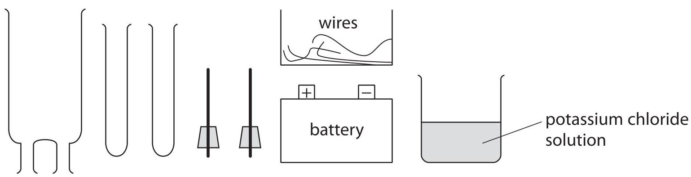
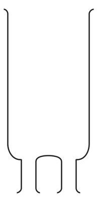
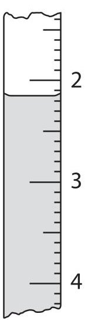
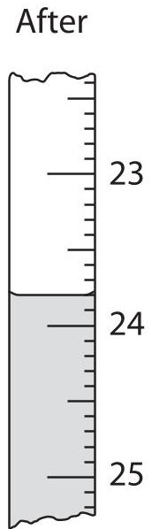

<table><tr><td colspan="3">Write your name here</td></tr><tr><td>Surname</td><td colspan="2">Other names</td></tr><tr><td>Pearson Edexcel International GCSE</td><td>Centre Number</td><td>Candidate Number</td></tr><tr><td colspan="3">Chemistry
Unit: 4CH0
Paper: 2CR</td></tr><tr><td colspan="2">Wednesday 15 June 2016 – Afternoon
Time: 1 hour</td><td>Paper Reference
4CH0/2CR</td></tr><tr><td colspan="3">You must have:
Ruler
Calculator</td></tr><tr><td colspan="3">Total Marks</td></tr></table>

## Instructions

- Use black ink or ball-point pen.

- Fill in the boxes at the top of this page with your name, centre number and candidate number.

- Answer all questions.

- Answer the questions in the spaces provided

- there may be more space than you need.

- Show all the steps in any calculations and state the units.

- Some questions must be answered with a cross in a box. If you change your mind about an answer, put a line through the box and then mark your new answer with a cross.

## Information

- The total mark for this paper is 60.

- The marks for each question are shown in brackets

- use this as a guide as to how much time to spend on each question.

## Advice

- Read each question carefully before you start to answer it.

- Write your answers neatly and in good English.

- Try to answer every question.

- Check your answers if you have time at the end.

<table class="table table-bordered"><thead><tr><th>1</th><th>2</th><th>3</th><th>4</th><th>5</th><th>6</th><th>7</th><th>8</th><th>9</th><th>10</th></tr></thead><tbody><tr><td>7 Li Lithium 3</td><td>9 Be Beryllium 4</td><td></td><td></td><td></td><td></td><td></td><td></td><td></td><td></td><td></td></tr><tr><td>23 Na Sodium 11</td><td>24 Mg Magnesium 12</td><td></td><td></td><td></td><td></td><td></td><td></td><td></td><td></td><td></td></tr><tr><td>39 K Potassium 19</td><td>40 Ca Calcium 20</td><td>45 Sc Scandium 21</td><td>48 Ti Titanium 22</td><td>51 V Vanadium 23</td><td>52 Cr Chromium 24</td><td>55 Mn Manganese 25</td><td>56 Fe Iron 26</td><td>59 Co Cobalt 27</td><td>59 Ni Nickel 28</td><td>63.5 Cu Copper 29</td><td>65 Zn Zinc 30</td><td>70 Ga Gallium 31</td><td>73 Ge Germanium 32</td><td>75 As Arsenic 33</td><td>79 Se Selenium 34</td><td>80 Br Bromine 35</td><td>84 Kr Krypton 36</td></tr><tr><td>86 Rb Rubidium 37</td><td>88 Sr Strontium 38</td><td>89 Y Yttrium 39</td><td>91 Zr Zirconium 40</td><td>93 Nb Niobium 41</td><td>96 Mo Molybdenum 42</td><td>99 Tc Technetium 43</td><td>101 Ru Ruthenium 44</td><td>103 Rh Rhodium 45</td><td>106 Pd Palladium 46</td><td>108 Ag Silver 47</td><td>112 Cd Cadmium 48</td><td>115 In Indium 49</td><td>119 Sn Tin 50</td><td>122 Sb Antimony 51</td><td>128 Te Tellurium 52</td><td>127 I Iodine 53</td><td>131 Xe Xenon 54</td></tr><tr><td>133 Cs Caesium 55</td><td>137 Ba Barium 56</td><td>139 La Lanthanum 57</td><td>179 Hf Hafnium 72</td><td>181 Ta Tantalum 73</td><td>184 W Tungsten 74</td><td>186 Re Rhenium 75</td><td>190 Os Osmium 76</td><td>192 Ir Iridium 77</td><td>195 Pt Platinum 78</td><td>197 Au Gold 79</td><td>201 Hg Mercury 80</td><td>204 Tl Thallium 81</td><td>207 Pb Lead 82</td><td>209 Bi Bismuth 83</td><td>210 Po Polonium 84</td><td>210 At Astatine 85</td><td>222 Rn Radon 86</td></tr><tr><td>223 Fr Francium 87</td><td>226 Ra Radium 88</td><td>227 Ac Actinium 89</td><td></td><td></td><td></td><td></td><td></td><td></td><td></td><td></td><td></td><td></td><td></td><td></td><td></td><td></td></tr></tbody></table>

## Answer ALL questions.

1 Hydrated copper(II) sulfate is a soluble blue solid. A large crystal of this solid is placed at the bottom of a beaker of water.

The diagram shows the beaker immediately after placing the crystal in it, and after two days.

after placing the crystal

after two days

(a) After two days, the crystal becomes smaller and the liquid near the bottom of the beaker becomes blue.

Which statement explains these observations?

A the crystal dissolves

B the crystal freezes

C the crystal melts

D the crystal sublimes

(b) After two weeks, the crystal has disappeared.

Which statement best describes the appearance of the liquid in the beaker after two weeks?

A it is all blue

B it is all brown

C only the lower part is blue

D only the upper part is blue

(c) The formula of the compound in the crystal is $ \mathrm{C u S O_{4}. 5 H_{2}O} $

(i) How many different elements are shown in the formula?

(ii) How many atoms are shown in the formula?

(Total for Question 1 = 4 marks)

2 Iron is a metal with many uses. One problem with using iron is that it rusts.

(a) Name two substances needed for iron to rust. (2)

...and...

(b) State the name of the main compound present in rust.

(c) The table shows three methods used to protect iron from rusting.

Choose three of the objects from the box to complete the table. You may choose an object only once.

bicycle chain bucket car body

car engine food can railway bridge

<table border="1"><tr><td>Method</td><td>Example of use</td></tr><tr><td>galvanising</td><td></td></tr><tr><td>oiling</td><td></td></tr><tr><td>painting</td><td></td></tr></table>

(d) An iron object is coated with zinc to protect it from rusting. This protection continues even if the zinc coating becomes scratched.

Explain how the zinc coating protects iron from rusting.

(Total for Question 2 = 8 marks)

3 This question is about some gases present in air.

(a) Which is the most common gas in dry air?

A argon

B carbon dioxide

nitrogen

D oxygen

(b) Which gas makes up about 1 % of dry air?

A argon

B carbon dioxide

nitrogen

D oxygen

(c) A piece of copper is heated in air.

State the formula and colour of the compound formed.

formula.

colour..

(d) The diagram shows apparatus that can be used to prepare carbon dioxide in the laboratory.

A calcium chloride solution

(i) The liquid in the tap funnel is

(1) 

B concentrated sulfuric acid

C dilute hydrochloric acid

D hydrogen peroxide solution

(ii) The solid in the conical flask is

(1) 

A calcium carbonate

B calcium sulfate

C copper(II) oxide

D manganese(IV) oxide

(iii) The diagram shows the gas being collected over water. Suggest another way to collect the gas.

(1) 

(e) Limewater can be used in a test for carbon dioxide.

(i) Complete this equation, by inserting state symbols, for the reaction used to test for carbon dioxide.

$$
\mathrm {C O} _ {2} (\dots \dots \dots \dots \dots \dots) + \mathrm {C a} (\mathrm {O H}) _ {2} (\dots \dots \dots \dots \dots) \rightarrow \mathrm {C a C O} _ {3} (\dots \dots \dots \dots \dots) + \mathrm {H} _ {2} \mathrm {O} (\dots \dots \dots \dots \dots)
$$

(ii) State the observation made in this test.

(Total for Question 3 = 9 marks)

## BLANK PAGE

4 A student investigates electrolysis using this apparatus.

(a) The student electrolyses KCl(aq) and collects samples of any gases formed.

Complete the following diagram to show how to assemble the apparatus. Label the diagram to show the potassium chloride solution.

(b) The table shows the half-equation for the reaction at one electrode.

Complete the table to show the half-equation for the reaction at the other electrode and the polarity (+ or -) of each electrode.

<table border="1"><tr><td>Polarity</td><td>Equation</td></tr><tr><td></td><td>$2H_{2}O+2e^{-}\rightarrow H_{2}+2OH^{-}$</td></tr><tr><td></td><td></td></tr></table>

(c) Describe a test to show that the gas collected is hydrogen.

(Total for Question 4 = 6 marks)

5 Potassium and lithium are Group 1 metals that exist as isotopes.

(a) (i) Complete the table of information about two isotopes of potassium.

<table border="1"><tr><td>Atomic number</td><td>Mass number</td><td>Number of protons</td><td>Number of neutrons</td></tr><tr><td>19</td><td>39</td><td></td><td></td></tr><tr><td></td><td></td><td>19</td><td>22</td></tr></table>

(ii) A sample of lithium has this percentage composition by mass.

$$
^ {6} \mathrm {L i} = 7. 4 \% \quad^ {7} \mathrm {L i} = 9 2. 6 \%
$$

Use this information to calculate the relative atomic mass of lithium. Give your answer to one decimal place.

relative atomic mass of lithium=

(b) A reaction occurs when a small piece of potassium is added to water in a trough. State two observations that could be made during the reaction.

(c) A few drops of phenolphthalein are added to the liquid in the trough at the end of the reaction. A colour change occurs.

(i) State the final colour of the liquid in the trough.

(ii) Give the formula of the ion formed during the reaction that causes this colour change.

(d) The electronic configurations of lithium and potassium are Li 2,1 K 2,8,8,1

Explain why potassium is more reactive than lithium.

(Total for Question 5 = 11 marks)

6 Lithium hydroxide (LiOH) and lithium peroxide $ \left( \mathrm{L i}_{2} \mathrm{O}_{2} \right) $ have been used in spacecraft to remove the carbon dioxide astronauts breathe out.

The equations for the reactions with carbon dioxide are

$$
2 \mathrm {L i O H} + \mathrm {C O} _ {2} \rightarrow \mathrm {L i} _ {2} \mathrm {C O} _ {3} + \mathrm {H} _ {2} \mathrm {O}
$$

$$
2 \mathrm {L i} _ {2} \mathrm {O} _ {2} + 2 \mathrm {C O} _ {2} \rightarrow 2 \mathrm {L i} _ {2} \mathrm {C O} _ {3} + \mathrm {O} _ {2}
$$

(a) Explain, with reference to these equations, two advantages of using lithium peroxide rather than lithium hydroxide, to remove carbon dioxide from the air in a spacecraft.

(b) (i) Calculate the mass of lithium hydroxide needed to react with 100 g of carbon dioxide. $ [ M_{r} $ of $ \mathrm{L i O H}=2 4 ] $

(ii) Calculate the volume of carbon dioxide, at room temperature and pressure, removed by 100 g of lithium peroxide.

[M $ _{r} $ of $ \mathrm{L i}_{2} \mathrm{O}_{2}=4 6 $]

Assume that one mole of gas has a volume of 24000 $ cm^{3} $ at rtp.

7 This question is about the laboratory preparation of salts.

(a) A student writes this plan for preparing a sample of hydrated magnesium sulfate crystals.

step1 Pour about 100 $ cm^{3} $ of dilute nitric acid into a 250 $ cm^{3} $ beaker.

step 2 Add a solution of magnesium carbonate to the acid until there is no more effervescence.

step 3 Heat the solution until all of the water has boiled off.

This plan will not succeed because there is one mistake in each step. Identify the mistake in each of the steps.

(b) Another student uses the following plan to prepare a sample of ammonium hydrogenphosphate, formed in this reaction between aqueous ammonia and dilute phosphoric acid

$$
2 \mathrm {N H} _ {3} (\mathrm {a q}) + \mathrm {H} _ {3} \mathrm {P O} _ {4} (\mathrm {a q}) \rightarrow (\mathrm {N H} _ {4}) _ {2} \mathrm {H P O} _ {4} (\mathrm {a q})
$$

- use a pipette to transfer 25.0 $ cm^{3} $ of phosphoric acid to a conical flask

- add 3 drops of indicator

- use a burette to add aqueous ammonia until the indicator just changes colour permanently

(i) The diagram shows the burette readings in one experiment before and after adding aqueous ammonia.

Use the readings to complete the table, entering all values to the nearest 0.05 $ cm^{3}. $

<table border="1"><tr><td>burette reading in $ \mathrm{c m^{3}} $ after adding aqueous ammonia</td><td></td></tr><tr><td>burette reading in $ \mathrm{c m^{3}} $ before adding aqueous ammonia</td><td></td></tr><tr><td>volume in $ \mathrm{c m^{3}} $ of aqueous ammonia added</td><td></td></tr></table>

(ii) In another titration, the student made a mistake. After he filled the burette, he noticed that the space between the tap of the burette and the tip contained air. After adding the aqueous ammonia, he noticed that it now contained liquid.

Explain how, if at all, this mistake affects the calculated volume of aqueous ammonia added.

(c) He repeats the experiment until he obtains concordant results.

The table shows the results.

<table border="1"><tr><td>burette reading in $ \mathrm{c m^{3}} $ after adding ammonia</td><td>27.95</td><td>28.05</td><td>28.00</td><td>26.75</td></tr><tr><td>burette reading in $ \mathrm{c m^{3}} $ before adding ammonia</td><td>0.80</td><td>1.60</td><td>1.20</td><td>0.50</td></tr><tr><td>volume in $ \mathrm{c m^{3}} $ of aqueous ammonia added</td><td>27.15</td><td>26.45</td><td>26.80</td><td>26.25</td></tr><tr><td>concordant results(√)</td><td></td><td></td><td></td><td></td></tr></table>

Concordant results are those volumes that differ from each other by 0.20 $ cm^{3} $ or less.

(i) Identify the concordant results by placing ticks ( $ \checkmark $ ) in the table where appropriate.

(ii) Use the concordant results to calculate the average (mean) volume of aqueous ammonia added.

average volume of aqueous ammonia = ... $ \mathrm{c m}^{3} $

(d) The student then mixed the volumes of aqueous ammonia and phosphoric acid found in the titration.

Describe how to use the method of crystallisation to obtain a pure dry sample of the salt from this mixture.

(Total for Question 7 = 14 marks)

TOTAL FOR PAPER = 60 MARKS

## BLANK PAGE

Every effort has been made to contact copyright holders to obtain their permission for the use of copyright material. Pearson Education Ltd. will, if notified, be happy to rectify any errors or omissions and include any such rectifications in future editions.

