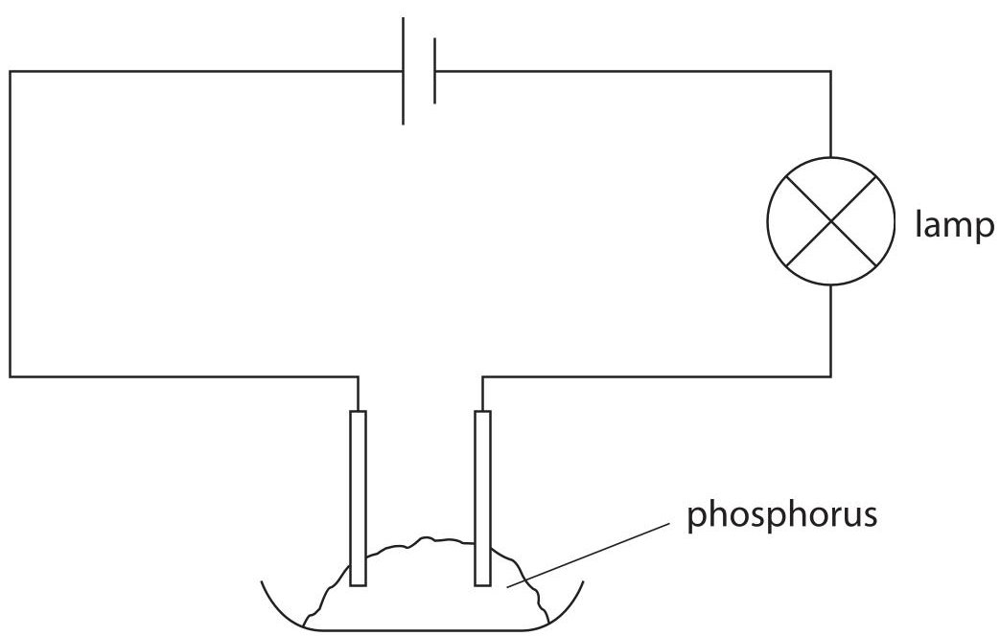
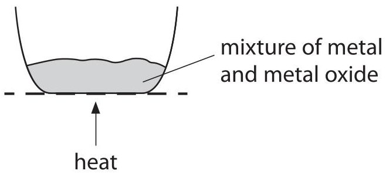
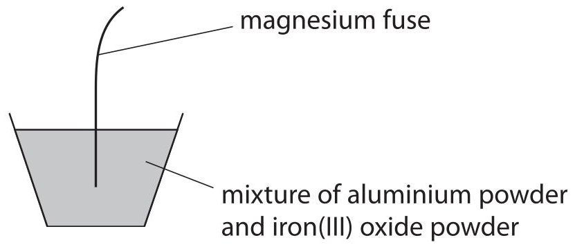
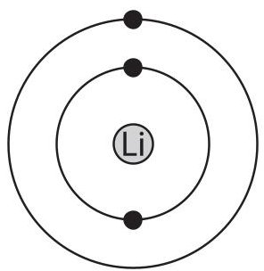
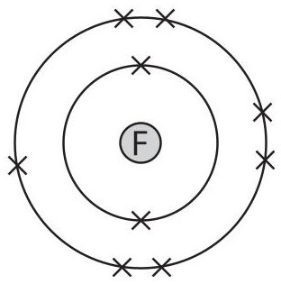
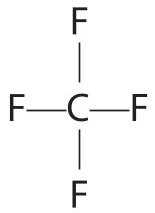
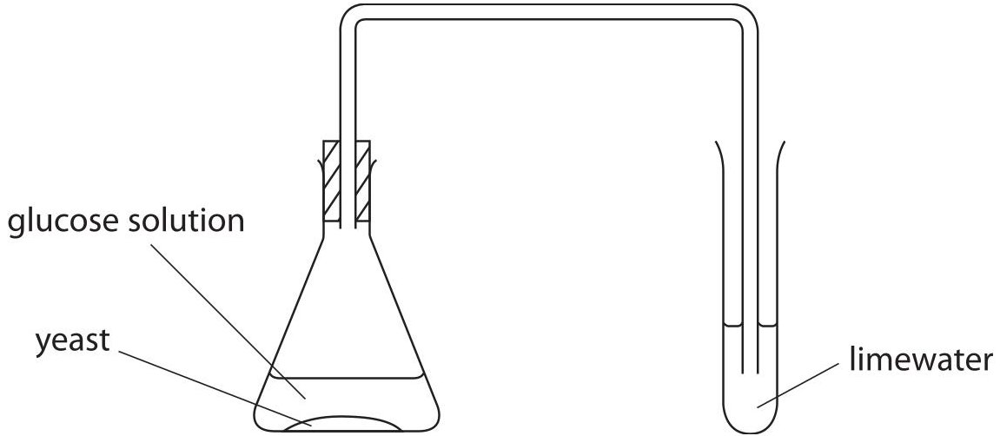
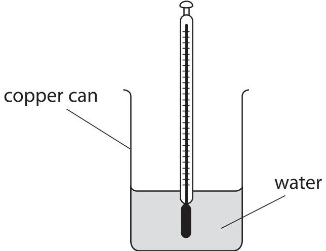
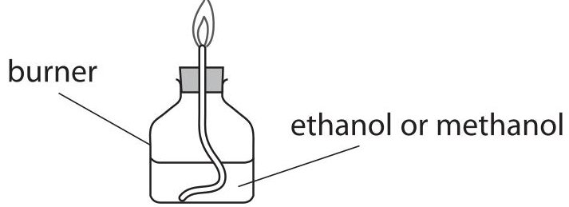
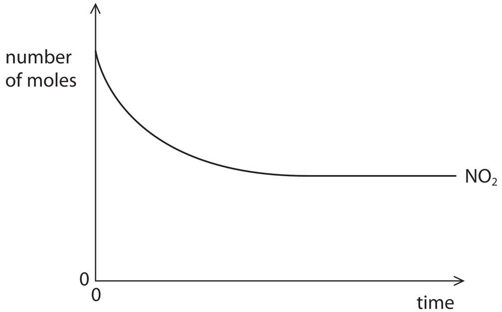

<table><tr><td colspan="2">Write your name here</td></tr><tr><td>Surname</td><td>Other names</td></tr><tr><td>Pearson Edexcel Certificate</td><td>Centre Number</td><td>Candidate Number</td></tr><tr><td>Pearson Edexcel International GCSE</td><td></td><td></td></tr><tr><td colspan="3">Chemistry</td></tr><tr><td colspan="3">Unit: KCH0/4CH0
Paper: 2C</td></tr><tr><td colspan="2">Wednesday 18 January 2017 – Afternoon
Time: 1 hour</td><td>Paper Reference
KCH0/2C
4CH0/2C</td></tr><tr><td colspan="3">You must have:
Calculator</td><td>Total Marks</td></tr></table>

## Instructions

- Use black ink or ball-point pen.

- Fill in the boxes at the top of this page with your name, centre number and candidate number.

- Answer all questions.

- Answer the questions in the spaces provided

- there may be more space than you need.

- Show all the steps in any calculations and state the units.

- Some questions must be answered with a cross in a box. If you change your mind about an answer, put a line through the box and then mark your new answer with a cross.

## Information

- The total mark for this paper is 60.

- The marks for each question are shown in brackets

- use this as a guide as to how much time to spend on each question.

## Advice

- Read each question carefully before you start to answer it.

- Write your answers neatly and in good English.

- Try to answer every question.

- Check your answers if you have time at the end.

Turn over

<table class="table table-bordered"><thead><tr><th>1</th><th>2</th><th>3</th><th>4</th><th>5</th><th>6</th><th>7</th><th>8</th><th>9</th><th>10</th></tr></thead><tbody><tr><td rowspan="2">7</td><td>Li</td><td>9</td><td rowspan="2" colspan="9"></td></tr><tr><td>Beryllium</td></tr><tr><td>3</td><td>Be</td><td>4</td><td rowspan="2" colspan="9"></td></tr><tr><td>23</td><td>Na</td><td>11</td></tr><tr><td>24</td><td>Mg</td><td>12</td><td rowspan="2" colspan="9"></td></tr><tr><td>39</td><td>K</td><td>19</td></tr><tr><td>40</td><td>Ca</td><td>20</td><td>45</td><td>Sc</td><td>21</td><td>48</td><td>Ti</td><td>22</td><td>51</td><td>V</td><td>23</td><td>52</td><td>Mn</td><td>25</td><td>56</td><td>Fe</td><td>26</td><td>59</td><td>Ni</td><td>28</td><td>63.5</td><td>Cu</td><td>29</td><td>65</td><td>Zn</td><td>30</td></tr><tr><td>86</td><td>Rb</td><td>37</td><td>88</td><td>Sr</td><td>38</td><td>89</td><td>Y</td><td>39</td><td>91</td><td>Zr</td><td>40</td><td>93</td><td>Nb</td><td>41</td><td>96</td><td>Mo</td><td>42</td><td>99</td><td>Tc</td><td>43</td><td>101</td><td>Ru</td><td>44</td><td>103</td><td>Rh</td><td>45</td><td>106</td><td>Pd</td><td>46</td><td>108</td><td>Ag</td><td>47</td><td>112</td><td>Cd</td><td>48</td></tr><tr><td>133</td><td>Cs</td><td>55</td><td>137</td><td>Ba</td><td>56</td><td>139</td><td>La</td><td>57</td><td>179</td><td>Hf</td><td>72</td><td>181</td><td>Ta</td><td>73</td><td>184</td><td>W</td><td>74</td><td>186</td><td>Re</td><td>75</td><td>190</td><td>Os</td><td>76</td><td>192</td><td>Ir</td><td>77</td><td>195</td><td>Pt</td><td>78</td><td>197</td><td>Au</td><td>79</td><td>201</td><td>Hg</td><td>80</td></tr><tr><td>223</td><td>Fr</td><td>87</td><td>226</td><td>Ra</td><td>88</td><td>227</td><td>Ac</td><td>89</td><td></td><td></td><td></td><td></td><td></td><td></td><td></td><td></td><td></td><td></td><td></td><td></td><td></td><td></td><td></td><td></td><td></td><td></td><td></td><td></td><td></td><td></td><td></td><td></td><td></td><td></td><td></td><td></td></tr></tbody></table>
## Answer ALL questions.
1 The box contains the names of some substances.
<table border="1"><tr><td>air</td><td>chlorine</td><td>hydrogen</td><td>iron</td></tr><tr><td>nitrogen</td><td>oxygen</td><td>potassium</td><td>sodium</td></tr></table>
Choose a substance from the box that best matches each description. Each substance may be used once, more than once or not at all.
(a) Which substance is a mixture?
(b) Which substance is a gas that makes a squeaky pop when ignited?
(c) Which substance is an element that is a green gas at room temperature?
(d) Which substance is used to sterilise water?
(e) Which substance is a metal that can be made by heating its oxide with carbon?
(Total for Question 1 = 5 marks)
2 Oxides can be made by burning elements in air.
The table gives some information about the oxides of four elements.
<table border="1"><tr><td>Element</td><td>Physical state of oxide at room temperature</td><td>Solubility of oxide in water</td><td>Type of solution formed when oxide dissolves in water</td></tr><tr><td>calcium</td><td>solid</td><td>slightly soluble</td><td>alkaline</td></tr><tr><td>carbon</td><td>gas</td><td>slightly soluble</td><td>acidic</td></tr><tr><td>magnesium</td><td>solid</td><td>slightly soluble</td><td>alkaline</td></tr><tr><td>sulfur</td><td>gas</td><td>very soluble</td><td>acidic</td></tr></table>
(a) Calcium and magnesium are metals. Carbon and sulfur are non-metals.
(i) Using only information from the table, state two ways in which the oxides of the metals are similar to each other.
(ii) Using only information from the table, state two ways in which the oxides of the non-metals are similar to each other.
(b) A teacher tells his students that when phosphorus burns in air a white solid oxide forms. This oxide is very soluble in water and forms an acidic solution.
(i) One student states that phosphorus is a metal.
Use information from the table to suggest why the student made this statement.
(ii) Another student states that phosphorus is a non-metal. Use information from the table to suggest why the student made this statement.
(c) An experiment using this apparatus shows that phosphorus is a non-metal.

Explain how this experiment shows that phosphorus is a non-metal.
(Total for Question 2 = 6 marks)
3 This question is about the reactivity of metals.
(a) This apparatus can be used to compare the reactivities of different metals.

A metal is heated with the oxide of a different metal.
The table shows the results of two experiments.
<table border="1"><tr><td>Mixture</td><td>Result</td></tr><tr><td>titanium+tin oxide</td><td>reaction</td></tr><tr><td>titanium+calcium oxide</td><td>no reaction</td></tr></table>
Explain how these results show the order of reactivity of calcium, tin and titanium.
(b) The diagram shows a method of making iron.

(i) The word equation for the reaction that occurs is
aluminium + iron(III) oxide $ \rightarrow $ aluminium oxide+ iron
Write a chemical equation for this reaction.
(ii) Explain which substance is oxidised in this reaction.
(iii) Explain why aluminium and iron(III) oxide are used in powdered form rather than large pieces.
(Total for Question 3 = 8 marks)
4 Chemical tests can be used to detect ions in solids and in aqueous solutions.
(a) A solid produces a gas when heated with sodium hydroxide solution. Damp red litmus paper is turned blue by the gas.
Which of these ions is present in the solid?
A $ \mathrm{C u}^{2+} $
B $ \mathrm{F e}^{2+} $
C $ \mathrm{F e}^{3+} $
$ \times $ D $ \mathrm{N H_{4}^{+}} $
(b) When dilute nitric acid is added to an aqueous solution, followed by silver nitrate solution, a yellow precipitate forms.
Which of these halide ions is present in the aqueous solution?
A $ \mathrm{B r}^{-} $
B $ \mathrm{C l}^{-} $
C $ \mathrm{F}^{-} $
D $ \mathrm{I}^{-} $
(c) When dilute hydrochloric acid is added to a solid, a gas forms. Which of these ions is present in the solid?
A carbonate
B hydroxide
C nitrate
D sulfate
(d) Sodium hydroxide solution is added separately to three solutions.
One solution contains $ \mathrm{C u}^{2+} $ ions, another contains $ \mathrm{F e}^{2+} $ ions and the third solution contains $ \mathrm{F e}^{3+} $ ions.
Which row shows the correct colours of the precipitates that form?
<table border="1"><tr><td></td><td>Cu2+</td><td>Fe2+</td><td>Fe3+</td></tr><tr><td>A</td><td>green</td><td>blue</td><td>brown</td></tr><tr><td>B</td><td>brown</td><td>green</td><td>blue</td></tr><tr><td>C</td><td>blue</td><td>green</td><td>brown</td></tr><tr><td>D</td><td>blue</td><td>brown</td><td>green</td></tr></table>
Which of these ions is present in the aqueous solution?
(e) When barium chloride solution is added to an aqueous solution of a compound, a white precipitate forms. When dilute hydrochloric acid is added to the mixture, the precipitate disappears and a colourless solution forms.
A carbonate
B chloride
C nitrate
D sulfate
(Total for Question 4 = 5 marks)
5 Lithium and carbon both form fluorides.
(a) Lithium reacts with fluorine to produce the ionic compound lithium fluoride.
The diagrams show the arrangement of electrons in a lithium atom and in a fluorine atom.

lithium atom

fluorine atom
Draw similar diagrams to show the arrangement of the electrons in the ions formed when lithium reacts with fluorine.
Show all the electrons in each ion.
(b) Carbon tetrafluoride is a simple molecular compound.
The displayed formula for a molecule of carbon tetrafluoride is

Draw a dot and cross diagram to show the arrangement of the electrons in this molecule. Show only the outer electrons.
(c) The table shows some properties of lithium fluoride and carbon tetrafluoride.
<table border="1"><tr><td>Compound</td><td>Melting point</td><td>Ability to conduct electricity when molten or liquid</td></tr><tr><td>lithium fluoride</td><td>high</td><td>good</td></tr><tr><td>carbon tetrafluoride</td><td>low</td><td>poor</td></tr></table>
Explain these properties of each compound.
lithium fluoride.
carbon tetrafluoride
(Total for Question 5 = 8 marks)
6 Ethanol can be produced when yeast is added to a glucose solution.
This apparatus is used to investigate the reaction.

(a) The equation for the reaction is
$$
\mathrm {C} _ {6} \mathrm {H} _ {1 2} \mathrm {O} _ {6} (\mathrm {a q}) \rightarrow 2 \mathrm {C} _ {2} \mathrm {H} _ {5} \mathrm {O H} (\mathrm {a q}) + 2 \mathrm {C O} _ {2} (\mathrm {g})
$$
(i) State the purpose of the yeast.
(ii) State how the appearance of the limewater changes during the reaction.
(iii) State the temperature at which this reaction is carried out in industry.
(b) Ethanol can be used as a fuel.
This is the equation for the complete combustion of ethanol.
$$
\mathrm {C} _ {2} \mathrm {H} _ {5} \mathrm {O H} + 3 \mathrm {O} _ {2} \rightarrow 2 \mathrm {C O} _ {2} + 3 \mathrm {H} _ {2} \mathrm {O}
$$
These are the displayed formulae for ethanol, oxygen, carbon dioxide and water.
<table border="1"><tr><td>Chemical structure of ethanol</td><td>O=O</td><td>O=C=O</td><td>H=O=H</td></tr><tr><td>ethanol</td><td>oxygen</td><td>carbon dioxide</td><td>water</td></tr></table>
The table gives some average (mean) bond energies.
<table border="1"><tr><td>Bond</td><td>Average bond energy in kJ/mol</td></tr><tr><td>C-C</td><td>348</td></tr><tr><td>C-H</td><td>412</td></tr><tr><td>C-O</td><td>360</td></tr><tr><td>H-O</td><td>463</td></tr><tr><td>O=O</td><td>496</td></tr><tr><td>C=O</td><td>743</td></tr></table>
Use this information to calculate the enthalpy change $ (\Delta H) $ when one mole of ethanol is completely burned.
(c) Ethanol and methanol can both be used as fuels.
A student uses this apparatus to find out how much energy is produced when one mole of ethanol and one mole of methanol are burned.

The table shows some of the student's results.
<table border="1"><tr><td>Fuel</td><td>Formula mass of fuel</td><td>Energy given out by 1.00g of fuel in kJ</td><td>Energy given out by 1mol of fuel in kJ</td></tr><tr><td>ethanol(C2H5OH)</td><td>46.0</td><td>20.9</td><td>961</td></tr><tr><td>methanol(CH3OH)</td><td></td><td>15.6</td><td></td></tr></table>
(i) Calculate the energy given out by 1 mol of methanol.

(2) 

(ii) The student uses the same burner and copper can in each experiment. State two other factors that the student should keep the same in each experiment. (2)
(iii) A data book states that the energy given out when 1 mol of ethanol is burned is 1371 kJ. Suggest two reasons why the student's value is much less than this.
(Total for Question 6 = 13 marks)
7 Magnesium chloride can be made by reacting excess magnesium carbonate with dilute hydrochloric acid.
The equation for the reaction is
$$
\mathrm {M g C O} _ {3} + 2 \mathrm {H C l} \rightarrow \mathrm {M g C l} _ {2} + \mathrm {H} _ {2} \mathrm {O} + \mathrm {C O} _ {2}
$$
(a) (i) In one experiment, a sample of 0.050 mol of $ \mathrm{M g C O_{3}} $ is added to 0.080 mol of HCl. Show, by calculation, that the $ \mathrm{M g C O_{3}} $ is in excess.
(ii) Calculate the maximum volume, in $ cm^{3} $ , of carbon dioxide, measured at room temperature and pressure, that would be obtained when 0.080 mol of HCI react completely with $ MgCO_{3}. $
[One mole of any gas occupies 24 000 $ cm^{3} $ at room temperature and pressure.]
maximum volume of carbon dioxide =
(b) In another experiment 0.050 mol of $ \mathrm{M g C O_{3}} $ reacts with excess HCl.
A yield of 5.5 g of $ \mathrm{M g C l_{2}. 6 H_{2} O} $ is obtained.
(i) Calculate the percentage yield of $ \mathrm{M g C l_{2}. 6 H_{2}O} $
percentage yield =
(ii) Suggest why the percentage yield is less than 100%.
(Total for Question 7 = 7 marks)
8 When nitrogen dioxide gas $ \mathrm{(N O_{2})} $ is placed in a sealed flask, it reacts to form dinitrogen tetraoxide gas $ \mathrm{(N_{2}O_{4})}. $
The equation for the reaction is
$$
\begin{array}{c c c} 2 \mathrm {N O} _ {2} (\mathrm {g}) & \rightleftharpoons & \mathrm {N} _ {2} \mathrm {O} _ {4} (\mathrm {g}) \\ \mathrm {b r o w n g a s} & & \mathrm {c o l o u r l e s s g a s} \end{array}
$$
A sample of pure $ \mathrm{N O_{2}} $ is placed in a sealed flask at $ 2 5^{\circ} \mathrm{C} $ . The flask is left until a dynamic equilibrium is reached.
(a) For a reaction that is in dynamic equilibrium, the forward and backward reactions occur at the same time.
State two other features of a reaction that is in dynamic equilibrium.
(b) At equilibrium there is more $ \mathrm{N O_{2}} $ than $ \mathrm{N_{2}O_{4}} $
The graph shows how the number of moles of $ \mathrm{N O_{2}} $ in the sealed flask changes with time.

(i) Draw a cross ( $ \times $ ) on the graph at the point where the reaction reaches equilibrium.
(ii) Draw a curve on the graph to show how the number of moles of $ \mathrm{N_{2}O_{4}} $ in the sealed flask changes over the same time period.
(c) The sealed flask containing the equilibrium mixture is placed in water at a temperature of $ 5 0^{\circ} \mathrm{C} $ . The mixture goes darker in colour.
Explain what this observation shows about the equilibrium reaction.
(Total for Question 8 = 8 marks)
TOTAL FOR PAPER=60 MARKS
## BLANK PAGE
Every effort has been made to contact copyright holders to obtain their permission for the use of copyright material. Pearson Education Ltd. will, if notified, be happy to rectify any errors or omissions and include any such rectifications in future editions.
