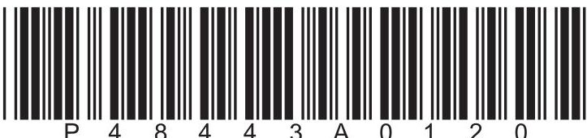
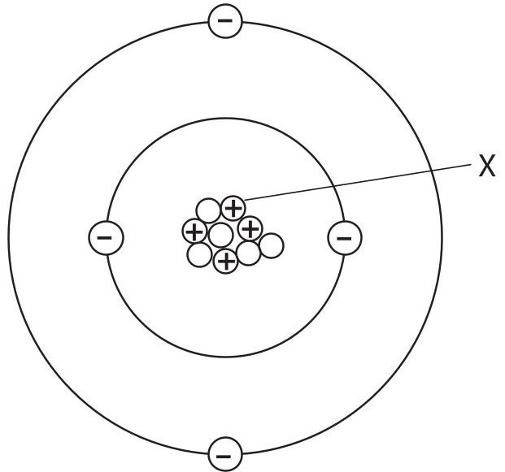
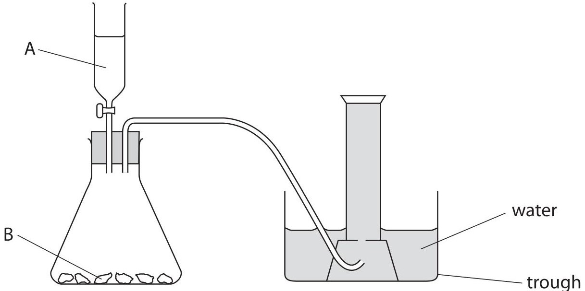
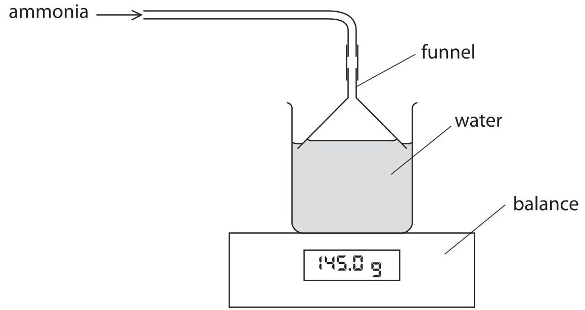
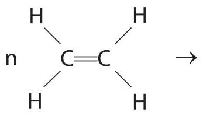
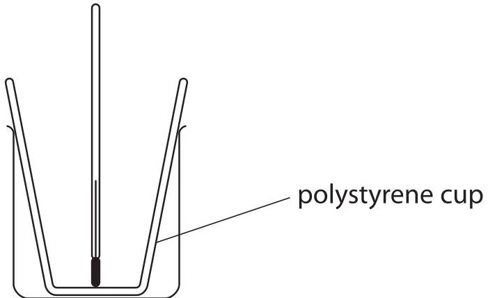
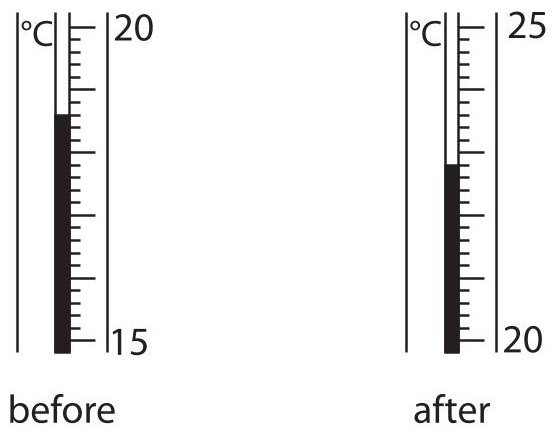
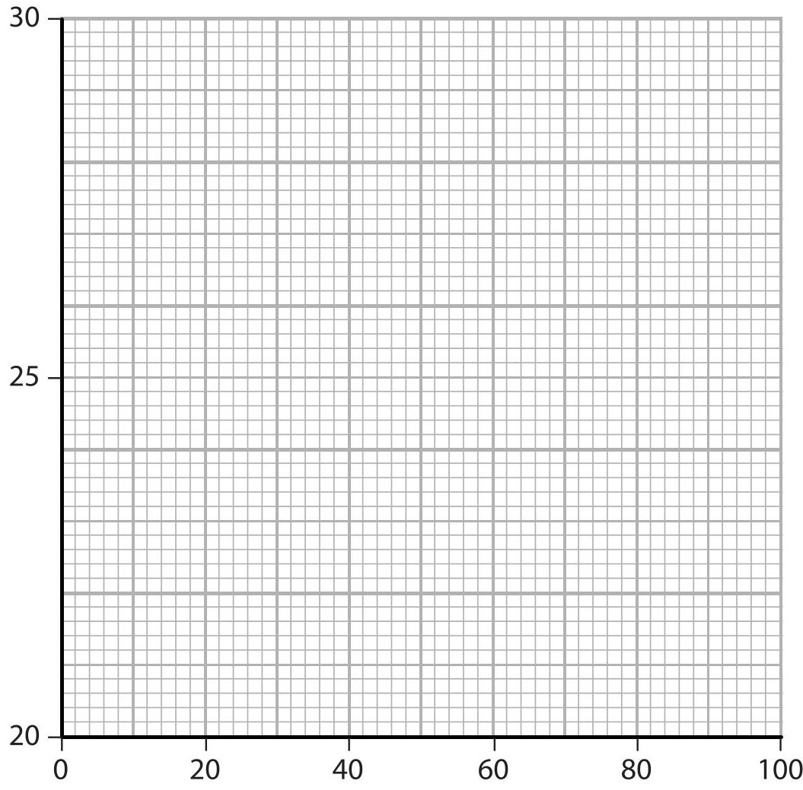

<table><tr><td colspan="2">Write your name here</td></tr><tr><td>Surname</td><td>Other names</td></tr><tr><td>Centre Number</td><td>Candidate Number</td></tr><tr><td colspan="2">Pearson Edexcel International GCSE</td></tr><tr><td colspan="2">Chemistry
Unit: 4CH0
Paper: 2CR</td></tr><tr><td colspan="2">Wednesday 14 June 2017 – Morning
Time: 1 hour</td><td>Paper Reference
4CH0/2CR</td></tr><tr><td colspan="2">You must have:
Ruler, calculator</td><td>Total Marks</td></tr></table>

## Instructions

- Use black ink or ball-point pen.

- Fill in the boxes at the top of this page with your name, centre number and candidate number.

- Answer all questions.

- Answer the questions in the spaces provided

- there may be more space than you need.

- Show all the steps in any calculations and state the units.

- Some questions must be answered with a cross in a box. If you change your mind about an answer, put a line through the box and then mark your new answer with a cross.

## Information

- The total mark for this paper is 60.

- The marks for each question are shown in brackets

- use this as a guide as to how much time to spend on each question.

## Advice

- Read each question carefully before you start to answer it.

- Write your answers neatly and in good English.

- Try to answer every question.

- Check your answers if you have time at the end.

Turn over

<table class="table table-bordered"><thead><tr><th>1</th><th>2</th><th>3</th><th>4</th><th>5</th><th>6</th><th>7</th><th>8</th><th>9</th><th>10</th></tr></thead><tbody><tr><td>7</td><td>Li</td><td>9</td><td>Be</td><td>Beryllium</td><td></td><td></td><td></td><td></td><td></td><td></td></tr><tr><td>3</td><td>Lithium</td><td>4</td><td></td><td></td><td></td><td></td><td></td><td></td><td></td><td></td></tr><tr><td>23</td><td>Na</td><td>24</td><td>Mg</td><td>Magnesium</td><td></td><td></td><td></td><td></td><td></td><td></td></tr><tr><td>39</td><td>K</td><td>40</td><td>Ca</td><td>Calcium</td><td>45</td><td>Sc</td><td>51</td><td>V</td><td>Vanadium</td><td>21</td></tr><tr><td>86</td><td>Rb</td><td>88</td><td>Sr</td><td>Strontium</td><td>89</td><td>Y</td><td>91</td><td>Zr</td><td>Zirconium</td><td>40</td></tr><tr><td>133</td><td>Cs</td><td>137</td><td>Ba</td><td>Barum</td><td>139</td><td>La</td><td>179</td><td>Hf</td><td>Hafnium</td><td>72</td></tr><tr><td>223</td><td>Fr</td><td>226</td><td>Ra</td><td>Radium</td><td>227</td><td>Ac</td><td>227</td><td>Ta</td><td>Tantalum</td><td>73</td></tr></tbody></table>

## BLANK PAGE

Answer ALL questions.

1 The diagram represents an atom of an element.

(a) (i) What is the particle labelled X?

A an electron

B an ion

C a proton

D a neutron

(ii) What is the mass number of this atom?

A 4

B 5

C 9

D 13

(iii) Name the element that contains these atoms.

(b) Hydrogen has three isotopes.

State, in terms of subatomic particles, one way in which these isotopes are the same and one way in which they are different.

different

(Total for Question 1 = 5 marks)

2 A small piece of magnesium ribbon is added to dilute sulfuric acid in a test tube. Hydrogen gas is produced.

(a) State two observations that are seen during the reaction.

(b) The reaction is exothermic.

State what happens to the temperature of the acid during the reaction.

(c) Write a word equation for the reaction.

(Total for Question 2 = 4 marks)

3 This apparatus can be used to prepare carbon dioxide from reagents A and B.

(a) Calcium chloride and water are also products of the reaction between A and B. Identify reagent A and reagent B.

(b) In the diagram, the carbon dioxide is collected over water. State another way of collecting the carbon dioxide.

(c) At the end of the experiment, the solution in the trough is weakly acidic.

(i) State the colour of the solution when some Universal Indicator is added.

(ii) Give the name and the formula of the acid that forms when carbon dioxide dissolves in water.

name ... formula

(Total for Question 3 = 6 marks)

4 Crude oil is a complex mixture containing many compounds and is a source of many chemicals.

(a) Most of the compounds in crude oil contain two elements. Name these two elements.

and

(b) Crude oil is separated into fractions in order to produce useful chemicals.

(i) State what is meant by the term fraction.

(ii) Describe the industrial process used to obtain fractions from crude oil.

(c) The box shows four fractions obtained from crude oil.

bitumen

diesel

fuel oil

gasoline

(i) Which of these fractions contains compounds with the highest boiling points?

(ii) Which of these fractions is the most volatile?

(d) Fuel oil can be burned to heat homes.

If combustion is incomplete, a dangerous gas is produced.

(i) Name this gas.

(ii) State why this gas is dangerous.

(Total for Question 4 = 9 marks)

5 Ammonia is a toxic gas that is very soluble in water.

A teacher uses this apparatus to investigate the solubility of ammonia in water at different temperatures.

This is the teacher's method.

- pour 100 $ cm^{3} $ of water into the beaker and measure the temperature of the water

- place the beaker on the balance and record the mass of the beaker and water

- bubble ammonia into the water until the mass is constant

- record the constant mass

The teacher repeats the experiment with the water at different temperatures.

The table shows the teacher's results.

<table border="1"><tr><td>温度 of water in℃</td><td>Mass at start ing</td><td>Mass at end ing</td></tr><tr><td>15</td><td>145.0</td><td>204.5</td></tr><tr><td>20</td><td>145.0</td><td>198.1</td></tr><tr><td>25</td><td>145.0</td><td>191.6</td></tr><tr><td>30</td><td>145.0</td><td>185.1</td></tr></table>

(a) (i) Calculate the mass of ammonia dissolved in $ 1 0 0 \mathrm{c m}^{3} $ of water at $ 2 5 \mathrm{^o C}. $

mass of ammonia =

(ii) State the relationship between temperature and solubility of ammonia.

(b) Explain one safety precaution that the teacher should take when doing this experiment.

(c) When the teacher does the experiment at a higher temperature, the reading on the balance gradually increases but then slowly decreases.

Suggest why the reading on the balance slowly decreases.

(d) Ammonia is an alkaline gas.

Suggest a different method that the teacher could use to compare the mass of ammonia dissolved in the water at different temperatures.

(Total for Question 5 = 6 marks)

6 Ethanol can be made by two different methods.

method1 fermentation of glucose

method2 reaction of ethene with steam

(a) Name the catalyst used in each method.

method 1

(b) Two companies produce ethanol for different purposes. The table gives some information about each company.

<table border="1"><tr><td></td><td>Company A</td><td>Company B</td></tr><tr><td>Location of company</td><td>large agricultural area</td><td>near an oil refinery</td></tr><tr><td>Use of ethanol</td><td>to obtain a dilute solution to convert into vinegar</td><td>as a solvent for perfumes</td></tr></table>

Explain which method of production each company is more likely to use.

(4) 

Company A

Company B

(c) Most of the ethene used to make polymers is produced by the cracking of crude oil fractions.

(i) One of the polymers made from ethene is poly(ethene).

Complete the equation to show the formation of poly(ethene) from ethene.

(ii) The kerosene fraction obtained from crude oil contains a hydrocarbon with the formula $ \mathrm{C_{1 6} H_{3 4}} $

Complete the equation to show the formation of ethene and one molecule of another hydrocarbon from the cracking of $ \mathrm{C_{1 6} H_{3 4}} $

$$
\mathrm {C} _ {1 6} \mathrm {H} _ {3 4} \rightarrow 2 \mathrm {C} _ {2} \mathrm {H} _ {4} +
$$

(iii) Suggest why it may be necessary, in future, to make ethene from ethanol.

(Total for Question 6 = 10 marks)

## BLANK PAGE

7 A student uses this apparatus to investigate the change in temperature when dilute hydrochloric acid is added to aqueous sodium hydroxide.

This is the student's method.

- pour some aqueous sodium hydroxide into the polystyrene cup

- record the temperature of the sodium hydroxide

- add some dilute hydrochloric acid and stir the mixture

- record the highest temperature of the mixture

The student repeats the experiment using different volumes of the two solutions.

(a) Explain why the student uses a polystyrene cup to contain the solution,rather than a beaker.

(b) The diagram shows the thermometer readings for one experiment before and after adding the acid.

Record the temperatures before and after adding the acid.

before ... °C

after ... °C

(c) The table shows the results of a series of experiments.

The initial temperatures of the aqueous sodium hydroxide and the dilute hydrochloric acid are the same.

<table border="1"><tr><td>Experiment</td><td>Volume of aqueous sodium hydroxide in $ \mathrm{cm^{3}} $</td><td>Volume of dilute hydrochloric acid in $ \mathrm{cm^{3}} $</td><td>Highest temperature of mixture in $ ^{\circ} \mathrm{C} $</td></tr><tr><td>1</td><td>10</td><td>90</td><td>22.2</td></tr><tr><td>2</td><td>20</td><td>80</td><td>24.2</td></tr><tr><td>3</td><td>30</td><td>70</td><td>26.0</td></tr><tr><td>4</td><td>70</td><td>30</td><td>24.0</td></tr><tr><td>5</td><td>80</td><td>20</td><td>23.0</td></tr><tr><td>6</td><td>90</td><td>10</td><td>22.0</td></tr></table>

(i) Plot the results from the table on the grid.

Highest temperature of mixture in $ ^{\circ} \mathrm{C} $

Volume of aqueous sodium hydroxide in $ \mathrm{c m}^{3} $

Draw a straight line of best fit for experiments 1,2 and 3.

Draw a second straight line of best fit for experiments 4,5 and 6.

Extend both lines so that they cross.

(ii) The point where the two lines cross indicates when equal amounts, in moles, of sodium hydroxide and hydrochloric acid react.

Use your graph to find the volumes that contain equal amounts of sodium hydroxide and hydrochloric acid.

volume of sodium hydroxide

volume of hydrochloric acid

(iii) The equation for the reaction between sodium hydroxide and hydrochloric acid is

$$
\mathrm {N a O H} + \mathrm {H C l} \rightarrow \mathrm {N a C l} + \mathrm {H} _ {2} \mathrm {O}
$$

Explain which solution, the sodium hydroxide or the hydrochloric acid, has the greater concentration.

(Total for Question 7 = 12 marks)

8 A student does a titration to find the concentration of a solution of nitric acid.

This is the student's method.

- pipette 25.0 $ cm^{3} $ of the nitric acid into a conical flask

- add a few drops of indicator

- add aqueous potassium hydroxide from a burette until the indicator just changes colour

- determine the volume of alkali added from the burette

The concentration of the potassium hydroxide solution is 0.0200 mol/dm $ ^{3} $

The volume of potassium hydroxide required to neutralise the acid is $ 2 3. 5 0 \mathrm{c m}^{3}. $

The equation for the reaction between nitric acid and potassium hydroxide is

$$
\mathrm {H N O} _ {3} + \mathrm {K O H} \rightarrow \mathrm {K N O} _ {3} + \mathrm {H} _ {2} \mathrm {O}
$$

(a) (i) Calculate the amount, in moles, of KOH used in this titration.

$$
\mathrm {a m o u n t o f K O H} =
$$

(ii) Calculate the concentration, in mol/dm $ ^{3} $ , of the nitric acid.

(b) The student makes a solution of potassium nitrate by neutralising aqueous potassium hydroxide with dilute nitric acid.

Describe how he could use crystallisation to obtain a pure, dry sample of potassium nitrate crystals from the solution of potassium nitrate.

(Total for Question 8 = 8 marks)

TOTAL FOR PAPER=60 MARKS

## BLANK PAGE

Every effort has been made to contact copyright holders to obtain their permission for the use of copyright material. Pearson Education Ltd. will, if notified, be happy to rectify any errors or omissions and include any such rectifications in future editions.

