<table><tr><td colspan="2">Write your name here</td></tr><tr><td>Surname</td><td>Other names</td></tr><tr><td>Pearson Edexcel Certificate</td><td>Centre Number</td><td>Candidate Number</td></tr><tr><td>Pearson Edexcel International GCSE</td><td></td><td></td></tr><tr><td colspan="3">Chemistry</td></tr><tr><td colspan="3">Unit: KCH0/4CH0
Paper: 2C</td></tr><tr><td colspan="2">Wednesday 14 June 2017 – Morning
Time: 1 hour</td><td>Paper Reference
KCH0/2C
4CH0/2C</td></tr><tr><td colspan="3">You must have:
Calculator</td><td>Total Marks</td></tr></table>

## Instructions

- Use black ink or ball-point pen.

- Fill in the boxes at the top of this page with your name, centre number and candidate number.

- Answer all questions.

- Answer the questions in the spaces provided

- there may be more space than you need.

- Show all the steps in any calculations and state the units.

- Some questions must be answered with a cross in a box. If you change your mind about an answer, put a line through the box and then mark your new answer with a cross.

## Information

- The total mark for this paper is 60.

- The marks for each question are shown in brackets

- use this as a guide as to how much time to spend on each question.

## Advice

- Read each question carefully before you start to answer it.

- Write your answers neatly and in good English.

- Try to answer every question.

- Check your answers if you have time at the end.

Turn over

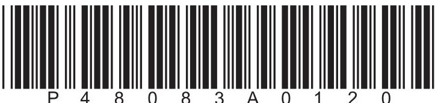

<table class="table table-bordered"><thead><tr><th>1</th><th>2</th><th>3</th><th>4</th><th>5</th><th>6</th><th>7</th><th>8</th><th>9</th><th>10</th></tr></thead><tbody><tr><td rowspan="2">1</td><td>7 Li</td><td>9 Be</td><td></td><td></td><td></td><td></td><td></td><td></td><td></td><td></td></tr><tr><td>3 Lithium</td><td>4 Beryllium</td><td></td><td></td><td></td><td></td><td></td><td></td><td></td><td></td></tr><tr><td rowspan="2">2</td><td>23 Na</td><td>24 Mg</td><td></td><td></td><td></td><td></td><td></td><td></td><td></td><td></td></tr><tr><td>11 Sodium</td><td>12 Magnesium</td><td></td><td></td><td></td><td></td><td></td><td></td><td></td><td></td></tr><tr><td rowspan="2">3</td><td>39 K</td><td>40 Ca</td><td></td><td></td><td></td><td></td><td></td><td></td><td></td><td></td></tr><tr><td>19 Potassium</td><td>20 Calcium</td><td></td><td></td><td></td><td></td><td></td><td></td><td></td><td></td></tr><tr><td rowspan="2">4</td><td>86 Rb</td><td>88 Sr</td><td></td><td></td><td></td><td></td><td></td><td></td><td></td><td></td></tr><tr><td>37 Rubidium</td><td>38 Strontium</td><td></td><td></td><td></td><td></td><td></td><td></td><td></td><td></td></tr><tr><td rowspan="2">5</td><td>133 Cs</td><td>137 Ba</td><td></td><td></td><td></td><td></td><td></td><td></td><td></td><td></td></tr><tr><td>55 Caesium</td><td>56 Barium</td><td></td><td></td><td></td><td></td><td></td><td></td><td></td><td></td></tr><tr><td rowspan="2">6</td><td>223 Fr</td><td>226 Ra</td><td></td><td></td><td></td><td></td><td></td><td></td><td></td><td></td></tr><tr><td>87 Francium</td><td>88 Radium</td><td></td><td></td><td></td><td></td><td></td><td></td><td></td><td></td></tr></tbody></table>

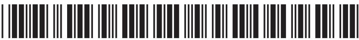

## Answer ALL questions.

1 Sodium sulfate is a compound with many uses.

(a) The formula of the main compound used as the source of sodium sulfate is $ \mathrm{N a_{2} S O_{4}. 1 0 H_{2} O} $ How many different elements are shown in this formula?

A 2

B 3

C 4

D 5

(b) Sodium sulfate can be made from sodium hydroxide and sulfuric acid.

Balance the equation for the reaction between sodium hydroxide and sulfuric acid. (1)

$ \mathrm{N a O H}+ \mathrm{H_{2} S O_{4}} \rightarrow \mathrm{N a_{2} S O_{4}}+ \mathrm{H_{2} O} $

(c) Sodium hydroxide is manufactured by the electrolysis of brine in the diaphragm cell. Sulfuric acid is manufactured using the contact process. The table contains some statements about these two processes. Place ticks ( $ \checkmark $ ) in the boxes to show the two correct statements.

<table border="1"><tr><td>brine is a solution of sodium chloride in water</td><td></td></tr><tr><td>the temperature used in the contact process is greater than 1000℃</td><td></td></tr><tr><td>an equation for the contact process is $ \mathrm{S O_{2}+H_{2}O\rightarrow H_{2} S O_{4}} $</td><td></td></tr><tr><td>the reactions in the diaphragm cell are displacement reactions</td><td></td></tr><tr><td>the catalyst used in the contact process is vanadium(V) oxide</td><td></td></tr></table>

(Total for Question 1 = 4 marks)

## BLANK PAGE

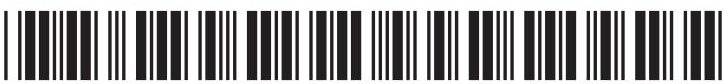

2 The diagram shows the positions of some elements in part of the Periodic Table.

He

<table border="1"><tr><td>Li</td><td></td><td>B</td><td></td><td>N</td><td></td><td>F</td><td></td></tr><tr><td></td><td>Mg</td><td></td><td>Si</td><td></td><td>S</td><td></td><td>Ar</td></tr></table>

(a) How many periods and groups are shown in this diagram?

(1) 

<table border="1"><tr><td></td><td>Periods</td><td>Groups</td></tr><tr><td>A</td><td>2</td><td>4</td></tr><tr><td>B</td><td>3</td><td>4</td></tr><tr><td>C</td><td>2</td><td>8</td></tr><tr><td>D</td><td>3</td><td>8</td></tr></table>

(b) How many elements shown in the diagram are noble gases?

A 1

B 2

C 3

D 4

(c) What is the formula of the compound formed between magnesium and fluorine? (1)

A MgF

B $ \mathrm{M g_{2} F} $

C $ \mathrm{M g F_{2}} $

D $ \mathrm{M g_{2} F_{2}} $

(d) The table shows the percentage composition by mass of a sample of silicon.

<table border="1"><tr><td>Isotope</td><td>$^{28}$Si</td><td>$^{29}$Si</td><td>$^{30}$Si</td></tr><tr><td>Percentage(%)</td><td>92.2</td><td>4.70</td><td>3.10</td></tr></table>

Calculate the relative atomic mass of this sample of silicon. Give your answer to one decimal place.

relative atomic mass=

(e) A molecule of silicon tetrafluoride $ \mathrm{(S i F_{4})} $ contains covalent bonds. Draw a dot and cross diagram to show the outer electrons in this molecule.

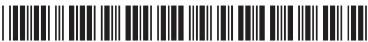

(f) The table shows the boiling points of some compounds containing silicon. All of these compounds contain covalent bonds.

<table border="1"><tr><td>Compound</td><td>Boiling point in℃</td></tr><tr><td>$SiF_{4}$</td><td>-86</td></tr><tr><td>$SiCl_{4}$</td><td>58</td></tr><tr><td>$SiO_{2}$</td><td>2950</td></tr></table>

$ \mathrm{S i F}_{4} $ and $ \mathrm{S i C l}_{4} $ have simple molecular structures.

$ \mathrm{S i O}_{2} $ has a giant covalent structure.

(i) Explain why the boiling point of $ \mathrm{S i C l}_{4} $ is greater than the boiling point of $ \mathrm{S i F}_{4} $

(ii) Explain why the boiling point of $ \mathrm{S i O_{2}} $ is very much greater than the boiling point of $ \mathrm{S i C l_{4}} $

3 This apparatus can be used to investigate electrolysis.

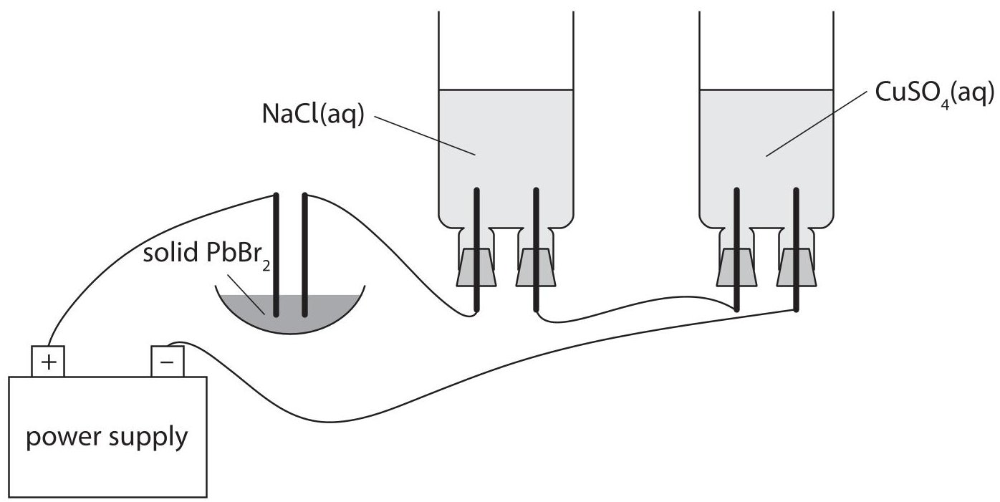

(a) Name the particles that move through the connecting wires to form an electric current.

(b) The electrodes are made of platinum, which is an inert metal. State what is meant by the term inert.

(c) Explain why the electrolytic cell containing $ \mathrm{P b B r}_{2} $ needs to be heated before electrolysis can occur.

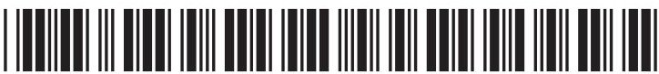

(d) When NaCl(aq) is electrolysed, two gases form at the positive electrode and one gas forms at the negative electrode.

The formulae of the species in $ \mathrm{N a C l} ( \mathrm{a q} ) $ are $ \mathrm{N a}^{+}, \mathrm{C l}^{-}, \mathrm{H}^{+}, \mathrm{O H}^{-} $ and $ \mathrm{H}_{2} \mathrm{O}. $

(i) Name the gases formed at each electrode.

positive electrode ...

negative electrode.

(ii) Give ionic half-equations to show the formation of each gas.

(e) The ionic half-equation for one of the reactions in the cell containing copper(II) sulfate solution is

$$
\mathrm {C u} ^ {2 +} + 2 \mathrm {e} ^ {-} \rightarrow \mathrm {C u}
$$

During the electrolysis, a charge of 0.040 faradays passes through this cell.

Calculate the mass of copper metal formed.

(Total for Question 3 = 11 marks)

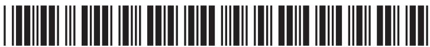

4 Compounds containing C=C double bonds are used to manufacture alcohols such as ethanol and addition polymers such as PVC.

The table shows the formulae of some compounds containing C=C bonds.

<table border="1"><tr><td>A
CH2=CH2</td><td>B
H H H
H-C=C-C-H
H</td></tr><tr><td>C
C4H8</td><td>D
C2H3Cl</td></tr></table>

(a) (i) Explain which three of these compounds are hydrocarbons.

(ii) Explain which compound is shown as a displayed formula.

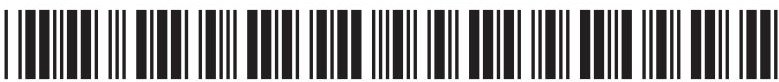

(b) Ethanol can be manufactured from compound A using reaction 1. Ethanol can also be manufactured from glucose using reaction 2.

The equations for these reactions are

reaction 1

$$
\mathrm {C} _ {2} \mathrm {H} _ {4} + \mathrm {H} _ {2} \mathrm {O} \rightarrow \mathrm {C} _ {2} \mathrm {H} _ {5} \mathrm {O H}
$$

reaction 2

$$
C _ {6} H _ {1 2} O _ {6} \rightarrow 2 C _ {2} H _ {5} O H + 2 C O _ {2}
$$

Give two advantages of using each reaction to manufacture ethanol.

reaction 1.

reaction 2.

(c) Compound C reacts with bromine to form a product with this formula.

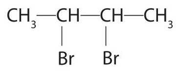

(i) Use this formula to determine the name of compound C.

(ii) State the colour of the product formed when compound C reacts with bromine.

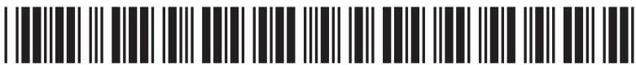

(d) Compound X is an isomer of compound C.

(i) Explain what is meant by the term isomers.

(ii) The equation for the conversion of compound X to an alcohol is

$$
\mathrm {C H} _ {2} = \mathrm {C H} - \mathrm {C H} _ {2} - \mathrm {C H} _ {3} + \mathrm {H} _ {2} \mathrm {O} \rightarrow \mathrm {C H} _ {3} - \mathrm {C H} - \mathrm {C H} _ {2} - \mathrm {C H} _ {3}
$$

Place ticks ( $ \checkmark $ ) in the boxes to show the two correct descriptions of this reaction.

<table border="1"><tr><td>addition</td><td></td></tr><tr><td>dehydration</td><td></td></tr><tr><td>hydration</td><td></td></tr><tr><td>oxidation</td><td></td></tr><tr><td>reduction</td><td></td></tr></table>

(e) Compound D, chloroethene, can be used to manufacture the polymer PVC.

(i) State the full name of PVC.

(ii) Write an equation, containing displayed formulae, to represent the reaction that occurs in the manufacture of PVC.

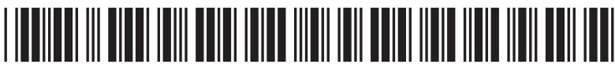

## BLANK PAGE

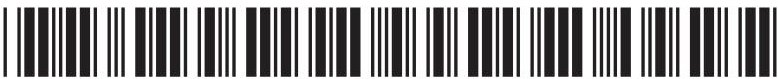

5 A student uses this apparatus to find the increase in temperature of water when methanol, $ \mathrm{C H_{3} O H} $ , is burned.

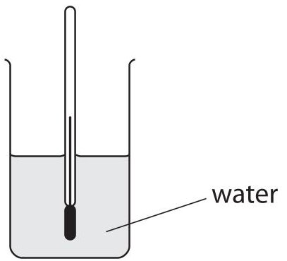

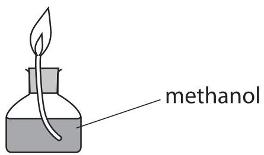

(a) There are several reasons why the increase in temperature is less than expected.

(i) One reason is the incomplete combustion of methanol to form only carbon monoxide and water.

Write the chemical equation for this incomplete combustion.

(ii) State another reason why the increase in temperature is less than expected.

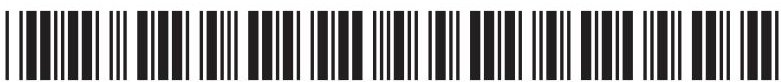

(b) The student records these results.

<table border="1"><tr><td>mass of burner and methanol before combustion</td><td>84.7g</td></tr><tr><td>mass of burner and methanol after combustion</td><td>83.2g</td></tr><tr><td>mass of water</td><td>125g</td></tr><tr><td>temperature of water at start</td><td>22℃</td></tr><tr><td>temperature of water at end</td><td>58℃</td></tr></table>

(i) Calculate the heat energy change (Q), in joules, in this experiment using the expression

$$
Q = m \times 4. 2 \times \Delta T
$$

where m is the mass of water in grams and $ \Delta T $ represents the increase in temperature.

(ii) The relative molecular mass of methanol is 32

Use this information and your value for Q to calculate the molar enthalpy change, $ \Delta H $ , for the combustion of methanol.

Give your answer in kJ/mol.

$$
\Delta H =
$$

(iii) The student draws an energy level diagram for the complete combustion of methanol.

$$
\begin{array}{c c} \mathrm {e n e r g y} & \mathrm {c a r b o n d i o x i d e} \\ \hline \mathrm {m e t h a n o l} & \mathrm {c a r b o n d i o x i d e} \\ \end{array}
$$

Identify the two mistakes in his diagram.

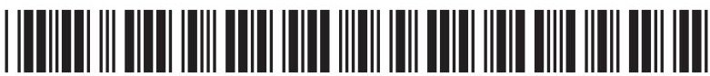

(c) The student is given this table of average (mean) bond energies.

<table border="1"><tr><td>Bond</td><td>C-H</td><td>C-O</td><td>O-H</td><td>O=O</td><td>C=O</td></tr><tr><td>Average bond energy in kJ/mol</td><td>412</td><td>360</td><td>463</td><td>496</td><td>743</td></tr></table>

The equation for the complete combustion of methanol is

$$
\mathrm {H} - \mathrm {C} - \mathrm {O} - \mathrm {H} + 1. 5 \mathrm {O} = \mathrm {O} \rightarrow \mathrm {O} = \mathrm {C} = \mathrm {O} + 2 \mathrm {H} - \mathrm {O} - \mathrm {H}
$$

Use this equation and the information in the table to calculate another value for the molar enthalpy change, $ \Delta H $ , for the combustion of methanol.

$$
\Delta H =
$$

(Total for Question 5 = 15 marks)

TOTAL FOR PAPER = 60 MARKS

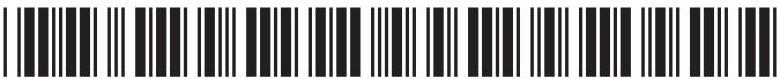

## BLANK PAGE

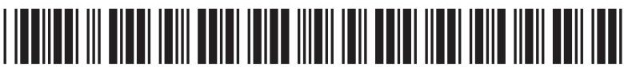

## BLANK PAGE

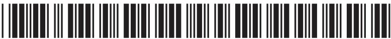

## BLANK PAGE

Every effort has been made to contact copyright holders to obtain their permission for the use of copyright material. Pearson Education Ltd. will, if notified, be happy to rectify any errors or omissions and include any such rectifications in future editions.

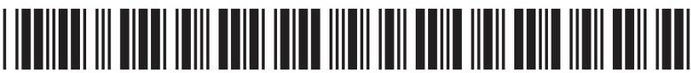
