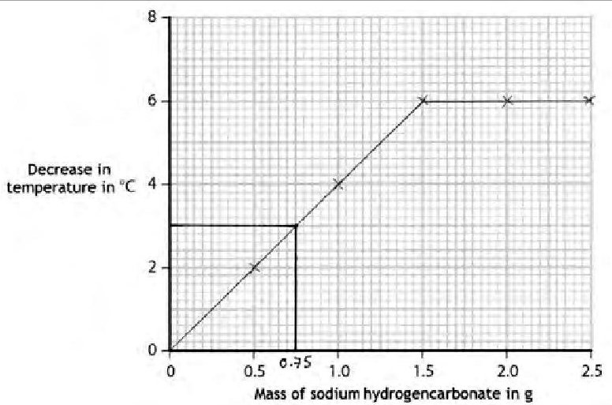

PMT
Pearson Edexcel
Mark Scheme (Results)
January 2019
Pearson Edexcel International GCSE
In Chemistry (4CH0) Paper 2C
## Edexcel and BTEC Qualifications
Edexcel and BTEC qualifications are awarded by Pearson, the UK's largest awarding body. We provide a wide range of qualifications including academic, vocational, occupational and specific programmes for employers. For further information visit our qualifications websites at www.edexcel.com or www.btec.co.uk. Alternatively, you can get in touch with us using the details on our contact us page at www.edexcel.com/contactus.
## Pearson: helping people progress, everywhere
Pearson aspires to be the world's leading learning company. Our aim is to help everyone progress in their lives through education. We believe in every kind of learning, for all kinds of people, wherever they are in the world. We've been involved in education for over 150 years, and by working across 70 countries, in 100 languages, we have built an international reputation for our commitment to high standards and raising achievement through innovation in education. Find out more about how we can help you and your students at: www.pearson.com/uk
January 2019 Publications Code 4CH0_2C_1901_MS All the material in this publication is copyright $ \textcircled{c} $ Pearson Education Ltd 2019
- All candidates must receive the same treatment. Examiners must mark the first candidate in exactly the same way as they mark the last.
- Mark schemes should be applied positively. Candidates must be rewarded for what they have shown they can do rather than penalised for omissions.
- There is no ceiling on achievement. All marks on the mark scheme should be used appropriately.
- Examiners should mark according to the mark scheme not according to their perception of where the grade boundaries may lie.
- All the marks on the mark scheme are designed to be awarded. Examiners should always award full marks if deserved, i.e. if the answer matches the mark scheme. Examiners should also be prepared to award zero marks if the candidate's response is not worthy of credit according to the mark scheme.
- Where some judgement is required,mark schemes will provide the principles by which marks will be awarded and exemplification may be limited.
- When examiners are in doubt regarding the application of the mark scheme to a candidate's response, the team leader must be consulted.
- Crossed out work should be marked UNLESS the candidate has replaced it with an alternative response.
<table border="1"><tr><td>Question number</td><td colspan="2">Answer</td><td>Notes</td><td>Marks</td></tr><tr><td rowspan="5">1</td><td>Name of apparatus</td><td>Letter</td><td rowspan="5"></td><td rowspan="5">4</td></tr><tr><td>beaker</td><td>D</td></tr><tr><td>burette</td><td>A</td></tr><tr><td>measuring cylinder</td><td>C</td></tr><tr><td>pipette</td><td>F</td></tr></table>
<table border="1"><tr><td>Question number</td><td>Answer</td><td>Notes</td><td>Marks</td></tr><tr><td rowspan="3">2(a)(i)(ii)(iii)</td><td>(contain) same number of protons/37 protons</td><td>IGNORE same atomic numberREJECT reference to electrons</td><td>1</td></tr><tr><td>(contain) different numbers of neutrons/87 has two more neutrons/85 has two fewer neutrons/85 has 48 neutrons but 87 has 50 neutrons</td><td>IGNORE reference to mass number</td><td>1</td></tr><tr><td>A(1)</td><td></td><td>1</td></tr><tr><td>(b)</td><td>M1(0.722x85)+0.278x87)OR[(72.2x85)+(27.8x87)]/100OR85.556M285.6</td><td>85.5 scores1Correct answer with no working scores2</td><td>2</td></tr></table>
<table border="1"><tr><td colspan="2">Question number</td><td>Answer</td><td>Notes</td><td>Marks</td></tr><tr><td rowspan="3">3</td><td>(a)(i)</td><td>(thermal) decomposition</td><td>IGNORE endothermic</td><td>1</td></tr><tr><td>(ii)</td><td>M1(bubble through/add to) limewater</td><td></td><td>2</td></tr><tr><td></td><td>M2turns milky</td><td>ACCEPT cloudy/turbid/white precipitateM2DEP M1</td><td></td></tr><tr><td rowspan="2">(b)(i)</td><td>(i)</td><td>gas(es)/CO2/H2O/steam/water given off/formed/evolved</td><td></td><td>1</td></tr><tr><td>(ii)</td><td>all of the NaHCO3has decomposed/reacted</td><td>ALLOW the reaction has finishedALLOW all the CO2/water/steam/H2O/gas(es)has been given off</td><td>1</td></tr></table>
<table border="1"><tr><td>Question number</td><td>Answer</td><td>Notes</td><td>Marks</td></tr><tr><td>4(a)</td><td>heat(energy)is given out/lost(to the surroundings)/heat is transferred to the surroundings</td><td>Not just energyACCEPT thermal energy is given outALLOW heat(energy)is produced/released</td><td>1</td></tr><tr><td>(b)</td><td>A</td><td></td><td>1</td></tr><tr><td>(c)</td><td>B</td><td></td><td>1</td></tr><tr><td>(d)</td><td>M1has giant(ionic structure)/giant(ionic lattice)M2strong(electrostatic)forces/strong attractionM3between(opositely charged)ionsM4large amount of(thermal/heat)energyrequired to overcome the forces/attraction</td><td>ALLOW strong bondsACCEPT large amount of(thermal/heat)energyrequired to break the bondsIGNOREmore energy</td><td>4</td></tr></table>
<table border="1"><tr><td></td><td></td><td>Any reference to covalent bonds / metallic bonding / intermolecular forces max 1 mark</td><td></td></tr></table>
<table border="1"><tr><td>Question number</td><td colspan="4">Answer</td><td>Notes</td><td>Marks</td></tr><tr><td rowspan="5">5(a)</td><td>Mass of sodium hydrogencarbonate in g</td><td>Initial temperature in ℃</td><td>Lowest temperature reached in ℃</td><td>Decrease in temperature in ℃</td><td rowspan="5">Calculations in M2 CSQ on values given in M1</td><td rowspan="5">2</td></tr><tr><td>0.5</td><td>25</td><td>22</td><td>3</td></tr><tr><td>1.0</td><td>24</td><td>20</td><td>4</td></tr><tr><td>1.5</td><td>23</td><td>18</td><td>5</td></tr><tr><td>2.0</td><td>23</td><td>18</td><td>5</td></tr><tr><td>(b)(i)</td><td colspan="4">Decrease in temperature in ℃Mass of sodium hydrogencarbonate in g</td><td>M1&amp;M2All five points plotted correctly=2Deduct one mark for each incorrectly plotted pointM3both lines drawn correctly with the aid of a rulerFirst line does not need to pass through origin and IGNORE extrapolation</td><td>3</td></tr></table>

(b) (ii)

correct value given from candidate's plotted graph

<table border="1"><tr><td>Question number</td><td>Answer</td><td>Notes</td><td>Marks</td></tr><tr><td>6(a)</td><td>n
C=C
H
H
H
H
M1 correct repeat unit with single bond between carbon atoms
M2 extension bonds, brackets and n included</td><td>Accept n anywhere after brackets but not before
Extension bonds do not need to go out of brackets
M2 DEP on M1</td><td>2</td></tr><tr><td>(b)</td><td>the polymer is the only product(of the reaction)/no small molecule is produced(as well as the polymer)</td><td>ALLOW only one type of monomer</td><td>1</td></tr></table>
<table border="1"><tr><td>(c)(i)</td><td>Any two from:
M1 strong so does not break/so can be reused
M2 low density so not heavy(when it contains the shopping)
M3 non-toxic so does not poison food/safe to use with food
M4 waterproof so contents do not get wet/bag does not tear when wet
M5 flexible so fits around the shopping
M6 can be recycled so saves resources
M7 transparent so can see contents of bag</td><td>2</td></tr><tr><td></td><td></td><td>IGNORE light
ALLOW odourless so does not taint food
IGNORE references to cost
IGNORE non-biodegradable
If two correct properties with no links allow 1 mark</td></tr></table>
<table border="1"><tr><td></td><td></td><td></td><td></td></tr><tr><td>(c)(ii)</td><td>landfill: sites get filled up/takes up(more) land burning: produces toxic/poisonous/greenhouse gas</td><td>ALLOWaccumulates(in landfill as non-biodegradable/does not breakdown/decompose)IGNOREcan produce methane which is a greenhouse gasIGNOREreference to harm to wildlife/habitats/environment/visual pollution/unpleasant smell/noise pollution/toxic leachingACCEPTproducesCO2which is a greenhouse gasACCEPTcould produce COwhich is poisonous/reduces blood capacity to carry oxygenIGNOREproduces harmful gas(es)/air pollution</td><td>2</td></tr></table>
<table border="1"><tr><td>Question number</td><td>Answer</td><td>Notes</td><td>Marks</td></tr><tr><td rowspan="4">7</td><td>M1 ions cannot flow/move when solid</td><td>ACCEPT ions are in fixed positions</td><td>2</td></tr><tr><td>M2 ions can flow/move when liquid/molten</td><td>If reference to electrons cannot/can move then 0</td><td></td></tr><tr><td>Mg2+ + 2e- $\rightarrow$ Mg</td><td></td><td>1</td></tr><tr><td>(it/steel) reacts with chlorine</td><td>IGNORE not inert</td><td>1</td></tr></table>
<table border="1"><tr><td>Question number</td><td>Answer</td><td>Notes</td><td>Marks</td></tr><tr><td rowspan="8">8(a)(i)(ii)</td><td>M1(total)vol(CO2)=480x140OR67200dm3</td><td></td><td>2</td></tr><tr><td>M2n[CO2]=(67200÷24)=2800(mol)</td><td>Mark CQ on M1</td><td></td></tr><tr><td>OR</td><td></td><td></td></tr><tr><td>M1(per person)n[CO2]=480÷24OR20(mol)</td><td></td><td></td></tr><tr><td>M2(total)n[CO2]=(20x140)=2800(mol)</td><td>Mark CQ on M1</td><td></td></tr><tr><td>M1mass ofNa2O2=2800x78(.0)OR218400(g)</td><td></td><td>2</td></tr><tr><td>ORM2from part(i)x78(.0)</td><td>Mark CQ on M1</td><td></td></tr><tr><td>M2218(.4)(kg)</td><td>ACCEPTany number of sig figs except1</td><td></td></tr></table>

(b)

<table border="1"><tr><td>M1( it/Li2O2) absorbs/reacts with more CO2(per mole/per gram)</td><td>ORA</td></tr><tr><td></td><td>ACCEPT only 1 mol Li2O2 needed per mol of CO2but 2 mol of LiOH needed per mol of CO2</td></tr><tr><td></td><td>Answers in either order</td></tr><tr><td>M2( it/Li2O2) produces oxygen</td><td></td></tr></table>
<table border="1"><tr><td>Question number</td><td>Answer</td><td>Notes</td><td>Marks</td></tr><tr><td rowspan="3">9(a)(i)(ii)</td><td>M1(⇌) (reaction is) reversible</td><td>IGNORE references to equilibrium</td><td>2</td></tr><tr><td>M2(ΔH) enthalpy change (of reaction)</td><td>ACCEPT heat (energy) change NOT just energy change</td><td></td></tr><tr><td>phosphoric acid</td><td>ALLOW H3PO4</td><td>1</td></tr><tr><td rowspan="7">(b)(i)</td><td>M1(yield/it/amount of ethanol) increases</td><td>IGNORE equilibrium shifts to the right</td><td>2</td></tr><tr><td>M2because (forward) reaction is exothermic</td><td>ACCEPT backward reaction is endothermic</td><td></td></tr><tr><td></td><td>IGNORE because reaction moves in exothermic direction</td><td></td></tr><tr><td></td><td>IGNORE references to rate</td><td></td></tr><tr><td></td><td>IGNORE references to Le Chatelier&#x27;s principle, eg lower temperature favours the exothermic reaction / equilibrium position shifts to raise the temperature</td><td></td></tr><tr><td>M2DEP M1</td><td></td><td></td></tr></table>
<table border="1"><tr><td rowspan="7">i)</td><td>M1(yield/it/amount of ethanol) decreases</td><td>IGNOREequilibrium shifts to the left</td><td>2</td></tr><tr><td>M2because there are more moles/molecules(of gas) on the left/ORA</td><td>ALLOWparticles</td><td></td></tr><tr><td></td><td>REJECTatoms</td><td></td></tr><tr><td></td><td>ACCEPTthere are more moles/molecules of reactants</td><td></td></tr><tr><td></td><td>IGNOREreaction moves to the side with the larger number of moles/molecules</td><td></td></tr><tr><td></td><td>IGNOREreferences to rate</td><td></td></tr><tr><td></td><td>IGNOREreferences to Le Chatelier&#x27;s principle, eg lower pressure favours the reaction that produces the larger number of moles(of gas)/equilibrium position shifts to increase the pressure</td><td></td></tr><tr><td></td><td>M2DEP M1</td><td></td><td></td></tr></table>
<table border="1"><tr><td>(c)(i)</td><td>dehydration</td><td>ALLOW(thermal) decomposition</td><td>1</td></tr><tr><td>(ii)</td><td>crude oil is a finite resource/crude oil will eventually run out</td><td>ALLOWcrude oil non-renewableIGNOREreference to cost</td><td>1</td></tr></table>
<table border="1"><tr><td>Question number</td><td>Answer</td><td>Notes</td><td>Marks</td></tr><tr><td rowspan="3">10(a)(i)</td><td>M1 lanthanum</td><td></td><td>2</td></tr><tr><td>M2 melting point is below 1030(℃)</td><td>ALLOW melting point/920(℃) is lower than operating temperature</td><td></td></tr><tr><td>Sm2O3+6HCl→2SmCl3+3H2O</td><td>IGNORE(lanthanum) has lowest melting pointM2DEP M1</td><td>1</td></tr><tr><td>(ii)</td><td></td><td></td><td></td></tr></table>
<table border="1"><tr><td></td><td></td><td></td><td></td></tr><tr><td>(b)</td><td>M1(samarium) ions in layers/rows/planes/sheetsM2slide/slip(over each other)</td><td>ACCEPTatoms/cations/particles for ionsReject moleculesAllow OWTTE, eg flow/shift/roll/moveM2DEP on mention of EITHER layers or equivalentOR mention of ions or equivalentDo not award M2if molecules/protons/electrons/nuclei in place of ions etcIf reference to ionic bonding/covalent bonding/molecules/intermolecular forces, no M1or M2Not just electronsIGNOREfree electronsM4(can) flow/travel/move(through structure)/are mobile(when voltage/pd is applied)</td><td>4</td></tr></table>