<table><tr><td colspan="3">Please check the examination details below before entering your candidate information</td></tr><tr><td>Candidate surname</td><td colspan="2">Other names</td></tr><tr><td>Centre Number</td><td colspan="2">Candidate Number</td></tr><tr><td colspan="3">Pearson Edexcel International GCSE</td></tr><tr><td colspan="3">Wednesday 16 January 2019</td></tr><tr><td>Afternoon (Time: 1 hour)</td><td colspan="2">Paper Reference 4CH0/2C</td></tr><tr><td colspan="3">Chemistry
Unit: 4CH0
Paper: 2C</td></tr><tr><td colspan="3">You must have:
Calculator, ruler</td></tr><tr><td colspan="3">Total Marks</td></tr></table>

## Instructions

- Use black ink or ball-point pen.

- Fill in the boxes at the top of this page with your name, centre number and candidate number.

- Answer all questions.

- Answer the questions in the spaces provided

- there may be more space than you need.

- Show all the steps in any calculations and state the units.

- Some questions must be answered with a cross in a box. If you change your mind about an answer, put a line through the box and then mark your new answer with a cross.

## Information

- The total mark for this paper is 60.

- The marks for each question are shown in brackets

- use this as a guide as to how much time to spend on each question.

## Advice

- Read each question carefully before you start to answer it.

- Write your answers neatly and in good English.

- Try to answer every question.

- Check your answers if you have time at the end.

Turn over

<table class="table table-bordered"><thead><tr><th>1</th><th>2</th><th>3</th><th>4</th><th>5</th><th>6</th><th>7</th><th>8</th><th>9</th><th>10</th></tr></thead><tbody><tr><td>7 Li Lithium 3</td><td>9 Be Beryllium 4</td><td></td><td></td><td></td><td></td><td></td><td></td><td></td><td></td><td></td></tr><tr><td>23 Na Sodium 11</td><td>24 Mg Magnesium 12</td><td></td><td></td><td></td><td></td><td></td><td></td><td></td><td></td><td></td></tr><tr><td>39 K Potassium 19</td><td>40 Ca Calcium 20</td><td>45 Sc Scandium 21</td><td>48 Ti Titanium 22</td><td>51 V Vanadium 23</td><td>52 Cr Chromium 24</td><td>55 Mn Manganese 25</td><td>56 Fe Iron 26</td><td>59 Co Cobalt 27</td><td>59 Ni Nickel 28</td><td>63.5 Cu Copper 29</td><td>65 Zn Zinc 30</td><td>70 Ga Gallium 31</td><td>73 Ge Germanium 32</td><td>75 As Arsenic 33</td><td>79 Se Selenium 34</td><td>80 Br Bromine 35</td><td>84 Kr Krypton 36</td></tr><tr><td>86 Rb Hubidium 37</td><td>88 Sr Strontium 38</td><td>89 Y Yttrium 39</td><td>91 Zr Zirconium 40</td><td>93 Nb Niobium 41</td><td>96 Mo Molybdenum 42</td><td>99 Tc Technelium 43</td><td>101 Ru Ruthenium 44</td><td>103 Rh Rhodium 45</td><td>106 Pd Palladium 46</td><td>108 Ag Silver 47</td><td>112 Cd Cadmium 48</td><td>115 In Indium 49</td><td>119 Sn Tin 50</td><td>122 Sb Antimony 51</td><td>128 Te Tellurium 52</td><td>127 I Iodine 53</td><td>131 Xe Xenon 54</td></tr><tr><td>133Cs Caesium 55</td><td>137Ba Barium 56</td><td>139La Lanthanum 57</td><td>179Hf Hafnium 72</td><td>181Ta Tantalum 73</td><td>184W Tungsten 74</td><td>186Re Rhenium 75</td><td>190Os Osmium 76</td><td>192Ir Iridium 77</td><td>195Pt Platinum 78</td><td>197Au Gold 79</td><td>201Hg Mercury 80</td><td>204Ti Thallium 81</td><td>207Pb Lead 82</td><td>209Bi Bismuth 83</td><td>210Po Polonium 84</td><td>210At Astatine 85</td><td>222Rn Radon 86</td></tr><tr><td>223Fr Francium 87</td><td>226Ra Radium 88</td><td>227Ac Actinium 89</td><td></td><td></td><td></td><td></td><td></td><td></td><td></td><td></td><td></td><td></td><td></td><td></td><td></td><td></td></tr></tbody></table>
## BLANK PAGE
## Answer ALL questions.
1 The diagram shows six pieces of apparatus that are used in the laboratory.

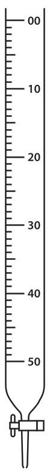

A

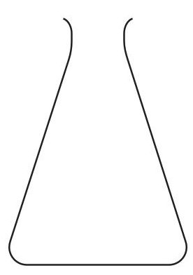

B

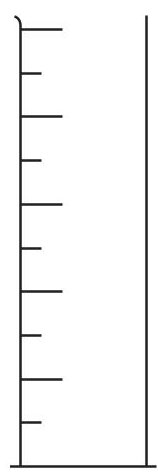

C

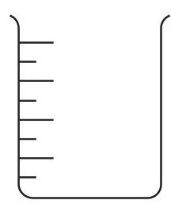

D

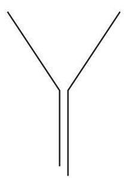

E

F

The table lists the names of four pieces of apparatus.
Complete the table by giving a letter, A, B, C, D, E or F, to identify each piece of apparatus listed.

(4) 

<table border="1"><tr><td>Name of apparatus</td><td>Letter</td></tr><tr><td>beaker</td><td></td></tr><tr><td>burette</td><td></td></tr><tr><td>measuring cylinder</td><td></td></tr><tr><td>pipette</td><td></td></tr></table>
2 Rubidium is an element in Group 1 of the Periodic Table. 85 87 A sample of rubidium contains two isotopes, $ _{37}Rb $ and $ _{37}Rb $ (a) (i) State how the nuclei of the two isotopes are similar.
(ii) State how the nuclei of the two isotopes are different.
(iii) How many electrons are in the outer shell of a rubidium atom?
A 1
B 3
C 9
D 37
(b) The relative abundances of the two isotopes in the sample of rubidium are
$ _{37}^{85} $ Rb 72.2 % $ _{37}^{87} $ Rb 27.8 %
Calculate the relative atomic mass of rubidium Give your answer to one decimal place.
relative atomic mass=
(Total for Question 2 = 5 marks)
3 A student uses this apparatus to investigate the action of heat on sodium hydrogencarbonate $ \mathrm{(N a H C O_{3})}. $

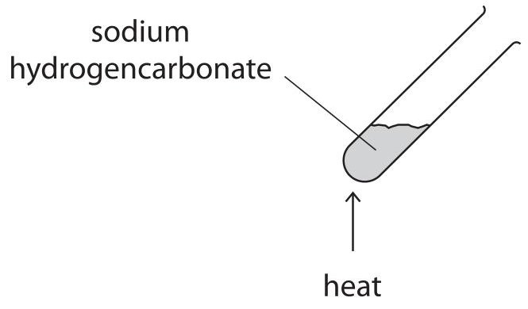

The equation for the reaction is
$$
2 \mathrm {N a H C O} _ {3} (\mathrm {s}) \rightarrow \mathrm {N a} _ {2} \mathrm {C O} _ {3} (\mathrm {s}) + \mathrm {H} _ {2} \mathrm {O} (\mathrm {g}) + \mathrm {C O} _ {2} (\mathrm {g})
$$
(a) (i) State the type of reaction taking place.
(ii) Describe a test to show that the gas given off is carbon dioxide.
(b) The student heats a 1.00g sample of sodium hydrogencarbonate for one minute. He then measures the mass of solid left in the test tube.
He repeats the experiment four times, heating separate samples of mass 1.00 g for a different number of minutes each time.
The table shows the student's results.
<table border="1"><tr><td>Time in minutes</td><td>1</td><td>2</td><td>3</td><td>4</td><td>5</td></tr><tr><td>Mass of solid left in test tube in g</td><td>0.89</td><td>0.78</td><td>0.69</td><td>0.63</td><td>0.63</td></tr></table>
(i) State why the mass of solid in each test tube decreases.
(ii) Suggest why the mass of solid stops decreasing after four minutes.
(Total for Question 3 = 5 marks)
4 Sodium reacts with fluorine to form sodium fluoride. The reaction is very exothermic.
(a) State what is meant by the term exothermic.
(b) The diagram shows the electronic configuration of a sodium atom.

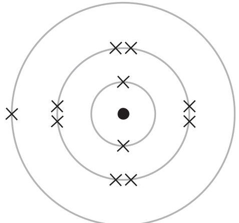

Which of these diagrams shows the electronic configuration of a fluorine atom?

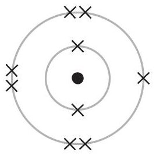

A

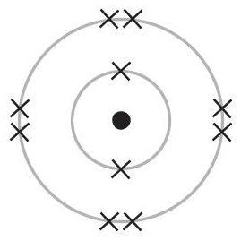

B

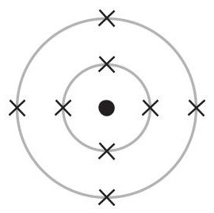

C

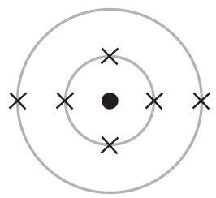

D

(c) Sodium ions and fluoride ions are formed when sodium reacts with fluorine.
The diagram shows the electronic configuration and charge of a fluoride ion.

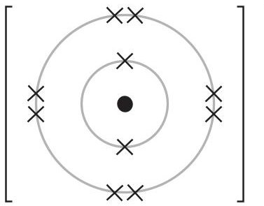

Which of these diagrams shows the electronic configuration and charge of a sodium ion?

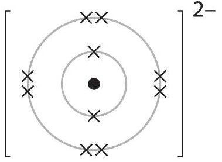

(1) 

A

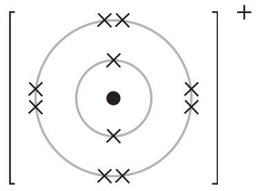

B

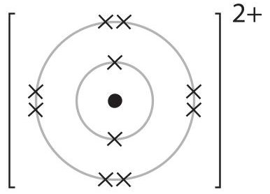

C

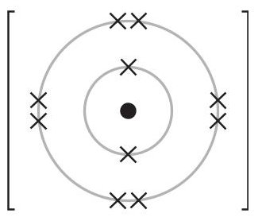

D

(d) Explain, in terms of its structure and bonding, why sodium fluoride has a high melting point.

(4) 

5 A student finds the temperature change when a mass of 0.5 g of sodium hydrogencarbonate is added to $ 5 0 \mathrm{c m}^{3} $ of a solution of citric acid.
She repeats the experiment using masses of 1.0g, 1.5g and 2.0g of sodium hydrogencarbonate.

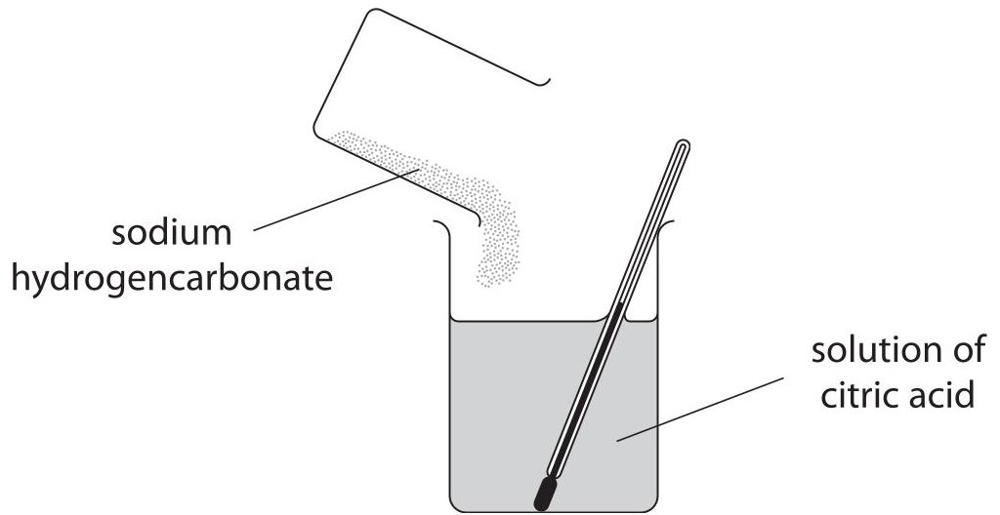

(a) The diagrams of the thermometer show the lowest temperature reached, in $ ^{\circ} \mathrm{C} $ for each experiment.

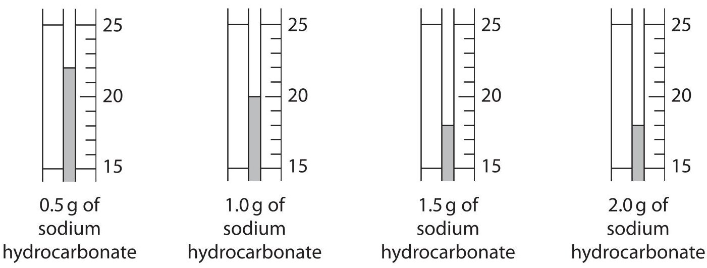

Use the diagrams to complete the table of results.

(2) 

<table border="1"><tr><td>Mass of sodium hydrogencarbonate in g</td><td>Initial temperature in℃</td><td>Lowest temperature reached in℃</td><td>Decrease in temperature in℃</td></tr><tr><td>0.5</td><td>25</td><td></td><td></td></tr><tr><td>1.0</td><td>24</td><td></td><td></td></tr><tr><td>1.5</td><td>23</td><td></td><td></td></tr><tr><td>2.0</td><td>23</td><td></td><td></td></tr></table>
(b) Another student does the experiment.
The table shows his results.
<table border="1"><tr><td>Mass of sodium hydrogencarbonate in g</td><td>0.5</td><td>1.0</td><td>1.5</td><td>2.0</td><td>2.5</td></tr><tr><td>Decrease in temperature in℃</td><td>2</td><td>4</td><td>6</td><td>6</td><td>6</td></tr></table>
(i) Plot this student's results on the grid.
Draw a straight line of best fit through the first three points and another straight line of best fit through the last two points.
Make sure the two lines cross.

(3) 

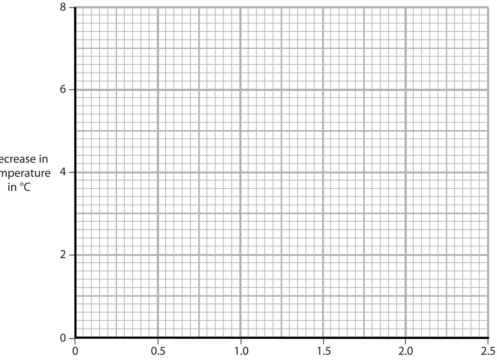

Mass of sodium hydrogencarbonate in g
(ii) Use your graph to find the mass of sodium hydrogencarbonate required to produce a decrease in temperature of $ 3^{\circ} \mathrm{C}. $
mass = g
(Total for Question 5 = 6 marks)
6 Poly(ethene) is an addition polymer made from ethene, $ \mathrm{C_{2} H_{4}} $
(a) Complete the equation to show the formation of poly(ethene) from ethene.

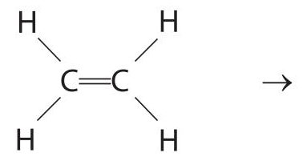

(b) State why poly(ethene) is described as an addition polymer, not a condensation polymer.
(c) Many shopping bags are made of poly(ethene).
(i) One useful property of poly(ethene) is that it is inert so it does not react with food. Explain two other properties of poly(ethene) that make it useful for shopping bags.
(ii) Another property of poly(ethene) is that it is non-biodegradable. Two methods of disposing of poly(ethene) are landfill and burning. Give one problem caused by each method of disposal.
landfill.
burning
(Total for Question 6 = 7 marks)
7 Magnesium can be obtained by the electrolysis of magnesium chloride. Solid magnesium chloride is obtained from seawater.
The magnesium chloride is melted and then electrolysed. The positive electrode is made of graphite and the negative electrode is made of steel.
Magnesium forms at the negative electrode. Chlorine forms at the positive electrode.
(a) Explain why the magnesium chloride has to be melted before it can be electrolysed.
(b) Write an ionic half-equation to represent the formation of magnesium at the negative electrode.
(c) Suggest why steel is not used for the positive electrode.
(Total for Question 7 = 4 marks)
8 Submarines that spend a long time underwater use sodium peroxide $ \mathrm{(N a_{2} O_{2})} $ to absorb carbon dioxide $ \mathrm{(C O_{2})} $ from the air in the submarine.
The equation for the reaction is
$$
2 \mathrm {N a} _ {2} \mathrm {O} _ {2} + 2 \mathrm {C O} _ {2} \rightarrow 2 \mathrm {N a} _ {2} \mathrm {C O} _ {3} + \mathrm {O} _ {2}
$$
(a) There are 140 people on the submarine.
Each person produces $ 4 8 0 \mathrm{d m}^{3} $ of carbon dioxide per day.
(i) Calculate the total amount, in moles, of carbon dioxide produced on the submarine in one day.
[assume 1 mol of $ \mathrm{C O_{2}} $ occupies $ 2 4. 0 \mathrm{d m}^{3} $]
$$
\mathrm {C O} _ {2} =
$$
(ii) Calculate the mass, in kilograms, of sodium peroxide required to absorb all of the carbon dioxide produced in the submarine in one day. $ [ M_{r} $ of $ \mathrm{N a_{2} O_{2}}=7 8. 0 ] $
$$
\mathrm {m a s s o f N a} _ {2} \mathrm {O} _ {2} =
$$
(b) Spaceships use either lithium hydroxide (LiOH) or lithium peroxide $ \mathrm{(L i_{2} O_{2})} $ to absorb carbon dioxide.
Equation 1
The equations for the two reactions are
$$
2 \mathrm {L i O H} + \mathrm {C O} _ {2} \rightarrow \mathrm {L i} _ {2} \mathrm {C O} _ {3} + \mathrm {H} _ {2} \mathrm {O}
$$
Equation 2
$$
2 \mathrm {L i} _ {2} \mathrm {O} _ {2} + 2 \mathrm {C O} _ {2} \rightarrow 2 \mathrm {L i} _ {2} \mathrm {C O} _ {3} + \mathrm {O} _ {2}
$$
Using information from the equations, give two reasons why lithium peroxide is more suitable than lithium hydroxide for use on spaceships.
(Total for Question 8 = 6 marks)
9 Ethanol $ \left( \mathrm{C}_{2} \mathrm{H}_{5} \mathrm{O H} \right) $ is made in industry by reacting ethene $ \left( \mathrm{C}_{2} \mathrm{H}_{4} \right) $ with steam at a temperature of $ 3 0 0^{\circ} \mathrm{C} $ and a pressure of 70 atm. The percentage yield of ethanol is 43%.
The equation for the reaction is
$$
\mathrm {C} _ {2} \mathrm {H} _ {4} (\mathrm {g}) + \mathrm {H} _ {2} \mathrm {O} (\mathrm {g}) \rightleftharpoons \mathrm {C} _ {2} \mathrm {H} _ {5} \mathrm {O H} (\mathrm {g}) \quad \Delta H = - 4 5. 3 \mathrm {k J / m o l}
$$
(a) (i) State what the symbols $ \rightleftharpoons $ and $ \Delta H $ represent.
$ \Delta H $
(ii) Name the catalyst used in this industrial process.
(b) (i) Predict the effect on the yield of ethanol if the reaction is carried out at a temperature lower than $ 3 0 0^{\circ} \mathrm{C} $ , but at the same pressure of 70 atm. [assume reaction reaches equilibrium]
Give a reason for your answer.
(ii) Predict the effect on the yield of ethanol if the reaction is carried out at a pressure lower than 70 atm, but at the same temperature of $ 3 0 0^{\circ} \mathrm{C}. $ [assume reaction reaches equilibrium]
Give a reason for your answer.
(c) One method of obtaining ethene is by cracking crude oil fractions. Ethene can also be made by passing ethanol vapour over a hot aluminium oxide catalyst. The equation for the reaction is
$$
\mathrm {C} _ {2} \mathrm {H} _ {5} \mathrm {O H} (\mathrm {g}) \rightarrow \mathrm {C} _ {2} \mathrm {H} _ {4} (\mathrm {g}) + \mathrm {H} _ {2} \mathrm {O} (\mathrm {g})
$$
(i) State the type of reaction taking place.
(ii) Suggest why it may be necessary, in the future, to make ethene using this reaction rather than by cracking crude oil fractions.
(Total for Question 9 = 9 marks)
10 Samarium, Sm, is a metal used to make powerful magnets.
(a) Samarium can be obtained by heating its oxide with lanthanum, La.
$$
\mathrm {S m} _ {2} \mathrm {O} _ {3} + 2 \mathrm {L a} \rightarrow 2 \mathrm {S m} + \mathrm {L a} _ {2} \mathrm {O} _ {3}
$$
The table shows the melting points of the substances involved in this reaction.
<table border="1"><tr><td>Substance</td><td>samarium</td><td>samarium oxide</td><td>lanthanum</td><td>lanthanum oxide</td></tr><tr><td>Melting point in℃</td><td>1072</td><td>2335</td><td>920</td><td>2315</td></tr></table>
(i) The operating temperature for this reaction is $ 1 0 3 0^{\circ} \mathrm{C} $
Explain which substance in the table could exist as a liquid at this temperature.
(ii) Samarium oxide neutralises hydrochloric acid to form samarium chloride, $ \mathrm{S m C l}_{3} $ Write a chemical equation for this reaction.
(b) The diagram shows the arrangement of the particles in samarium.

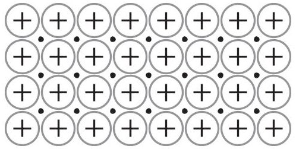

Key

samarium ion
- electron
Explain why samarium is malleable and is a good conductor of electricity.
(4) 
(Total for Question 10 = 7 marks)
## TOTAL FOR PAPER = 60 MARKS
## BLANK PAGE
