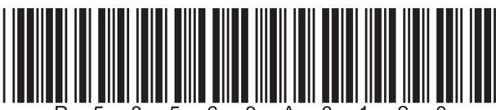
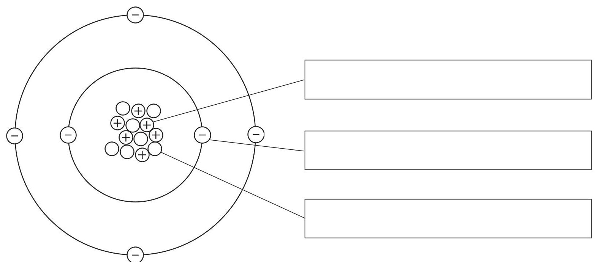
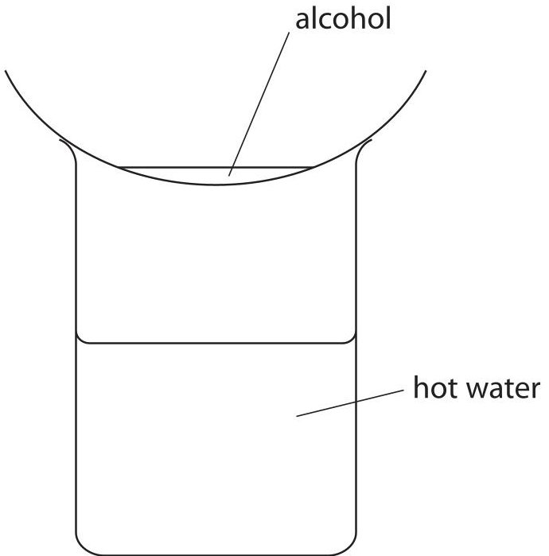
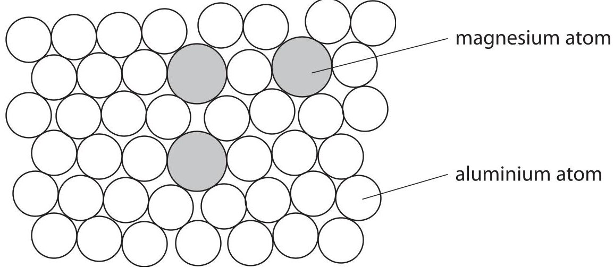
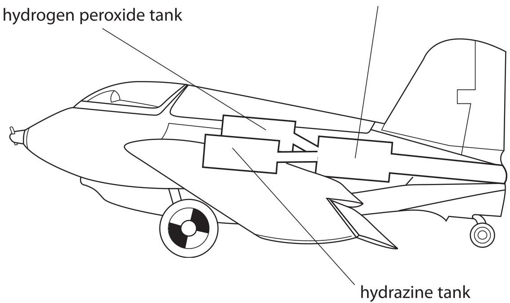
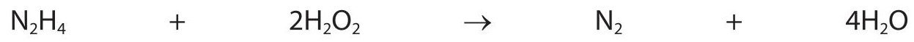
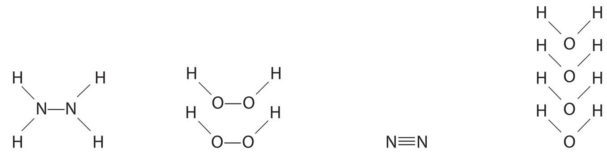
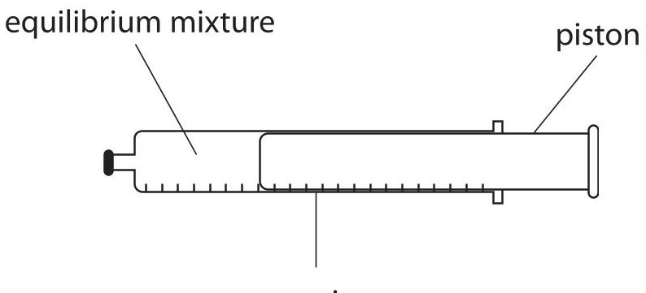
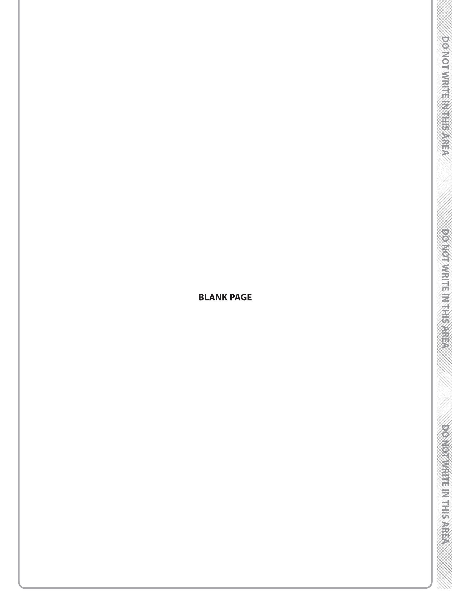

<table><tr><td colspan="3">Please check the examination details below before entering your candidate information</td></tr><tr><td>Candidate surname</td><td colspan="2">Other names</td></tr><tr><td colspan="3">Centre Number</td></tr><tr><td colspan="3">Candidate Number</td></tr><tr><td colspan="3">Pearson Edexcel
International GCSE (9-1)</td></tr><tr><td colspan="3">Wednesday 12 June 2019</td></tr><tr><td>Morning (Time: 1 hour 15 minutes)</td><td colspan="2">Paper Reference 4CH1/2C</td></tr><tr><td colspan="3">Chemistry
Unit: 4CH1
Paper 2C</td></tr><tr><td colspan="3">You must have:
Calculator, ruler</td></tr><tr><td colspan="3">Total Marks</td></tr></table>

## Instructions

- Use black ink or ball-point pen.

- Fill in the boxes at the top of this page with your name, centre number and candidate number.

- Answer all questions.

- Answer the questions in the spaces provided

- Some questions must be answered with a cross in a box. If you change your mind about an answer, put a line through the box and then mark your new answer with a cross.

## Information

- The total mark for this paper is 70.

- The marks for each question are shown in brackets

- use this as a guide as to how much time to spend on each question.

## Advice

- Try to answer every question.

- Read each question carefully before you start to answer it.

- Check your answers if you have time at the end.

Turn over

The Periodic Table of the Elements

<table border="1"><tr><td>7Li lithium3</td><td>9Be beryllium4</td><td colspan="12">Key</td><td>4He helium2</td></tr><tr><td>23Na sodium11</td><td>24Mg magnesium12</td><td colspan="12">relative atomic mass atomic symbol atomic (proton) number</td><td>20Ne neon10</td></tr><tr><td>39K potassium19</td><td>40Ca calcium20</td><td>45Sc scandium21</td><td>48Ti titanium22</td><td>51V vanadium23</td><td>52Cr chromium24</td><td>55Mn manganese25</td><td>56Fe iron26</td><td>59Co cobalt27</td><td>59Ni nickel28</td><td>63.5Cu copper29</td><td>65Zn zinc30</td><td>70Ga gallium31</td><td>73Ge germanium32</td><td>75As arsenic33</td><td>79Se selenium34</td><td>80Br bromine35</td><td>84Kr krypton36</td></tr><tr><td>85Rb rubidium37</td><td>88Sr strontium38</td><td>89Y yttrium39</td><td>91Zr zirconium40</td><td>93Nb niobium41</td><td>96Mo molybdenum42</td><td>[98]Tc technetium43</td><td>101Ru ruthenium44</td><td>103Rh rhodium45</td><td>106Pd palladium46</td><td>108Ag silver47</td><td>112Cd cadmium48</td><td>115In indium49</td><td>119Sn tin50</td><td>122Sb antimony51</td><td>128Te tellurium52</td><td>127I iodine53</td><td>131Xe xenon54</td></tr><tr><td>133Cs caesium55</td><td>137Ba barium56</td><td>139La* lanthanum57</td><td>178Hf hafnium72</td><td>181Ta tantalum73</td><td>184W tungsten74</td><td>186Re rhenium75</td><td>190Os osmium76</td><td>192Ir iridium77</td><td>195Pt platinum78</td><td>197Au gold79</td><td>201Hg mercury80</td><td>204Tl thallium81</td><td>207Pb lead82</td><td>209Bi bismuth83</td><td>[209]Po polonium84</td><td>[210]At astatine85</td><td>[222]Rn radon86</td></tr><tr><td>[223]Fr francium87</td><td>[226]Ra radium88</td><td>[227]Ac* actinium89</td><td>[261]Rf rutherfordium104</td><td>[262]Db dubnium105</td><td>[266]Sg seaborgium106</td><td>[264]Bh bohrium107</td><td>[277]Hs hassium108</td><td>[268]Mt meitnerium109</td><td>[271]Ds darmstadtium110</td><td>[272]Rg roentgenium111</td><td colspan="6">Elements with atomic numbers 112-116 have been reported but not fully authenticated</td></tr></table>

* The lanthanoids (atomic numbers 58-71) and the actinoids (atomic numbers 90-103) have been omitted The relative atomic masses of copper and chlorine have not been rounded to the nearest whole number.

## Answer ALL questions. Write your answers in the spaces provided.

1 The diagram shows the particles in an atom of an element.

(a) The box gives the names of some particles.

electron ion molecule neutron proton

Use words from the box to label the diagram.

(b) Give the mass number of this atom.

(c) Complete the sentence about isotopes.

Isotopes are atoms that have the same number of ...

but have a different number of ...

(Total for Question 1 = 6 marks)

2 The table gives some information about the halogens, chlorine, bromine and iodine.

<table border="1"><tr><td>Halogen</td><td>Physical state at room temperature</td><td>Colour</td></tr><tr><td>chlorine</td><td>gas</td><td>pale green</td></tr><tr><td>bromine</td><td></td><td>red-brown</td></tr><tr><td>iodine</td><td>solid</td><td></td></tr></table>

(a) Complete the table.

(b) Chlorine has two isotopes of mass numbers 35 and 37 The relative percentage of each isotope in a sample of chlorine is chlorine-35 77.78% chlorine-37 22.22% Calculate the relative atomic mass of this sample of chlorine. Give your answer to one decimal place.

## relative atomic mass

(c) A student is given an aqueous solution of chlorine and an aqueous solution of potassium bromide.

Explain how he can use these two solutions to compare the reactivity of chlorine with the reactivity of bromine.

(Total for Question 2 = 9 marks)

## BLANK PAGE

3 Methanol, ethanol, propanol and butanol are alcohols. They are all liquids that evaporate easily when warmed.

A student uses this apparatus to compare the time taken for the four liquids to evaporate.

She uses this method.

- pour some methanol into an evaporating basin

- place the evaporating basin on top of a beaker containing hot water

- measure the time taken for the methanol to evaporate completely

- repeat the experiment with each of the other alcohols, using the same apparatus

(a) State two variables the student should control to make sure her results are valid.

(b) State why it is not safe to heat the evaporating basin directly with a Bunsen flame.

(c) The table shows the results of experiments done by four students, A, B, C and D.

<table border="1"><tr><td rowspan="2">Alcohol</td><td rowspan="2">Formula of alcohol</td><td colspan="5">Time taken for liquid to evaporate in s</td></tr><tr><td>Student A</td><td>Student B</td><td>Student C</td><td>Student D</td><td>Mean time in s</td></tr><tr><td>methanol</td><td>CH3OH</td><td>20</td><td>24</td><td>22</td><td>26</td><td>23</td></tr><tr><td>ethanol</td><td>C2H5OH</td><td>32</td><td>34</td><td>35</td><td>30</td><td>33</td></tr><tr><td>propanol</td><td>C3H7OH</td><td>45</td><td>47</td><td>50</td><td>48</td><td>48</td></tr><tr><td>butanol</td><td>C4H9OH</td><td>64</td><td>63</td><td>90</td><td>60</td><td></td></tr></table>

(i) Calculate the mean (average) time for butanol to evaporate.

mean time=

(ii) Explain how the results show which alcohol evaporates most easily.

(iii) State the relationship between the number of carbon atoms in the molecule and how easily the alcohol evaporates.

(Total for Question 3 = 9 marks)

4 This question is about metals.

(a) Which statement describes metallic bonding?

A electrostatic attraction between oppositely charged ions

B electrostatic attraction between the nuclei of two atoms and a pair of electrons shared between them

C electrostatic attraction between positively charged particles and delocalised electrons

D electrostatic attraction between atoms

(b) Aluminium is malleable and can be easily shaped to make saucepans used for cooking food.

State two other properties of aluminium that make it suitable for saucepans used for cooking food.

(c) Magnalium is an alloy of aluminium and magnesium.

The diagram shows how the atoms are arranged in this alloy.

(i) State what is meant by the term alloy.

(ii) Explain why magnalium is harder than aluminium.

(Total for Question 4 = 7 marks)

5 During the Second World War, engineers developed a rocket-powered aircraft.

combustion chamber

The aircraft carried these two liquids

- hydrazine, $ \mathrm{N_{2} H_{4}} $

- hydrogen peroxide, $ \mathrm{H_{2}O_{2}} $

When these two liquids mix in the combustion chamber, they evaporate and then react rapidly to form nitrogen gas, $ \mathrm{N}_{2} $ , and steam, $ \mathrm{H}_{2}\mathrm{O} $

The reaction is exothermic.

The equation for the reaction is

The displayed formulae for the reactants and products are

(a) The tables give the bond energies for the bonds broken in the reactants and the bonds made in the products.

<table border="1"><tr><td colspan="2">Bonds broken</td></tr><tr><td>bond</td><td>bond energy in kJ/mol</td></tr><tr><td>N-N</td><td>159</td></tr><tr><td>N-H</td><td>391</td></tr><tr><td>O-O</td><td>143</td></tr><tr><td>O-H</td><td>463</td></tr></table>

<table border="1"><tr><td colspan="2">Bonds made</td></tr><tr><td>bond</td><td>bond energy in kJ/mol</td></tr><tr><td>N≡N</td><td>945</td></tr><tr><td>O—H</td><td>463</td></tr></table>

(i) Use the data in the tables to calculate the total amount of energy required to break all of the bonds in the reactants.

(ii) Use the data in the tables to calculate the total amount of energy released when all of the bonds in the products are made.

(iii) Calculate the enthalpy change, $ \Delta H $ , in kJ/mol, for the reaction Include a sign in your answer.

$ \Delta H= $ kJ/mol

(b) Explain, in terms of bonds broken and bonds made, why this reaction is exothermic.

(c) Draw an energy level diagram for the reaction between $ \mathrm{N_{2} H_{4}} $ and $ \mathrm{H_{2}O_{2}} $

## BLANK PAGE

6 Some cars in Brazil use ethanol, $ \mathrm{C_{2} H_{5} O H} $ , as a fuel instead of petrol.

The ethanol is made by the fermentation of glucose which is obtained from sugar cane.

The sugar is extracted from the sugar cane and then dissolved in water to make a sugar solution.

(a) (i) Name the substance that is added to the sugar solution that causes glucose to ferment.

(ii) Which temperature is the most suitable for fermentation?

$$
\begin{array}{l} \square A 0 ^ {\circ} C \\ \square B 1 0 ^ {\circ} C \\ \square C 3 0 ^ {\circ} C \\ \square D 8 0 ^ {\circ} C \\ \end{array}
$$

(iii) Explain why fermentation is done in the absence of air.

(b) (i) State what is meant by the term fuel.

(ii) Write a chemical equation for the complete combustion of ethanol in air.

(c) Ethanol is also manufactured by reacting steam with ethene, $ \mathrm{C_{2} H_{4}} $ The equation for this reaction is

$$
\mathrm {C} _ {2} \mathrm {H} _ {4} (\mathrm {g}) + \mathrm {H} _ {2} \mathrm {O} (\mathrm {g}) \rightarrow \mathrm {C} _ {2} \mathrm {H} _ {5} \mathrm {O H} (\mathrm {g})
$$

State the conditions of temperature and pressure used in this process.

(d) When ethanol is heated with acidified potassium dichromate(VI), it is oxidised to ethanoic acid.

(i) State the colour change that occurs in the potassium dichromate(VI) during this reaction.

(ii) The structural formula of ethanoic acid is $ \mathrm{C H_{3} C O O H} $

Draw the displayed formula of ethanoic acid.

(iii) Complete the equation for the reaction of ethanoic acid with sodium.

$$
\mathrm {C H} _ {3} \mathrm {C O O H} (\mathrm {a q}) + \dots \dots \dots \dots \dots \dots \mathrm {N a} (\mathrm {s}) \rightarrow
$$

7 Dinitrogen tetraoxide, $ \mathrm{N_{2}O_{4}} $ , is a colourless gas.

Nitrogen dioxide, $ \mathrm{N O}_{2} $ is a brown gas.

The two gases can exist together in dynamic equilibrium according to the equation

$$
\mathrm {N} _ {2} \mathrm {O} _ {4} (\mathrm {g}) \rightleftharpoons 2 \mathrm {N O} _ {2} (\mathrm {g})
$$

(a) Explain what is meant by the term dynamic equilibrium.

(b) Some $ \mathrm{N_{2}O_{4}} $ and some $ \mathrm{NO_{2}} $ are put into a sealed gas syringe and allowed to form an equilibrium mixture.

This equilibrium mixture is brown.

(i) The pressure of the gas in the syringe is increased by pushing in the piston. The mixture is then allowed to reach a new equilibrium at the same temperature as before.

Explain why the new equilibrium mixture contains less $ \mathrm{N O_{2}} $ than the original equilibrium mixture.

(ii) A student suggests that the new equilibrium mixture would be lighter in colour than the original equilibrium mixture, as there is now less $ \mathrm{N O_{2}} $ present. Suggest why the new equilibrium mixture is actually darker than the original.

(c) Carbon monoxide, CO, and oxides of nitrogen are produced in a car engine when petrol is burned.

These oxides can be partly removed by using a catalytic converter fitted to the car's exhaust system.

(i) State how oxides of nitrogen are produced in the car engine.

(ii) Give a disadvantage of allowing oxides of nitrogen to escape into the atmosphere.

(iii) Write a chemical equation for the reaction between nitrogen monoxide, NO, and carbon monoxide to form carbon dioxide and nitrogen.

(Total for Question 7 = 8 marks)

8 The concentration of NaClO(aq) in a solution of bleach is found by reacting it with hydrochloric acid.

The equation for the reaction is

$$
\mathrm {N a C l O} (\mathrm {a q}) + 2 \mathrm {H C l} (\mathrm {a q}) \rightarrow \mathrm {N a C l} (\mathrm {a q}) + \mathrm {H} _ {2} \mathrm {O} (\mathrm {I}) + \mathrm {C l} _ {2} (\mathrm {g})
$$

An excess of dilute hydrochloric acid is added to $ 4. 0 0 \mathrm{c m}^{3} $ of bleach solution. $ 6 0. 0 \mathrm{c m}^{3} $ of chlorine gas is produced.

(a) Explain a safety precaution that should be taken when doing this experiment.

(b) (i) Calculate the amount, in moles, of chlorine gas produced. Assume one mole of chlorine gas occupies $ 2 4 0 0 0 \mathrm{c m}^{3}. $

(ii) Determine the amount, in moles, of $ \mathrm{N a C l O} $ in $ 4. 0 0 \mathrm{c m}^{3} $ of bleach.

(iii) Calculate the concentration, in mol/dm $ ^{3} $ , of the bleach solution.

(Total for Question 8 = 7 marks)

TOTAL FOR PAPER = 70 MARKS

## BLANK PAGE

