<table><tr><td colspan="3">Please check the examination details below before entering your candidate information</td></tr><tr><td>Candidate surname</td><td colspan="2">Other names</td></tr><tr><td colspan="3">Centre Number</td></tr><tr><td colspan="3">Candidate Number</td></tr><tr><td colspan="3">Pearson Edexcel
International GCSE (9-1)</td></tr><tr><td colspan="3">Monday 20 January 2020</td></tr><tr><td>Afternoon (Time: 1 hour 15 minutes)</td><td colspan="2">Paper Reference 4CH1/2CR</td></tr><tr><td colspan="3">Chemistry
Unit: 4CH1
Paper: 2CR</td></tr><tr><td colspan="3">You must have:
Calculator, ruler</td></tr><tr><td colspan="3">Total Marks</td></tr></table>

## Instructions

- Use black ink or ball-point pen.

- Fill in the boxes at the top of this page with your name, centre number and candidate number.

- Answer all questions.

- Answer the questions in the spaces provided

- there may be more space than you need.

- Show all the steps in any calculations and state the units.

- Some questions must be answered with a cross in a box . If you change your mind about an answer, put a line through the box and then mark your new answer with a cross.

## Information

- The total mark for this paper is 70.

- The marks for each question are shown in brackets

## Advice

- Read each question carefully before you start to answer it.

- use this as a guide as to how much time to spend on each question.

- Write your answers neatly and in good English.

- Try to answer every question.

- Check your answers if you have time at the end.

Turn over

<table border="1"><tr><td>7Li lithium3</td><td>9Be beryllium4</td><td colspan="12">Key</td><td>4He helium2</td></tr><tr><td>23Na sodium11</td><td>24Mg magnesium12</td><td colspan="12">relative atomic massatomic symbolatomic (proton) number</td><td>20Ne neon10</td></tr><tr><td>39K potassium19</td><td>40Ca calcium20</td><td>45Sc scandium21</td><td>48Ti titanium22</td><td>51V vanadium23</td><td>52Cr chromium24</td><td>55Mn manganese25</td><td>56Fe iron26</td><td>59Co cobalt27</td><td>59Ni nickel28</td><td>63.5Cu copper29</td><td>65Zn zinc30</td><td>70Ga gallium31</td><td>73Ge germanium32</td><td>75As arsenic33</td><td>79Se selenium34</td><td>80Br bromine35</td><td>84Kr krypton36</td></tr><tr><td>85Rb rubidium37</td><td>88Sr strontium38</td><td>89Y yttrium39</td><td>91Zr zirconium40</td><td>93Nb niobium41</td><td>96Mo molybdenum42</td><td>[98]Tc technetium43</td><td>101Ru ruthenium44</td><td>103Rh rhodium45</td><td>106Pd palladium46</td><td>108Ag silver47</td><td>112Cd cadmium48</td><td>115In indium49</td><td>119Sn tin50</td><td>122Sb antimony51</td><td>128Te tellurium52</td><td>127I iodine53</td><td>131Xe xenon54</td></tr><tr><td>133Cs caesium55</td><td>137Ba barium56</td><td>139La* lanthanum57</td><td>178Hf hafnium72</td><td>181Ta tantalum73</td><td>184W tungsten74</td><td>186Re rhenium75</td><td>190Os osmium76</td><td>192Ir iridium77</td><td>195Pt platinum78</td><td>197Au gold79</td><td>201Hg mercury80</td><td>204Tl thallium81</td><td>207Pb lead82</td><td>209Bi bismuth83</td><td>[209Po polonium84</td><td>[210At astatine85</td><td>[222Rn radon86</td></tr><tr><td>[223]Fr francium87</td><td>[226]Ra radium88</td><td>[227]Ac* actinium89</td><td>[261]Rf rutherfordium104</td><td>[262]Db dubnium105</td><td>[266]Sg seaborgium106</td><td>[264]Bh bohrium107</td><td>[277]Hs hassium108</td><td>[268]Mt meitnerium109</td><td>[271]Ds darmstadium110</td><td>[272]Rg roentgenium111</td><td colspan="6">Elements with atomic numbers 112-116 have been reported but not fully authenticated</td></tr></table>
* The lanthanoids (atomic numbers 58-71) and the actinoids (atomic numbers 90-103) have been omitted.
The relative atomic masses of copper and chlorine have not been rounded to the nearest whole number.
## BLANK PAGE
## Answer ALL questions.
1 Substances can be classified as elements, mixtures or compounds.
(a) Each box represents an element, a mixture or a compound.
$$
\bigcirc \bigcirc \bigcirc \bigcirc \bigcirc
$$
Box1

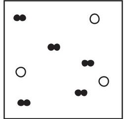

Box2

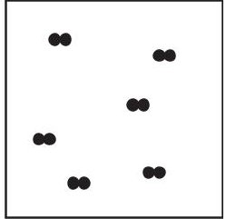

Box3

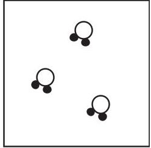

Box4

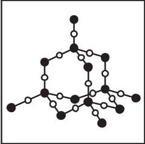

Box 5
(i) Which box represents a mixture?
A 1
B 2
C 3
D 4
(ii) Which two boxes represent elements?
A 1 and 2
B 2 and 3
C 1 and 3
D 3 and 4
(1) 
(iii) Explain why Box 5 represents a compound.
(b) The Periodic Table contains all the known elements.
(i) How are the elements arranged in the Periodic Table?
A increasing mass number
B increasing number of neutrons
C increasing number of protons
(ii) Elements in the same group have the same number of
D increasing reactivity
A electrons in the outer shell
B electron shells
neutrons
D protons
(Total for Question 1 = 6 marks)
## BLANK PAGE
2 Chromatography is used to analyse mixtures.
A student does a chromatography experiment to analyse the composition of green food colouring in sweets.
She places four known dyes, A, B, C and D, and the green food colouring on chromatography paper.
The diagram shows the student's apparatus at the start of her experiment.

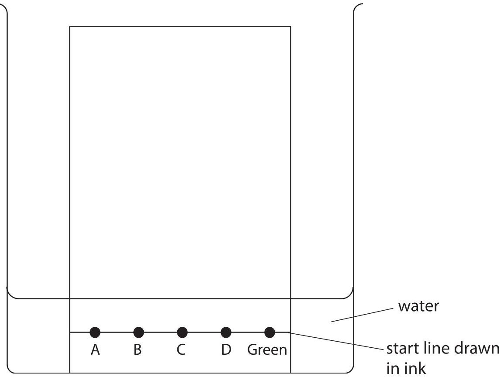

(a) The diagram shows that the student makes two mistakes when setting up her apparatus. State the two changes that the student should make so that her experiment works.
(b) Another student does the chromatography experiment correctly.
The diagram shows her chromatogram at the end of the experiment.

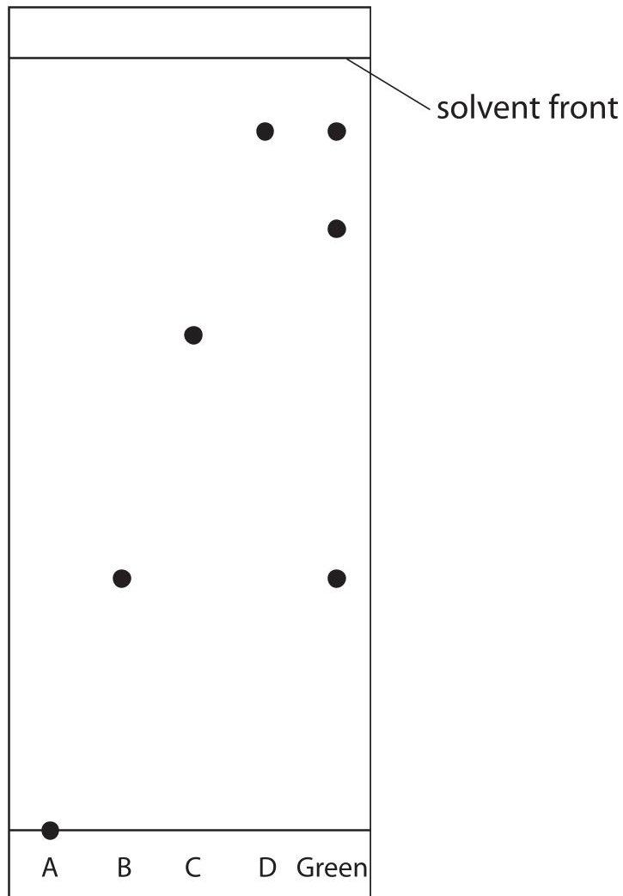

(i) Explain what the chromatogram shows about the composition of the green food colouring.
(ii) The distance between the start line and the spot for dye C is 6.2 cm. Calculate the $ R_{f} $ value of dye C.
$ R_{\mathrm{f}} $ value=
(iii) Suggest why dye A does not move.
(Total for Question 2 = 9 marks)
3 Solutions of silver nitrate and potassium chloride react together to make the insoluble salt, silver chloride.
A student uses this method to prepare a sample of silver chloride.
Step 1 add $ 2 5 \mathrm{c m}^{3} $ of silver nitrate solution to a conical flask
Step 2 add potassium chloride solution to the flask
Step 3 filter off the silver chloride
(a) What term is used for this reaction?
neutralisation
B precipitation
(1) 
C redox
D thermal decomposition
(b) Give two more steps that will produce a pure, dry sample of silver chloride.
Step 4.
Step 5.
(c) Acidified silver nitrate solution is used to test for chloride ions.
Give a reason why hydrochloric acid is not used to acidify silver nitrate solution.
(d) The chemical equation for the reaction between solutions of silver nitrate and potassium chloride is
A student adds an excess of potassium chloride solution to $ 2 5. 0 \mathrm{c m}^{3} $ of $ 0. 1 0 0 \mathrm{m o l} / \mathrm{d m}^{3} $ silver nitrate solution.
$$
\mathrm {A g N O} _ {3} (\mathrm {a q}) + \mathrm {K C l} (\mathrm {a q}) \rightarrow \mathrm {A g C l} (\mathrm {s}) + \mathrm {K N O} _ {3} (\mathrm {a q})
$$
Calculate the maximum mass of silver chloride, in grams, that can be produced.
[M of AgCl =143.5]
(Total for Question 3 = 6 marks)
4 This question is about the metal, lead.
(a) Explain why metals, such as lead, are malleable.
(b) A teacher uses this apparatus in a fume cupboard to demonstrate the electrolysis of lead(II) bromide.

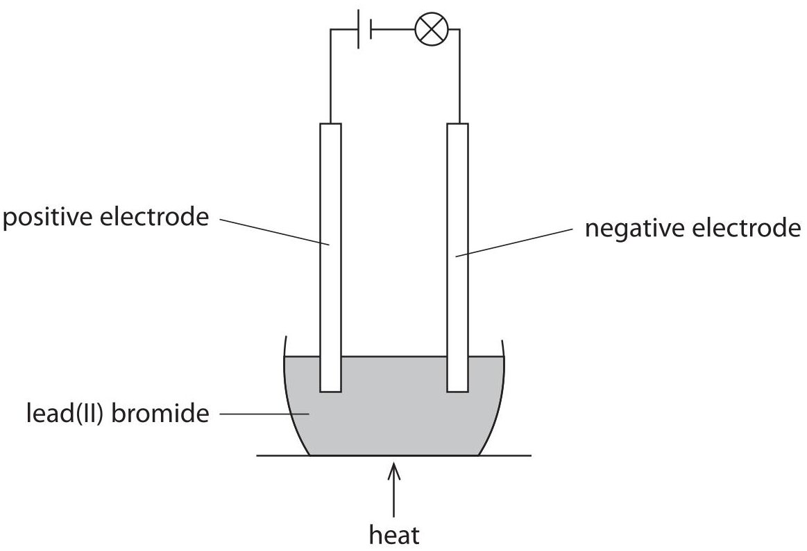

The lead(II) bromide is heated until it melts.
When the lead(II) bromide melts, the lamp lights.
One of the products of this electrolysis is lead.
(i) State why solid lead(II) bromide does not conduct electricity.
(ii) Bromine is formed by the oxidation of bromide ions at the positive electrode.
Complete the ionic half-equation for the oxidation of bromide ions.
$$
2 \mathrm {B r} ^ {-} \rightarrow + \dots \dots
$$
(iii) Explain why lead metal forms at the negative electrode.
(iv) The teacher stops heating the mixture and allows it to solidify. Suggest why the lamp stays alight.
(Total for Question 4 = 7 marks)
5 This question is about Group 1 metals and their reactions.
(a) When lithium is added to water, bubbles of hydrogen gas are observed.
(i) Give two other observations that could be made.
(ii) Give the test for hydrogen gas.
(b) (i) Give one observation that would be different if potassium is used instead of lithium.
(ii) The diagram represents an atom of lithium and an atom of potassium.

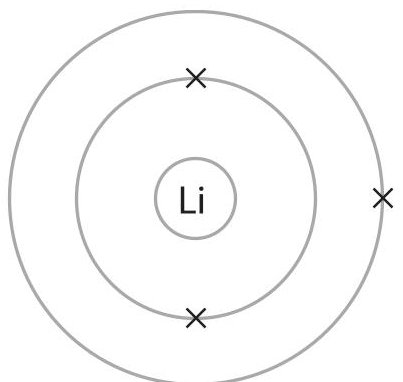

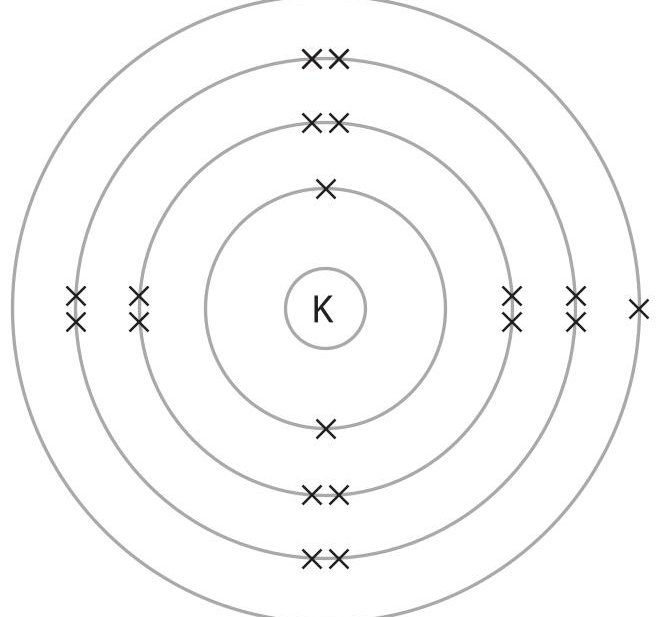

Explain why potassium is more reactive than lithium.

(3) 

(c) The equation for the reaction between lithium and water is
$$
2 \mathrm {L i} (\mathrm {s}) + 2 \mathrm {H} _ {2} \mathrm {O} (\mathrm {I}) \rightarrow 2 \mathrm {L i O H} (\mathrm {a q}) + \mathrm {H} _ {2} (\mathrm {g})
$$
(i) A mass of 0.500g of lithium reacts with an excess of water.
Calculate the volume, in $ cm^{3} $ , of hydrogen gas produced at rtp.
[molar volume of a gas at rtp=24000 $ cm^{3} $]
Give your answer to three significant figures.
(ii) In a reaction between lithium and water, $ 1 5 0 \mathrm{c m}^{3} $ of lithium hydroxide solution is formed.
The lithium hydroxide solution is then completely neutralised by $ 2 4. 8 5 \mathrm{c m}^{3} $ of $ 0. 1 0 0 \mathrm{m o l / d m}^{3} $ sulfuric acid.
The equation for the neutralisation is
$$
2 \mathrm {L i O H} (\mathrm {a q}) + \mathrm {H} _ {2} \mathrm {S O} _ {4} (\mathrm {a q}) \rightarrow \mathrm {L i} _ {2} \mathrm {S O} _ {4} (\mathrm {a q}) + 2 \mathrm {H} _ {2} \mathrm {O} (\mathrm {I})
$$
Calculate the concentration, in mol/dm $ ^{3} $ , of the lithium hydroxide solution.
(Total for Question 5 = 13 marks)
## BLANK PAGE
6 This question is about ethane and ethene.
(a) Ethane can be obtained from crude oil.
Describe the industrial process used to separate crude oil into fractions.
(b) The equation for the reaction between ethene gas and hydrogen gas is
$$
\mathrm {C} _ {2} \mathrm {H} _ {4} + \mathrm {H} _ {2} \rightarrow \mathrm {C} _ {2} \mathrm {H} _ {6}
$$
The rate of this reaction can be increased by increasing the pressure.
(i) Explain why increasing the pressure increases the rate of this reaction.
(ii) The rate of this reaction can also be increased by using a catalyst. Explain how using a catalyst increases the rate of a reaction.
(iii) Give one other way that the rate of reaction between ethene gas and hydrogen gas can be increased.
(iv) The reaction between ethene and hydrogen is exothermic.
Complete the reaction profile diagram, including labels for the activation energy and the enthalpy change, $ \Delta H. $

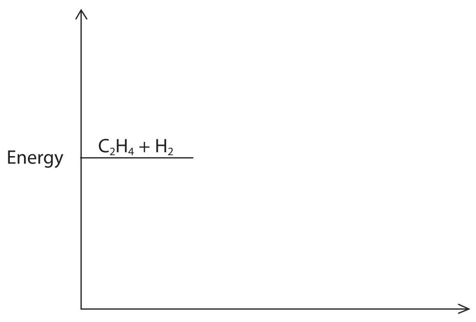

(c) The reaction between ethene and hydrogen can be represented using displayed formulae.

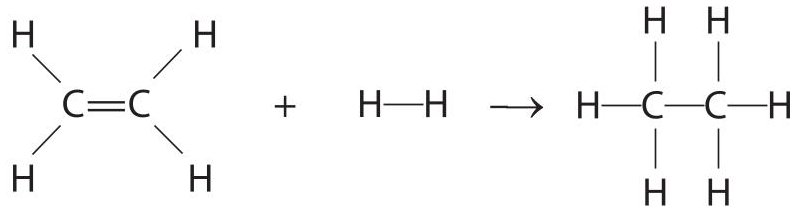

<table border="1"><tr><td>Bond</td><td>Bond energy in kJ/mol</td></tr><tr><td>C=C</td><td>612</td></tr><tr><td>C-H</td><td>412</td></tr><tr><td>H-H</td><td>436</td></tr><tr><td>C-C</td><td>348</td></tr></table>
Use the bond energies in the table to calculate the enthalpy change, $ \Delta H $ in kJ/mol for this reaction.
7 (a) Ethanol, $ \mathrm{C_{2} H_{5} O H} $ , can be produced by the fermentation of glucose, $ \mathrm{C_{6} H_{1 2} O_{6}} $
(i) Complete the equation for the fermentation of glucose.
$$
\mathrm {C} _ {6} \mathrm {H} _ {1 2} \mathrm {O} _ {6} \rightarrow 2 \mathrm {C} _ {2} \mathrm {H} _ {5} \mathrm {O H} + 2
$$
(ii) State why it is necessary for fermentation to be done in the absence of air.
(iii) Explain why the temperature should not be higher than $ 4 0^{\circ} \mathrm{C} $
(iv) When 4 mol of glucose is fermented, a mass of 55.2 g of ethanol is produced. Show that the percentage yield of ethanol is 15%.
[M $ _{r} $ of C $ _{2} $ H $ _{5} $ OH=46]
(b) Ethanol can also be produced by the reaction between ethene and steam. The equation for the reaction is
$$
\mathrm {C} _ {2} \mathrm {H} _ {4} (\mathrm {g}) + \mathrm {H} _ {2} \mathrm {O} (\mathrm {g}) \rightleftharpoons \mathrm {C} _ {2} \mathrm {H} _ {5} \mathrm {O H} (\mathrm {g})
$$
(i) This reaction is in dynamic equilibrium.
Give two features of a reaction in dynamic equilibrium.
(ii) When the equilibrium mixture is heated,the yield of ethanol decreases Explain whether the forward reaction is exothermic or endothermic.
(c) Carboxylic acids react with alcohols to form esters.
The displayed formula of an ester is

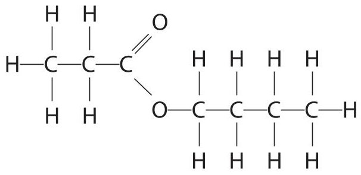

(i) Carboxylic acid A and alcohol B react to produce this ester.
Give the displayed formula of carboxylic acid A and of alcohol B.
<table border="1"><tr><td>Carboxylic acid A</td><td>Alcohol B</td></tr><tr><td></td><td></td></tr></table>
(ii) Indicators can be used to test for carboxylic acids.
Describe a different chemical test for a carboxylic acid.
TOTAL FOR PAPER = 70 MARKS
## BLANK PAGE
