<table><tr><td colspan="3">Please check the examination details below before entering your candidate information</td></tr><tr><td>Candidate surname</td><td colspan="2">Other names</td></tr><tr><td colspan="3">Centre Number Candidate Number</td></tr><tr><td colspan="3">Pearson Edexcel International GCSE</td></tr><tr><td colspan="3">Monday 20 January 2020</td></tr><tr><td>Afternoon (Time: 1 hour 15 minutes)</td><td colspan="2">Paper Reference 4CH1/2C</td></tr><tr><td colspan="3">Chemistry
Unit: 4CH1
Paper 2C</td></tr><tr><td colspan="3">You must have:
Calculator, ruler</td></tr><tr><td colspan="3">Total Marks</td></tr></table>

## Instructions

- Use black ink or ball-point pen.

- Fill in the boxes at the top of this page with your name, centre number and candidate number.

- Answer all questions.

- Answer the questions in the spaces provided

- there may be more space than you need.

- Show all the steps in any calculations and state the units.

- Some questions must be answered with a cross in a box. If you change your mind about an answer, put a line through the box and then mark your new answer with a cross.

## Information

- The total mark for this paper is 70.

- The marks for each question are shown in brackets

- use this as a guide as to how much time to spend on each question.

## Advice

- Read each question carefully before you start to answer it.

- Write your answers neatly and in good English.

- Try to answer every question.

- Check your answers if you have time at the end.

Turn over

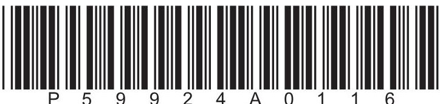

<table border="1"><tr><td>7Li lithium3</td><td>9Be beryllium4</td><td colspan="12">Key</td><td>4He helium2</td></tr><tr><td>23Na sodium11</td><td>24Mg magnesium12</td><td colspan="12">relative atomic mass atomic symbol atomic (proton) number</td><td>20Ne neon10</td></tr><tr><td>39K potassium19</td><td>40Ca calcium20</td><td>45Sc scandium21</td><td>48Ti titanium22</td><td>51V vanadium23</td><td>52Cr chromium24</td><td>55Mn manganese25</td><td>56Fe iron26</td><td>59Co cobalt27</td><td>59Ni nickel28</td><td>63.5Cu copper29</td><td>65Zn zinc30</td><td>70Ga gallium31</td><td>73Ge germanium32</td><td>75As arsenic33</td><td>79Se selenium34</td><td>80Br bromine35</td><td>84Kr krypton36</td></tr><tr><td>85Rb rubidium37</td><td>88Sr strontium38</td><td>89Y yttrium39</td><td>91Zr zirconium40</td><td>93Nb niobium41</td><td>96Mo molybdenum42</td><td>[98]Tc technetium43</td><td>101Ru ruthenium44</td><td>103Rh rhodium45</td><td>106Pd palladium46</td><td>108Ag silver47</td><td>112Cd cadmium48</td><td>115In indium49</td><td>119Sn tin50</td><td>122Sb antimony51</td><td>128Te tellurium52</td><td>127I iodine53</td><td>131Xe xenon54</td></tr><tr><td>133Cs caesium55</td><td>137Ba barium56</td><td>139La* lanthanum57</td><td>178Hf hafnium72</td><td>181Ta tantalum73</td><td>184W tungsten74</td><td>186Re rhenium75</td><td>190Os osmium76</td><td>192Ir iridium77</td><td>195Pt platinum78</td><td>197Au gold79</td><td>201Hg mercury80</td><td>204Tl thallium81</td><td>207Pb lead82</td><td>209Bi bismuth83</td><td>[209]Po polonium84</td><td>[210]At astatine85</td><td>[222]Rn radon86</td></tr><tr><td>[223]Fr francium87</td><td>[226]Ra radium88</td><td>[227]Ac* actinium89</td><td>[261]Rf rutherfordium104</td><td>[262]Db dubnium105</td><td>[266]Sg seaborgium106</td><td>[264]Bh bohrium107</td><td>[277]Hs hassium108</td><td>[268]Mt meitnerium109</td><td>[271]Ds darmstadtium110</td><td>[272]Rg roentgenium111</td><td colspan="6">Elements with atomic numbers 112-116 have been reported but not fully authenticated</td></tr></table>

* The lanthanoids (atomic numbers 58-71) and the actinoids (atomic numbers 90-103) have been omitted.

The relative atomic masses of copper and chlorine have not been rounded to the nearest whole number.

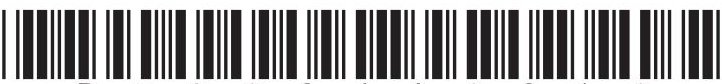

## Answer ALL questions.

1 This question is about elements, compounds and mixtures.

(a) Name the element that burns with a lilac flame.

(b) Name the technique used to separate the mixture of colours in black ink.

(c) The box gives the names of some substances.

Choose substances from the box to answer these questions.

(i) Identify the compound.

(ii) Identify the mixture.

(iii) Identify the non-metal element that is a solid at room temperature.

(Total for Question 1 = 5 marks)

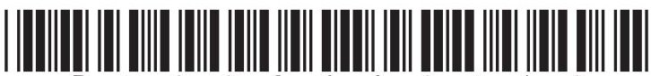

2 Crude oil is a mixture of hydrocarbons.

(a) Name the process used to separate crude oil into fractions.

(b) Give one use of the kerosene fraction.

(c) One of the hydrocarbons in the refinery gas fraction is an alkane with the structural formula $ \mathrm{C H_{3} C H_{2} C H_{2} C H_{3}} $

(i) Give the name of this alkane.

(ii) Calculate the relative molecular mass $ ( M_{\mathrm{r}}) $ of this alkane.

(d) One of the alkanes in the gasoline fraction has the displayed formula

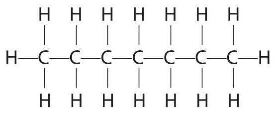

(i) Determine the molecular formula of this alkane.

(ii) Give the general formula for the alkanes.

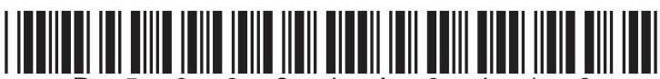

(e) Catalytic cracking is used to convert long-chain alkanes into shorter-chain alkanes.

(i) Name the catalyst used in catalytic cracking.

(ii) Explain why it is necessary to convert long-chain alkanes into shorter-chain alkanes.

(f) Catalytic cracking also produces alkenes.

$ \mathrm{C}_{1 1} \mathrm{H}_{2 4} $ can undergo cracking to give pentane $ \left( \mathrm{C}_{5} \mathrm{H}_{1 2} \right) $ and two different alkenes.

Complete the equation for this cracking reaction.

$$
\mathrm {C} _ {1 1} \mathrm {H} _ {2 4} \rightarrow \mathrm {C} _ {5} \mathrm {H} _ {1 2} +
$$

(Total for Question 2 = 11 marks)

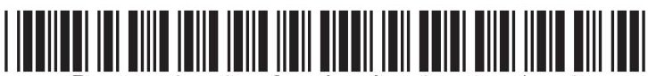

3 This question is about copper and its compounds.

(a) Copper is a metal used for electrical wiring.

Explain why copper is a good conductor of electricity.

(b) This apparatus is used to investigate the electrolysis of copper(II) sulfate solution with graphite electrodes.

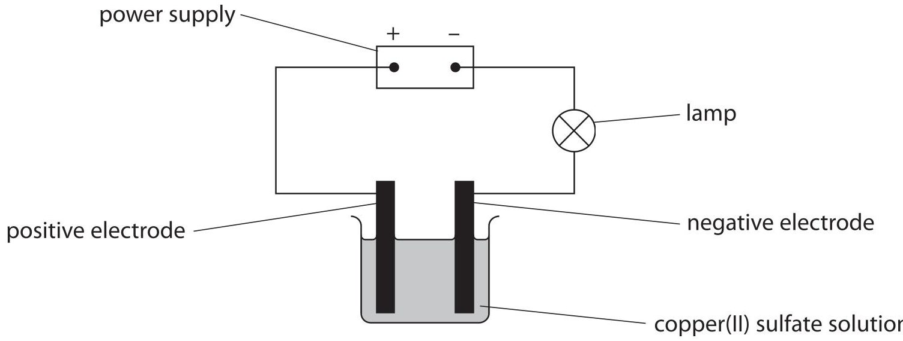

Copper forms at the negative electrode and oxygen forms at the positive electrode.

(i) State what would be observed at each electrode.

negative electrode positive electrode ..

(ii) The ionic half-equation for the reaction at the negative electrode is

$$
\mathrm {C u} ^ {2 +} + 2 \mathrm {e} ^ {-} \rightarrow \mathrm {C u}
$$

State why this is a reduction reaction.

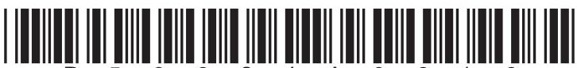

(iii) Explain why the copper(II) sulfate solution becomes paler blue during the electrolysis. (2)

(c) When hydrated copper(II) sulfate crystals are heated, anhydrous copper(II) sulfate forms.

A mass of 12.5 g of hydrated copper(II) sulfate crystals is heated in a crucible until all the water of crystallisation is removed.

A mass of 8.0 g of anhydrous copper(II) sulfate forms.

Show by calculation that the formula of hydrated copper(II) sulfate is $ \mathrm{C u S O_{4}. 5 H_{2}O} $

$$
[ M _ {\mathrm {r}} \mathrm {o f C u S O} _ {4} = 1 5 9. 5 \quad M _ {\mathrm {r}} \mathrm {o f H} _ {2} \mathrm {O} = 1 8 ]
$$

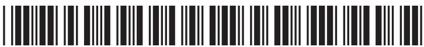

4 A student investigates the reaction between sodium hydroxide solution and dilute sulfuric acid. He does a titration to find the concentration of the sulfuric acid.

This is his plan for the titration. There are some mistakes and omissions in his plan.

- rinse a conical flask with the sodium hydroxide solution

- use a measuring cylinder to measure out $ 2 5 \mathrm{c m}^{3} $ of the sodium hydroxide solution and add it to the conical flask

- add a few drops of methyl orange indicator to the conical flask

- rinse a burette with water and then fill it with the sulfuric acid

- add the acid from the burette to the conical flask until the indicator changes colour at the end-point of the titration

- record the final burette reading

(a) Give the colour change of the methyl orange indicator at the end-point.

(b) Describe four changes that the student could make to improve his plan.

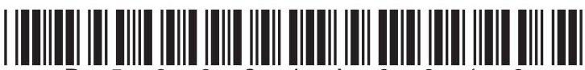

He finds that $ 1 6. 7 0 \mathrm{c m}^{3} $ of the dilute sulfuric acid neutralises $ 2 5. 0 \mathrm{c m}^{3} $ of sodium hydroxide solution of concentration $ 0. 2 0 0 \mathrm{m o l} / \mathrm{d m}^{3} $

(c) The student then does the titration correctly.

The equation for the reaction is

$$
2 \mathrm {N a O H} + \mathrm {H} _ {2} \mathrm {S O} _ {4} \rightarrow \mathrm {N a} _ {2} \mathrm {S O} _ {4} + 2 \mathrm {H} _ {2} \mathrm {O}
$$

Calculate the concentration, in mol/dm $ ^{3} $ , of the sulfuric acid.

concentration of sulfuric acid =

$$
\mathrm {m o l / d m ^ {3}}
$$

(Total for Question 4 = 9 marks)

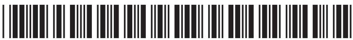

5 Oxygen can be prepared from hydrogen peroxide using a catalyst.

(a) Which is a correct statement about oxygen?

A it burns with a squeaky pop

B it relights a glowing splint

C it turns blue litmus red

D it turns limewater milky

(b) Explain how a catalyst increases the rate of a reaction.

(c) The equation for the preparation of oxygen from hydrogen peroxide is

$$
2 \mathrm {H} _ {2} \mathrm {O} _ {2} \rightarrow 2 \mathrm {H} _ {2} \mathrm {O} + \mathrm {O} _ {2}
$$

This equation can also be written using displayed formulae to show all the covalent bonds in the molecules.

$$
2 H - O - O - H \rightarrow 2 H - O - H + O = O
$$

The table gives the bond energies for these bonds.

<table border="1"><tr><td>Bond</td><td>H-O</td><td>O-O</td><td>O=O</td></tr><tr><td>Bond energy in kJ/mol</td><td>463</td><td>143</td><td>498</td></tr></table>

(i) Use the values in the table to calculate the enthalpy change, $ \Delta H $ , for the reaction. Include a sign in your answer.

(ii) Complete the energy level diagram to show the position of the products and the enthalpy change, $ \Delta H $ , for the reaction.

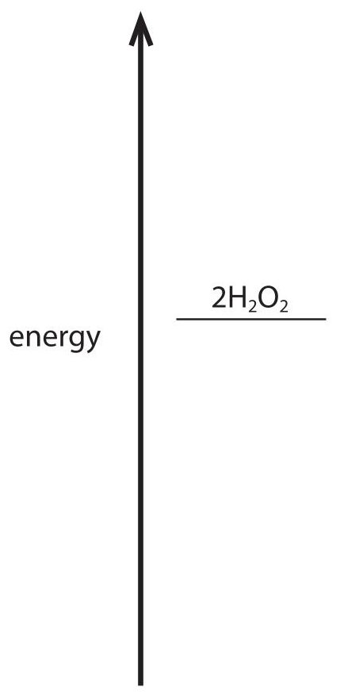

6 Ethanol, $ \mathrm{C_{2} H_{5} O H} $ , can be manufactured from ethene and steam using a phosphoric acid catalyst. (a) (i) State the temperature and pressure used in this manufacturing process.

temperature pressure ...

(ii) Draw the displayed formula of ethanol.

(b) Ethanol burns in a plentiful supply of air to form carbon dioxide and water.

(i) Give the chemical equation for this reaction.

(ii) When the air supply is limited, incomplete combustion occurs and carbon monoxide forms.

State why carbon monoxide is poisonous to humans.

(c) When ethanol reacts with ethanoic acid, an ester forms. Give the name of this ester.

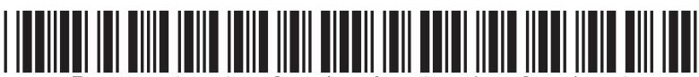

(d) Butanedioic acid and ethanediol react together to form a polyester and water.

(i) Give the name of this type of polymerisation.

(ii) Complete the equation. Show only one repeat unit of the polyester.

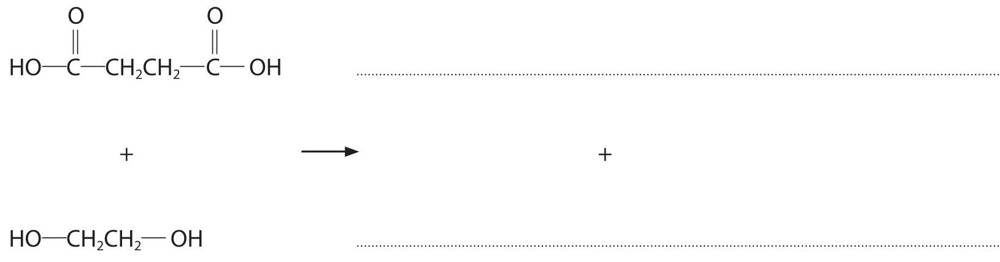

(Total for Question 6 = 11 marks)

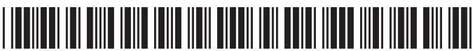

7 This question is about some Group 2 elements and their compounds.

(a) Calcium reacts with water to produce calcium hydroxide and hydrogen gas.

(i) Give the word equation for this reaction.

(ii) State two observations that would be made during this reaction.

(b) (i) Describe how a pure, dry sample of the insoluble salt, barium sulfate, could be made from the two solids sodium sulfate and barium chloride.

(ii) Give an ionic equation for the reaction that occurs. Include state symbols in your equation.

(c) When magnesium nitrate is heated, magnesium oxide, nitrogen dioxide and oxygen form.

The equation for the reaction is

$$
2 \mathrm {M g} \left(\mathrm {N O} _ {3}\right) _ {2} (\mathrm {s}) \rightarrow 2 \mathrm {M g O} (\mathrm {s}) + 4 \mathrm {N O} _ {2} (\mathrm {g}) + \mathrm {O} _ {2} (\mathrm {g})
$$

(i) What is the name for this type of reaction?

A addition

B combustion

decomposition

D neutralisation

(ii) Calculate the total volume, in $ \mathrm{d m}^{3} $ of gas produced at rtp when 7.7 g of magnesium nitrate completely reacts.

[Assume that the molar volume of a gas at rtp is $ 2 4 \mathrm{d m}^{3} $]

[ $ M_{\mathrm{r}} $ of $ \mathrm{M g(N O_{3})_{2}}=1 4 8 $]

Give your answer to two significant figures.

<table><tr><td>total volume of gas</td><td>dm3</td></tr></table>

## TOTAL FOR PAPER = 70 MARKS

