<table><tr><td colspan="3">Please check the examination details below before entering your candidate information</td></tr><tr><td>Candidate surname</td><td colspan="2">Other names</td></tr><tr><td colspan="3">Centre Number Candidate Number</td></tr><tr><td colspan="3">Pearson Edexcel International GCSE (9-1)</td></tr><tr><td colspan="3">Wednesday 10 June 2020</td></tr><tr><td>Afternoon (Time: 1 hour 15 minutes)</td><td colspan="2">Paper Reference 4CH1/2CR</td></tr><tr><td colspan="3">Chemistry
Unit: 4CH1
Paper: 2CR</td></tr><tr><td colspan="3">You must have:
Calculator</td></tr><tr><td colspan="3">Total Marks</td></tr></table>

## Instructions

- Use black ink or ball-point pen.

- Fill in the boxes at the top of this page with your name, centre number and candidate number.

- Answer all questions.

- Answer the questions in the spaces provided

- there may be more space than you need.

- Show all the steps in any calculations and state units.

- Some questions must be answered with a cross in a box. If you change your mind about an answer, put a line through the box and then mark your new answer with a cross.

## Information

- The total mark for this paper is 70.

- The marks for each question are shown in brackets

- use this as a guide as to how much time to spend on each question.

## Advice

- Read each question carefully before you start to answer it.

- Write your answers neatly and in good English.

- Try to answer every question.

- Check your answers if you have time at the end.

Turn over

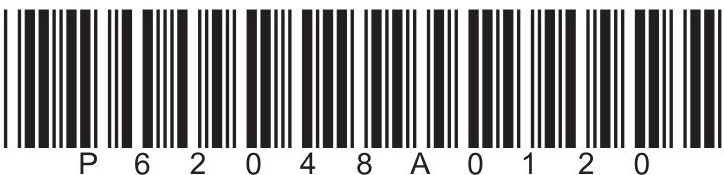

<table border="1"><tr><td>7Li lithium3</td><td>9Be beryllium4</td><td colspan="12">Key</td><td>4He helium2</td></tr><tr><td>23Na sodium11</td><td>24Mg magnesium12</td><td colspan="12">relative atomic mass atomic symbol atomic (proton) number</td><td>20Ne neon10</td></tr><tr><td>39K potassium19</td><td>40Ca calcium20</td><td>45Sc scandium21</td><td>48Ti titanium22</td><td>51V vanadium23</td><td>52Cr chromium24</td><td>55Mn manganese25</td><td>56Fe iron26</td><td>59Co cobalt27</td><td>59Ni nickel28</td><td>63.5Cu copper29</td><td>65Zn zinc30</td><td>70Ga gallium31</td><td>73Ge germanium32</td><td>75As arsenic33</td><td>79Se selenium34</td><td>80Br bromine35</td><td>84Kr krypton36</td></tr><tr><td>85Rb rubidium37</td><td>88Sr strontium38</td><td>89Y yttrium39</td><td>91Zr zirconium40</td><td>93Nb niobium41</td><td>96Mo molybdenum42</td><td>[98]Tc technetium43</td><td>101Ru ruthenium44</td><td>103Rh rhodium45</td><td>106Pd palladium46</td><td>108Ag silver47</td><td>112Cd cadmium48</td><td>115In indium49</td><td>119Sn tin50</td><td>122Sb antimony51</td><td>128Te tellurium52</td><td>127I iodine53</td><td>131Xe xenon54</td></tr><tr><td>133Cs caesium55</td><td>137Ba barium56</td><td>139La* lanthanum57</td><td>178Hf hafnium72</td><td>181Ta tantalum73</td><td>184W tungsten74</td><td>186Re rhenium75</td><td>190Os osmium76</td><td>192Ir iridium77</td><td>195Pt platinum78</td><td>197Au gold79</td><td>201Hg mercury80</td><td>204TI thallium81</td><td>207Pb lead82</td><td>209Bi bismuth83</td><td>[209]Po polonium84</td><td>[210]At astatine85</td><td>[222]Rn radon86</td></tr><tr><td>[223]Fr francium87</td><td>[226]Ra radium88</td><td>[227]Ac* actinium89</td><td>[261]Rf rutherfordium104</td><td>[262]Db dubnium105</td><td>[266]Sg seaborgium106</td><td>[264]Bh bohrium107</td><td>[277]Hs hassium108</td><td>[268]Mt meitnerium109</td><td>[271]Ds darmstadium110</td><td>[272]Rg roentgenium111</td><td colspan="6">Elements with atomic numbers 112-116 have been reported but not fully authenticated</td></tr></table>

* The lanthanoids (atomic numbers 58-71) and the actinoids (atomic numbers 90-103) have been omitted.

The relative atomic masses of copper and chlorine have not been rounded to the nearest whole number.

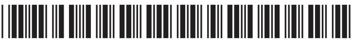

## Answer ALL questions.

1 The diagram shows some pieces of apparatus.

A

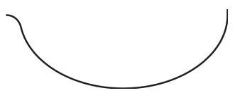

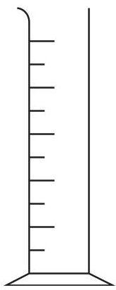

C

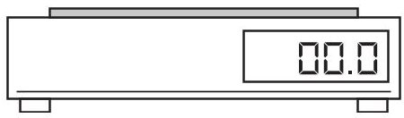

D

(a) Complete the table by giving the name of each piece of apparatus.

<table border="1"><tr><td>Letter</td><td>Name</td></tr><tr><td>A</td><td></td></tr><tr><td>B</td><td></td></tr><tr><td>C</td><td></td></tr><tr><td>D</td><td></td></tr></table>

(b) Which piece of apparatus can be used to measure the volume of a liquid?

A

B

C

D

(Total for Question 1 = 5 marks)

2 Thallium, Tl, is an element in Group 3 and Period 6 of the Periodic Table. The atomic number of thallium is 81 (a) How many electrons are there in the outer shell of an atom of thallium?

A 3

B 6

C 13

D 81

(b) A thallium ion has a charge of 3+

How many electrons are there in this thallium ion?

A 3

B 78

C 81

D 84

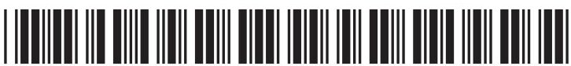

(c) A sample of thallium contains two isotopes.

The table shows the mass number and percentage abundance of each isotope in the sample.

<table border="1"><tr><td>Isotope</td><td>Mass number</td><td>Percentage abundance(%)</td></tr><tr><td>thallium-203</td><td>203</td><td>30.80</td></tr><tr><td>thallium-205</td><td>205</td><td>69.20</td></tr></table>

(i) Give the number of protons and the number of neutrons in one atom of the thallium-205 isotope.

## number of protons

number of neutrons

(ii) Calculate the relative atomic mass of this sample of thallium. Give your answer to one decimal place.

3 (a) The diagram shows a fractionating column used to separate crude oil into fractions.

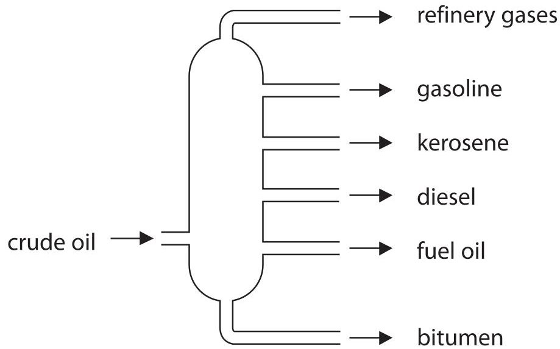

(i) Give a use for bitumen and a use for gasoline.

use for bitumen use for gasoline

(ii) Explain why bitumen is collected at the bottom of the fractionating column and gasoline is collected near the top of the fractionating column.

(b) There is a low demand for some of the fractions obtained from crude oil. Cracking can be used to convert these fractions into more useful substances. (i) State the conditions needed for cracking.

(ii) Dodecane $ \left( \mathrm{C}_{1 2} \mathrm{H}_{2 6} \right) $ can be cracked to produce an alkane and two alkenes. Complete the equation by giving the formulae of the two alkenes.

$$
\mathrm {C} _ {1 2} \mathrm {H} _ {2 6} \rightarrow \mathrm {C} _ {7} \mathrm {H} _ {1 6} +
$$

(Total for Question 3 = 8 marks)

## BLANK PAGE

4 This question is about some of the alkali metals and their compounds.

(a) When a teacher drops a small piece of sodium into a trough of cold water, she observes bubbles of gas.

Give two other observations that would be made when sodium reacts with cold water.

(b) Lithium reacts with fluorine to form the compound lithium fluoride.

(i) Give a chemical equation for this reaction.

(ii) Give a test to show that lithium fluoride contains lithium ions.

(iii) Draw diagrams to show the arrangement of the electrons in a lithium ion and in a fluoride ion.

Include the charge on each ion.

<table border="1"><tr><td>lithium ion</td><td>fluoride ion</td></tr><tr><td></td><td></td></tr></table>

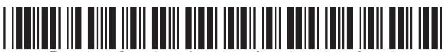

(c) The table shows the electronic configurations of sodium and potassium.

<table border="1"><tr><td>Element</td><td>Electronic configuration</td></tr><tr><td>sodium</td><td>2.8.1</td></tr><tr><td>potassium</td><td>2.8.8.1</td></tr></table>

Explain, in terms of their electronic configurations, why potassium is more reactive than sodium.

(Total for Question 4 = 11 marks)

5 This question is about the metal aluminium.

(a) (i) Draw a labelled diagram to represent the structure and bonding in a metal.

(ii) Explain why a metal conducts electricity.

(b) Aluminium is used to make cans for drinks.

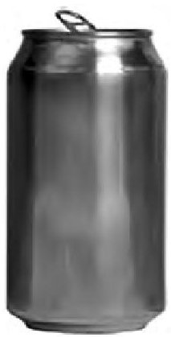

Give two properties of aluminium that make it suitable for this use.

(c) Aluminium is extracted from aluminium oxide $ \mathrm{(A l_{2} O_{3})} $ by electrolysis.

The electrolyte is aluminium oxide dissolved in molten cryolite.

(i) State why aluminium cannot be extracted by heating aluminium oxide with carbon.

(ii) Aluminium is produced at the negative electrode.

The ionic half-equation for the reaction is

$$
\mathrm {A l} ^ {3 +} + 3 \mathrm {e} ^ {-} \rightarrow \mathrm {A l}
$$

State why this is a reduction reaction.

(iii) Complete the ionic half-equation for the reaction at the positive electrode.

$$
\mathrm {O} ^ {2 -} \rightarrow
$$

(Total for Question 5 = 10 marks)

6 A student wants to prepare sodium chloride crystals from sodium hydroxide solution and dilute hydrochloric acid.

He does a titration to find the volume of dilute hydrochloric acid needed to neutralise the sodium hydroxide solution.

This is his method.

- add $ 2 5. 0 \mathrm{c m}^{3} $ of sodium hydroxide solution to a conical flask

- add a few drops of phenolphthalein indicator to the conical flask

- titrate the solution with the hydrochloric acid

(a) Name a suitable piece of apparatus that the student should use to measure $ 2 5. 0 \mathrm{c m}^{3} $ of sodium hydroxide solution.

(b) (i) Give the colour of the phenolphthalein indicator in sodium hydroxide solution and in hydrochloric acid.

colour in sodium hydroxide solution

colour in hydrochloric acid...

(ii) Suggest why universal indicator is never used in a titration.

(c) The student finds that $ 2 1. 5 0 \mathrm{c m}^{3} $ of hydrochloric acid is needed to neutralise $ 2 5. 0 \mathrm{c m}^{3} $ of sodium hydroxide solution.

(i) Describe what the student should do next to prepare a pure solution of sodium chloride.

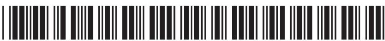

(ii) Describe how the student could obtain dry crystals of sodium chloride from the pure sodium chloride solution.

(d) The student needs $ 2 1. 5 0 \mathrm{c m}^{3} $ of hydrochloric acid to neutralise $ 2 5. 0 \mathrm{c m}^{3} $ of sodium hydroxide solution of concentration $ 0. 8 0 0 \mathrm{m o l} / \mathrm{d m}^{3}. $

The equation for the reaction is

$$
\mathrm {N a O H} + \mathrm {H C l} \rightarrow \mathrm {N a C l} + \mathrm {H} _ {2} \mathrm {O}
$$

Calculate the concentration, in mol/dm $ ^{3} $ , of the hydrochloric acid.

$$
\mathrm {m o l / d m ^ {3}}
$$

(Total for Question 6 = 13 marks)

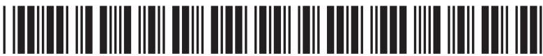

7 (a) Ethanol, $ \mathrm{C_{2} H_{5} O H} $ , can be oxidised to produce ethanoic acid, $ \mathrm{C H_{3} C O O H} $ , by heating it with potassium dichromate(VI).

(i) Name one other reactant needed for this reaction to occur.

(ii) Which colour change occurs during this reaction?

A colourless to green

B green to orange

orange to colourless

D orange to green

(b) When ethanol is burned in air, complete combustion can occur.

The equation for this reaction is

$$
\mathrm {C} _ {2} \mathrm {H} _ {5} \mathrm {O H} + 3 \mathrm {O} _ {2} \rightarrow 2 \mathrm {C O} _ {2} + 3 \mathrm {H} _ {2} \mathrm {O}
$$

This equation can also be written using displayed formulae to show all the covalent bonds in the molecules.

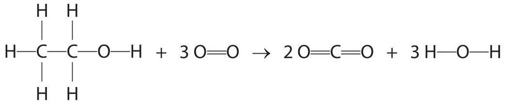

The table gives the bond energies for these bonds.

<table border="1"><tr><td>Bond</td><td>C-C</td><td>C-H</td><td>C-O</td><td>O-H</td><td>O=O</td><td>C=O</td></tr><tr><td>Bond energy in kJ/mol</td><td>346</td><td>412</td><td>358</td><td>463</td><td>496</td><td>743</td></tr></table>

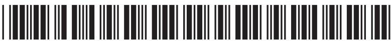

<table><tr><td>(i) Use values from the table to calculate the energy needed to break all the bonds in the reactants.</td><td>(2)</td></tr><tr><td>energy needed</td><td>kJ</td></tr><tr><td>(ii) Use values from the table to calculate the energy released when all the bonds in the products are formed.</td><td>(2)</td></tr><tr><td>energy released</td><td>kJ</td></tr><tr><td>(iii) Calculate the molar enthalpy change ($\Delta H$) in kJ/mol, for the complete combustion of ethanol.</td><td>Include a sign in your answer.</td></tr><tr><td>$\Delta H = \dots\dots

(c) Ethanol reacts with methanoic acid, HCOOH, in the presence of an acid catalyst to form an ester.

The equation for the reaction is

$$
\mathrm {C} _ {2} \mathrm {H} _ {5} \mathrm {O H} + \mathrm {H C O O H} \rightleftharpoons \mathrm {H C O O C} _ {2} \mathrm {H} _ {5} + \mathrm {H} _ {2} \mathrm {O}
$$

(i) Give the name of the ester that forms.

(ii) Draw the displayed formula for this ester.

(iii) When this reaction takes place in a sealed container, the reaction can reach dynamic equilibrium.

Give two characteristics of a reaction at dynamic equilibrium.

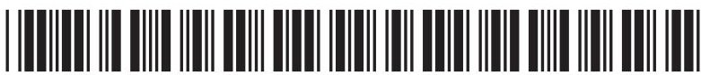

(d) Methanoic acid reacts with sodium carbonate to form sodium methanoate, carbon dioxide and water.

The equation for the reaction is

$$
2 \mathrm {H C O O H} + \mathrm {N a} _ {2} \mathrm {C O} _ {3} \rightarrow 2 \mathrm {H C O O N a} + \mathrm {C O} _ {2} + \mathrm {H} _ {2} \mathrm {O}
$$

Calculate the volume, in $ cm^{3} $ , of carbon dioxide gas produced when 2.3 g of methanoic acid reacts completely with sodium carbonate.

[M $ _{r} $ of HCOOH=46]

[molar volume of carbon dioxide at rtp=24 dm $ ^{3} $]

<table><tr><td>volume of carbon dioxide =</td><td>cm3</td></tr></table>

(Total for Question 7 = 16 marks)

## TOTAL FOR PAPER = 70 MARKS

## BLANK PAGE

## BLANK PAGE

## BLANK PAGE

