
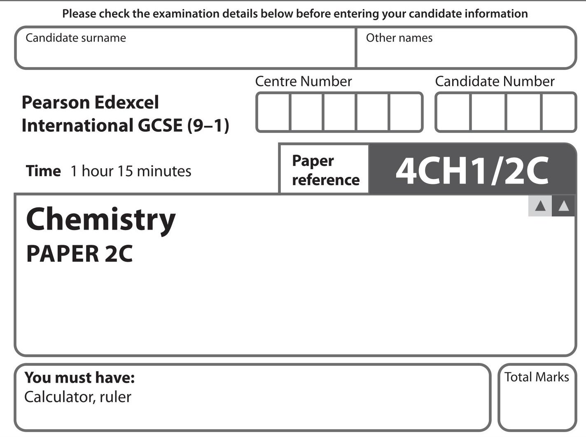

## Instructions

- Use black ink or ball-point pen.

- Fill in the boxes at the top of this page with your name, centre number and candidate number.

- Answer all questions.

- Answer the questions in the spaces provided

- there may be more space than you need.

- Some questions must be answered with a cross in a box . If you change your mind about an answer, put a line through the box and then mark your new answer with a cross.

## Information

- The total mark for this paper is 70.

- The marks for each question are shown in brackets

- use this as a guide as to how much time to spend on each question.

## Advice

- Read each question carefully before you start to answer it.

- Try to answer every question.

- Check your answers if you have time at the end.

- Good luck with your examination.

Turn over

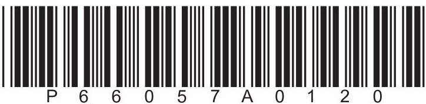

<table border="1"><tr><td>7Li lithium3</td><td>9Be beryllium4</td><td colspan="12">Key</td><td>4He helium2</td></tr><tr><td>23Na sodium11</td><td>24Mg magnesium12</td><td colspan="12">relative atomic massatomic symbolatomic (proton) number</td><td>20Ne neon10</td></tr><tr><td>39K potassium19</td><td>40Ca calcium20</td><td>45Sc scandium21</td><td>48Ti titanium22</td><td>51V vanadium23</td><td>52Cr chromium24</td><td>55Mn manganese25</td><td>56Fe iron26</td><td>59Co cobalt27</td><td>59Ni nickel28</td><td>63.5Cu copper29</td><td>65Zn zinc30</td><td>70Ga gallium31</td><td>73Ge germanium32</td><td>75As arsenic33</td><td>79Se selenium34</td><td>80Br bromine35</td><td>84Kr krypton36</td></tr><tr><td>85Rb rubidium37</td><td>88Sr strontium38</td><td>89Y yttrium39</td><td>91Zr zirconium40</td><td>93Nb niobium41</td><td>96Mo molybdenum42</td><td>[98]Tc technetium43</td><td>101Ru ruthenium44</td><td>103Rh rhodium45</td><td>106Pd palladium46</td><td>108Ag silver47</td><td>112Cd cadmium48</td><td>115In indium49</td><td>119Sn tin50</td><td>122Sb antimony51</td><td>128Te tellurium52</td><td>127I iodine53</td><td>131Xe xenon54</td></tr><tr><td>133Cs caesium55</td><td>137Ba barium56</td><td>139La* lanthanum57</td><td>178Hf hafnium72</td><td>181Ta tantalum73</td><td>184W tungsten74</td><td>186Re rhenium75</td><td>190Os osmium76</td><td>192Ir iridium77</td><td>195Pt platinum78</td><td>197Au gold79</td><td>201Hg mercury80</td><td>204TI thallium81</td><td>207Pb lead82</td><td>209Bi bismuth83</td><td>[209Po polonium84</td><td>[210At astatine85</td><td>[222Rn radon86</td></tr><tr><td>[223Fr francium87</td><td>[226Ra radium88</td><td>[227Ac* actinium89</td><td>[261Rf rutherfordium104</td><td>[262Db dubnium105</td><td>[266Sg seaborgium106</td><td>[264Bh bohrium107</td><td>[277Hs hassium108</td><td>[268Mt meitnerium109</td><td>[271Ds darmstadium110</td><td>[272Rg roentgenium111</td><td colspan="6">Elements with atomic numbers112-116have been reportedbut not fully authenticated</td></tr></table>

* The lanthanoids (atomic numbers 58-71) and the actinoids (atomic numbers 90-103) have been omitted. The relative atomic masses of copper and chlorine have not been rounded to the nearest whole number.

## Answer ALL questions. Write your answers in the spaces provided.

1 Use the Periodic Table to help you answer this question.

(a) (i) Name the element with atomic number 14

(ii) Name the element with a relative atomic mass of 11

(iii) Name the element in Group 2 and Period 3

(b) (i) Determine the number of neutrons in a phosphorus atom with mass number 31

(ii) State the electronic configuration of an aluminium atom.

(iii) State why neon is unreactive.

(Total for Question 1 = 6 marks)

2 A student investigates the rusting of iron.

(a) She places an iron nail in a test tube of water and leaves it for several days.

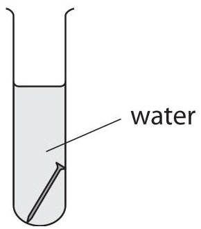

(i) Predict the appearance of the iron nail after several days.

(ii) Name the main compound in rust.

(b) The student then sets up two more test tubes containing iron nails.

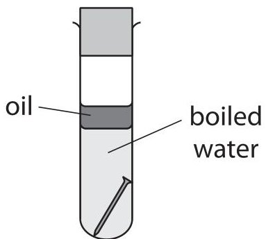

tube 1

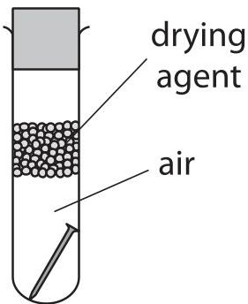

tube 2

Explain why the iron nail in tube 1 and the iron nail in tube 2 do not rust.

(4) 

tube 2.

(Total for Question 2 = 6 marks)

3 The diagram shows the industrial equipment used to separate crude oil into fractions.

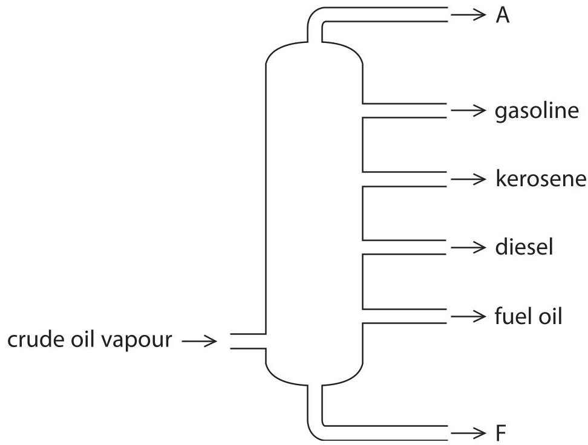

(a) (i) Give the name of the industrial equipment.

(ii) Give one use of the fuel oil fraction.

(iii) Give the names of fraction A and fraction F.

fraction A.

fraction F.

(b) One compound in the gasoline fraction is the alkane octane $ \left( \mathrm{C}_{8} \mathrm{H}_{1 8} \right) $ and one compound in the kerosene fraction is the alkane dodecane $ \left( \mathrm{C}_{1 2} \mathrm{H}_{2 6} \right) $

These two alkanes are covalently bonded and have simple molecular structures.

(i) Give the general formula for the alkanes.

(ii) Explain, in terms of their structures, why $ \mathrm{C_{1 2} H_{2 6}} $ has a higher boiling point than $ \mathrm{C_{8} H_{1 8}} $

(c) Catalytic cracking can be used to convert the alkane $ C_{1 2} H_{2 6} $ into more useful products.

(i) Give the name of the catalyst used for catalytic cracking.

(ii) Complete the equation for this cracking reaction.

$$
\mathrm {C} _ {1 2} \mathrm {H} _ {2 6} \rightarrow \mathrm {C} _ {9} \mathrm {H} _ {2 0} +
$$

(Total for Question 3 = 10 marks)

4 A student investigates the solubility of potassium nitrate in water. She measures the masses of potassium nitrate that dissolve in $ 2 5 \mathrm{c m}^{3} $ of water at different temperatures.

The table shows the student's results. One of the results is anomalous.

<table border="1"><tr><td>Temperature in℃</td><td>10</td><td>20</td><td>30</td><td>40</td><td>50</td><td>60</td><td>70</td></tr><tr><td>Mass of potassium nitrate ing</td><td>8.0</td><td>10.0</td><td>12.5</td><td>16.0</td><td>17.5</td><td>26.5</td><td>34.0</td></tr></table>

(a) (i) Plot the results on the grid.

(ii) Draw a circle around the anomalous result.

(iii) Ignoring the anomalous result, draw a curve of best fit.

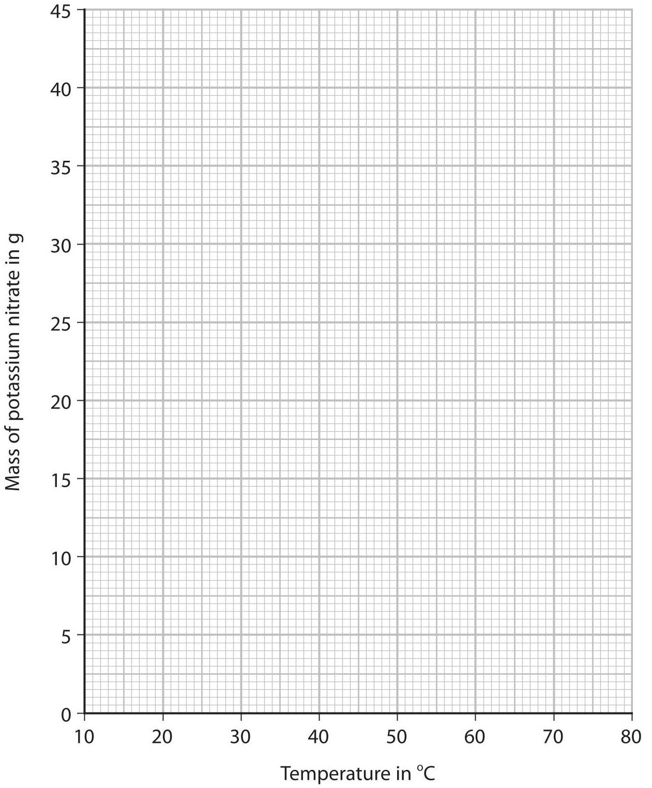

(b) Suggest two possible mistakes that could have caused the anomalous result.

(c) Use your graph to find the maximum mass of potassium nitrate that dissolves in $ 2 5 \mathrm{c m}^{3} $ of water at $ 7 5^{\circ} \mathrm{C} $.

Show on your graph how you obtained your answer.

(d) Use your graph to calculate the solubility of potassium nitrate in g per 100 g of water at $ 2 5^{\circ} \mathrm{C} $.

[1.0 $ \mathrm{c m^{3}} $ of water has a mass of 1.0 g]

solubility = g per 100 g of water (Total for Question 4 = 9 marks)

## BLANK PAGE

5 Ethanol, $ \mathrm{C_{2} H_{5} O H} $ is a member of the homologous series of alcohols.

(a) Give two characteristics of a homologous series.

(b) When ethanol is heated with potassium dichromate(VI) and one other reagent, the ethanol is oxidised to ethanoic acid, $ \mathrm{C H_{3} C O O H} $

(i) Give the formula of the other reagent.

(ii) State the colour change that occurs during this oxidation reaction.

from ... to ...

(iii) Draw the displayed formulae for ethanol and ethanoic acid in the boxes.

<table border="1"><tr><td>ethanol</td><td>ethanoic acid</td></tr><tr><td></td><td></td></tr></table>

(c) Ethanol can be manufactured by two different methods. The table gives some information about the two methods.

<table border="1"><tr><td></td><td>Hydration of ethene</td><td>Fermentation of glucose</td></tr><tr><td>raw material</td><td>crude oil</td><td>sugar cane</td></tr><tr><td>rate of reaction</td><td>fast</td><td>slow</td></tr><tr><td>purity of ethanol</td><td>pure</td><td>impure</td></tr><tr><td>operating temperature</td><td>300℃</td><td>30℃</td></tr><tr><td>operating pressure</td><td>60-70 atmospheres</td><td>1 atmosphere</td></tr><tr><td>catalyst</td><td>phosphoric acid</td><td>enzymes in yeast</td></tr></table>

(i) Discuss the advantages and disadvantages of these two methods, using information from the table.

(ii) The word equation for the fermentation process is

glucose $ \rightarrow $ ethanol + carbon dioxide

Complete the chemical equation for this reaction.

$$
\mathrm {C} _ {6} \mathrm {H} _ {1 2} \mathrm {O} _ {6} \rightarrow
$$

(Total for Question 5 = 14 marks)

6 The diagram shows how hydrogen gas and chlorine gas can be prepared in the laboratory by electrolysis of a concentrated solution of sodium chloride.

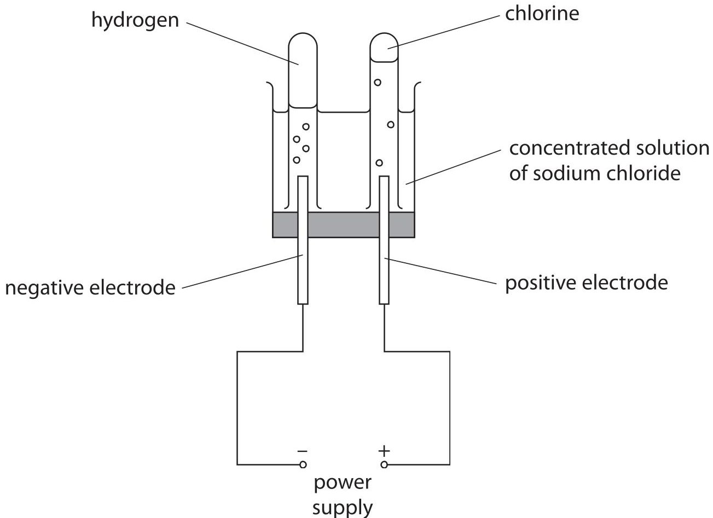

(a) (i) Give a test for hydrogen gas.

(1) 

(ii) Give a test for chlorine gas.

(b) The ionic half-equation for the formation of chlorine at the positive electrode is

$$
2 \mathrm {C l} ^ {-} \rightarrow \mathrm {C l} _ {2} + 2 \mathrm {e} ^ {-}
$$

(i) State why this reaction is an oxidation reaction.

(ii) Give the ionic half-equation for the formation of hydrogen at the negative electrode.

(iii) State why it is safer to do this electrolysis in a fume cupboard.

(iv) Suggest why the volume of chlorine collected during this electrolysis is less than the volume of hydrogen collected.

(c) In the chemical industry, chlorine can be produced by the electrolysis of molten sodium chloride.

The overall equation for this reaction is

$$
2 \mathrm {N a C l} (\mathrm {I}) \rightarrow 2 \mathrm {N a} (\mathrm {I}) + \mathrm {C l} _ {2} (\mathrm {g})
$$

(i) Explain why sodium chloride needs to be molten rather than solid for electrolysis to occur.

(ii) Calculate the maximum volume, in $ \mathrm{d m}^{3} $ of chlorine gas at rtp that can be obtained from 23.4 tonnes of molten sodium chloride.

[1 tonne=10 $ ^{6} $ g]

[Mr of NaCl=58.5]

[molar volume of chlorine at rtp=24 dm $ ^{3} $]

Give your answer in standard form.

(Total for Question 6 = 13 marks)

7 A student does a titration to find the concentration of a solution of phosphoric acid. He uses these pieces of apparatus X, Y and Z in his titration.

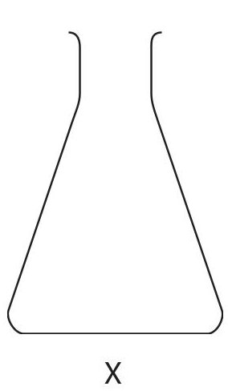

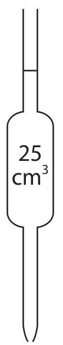

Y

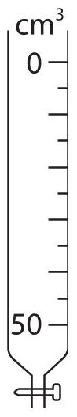

Diagrams are not to scale.

Z

(a) Give the names of X, Y and Z.

(b) What is the colour of phenolphthalein in phosphoric acid?

A blue

B colourless

C pink

D red

(c) The student titrates $ 2 5. 0 \mathrm{c m}^{3} $ of phosphoric acid with a solution of sodium hydroxide (NaOH).

Table 1 shows the student's results.

<table border="1"><tr><td>titration number</td><td>1</td><td>2</td><td>3</td><td>4</td></tr><tr><td>volume of NaOH added in $ \mathrm{c m^{3}} $</td><td>30.35</td><td>30.25</td><td>30.00</td><td>30.30</td></tr><tr><td>concordant results</td><td></td><td></td><td></td><td></td></tr></table>

Table 1

Concordant results are those within $ 0. 2 0 \mathrm{c m}^{3} $ of each other.

(i) Add ticks ( $ \surd $ ) to table 1 to show the concordant results.

(ii) Use your ticked results to calculate the mean (average) volume of NaOH added.

mean volume =

(d) Table 2 shows the titration results of another student.

<table border="1"><tr><td>volume of phosphoric acid used in $ \mathrm{c m^{3}} $</td><td>25.0</td></tr><tr><td>concentration of sodium hydroxide solution in mol/dm3</td><td>0.525</td></tr><tr><td>mean volume of sodium hydroxide added in $ \mathrm{c m^{3}} $</td><td>30.40</td></tr></table>

## Table 2

The equation for the reaction is

$$
3 \mathrm {N a O H} + \mathrm {H} _ {3} \mathrm {P O} _ {4} \rightarrow \mathrm {N a} _ {3} \mathrm {P O} _ {4} + 3 \mathrm {H} _ {2} \mathrm {O}
$$

(i) Calculate the amount, in moles, of NaOH in $ 3 0. 4 0 \mathrm{c m}^{3} $ of sodium hydroxide solution.

(ii) Calculate the amount, in moles, of $ \mathrm{H_{3} P O_{4}} $ in $ 2 5. 0 \mathrm{c m}^{3} $ of phosphoric acid.

(iii) Calculate the concentration, in mol/dm $ ^{3} $ , of the phosphoric acid.

concentration =

$$
\mathrm {m o l / d m ^ {3}}
$$

(Total for Question 7 = 12 marks)

TOTAL FOR PAPER = 70 MARKS

## BLANK PAGE

