
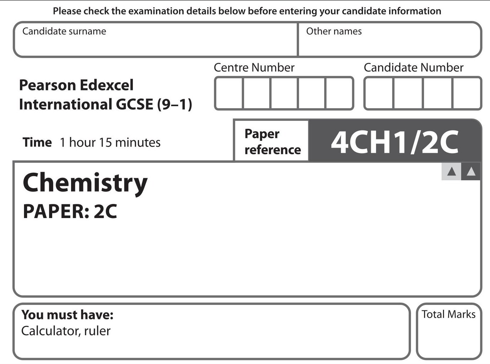

## Instructions

- Use black ink or ball-point pen.

- Fill in the boxes at the top of this page with your name, centre number and candidate number.

- Answer all questions.

- Answer the questions in the spaces provided - there may be more space than you need.

- Show all the steps in any calculations and state the units.

- Some questions must be answered with a cross in a box . If you change your mind about an answer, put a line through the box and then mark your new answer with a cross.

## Information

- The total mark for this paper is 70.

- The marks for each question are shown in brackets

- use this as a guide as to how much time to spend on each question.

## Advice

- Read each question carefully before you start to answer it.

- Write your answers neatly and in good English.

- Try to answer every question.

- Check your answers if you have time at the end.

- Good luck with your examination.

Turn over

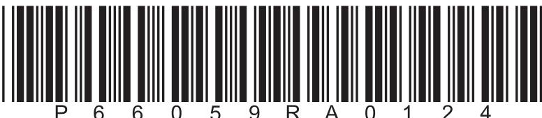

<table class="table table-bordered"><thead><tr><th>7 Li lithium 3</th><th>9 Be beryllium 4</th><th colspan="12">Key</th><th>4 He helium 2</th></tr></thead><tbody><tr><td>23 Na sodium 11</td><td>24 Mg magnesium 12</td><td colspan="12">relative atomic mass atomic symbol atomic (proton) number</td><td>20 Ne neon 10</td></tr><tr><td>39 K potassium 19</td><td>40 Ca calcium 20</td><td>45 Sc scandium 21</td><td>48 Ti titanium 22</td><td>51 V vanadium 23</td><td>52 Cr chromium 24</td><td>55 Mn manganese 25</td><td>56 Fe iron 26</td><td>59 Co cobalt 27</td><td>59 Ni nickel 28</td><td>63.5 Cu copper 29</td><td>65 Zn zinc 30</td><td>70 Ga gallium 31</td><td>73 Ge germanium 32</td><td>75 As arsenic 33</td><td>79 Se selenium 34</td><td>80 Br bromine 35</td><td>84 Kr krypton 36</td></tr><tr><td>85 Rb rubidium 37</td><td>88 Sr strontium 38</td><td>89 Y yttrium 39</td><td>91 Zr zirconium 40</td><td>93 Nb niobium 41</td><td>96 Mo molybdenum 42</td><td>[98] Tc technetium 43</td><td>101 Ru ruthenium 44</td><td>103 Rh rhodium 45</td><td>106 Pd palladium 46</td><td>108 Ag silver 47</td><td>112 Cd cadmium 48</td><td>115 In indium 49</td><td>119 Sn tin 50</td><td>122 Sb antimony 51</td><td>128 Te tellurium 52</td><td>127 I iodine 53</td><td>131 Xe xenon 54</td></tr><tr><td>133 Cs caesium 55</td><td>137 Ba barium 56</td><td>139 La* lanthanum 57</td><td>178 Hf hafnium 72</td><td>181 Ta tantalum 73</td><td>184 W tungsten 74</td><td>186 Re rhenium 75</td><td>190 Os osmium 76</td><td>192 Ir iridium 77</td><td>195 Pt platinum 78</td><td>197 Au gold 79</td><td>201 Hg mercury 80</td><td>204 TI thallium 81</td><td>207 Pb lead 82</td><td>209 Bi bismuth 83</td><td>[209] Po polonium 84</td><td>[210] At astatine 85</td><td>[222] Rn radon 86</td></tr><tr><td>[223] Fr francium 87</td><td>[226] Ra radium 88</td><td>[227] Ac* actinium 89</td><td>[261] Rf rutherfordium 104</td><td>[262] Db dubnium 105</td><td>[266] Sg seaborgium 106</td><td>[264] Bh bohrium 107</td><td>[277] Hs hassium 108</td><td>[268] Mt meitnerium 109</td><td>[271] Ds darmstadium 110</td><td>[272] Rg roentgenium 111</td><td colspan="6">Elements with atomic numbers 112–116 have been reported but not fully authenticated</td></tr></tbody></table>

* The lanthanoids (atomic numbers 58-71) and the actinoids (atomic numbers 90-103) have been omitted.

The relative atomic masses of copper and chlorine have not been rounded to the nearest whole number.

## Answer ALL questions.

1 Use the Periodic Table to help you answer this question.

(a) Identify the element with atomic number 7

(b) Identify a solid non-metallic element in Period 3

(c) Name an element in Group 7 that is a liquid at room temperature.

(d) State the relative atomic mass of the element that is in Group 4 and Period 4

(e) Which row shows the most reactive element in Group 1 and Group 7?

<table border="1"><tr><td>Most reactive element in Group1</td><td>Most reactive element in Group7</td></tr><tr><td>lithium</td><td>fluorine</td></tr><tr><td>francium</td><td>astatine</td></tr><tr><td>lithium</td><td>astatine</td></tr><tr><td>francium</td><td>fluorine</td></tr></table>

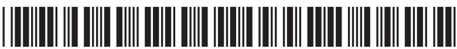

2 (a) The box lists words that may be used to explain the term saturated solution.

solute solvent temperature

Explain, using all the words in the box, the term saturated solution.

(b) The diagram shows the apparatus a student uses to make a saturated solution.

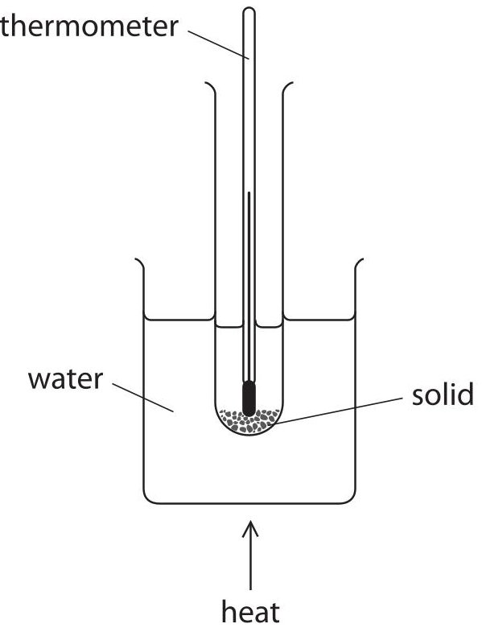

This is the student's method.

Step 1 add 4.5 g of solid to a boiling tube

Step 2 measure exactly 10.0 $ cm^{3} $ of pure water and pour into the boiling tube

Step 3 place the boiling tube in the beaker of water and heat gently, stirring the mixture continuously until all the solid dissolves

Step 4 remove the boiling tube from the beaker and allow it to cool

Step 5 record the temperature when crystals start to form in the boiling tube The recorded temperature shows when the solution becomes saturated.

(i) Name the piece of apparatus that the student should use in Step 2 to measure exactly $ 1 0. 0 \mathrm{c m}^{3} $ of pure water.

(ii) Suggest why the boiling tube is not heated directly using a Bunsen burner in Step 3.

(iii) Suggest how the student could improve the reliability of her recorded temperature in Step 5.

(iv) In Step 5, crystals start to form at $ 2 6^{\circ} \mathrm{C} $.

Calculate the solubility of the solid, in g per 100 g of water, at $ 2 6^{\circ} \mathrm{C} $.

$ [ 1. 0 \mathrm{c m}^{3} $ of pure water has a mass of 1.0 g]

solubility = g per 100 g of water

(c) The solubility curves for two solids, A and B, are shown on the grid.

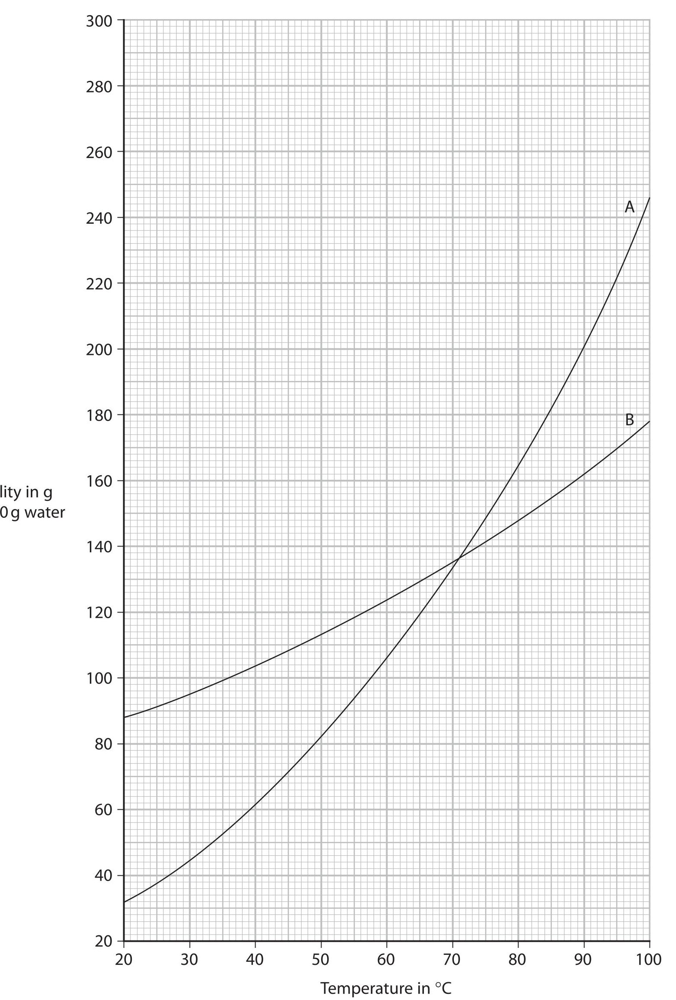

(i) State the temperature when A and B have the same solubility.

$$
\mathrm {t e m p e r a t u r e} =
$$

(ii) Calculate the mass of B that will dissolve in 250g of water at $ 6 0^{\circ} \mathrm{C} $ Show your working.

$$
^{\circ} C
$$

(iii) Suggest why the values for the solubility of A and B may be less accurate at $ 9 5^{\circ} \mathrm{C} $ than at lower temperatures.

(Total for Question 2 = 11 marks)

3 Sulfur dioxide $ \left( \mathrm{S O}_{2} \right) $ and hydrogen sulfide $ \left( \mathrm{H}_{2} \mathrm{S} \right) $ are both gases.

The two gases react together to form solid sulfur and water.

(a) (i) Complete the chemical equation for the reaction.

$$
2 \mathrm {H} _ {2} \mathrm {S} (\dots \dots \dots) + \mathrm {S O} _ {2} (\dots \dots \dots) \rightarrow \dots \dots \mathrm {S} (\mathrm {s}) + \dots \dots \mathrm {H} _ {2} \mathrm {O} (\dots \dots \dots)
$$

(ii) State why the sulfur dioxide is reduced in the reaction.

(b) The diagram shows apparatus used to compare the speed at which particles of the two gases diffuse.

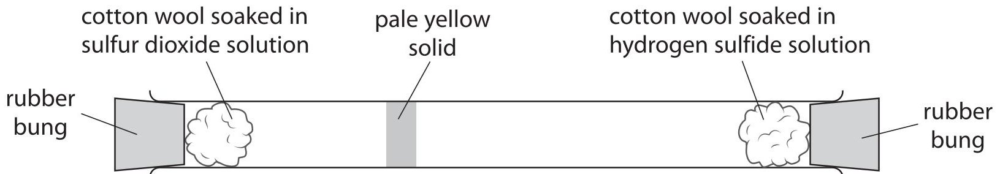

The two pieces of cotton wool and rubber bungs are put in position at the same time.

A pale yellow solid soon forms.

(i) Explain how the diagram shows that hydrogen sulfide gas diffuses more quickly than sulfur dioxide gas.

(ii) Deduce a relationship between the relative formula mass $ ( M_{r} ) $ of a gas and the speed at which a gas diffuses.

Use the $ A_{\mathrm{r}} $ values to help you.

[ $ A_{\mathrm{r}} $ values: H=1 S=32 O=16]

(Total for Question 3 = 8 marks)

4 This question is about ionic compounds.

(a) State the formula of the cation and the anion in magnesium sulfate.

cation anion

(b) The diagram shows the electronic configuration of a potassium atom and an oxygen atom.

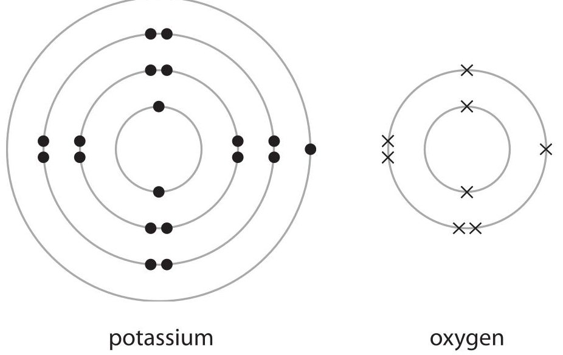

Potassium oxide $ \left( \mathrm{K}_{2} \mathrm{O} \right) $ is an ionic compound.

Draw the electronic configuration of a potassium ion and an oxide ion.

Show the charge on each ion.

(c) A sample of solid potassium oxide is added to water.

A reaction occurs and a colourless solution forms.

When a few drops of phenolphthalein indicator are added to the solution it turns pink.

(i) Identify the ion responsible for the colour change.

(ii) Give a chemical equation for the reaction between potassium oxide and water.

(d) Explain why ionic compounds conduct electricity when molten or in aqueous solution, but not when in the solid state.

(e) The diagram shows the apparatus a teacher uses to demonstrate the electrolysis of a concentrated aqueous solution of sodium chloride.

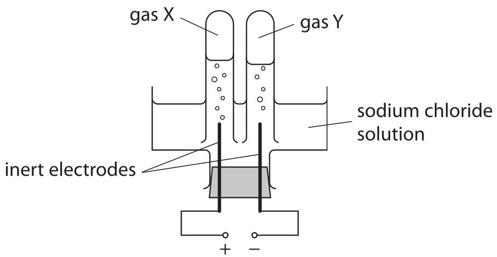

During the electrolysis two gases, X and Y, are formed. One of the gases produces a squeaky pop when tested with a lighted splint.

Use ionic half-equations to identify X and Y.

(Total for Question 4 = 13 marks)

## BLANK PAGE

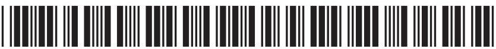

5 Metals are found in the Earth's crust either as uncombined elements or in metal compounds in rocks.

The method of extraction of a metal is related to its position in the reactivity series.

The table shows the positions of some metals and carbon in the reactivity series.

<table border="1"><tr><td>most reactive</td><td>potassium
sodium
lithium
calcium
magnesium
aluminium
carbon
zinc
iron
lead
copper
silver
gold
platinum</td></tr><tr><td>least reactive</td><td></td></tr></table>

(a) (i) State the name given to rocks that contain metal compounds used in the extraction of metals.

(ii) Name a metal that is found as an uncombined element in the Earth's crust.

(b) Carbon extraction and electrolysis are two methods of obtaining a metal from a compound.

(i) Explain, without giving practical details, which method is most suitable to obtain calcium from calcium chloride.

(ii) Explain, without giving practical details, which method is most suitable to obtain lead from lead oxide.

(c) Explain, using a labelled diagram, why lead metal is malleable.

(d) Aluminium is extracted from aluminium oxide.

The overall equation for the process is

$$
2 \mathrm {A l} _ {2} \mathrm {O} _ {3} \rightarrow 4 \mathrm {A l} + 3 \mathrm {O} _ {2}
$$

Calculate the maximum mass, in grams, of aluminium that could be obtained from 1.275 kg of aluminium oxide.

(Total for Question 5 = 12 marks)

## BLANK PAGE

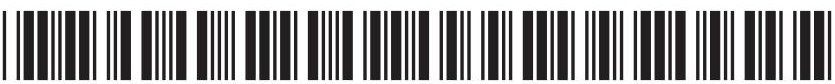

6 This question is about alcohols, carboxylic acids and esters.

(a) Ethanol can be manufactured by reacting ethene with steam in the presence of a phosphoric acid catalyst.

Which row gives the correct conditions of temperature and pressure for this reaction?

<table border="1"><tr><td>Temperature in℃</td><td>Pressure in atmospheres</td></tr><tr><td>35</td><td>300</td></tr><tr><td>65</td><td>300</td></tr><tr><td>300</td><td>65</td></tr><tr><td>300</td><td>35</td></tr></table>

(b) Give the displayed formula of butanol.

(c) Ethanoic acid $ \mathrm{(C H_{3} C O O H)} $ is a carboxylic acid present in vinegar.

(i) The concentration of $ \mathrm{C H_{3} C O O H} $ in vinegar can be found by titration with aqueous potassium hydroxide (KOH).

The equation for the reaction is

$$
\mathrm {C H} _ {3} \mathrm {C O O H} + \mathrm {K O H} \rightarrow \mathrm {C H} _ {3} \mathrm {C O O K} + \mathrm {H} _ {2} \mathrm {O}
$$

In a titration, a $ 2 5. 0 \mathrm{c m}^{3} $ sample of vinegar is neutralised by $ 4 5. 0 0 \mathrm{c m}^{3} $ of KOH solution of concentration $ 0. 4 0 0 \mathrm{m o l} / \mathrm{d m}^{3}. $

Calculate the concentration, in mol/dm $ ^{3} $ , of $ \mathrm{C H_{3} C O O H} $ in this sample of vinegar.

(ii) A sample of vinegar containing 0.0030 mol of $ \mathrm{C H_{3} C O O H} $ is poured into a flask.

Calculate the maximum volume, in $ cm^{3} $ , of carbon dioxide gas formed at rtp when excess sodium carbonate is added to the flask.

The equation for the reaction is

$$
2 \mathrm {C H} _ {3} \mathrm {C O O H} + \mathrm {N a} _ {2} \mathrm {C O} _ {3} \rightarrow 2 \mathrm {C H} _ {3} \mathrm {C O O N a} + \mathrm {H} _ {2} \mathrm {O} + \mathrm {C O} _ {2}
$$

[Assume that the molar volume of carbon dioxide at rtp is $ 2 4 0 0 0 \mathrm{c m}^{3} $]

(d) Alcohols react with carboxylic acids to form esters.

Which alcohol could react to form the ester ethyl propanoate?

A $ \mathrm{C H_{3} O H} $

B $ \mathrm{C_{2} H_{5} O H} $

C $ \mathrm{C_{3} H_{7} O H} $

D $ \mathrm{C_{4} H_{9} O H} $

(e) Polyesters are formed in condensation polymerisation reactions between dicarboxylic acids and diols.

(i) State one difference between condensation polymerisation and addition polymerisation.

(ii) The repeat unit of a polyester is

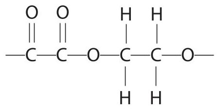

Give the displayed formula of each of the two monomers needed to form this polyester.

(iii) Give one advantage of biopolyesters.

(Total for Question 6 = 11 marks)

## BLANK PAGE

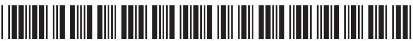

7 Hydrogen gas and iodine gas react together to form hydrogen iodide gas.

$$
\mathrm {H} _ {2} (\mathrm {g}) + \mathrm {I} _ {2} (\mathrm {g}) \rightleftharpoons 2 \mathrm {H I} (\mathrm {g})
$$

(a) (i) The pressure of an equilibrium mixture of the three gases is increased.

Predict the effect of this change on the yield of hydrogen iodide at equilibrium, giving a reason for your answer.

(ii) A catalyst is added to an equilibrium mixture of the three gases.

Predict the effect of the catalyst on the yield of hydrogen iodide at equilibrium, giving a reason for your answer.

(b) Hydrogen gas reacts with fluorine gas to form hydrogen fluoride gas.

$$
\mathrm {H} _ {2} (\mathrm {g}) + \mathrm {F} _ {2} (\mathrm {g}) \rightarrow 2 \mathrm {H F} (\mathrm {g})
$$

The table gives some bond energies.

<table border="1"><tr><td>Bond</td><td>Bond energy in kJ/mol</td></tr><tr><td>H—H</td><td>436</td></tr><tr><td>F—F</td><td>158</td></tr><tr><td>H—F</td><td>562</td></tr></table>

Use the equation and the data in the table to calculate the enthalpy change $ (\Delta H) $ in kJ/mol, for the reaction.

Include a sign in your answer.

(c) Draw an energy level diagram for the reaction between hydrogen and fluorine. Label the enthalpy change, $ \Delta H. $

(Total for Question 7 = 10 marks)

TOTAL FOR PAPER = 70 MARKS

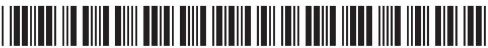

## BLANK PAGE

