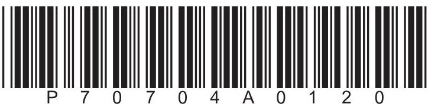
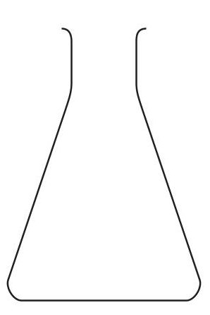
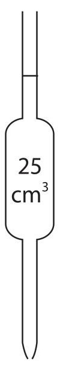
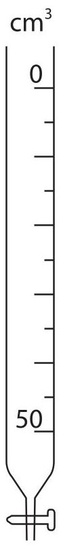
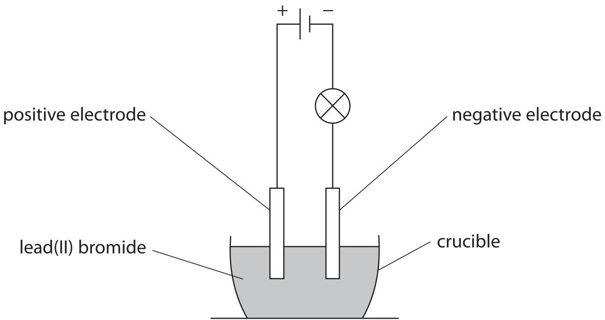
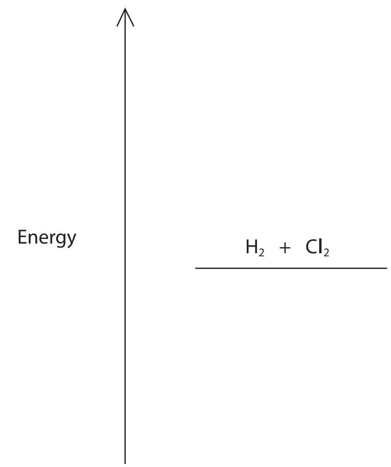

<table><tr><td colspan="3">Please check the examination details below before entering your candidate information</td></tr><tr><td>Candidate surname</td><td colspan="2">Other names</td></tr><tr><td>Centre Number</td><td colspan="2">Candidate Number</td></tr><tr><td colspan="3">Pearson Edexcel International GCSE (9-1)</td></tr><tr><td>Time 1 hour 15 minutes</td><td>Paper reference</td><td>4CH1/2CR</td></tr><tr><td colspan="3">Chemistry
Unit: 4CH1
PAPER: 2CR</td></tr><tr><td colspan="3">You must have:
Calculator, ruler</td></tr><tr><td colspan="3">Total Marks</td></tr></table>

## Instructions

- Use black ink or ball-point pen.

- Fill in the boxes at the top of this page with your name, centre number and candidate number.

- Answer all questions.

- Answer the questions in the spaces provided

- there may be more space than you need.

- Show all the steps in any calculations and state the units.

## Information

- The total mark for this paper is 70.

- The marks for each question are shown in brackets

- use this as a guide as to how much time to spend on each question.

## Advice

- Read each question carefully before you start to answer it.

- Write your answers neatly and in good English.

- Try to answer every question.

- Check your answers if you have time at the end.

Turn over

<table border="1"><tr><td>7Li lithium3</td><td>9Be beryllium4</td><td colspan="12">Key</td><td>4He helium2</td></tr><tr><td>23Na sodium11</td><td>24Mg magnesium12</td><td colspan="12">relative atomic mass atomic symbol atomic (proton) number</td><td>20Ne neon10</td></tr><tr><td>39K potassium19</td><td>40Ca calcium20</td><td>45Sc scandium21</td><td>48Ti titanium22</td><td>51V vanadium23</td><td>52Cr chromium24</td><td>55Mn manganese25</td><td>56Fe iron26</td><td>59Co cobalt27</td><td>59Ni nickel28</td><td>63.5Cu copper29</td><td>65Zn zinc30</td><td>70Ga gallium31</td><td>73Ge germanium32</td><td>75As arsenic33</td><td>79Se selenium34</td><td>80Br bromine35</td><td>84Kr krypton36</td></tr><tr><td>85Rb rubidium37</td><td>88Sr strontium38</td><td>89Y yttrium39</td><td>91Zr zirconium40</td><td>93Nb niobium41</td><td>96Mo molybdenum42</td><td>[98]Tc technetium43</td><td>101Ru ruthenium44</td><td>103Rh rhodium45</td><td>106Pd palladium46</td><td>108Ag silver47</td><td>112Cd cadmium48</td><td>115In indium49</td><td>119Sn tin50</td><td>122Sb antimony51</td><td>128Te tellurium52</td><td>127I iodine53</td><td>131Xe xenon54</td></tr><tr><td>133Cs caesium55</td><td>137Ba barium56</td><td>139La* lanthanum57</td><td>178Hf hafnium72</td><td>181Ta tantalum73</td><td>184W tungsten74</td><td>186Re rhenium75</td><td>190Os osmium76</td><td>192Ir iridium77</td><td>195Pt platinum78</td><td>197Au gold79</td><td>201Hg mercury80</td><td>204Tl thallium81</td><td>207Pb lead82</td><td>209Bi bismuth83</td><td>[209Po polonium84</td><td>[210At astatine85</td><td>[222Rn radon86</td></tr><tr><td>[223]Fr francium87</td><td>[226]Ra radium88</td><td>[227]Ac* actinium89</td><td>[261]Rf rutherfordium104</td><td>[262]Db dubnium105</td><td>[266]Sg seaborgium106</td><td>[264]Bh bohrium107</td><td>[277]Hs hassium108</td><td>[268]Mt meitnerium109</td><td>[271]Ds darmstadium110</td><td>[272]Rg roentgenium111</td><td colspan="6">Elements with atomic numbers 112-116 have been reported but not fully authenticated</td></tr></table>

* The lanthanoids (atomic numbers 58-71) and the actinoids (atomic numbers 90-103) have been omitted.

The relative atomic masses of copper and chlorine have not been rounded to the nearest whole number.

## Answer ALL questions.

Some questions must be answered with a cross in a box. If you change your mind about an answer, put a line through the box and then mark your new answer with a cross.

1 (a) Two substances are needed to cause iron to rust. Name these two substances.

(b) The box gives the names of some substances.

calcium copper gold

iodine methane zinc

Use words from the box to answer these questions.

(i) Give the name of a non-metallic element.

(ii) Give the name of a compound.

(iii) Give the name of the metal that is lowest in the reactivity series.

(Total for Question 1 = 5 marks)

2 Crude oil is a mixture of hydrocarbons.

(a) This passage is about the industrial separation of crude oil. Complete the passage by adding the missing words.

Crude oil is to form vapour.

The vapour is passed through a column.

The refinery gases are collected at the top of the column because they have low

(b) Bitumen is collected at the bottom of the column. Give one use of bitumen.

(c) One of the hydrocarbons in crude oil is an alkane with this structural formula.

$$
\mathrm {C H} _ {3} \mathrm {C H} _ {2} \mathrm {C H} _ {2} \mathrm {C H} _ {2} \mathrm {C H} _ {3}
$$

(i) Give the name of this alkane.

(ii) Calculate the relative molecular mass $ ( M_{r} ) $ of this alkane.

(d) Catalytic cracking is used to convert long-chain alkanes into shorter-chain alkanes. Give the name of the catalyst and the temperature used in catalytic cracking.

catalyst

temperature

(e) Catalytic cracking also produces alkenes.

Decane $ \left( \mathrm{C}_{1 0} \mathrm{H}_{2 2} \right) $ can undergo cracking to give $ \mathrm{C}_{4} \mathrm{H}_{1 0} $ and two different alkenes.

Complete the equation for this cracking process.

$$
\mathrm {C} _ {1 0} \mathrm {H} _ {2 2} \rightarrow \mathrm {C} _ {4} \mathrm {H} _ {1 0} +
$$

(Total for Question 2 = 10 marks)

3 A student does a titration to find the concentration of a solution of dilute sulfuric acid.

The student uses these solutions and this apparatus.

- dilute sulfuric acid

- potassium hydroxide solution of concentration 0.240mol/dm $ ^{3} $

- methyl orange indicator

(a) The student wants to find the volume of sulfuric acid needed to neutralise $ 2 5. 0 \mathrm{c m}^{3} $ of the potassium hydroxide solution.

Describe how the student should do this titration.

Assume that all pieces of apparatus are clean and dry.

(b) The student needs $ 1 5. 0 0 \mathrm{c m}^{3} $ of sulfuric acid to neutralise $ 2 5. 0 \mathrm{c m}^{3} $ of the potassium hydroxide solution.

This is the equation for the reaction.

$$
2 \mathrm {K O H} + \mathrm {H} _ {2} \mathrm {S O} _ {4} \rightarrow \mathrm {K} _ {2} \mathrm {S O} _ {4} + 2 \mathrm {H} _ {2} \mathrm {O}
$$

(i) Calculate the amount, in moles, of KOH in $ 2 5. 0 \mathrm{c m}^{3} $ of potassium hydroxide solution of concentration $ 0. 2 4 0 \mathrm{m o l} / \mathrm{d m}^{3}. $

$$
\mathrm {a m o u n t o f K O H} =
$$

(ii) Calculate the amount, in moles, of $ \mathrm{H_{2} S O_{4}} $ in $ 1 5. 0 0 \mathrm{c m}^{3} $ of the sulfuric acid.

$$
\mathrm {a m o u n t o f H _ {2} S O _ {4}} =
$$

(iii) Calculate the concentration, in mol/dm $ ^{3} $ , of the sulfuric acid.

$$
\mathrm {m o l} / \mathrm {d m} ^ {3}
$$

4 This question is about alcohols, carboxylic acids and their reactions.

(a) The boxes give some information about a carboxylic acid. Complete the boxes by giving the missing information.

<table border="1"><tr><td>structural formula</td><td>CH3COOH</td></tr><tr><td>name</td><td></td></tr><tr><td></td><td>CH2O</td></tr><tr><td>displayed formula</td><td></td></tr></table>

(b) Ethanol can be oxidised to produce a carboxylic acid.

(i) Give the names of the two reagents used in this oxidation reaction.

(ii) Which of these colour changes occurs during the reaction?

A green to orange

B orange to green

C red to yellow

D yellow to red

(c) Alcohols and carboxylic acids can be heated together to form esters.

(i) State why it is better to heat the mixture using a water bath rather than directly with a Bunsen burner flame.

(ii) An ester has the structural formula $ \mathrm{C H_{3} C H_{2} C O O C H_{3}} $ Which of these is the name of this ester?

A ethyl methanoate

B methyl ethanoate

C methyl propanoate

D propyl methanoate

(Total for Question 4 = 8 marks)

5 This question is about three stages in the manufacture of sulfuric acid.

(a) In stage 1, sulfur is burned in oxygen to form sulfur dioxide gas.

$$
\mathrm {S} (\mathrm {s}) + \mathrm {O} _ {2} (\mathrm {g}) \rightarrow \mathrm {S O} _ {2} (\mathrm {g})
$$

(i) State one environmental problem caused by the release of sulfur dioxide into the atmosphere.

(ii) A mass of 6.4 tonnes of sulfur is burned to produce sulfur dioxide gas.

Calculate the maximum volume, in $ \mathrm{d m}^{3} $ , of sulfur dioxide gas that can be produced at rtp.

[molar volume of sulfur dioxide gas at rtp=24 dm $ ^{3} $]

[1 tonne=10 $ ^{6} $ g]

Give your answer in standard form.

maximum volume=

(b) In stage 2, sulfur dioxide is reacted with oxygen to form sulfur trioxide gas.

$$
2 \mathrm {S O} _ {2} (\mathrm {g}) + \mathrm {O} _ {2} (\mathrm {g}) \rightleftharpoons 2 \mathrm {S O} _ {3} (\mathrm {g})
$$

The yield of sulfur trioxide is approximately 98%.

(i) A catalyst is used in this reaction.

Explain how a catalyst increases the rate of a reaction.

(ii) The temperature is kept constant.

Give a reason why increasing the pressure would increase the yield of sulfur trioxide.

(iii) Suggest why it is not necessary to increase the pressure in stage 2.

(c) In stage 3, the sulfur trioxide is reacted with concentrated sulfuric acid to form a liquid called oleum, $ \mathrm{H_{2} S_{2} O_{7}} $

The oleum is then added to water to form concentrated sulfuric acid.

Complete the chemical equations for these two reactions.

$$
\mathrm {H} _ {2} \mathrm {S} _ {2} \mathrm {O} _ {7}
$$

$$
\mathrm {H} _ {2} \mathrm {S} _ {2} \mathrm {O} _ {7} +
$$

(d) Sulfuric acid reacts with ammonia to form ammonium sulfate, $ \mathrm{(N H_{4})_{2} S O_{4}} $ Calculate the percentage by mass of nitrogen in ammonium sulfate. $ [M_{\mathrm{r}} $ of $ \mathrm{(N H_{4})_{2} S O_{4}}=1 3 2 ] $

(Total for Question 5 = 12 marks)

6 A teacher prepares the insoluble salt lead(II) bromide $ \mathrm{(P b B r_{2})} $ by mixing solutions of lead(II) nitrate and sodium bromide.

(a) Describe what the teacher should do next to obtain a pure, dry sample of lead(II) bromide.

(b) The teacher then sets up a circuit in a fume cupboard using the pure, dry sample of lead(II) bromide.

Explain why the lamp does not light when the lead(II) bromide is solid.

(c) The teacher heats the lead(II) bromide.

When the lead(II) bromide is molten, the lamp lights and bromine forms at the positive electrode.

(i) State what observation would be made at the positive electrode.

(ii) Explain how bromide ions in the molten lead(II) bromide become bromine molecules at the positive electrode.

(d) Write an ionic half-equation for the reaction that occurs at the negative electrode. Include state symbols in your equation.

(Total for Question 6 = 12 marks)

7 The reaction between hydrogen and chlorine is exothermic.

This is the equation for the reaction.

$$
\mathrm {H} _ {2} (\mathrm {g}) + \mathrm {C l} _ {2} (\mathrm {g}) \rightarrow 2 \mathrm {H C l} (\mathrm {g}) \quad \Delta H = - 1 8 4 \mathrm {k J}
$$

(a) State the meaning of the term exothermic.

(b) The table gives the bond energies for the H—H and H—Cl bonds.

<table border="1"><tr><td>Bond</td><td>H—H</td><td>H—Cl</td></tr><tr><td>Bond energy in kJ/mol</td><td>436</td><td>431</td></tr></table>

Use the equation and information from the table to calculate the bond energy of the CI一CI bond.

$$
\mathrm {b o n d e n e r g y} =
$$

(c) Explain why this reaction is exothermic.

Refer to bond-breaking and bond-making in your answer.

(d) Complete the reaction profile diagram to show the position of the products, the enthalpy change $ \left( \Delta H\right) $ and the activation energy $ \left( E_{\mathrm{a}}\right) $ for the reaction.

(Total for Question 7 = 12 marks)

TOTAL FOR PAPER = 70 MARKS

## BLANK PAGE

