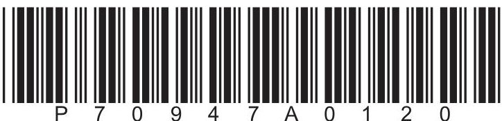
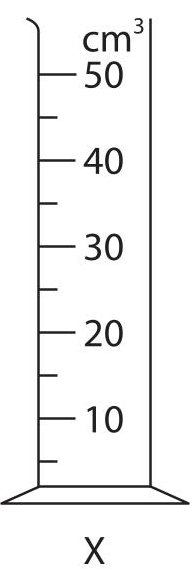
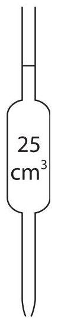
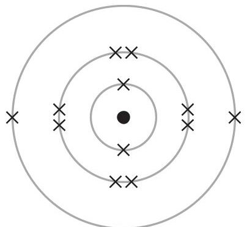
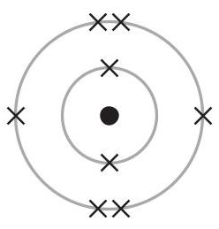
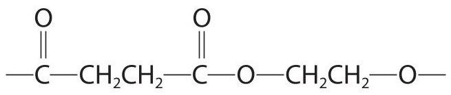
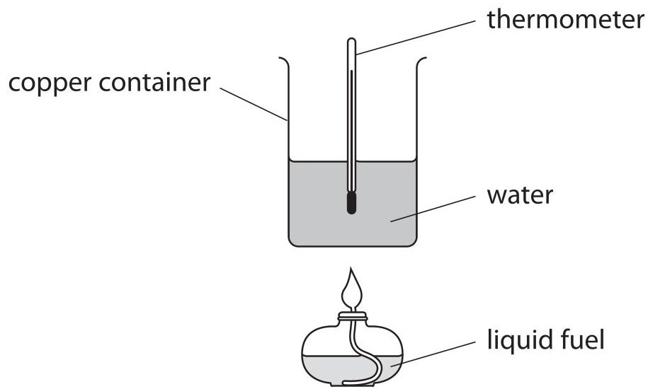
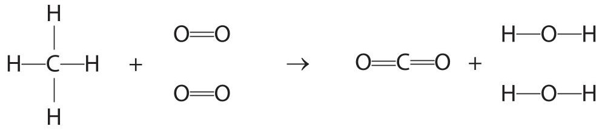
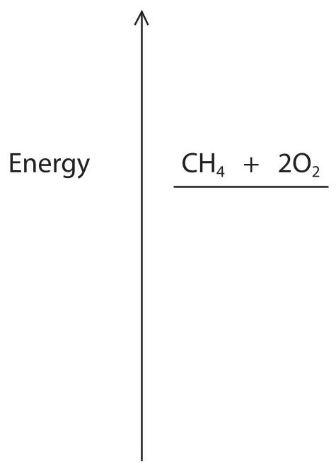

<table><tr><td colspan="3">Please check the examination details below before entering your candidate information</td></tr><tr><td colspan="2">Candidate surname</td><td>Other names</td></tr><tr><td>Centre Number</td><td colspan="2">Candidate Number</td></tr><tr><td colspan="3">Pearson Edexcel International GCSE (9-1)</td></tr><tr><td>Time</td><td>1 hour 15 minutes</td><td>Paper reference 4CH1/2C</td></tr><tr><td colspan="3">Chemistry
UNIT: 4CH1
PAPER: 2C</td></tr><tr><td colspan="3">You must have:
Calculator, ruler</td></tr><tr><td colspan="3">Total Marks</td></tr></table>

## Instructions

- Use black ink or ball-point pen.

- Fill in the boxes at the top of this page with your name, centre number and candidate number.

- Answer all questions.

- Answer the questions in the spaces provided

- there may be more space than you need.

- Show all the steps in any calculations and state the units.

## Information

- The total mark for this paper is 70.

- The marks for each question are shown in brackets

- use this as a guide as to how much time to spend on each question.

## Advice

- Read each question carefully before you start to answer it.

- Write your answers neatly and in good English.

- Try to answer every question.

- Check your answers if you have time at the end.

Turn over

<table border="1"><tr><td>7Li lithium3</td><td>9Be beryllium4</td><td colspan="12">Key</td><td>4He helium2</td></tr><tr><td>23Na sodium11</td><td>24Mg magnesium12</td><td colspan="12">relative atomic mass atomic symbol atomic (proton) number</td><td>20Ne neon10</td></tr><tr><td>39K potassium19</td><td>40Ca calcium20</td><td>45Sc scandium21</td><td>48Ti titanium22</td><td>51V vanadium23</td><td>52Cr chromium24</td><td>55Mn manganese25</td><td>56Fe iron26</td><td>59Co cobalt27</td><td>59Ni nickel28</td><td>63.5Cu copper29</td><td>65Zn zinc30</td><td>70Ga gallium31</td><td>73Ge germanium32</td><td>75As arsenic33</td><td>79Se selenium34</td><td>80Br bromine35</td><td>84Kr krypton36</td></tr><tr><td>85Rb rubidium37</td><td>88Sr strontium38</td><td>89Y yttrium39</td><td>91Zr zirconium40</td><td>93Nb niobium41</td><td>96Mo molybdenum42</td><td>[98]Tc technetium43</td><td>101Ru ruthenium44</td><td>103Rh rhodium45</td><td>106Pd palladium46</td><td>108Ag silver47</td><td>112Cd cadmium48</td><td>115In indium49</td><td>119Sn tin50</td><td>122Sb antimony51</td><td>128Te tellurium52</td><td>127I iodine53</td><td>131Xe xenon54</td></tr><tr><td>133Cs caesium55</td><td>137Ba barium56</td><td>139La* lanthanum57</td><td>178Hf hafnium72</td><td>181Ta tantalum73</td><td>184W tungsten74</td><td>186Re rhenium75</td><td>190Os osmium76</td><td>192Ir iridium77</td><td>195Pt platinum78</td><td>197Au gold79</td><td>201Hg mercury80</td><td>204TI thallium81</td><td>207Pb lead82</td><td>209Bi bismuth83</td><td>[209Po polonium84</td><td>[210At astatine85</td><td>[222Rn radon86</td></tr><tr><td>[223Fr francium87</td><td>[226Ra radium88</td><td>[227Ac* actinium89</td><td>[261Rf rutherfordium104</td><td>[262Db dubnium105</td><td>[266Sg seaborgium106</td><td>[264Bh bohrium107</td><td>[277Hs hassium108</td><td>[268Mt metnerium109</td><td>[271Ds darmstadtium110</td><td>[272Rg roentgenium111</td><td colspan="6">Elements with atomic numbers112-116 have been reported but not fully authenticated</td></tr></table>

$ ^{*} $ The lanthanoids (atomic numbers 58-71) and the actinoids (atomic numbers 90-103) have been omitted.

The relative atomic masses of copper and chlorine have not been rounded to the nearest whole number.

## Answer ALL questions.

Some questions must be answered with a cross in a box. If you change your mind about an answer, put a line through the box and then mark your new answer with a cross.

1 This question is about gases in the atmosphere.

The box gives the names of some gases.

<table border="1"><tr><td>argon</td><td>carbon dioxide</td><td>hydrogen</td></tr><tr><td>nitrogen</td><td>oxygen</td><td>water vapour</td></tr></table>

(a) Choose gases from the box to answer these questions.

(i) Identify the least reactive gas in the atmosphere.

(ii) Identify the most abundant gas in the atmosphere.

(iii) Identify the gas that is not normally found in the atmosphere.

(b) State an environmental problem caused by increasing amounts of carbon dioxide in the atmosphere.

(c) Describe a test for carbon dioxide.

(Total for Question 1 = 6 marks)

2 (a) The diagram shows two pieces of apparatus, X and Y.

Y

(i) Give the name of each piece of apparatus.

(ii) In a titration, a student adds $ 2 5. 0 \mathrm{c m}^{3} $ of barium hydroxide solution to a conical flask.

Give a reason why it is better to use Y rather than X.

(b) The student uses methyl orange indicator in the titration.

(i) State the colour of methyl orange in barium hydroxide solution.

(ii) Give a reason why universal indicator is not suitable for use in a titration.

(c) The student adds some dilute nitric acid to a burette and does the titration.

The equation for the reaction is

$$
\mathrm {B a} (\mathrm {O H}) _ {2} + 2 \mathrm {H N O} _ {3} \rightarrow \mathrm {B a} (\mathrm {N O} _ {3}) _ {2} + 2 \mathrm {H} _ {2} \mathrm {O}
$$

The student finds that $ 2 1. 5 0 \mathrm{c m}^{3} $ of nitric acid of concentration $ 0. 6 0 0 \mathrm{m o l} / \mathrm{d m}^{3} $ neutralises $ 2 5. 0 \mathrm{c m}^{3} $ of barium hydroxide solution.

Calculate the concentration, in mol/dm $ ^{3} $ , of the barium hydroxide solution.

$$
\mathrm {c o n c e n t r a t i o n} =
$$

(d) State why sulfuric acid would not be a suitable acid to use in this titration.

(Total for Question 2 = 9 marks)

3 This question is about Group 7,the halogens.

(a) Which halogen has the palest colour?

A astatine

B bromine

fluorine

D iodine

(b) Which halogen is a solid at room temperature?

A astatine

chlorine

B bromine

D fluorine

(c) The table shows the electronic configurations of a fluorine atom and a chlorine atom.

<table border="1"><tr><td></td><td>Electronic configuration</td></tr><tr><td>fluorine</td><td>2.7</td></tr><tr><td>chlorine</td><td>2.8.7</td></tr></table>

Explain the relative reactivities of fluorine and chlorine using the information in the table.

(d) Lithium reacts with chlorine to form lithium chloride.

(i) Write a chemical equation for the reaction of lithium with chlorine.

(ii) Describe tests to show that the product of the reaction is lithium chloride.

4 This question is about magnesium and magnesium compounds.

(a) Magnesium burns in oxygen to form magnesium oxide.

State two observations that would be seen during the reaction.

(b) The diagram shows the electron configurations of a magnesium atom and an oxygen atom.

magnesium atom

oxygen atom

Describe the changes in the electronic configurations when magnesium reacts with oxygen to form the ionic compound magnesium oxide, MgO

(c) Magnesium can be produced by the electrolysis of molten magnesium chloride.

(i) State why magnesium cannot be produced by heating magnesium oxide with carbon.

(ii) Explain the different ways that magnesium and magnesium chloride conduct electricity.

magnesium

magnesium chloride

(d) During the electrolysis of molten magnesium chloride, magnesium is formed at the negative electrode.

The ionic half-equation for the reaction is

$$
M g ^ {2 +} + 2 e ^ {-} \rightarrow M g
$$

(i) State why this is a reduction reaction.

(ii) Write an ionic half-equation for the formation of chlorine at the positive electrode.

(Total for Question 4 = 11 marks)

5 (a) An organic compound has this percentage composition by mass.

$$
C = 40 \% H = 6.7 \% O = 53.3 \%
$$

(i) Show that the empirical formula of the compound is $ \mathrm{C H_{2} O} $

(ii) Draw the structural formula of a compound with the molecular formula $ \mathrm{C_{2} H_{4}O_{2}} $

(b) Methanoic acid (HCOOH) reacts with sodium carbonate solution to give three products.

(i) Complete the equation for this reaction.

$$
2 \mathrm {H C O O H} + \mathrm {N a} _ {2} \mathrm {C O} _ {3} \rightarrow
$$

(ii) State what you would observe in this reaction.

(c) Methanoic acid also reacts with propanol to form an ester.

$$
\mathrm {H C O O H} + \mathrm {C} _ {3} \mathrm {H} _ {7} \mathrm {O H} \rightleftharpoons \mathrm {H C O O C} _ {3} \mathrm {H} _ {7} + \mathrm {H} _ {2} \mathrm {O}
$$

(i) Give the name of the ester that forms.

The equation for the reaction is

(ii) State what is meant by the $ \rightleftharpoons $ symbol.

(iii) When this reaction occurs in a sealed container, the reaction can reach dynamic equilibrium.

Give one characteristic of a reaction at dynamic equilibrium.

(d) A polyester forms when butanedioic acid reacts with ethanediol.

The diagram shows the repeat unit of the polyester that forms.

(i) Give the name of this type of polymerisation.

(ii) Draw the structural formulae of the two monomers used to make this polyester.

(Total for Question 5 = 12 marks)

## BLANK PAGE

6 Titanium is an important metal in industry.

Titanium dioxide $ \left( \mathrm{T i O}_{2} \right) $ can be converted into titanium metal in two stages.

Stage 1 titanium dioxide is converted into titanium(IV) chloride $ \left( \mathrm{T i C l}_{4} \right) $

Stage 2 titanium(IV) chloride is converted into titanium

(a) This is the equation for the reaction in stage 1.

$$
\mathrm {T i O} _ {2} + 2 \mathrm {C l} _ {2} + \mathrm {C} \rightarrow \mathrm {T i C l} _ {4} + \mathrm {C O} _ {2}
$$

Calculate the volume, in $ \mathrm{d m}^{3} $ of chlorine gas at rtp needed to react completely with 20 tonnes of titanium dioxide.

Give your answer in standard form.

$$
[ 1 \mathrm {t o n n e} = 1 0 ^ {6} \mathrm {g} M _ {\mathrm {r}} \mathrm {o f} \mathrm {T i O} _ {2} = 8 0 ]
$$

[molar volume of chlorine gas at rtp=24 dm $ ^{3} $]

(b) In stage 2, titanium(IV) chloride vapour is passed through molten magnesium in a container filled with argon.

This is the equation for the reaction in stage 2.

$$
\mathrm {T i C l} _ {4} + 2 \mathrm {M g} \rightarrow \mathrm {T i} + 2 \mathrm {M g C l} _ {2}
$$

Explain why the container is filled with argon rather than air.

(c) Aeroplanes are made of an alloy containing aluminium and titanium.

Explain why the alloy is stronger than pure titanium metal.

You may include diagrams in your answer.

(Total for Question 6 = 9 marks)

## BLANK PAGE

7 A student uses this apparatus to find the heat energy supplied by a liquid fuel.

The student burns some fuel to heat the water in the copper container and measures the change in temperature.

(a) The student notices that the bottom of the container turns black.

Give the name of the black substance that forms on the bottom of the container.

(b) In one experiment, the student burns 0.92 g of ethanol.

The student calculates that the heat energy absorbed by the water is 18.2 kJ.

Show that the results of this experiment give an approximate value for the enthalpy of combustion of ethanol of $ \Delta H=-9 0 0 \mathrm{k J / m o l}. $

[M $ _{r} $ of ethanol=46]

(c) The data book value of $ \Delta H $ for the combustion of ethanol is $ -1 3 6 7 \mathrm{k J / m o l} $ Give two reasons why the student's value is much lower than the data book value.

(d) The equation shows the combustion of methane.

$$
\mathrm {C H} _ {4} + 2 \mathrm {O} _ {2} \rightarrow \mathrm {C O} _ {2} + 2 \mathrm {H} _ {2} \mathrm {O} \quad \Delta H = - 8 9 0 \mathrm {k J / m o l}
$$

This is the equation showing the displayed formulae.

The table shows the bond energies for O=O, C=O and O—H

<table border="1"><tr><td>Bond</td><td>O=O</td><td>C=O</td><td>O-H</td></tr><tr><td>Bond energy in kJ/mol</td><td>498</td><td>805</td><td>463</td></tr></table>

(i) Calculate the bond energy of the C—H bond, using information from the equation and the table.

$$
\mathrm {C} - \mathrm {H} \mathrm {b o n d} \mathrm {e n e r g y} =
$$

(ii) Complete the energy level diagram to show the products and $ \Delta H. $

(Total for Question 7 = 11 marks)

TOTAL FOR PAPER = 70 MARKS

## BLANK PAGE

