<table><tr><td colspan="3">Please check the examination details below before entering your candidate information</td></tr><tr><td>Candidate surname</td><td colspan="2">Other names</td></tr><tr><td>Centre Number</td><td colspan="2">Candidate Number</td></tr><tr><td colspan="3">Pearson Edexcel International GCSE (9-1)</td></tr><tr><td>Time 1 hour 15 minutes</td><td>Paper reference</td><td>4CH1/2C</td></tr><tr><td colspan="3">Chemistry
UNIT: 4CH1
PAPER: 2C</td></tr><tr><td colspan="3">You must have:
Calculator, ruler</td></tr><tr><td colspan="3">Total Marks</td></tr></table>

## Instructions

- Use black ink or ball-point pen.

- If pencil is used for diagrams/sketches/graphs it must be dark (HB or B).

- Fill in the boxes at the top of this page with your name, centre number and candidate number.

- Answer all questions.

- Answer the questions in the spaces provided

- there may be more space than you need.

- Show all the steps in any calculations and state the units.

## Information

- The total mark for this paper is 70.

- The marks for each question are shown in brackets

- use this as a guide as to how much time to spend on each question.

## Advice

- Read each question carefully before you start to answer it.

- Write your answers neatly and in good English.

- Try to answer every question.

- Check your answers if you have time at the end.

Turn over

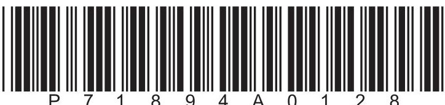

<table border="1"><tr><td>7Li lithium3</td><td>9Be beryllium4</td><td colspan="12">Key</td><td>4He helium2</td></tr><tr><td>23Na sodium11</td><td>24Mg magnesium12</td><td colspan="12">relative atomic mass atomic symbol atomic (proton) number</td><td>20Ne neon10</td></tr><tr><td>39K potassium19</td><td>40Ca calcium20</td><td>45Sc scandium21</td><td>48Ti titanium22</td><td>51V vanadium23</td><td>52Cr chromium24</td><td>55Mn manganese25</td><td>56Fe iron26</td><td>59Co cobalt27</td><td>59Ni nickel28</td><td>63.5Cu copper29</td><td>65Zn zinc30</td><td>70Ga gallium31</td><td>73Ge germanium32</td><td>75As arsenic33</td><td>79Se selenium34</td><td>80Br bromine35</td><td>84Kr krypton36</td></tr><tr><td>85Rb rubidium37</td><td>88Sr strontium38</td><td>89Y yttrium39</td><td>91Zr zirconium40</td><td>93Nb niobium41</td><td>96Mo molybdenum42</td><td>[98]Tc technetium43</td><td>101Ru ruthenium44</td><td>103Rh rhodium45</td><td>106Pd palladium46</td><td>108Ag silver47</td><td>112Cd cadmium48</td><td>115In indium49</td><td>119Sn tin50</td><td>122Sb antimony51</td><td>128Te tellurium52</td><td>127I iodine53</td><td>131Xe xenon54</td></tr><tr><td>133Cs caesium55</td><td>137Ba barium56</td><td>139La* lanthanum57</td><td>178Hf hafnium72</td><td>181Ta tantalum73</td><td>184W tungsten74</td><td>186Re rhenium75</td><td>190Os osmium76</td><td>192Ir iridium77</td><td>195Pt platinum78</td><td>197Au gold79</td><td>201Hg mercury80</td><td>204TI thallium81</td><td>207Pb lead82</td><td>209Bi bismuth83</td><td>[209]Po polonium84</td><td>[210]At astatine85</td><td>[222]Rn radon86</td></tr><tr><td>[223]Fr francium87</td><td>[226]Ra radium88</td><td>[227]Ac* actinium89</td><td>[261]Rf rutherfordium104</td><td>[262]Db dubnium105</td><td>[266]Sg seaborgium106</td><td>[264]Bh bohrium107</td><td>[277]Hs hassium108</td><td>[268]Mt metnierium109</td><td>[271]Ds darmstadtium110</td><td>[272]Rg roentgenium111</td><td colspan="6">Elements with atomic numbers 112-116 have been reported but not fully authenticated</td></tr></table>

$ ^{*} $ The lanthanoids (atomic numbers 58-71) and the actinoids (atomic numbers 90-103) have been omitted.

The relative atomic masses of copper and chlorine have not been rounded to the nearest whole number.

## Answer ALL questions.

Some questions must be answered with a cross in a box. If you change your mind about an answer, put a line through the box and then mark your new answer with a cross.

1 (a) The diagram shows the electronic configuration of an atom of an element.

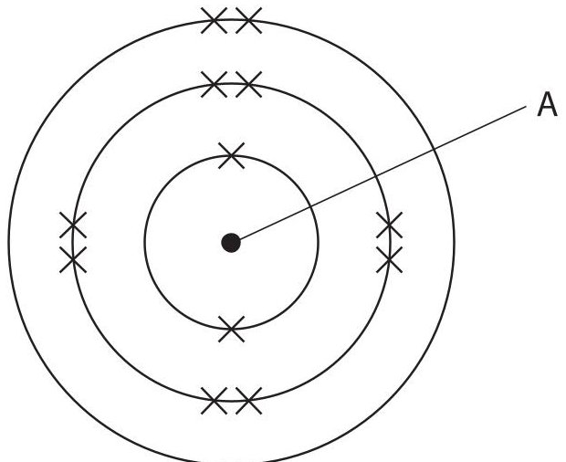

Complete the table by giving the missing information.

(3) 

<table border="1"><tr><td>Name of the part of this atom labelled A</td><td></td></tr><tr><td>Number of the group that contains this element</td><td></td></tr><tr><td>Number of the period that contains this element</td><td></td></tr></table>

(b) The table gives information about four different species, W, X, Y and Z.

<table border="1"><tr><td>Species</td><td>Number of protons</td><td>Number of neutrons</td><td>Number of electrons</td></tr><tr><td>W</td><td>2</td><td>2</td><td>2</td></tr><tr><td>X</td><td>13</td><td>14</td><td>10</td></tr><tr><td>Y</td><td>17</td><td>18</td><td>17</td></tr><tr><td>Z</td><td>17</td><td>20</td><td>17</td></tr></table>

(i) Give the mass number of W.

(ii) Give a reason why X has a 3+ charge.

(iii) Explain why Y and Z are isotopes of the same element.

(Total for Question 1 = 7 marks)

2 The table shows properties of four substances, A, B, C and D.

<table border="1"><tr><td>Substance</td><td>Melting point in℃</td><td>Boiling point in℃</td><td>Conducts electricity when solid</td><td>Conducts electricity when molten</td></tr><tr><td>A</td><td>800</td><td>1465</td><td>no</td><td>yes</td></tr><tr><td>B</td><td>327</td><td>1749</td><td>yes</td><td>yes</td></tr><tr><td>C</td><td>232</td><td>573</td><td>no</td><td>no</td></tr><tr><td>D</td><td>3550</td><td>4830</td><td>no</td><td>no</td></tr></table>

(a) Use information from the table to identify these substances.

(i) Which substance could be a metal?

A

B

C

D

(ii) Which substance could be diamond?

A

B

C

D

(iii) Which substance is a gas at 600 $ ^{\circ} \mathrm{C}? $

A

B

C

D

(b) One of the substances in the table is a compound with the formula $ \mathrm{C_{10}H_{16}N_{2}O_{3}S} $

(i) Give the number of different elements in $ C_{1 0} H_{1 6} N_{2} O_{3} S $

(ii) Determine the number of atoms in a molecule of $ C_{1 0} H_{1 6} N_{2} O_{3} S $

(Total for Question 2 = 5 marks)

## BLANK PAGE

3 This question is about soluble salts and insoluble salts.

(a) Which pair of solutions produces an insoluble salt when mixed?

A sodium sulfate and potassium nitrate

B potassium carbonate and calcium nitrate

C sodium chloride and ammonium nitrate

D sodium hydroxide and potassium sulfate

(b) When solutions of lead nitrate and sodium sulfate are mixed, one product is solid lead sulfate.

This is the equation for the reaction.

$$
\mathrm {P b} \left(\mathrm {N O} _ {3}\right) _ {2} (\mathrm {a q}) + \mathrm {N a} _ {2} \mathrm {S O} _ {4} (\mathrm {a q}) \rightarrow \mathrm {P b S O} _ {4} (\mathrm {s}) + 2 \mathrm {N a N O} _ {3} (\mathrm {a q})
$$

Describe how a pure, dry sample of solid lead sulfate can be obtained from the mixture.

(c) The table gives the solubility of a salt in water at six different temperatures.

<table border="1"><tr><td>Temperature in℃</td><td>0</td><td>20</td><td>40</td><td>60</td><td>80</td><td>100</td></tr><tr><td>Solubility ing per100g of water</td><td>18</td><td>34</td><td>54</td><td>77</td><td>104</td><td>142</td></tr></table>

(i) Plot the points on the grid.

(ii) Draw a curve of best fit.

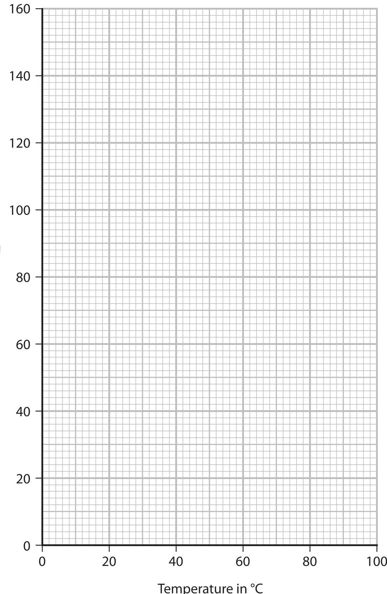

(iii) A saturated solution of the salt in 100g of water is cooled from $ 9 0^{\circ} \mathrm{C} $ to $ 3 0^{\circ} \mathrm{C} $ Use your graph to determine the mass of salt that will crystallise. Show your working on the graph.

4 Fractional distillation is used to separate crude oil into fractions.

The diagram shows a fractionating column and the fractions obtained from crude oil.

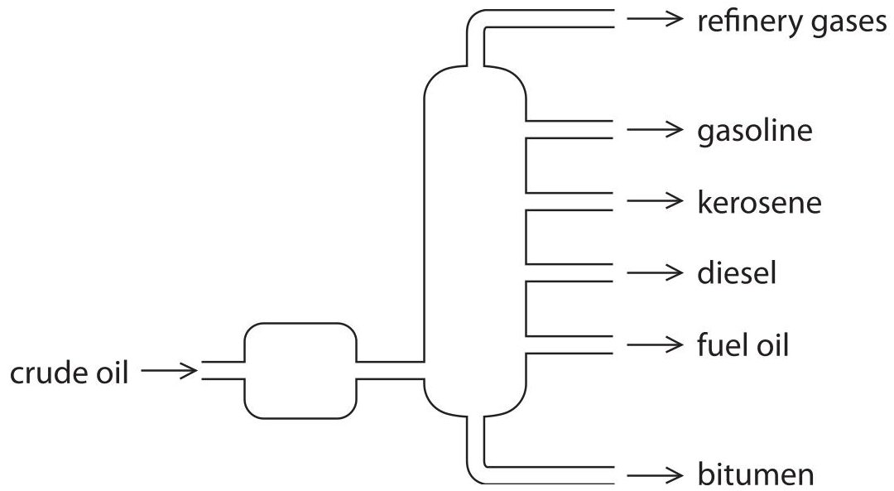

(a) (i) Describe how crude oil is separated into fractions in the fractionating column.

(ii) Give a use for kerosene and a use for bitumen. kerosene

bitumen

(b) Some fractions obtained from crude oil are cracked to form alkenes.

(i) Describe what is meant by cracking.

(ii) Ethene is obtained by cracking.

This is the displayed formula of ethene.

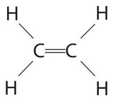

Explain why ethene is described as an unsaturated hydrocarbon.

(iii) Describe a test to show that ethene is unsaturated.

(Total for Question 4 = 13 marks)

## BLANK PAGE

5 This question is about metals.

(a) Explain why metals are malleable.

(b) Sodium metal is extracted by the electrolysis of molten sodium chloride.

Sodium metal forms at the negative electrode and chlorine gas forms at the positive electrode.

The diagram represents this electrolysis.

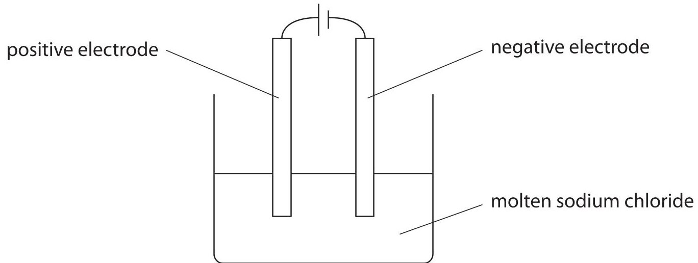

(i) Explain why molten sodium chloride conducts electricity.

(ii) Explain how sodium metal forms at the negative electrode.

(iii) Write an ionic half-equation for the formation of chlorine gas at the positive electrode.

(iv) Give a reason why sodium metal does not form in the electrolysis of an aqueous solution of sodium chloride.

(c) Copper can be produced by reacting an oxide of copper with methane.

The diagram shows the apparatus used.

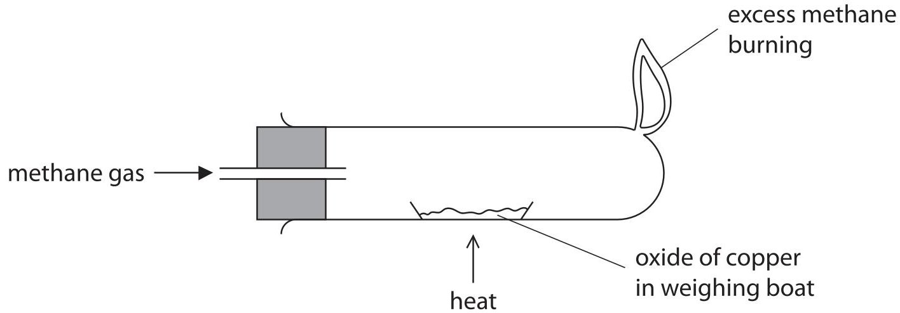

The oxide of copper is heated until the reaction is complete.

The table shows the results.

<table border="1"><tr><td></td><td>Mass in g</td></tr><tr><td>empty weighing boat</td><td>17.25</td></tr><tr><td>weighing boat+oxide of copper</td><td>22.02</td></tr><tr><td>weighing boat+copper</td><td>21.06</td></tr></table>

Use the results to show that this oxide has the empirical formula CuO [for Cu, $ A_{\mathrm{r}}=6 3. 5 $ for O, $ A_{\mathrm{r}}=1 6 $]

(3) 

## BLANK PAGE

6 When ethanoic acid reacts with ethanol in the presence of concentrated sulfuric acid, one of the products is ester A.

This is the equation for the reaction.

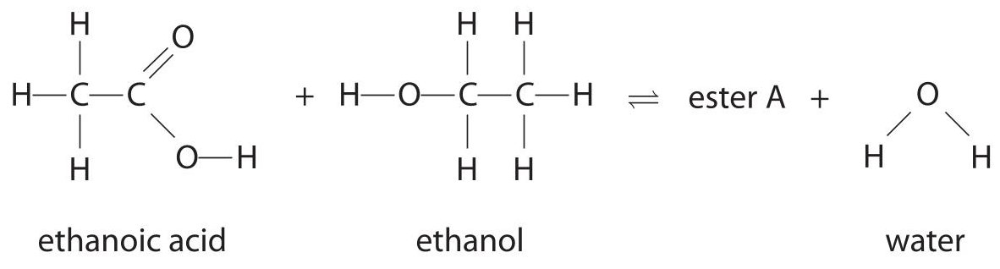

(a) (i) Draw a circle around the functional group in ethanoic acid.

(ii) Give the displayed formula of ester A.

(iii) Name ester A.

(b) The reaction mixture is kept in a sealed container until dynamic equilibrium is reached.

State what is meant by the term dynamic equilibrium.

(c) During the reaction, the number of moles of ethanoic acid in the reaction mixture decreases, but the number of moles of concentrated sulfuric acid does not change.

(i) Give a reason why the number of moles of concentrated sulfuric acid does not change.

(ii) A student does a titration to find the accurate volume of sodium hydroxide solution needed for complete neutralisation.

The student starts by using a pipette to transfer $ 2 5. 0 \mathrm{c m}^{3} $ of the reaction mixture to a conical flask.

Describe how the student should complete the titration.

(Total for Question 6 = 13 marks)

## BLANK PAGE

7 This question is about hydrazine, $ \mathrm{N}_{2} \mathrm{H}_{4} $

(a) This is the displayed formula for a molecule of hydrazine.

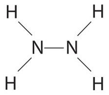

Complete the dot-and-cross diagram for hydrazine.

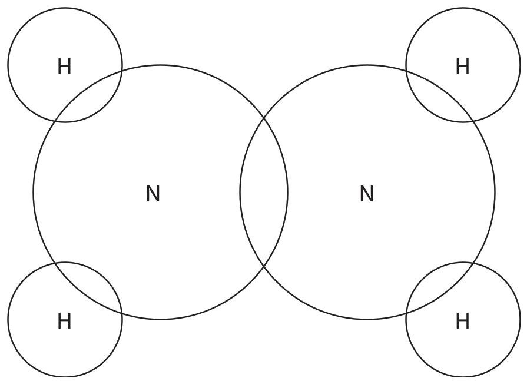

(b) This is the equation for the decomposition of hydrazine.

$$
3 \mathrm {N} _ {2} \mathrm {H} _ {4} (\mathrm {g}) \rightarrow 4 \mathrm {N H} _ {3} (\mathrm {g}) + \mathrm {N} _ {2} (\mathrm {g})
$$

The equation can be shown using displayed formulae.

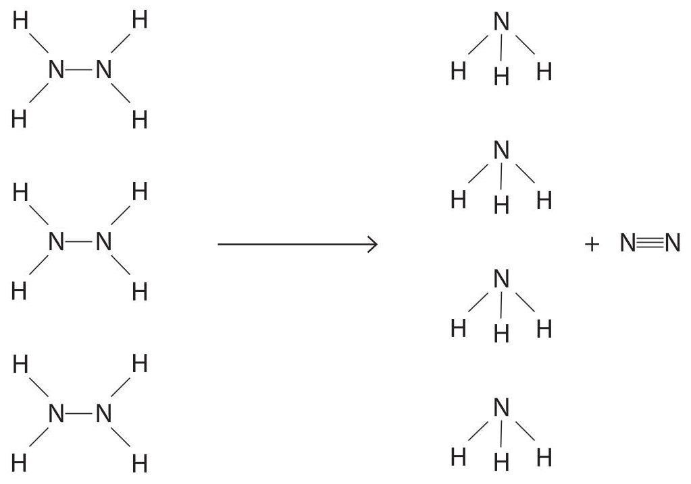

The table gives the relevant bond energies.

<table border="1"><tr><td>Bond</td><td>Bond energy in kJ/mol</td></tr><tr><td>N—N</td><td>158</td></tr><tr><td>N—H</td><td>391</td></tr><tr><td>N≡N</td><td>945</td></tr></table>

(i) Use the data in the table to calculate the total energy needed to break all the bonds in the reactants.

(ii) Use the data in the table to calculate the total energy released when all the bonds in the products are made.

(iii) Calculate the enthalpy change, $ \Delta H $ , in kJ/mol, for the reaction.

(iv) Explain, in terms of bonds broken and bonds made, why this reaction is exothermic.

(c) A sample of hydrazine is completely decomposed.

This is the equation for the decomposition of hydrazine.

$$
3 \mathrm {N} _ {2} \mathrm {H} _ {4} (\mathrm {g}) \rightarrow 4 \mathrm {N H} _ {3} (\mathrm {g}) + \mathrm {N} _ {2} (\mathrm {g})
$$

The products of the decomposition are bubbled through $ 1 1 0 0 \mathrm{c m}^{3} $ of water.

The ammonia completely dissolves in the water, but nitrogen is insoluble in water.

The nitrogen has a volume of $ 1 5 7 0 \mathrm{c m}^{3} $ at room temperature and pressure (rtp).

Calculate the concentration, in mol/dm $ ^{3} $ , of the ammonia solution.

Give your answer to 3 significant figures.

[for a gas at rtp,molar volume = 24000 $ cm^{3} $]

(Total for Question 7 = 13 marks)

TOTAL FOR PAPER = 70 MARKS

## BLANK PAGE

## BLANK PAGE

