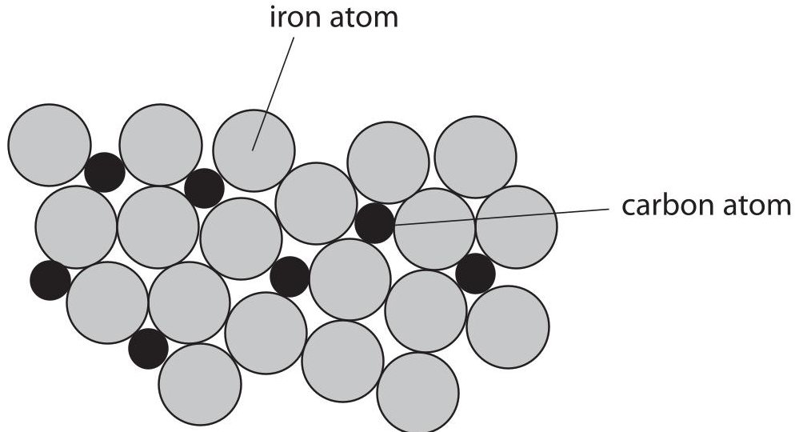
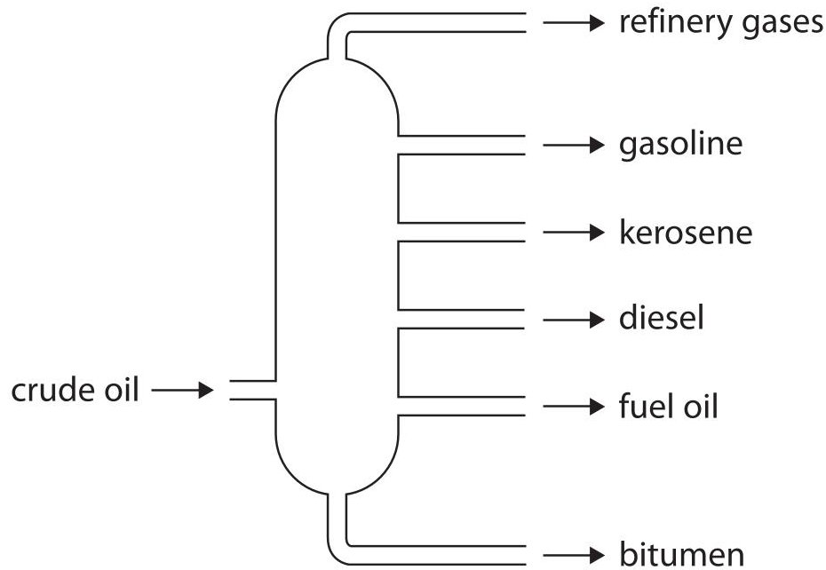
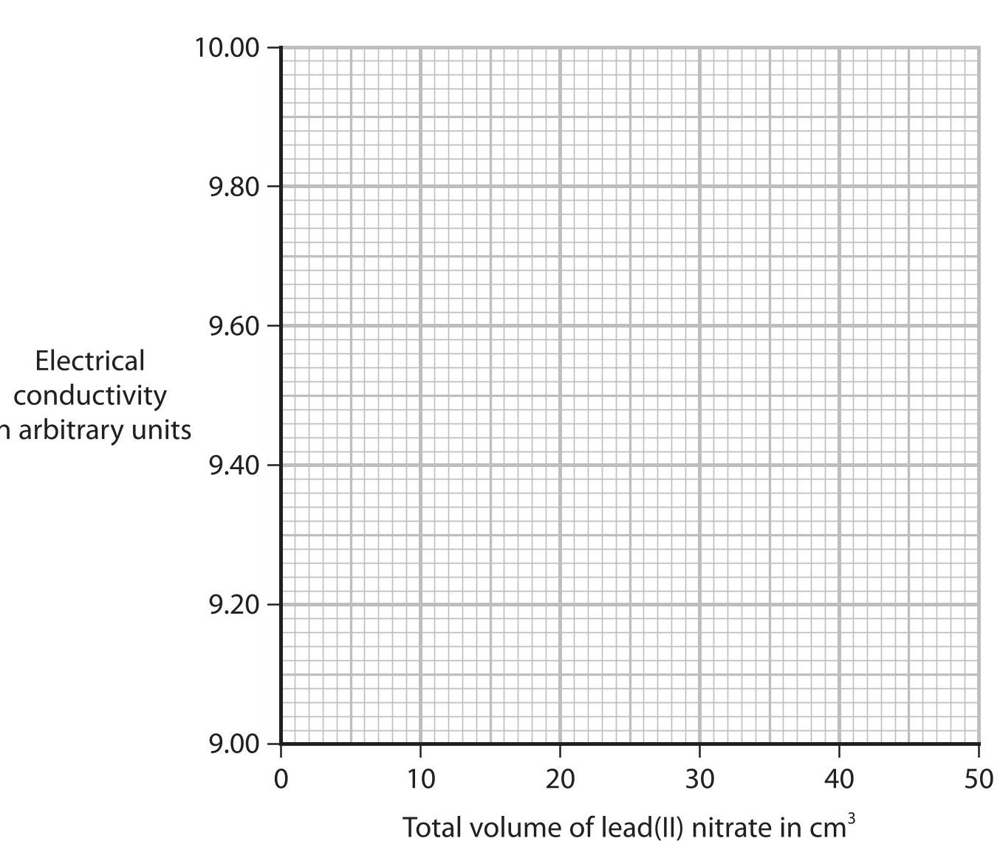
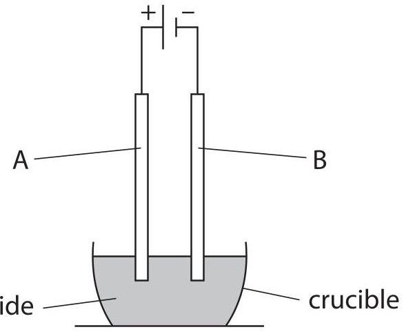
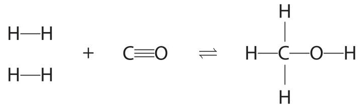
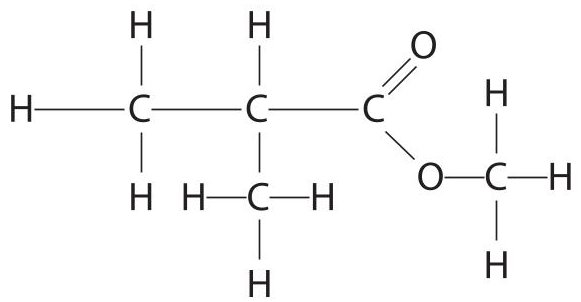

<table><tr><td colspan="3">Please check the examination details below before entering your candidate information</td></tr><tr><td colspan="2">Candidate surname</td><td>Other names</td></tr><tr><td>Centre Number</td><td colspan="2">Candidate Number</td></tr><tr><td colspan="3">Pearson Edexcel International GCSE (9-1)</td></tr><tr><td colspan="3">Tuesday 13 June 2023</td></tr><tr><td colspan="2">Morning (Time: 1 hour 15 minutes)</td><td>Paper reference 4CH1/2CR</td></tr><tr><td colspan="3">Chemistry
UNIT: 4CH1
PAPER: 2CR</td></tr><tr><td colspan="3">You must have:
Calculator, ruler</td></tr><tr><td colspan="3">Total Marks</td></tr></table>

## Instructions

- Use black ink or ball-point pen.

- If pencil is used for diagrams/sketches/graphs it must be dark (HB or B).

- Fill in the boxes at the top of this page with your name, centre number and candidate number.

- Answer all questions.

- Answer the questions in the spaces provided

- there may be more space than you need.

- Show all the steps in any calculations and state the units.

## Information

- The total mark for this paper is 70.

- The marks for each question are shown in brackets - use this as a guide as to how much time to spend on each question.

## Advice

- Read each question carefully before you start to answer it.

- Write your answers neatly and in good English.

- Try to answer every question.

- Check your answers if you have time at the end.

Turn over

<table border="1"><tr><td>7Li lithium3</td><td>9Be beryllium4</td><td colspan="12">Key</td><td>4He helium2</td></tr><tr><td>23Na sodium11</td><td>24Mg magnesium12</td><td colspan="12">relative atomic mass atomic symbol atomic (proton) number</td><td>20Ne neon10</td></tr><tr><td>39K potassium19</td><td>40Ca calcium20</td><td>45Sc scandium21</td><td>48Ti titanium22</td><td>51V vanadium23</td><td>52Cr chromium24</td><td>55Mn manganese25</td><td>56Fe iron26</td><td>59Co cobalt27</td><td>59Ni nickel28</td><td>63.5Cu copper29</td><td>65Zn zinc30</td><td>70Ga gallium31</td><td>73Ge germanium32</td><td>75As arsenic33</td><td>79Se selenium34</td><td>80Br bromine35</td><td>84Kr krypton36</td></tr><tr><td>85Rb rubidium37</td><td>88Sr strontium38</td><td>89Y yttrium39</td><td>91Zr zirconium40</td><td>93Nb niobium41</td><td>96Mo molybdenum42</td><td>[98]Tc technetium43</td><td>101Ru ruthenium44</td><td>103Rh rhodium45</td><td>106Pd palladium46</td><td>108Ag silver47</td><td>112Cd cadmium48</td><td>115In indium49</td><td>119Sn tin50</td><td>122Sb antimony51</td><td>128Te tellurium52</td><td>127I iodine53</td><td>131Xe xenon54</td></tr><tr><td>133Cs caesium55</td><td>137Ba barium56</td><td>139La* lanthanum57</td><td>178Hf hafnium72</td><td>181Ta tantalum73</td><td>184W tungsten74</td><td>186Re rhenium75</td><td>190Os osmium76</td><td>192Ir iridium77</td><td>195Pt platinum78</td><td>197Au gold79</td><td>201Hg mercury80</td><td>204Tl thallium81</td><td>207Pb lead82</td><td>209Bi bismuth83</td><td>[209]Po polonium84</td><td>[210]At astatine85</td><td>[222]Rn radon86</td></tr><tr><td>[223]Fr francium87</td><td>[226]Ra radium88</td><td>[227]Ac* actinium89</td><td>[261]Rf rutherfordium104</td><td>[262]Db dubnium105</td><td>[266]Sg seaborgium106</td><td>[264]Bh bohrium107</td><td>[277]Hs hassium108</td><td>[268]Mt meitnerium109</td><td>[271]Ds darmstadium110</td><td>[272]Rg roentgenium111</td><td colspan="6">Elements with atomic numbers 112-116 have been reported but not fully authenticated</td></tr></table>
$ ^{*} $ The lanthanoids (atomic numbers 58-71) and the actinoids (atomic numbers 90-103) have been omitted.
The relative atomic masses of copper and chlorine have not been rounded to the nearest whole number.
## BLANK PAGE
## Answer ALL questions.
Some questions must be answered with a cross in a box. If you change your mind about an answer, put a line through the box and then mark your new answer with a cross.
1 (a) The table lists three subatomic particles.
Complete the table by giving the missing information.
<table border="1"><tr><td>Subatomic particle</td><td>Relative mass</td><td>Relative charge</td></tr><tr><td>proton</td><td></td><td>+1</td></tr><tr><td>neutron</td><td></td><td></td></tr><tr><td>electron</td><td>0.0005</td><td></td></tr></table>
(b) The diagram shows the position of some elements in the Periodic Table.
<table border="1"><tr><td></td><td>Be</td><td colspan="11"></td><td></td><td></td><td></td><td></td><td>F</td><td></td></tr><tr><td></td><td></td><td></td><td></td><td></td><td></td><td></td><td></td><td></td><td></td><td></td><td></td><td></td><td></td><td>P</td><td></td><td></td><td></td><td></td><td></td></tr><tr><td></td><td></td><td></td><td></td><td></td><td></td><td></td><td></td><td></td><td></td><td></td><td></td><td></td><td></td><td></td><td></td><td></td><td></td><td></td><td></td></tr><tr><td></td><td></td><td></td><td></td><td></td><td></td><td></td><td></td><td></td><td></td><td></td><td></td><td></td><td></td><td></td><td></td><td></td><td></td><td>Xe</td><td></td></tr></table>
Use the Periodic Table on page 2 to help you answer this question.
(i) How are elements arranged in the Periodic Table?
(1) 
A increasing atomic number
B increasing melting point
C increasing reactivity
D increasing relative atomic mass
(ii) Which statement is correct about the position of phosphorus, P, in the Periodic Table?
A Group 2 and Period 5
B Group 3 and Period 5
C Group 5 and Period 2
D Group 5 and Period 3
(iii) Explain which of the four elements in the diagram is least reactive.
(Total for Question 1 = 6 marks)
2 The table gives some information about the halogens, fluorine, chlorine, bromine and iodine.
<table border="1"><tr><td>Halogen</td><td>Physical state at room temperature</td><td>Colour</td><td>Colour of dilute aqueous solution of halogen</td></tr><tr><td>fluorine</td><td>gas</td><td></td><td>colourless</td></tr><tr><td>chlorine</td><td>gas</td><td>green</td><td>colourless</td></tr><tr><td>bromine</td><td></td><td>red-brown</td><td>orange</td></tr><tr><td>iodine</td><td>solid</td><td>grey</td><td>brown</td></tr></table>
(a) Complete the table by giving the missing information.
(b) Describe a test to show that a colourless liquid is an alkene.
(c) A student is given an aqueous solution of chlorine and an aqueous solution of sodium iodide.
The student mixes the two solutions.
Explain the colour change that occurs.
(Total for Question 2 = 7 marks)
3 (a) The box gives the names of some metals.
<table border="1"><tr><td>aluminium</td><td>calcium</td><td>gold</td><td>magnesium</td><td>silver</td><td>zinc</td></tr></table>
Use words from the box to answer these questions.
(i) Identify the metal that burns with a bright white flame.
(ii) Explain which metal is most likely to be found in the Earth as an uncombined element.
(b) Steel is an alloy of iron and carbon.
The diagram shows how the particles are arranged in steel.

(i) State what is meant by the term alloy.
(ii) Explain why an alloy is less malleable than a pure metal.
(Total for Question 3 = 6 marks)
4 (a) The diagram shows a fractionating column used to separate crude oil into fractions.

(i) Give one use for refinery gases and one use for bitumen.
refinery gases
bitumen
(ii) Give a reason why refinery gases rise to the top of the column.
(iii) State what must happen to the crude oil before it is pumped into the column.
(b) There is a low demand for some of the hydrocarbons obtained from crude oil. Catalytic cracking can be used to convert low-demand hydrocarbons into more useful products.
(i) Give the conditions needed for cracking.
(ii) The cracking of tetradecane is shown in the equation.
$$
\mathrm {C} _ {1 4} \mathrm {H} _ {3 0} \rightarrow 2 \mathrm {C} _ {3} \mathrm {H} _ {6} + \mathrm {C} _ {8} \mathrm {H} _ {1 8}
$$
Explain why there is a high demand for both of the products.

(Total for Question 4 = 9 marks)

5 This question is about the insoluble salt, lead(II) bromide. Lead(II) bromide can be made by a precipitation reaction. This is the equation for the reaction.
$$
\mathrm {P b} \left(\mathrm {N O} _ {3}\right) _ {2} (\mathrm {a q}) + 2 \mathrm {K B r} (\mathrm {a q}) \rightarrow \mathrm {P b B r} _ {2} (\mathrm {s}) + 2 \mathrm {K N O} _ {3} (\mathrm {a q})
$$
(a) Describe how solutions of lead nitrate and potassium bromide can be used to make a pure, dry sample of lead(II) bromide.
(b) A solution containing 0.150 mol of lead(II) nitrate is reacted with an excess of potassium bromide solution.
A mass of 49.6 g of pure, dry lead(II) bromide is produced.
Show, by calculation, that the percentage yield of lead(II) bromide is 90.1%.
[for $ \mathrm{P b B r_{2}} $ $ M_{\mathrm{r}}=3 6 7 $]
(c) A student investigates the change in electrical conductivity as dilute lead(II) nitrate solution is added to dilute potassium bromide solution.
This is the student's method.
Step 1 add $ 5 0 \mathrm{c m}^{3} $ of potassium bromide solution to a beaker
Step 2 measure the electrical conductivity of the solution
Step 3 add $ 1 0 \mathrm{c m}^{3} $ of lead(II) nitrate solution to the beaker
Step 4 stir the mixture
Step 5 measure the electrical conductivity of the mixture
Repeat steps 3,4 and 5 until a total of $ 5 0 \mathrm{c m}^{3} $ of lead(II) nitrate solution has been added.
The table shows the student's results.
<table border="1"><tr><td>Total volume of lead(II) nitrate solution added in $ \mathrm{c m^{3}} $</td><td>Electrical conductivity in arbitrary units</td></tr><tr><td>0</td><td>10.00</td></tr><tr><td>10</td><td>9.80</td></tr><tr><td>20</td><td>9.77</td></tr><tr><td>30</td><td>9.40</td></tr><tr><td>40</td><td>9.20</td></tr><tr><td>50</td><td>9.00</td></tr></table>
(i) Plot the student's results on the grid.
(ii) Draw a line of best fit, ignoring the anomalous result.

(iii) Explain the shape of the graph.

(iv) Suggest a mistake the student could have made to cause the anomalous result.
(v) Further $ 1 0 \mathrm{c m}^{3} $ volumes of lead(II) nitrate are added to the beaker so the lead(II) nitrate is in excess.
Predict what will happen to the conductivity of the mixture when the lead(II) nitrate is in excess.
(d) The diagram shows the electrolysis of molten lead(II) bromide, $ \mathrm{P b B r}_{2} $

This is the ionic half-equation for the formation of bromine at electrode A.
$$
2 \mathrm {B r} ^ {-} \rightarrow \mathrm {B r} _ {2} + 2 \mathrm {e} ^ {-}
$$
Give a reason why this half-equation shows oxidation.
6 (a) Describe the forces of attraction in metallic bonding.
(b) When a small piece of potassium is added to water, bubbles of hydrogen gas are observed.
(i) Give the test for hydrogen gas.
(ii) Give two other observations that would be made.
(c) Explain why lithium is less reactive than potassium. Refer to atomic structure in your answer.
(d) This is the equation for the reaction between sodium and water.
$$
2 \mathrm {N a} (\mathrm {s}) + 2 \mathrm {H} _ {2} \mathrm {O} (\mathrm {I}) \rightarrow 2 \mathrm {N a O H} (\mathrm {a q}) + \mathrm {H} _ {2} (\mathrm {g})
$$
A mass of 0.750g of sodium is reacted with an excess of water.
Calculate the volume of hydrogen gas produced, in $ cm^{3} $ , at room temperature.
[molar volume of hydrogen at rtp = 24000 $ cm^{3} $]
[for Na, $ A_{\mathrm{r}}=2 3 $]
Give your answer to three significant figures.
$$
\mathrm {v o l u m e o f h y d r o g e n} =
$$
(e) This is the equation for the reaction between sodium hydroxide and sulfuric acid.
$$
2 \mathrm {N a O H} + \mathrm {H} _ {2} \mathrm {S O} _ {4} \rightarrow \mathrm {N a} _ {2} \mathrm {S O} _ {4} + 2 \mathrm {H} _ {2} \mathrm {O}
$$
A volume of $ 2 5. 0 \mathrm{c m}^{3} $ of sodium hydroxide solution is completely neutralised by $ 1 6. 3 \mathrm{c m}^{3} $ of $ 0. 0 5 0 0 \mathrm{m o l} / \mathrm{d m}^{3} $ sulfuric acid.
Calculate the concentration of the sodium hydroxide solution in mol / dm $ ^{3}. $
$$
\mathrm {m o l} / \mathrm {d m} ^ {3}
$$
(Total for Question 6 = 15 marks)
7 Methanol is made by the reaction between hydrogen and carbon monoxide. This is the equation for the reaction.
$$
2 \mathrm {H} _ {2} (\mathrm {g}) + \mathrm {C O} (\mathrm {g}) \rightleftharpoons \mathrm {C H} _ {3} \mathrm {O H} (\mathrm {g}) \quad \Delta H = - 1 1 9 \mathrm {k J / m o l}
$$
A mixture of hydrogen and carbon monoxide is left until dynamic equilibrium is reached.
(a) (i) Give two characteristics of a reaction at dynamic equilibrium.
(ii) Give a reason why adding a catalyst does not affect the yield of methanol.
(iii) The temperature of the reaction mixture is decreased at constant pressure Explain the effect of this change on the yield of methanol.
(iv) The pressure of the reaction mixture is increased at constant temperature. Explain the effect of this change on the yield of methanol.
(b) This equation shows the displayed formulae for the reactants and product.

The table gives the bond energies for the bonds in the reactants and product.
<table border="1"><tr><td>Bond</td><td>Bond energy in kJ/mol</td></tr><tr><td>H—H</td><td>436</td></tr><tr><td>C=O</td><td>1072</td></tr><tr><td>C—H</td><td>414</td></tr><tr><td>C—O</td><td>358</td></tr><tr><td>O—H</td><td>463</td></tr></table>
(i) Show that the molar enthalpy change, $ \Delta H $ , for the reaction is $ -1 1 9 \mathrm{k J} / \mathrm{m o l}. $
(ii) Explain why this reaction is exothermic.
(c) The diagram shows the displayed formula of an ester that is made from methanol and a carboxylic acid.

(i) Draw a circle around the functional group of the ester.
(ii) Give the displayed formula of the carboxylic acid used to make this ester.
(Total for Question 7 = 14 marks)
TOTAL FOR PAPER = 70 MARKS
## BLANK PAGE
