<table><tr><td colspan="3">Write your name here</td></tr><tr><td>Surname</td><td colspan="2">Other names</td></tr><tr><td>Edexcel Certificate</td><td>Centre Number</td><td>Candidate Number</td></tr><tr><td>Edexcel International GCSE</td><td></td><td></td></tr><tr><td colspan="3">Physics
Unit: KPH0/4PH0
Science (Double Award) KSC0/4SC0
Paper: 1P</td></tr><tr><td colspan="2">Wednesday 23 May 2012 – Morning
Time: 2 hours</td><td>Paper Reference
KPH0/1P 4PH0/1P
KSC0/1P 4SC0/1P</td></tr><tr><td colspan="3">Materials required for examination.
Ruler, calculator</td></tr><tr><td colspan="3">Total Marks</td></tr></table>

## Instructions

- Use black ink or ball-point pen.

- Fill in the boxes at the top of this page with your name, centre number and candidate number.

- Answer all questions.

- Answer the questions in the spaces provided

- there may be more space than you need.

- Show all the steps in any calculations and state the units.

- Some questions must be answered with a cross in a box. If you change your mind about an answer, put a line through the box and then mark your new answer with a cross.

## Information

- The total mark for this paper is 120.

- The marks for each question are shown in brackets

- use this as a guide as to how much time to spend on each question.

- Read each question carefully before you start to answer it.

## Advice

- Keep an eye on the time.

- Write your answers neatly and in good English.

- Try to answer every question.

- Check your answers if you have time at the end.

## EQUATIONS

You may find the following equations useful.

$$
\mathrm {e n e r g y t r a n s f e r r e d} = \mathrm {c u r r e n t} \times \mathrm {v o l t a g e} \times \mathrm {t i m e}
$$

$$
E = I \times V \times t
$$

$$
\mathrm {p r e s s u r e} \times \mathrm {v o l u m e} = \mathrm {c o n s t a n t}
$$

$$
p _ {1} \times V _ {1} = p _ {2} \times V _ {2}
$$

$$
\mathrm {f r e q u e n c y} = \frac {1}{\mathrm {t i m e p e r i o d}}
$$

$$
f = \frac {1}{T}
$$

$$
\mathrm {p o w e r} = \frac {\mathrm {w o r k d o n e}}{\mathrm {t i m e t a k e n}}
$$

$$
P = \frac {W}{t}
$$

$$
\mathrm {p o w e r} = \frac {\mathrm {e n e r g y t r a n s f e r r e d}}{\mathrm {t i m e t a k e n}}
$$

$$
P = \frac {W}{t}
$$

$$
\mathrm {o r b i t a l s p e e d} = \frac {2 \pi \times \mathrm {o r b i t a l r a d i u s}}{\mathrm {t i m e p e r i o d}}
$$

$$
v = \frac {2 \times \pi \times r}{T}
$$

Where necessary, assume the acceleration of free fall, $ g=1 0 \mathrm{~ m} / \mathrm{s}^{2}. $

## Answer ALL questions.

1 This question is about parts of the electromagnetic spectrum.

<table border="1"><tr><td>radio waves</td><td>A</td><td>infrared</td><td>visible light</td><td>ultraviolet</td><td>B</td><td>gamma rays</td></tr></table>

(a) The names of two parts of the electromagnetic spectrum are missing.

Complete the table with the names of the missing parts.

<table border="1"><tr><td></td><td>Name</td></tr><tr><td>A</td><td></td></tr><tr><td>B</td><td></td></tr></table>

(b) The Sun emits different types of electromagnetic waves.

(i) Which of these is the same for all the waves?

A amplitude

B frequency

C speed

D wavelength

(ii) Which type of electromagnetic wave causes sunburn and snow blindness?

A gamma rays

B infrared

C radio waves

D ultraviolet

(Total for Question 1 = 4 marks)

2 The diagram shows a light ray passing though a semicircular block of glass.

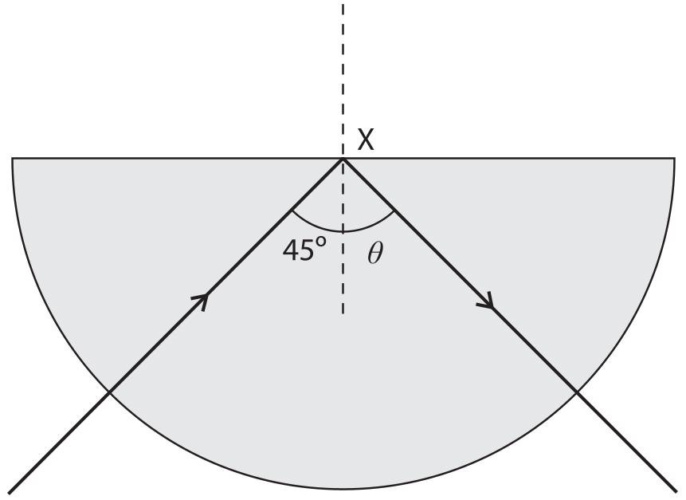

The dotted line is the normal to the surface at X.

When the light ray hits the surface as shown, all of it is reflected back inside.

(a) (i) Name the process shown in the diagram.

(ii) What is the angle labelled $ \theta $?

(b) The diagram shows another light ray entering a right-angled glass block.

It hits the inside surface at Y as shown.

Add to the diagram to complete the path of the ray.

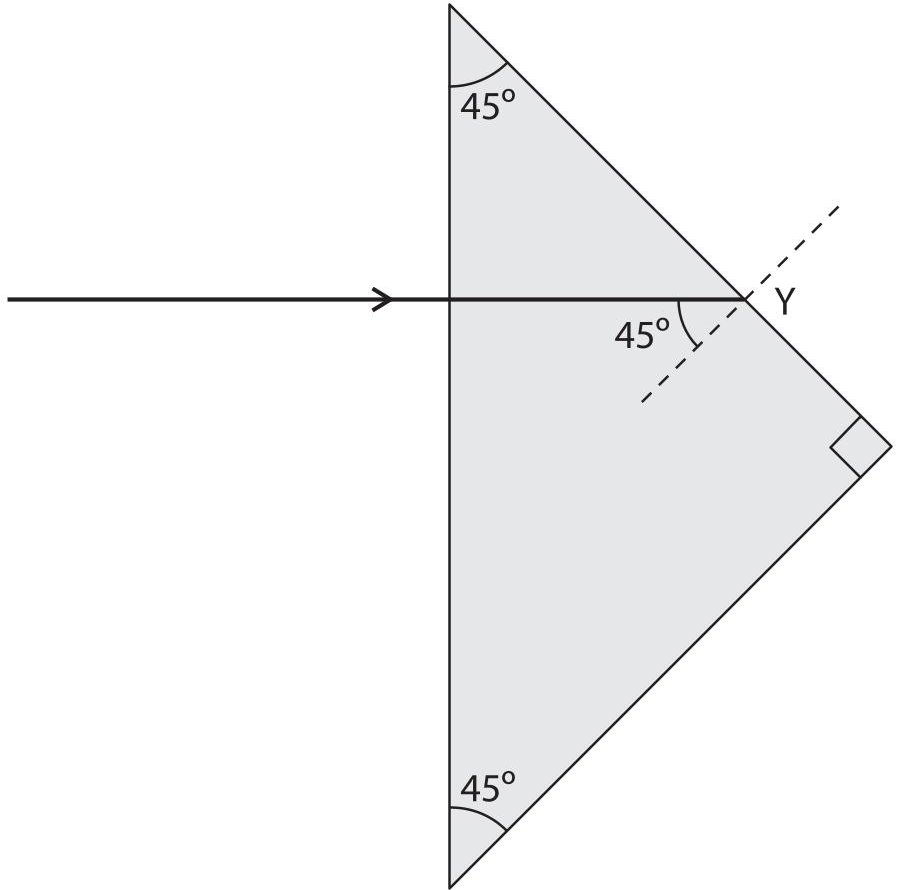

(Total for Question 2 = 6 marks)

3 A rabbit runs across the road in front of a car.

The driver applies the brakes.

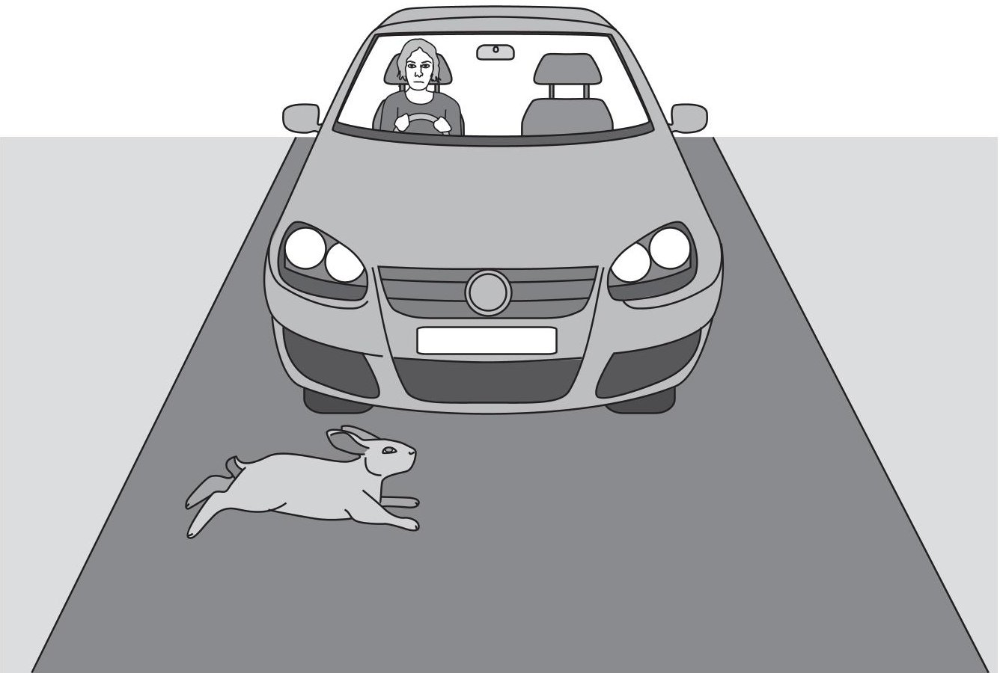

State four factors that affect the chance of the rabbit escaping without being hit.

(Total for Question 3 = 4 marks)

4 A student places a pile of coins on a table, as shown in photograph A.

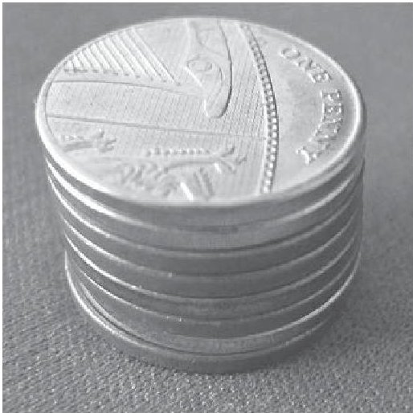

Photograph A

There are 8 coins in the pile.

The weight of each coin is 0.036 N.

The area of each coin is 0.0013 $ m^{2}. $

(a) (i) State the equation linking pressure, force and area.

(ii) Calculate the pressure on the table caused by the pile of coins.

Pressure = ... Pa

(b) The student then spreads the 8 coins out on the table as shown in photograph B.

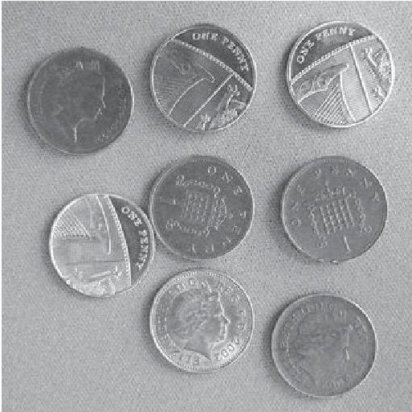

Photograph B

(i) Describe how this affects the total force from the coins on the table.

(ii) Explain how this affects the pressure on the table caused by the coins.

(Total for Question 4 = 7 marks)

5 Photograph C shows a student using an old camera that uses film.

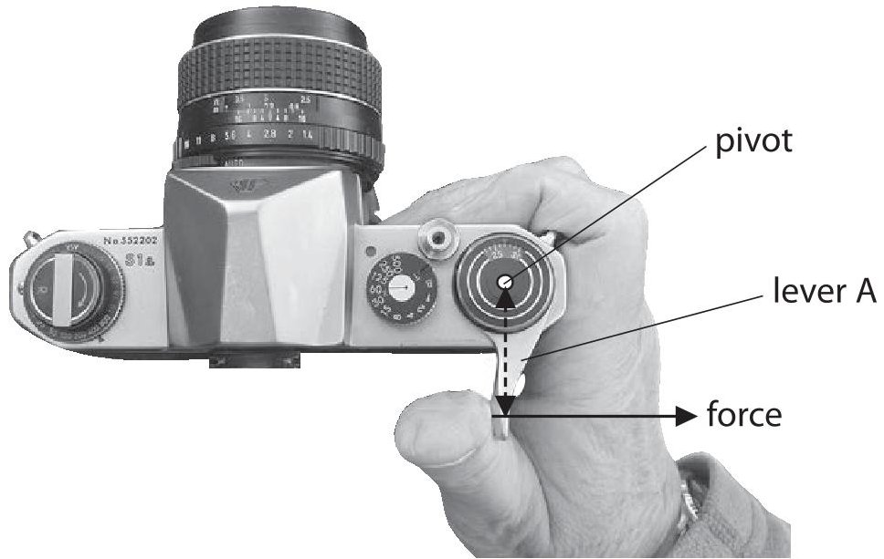

## Photograph C

(a) The film is pulled through the camera using lever A.

The student pushes on lever A with a force of 7.0 N.

The force is applied 0.04 m from the pivot.

(i) State the equation linking moment, force and distance.

(ii) Calculate the moment of the force that turns lever A and give the unit.

(b) When all the film has been used, it is pulled back through the camera using lever R.

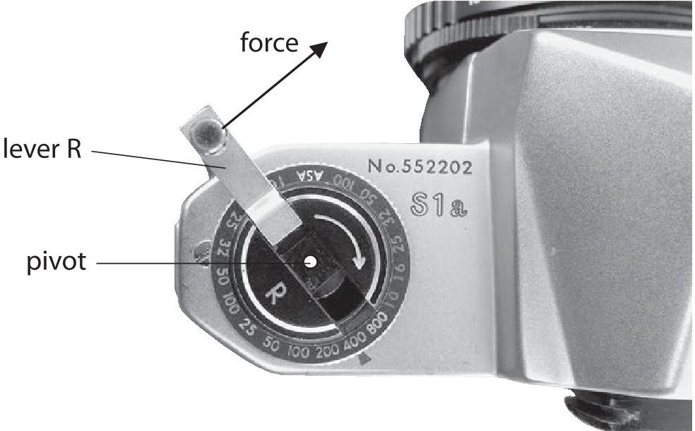

Photograph D

The force acting on lever R is only 0.02 m from its pivot.

Explain why the minimum force needed to turn lever R is likely to be more than 7 N.

(Total for Question 5 = 6 marks)

6 The London Eye is a large Ferris wheel.

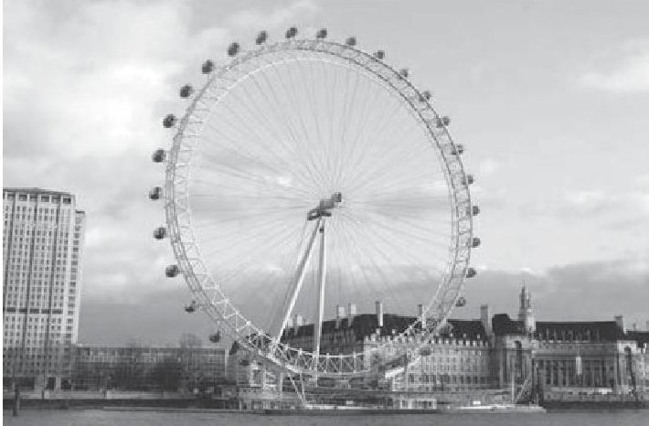

A student measures the diameter of the London Eye using two methods.

(a) Her first method is to walk across the shadow of the wheel and count her steps.

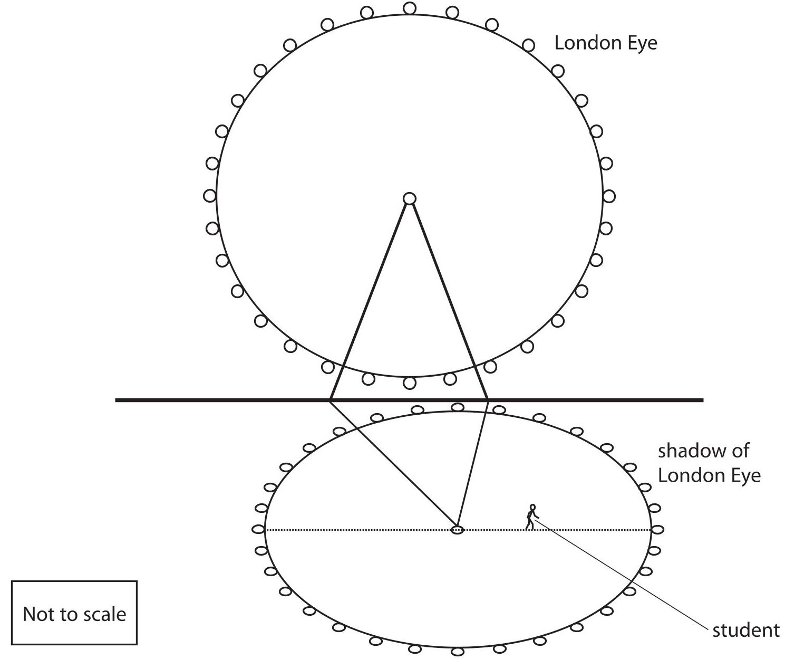

She counts 170 steps across the diameter of the wheel. She estimates that each of her steps is 0.74 m long.

(i) Calculate the diameter of the wheel using the student's data. Give your answer to the nearest metre.

Diameter = ... m

(ii) Suggest two reasons why this value may not be accurate.

(iii) Suggest one way that the student could improve this method to give a more accurate value.

(b) Her second method is to use an altimeter. The altimeter can measure height to the nearest 5 m.

The student goes for a ride on the London Eye. She notes her height above the ground every five minutes.

Her results are shown in the table.

<table border="1"><tr><td>Time in minutes</td><td>0</td><td>5</td><td>10</td><td>15</td><td>20</td><td>25</td><td>30</td></tr><tr><td>Height in m</td><td>0</td><td>30</td><td>90</td><td>120</td><td>90</td><td>30</td><td>0</td></tr></table>

(i) Use the grid to plot a graph of these results. Draw a curved line of best fit.

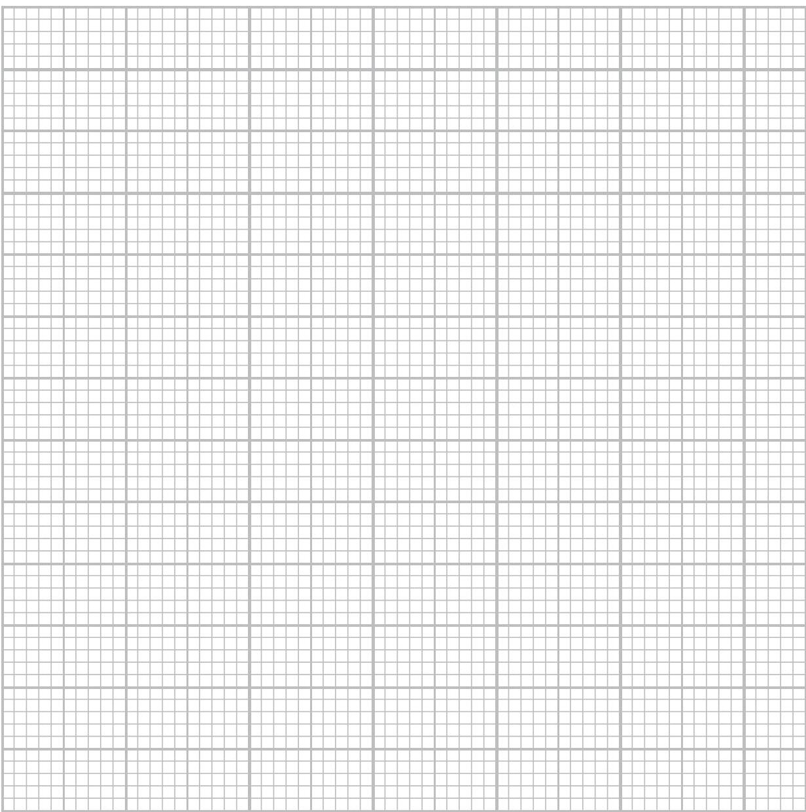

(ii) Use your graph to find the diameter of the wheel according to the altimeter readings. (1)

Diameter of the wheel according to the altimeter = ... m

(iii) The London Eye website gives the diameter of the wheel as 122 m.

Does the value for the diameter of the wheel from the student's altimeter readings agree with the website value?

Give a reason for your answer.

(Total for Question 6 =12 marks)

7 A student feels cold at night and decides to sleep under a thick woollen blanket.

(a) Explain how the woollen blanket helps to keep the student warm.

(b) The student says

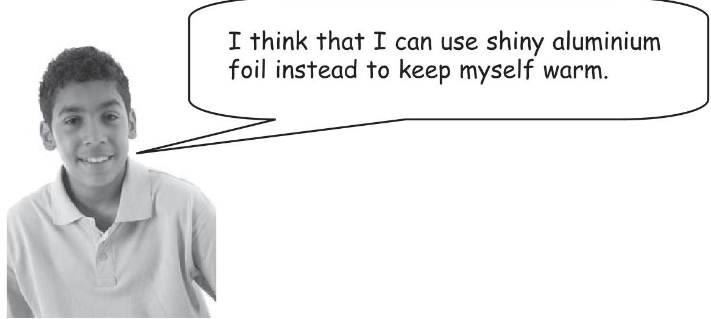

Do you agree with the student?

Explain why.

(Total for Question 7 = 5 marks)

8 Radon is a gas produced by some types of rocks.

(a) Radon is a natural source of radioactivity.

What is the name for this radioactivity?

A background radiation

B chain reaction

radioactive dating

radiotherapy

(b) There are two sources of alpha radiation in some houses:

- radon gas in the air

- solid americium in a smoke alarm

The alpha particles from radon are a greater risk to health than the alpha particles from americium.

Explain why.

(c) Radon-222 and radon-220 are both isotopes of radon.

(i) A nucleus of radon-222 has 86 protons.

How many protons are there in a nucleus of radon-220?

A 86

B less than 86

C more than 86

D none

(ii) A nucleus of radon-222 has 136 neutrons.

How many neutrons are there in a nucleus of radon-220?

A 86

B 134

C 136

D 220

(d) The graph shows how the activity of a sample of radon-220 changes with time.

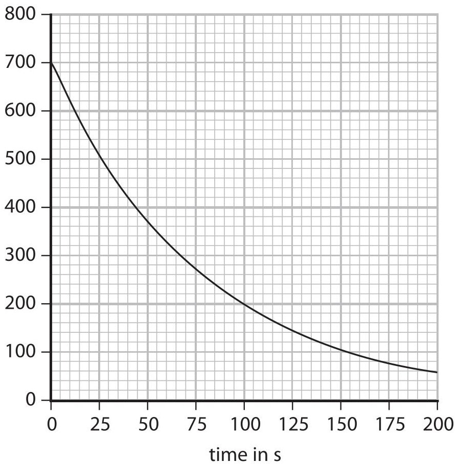

(i) Complete the graph by adding the missing unit for activity.

(ii) Explain what is meant by the term half-life.

(iii) Use the graph to find a value for the half-life of radon-220.

(Total for Question 8 = 10 marks)

9 This question is about sound waves.

(a) Sound waves are

A electromagnetic waves

B ionising radiation

C longitudinal waves

D transverse waves

(b) Describe an experiment to measure the speed of sound in air.

(5) 

(c) The speed of sound in air is different for different heights above sea level.

The graph shows how the speed of sound varies with height.

height above sea level in m

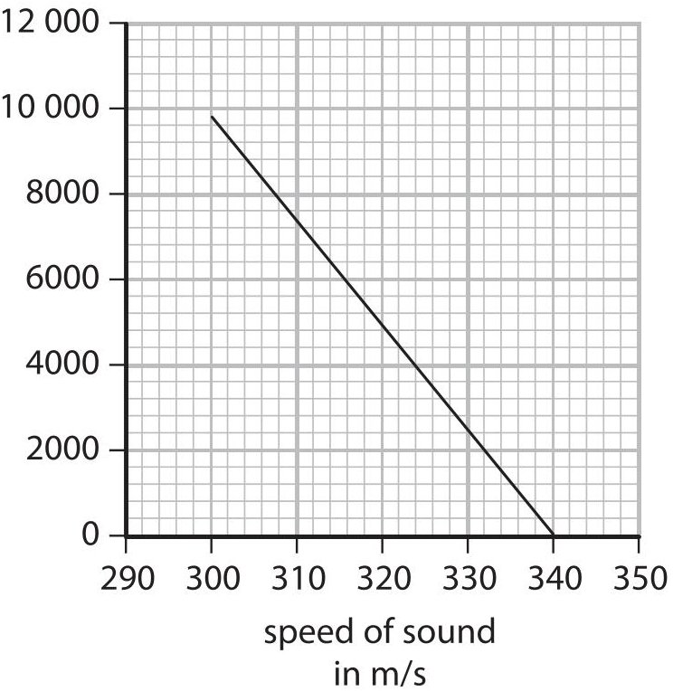

(i) Use the graph to estimate the speed of sound in air 6000 m above sea level.

Speed =

(ii) Describe the pattern shown by the graph.

(iii) Some aeroplanes can travel faster than the speed of sound.

When an aeroplane travels faster than the speed of sound it causes a shock wave. People on the ground hear this shock wave as a sonic boom.

A student says

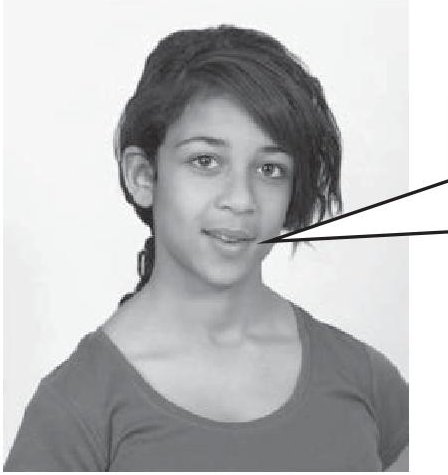

It is easier for an aeroplane to make a sonic boom when it travels higher up.

Do you agree with the student?

Explain why.

(Total for Question 9 = 11 marks)

10 A light dependent resistor (LDR) can be used as a sensor to detect light intensity. Describe how the resistance of an LDR varies as the light intensity changes. You may sketch a graph to help your answer.

(Total for Question 10 = 3 marks)

11 Photograph E shows a rechargeable torch.

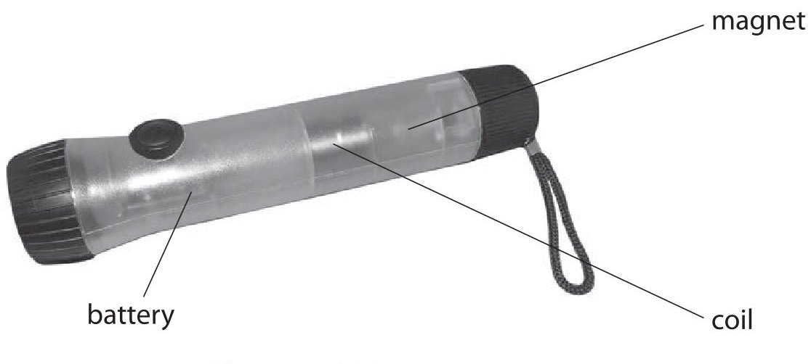

Photograph E

(a) When a student shakes the torch,the magnet moves through the coil and back again. This induces a voltage across the ends of the coil.

The voltage is used to provide current to recharge the battery.

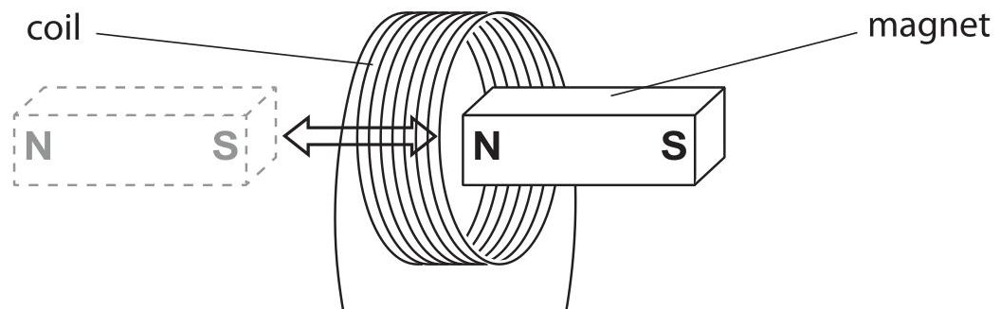

(i) Explain why a voltage is induced.

(2) 

(ii) State one way to increase this voltage.

(b) Photograph F shows the components inside the torch.

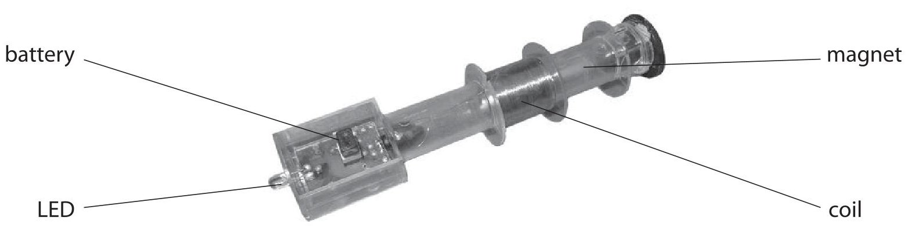

## Photograph F

The torch uses a light-emitting diode (LED) to provide light.

(i) When the LED is on, it shows that

A the current is alternating

B the torch is switched off

C there is a current in the circuit

D there is a fault in the circuit

(ii) The manufacturer of the torch states, "An LED is a more efficient source of light than a filament lamp."

Explain this statement in terms of energy transfer.

(Total for Question 11 = 6 marks)

12 The photograph shows equipment used for generating electricity from renewable sources.

wind turbine

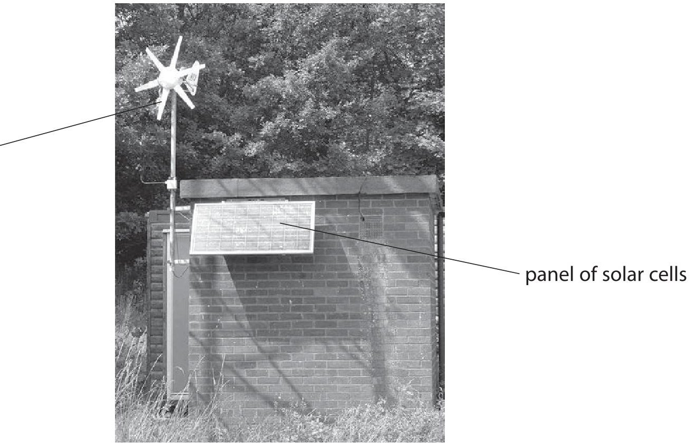

(a) Complete the sentences using words from the box.

<table border="1"><tr><td>chemical</td><td>heat</td><td>kinetic</td><td>light</td><td>sound</td></tr></table>

(i) The panel of solar cells transforms energy into electrical energy.

(ii) The wind turbine transforms energy into electrical energy.

(b) On a windy day, the wind turbine transfers 78 W of power.

(i) State the equation linking power, energy transferred and time.

(ii) Calculate the amount of energy the turbine transfers in 10 s.

(c) The Sankey diagram shows the energy transferred by the panel of solar cells.

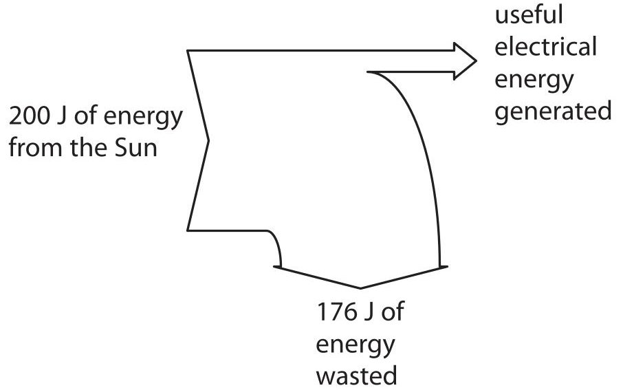

Show that the efficiency of the panel of solar cells is 12%.

13 The photograph shows a small aeroplane, of mass 600 kg.

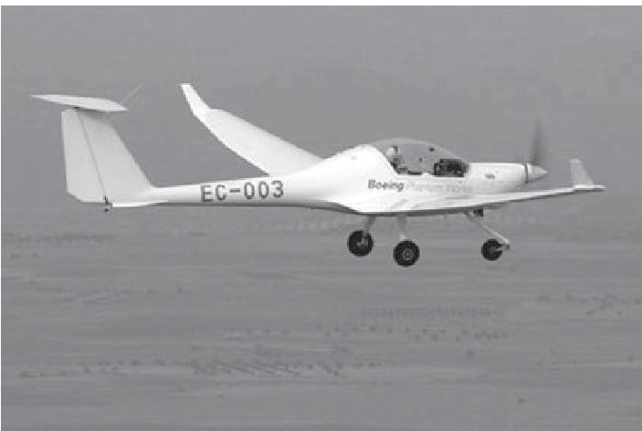

This aeroplane has an electric motor powered by fuel cells.

Fuel cells use hydrogen gas and provide an electric current.

(a) When the aeroplane is working,the energy changes are

A chemical $ \rightarrow $ electrical $ \rightarrow $ kinetic

B electrical -> chemical -> kinetic

C electrical -> kinetic -> chemical

D kinetic $ \to $ chemical $ \to $ electrical

(b) The velocity of the aeroplane is 28 m/s.

(i) State the equation linking kinetic energy, mass and velocity.

(ii) Calculate the kinetic energy of the aeroplane.

Kinetic energy = J

(c) The aeroplane takes off and climbs to a height of 1000 m.

(i) State the equation linking gravitational potential energy (GPE), mass, g and height.

(ii) Calculate the gravitational potential energy gained by the aeroplane.

GPE of the aeroplane = ... J

(iii) The fuel cells provide a maximum total power of 24 kW. The aeroplane also carries a large rechargeable battery.

Show, by calculation, that the aeroplane needs this extra source of power to climb to 1000 m in 3 minutes.

(iv) The aeroplane uses fuel cells connected together in series in a 'stack'.

The voltage of each fuel cell is 0.6 V. The maximum current in each fuel cell is 30 A.

Show that there must be more than 1300 fuel cells in the stack.

14 The diagram shows a can that produces whipped cream using gas at high pressure.

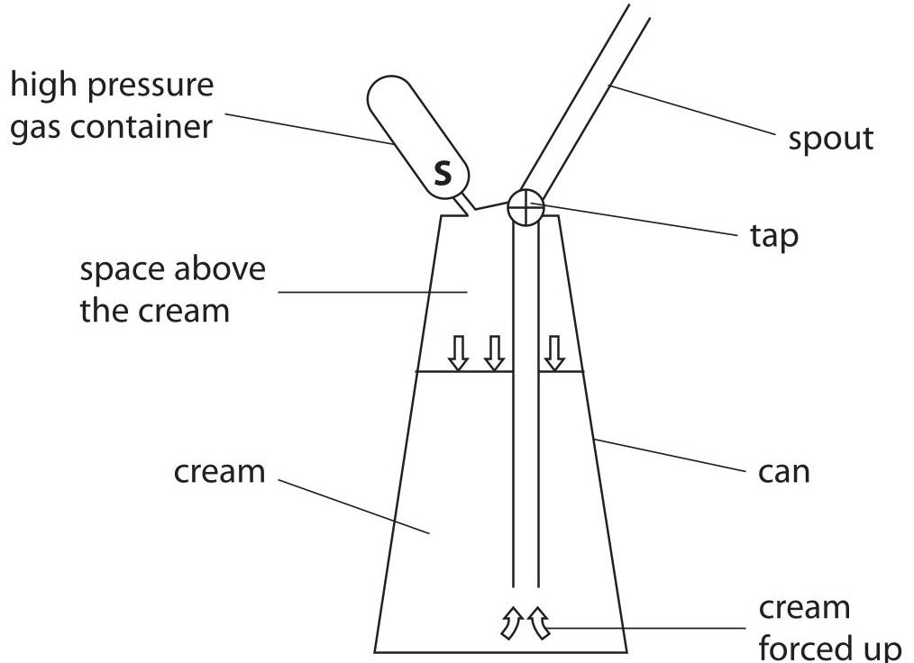

The volume of the high pressure gas container is $ 1 0 \mathrm{c m}^{3}. $

The pressure of the gas is 10000 kPa.

When the seal at S is broken, the gas is released into the space above the cream.

The gas expands to a total volume of $ 2 7 0 \mathrm{c m}^{3}. $

(a) Calculate the new pressure of the gas.

(b) As the gas expands into the space above the cream, its temperature decreases. Using ideas about molecules, explain how this affects the pressure of the gas.

(c) Some of the gas molecules dissolve into the cream.

(i) Suggest how this affects the pressure of the gas in the space above the cream.

(ii) When the tap is opened, the pressure of the gas forces the cream out of the spout. The pressure outside the can is less than it is inside. Suggest what happens to the dissolved gas as the cream leaves the can.

(Total for Question 14 = 8 marks)

15 (a) Parachutes are used to slow down a spacecraft as it falls through the atmosphere. Photograph G shows an Apollo spacecraft with three parachutes attached.

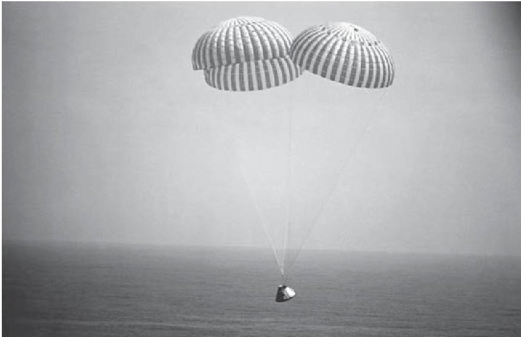

Photograph G

This spacecraft falls at a constant velocity.

(i) State the name of this constant velocity.

(ii) Explain why this velocity stays at a constant value.

(iii) Photograph H shows an identical Apollo spacecraft. Only two of its parachutes are working.

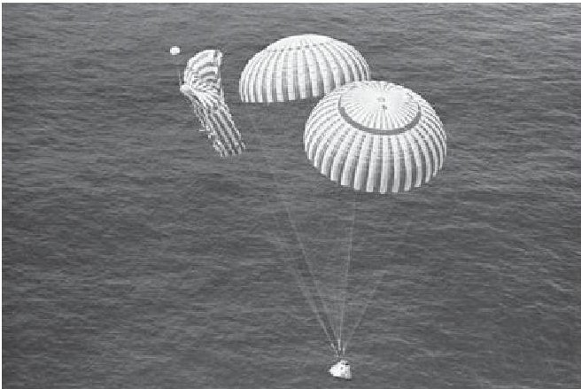

Photograph H

Explain how the constant velocity reached by this spacecraft compares with the constant velocity of the spacecraft shown in photograph G.

(b) Photograph I shows a Space Shuttle using a parachute when it lands on a runway.

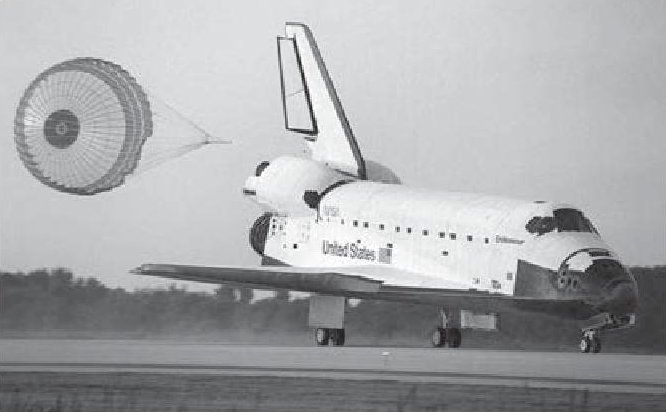

Photograph I

Explain what would happen to the stopping distance of the Shuttle if this parachute did not open. (2)

16 The diagram shows the driving force on a sports car as it moves along a race track.

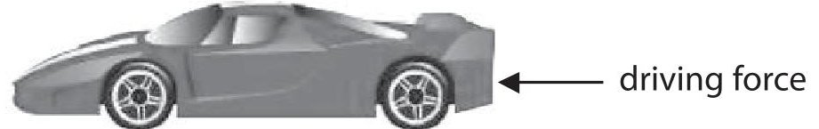

(a) Name two forces that oppose the driving force.

(b) The car has a mass of 1400 kg.

The acceleration of the car is 5.5 m/s $ ^{2} $

(i) State the equation linking force, mass and acceleration.

(ii) Calculate the force causing this acceleration.

Force = N

(c) Graph 1 shows how the velocity of the car changes with time.

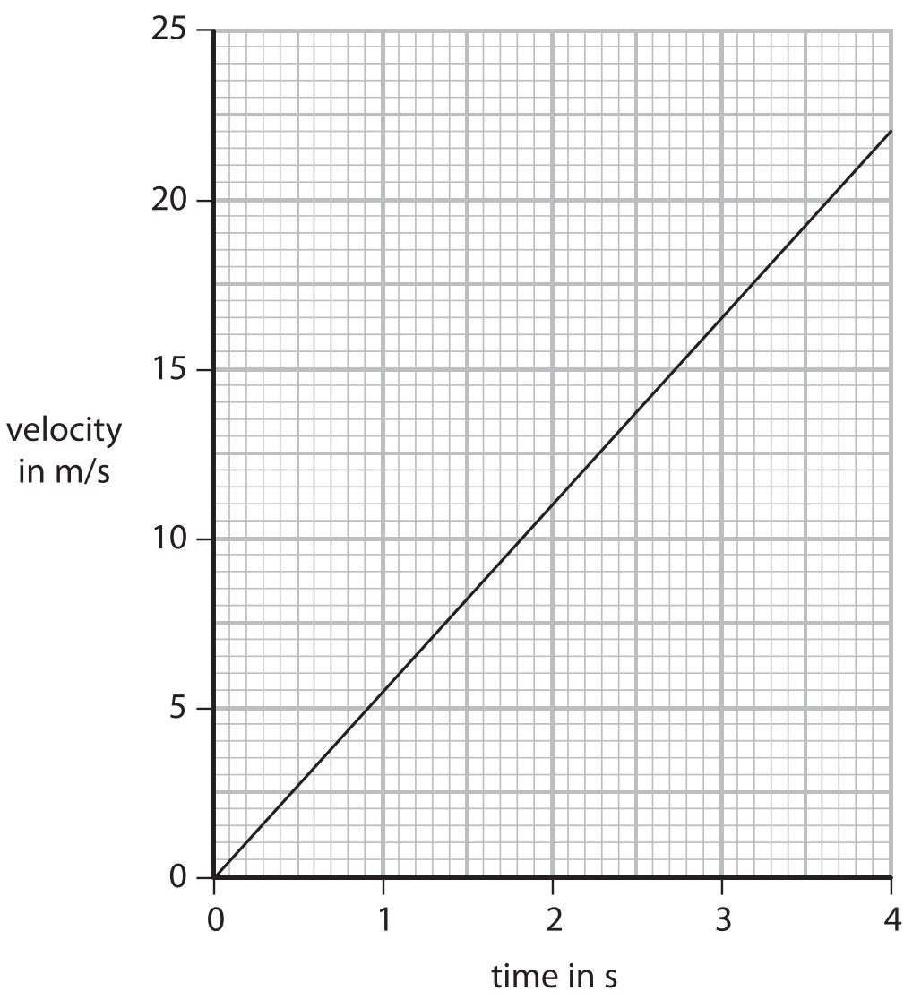

Graph 1

Calculate the distance that the car travels in the first four seconds.

QUESTION 16 CONTINUES ON THE NEXT PAGE

(d) As the car travels further along the track, its acceleration changes as shown in graph 2.

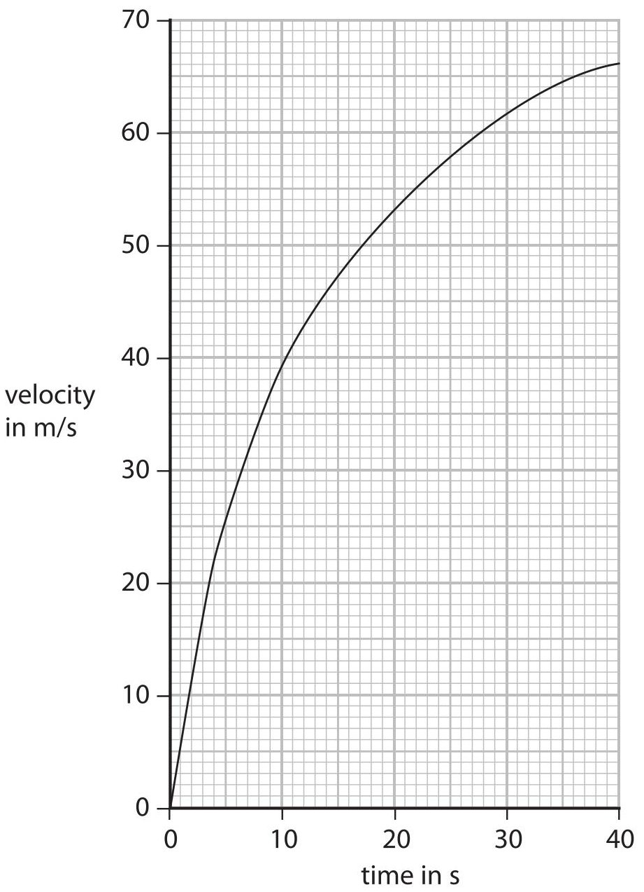

Graph 2

(i) Which feature of graph 2 shows that the acceleration changes?

(ii) The acceleration changes even though the driving force does not change. Suggest two possible reasons for this change in acceleration.

TOTAL FOR PAPER = 120 MARKS

