<table><tr><td colspan="3">Write your name here</td></tr><tr><td>Surname</td><td colspan="2">Other names</td></tr><tr><td>Edexcel International GCSE</td><td>Centre Number</td><td>Candidate Number</td></tr><tr><td colspan="3">Physics
Unit: 4PH0
Science (Double Award) 4SC0
Paper: 1PR</td></tr><tr><td colspan="2">Tuesday 14 May 2013 – Morning
Time: 2 hours</td><td>Paper Reference
4PH0/1PR
4SC0/1PR</td></tr><tr><td colspan="3">You must have:
Ruler, calculator</td></tr><tr><td colspan="3">Total Marks</td></tr></table>

## Instructions

- Use black ink or ball-point pen.

- Fill in the boxes at the top of this page with your name, centre number and candidate number.

- Answer all questions.

- Answer the questions in the spaces provided

- there may be more space than you need.

- Show all the steps in any calculations and state the units.

- Some questions must be answered with a cross in a box . If you change your mind about an answer, put a line through the box and then mark your new answer with a cross.

## Information

- The total mark for this paper is 120.

- The marks for each question are shown in brackets

- use this as a guide as to how much time to spend on each question.

## Advice

- Read each question carefully before you start to answer it.

- Keep an eye on the time.

- Write your answers neatly and in good English.

- Try to answer every question.

- Check your answers if you have time at the end.

## EQUATIONS

You may find the following equations useful.

$$
\mathrm {e n e r g y t r a n s f e r r e d} = \mathrm {c u r r e n t} \times \mathrm {v o l t a g e} \times \mathrm {t i m e}
$$

$$
E = I \times V \times t
$$

$$
\mathrm {p r e s s u r e} \times \mathrm {v o l u m e} = \mathrm {c o n s t a n t}
$$

$$
p _ {1} \times V _ {1} = p _ {2} \times V _ {2}
$$

$$
\mathrm {f r e q u e n c y} = \frac {1}{\mathrm {t i m e p e r i o d}}
$$

$$
f = \frac {1}{T}
$$

$$
\mathrm {p o w e r} = \frac {\mathrm {w o r k d o n e}}{\mathrm {t i m e t a k e n}}
$$

$$
P = \frac {W}{t}
$$

$$
\mathrm {p o w e r} = \frac {\mathrm {e n e r g y t r a n s f e r r e d}}{\mathrm {t i m e t a k e n}}
$$

$$
P = \frac {W}{t}
$$

$$
\mathrm {o r b i t a l s p e e d} = \frac {2 \pi \times \mathrm {o r b i t a l r a d i u s}}{\mathrm {t i m e p e r i o d}}
$$

$$
v = \frac {2 \times \pi \times r}{T}
$$

Where necessary, assume the acceleration of free fall, g = 10 m/s $ ^{2} $

## Answer ALL questions.

1 The diagram shows one of two $ 4 5^{\circ} $ prisms used in an optical instrument.

The second prism is not shown.

The path of a ray of light is partly shown.

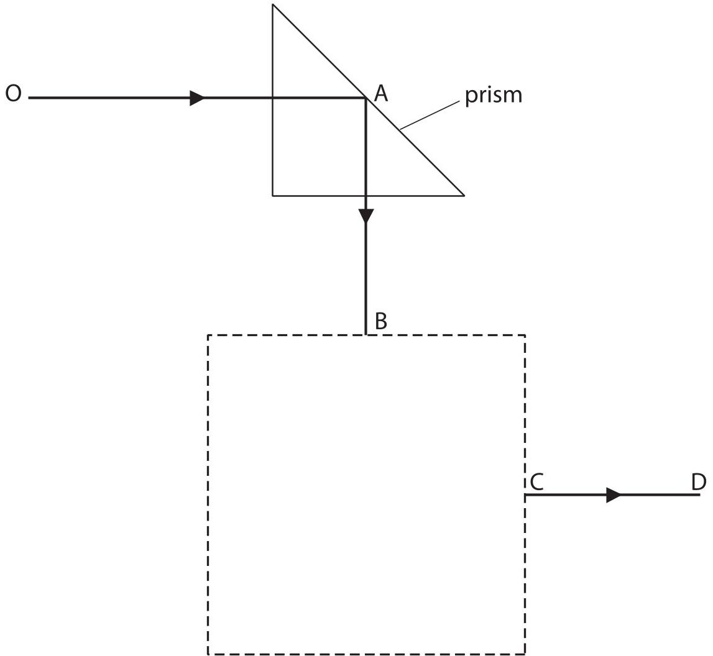

(a) What is the effect shown at point A?

(b) The ray of light exits from the second prism along the line CD.

(i) Draw the position of the second prism inside the dotted square.

(ii) Complete the path of the light through the second prism.

(Total for Question 1 = 3 marks)

2 The diagram shows a water wave.

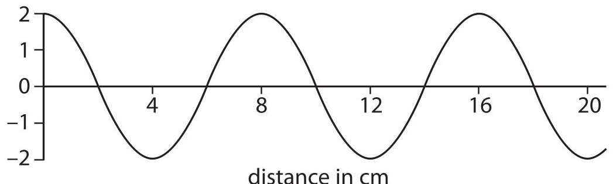

(a) (i) The amplitude of the wave is

A 1cm

B 2cm

C 4cm

D 8cm

(ii) The wavelength of the wave is

A 2 cm

B 4 cm

C 8 cm

D 20 cm

(b) Describe one difference between transverse and longitudinal waves.

Draw a labelled diagram to help your answer.

(c) State two properties that are the same for all electromagnetic waves.

(d) Some types of wave are used in hospitals.

(i) A scanner uses one type of wave to check for broken bones.

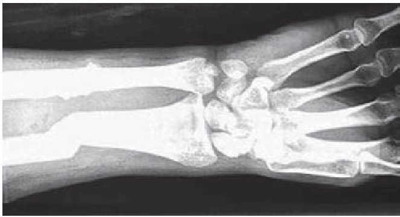

The type of wave emitted by the scanner is

A infrared

B microwaves

C sound

D X rays

(ii) An image of the bone is seen because the waves from the scanner are

A absorbed by the bone

B reflected by the bone

C refracted by the bone

D transmitted by the bone

(iii) Name one type of wave that is used in cancer treatment and explain what it does during the treatment.

Type of wave ...

Explanation of what it does.

(Total for Question 2 = 11 marks)

3 (a) Temperature can be measured using different scales. Complete the table by inserting the missing temperatures.

<table border="1"><tr><td>Temperature</td><td>Boiling point of liquid nitrogen</td><td>Boiling point of water</td></tr><tr><td>in ℃</td><td></td><td>100</td></tr><tr><td>in Kelvin</td><td>77</td><td></td></tr></table>

(b) Some students measure the volume of a sample of gas at different temperatures. The table below shows their results.

<table border="1"><tr><td>Temperature in℃</td><td>Volume in litres</td></tr><tr><td>-20</td><td>0.95</td></tr><tr><td>0</td><td>0.85</td></tr><tr><td>50</td><td>1.20</td></tr><tr><td>80</td><td>1.30</td></tr><tr><td>100</td><td>1.40</td></tr></table>

(i) Draw a graph to show how the volume of gas varies with temperature.

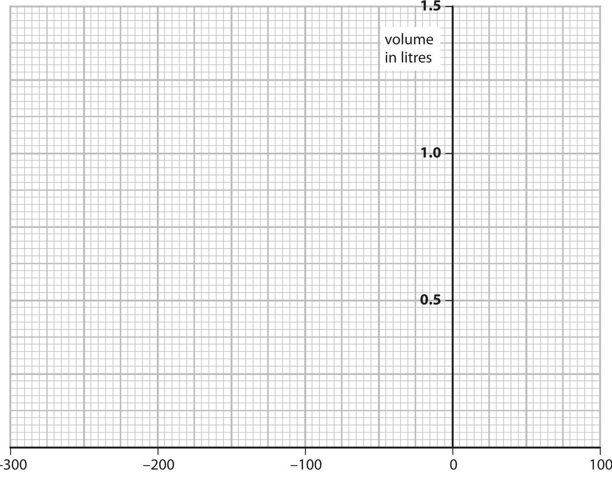

temperature in $ ^{\circ} \mathrm{C} $

(ii) Circle the anomalous point on your graph.

(iii) Use your graph to find the temperature of the gas when its volume is zero.

temperature = ... °C

4 The photograph shows a simple d.c. electric motor.

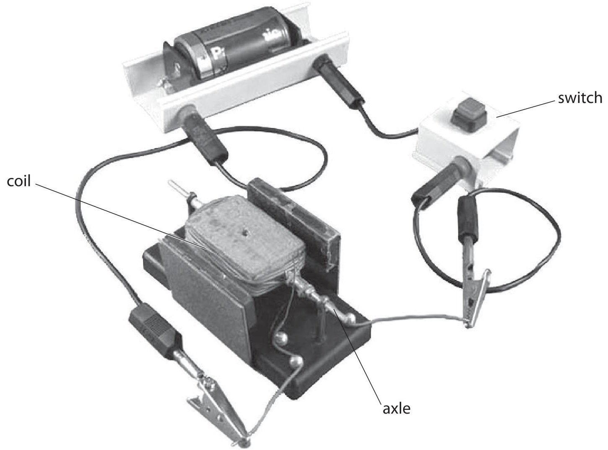

(a) When the switch is closed the coil spins. Explain why this happens.

(b) (i) Describe two ways to increase the speed of rotation of the coil in this motor.

(ii) Suggest how to make the coil spin in the opposite direction.

(c) In a different motor, the magnets are curved and there is a piece of iron inside the coil. The iron increases the strength of the magnetic field through the coil.

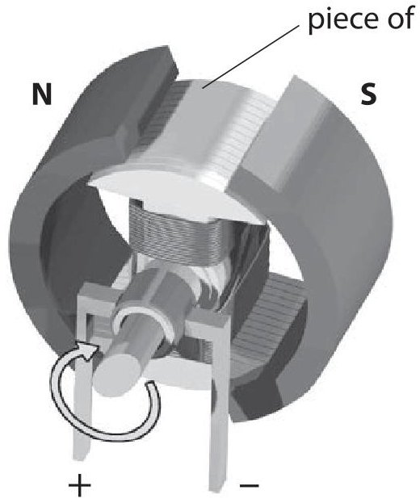

Suggest how the curved magnets and the piece of iron improve the performance of the electric motor.

(Total for Question 4 = 8 marks)

5 A student cycles to school.

The graph shows the stages A to G of the journey.

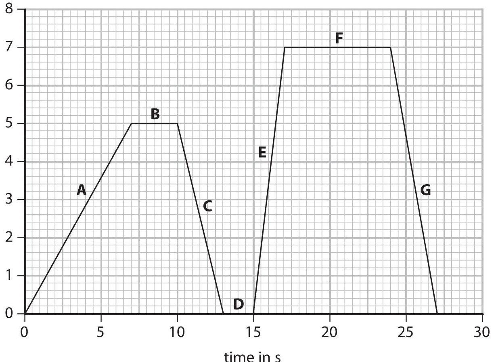

(a) Describe the motion of the student during stages B and D.

(2) 

<table border="1"><tr><td>Stage</td><td>Description</td></tr><tr><td>B</td><td></td></tr><tr><td>D</td><td></td></tr></table>

(b) State how the graph shows that the acceleration for stage E is greater than the acceleration for stage A.

(c) Calculate the distance that the student travels in the last 10 s of the journey.

(d) The total distance travelled is 106.5 m.

Show that the average speed of the journey is about 4 m/s.

(Total for Question 5 = 10 marks)

6 A spray-can contains gas particles that are constantly moving.

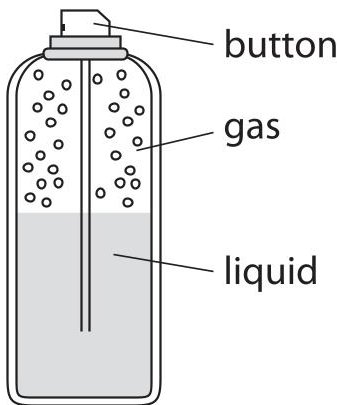

(a) (i) How do the gas particles produce a pressure on the walls of the spray-can?

(ii) A student presses the button and some liquid leaves the can. The student concludes

I think that the gas pressure in the spray-can decreases as the liquid leaves the can.

Evaluate this conclusion.

(3) 

(b) What happens to the average speed of the gas particles when the spray-can is warmed by the sun on a hot day?

(Total for Question 6 = 7 marks)

7 The LR5 is a specialist submarine for underwater rescues.

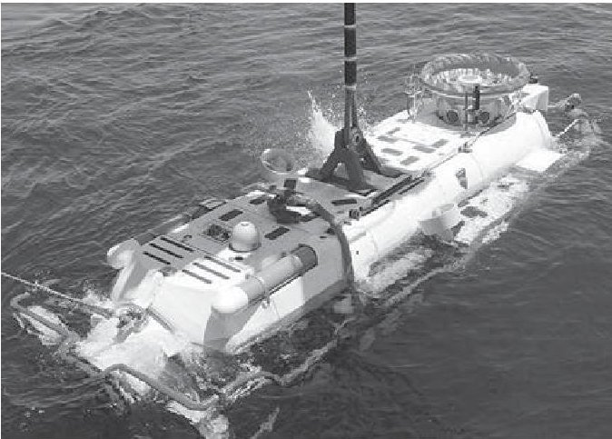

The average density of sea water is $ 1 0 2 8 \mathrm{k g / m^{3}}. $

(a) (i) State the equation linking pressure difference, depth, density and g.

(ii) Calculate the increase in pressure as the LR5 descends from the surface to a depth of 700 m.

$$
\mathrm {i n c r e a s e i n p r e s s u r e} =
$$

(iii) Atmospheric pressure is $ 1. 0 \times1 0^{5} \mathrm{P a}. $

Calculate the total pressure on the LR5 when it is at a depth of 700 m.

(b) On another descent, the LR5 experiences a total pressure of $ 4 1 \times1 0^{5} $ Pa.

The entrance to the LR5 is through an access door which has an area of $ 3. 1 \mathrm{~ m}^{2}. $

(i) State the equation linking pressure, force and area.

(ii) Calculate the force on the outside of the door.

$$
\mathrm {f o r c e} =
$$

(c) The LR5 is tested in fresh water.

The density of fresh water is $ 1 0 0 0 \mathrm{k g / m^{3}}. $

Explain why the pressure on the submarine in the fresh water is less than the pressure in sea at the same depth.

(d) A student is given a sample of liquid labelled sea water.

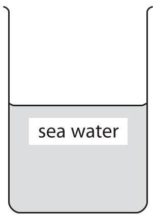

Describe an experiment that the student could carry out to find the density of the sample.

(Total for Question 7 = 14 marks)

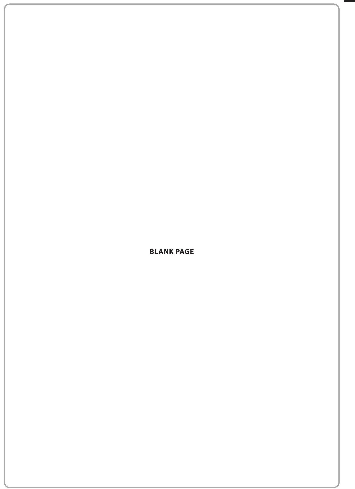

8 A student investigates the extension of a rubber band when masses are added.

(a) Tick the boxes to select the correct items of apparatus that the student would need in order to complete this investigation.

Two items have already been selected.

<table border="1"><tr><td>Item</td><td>Tick(√)if item needed</td></tr><tr><td>ammeter</td><td></td></tr><tr><td>steel spring</td><td></td></tr><tr><td>retort stand and clamp</td><td></td></tr><tr><td>rubber band</td><td>√</td></tr><tr><td>ruler</td><td></td></tr><tr><td>thermometer</td><td></td></tr><tr><td>mass hanger</td><td></td></tr><tr><td>masses</td><td>√</td></tr></table>

(b) The table below shows the student's results.

<table border="1"><tr><td>Mass in g</td><td>Force in N</td><td>Extension in cm</td></tr><tr><td>0</td><td>0</td><td>0.0</td></tr><tr><td>150</td><td>1.5</td><td>2.4</td></tr><tr><td>350</td><td>3.5</td><td>6.3</td></tr><tr><td>550</td><td></td><td>12.8</td></tr><tr><td>750</td><td>7.5</td><td>18.6</td></tr><tr><td>1050</td><td>10.5</td><td>24.0</td></tr></table>

(i) Complete the table by inserting the missing force.

(ii) Plot a graph to show how force varies with extension.

(iii) Use the information from the graph to explain whether the rubber band obeys Hooke's Law.

(Total for Question 8 = 10 marks)

9 The diagram shows some lamps connected together.

There are 20 small lamps connected in series with a 9 V supply.

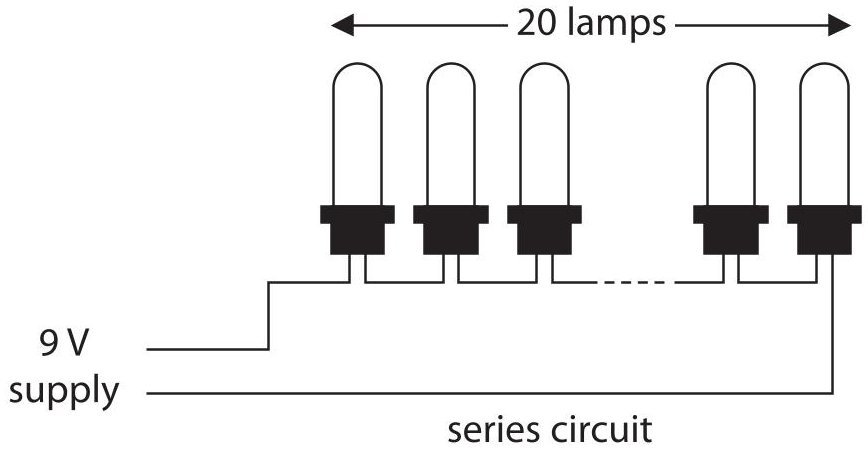

(a) (i) What is the voltage across each lamp in the series circuit?

(ii) Each lamp has a power of 1.5 W.

State the equation linking power, current and voltage.

(iii) Show that the current in the circuit is about 3 A.

(b) (i) The lamps are on for 7 hours a day for 5 days.

Calculate the total energy transferred during this time.

## energy transferred=

(ii) Describe the energy changes that take place in the lamps when they are connected to the power supply.

(Total for Question 9 = 9 marks)

10 A student investigates how the resistance of a piece of wire changes with voltage across the wire.

The student connects an ammeter, a voltmeter, a battery, a variable resistor and the wire in an electrical circuit.

(a) (i) Complete the diagram to show how the student should connect the circuit.

piece of wire

(ii) Describe what she should do to obtain a set of results for her investigation.

(b) The student keeps the temperature of the wire constant during the investigation.

(i) Suggest why she does this.

(ii) Suggest how she does this.

(c) When the student looks at her results, she notices that the voltage across the wire is directly proportional to the current in it.

(i) State the relationship linking voltage, current and resistance.

(ii) The student calculates the resistance and then plots a graph of resistance against voltage.

On the axes, sketch the shape of her graph.

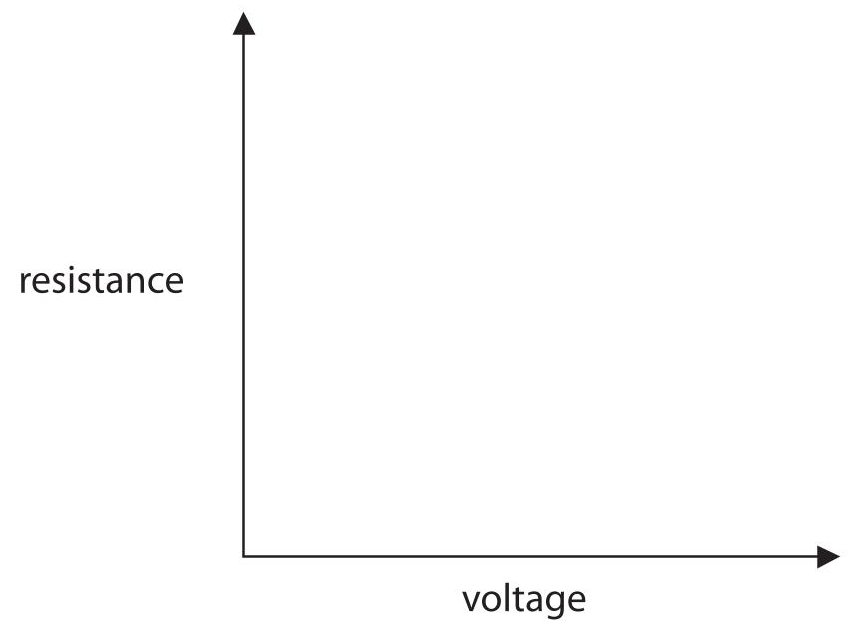

(Total for Question 10 = 10 marks)

11 A ball has a mass of 0.25 kg.

A student holds the ball 1.75 m above the ground.

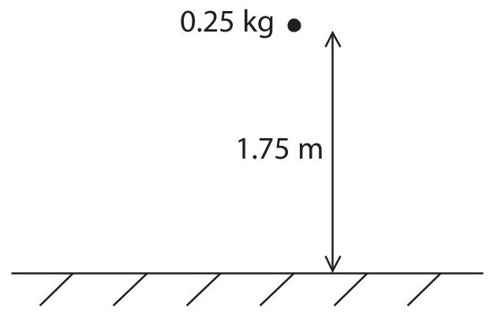

(a) (i) State the equation linking gravitational potential energy (GPE), mass, g and height.

(ii) Calculate the gravitational potential energy of the ball.

$$
G P E =
$$

(b) The student lets the ball fall.

State the value of the kinetic energy (KE) of the ball just before it hits the ground.

Assume that there is no air resistance.

(c) Another ball with the same mass has a kinetic energy of 3.1 J.

(i) State the equation linking kinetic energy, mass and speed.

(ii) Calculate the speed of the ball.

12 The diagram shows the main parts of a nuclear reactor. In the nuclear reactor uranium-235 nuclei undergo fission in a controlled chain reaction.

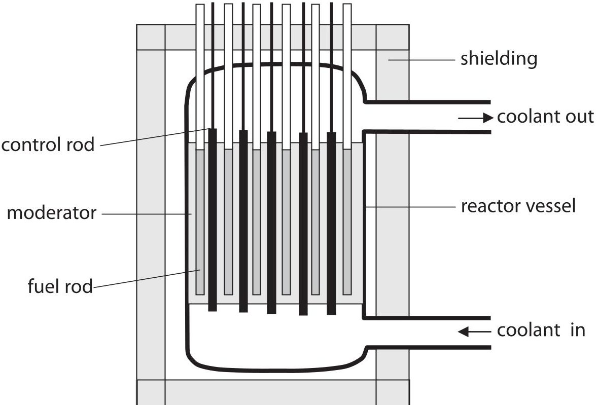

(a) Describe nuclear fission and how the chain reaction is controlled. Use terms from the diagram to help you.

(b) State the form of energy that is released during fission.

(c) How does the shielding improve safety?

(Total for Question 12 = 7 marks)

13 The diagram shows a magnet held above a coil. The coil is connected to a voltmeter.

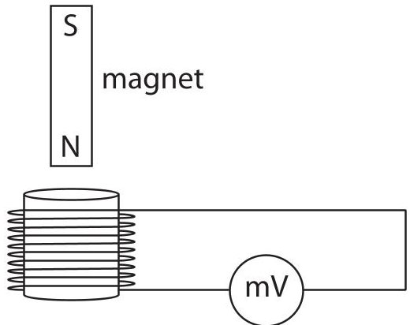

(a) The magnet is released and falls into the coil.

(i) Explain why the voltmeter shows a reading.

(ii) The magnet is released from a greater height.

How does this affect the voltmeter?

Explain your answer.

(b) State how the voltmeter reading changes when the same magnet

(i) moves more slowly into the coil

(ii) moves into a coil with more turns

(iii) is reversed so that the S-pole enters the coil first.

(Total for Question 13 = 7 marks)

14 The grid shows the number of neutrons and the number of protons in some isotopes formed during successive radioactive decays.

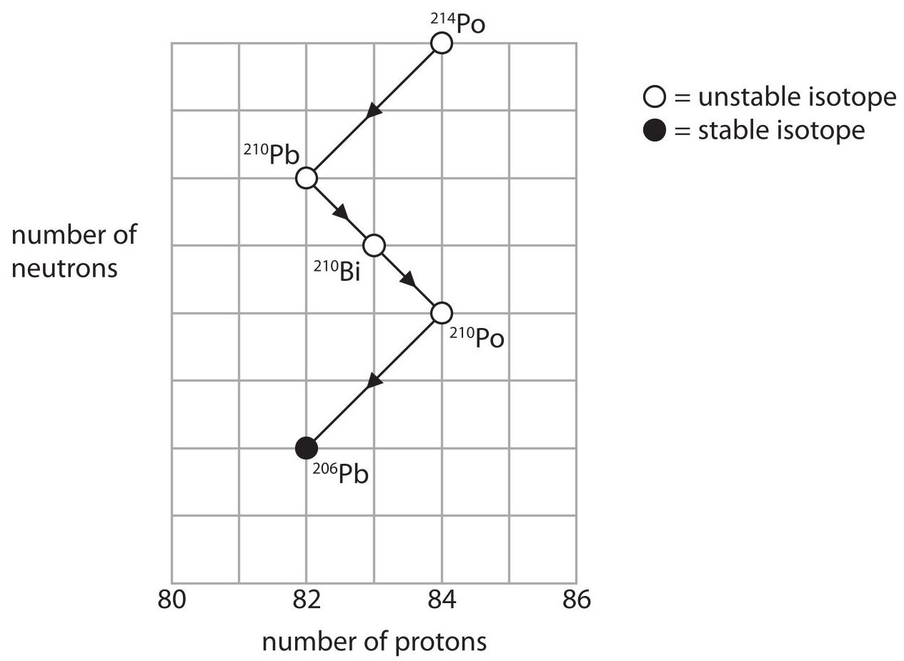

(a) (i) What are isotopes?

(2) 

(ii) Why are some isotopes described as stable?

(1) 

(b) (i) Use the grid to calculate the number of neutrons in a $ ^{210} \mathrm{P o} $nucleus.

## number of neutrons=

(ii) Describe what happens to the number of protons and the number of neutrons when a nucleus of $ ^{210} \mathrm{P b} $ decays to form $ ^{210} \mathrm{B i}. $

(iii) State the type of decay that occurs when $ ^{210} \mathrm{Pb} $ decays to form $ ^{210} \mathrm{Bi}. $

(c) Explain why the mass (nucleon) number and the atomic (proton) number do not change when a gamma ray is emitted from a nucleus.

(Total for Question 14 = 9 marks)

TOTAL FOR PAPER=120 MARKS

## BLANK PAGE

