<table><tr><td colspan="3">Write your name here</td></tr><tr><td>Surname</td><td colspan="2">Other names</td></tr><tr><td>Edexcel Certificate</td><td>Centre Number</td><td>Candidate Number</td></tr><tr><td>Edexcel International GCSE</td><td></td><td></td></tr><tr><td colspan="3">Physics
Unit: KPH0/4PH0
Science (Double Award) KSC0/4SC0
Paper: 1P</td></tr><tr><td colspan="2">Tuesday 14 May 2013 – Morning
Time: 2 hours</td><td>Paper Reference
KPH0/1P 4PH0/1P
KSC0/1P 4SC0/1P</td></tr><tr><td colspan="3">You must have:
Ruler, calculator</td></tr><tr><td colspan="3">Total Marks</td></tr></table>

## Instructions

- Use black ink or ball-point pen.

- Fill in the boxes at the top of this page with your name, centre number and candidate number.

- Answer all questions.

- Answer the questions in the spaces provided

- there may be more space than you need.

- Show all the steps in any calculations and state the units.

- Some questions must be answered with a cross in a box . If you change your mind about an answer, put a line through the box and then mark your new answer with a cross.

## Information

- The total mark for this paper is 120.

- The marks for each question are shown in brackets

## Advice

- Read each question carefully before you start to answer it.

- use this as a guide as to how much time to spend on each question.

- Keep an eye on the time.

- Write your answers neatly and in good English.

- Try to answer every question.

- Check your answers if you have time at the end.

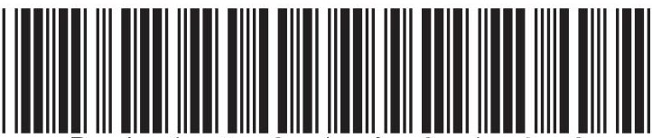

## EQUATIONS

You may find the following equations useful.

$$
\mathrm {e n e r g y t r a n s f e r r e d} = \mathrm {c u r r e n t} \times \mathrm {v o l t a g e} \times \mathrm {t i m e}
$$

$$
E = I \times V \times t
$$

$$
\mathrm {p r e s s u r e} \times \mathrm {v o l u m e} = \mathrm {c o n s t a n t}
$$

$$
p _ {1} \times V _ {1} = p _ {2} \times V _ {2}
$$

$$
\mathrm {f r e q u e n c y} = \frac {1}{\mathrm {t i m e p e r i o d}}
$$

$$
f = \frac {1}{T}
$$

$$
\mathrm {p o w e r} = \frac {\mathrm {w o r k d o n e}}{\mathrm {t i m e t a k e n}}
$$

$$
P = \frac {W}{t}
$$

$$
\mathrm {p o w e r} = \frac {\mathrm {e n e r g y t r a n s f e r r e d}}{\mathrm {t i m e t a k e n}}
$$

$$
P = \frac {W}{t}
$$

$$
\mathrm {o r b i t a l s p e e d} = \frac {2 \pi \times \mathrm {o r b i t a l r a d i u s}}{\mathrm {t i m e p e r i o d}}
$$

$$
v = \frac {2 \times \pi \times r}{T}
$$

Where necessary, assume the acceleration of free fall, $ g=1 0 \mathrm{~ m} / \mathrm{s}^{2}. $

## Answer ALL questions.

1 (a) Some units can be written in different ways.

(i) A power of 1 watt is the same as

A 1 joule per coulomb (1 J/C)

B 1 joule per second (1 J/s)

C 1 newton per square metre (1 N/m $ ^{2} $)

D 1 newton per kilogram (1 N/kg)

(ii) A pressure of 1 pascal is the same as

A 1 joule per coulomb (1 J/C)

C 1 newton per square metre (1 N/m $ ^{2} $)

D 1 newton per kilogram (1 N/kg)

(b) Magnetic fields can be indicated using lines.

(i) The arrow on a magnetic field line shows

A the direction of a magnetic field

B the electrostatic attraction

C the presence of an electric current

D the strength of a magnetic field

(ii) Equal spaces between magnetic field lines show that the magnetic field

A has uniform strength

B goes from a S-pole to a N-pole

C must be caused by a current

D must be caused by a bar magnet

(Total for Question 1 = 4 marks)

2 The Earth receives different types of electromagnetic wave from the Sun.

These include

- infrared

- ultraviolet

- visible light

(a) Complete the table by arranging these three types of electromagnetic wave in order of decreasing wavelength.

<table border="1"><tr><td>longest wavelength</td><td>→</td><td>shortest wavelength</td></tr><tr><td></td><td></td><td></td></tr></table>

(b) Name two other types of electromagnetic wave.

(c) Ultraviolet waves are useful, but they can be dangerous.

(i) State two uses of ultraviolet waves.

(ii) State two dangers of ultraviolet waves.

(Total for Question 2 = 7 marks)

3 The diagram shows a piece of card and two wide bar magnets.

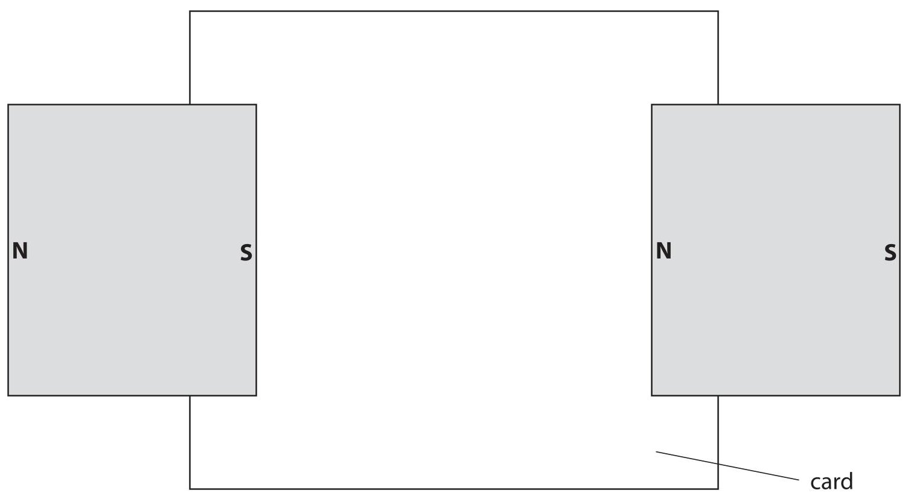

(a) (i) Add to the diagram to show the shape and direction of the magnetic field pattern between the magnets.

(ii) Describe how to investigate the shape and direction of the magnetic field between the magnets.

(b) A metal rod, X Y, is placed in a magnetic field as shown.

Wires from a cell are connected to the ends of the rod so that there is a current from X to Y.

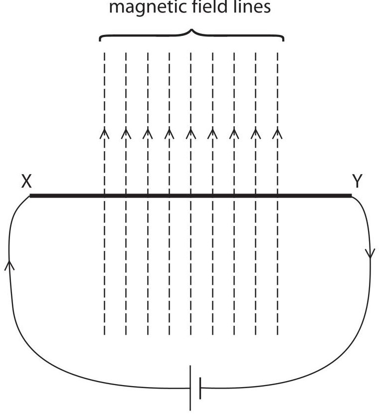

Describe the effect on the rod.

(2) 

(Total for Question 3 = 8 marks)

4 The object shown in the photograph is an old, brass mass. It is marked 500 g.

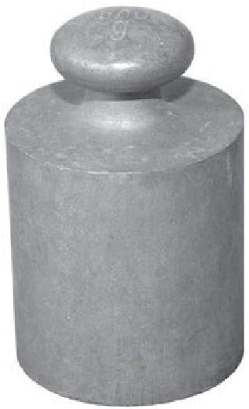

(a) A student puts the mass on an electronic balance.

The electronic balance reading is 498.2 g.

The student concludes:

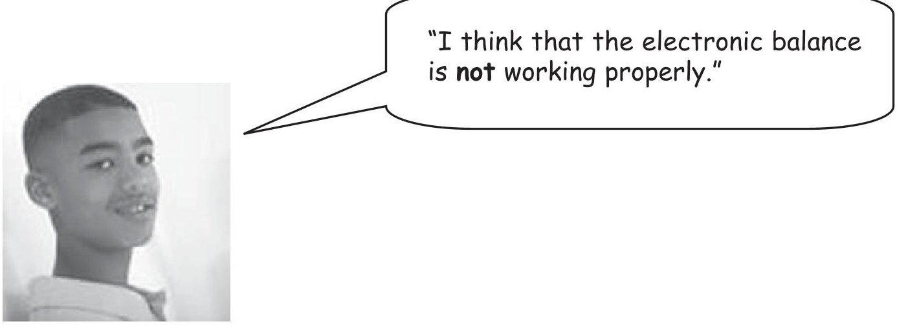

Evaluate this conclusion.

(b) The student wants to find the density of the old, brass mass. First he obtains a correct value for the mass. What else must he do to find the density?

(Total for Question 4 = 5 marks)

5 A racing cyclist practises by riding around a track.

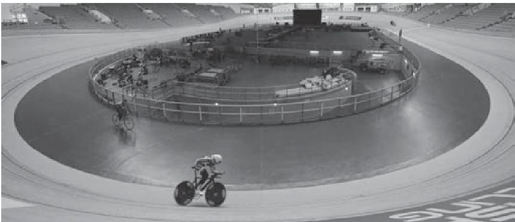

A student wants to find the average speed of the cyclist.

Describe a method that the student could use to find the average speed.

6 This question is about the Solar System.

(a) The object at the centre of our Solar System is

A a comet

B the Earth

C the Moon

D the Sun

(b) Earth and Mars are planets in our Solar System.

The table shows some data for these planets.

<table border="1"><tr><td>planet</td><td>radius of orbit in km</td><td>time of orbit in days</td></tr><tr><td>Earth</td><td>150000000</td><td>365</td></tr><tr><td>Mars</td><td>250000000</td><td>690</td></tr></table>

(i) Calculate the orbital speed of Mars in km/day.

(ii) The distance between Earth and Mars varies between 100 million km and 400 million km.

Explain why this distance is not constant.

You may draw a diagram to help your answer.

(c) Visible light from Mars reaches the Earth.

The speed of light is 300 000 km/s.

(i) Show that when the planets are 170 000 000 km apart, it takes about 600 s for light to travel this distance.

(ii) Scientists land a remote-controlled vehicle on Mars.

The vehicle sends images back to Earth showing its surroundings on Mars.

Sometimes these images show rocks ahead that could damage the vehicle.

A scientist on Earth sends radio signals that control this vehicle.

The speed of the vehicle is limited to 0.04 m/s.

Suggest why the speed is kept low.

(Total for Question 6 = 10 marks)

## BLANK PAGE

7 A student investigates how the resistance of a thermistor varies with temperature.

(a) Draw the circuit symbol for a thermistor.

(b) The student uses voltmeter and ammeter readings to find the resistance at each temperature.

One set of readings is shown below.

<table border="1"><tr><td>temperature in℃</td><td>voltmeter reading inV</td><td>ammeter reading inmA</td></tr><tr><td>80</td><td>13.2</td><td>2.60</td></tr></table>

(i) State the equation linking voltage, current and resistance.

(ii) Show that the resistance of the thermistor at $ 8 0 \, \mathrm{^ {\circ} C} $ is about 5000 $ \Omega. $

(c) Another student takes measurements for two more components, A and B. The graphs show the results.

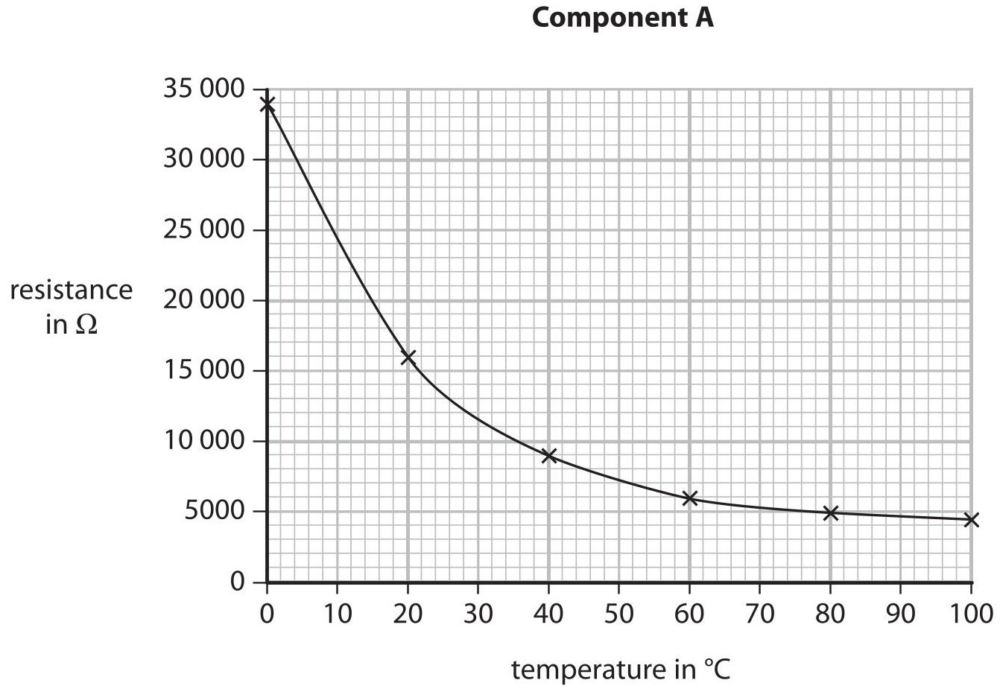

Component B

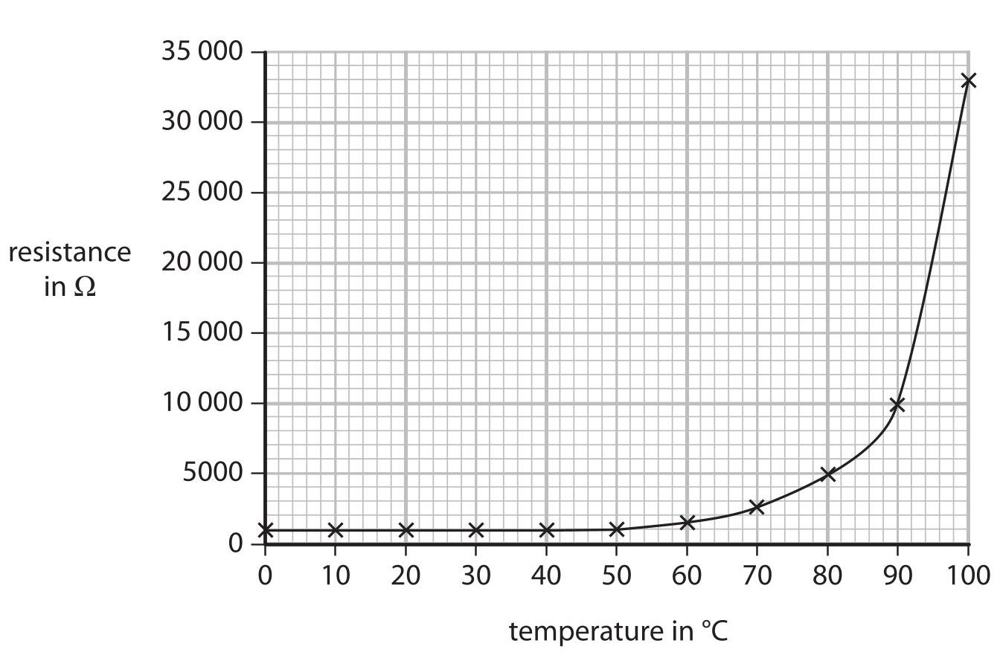

Compare the results for component A and component B.

(Total for Question 7 = 10 marks)

8 A car pulls a caravan along a horizontal road.

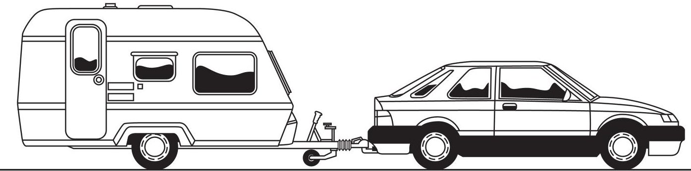

(a) The car pulls the caravan with a resultant force of 170 N for a distance of 110 m.

(i) State the equation linking work done, force and distance.

(ii) Calculate the work done by the car on the caravan.

(iii) State how much energy is transferred to the caravan.

energy transferred=

(b) The mass of the car is 1650 kg.

The mass of the caravan is 950 kg.

(i) State the equation linking kinetic energy, mass and velocity.

(ii) Calculate the total kinetic energy when the car and caravan travel together at a constant speed of 23 m/s.

## total kinetic energy =

(c) The caravan is removed and the car makes the return journey without it.

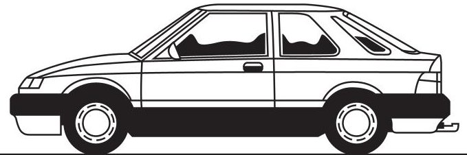

Without the caravan, the car has greater acceleration and uses less fuel. Explain these changes.

(Total for Question 8 = 11 marks)

9 A student plans to measure the thickness of a sheet of paper with a ruler.

(a) Explain why it is difficult to measure the thickness of a single piece of paper with a ruler.

(b) The student puts a pile of 400 sheets of paper on a table. He uses a ruler to measure the height of the pile.

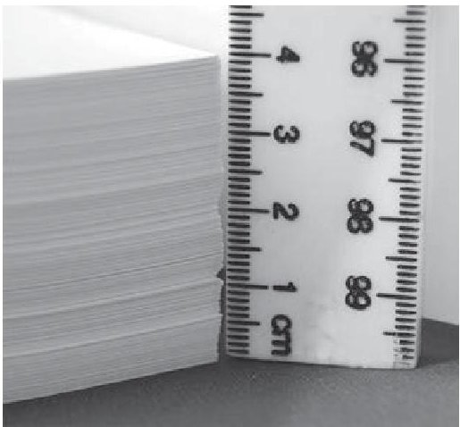

The student records the thickness of the pile as 4.1 cm.

(i) This means that the thickness of one piece of paper is about

A 1cm

B 1mm

C 0.1mm

D 0.01mm

(ii) Suggest two reasons why the student's value for the thickness of the pile may be inaccurate.

(c) The student folds the sheet of paper to make a paper aeroplane.

He throws the paper aeroplane into the air and it flies at a constant velocity.

(i) Explain why the forces on the paper aeroplane must be balanced.

(ii) The diagram shows the paper aeroplane as it moves at a constant velocity towards the right and slightly downwards.

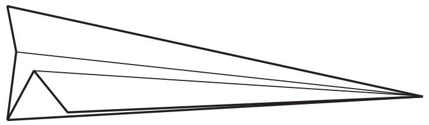

Add labelled arrows to the diagram to show the directions of the forces of

- weight

- lift

- drag

(iii) As it flies, the paper aeroplane loses gravitational potential energy. What happens to this energy?

(Total for Question 9 = 11 marks)

10 An aeroplane takes two minutes to travel the short distance between airports on two islands.

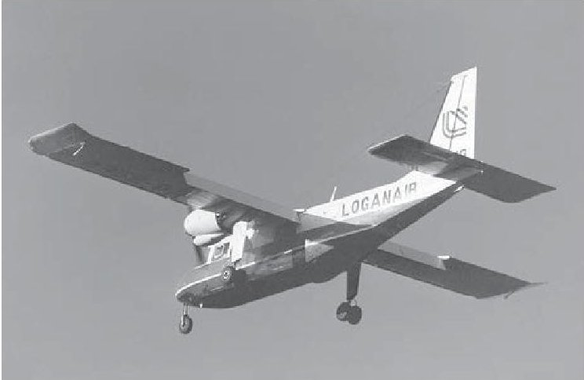

The graph shows how the speed of the aeroplane changes as it

- takes off

- flies across the sea

- lands on the other island

When it is flying across the sea, the aeroplane travels at a constant speed.

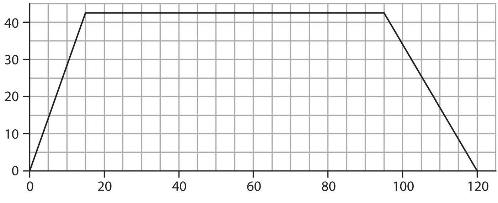

time in s

(a) Use the graph to answer the following questions.

(i) State the value of the constant speed.

(ii) Calculate the acceleration of the aeroplane at the start of the journey and give the unit.

$$
\mathrm {a c c e l e r a t i o n} =
$$

(iii) Calculate the total distance that the aeroplane travels.

(b) Each airport has a runway that is about 500 m long.

When it lands, the speed of the aeroplane is 40 m/s.

Explain why the airline should not use an aeroplane that has more mass and needs a higher speed for landing.

(Total for Question 10 = 10 marks)

11 A ray of light enters a glass block and is refracted as shown in Figure 1.

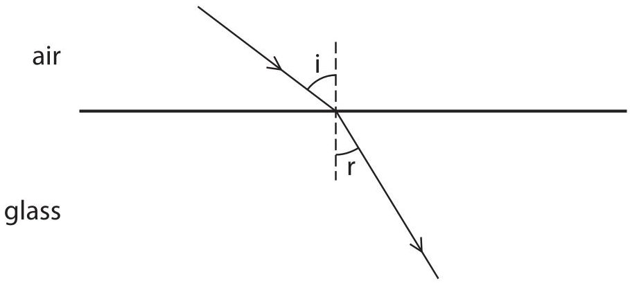

Figure 1

(a) Explain why the ray of light is refracted towards the normal.

(b) Opals and diamonds are transparent stones used in jewellery. Jewellers shape the stones so that light is reflected inside.

Figure 2 shows the path of a ray of light that enters and leaves a shaped piece of opal. This ray of light is totally internally reflected.

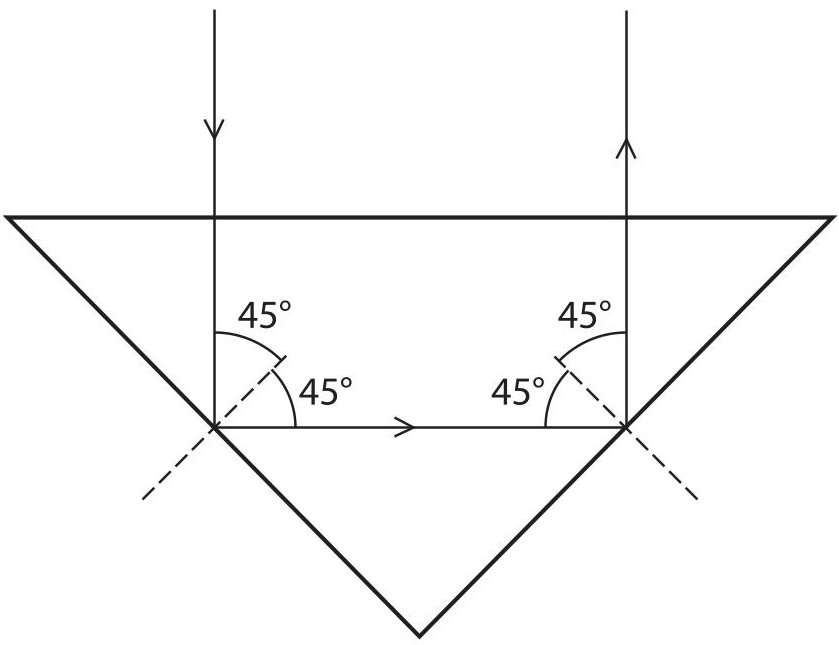

Figure 2

(i) State the equation linking refractive index and critical angle.

(ii) The critical angle of opal is $ 4 3^{\circ}。 $

Show that the refractive index of opal is about 1.5.

(iii) The refractive index of diamond is 2.4.

Explain why rays of light inside a diamond are more likely to be totally internally reflected than those inside an opal.

(Total for Question 11 = 8 marks)

## BLANK PAGE

12 The table shows information about three isotopes of uranium.

<table border="1"><tr><td>Isotope</td><td>Proton number</td><td>Neutron number</td><td>Half-life</td><td>Amount in natural uranium</td></tr><tr><td>Uranium-234</td><td>92</td><td>142</td><td>0.0002 billion years</td><td>0.005%</td></tr><tr><td>Uranium-235</td><td></td><td>143</td><td>0.7 billion years</td><td>0.7%</td></tr><tr><td>Uranium-238</td><td>92</td><td></td><td>4.5 billion years</td><td>99%</td></tr></table>

(a) (i) Complete the table by filling in the missing numbers.

(ii) Explain what is meant by the term half-life.

(iii) Suggest why uranium-238 is the most common isotope of uranium.

(b) Nuclear power stations use a uranium isotope as fuel. What are the products of the fission of uranium nuclei?

(c) The diagram shows the reactor in a nuclear power station.

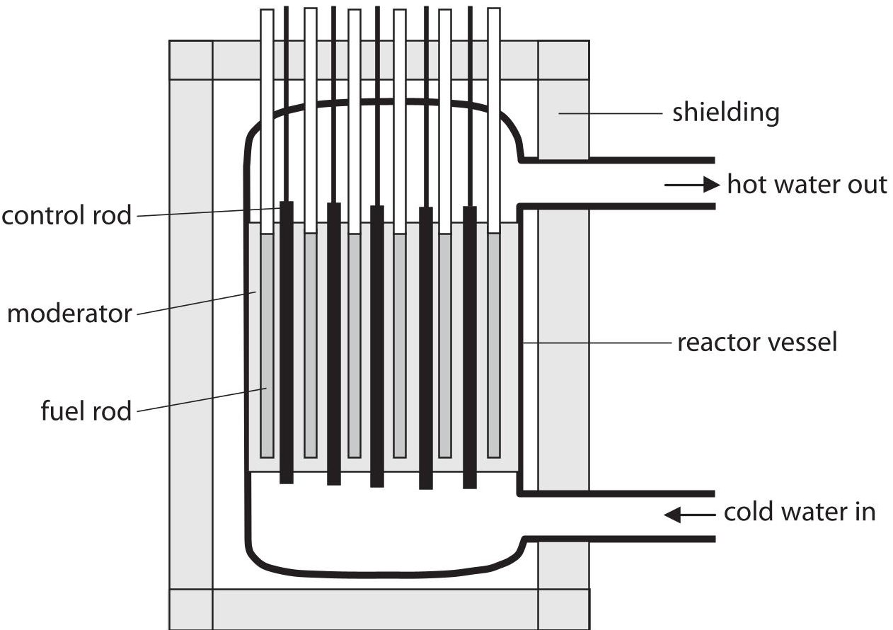

(i) What is the purpose of the moderator?

(ii) Describe what happens in the reactor when a control rod is removed.

(d) There have been several accidents at nuclear power stations.

The most serious accident caused an explosion in the reactor.

This explosion spread material from inside the reactor to the surrounding area.

Explain why it is difficult to make the surrounding area safe again after a serious nuclear accident.

(Total for Question 12 = 16 marks)

## BLANK PAGE

13 A student investigates the vertical forces acting on the ends of a horizontal ruler when it supports a load.

The ruler hangs from two newtonmeters with a weight suspended from it as shown.

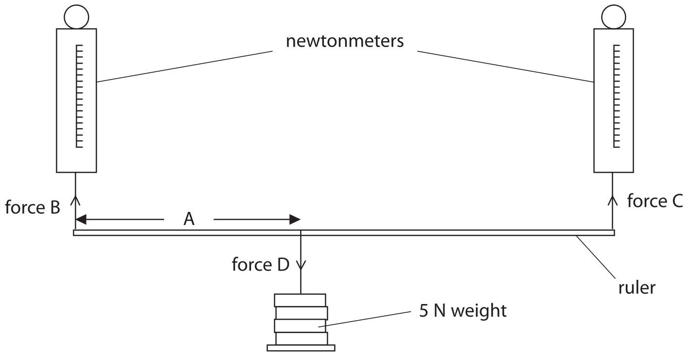

(a) The student moves the weight along the ruler and records forces B and C by taking readings from the newtonmeters.

(i) Which of these is the independent variable in this investigation?

(1) 

A Distance A

B Force B

C Force C

D Force D

(ii) Which of these is a controlled variable in this investigation?

(1) 

A Distance A

B Force B

C Force C

D Force D

(b) The student records these readings.

<table border="1"><tr><td>Distance A in cm</td><td>Reading from newtonmeter of force B in N</td><td>Reading from newtonmeter of force C in N</td></tr><tr><td>0</td><td>5.1</td><td>0.4</td></tr><tr><td>20</td><td>4.0</td><td>1.1</td></tr><tr><td>40</td><td>2.9</td><td>2.3</td></tr><tr><td>60</td><td>2.0</td><td>3.3</td></tr><tr><td>80</td><td>1.1</td><td>4.8</td></tr><tr><td>100</td><td>0.2</td><td>5.9</td></tr></table>

She plots this graph to show how force C changes with distance A.

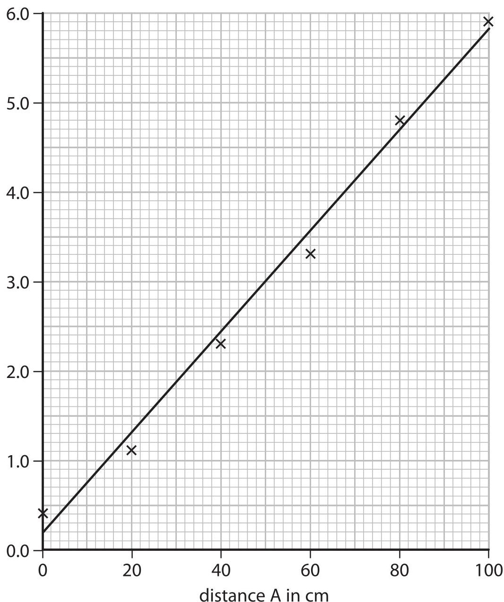

(i) Complete the student's graph by labelling the vertical axis.

(ii) Using the same grid and axes, plot a second line to show how force B varies with distance A.

(iii) Use the lines on the graph to find distance A for which force B and force C are equal.

$$
\mathrm {D i s t a n c e} = \mathrm {c m}
$$

(c) Suggest why neither force B nor force C are ever zero during the investigation.

(Total for Question 13 = 8 marks)

14 The photograph shows two containers that store rainwater.

The containers have taps that are joined by a pipe.

The taps are closed.

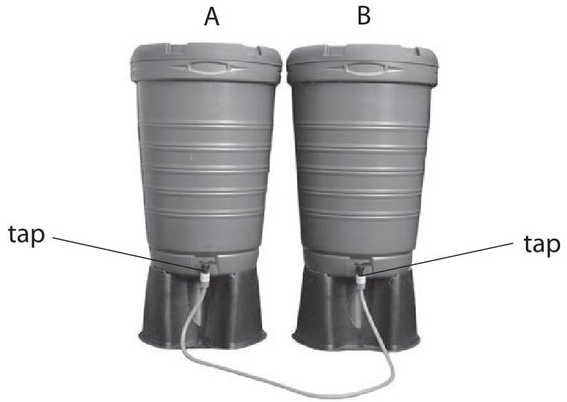

The diagram shows the water levels inside the containers.

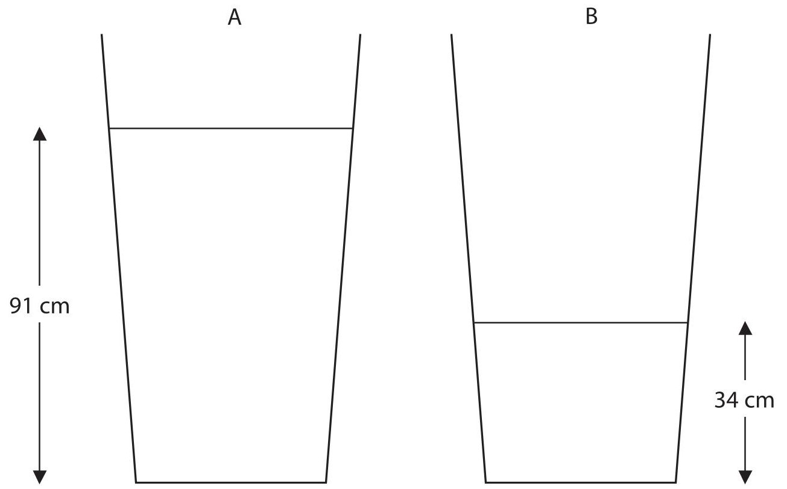

(a) The density of water is $ 1 0 0 0 \mathrm{k g} / \mathrm{m}^{3}. $

(i) State the equation linking pressure difference, height, density and g.

(1) 

(ii) Calculate the pressure that the water causes at the base of container A.

$$
\mathrm {p r e s s u r e} =
$$

(b) When the taps are opened, water flows in the pipe for some time. The diagram shows the final water level in container A.

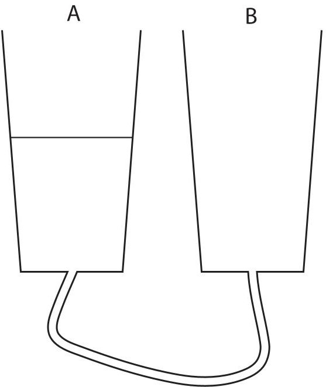

(i) Complete the diagram to show the final water level in container B.

(ii) Explain why the water starts to flow and then stops.

(Total for Question 14 = 7 marks)

TOTAL FOR PAPER = 120 MARKS

## BLANK PAGE

