<table><tr><td colspan="3">Write your name here</td></tr><tr><td>Surname</td><td colspan="2">Other names</td></tr><tr><td>Pearson Edexcel Certificate
Pearson Edexcel
International GCSE</td><td>Centre Number</td><td>Candidate Number</td></tr><tr><td colspan="3">Physics
Unit: KPH0/4PH0
Science (Double Award) KSC0/4SC0
Paper: 1P</td></tr><tr><td colspan="2">Monday 13 January 2014 – Afternoon
Time: 2 hours</td><td>Paper Reference
KPH0/1P 4PH0/1P
KSC0/1P 4SC0/1P</td></tr><tr><td colspan="3">You must have:
Ruler, calculator</td></tr><tr><td colspan="3">Total Marks</td></tr></table>

## Instructions

- Use black ink or ball-point pen.

- Fill in the boxes at the top of this page with your name, centre number and candidate number.

- Answer all questions.

- Answer the questions in the spaces provided

- there may be more space than you need.

- Show all the steps in any calculations and state the units.

- Some questions must be answered with a cross in a box. If you change your mind about an answer, put a line through the box and then mark your new answer with a cross.

## Information

- The total mark for this paper is 120.

- The marks for each question are shown in brackets

- use this as a guide as to how much time to spend on each question.

## Advice

- Read each question carefully before you start to answer it.

- Keep an eye on the time.

- Write your answers neatly and in good English.

- Try to answer every question.

- Check your answers if you have time at the end.

## EQUATIONS

You may find the following equations useful.

$$
\mathrm {e n e r g y t r a n s f e r r e d} = \mathrm {c u r r e n t} \times \mathrm {v o l t a g e} \times \mathrm {t i m e}
$$

$$
E = I \times V \times t
$$

$$
\mathrm {p r e s s u r e} \times \mathrm {v o l u m e} = \mathrm {c o n s t a n t}
$$

$$
p _ {1} \times V _ {1} = p _ {2} \times V _ {2}
$$

$$
\mathrm {f r e q u e n c y} = \frac {1}{\mathrm {t i m e p e r i o d}}
$$

$$
f = \frac {1}{T}
$$

$$
\mathrm {p o w e r} = \frac {\mathrm {w o r k d o n e}}{\mathrm {t i m e t a k e n}}
$$

$$
P = \frac {W}{t}
$$

$$
\mathrm {p o w e r} = \frac {\mathrm {e n e r g y t r a n s f e r r e d}}{\mathrm {t i m e t a k e n}}
$$

$$
P = \frac {W}{t}
$$

$$
\mathrm {o r b i t a l s p e e d} = \frac {2 \pi \times \mathrm {o r b i t a l r a d i u s}}{\mathrm {t i m e p e r i o d}}
$$

$$
v = \frac {2 \times \pi \times r}{T}
$$

Where necessary, assume the acceleration of free fall, g = 10 m/s $ ^{2} $

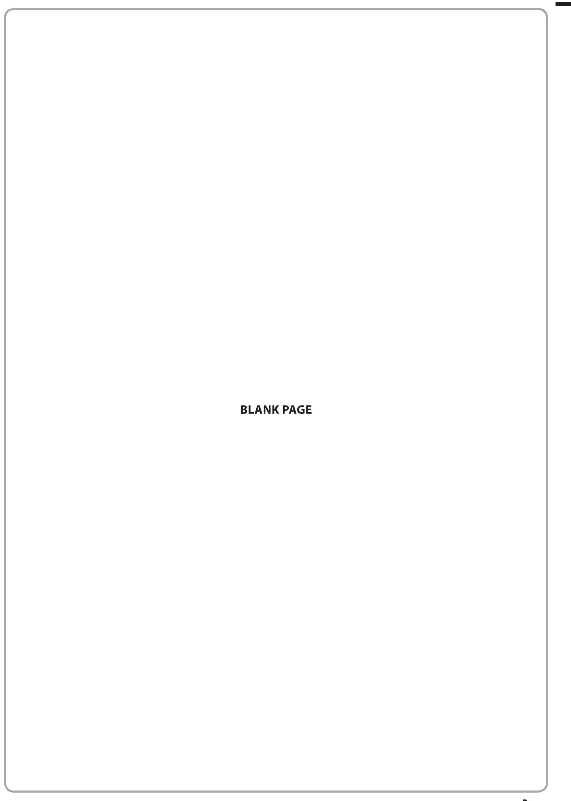

## Answer ALL questions.

1 The diagram shows typical values for the percentage energy losses from a house.

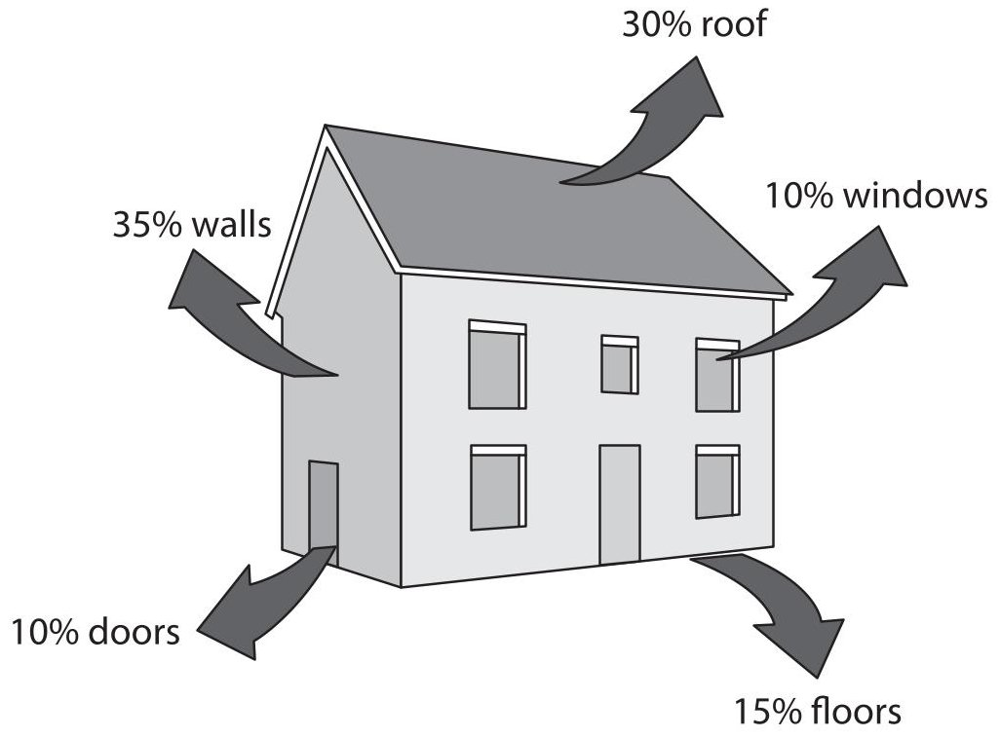

(a) Most energy is lost through

A the floors

B the roof

C the walls

D the windows

(b) The total percentage energy loss from the roof and the windows is

A 10%

B 20%

C 30%

D 40%

(c) Insulation is used to reduce energy losses from houses.

Insulating material often consists of fibres with air between them.

The diagram shows a section through some insulating material.

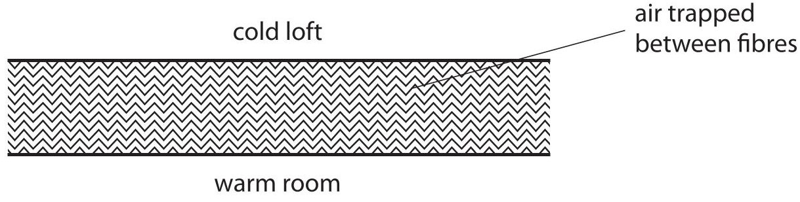

(i) Explain how this type of insulation reduces energy loss by conduction.

(ii) Explain how this type of insulation reduces energy loss by convection.

(Total for Question 1 = 6 marks)

2 Pepper's Ghost is a theatre effect used to make it appear that there is an image on stage. The diagram shows a theatre viewed from above.

A sheet of glass is placed on the stage. A brightly lit actor stands behind a curtain at the side of the stage.

The audience sees the reflection of this actor in the glass.

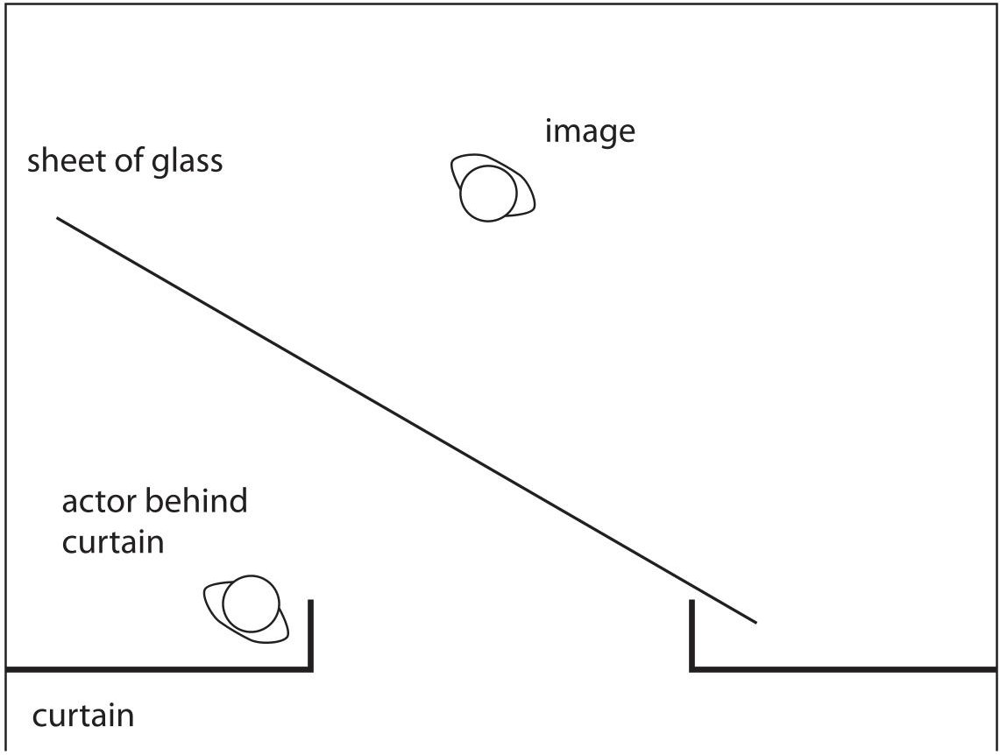

audience

(a) Add a ray diagram to show how light from the actor appears to come from the image.

(b) The image formed by the glass is a virtual image. State what is meant by the term virtual image.

(c) Light travels as a transverse wave. Some waves travel as longitudinal waves.

(i) Give an example of a wave that travels as a longitudinal wave.

(ii) Describe the difference between transverse waves and longitudinal waves. You may draw diagrams to help your answer.

## (Total for Question 2 = 8 marks)

3 The photograph shows an extension cable on a reel.

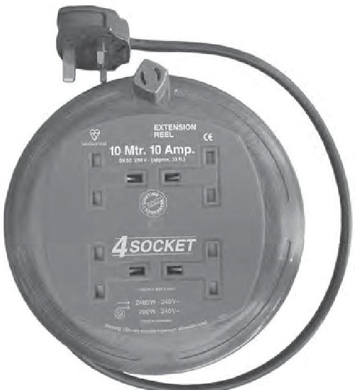

There is a warning label on the reel.

WARNING maximum allowable power when cable fully extended-2400 W,240 V when cable coiled up-700 W,240 V

(a) (i) State the equation linking power, current and voltage.

(ii) Complete the table by inserting the missing value.

<table border="1"><tr><td>Power in W</td><td>Voltage in V</td><td>Current in A</td></tr><tr><td>700</td><td>240</td><td></td></tr><tr><td>2400</td><td>240</td><td>10</td></tr></table>

(b) The extension cable is fitted with a 13 A fuse.

(i) Describe how the fuse protects the cable.

(ii) Explain why a 5 A fuse is not suitable for this extension cable.

(iii) Suggest why the maximum recommended current is lower when the cable is coiled up.

(Total for Question 3 = 8 marks)

4 The diagram shows the magnetic field pattern around a bar magnet.

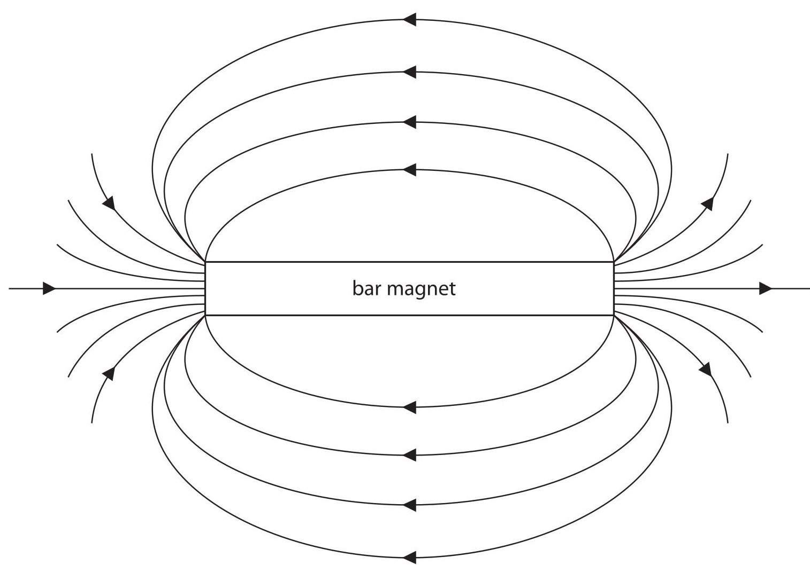

(a) Complete the diagram above by labelling the poles on the bar magnet.

(2) 

(b) Describe an experiment to investigate the shape of the magnetic field pattern of a bar magnet.

You may draw a diagram to help your answer.

(Total for Question 4 = 5 marks)

5 A student investigates the motion of a toy car as it moves freely down a slope.

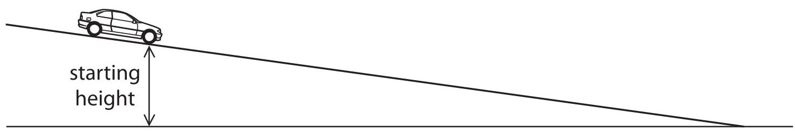

The student wants to find the link between the starting height of the car and the speed of the car at the bottom of the slope.

(a) (i) State the independent variable in this investigation.

(ii) Suggest a link between the starting height of the car and its speed at the bottom of the slope.

(b) Describe how the student should measure the starting height of the car.

(c) The student describes how she will find the speed of the car at the bottom of the slope.

I will start the timer when the car begins to move.

I will stop the timer when the car reaches the bottom.

I will find the speed at the bottom by dividing the distance moved by the time taken.

(i) Explain why the student will not be able to calculate the correct speed using this method.

(ii) Describe how the student should take the measurements needed to find the speed of the car at the bottom of the slope.

You should name any additional equipment needed.

(d) The student repeats the experiment using the same equipment and the same starting height.

She finds out that the time taken for the car to move down the slope is not exactly the same for each experiment.

Suggest three reasons why the student gets different results when she repeats the experiment.

(Total for Question 5 = 12 marks)

6 Echo sounding is used to detect fish in the sea.

Sound waves are emitted from a fishing boat. Some of the sound waves are reflected by fish and detected back at the boat.

(a) The shortest time between the sound waves being emitted and detected is 0.26 s.

The speed of sound in water is 1.5 km/s.

Calculate the distance between the boat and the nearest fish.

(b) Each sound wave is emitted for a very short time.

The reflected sound wave received at the boat lasts for a longer time.

Suggest a reason for this difference in time.

(Total for Question 6 = 6 marks)

7 A skydiver jumps from an aircraft.

(a) The mass of the skydiver is 70 kg.

(i) State the equation linking weight, mass and g.

(ii) Calculate the weight of the skydiver and state the unit.

$$
\mathrm {w e i g h t} = \mathrm {u n i t}
$$

(b) The graph shows the vertical velocity of the skydiver during the first 40 s of the fall. His parachute is not open during this time.

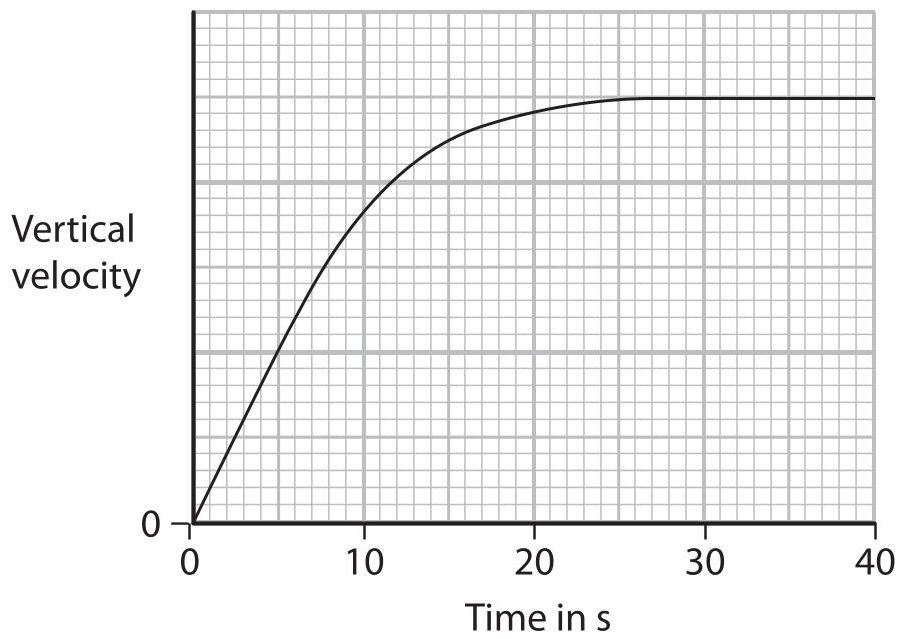

Explain the shape of the graph.

(c) The diagram shows the skydiver falling at a constant velocity.

Add two labelled arrows to the diagram to represent the forces acting on the skydiver.

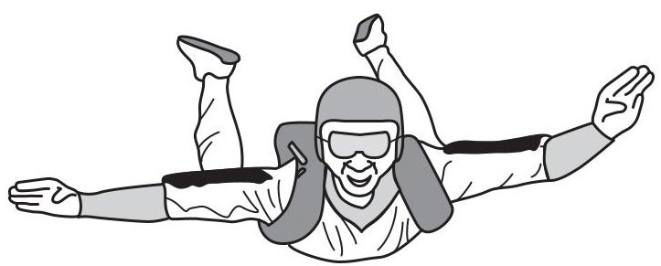

(d) The skydiver opens his parachute after 40 s.

Continue the line on the graph to show how the skydiver's vertical velocity changes and reaches terminal velocity.

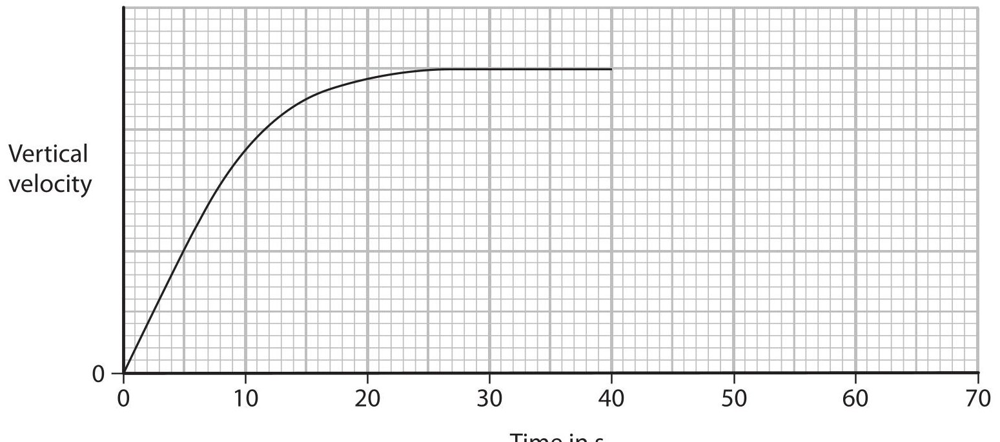

8 A student investigates the efficiency of an electric motor.

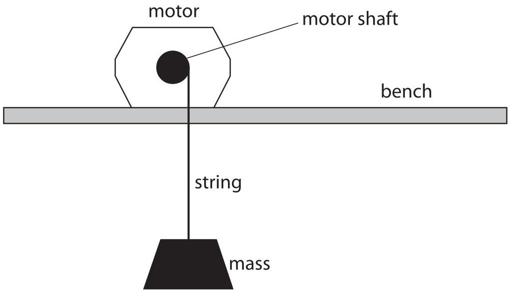

She uses the motor to lift a mass.

The table shows her measurements.

<table border="1"><tr><td>Current in motor</td><td>1.3A</td></tr><tr><td>Voltage across motor</td><td>10.3V</td></tr><tr><td>Time taken to lift mass</td><td>4.7s</td></tr><tr><td>Force needed to lift mass</td><td>20N</td></tr><tr><td>Distance the mass was lifted</td><td>0.85m</td></tr></table>

(a) Calculate the electrical energy supplied to the motor during this time.

energy supplied =

(b) (i) State the equation linking work done, force and distance moved.

(ii) Calculate the work done on the mass.

$$
\mathrm {w o r k d o n e} =
$$

(iii) State the useful energy transferred to the mass.

(c) (i) State the equation linking efficiency, useful energy output and total energy input.

(ii) Calculate the efficiency of the motor.

efficiency=

(Total for Question 8 = 9 marks)

9 A student investigates how the extension of a spring varies when he hangs different loads from it.

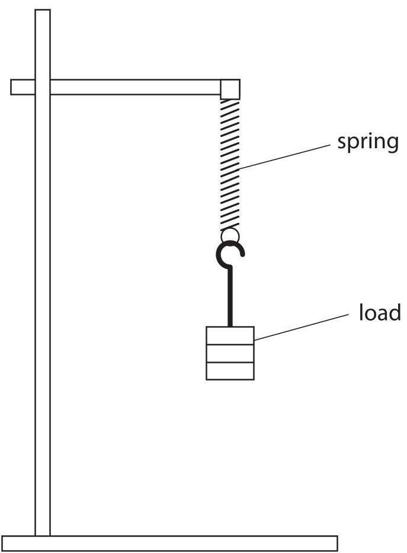

(a) Write a plan for the student's investigation.

Your plan should include details of how the student can make accurate measurements. You may add to the diagram to help your answer.

(b) The student finds that the spring obeys Hooke's law.

Draw a graph on the axes to show the Hooke's law relationship. Label the axes.

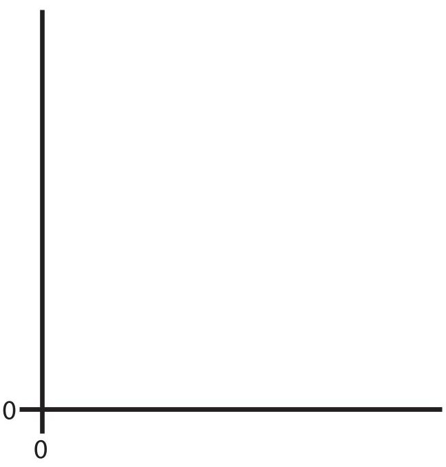

(c) The student concludes that the spring shows elastic behaviour. Explain what is meant by the term elastic behaviour.

(Total for Question 9 = 10 marks)

10 The Astra satellite is in an orbit around the Earth.

(a) The satellite uses microwave signals for communication.

Microwaves are part of the electromagnetic spectrum.

(i) Which part of the electromagnetic spectrum has longer wavelengths than microwaves?

A gamma rays

B radio waves

ultraviolet light

D visible light

(ii) Which of these statements is correct?

A Microwaves always travel faster than radio waves.

B Microwaves always travel slower than radio waves.

C Microwaves and radio waves travel at the same speed in a vacuum.

D Microwaves and radio waves travel at the same speed in all materials.

(iii) State one property of electromagnetic waves that makes microwaves suitable for communications with a satellite in space.

(b) The Astra satellite takes 24 hours to orbit the Earth once.

It travels at a speed of 3.1 km/s.

Calculate the orbital radius of the satellite and give the unit.

## orbital radius =

(c) The Astra satellite orbits above the equator and travels in the same direction as the rotation of the Earth.

Suggest why this type of 24-hour orbit is an advantage for communications.

(Total for Question 10 = 8 marks)

11 The photograph shows a solar-powered battery charger connected to a mobile phone.

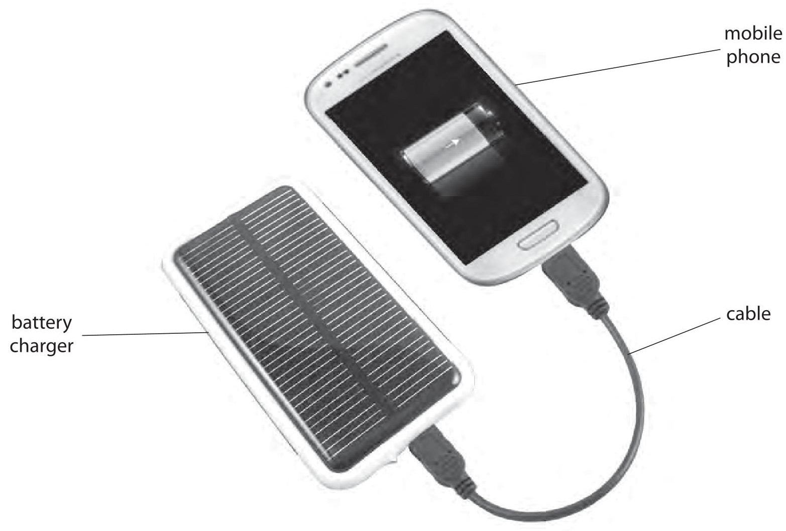

When the battery charger is used, it transfers light energy from the Sun to the battery of the mobile phone.

(a) Complete the energy transfer diagram.

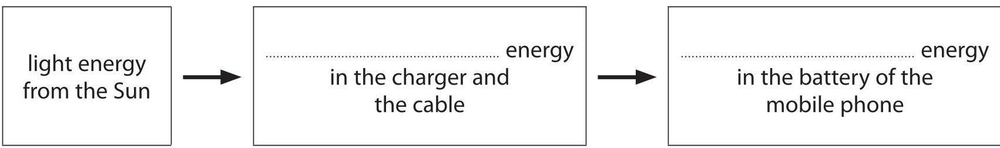

(b) It takes 3.5 hours to recharge the battery fully. The average current supplied by the charger is 400 mA.

(i) State the equation linking charge, current and time.

(ii) Calculate the amount of charge needed to recharge the battery fully, and give the unit.

(c) If the charger is moved into the shade,the output power decreases.

The voltage across the charger stays the same.

Explain how moving the charger into the shade affects the time needed to recharge the battery fully.

(Total for Question 11 = 8 marks)

12 A scientist placed a radioactive source in front of a Geiger-Muller detector and measured the count rate every 20 minutes.

The table shows her data.

<table border="1"><tr><td>Time in minutes</td><td>Count rate in counts per minute</td><td>Corrected count rate in counts per minute</td></tr><tr><td>0</td><td>660</td><td>630</td></tr><tr><td>20</td><td>462</td><td>432</td></tr><tr><td>40</td><td>330</td><td>300</td></tr><tr><td>60</td><td>240</td><td>210</td></tr><tr><td>80</td><td>180</td><td>150</td></tr><tr><td>100</td><td>142</td><td>112</td></tr></table>

(a) The scientist corrects the count rate readings to allow for background radiation.

(i) State two sources of background radiation.

(ii) Describe how the scientist should measure the background radiation and correct the count rate readings.

(iii) Plot a graph of corrected count rate against time and draw the curve of best fit.

(iv) Use your graph to find the half-life of the radioactive source.

half-life = minutes

(b) The radioactive nuclei in the source emit beta radiation.

What effect does the emission of a beta particle have on a nucleus?

(c) The scientist needs to reduce the risks when working with radioactive sources.

(i) Explain why radioactive sources can be dangerous.

(ii) Describe how the risks of working with radioactive sources can be reduced.

(Total for Question 12 = 19 marks)

13 (a) A diver breathes air from a cylinder when he is under water.

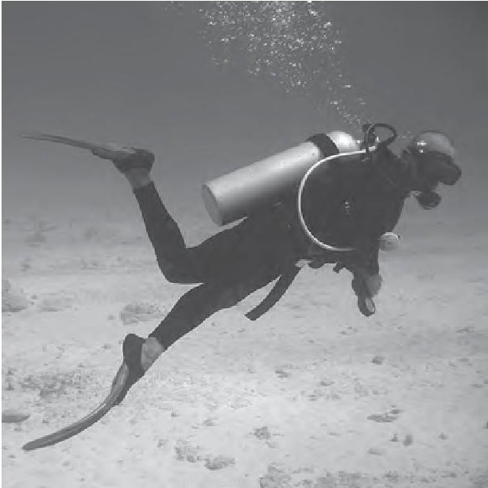

(i) The cylinder contains 8 litres of air at 200 times atmospheric pressure. The air is released from the cylinder at normal atmospheric pressure.

The diver needs 16 litres of air per minute.

Calculate the maximum amount of time that the diver can breathe under water using this cylinder.

(ii) When the diver breathes out, bubbles are released.

Suggest why the bubbles expand as they rise to the surface.

(b) A student wants to investigate how the volume of a balloon changes with pressure.

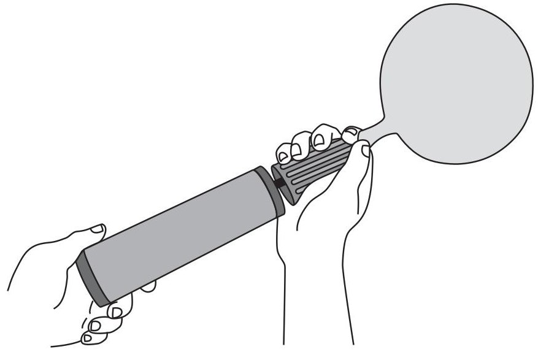

(i) Suggest how the student could measure the volume of an inflated balloon.

(ii) The student plans to measure the pressure of the air in the balloon.

To measure the pressure in the balloon I will count how many times I push the pump. The same amount of air goes into the balloon with each push.

When there is twice as much air in the balloon the pressure will be twice as high, so the pressure will be proportional to the number of times I push the pump.

Explain why the student's plan will not work.

(Total for Question 13 = 9 marks)

TOTAL FOR PAPER=120 MARKS

## BLANK PAGE

