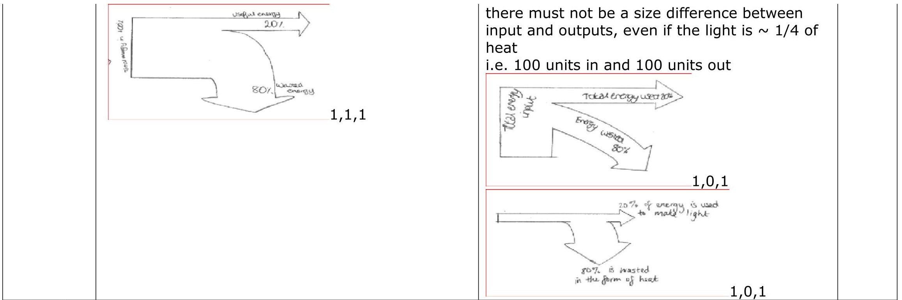

Mark Scheme (Results)

June 2014

Pearson Edexcel International GCSE

Physics (4PH0) Paper 1P

Science Double Award (4SC0) Paper

Pearson Edexcel Level 1/Level 2

Certificate

Physics (KPH0) Paper 1P

Science (Double Award) (KSC0) Paper

## Edexcel and BTEC Qualifications

Edexcel and BTEC qualifications come from Pearson, the world's leading learning company. We provide a wide range of qualifications including academic, vocational, occupational and specific programmes for employers. For further information, please visit our website at www.edexcel.com.

Our website subject pages hold useful resources, support material and live feeds from our subject advisors giving you access to a portal of information. If you have any subject specific questions about this specification that require the help of a subject specialist, you may find our Ask The Expert email service helpful.

www.edexcel.com/contactus

Pearson: helping people progress, everywhere Our aim is to help everyone progress in their lives through education. We believe in every kind of learning, for all kinds of people, wherever they are in the world. We've been involved in education for over 150 years, and by working across 70 countries, in 100 languages, we have built an international reputation for our commitment to high standards and raising achievement through innovation in education. Find out more about how we can help you and your students at: www.pearson.com/uk

January 2014 Publications Code UG039756 All the material in this publication is copyright $ \textcircled{c} $ Pearson Education Ltd 2014

-All candidates must receive the same treatment. Examiners must mark the first candidate in exactly the same way as they mark the last.

- Mark schemes should be applied positively. Candidates must be rewarded for what they have shown they can do rather than penalised for omissions.

- Examiners should mark according to the mark scheme not according to their perception of where the grade boundaries may lie.

- There is no ceiling on achievement. All marks on the mark scheme should be used appropriately.

- All the marks on the mark scheme are designed to be awarded. Examiners should always award full marks if deserved, i.e. if the answer matches the mark scheme. Examiners should also be prepared to award zero marks if the candidate's response is not worthy of credit according to the mark scheme.

- When examiners are in doubt regarding the application of the mark scheme to a candidate's response,the team leader must be consulted.

- Where some judgement is required, mark schemes will provide the principles by which marks will be awarded and exemplification may be limited.

- Crossed out work should be marked UNLESS the candidate has replaced it with an alternative response.

<table border="1"><tr><td colspan="2">Question number</td><td>Answer</td><td>Notes</td><td>Marks</td></tr><tr><td rowspan="3">1</td><td rowspan="2">a i</td><td>Any two from- Radio; Microwaves; Infrared; Visible;</td><td></td><td>2</td></tr><tr><td>Microwaves; Infrared;</td><td></td><td>2</td></tr><tr><td>b</td><td>D Increasing wavelength</td><td></td><td>1</td></tr><tr><td rowspan="4">c</td><td rowspan="4">i</td><td>(wave) speed = frequency x wavelength</td><td></td><td>1</td></tr><tr><td>Substitution into correct equation; Evaluation; Unit; Eg.(wave) speed = 200000x150030000000m/s</td><td>Accept equivalentAccept recognised symbolsmark unit and calc independentlyPower Of Ten error = -1e.g. not converting kHz to HzAccept
• bald answer
• answer in SF
• alternative speed units with corresponding evaluation e.g.300000km/s1.08x1012km/hour</td><td>3</td></tr><tr><td></td><td></td><td></td></tr><tr><td></td><td></td><td></td></tr></table>

(Total for Question 1 = 9 marks)

<table border="1"><tr><td colspan="2">Question number</td><td>Answer</td><td>Notes</td><td>Marks</td></tr><tr><td>2</td><td>a</td><td>B kettle</td><td></td><td>1</td></tr><tr><td></td><td>ii</td><td>A food mixer</td><td></td><td>1</td></tr><tr><td></td><td>b</td><td>any one from MP1 total energy always has the same value;MP2 energy cannot be created or destroyed;MP3 energy input=energy output;</td><td>Allow student speak with two distinct ideas on energye.g.none is lost or gainednone is lost just transferred</td><td>1</td></tr><tr><td></td><td>c</td><td>Both of:MP1. is 20% of the energy input;MP2. (20%) is transferred usefully/as light;OR both of:MP3. 80% of the energy input;MP4. (80%) is wasted/transferred as heat;</td><td>allow energy used for energy input20% (or 80%) is not enough for the mark,‘energy input’ or‘energy used’ must be mentionedallow for 1 mark,a definition of efficiency condone power for energyindependent marksallow</td><td>11</td></tr><tr><td></td><td>ii</td><td>Sankey diagram giving-MP1. One input and ONLY two outputs;MP2. Roughly correct proportions;MP3. Two correct labels;e.g.</td><td>·output arrows in either direction·both output arrows in same direction·2 fromo input/electrical/total,o useful/light,o wasted/heat/thermalignore% on labelssound</td><td>111</td></tr></table>

(Total for Question 2 = 8 marks)

<table border="1"><tr><td>Question number</td><td>Answer</td><td>Notes</td><td>Marks</td></tr><tr><td>3 a i</td><td>newtons/N;</td><td>Reject n,NsAllow Newtons</td><td>1</td></tr><tr><td>ii</td><td>any one of scales weighing scale electronic/electric balance newtonmeter;</td><td>newtonmetre</td><td>1</td></tr><tr><td>b</td><td>MP1. Record outline of foot;MP2. Attempt at evaluation of area;MP3. Detail of method of measurement;e.g.Draw round foot/feetCount/estimate the squaresOn squared/graph paper</td><td>Allow suitable alternatives dip foot into paint/ink and make footprintfind area of rectangle around footarea of rectangle minus area of spaces around the footuse of ruler is insufficient for MP3</td><td>3</td></tr><tr><td>c i</td><td>Pressure=force/area;</td><td></td><td>1</td></tr><tr><td>ii</td><td>Substitution into correct equation;Evaluation;e.g. Pressure=650/2702.4</td><td>ACCEPT
• rearranged equation
• equation in recognised symbolsIgnore triangle or units equationallow 2.41 or 2.4074 etc</td><td>1</td></tr></table>

(Total for Question 3 = 8 marks)

<table border="1"><tr><td>Question number</td><td>Answer</td><td>Notes</td><td>Marks</td></tr><tr><td>4 a</td><td>(Atoms/nuclei with the) same number of protons; Different numbers of neutrons;</td><td>ALLOW relevant correct alternatives e.g.
·atomic number, proton number
·nucleon number, atomic mass
ignore comments about electrons</td><td>1
1</td></tr><tr><td>b i</td><td>Electron;</td><td>ignore comments about properties of electrons e.g. speed
ALLOW
·e- or e+
·positron</td><td>1</td></tr><tr><td>ii</td><td>any suitable detector e.g.
Geiger(-Muller) tube/detector/counter;
photographic film;
zinc sulfide;
gold leaf electroscope;</td><td>ALLOW
·phonetic/incorrect spelling</td><td>1</td></tr><tr><td>iii</td><td>beta penetrates paper;
beta absorbed/stopped by lead+/or aluminium;</td><td>IGNORE
·all details of experimental setup
·beta goes through aluminium/eq
DO NOT ALLOW
·bounced back for absorbed
·contradictions in answers e.g. re aluminium</td><td>1
1</td></tr></table>

<table border="1"><tr><td></td><td></td><td></td></tr><tr><td>MP1. line goes through0,1400and(first half-lifeplottedat)15,700;
MP2. line goes through/second half-lifeplottedat30,350;
MP3. a correctly curvedline between15and30hoursANDthelineextendsbeyond35hours;
i.e.</td><td>ALLOWforMP2anecffromincorrectfirsthalf-lifeto`correct&#x27;secondhalf-lifee.g.800---400</td><td>1
1
1</td></tr><tr><td></td><td></td><td></td></tr><tr><td></td><td></td><td>IGNORE
•a slight upcurveat35to40hours
•Barcharts
•Since thisisasketchthenallowtoleranceof+/-1squareonthepoints</td></tr></table>

<table border="1"><tr><td>Question number</td><td>Answer</td><td>Notes</td><td>Marks</td></tr><tr><td rowspan="7">d i</td><td>any FOUR from:</td><td>allow as a numerical example</td><td>1</td></tr><tr><td>MP1. there is a known proportion / composition / activity when rocks formed;</td><td>ignore work out the proportion when rocks were formed</td><td>1</td></tr><tr><td>MP2. measure/determine the proportion of uranium or the activity now;</td><td>ALLOW
• Bq for activity
• radioactivity for activity
• amount for proportion
IGNORE
• measure half-life of uranium
• they know its activity</td><td></td></tr><tr><td>MP3. compare activity now to original activity/eq;</td><td></td><td></td></tr><tr><td>MP4. (hence) determine the time / number of half-lives elapsed;</td><td></td><td></td></tr><tr><td>MP5. (hence) calculate age from reference to half-life;</td><td>ALLOW colloquial expressions such as ‘see how long it took to decay this much’</td><td></td></tr></table>

<table border="1"><tr><td>ii</td><td>MP1.idea that it/half-life is too shortORidea that decay occurs too quickly/rapidly;PLUSMP2. (hence)U/isotope would (all) have decayed (long ago)ORU activity would be too small (to distinguish from background/ to measure);</td><td>comparative of some sort needed for MP1allow not enough time1care that you do not award both alternatives for MP2IGNOREgranite decaysit decays</td><td>1</td></tr></table>

(Total for Question 4 = 15 marks)

<table border="1"><tr><td>Question number</td><td>Answer</td><td>Notes</td><td>Marks</td></tr><tr><td>5 a</td><td>any FIVE from:
MP1. Object has weight or there is a downward force (due to gravity on the object);
MP2. So it accelerates (downwards);
MP3. there is (a force of) drag (upwards or to oppose movement);
MP4. drag increases as speed increases;
MP5. eventually drag = weight;
MP6. (hence) resultant force is zero;
MP7. (hence) object travels at constant speed;</td><td>allow:
gravity pulls it down
the speed/velocity increases
oil resistance / water resistance / air resistance for drag
oil friction / water friction / air friction for drag
`drag increases as it accelerates`
forces are equal / forces are balanced
accept `no acceleration`
DO NOT ALLOW
•(The drag) slows it down MP2
•upthrust for drag MP3
•resistance = acceleration for MP5
•terminal velocity for constant speed for MP7</td><td>5</td></tr></table>

<table border="1"><tr><td rowspan="8">b</td><td>Measuring instruments
MP1. Timer/stop-clock/light gate(and data logger);
MP2. Ruler/scale;</td><td>Ignore
ticker-timer
measurement of mass
condone tape measure</td><td rowspan="8">5</td></tr><tr><td>Measurements made
MP3. Take time for ball to pass between two points;
MP4. determine the distance apart;
MP5. Repeat readings lower down;
OR
MP6. For a set time(e.g.for1s);
MP7. measure distance travelled(in this time);
MP8. Repeat readings lower down;
OR
MP9. measure velocity using light gate with data logger;
MP10.at two different places;</td><td>if the measurements are from top to bottom then only give MP3 or MP4 not both</td></tr><tr><td>Using measurements
MP11.Use speed=distance/time;
MP12.How results indicate terminal velocity achieved;</td><td>allow velocity for speed</td></tr></table>

(Total for Question 5 = 10 marks)

<table border="1"><tr><td>Question number</td><td>Answer</td><td>Notes</td><td>Marks</td></tr><tr><td>6a i</td><td>Power = current x voltage;</td><td>Accept
• rearranged equation
• equation in recognised symbols</td><td>1</td></tr><tr><td>ii</td><td>Substitution and rearrangement;
Evaluation;
eg
I=2000/230
8.7(A)</td><td>Accept
•9(A)
•8.695...(A) ETC
NOT
•8.6 incorrect truncation
•9.0 incorrect rounding</td><td>1</td></tr><tr><td>iii</td><td>D 13A</td><td></td><td>1</td></tr><tr><td>b</td><td>Series - single switch to control both;
Parallel - independent control;</td><td>Allow
idea of one element failing (and the other continuing)
ignore comments about voltages or currents
there is no mark for getting the 2 answers reversed</td><td>1</td></tr></table>

<table border="1"><tr><td>c i</td><td>ANY FOUR FROM-
MP1. earth connected to (metal) casing;
MP2. If casing becomes live/ live wire touches case;
MP3. Provides low resistance path (to earth);
MP4. (So) large/surge current in earth wire;
MP5. (hence) fuse breaks/melts/blows;
MP6. (so) circuit switches off or current stops or supply cuts off;</td><td>4
Allow circuit breaker(RCCB)
DO NOT CREDIT: the electricity goes to the ground/eq for MP3</td></tr><tr><td>ii</td><td>any two from
MP1. It has a metal case;
MP2. Metals/the case conducts (electricity);
MP3. to prevent (user getting) a shock;</td><td>1
1</td></tr></table>

(Total for question 6 = 12 marks)

<table border="1"><tr><td>Question number</td><td>Answer</td><td>Notes</td><td>Marks</td></tr><tr><td>7 a</td><td>Any FOUR from:
MP1. Current in coil;
MP2. (Creates) magnetic field (around the wires of the coil);
MP3. Interaction of (this) field with that of (permanent) magnets;
MP4. There is a force on the wire(of coil);
MP5. Reference to left hand rule;
MP6. force up on one side and down on other side;</td><td>current in circuit is not enough
coil becomes an electromagnet
allow field cutting as the interaction
idea of catapult field
reference to moment/turning effect on the coil</td><td>4</td></tr><tr><td>b i</td><td>one of
• Reverse supply polarity (however described);
• reverse current direction (however described);
• swap magnets over(however described);</td><td></td><td>1</td></tr><tr><td>ii</td><td>any one from:
• Reduce current (however described);
• Reduce voltage (however described);
• increase resistance of circuit (however described);
• weaker magnetic field (however described);</td><td>Allow: less turns on coil
Condone: fewer coils</td><td>1</td></tr></table>

(Total for Question 7=6 marks)

<table border="1"><tr><td>Question number</td><td>Answer</td><td>Notes</td><td>Marks</td></tr><tr><td>8 a</td><td>(surface) area;</td><td></td><td>1</td></tr><tr><td>b i</td><td>Any one from:
volume of water;
timing period;</td><td>Ignore conditions of the room</td><td>1</td></tr><tr><td>ii</td><td>any TWO from:
MP1. (this variable) would affect heat loss;
MP2. so wouldn&#x27;t know which factor/variable mattered;
MP3. otherwise not fair test/results would not be valid/results would not be reliable;</td><td>allow
description of how the variable would affect heat loss</td><td>1</td></tr><tr><td>c</td><td>ANY SUITABLE e.g.
• care with hot water
• container not near edge of table/bench
• do experiment while standing</td><td>allow
• gloves
• goggles</td><td>1</td></tr><tr><td>d i</td><td>31
40
28
25
ALL FOUR CORRECT = 2
-1 each mistake
Minimum score = 0</td><td></td><td>2</td></tr><tr><td></td><td></td><td></td><td>1</td></tr></table>

<table border="1"><tr><td>ii</td><td>MP1. temperature(difference);
MP2. (surface) area or time;
MP3. relevant units on both;</td><td>X and Y unimportant</td><td>1
1</td></tr><tr><td>iii</td><td>Any TWO from:
MP1. use water that is at the same starting temp;
MP2. Pour in and wait until that temperature is reached before timing;
MP3. method to ensure small time gap between pouring water and starting;
MP4. put(same volumes into) containers in a water bath;</td><td>Accept sensible alternative workable method(s),
allow two different methods
e.g. do one at a time
use other people to help</td><td>2</td></tr></table>

(Total for Question 8 = 12 marks)

<table border="1"><tr><td>Question number</td><td>Answer</td><td>Notes</td><td>Marks</td></tr><tr><td>9 a</td><td>Any FIVE from:
MP1. Energy (transferred) from the sun;
MP2. Air over the land is heated;
MP3. Warmer air over land expands;
MP4. Air becomes less dense;
MP5. Therefore rises (must have connection);
MP6. Cooler air over sea becomes denser;
MP7. Cooler air over sea sinks;
MP8. Air (from over the sea) moves inland to replace rising air;</td><td>no mark for bald convection current
land heats up air
reject for 1 mark
• particles expand and/or become less dense</td><td>5</td></tr><tr><td>b</td><td>MP1. Example of a larger particle given:
e.g.
• smoke particles
• pollen
MP2. Idea that larger particles move with random motion;
MP3. Idea of collisions with smaller (invisible) particles;</td><td>can only be awarded if MP3 or MP4 is given
ignore
• heat rises</td><td>1</td></tr><tr><td></td><td></td><td>Ignore
• air/water particles move with random motion</td><td>1
1</td></tr></table>

(Total for Question 9 = 8 marks)

<table border="1"><tr><td>Question number</td><td>Answer</td><td>Notes</td><td>Marks</td></tr><tr><td>10 a</td><td>a moon orbits a planet;a planet orbits a star(/the Sun);</td><td>Ignore comments about eccentricity, oval, plane of orbit, time of orbit etc</td><td>11</td></tr><tr><td>b</td><td>Substitution;Evaluation;Unit(to match the value of v);e.g.V=(2xπx385000)=24178002727</td><td>Note value ofπ used may varytime values and corresponding approximate speeds are27 days...89600km/days648 hours...3731km/hours38880mins...62km/min2332800s...1.04km/s</td><td>11</td></tr><tr><td></td><td>90000km/day</td><td>allow answers which round to89600Accept suitable matching units</td><td>1</td></tr><tr><td>c i</td><td>E=1/2mv2;</td><td>Acceptrearranged equationequation in words</td><td>1</td></tr><tr><td>ii</td><td>substitution;Mass converted to kg;47.(33...) seen;</td><td>allowsub of mass as50g1.496 or1.5 seen gets2 marks</td><td>3</td></tr><tr><td>d i</td><td>44(J);</td><td></td><td>1</td></tr><tr><td>ii</td><td>GPE=mgh;</td><td>Acceptrearranged equationequation using(all the) wordsAllow for&#x27;g&#x27;gravitational field strength but NOT gravity</td><td>1</td></tr></table>

<table border="1"><tr><td></td><td></td><td></td><td></td></tr><tr><td>iii</td><td>Substitution and rearrangement;Calculation;120.05x1.6150(m)</td><td>POT error loses 1 marke.g.0.15(m) gets 1 mark</td><td>2</td></tr><tr><td>e</td><td>any Two from:Value of g lower(on the Moon)/RA;lack of air resistance(on the Moon)/RA;Time of flight greater;</td><td>ignore·‘no gravity’allow·less gravity·drag for air resistance</td><td>2</td></tr></table>

(Total for Question 10 = 15 marks)

<table border="1"><tr><td>Question number</td><td>Answer</td><td>Notes</td><td>Marks</td></tr><tr><td>11 a</td><td>91;56;</td><td></td><td>11</td></tr><tr><td>b</td><td>Three FROM-MP1. Neutrons released;MP2. neutrons slowed by moderator;MP3. Can be absorbed by other(U) nuclei;MP4. Causing further fissions;</td><td>ignore comments about control rodscollide or react for absorbif MP3 or 4 or both not given then award 1mark for a description of a first absorption</td><td>3</td></tr><tr><td>c i</td><td>Correct labels for-Control rods;Shielding;</td><td>Accept
• lines with or without arrow heads(in either direction)
• any part of control rod(black in diagram)
• any part of external box for shielding</td><td>1112</td></tr></table>

<table border="1"><tr><td>ii</td><td>Two from:
MP1. Reactor material / waste is radioactive;
MP2. (radiation) ionises cells/ tissues / organs / body or causes cancer;
MP3. radiation is very penetrating;</td><td>allow damages for ionises
NOT ALLOW bald &#x27;it is dangerous&#x27;
do not award marks for &#x27;shielding prevents escape of radiation&#x27;/eq</td><td></td></tr></table>

(Total for Question 11 = 9 marks)

<table border="1"><tr><td>Question number</td><td>Answer</td><td>Notes</td><td>Marks</td></tr><tr><td>12 a</td><td>MP1. series circuit containing lamp and some form of power supplyMP2. ammeter in series with lampMP3. voltmeter in parallel across lampMP4. variable resistor in series OR use of variable power supply</td><td>incorrect symbols or substantial gaps=-1 ONCEallow either symbol for lampignore other components e.g. switch</td><td>4</td></tr><tr><td>b i</td><td>idea that gradient changes;e.g.voltage increases more rapidly than the current</td><td>look for a rate change expressed in student termsAccept
line is curved
not a straight line
V is not proportional to I</td><td>1</td></tr><tr><td>ii</td><td>MP1. Lamp heats upMP2. Greater chance of electron collisionsMP3. (hence) resistance increases;</td><td>do not award marks for a description of the shape of the graph</td><td>3</td></tr></table>

(Total for question 12=8 marks)