<table><tr><td colspan="2">Write your name here</td></tr><tr><td>Surname</td><td>Other names</td></tr><tr><td>Pearson Edexcel Certificate
Pearson Edexcel
International GCSE</td><td>Centre Number
Candidate Number</td></tr><tr><td colspan="2">Physics
Unit: KPH0/4PH0
Science (Double Award) KSC0/4SC0
Paper: 1P</td></tr><tr><td>Wednesday 14 January 2015 – Afternoon
Time: 2 hours</td><td>Paper Reference
KPH0/1P 4PH0/1P
KSC0/1P 4SC0/1P</td></tr><tr><td colspan="2">You must have:
Ruler, calculator</td><td>Total Marks</td></tr></table>

## Instructions

- Use black ink or ball-point pen.

- Fill in the boxes at the top of this page with your name, centre number and candidate number.

- Answer all questions.

- Answer the questions in the spaces provided

- there may be more space than you need.

- Show all the steps in any calculations and state the units.

- Some questions must be answered with a cross in a box. If you change your mind about an answer, put a line through the box and then mark your new answer with a cross.

## Information

- The total mark for this paper is 120.

- The marks for each question are shown in brackets

- use this as a guide as to how much time to spend on each question.

## Advice

- Read each question carefully before you start to answer it.

- Keep an eye on the time.

- Write your answers neatly and in good English.

- Try to answer every question.

- Check your answers if you have time at the end.

## EQUATIONS

You may find the following equations useful.

$$
\mathrm {e n e r g y t r a n s f e r r e d} = \mathrm {c u r r e n t} \times \mathrm {v o l t a g e} \times \mathrm {t i m e}
$$

$$
E = I \times V \times t
$$

$$
\mathrm {p r e s s u r e} \times \mathrm {v o l u m e} = \mathrm {c o n s t a n t}
$$

$$
p _ {1} \times V _ {1} = p _ {2} \times V _ {2}
$$

$$
\mathrm {f r e q u e n c y} = \frac {1}{\mathrm {t i m e p e r i o d}}
$$

$$
f = \frac {1}{T}
$$

$$
\mathrm {p o w e r} = \frac {\mathrm {w o r k d o n e}}{\mathrm {t i m e t a k e n}}
$$

$$
P = \frac {W}{t}
$$

$$
\mathrm {p o w e r} = \frac {\mathrm {e n e r g y t r a n s f e r r e d}}{\mathrm {t i m e t a k e n}}
$$

$$
P = \frac {W}{t}
$$

$$
\mathrm {o r b i t a l s p e e d} = \frac {2 \pi \times \mathrm {o r b i t a l r a d i u s}}{\mathrm {t i m e p e r i o d}}
$$

$$
v = \frac {2 \times \pi \times r}{T}
$$

Where necessary, assume the acceleration of free fall, $ g=1 0 \mathrm{~ m} / \mathrm{s}^{2}. $

## Answer ALL questions.

1 Mains electricity is used in circuits at home.

(a) Double insulation is needed for safety when there is

A no circuit breaker

B no earth connection

C no fuse

D no switch

(b) A fuse is used so that

A an earth connection is not needed

B the appliances are more efficient

C the circuit cannot overheat if there is a fault

D the user cannot touch a live wire

(c) Most lamps at home have their own switch. This is because the lamps are connected

A in parallel

B in series

C to a fuse

D to an earth wire

(Total for Question 1 = 3 marks)

2 Alpha particles, beta particles and gamma rays have different properties.

(a) Complete the table by ticking the correct type of radiation for each property. The first one has been done for you.

<table border="1"><tr><td rowspan="2">Property</td><td colspan="3">Type of radiation</td></tr><tr><td>alpha particles</td><td>beta particles</td><td>gamma rays</td></tr><tr><td>most ionising</td><td>√</td><td></td><td></td></tr><tr><td>largest mass</td><td></td><td></td><td></td></tr><tr><td>most penetrating</td><td></td><td></td><td></td></tr><tr><td>highest speed</td><td></td><td></td><td></td></tr><tr><td>negatively charged</td><td></td><td></td><td></td></tr></table>

(b) The symbol for the structure of an alpha particle is

4

α

2

(i) State the number of neutrons and the number of protons in an alpha particle.

number of neutrons number of protons...

(ii) Suggest why alpha radiation is more ionising than beta or gamma radiation.

(c) A smoke alarm contains a source of alpha particles and a detector. The alpha particles reach the detector through a sample of air from the room. The alarm sounds if there is a sudden drop in the detector reading. This graph shows changes in the detector reading.

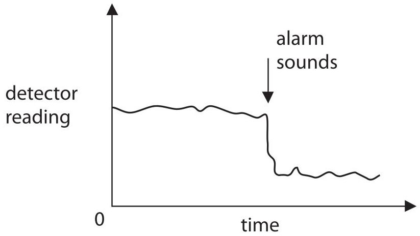

(i) Why is the detector reading never zero?

(ii) Why is the detector reading never constant?

(iii) Suggest why fewer alpha particles reach the detector if there is a fire.

(Total for Question 2 = 9 marks)

3 (a) Which statement about sound waves is correct?

(1) 

A sound waves cannot be reflected

B sound waves are electromagnetic

C sound waves are longitudinal

D sound waves are transverse

(b) A microphone is connected to a data logger, which displays each sound wave as a graph. The diagrams show the graphs for two different sound waves.

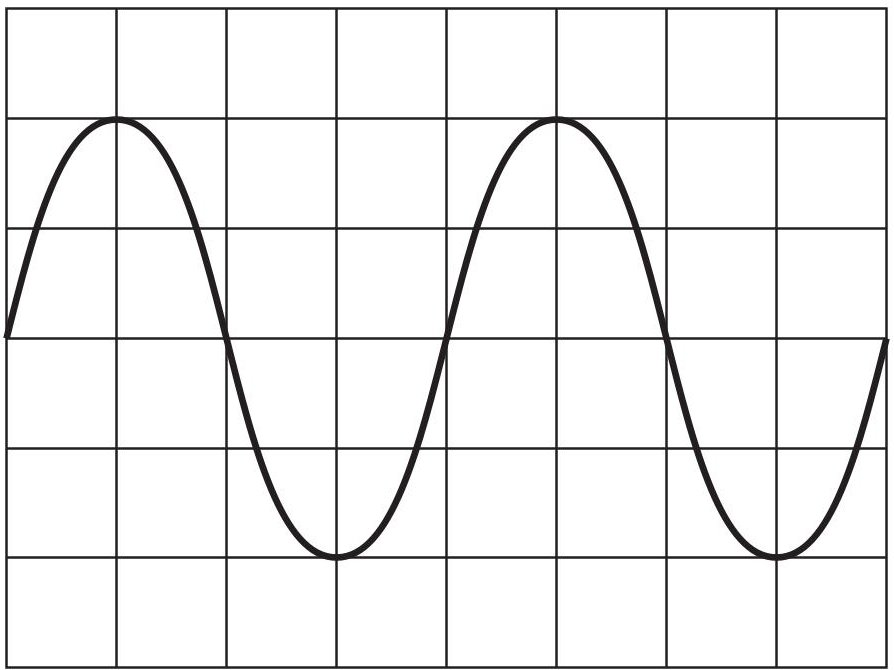

Sound wave P

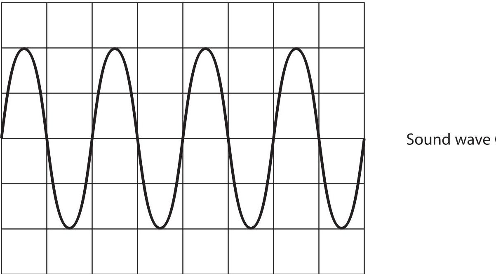

Sound wave Q

The graphs have the same scales.

In the horizontal direction: 1 square = 0.001 s

(i) The amplitude of sound wave Q is

A larger than the amplitude of sound wave P

B smaller than the amplitude of sound wave P

C the same as the amplitude of sound wave P

D zero

(ii) The frequency of sound wave P is 250 Hz. Find the time period of sound wave P.

(iii) Find the frequency of sound wave Q.

4 The diagram shows some people waiting in a queue at a supermarket.

The queue moves forward each time a person leaves the checkout. Person X spends seven minutes in the queue before reaching the checkout. The graph shows how distance changes with time for person X.

distance in m

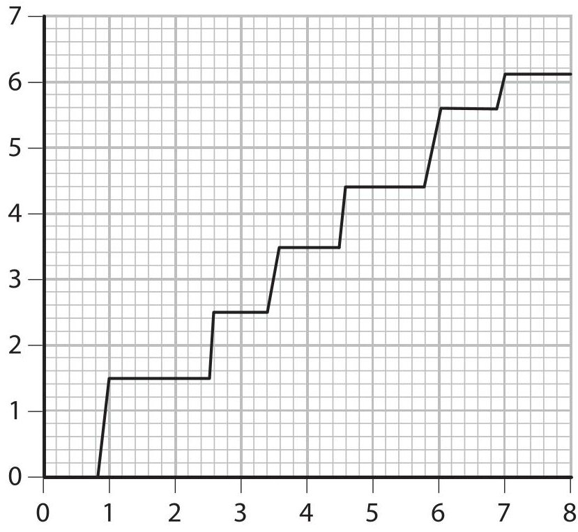

time in minutes

(a) (i) What is the initial length of the queue?

$$
\mathrm {i n i t i a l l e n g t h} =
$$

(ii) Explain how you could use the graph to work out the number of times person X is stationary.

(b) (i) State the equation linking average speed, distance moved and time taken.

(ii) Calculate the average speed of person X in the queue. Give the unit.

average speed=

(Total for Question 4 = 7 marks)

5 The diagram shows a chimney over a furnace.

A coal fire is burning in the furnace.

Air moves into the furnace and up the chimney.

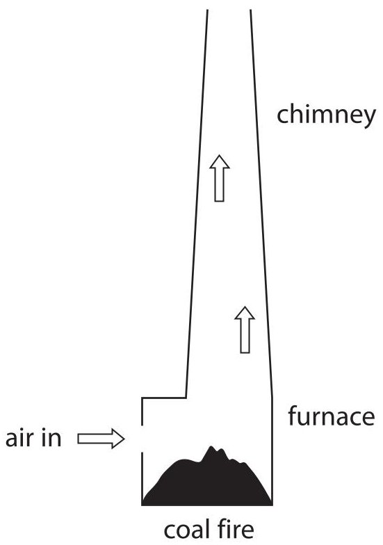

Describe how the process of convection causes this air movement.

(5) 

6 A student uses a digital calliper to measure the diameter of a knitting needle.

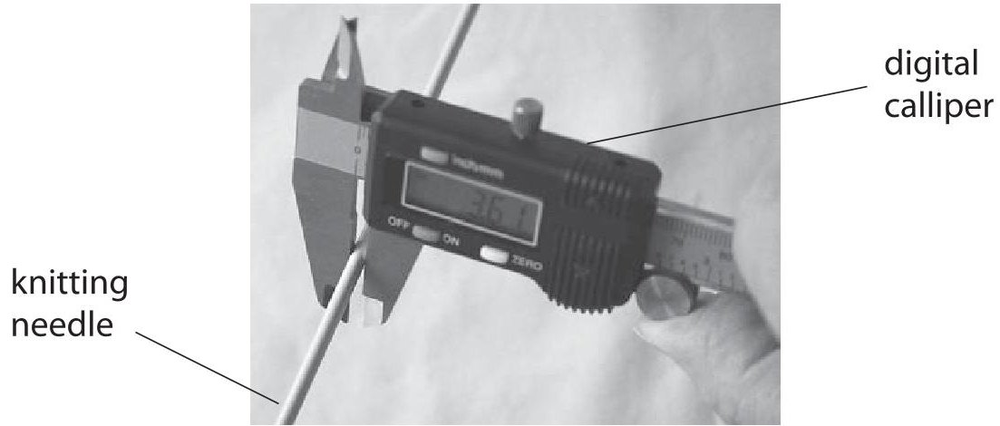

The digital calliper gives readings to the nearest 0.01 mm.

(a) The student measures the diameter of the knitting needle eight times.

These are her readings.

<table><tr><td>mm</td><td>3.60</td><td>mm</td><td>3.62</td></tr><tr><td>mm</td><td>3.63</td><td>mm</td><td>3.61</td></tr><tr><td>mm</td><td>2.65</td><td>mm</td><td>3.62</td></tr><tr><td>mm</td><td>3.60</td><td>mm</td><td>3.61</td></tr></table>

(i) Circle the anomalous reading.

(ii) Calculate the average value for the diameter of the knitting needle.

(b) The student finds more knitting needles, some of which are shown in the photographs.

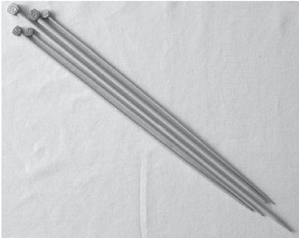

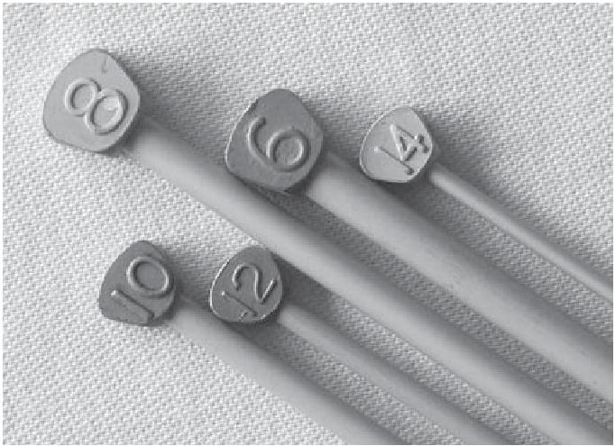

Each knitting needle is marked with a number that indicates its size.

Each number corresponds to a set diameter, as shown in the table.

<table border="1"><tr><td>Number on knitting needle</td><td>Diameter in mm</td></tr><tr><td>14</td><td>2.00</td></tr><tr><td>12</td><td>2.75</td></tr><tr><td>10</td><td>3.25</td></tr><tr><td>8</td><td>4.00</td></tr><tr><td>6</td><td>5.00</td></tr><tr><td>4</td><td>6.00</td></tr></table>

The student displays this data as a chart.

diameter in mm

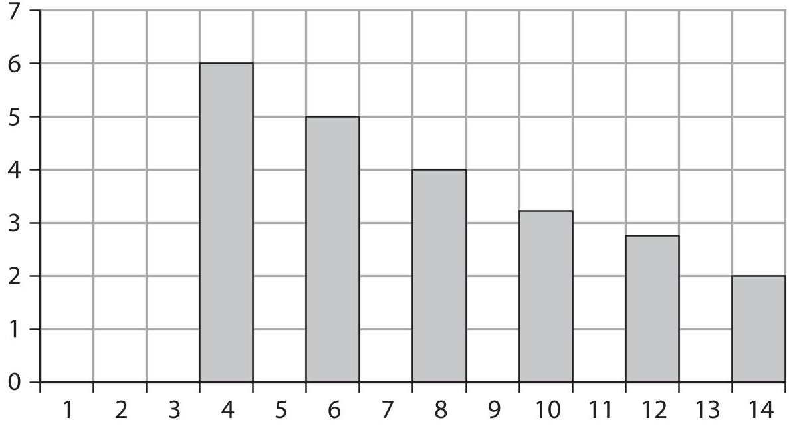

number on knitting needle

(i) Name the type of chart used by the student.

(ii) Explain why the data is best displayed using this chart rather than another type of graph.

(iii) Describe the relationship between the number on a knitting needle and its diameter.

(c) The knitting needles are not uniform in shape.

Describe how the student could measure the volume of a non-uniform shape.

(Total for Question 6 = 13 marks)

7 The photograph shows a car tyre that needs to be inflated.

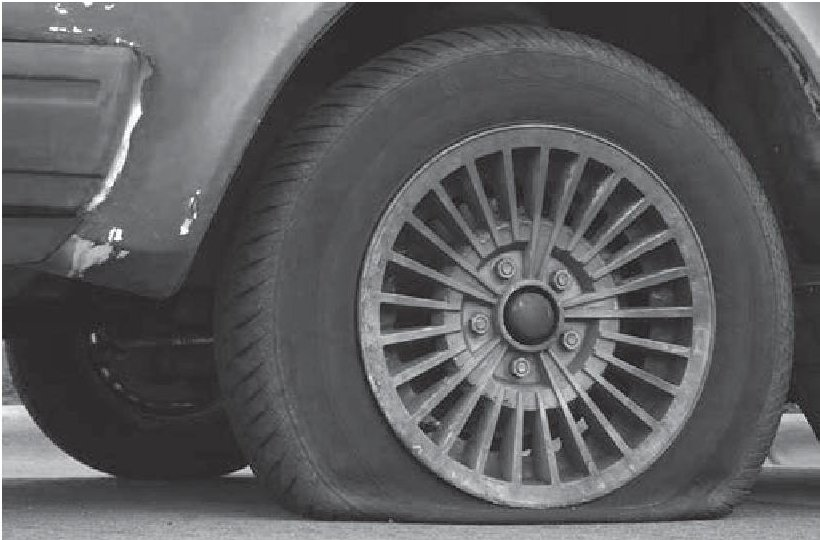

Author: Ildar Sagdejev

The tyre exerts a pressure on the road of 270 kPa.

The area of the tyre touching the road is 0.016 $ m^{2}. $

(a) (i) State the equation linking pressure, force and area.

(ii) Calculate the force exerted on the road by the tyre. Give the unit.

force = unit

(b) Use ideas about molecules to explain why the air inside the tyre exerts pressure.

(c) Air is pumped into the tyre to inflate it.

This increases the temperature and the pressure of the air in the tyre.

Use ideas about molecules to explain why the air pressure in the tyre increases.

(Total for Question 7 = 11 marks)

8 (a) A student investigates the energy transfers in a small generator. She connects the generator to a circuit that includes a lamp.

She hangs a mass from a string wound around the axle.

The lamp lights as the mass falls to the ground.

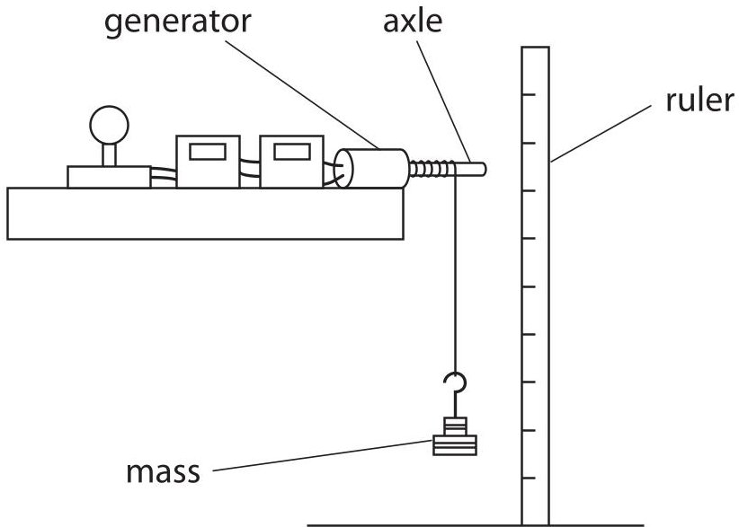

The table shows the student's results.

<table border="1"><tr><td>height that mass falls</td><td>0.61m</td></tr><tr><td>mass</td><td>2.75kg</td></tr><tr><td>time taken for mass to fall</td><td>1.3s</td></tr><tr><td>average current in the lamp</td><td>0.46A</td></tr><tr><td>average voltage across the lamp</td><td>12.7V</td></tr></table>

(i) State the equation linking gravitational potential energy, mass, g and height.

(ii) Calculate the gravitational potential energy, GPE, lost by the mass.

(iii) Explain why only some of the gravitational potential energy of the mass is transferred to the lamp.

(iv) Calculate the energy transferred to the lamp.

(b) Water from a reservoir can be used to generate electricity on a large scale. Describe the energy transfers involved in this process.

(Total for Question 8 = 10 marks)

9 The volume of a piece of brass is $ 1 6. 3 \mathrm{c m}^{3}. $

A student measures its mass using an electronic balance.

The mass of the brass is 138 g.

(a) (i) State the equation linking density, mass and volume.

(ii) Calculate the density of brass. Give the unit.

density = ... unit ...

(b) The student notices that the electronic balance has a zero error, so it shows mass readings that are all slightly too small.

This means that the density value is

A incorrect and slightly too large

B incorrect and slightly too small

C correct because the student used three significant figures

D correct because the mass of the block is more than zero

(Total for Question 9 = 5 marks)

10 A student plans to measure the resistance of a piece of wire.

He sets up this circuit and finds that it does not work.

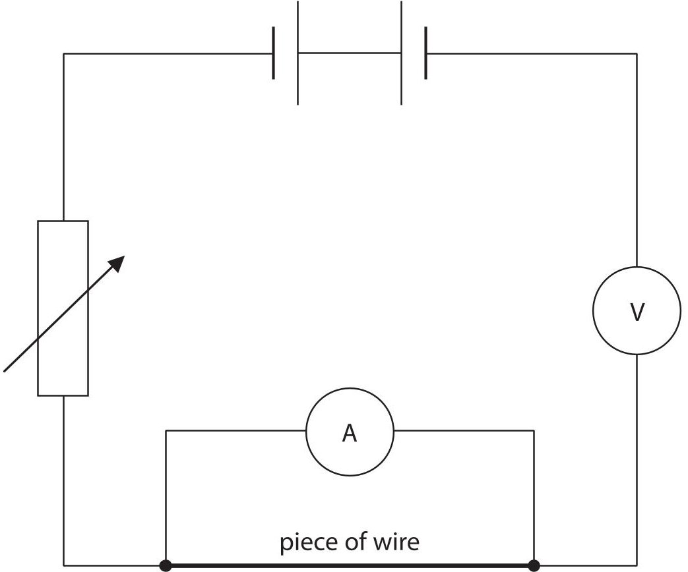

(a) Identify the three errors in the student's circuit.

(3) 

(b) The student uses a correct circuit to obtain these results.

<table border="1"><tr><td>Current in amps</td><td>Voltage in volts</td></tr><tr><td>0.00</td><td>0.0</td></tr><tr><td>0.24</td><td>1.5</td></tr><tr><td>0.71</td><td>4.5</td></tr><tr><td>0.89</td><td>6.0</td></tr><tr><td>1.00</td><td>7.5</td></tr><tr><td>1.10</td><td>9.0</td></tr></table>

(i) Plot a graph to show the relationship between current and voltage for the wire.

(5) 

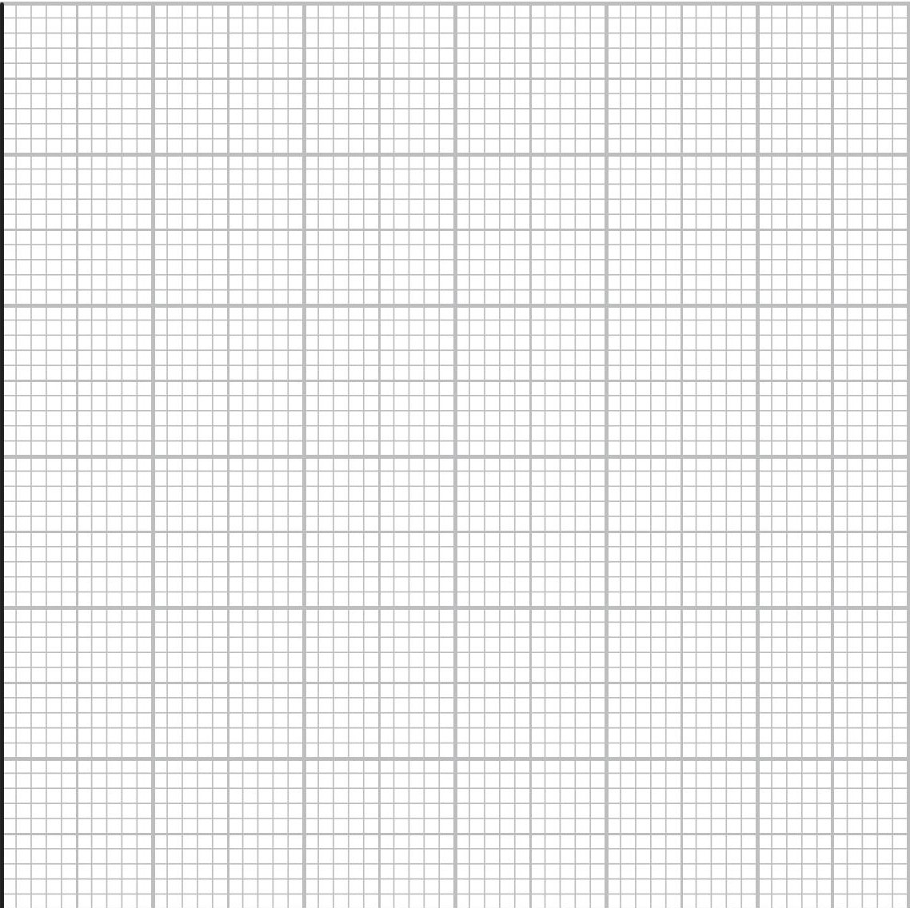

(ii) Find the current when the voltage is 2.5 V.

(iii) Suggest why the line on the graph curves.

(iv) Describe what else the student should do to find an accurate value for the resistance of the piece of wire at a constant temperature.

## (Total for Question 10 = 14 marks)

11 A student plans to measure the refractive index of glass. She traces a ray of light through a glass block as shown in the diagram.

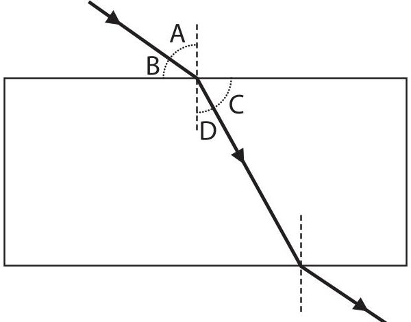

(a) Which letter represents the angle of refraction?

A

B

D

C

(b) Explain how the student can use the glass block to find an accurate value for the refractive index of glass.

12 The diagram shows a box attached to a parachute, falling at constant velocity.

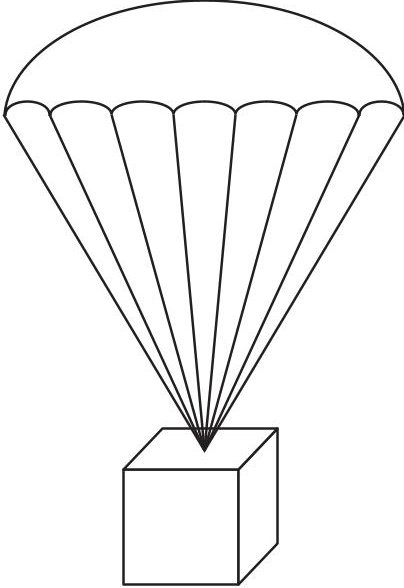

(a) State the name for this constant velocity.

(b) Explain, in terms of forces, why the box and parachute fall at constant velocity.

13 A golfer practises hitting balls on a golf course.

(a) Ball X rolls along level ground, as shown in the diagram.

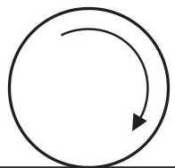

(i) Add labelled arrows to the diagram to show the directions of two of the forces acting on ball X.

(ii) Explain why ball X slows down and stops.

(b) The golfer hits ball Y at an angle into the air.

He gives it the same initial kinetic energy as ball X.

Suggest why ball Y travels much further than ball X before it stops.

(c) The mass of ball Y is 45 g.

The golfer gives the ball 36 J of kinetic energy when he hits it.

(i) State the equation linking kinetic energy, mass and speed.

(ii) Calculate the initial speed of ball Y.

$$
\mathrm {i n i t i a l s p e e d} =
$$

(iii) Ball Y reaches a maximum height of 30 m.

Suggest how the golfer should hit ball Y so it can reach a greater height.

(Total for Question 13 = 12 marks)

14 A student investigates how to produce a voltage.

He hangs a magnet from a spring, above a coil that is connected to a data logger.

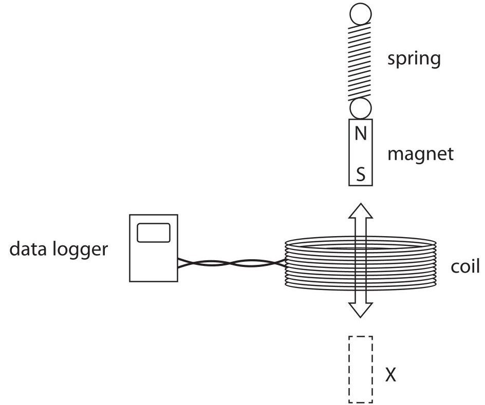

(a) The student pulls the magnet through the coil to X and then releases it. The magnet moves up and down through the coil.

The data logger produces this graph of voltage against time.

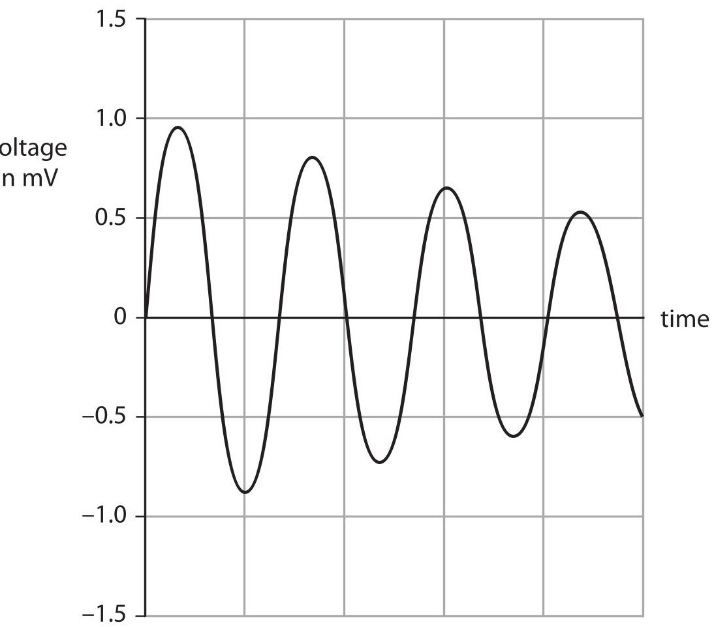

(i) Explain why the data logger records a varying voltage.

(ii) Which feature of the graph shows that the voltage is alternating?

(iii) Suggest why the voltage changes as shown by the graph.

(b) The student repeats the experiment using two magnets taped together.

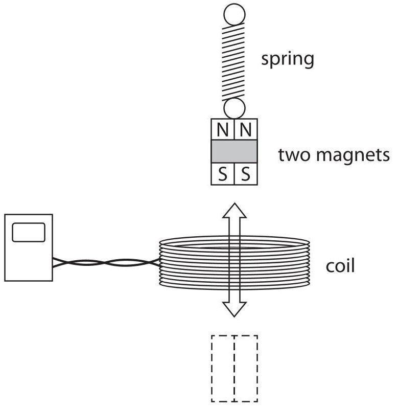

Compared to one magnet, these two magnets take a longer time to move up and down. The dotted line on the grid shows the original graph for one magnet.

On the same grid, sketch the graph that would be produced using two magnets.

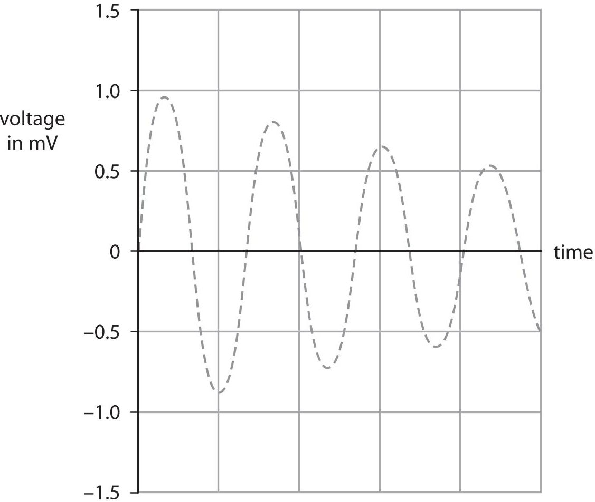

15 In 1969, astronauts left a reflector on the surface of the Moon.

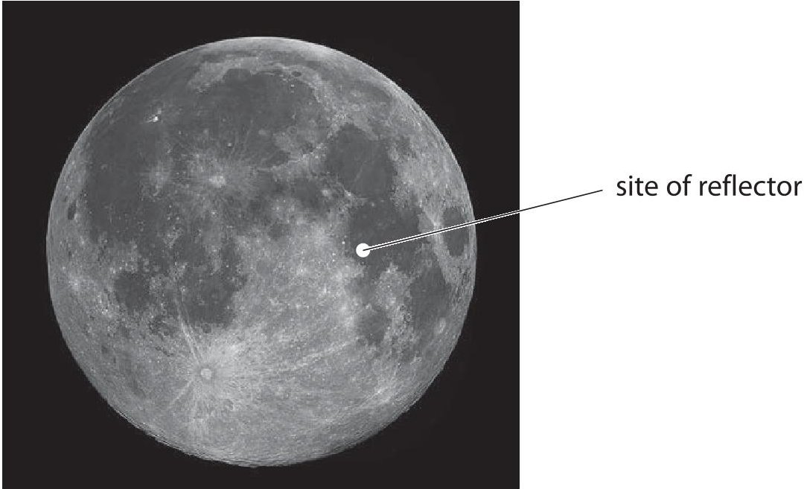

Author: Gregory H. Revera

The reflector consists of mirrors at 90° to each other.

Scientists on Earth aim light from a laser at the reflector.

This light reflects back to them.

(a) The diagram shows two mirrors in the reflector.

Complete the diagram to show the path of the ray of light.

(2) 

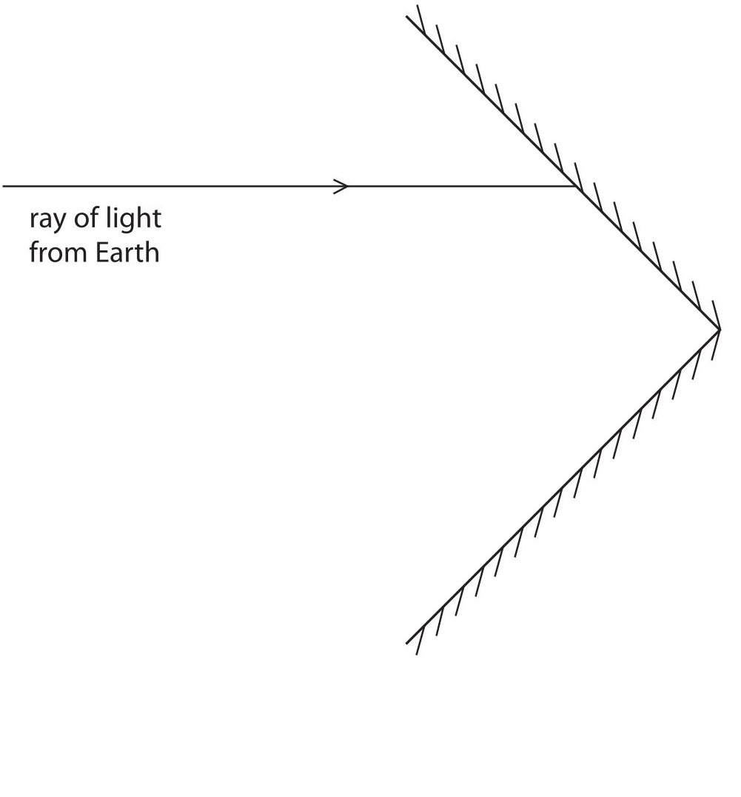

(b) The speed of light in a vacuum is 300 000 km/s.

The average time for a ray of light to travel to the Moon and back is about 2.6 s.

Show that the Moon is about 400 000 km from the Earth.

(c) Scientists measure the time for the light to travel to the Moon and back very accurately, but the time is different every day.

The graph shows how these times change over the period of one month.

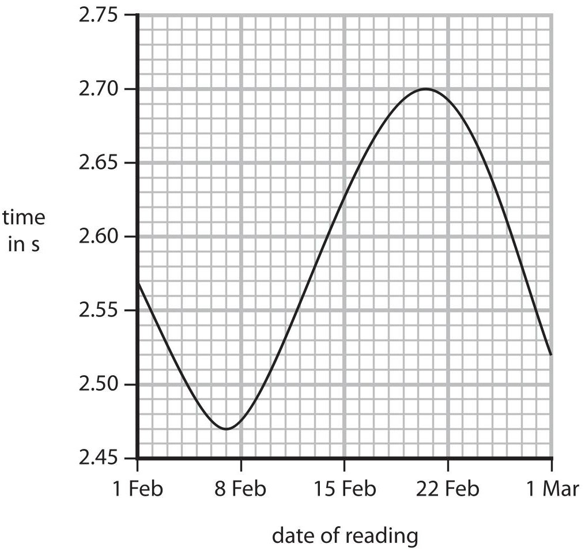

(i) Suggest what can be deduced about the orbit of the Moon from the information in the graph.

(ii) The scientists also discovered that the average time for light to travel to the Moon and back increases gradually every year.

What further information does this give about the orbit of the Moon?

(Total for Question 15 = 9 marks)

## TOTAL FOR PAPER=120 MARKS

## BLANK PAGE

