<table><tr><td colspan="3">Write your name here</td></tr><tr><td>Surname</td><td colspan="2">Other names</td></tr><tr><td>Pearson Edexcel Certificate
Pearson Edexcel
International GCSE</td><td>Centre Number</td><td>Candidate Number</td></tr><tr><td colspan="3">Physics
Unit: KPH0/4PH0
Science (Double Award) KSC0/4SC0
Paper: 1P</td></tr><tr><td colspan="2">Tuesday 19 January 2016 – Afternoon
Time: 2 hours</td><td>Paper Reference
KPH0/1P 4PH0/1P
KSC0/1P 4SC0/1P</td></tr><tr><td colspan="3">You must have:
Ruler, calculator, protractor</td></tr><tr><td colspan="3">Total Marks</td></tr></table>

## Instructions

- Use black ink or ball-point pen.

- Fill in the boxes at the top of this page with your name, centre number and candidate number.

- Answer all questions.

- Answer the questions in the spaces provided

- there may be more space than you need.

- Show all the steps in any calculations and state the units.

- Some questions must be answered with a cross in a box . If you change your mind about an answer, put a line through the box and then mark your new answer with a cross.

## Information

- The total mark for this paper is 120.

- The marks for each question are shown in brackets

- use this as a guide as to how much time to spend on each question.

## Advice

- Read each question carefully before you start to answer it.

- Write your answers neatly and in good English.

- Try to answer every question.

- Check your answers if you have time at the end.

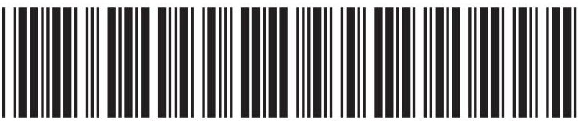

## EQUATIONS

You may find the following equations useful.

$$
\mathrm {e n e r g y t r a n s f e r r e d} = \mathrm {c u r r e n t} \times \mathrm {v o l t a g e} \times \mathrm {t i m e}
$$

$$
E = I \times V \times t
$$

$$
\mathrm {p r e s s u r e} \times \mathrm {v o l u m e} = \mathrm {c o n s t a n t}
$$

$$
p _ {1} \times V _ {1} = p _ {2} \times V _ {2}
$$

$$
\mathrm {f r e q u e n c y} = \frac {1}{\mathrm {t i m e p e r i o d}}
$$

$$
f = \frac {1}{T}
$$

$$
\mathrm {p o w e r} = \frac {\mathrm {w o r k d o n e}}{\mathrm {t i m e t a k e n}}
$$

$$
P = \frac {W}{t}
$$

$$
\mathrm {p o w e r} = \frac {\mathrm {e n e r g y t r a n s f e r r e d}}{\mathrm {t i m e t a k e n}}
$$

$$
P = \frac {W}{t}
$$

$$
\mathrm {o r b i t a l s p e e d} = \frac {2 \pi \times \mathrm {o r b i t a l r a d i u s}}{\mathrm {t i m e p e r i o d}}
$$

$$
v = \frac {2 \times \pi \times r}{T}
$$

Where necessary, assume the acceleration of free fall, g=10 m/s $ ^{2}. $

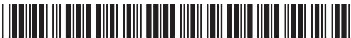

## Answer ALL questions.

1. The Sun emits visible light, infrared and ultraviolet that travel through space and reach the surface of the Earth.

(a) State two similarities between visible light, infrared and ultraviolet.

(b) Too much exposure to infrared and ultraviolet can cause damage to the human body. State the damage that each can cause.

infrared.

ultraviolet..

(c) Seven colours can be seen in the visible light spectrum. Which colour has the longest wavelength?

(Total for Question 1 = 5 marks)

2 (a) All metals are good conductors of electricity. Which of these non-metals can conduct electricity?

A carbon

B chalk

C plastic

D rubber

(b) The current in a metallic conductor is a flow of

A negatively charged electrons

B negatively charged protons

C positively charged electrons

D positively charged protons

(c) Some metals and alloys are magnetic. Which of these is magnetic?

aluminium

(1) 

B copper

C gold

D steel

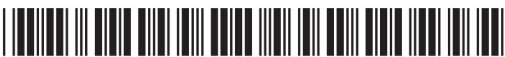

(d) Which of these field patterns is correct?

A

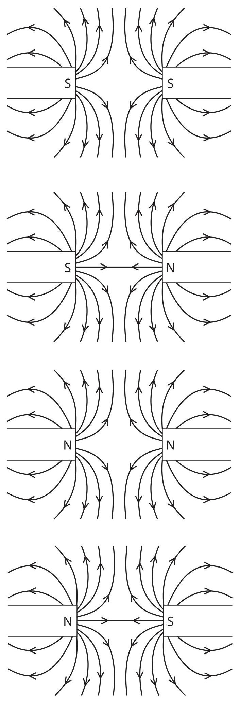

D

(Total for Question 2 = 4 marks)

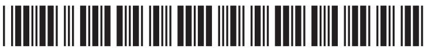

3 The diagram shows four planets, P, Q, R and S, orbiting a star.

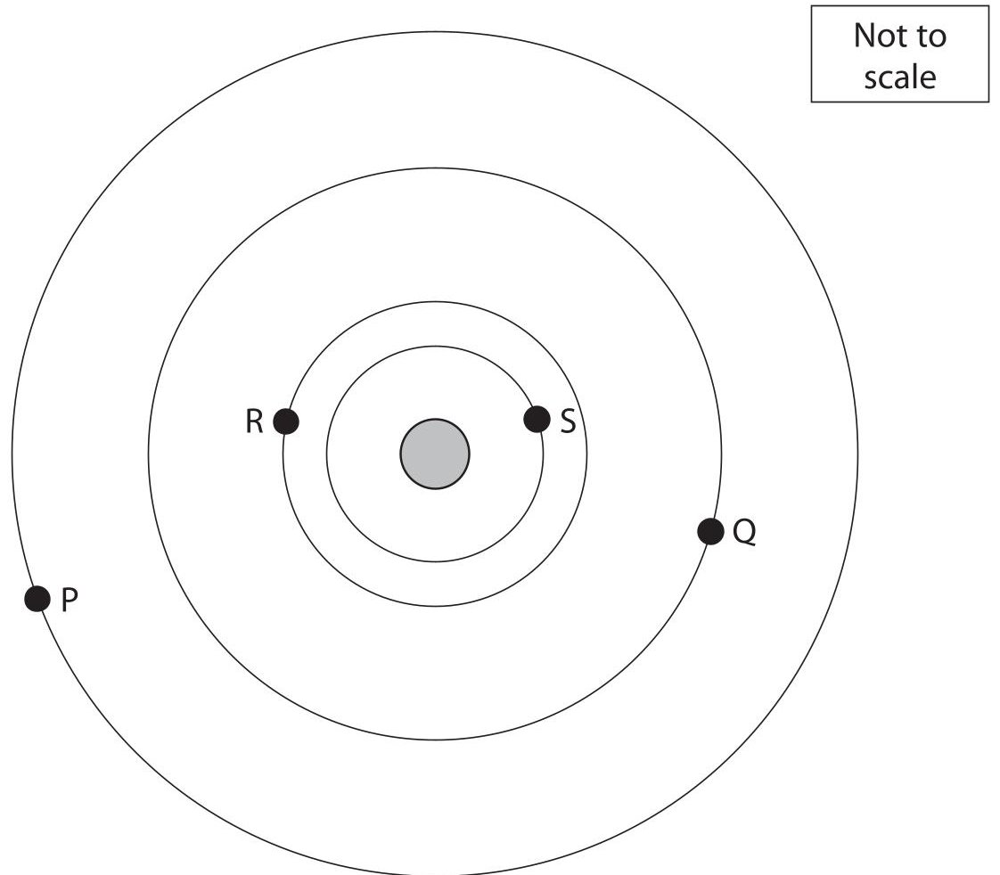

(a) This combination of planets and a star is most like

A a galaxy

B the Milky Way

C the Solar System

D the universe

(b) Planet Q has a moon. On the diagram, draw the orbit of this moon.

(c) On the diagram, draw the orbit of a comet.

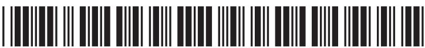

(d) Planets nearer to the star take less time to orbit the star.

(i) Suggest why.

(ii) Planet P makes one complete orbit. During this time

A planet R makes more orbits than S

B planet R makes fewer orbits than Q

C planet S makes more orbits than P

D planet Q makes fewer orbits than P

(e) As the planets orbit the star, the distances between the planets change.

Planet P is 200 million km from the star and planet R is 50 million km from the star.

(i) Calculate the maximum distance between planet P and planet R.

maximum distance = million km

(ii) Calculate the minimum distance between planet P and planet R.

minimum distance = million km

4 The diagram shows an air track that can be used to investigate motion.

Air comes out through a series of small holes in the air track.

A small glider floats on a cushion of air.

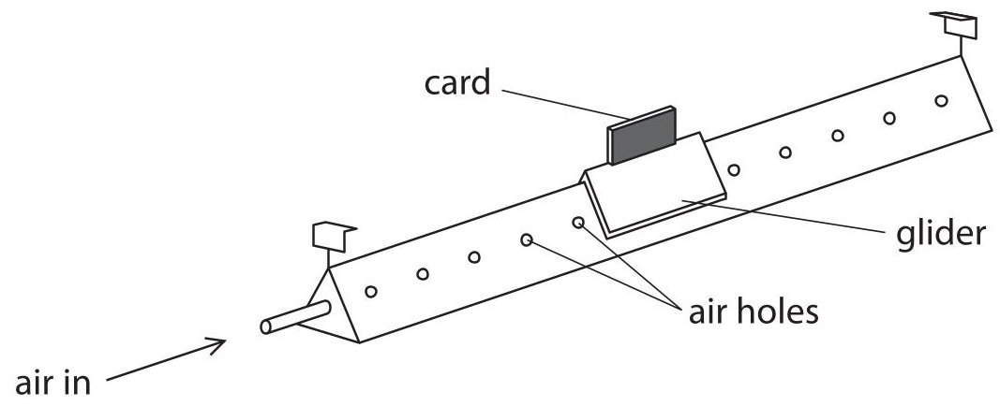

(a) (i) The diagram below shows the glider at rest on the air track.

Complete the diagram to show the forces acting on the glider. Label the forces. One force arrow has been drawn for you.

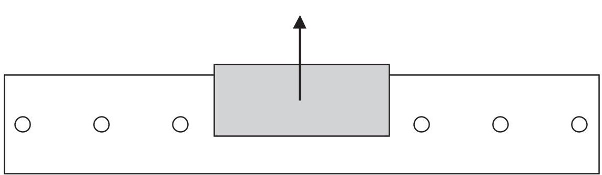

(ii) Explain what effect the cushion of air has on the movement of the glider.

(2) 

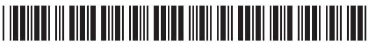

(b) Two light gates connected to a data logger are placed above the air track so that the card will pass through them.

The glider moves at a constant speed to the right.

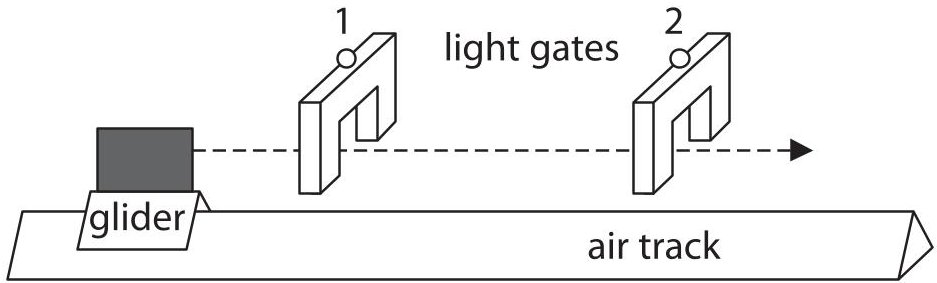

The length of the card is 8.3 cm.

The card takes 314 ms to pass through the first light gate.

(i) State the relationship between average speed, distance moved and time taken.

(ii) Calculate the average speed of the card as it passes through the first light gate.

average speed =

(iii) State the time taken for the card to pass through the second light gate.

time taken =

(Total for Question 4 = 9 marks)

5 (a) A student investigates the resistance of a lamp.

(i) The student uses a circuit that contains an ammeter, a battery, a lamp and a voltmeter to determine the resistance of the lamp.

Draw a circuit diagram to show how he should connect the apparatus.

(ii) State the relationship between voltage, current and resistance.

(iii) The student obtains this graph for a filament lamp.

current in A

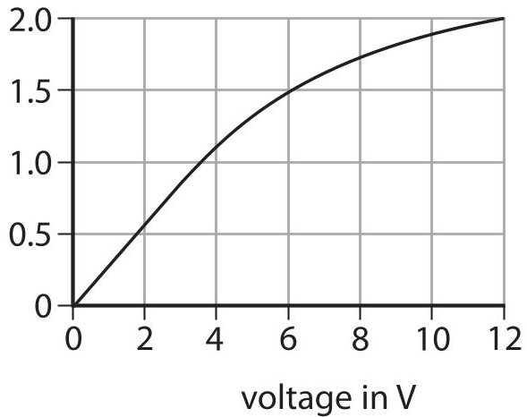

Calculate the resistance of the lamp when the voltage is 6.0 V. Give the unit.

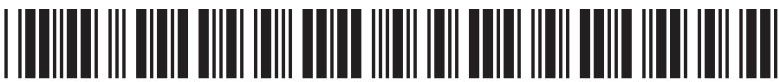

(iv) The student reverses the battery connections and then repeats his measurements. On the axes below, sketch the graph that he would obtain. Part of the graph has been done for you.

current in A

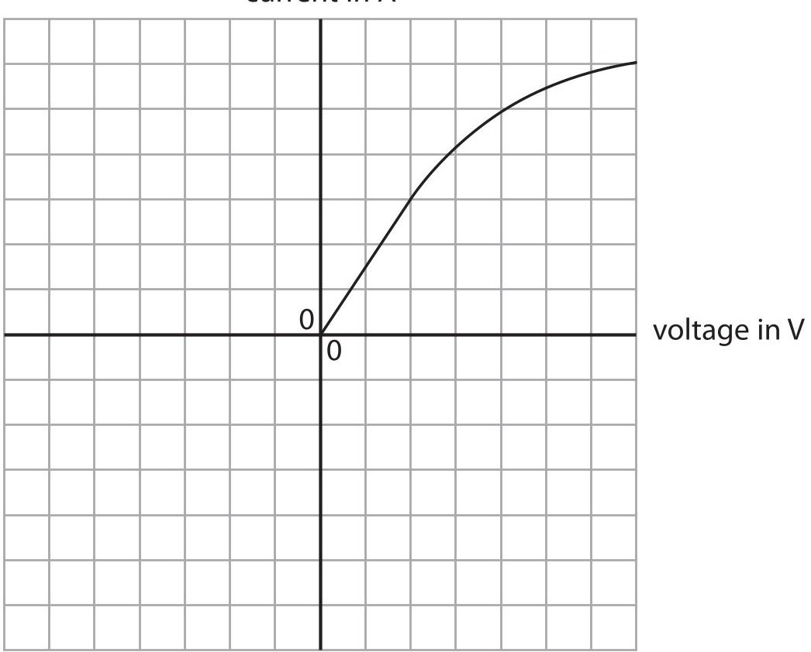

(b) The student replaces the filament lamp with a light emitting diode (LED). He notices that there is no current in the diode when the battery is reversed. He replaces the battery with an a.c. supply.

Which graph shows how the current in the diode varies with time?

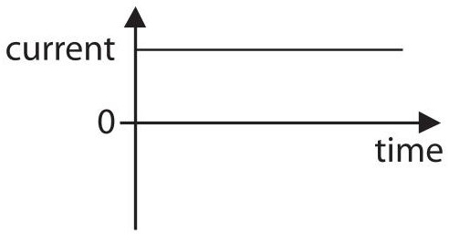

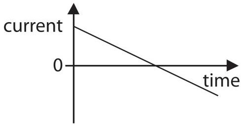

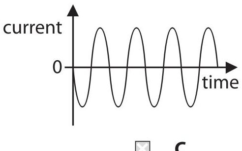

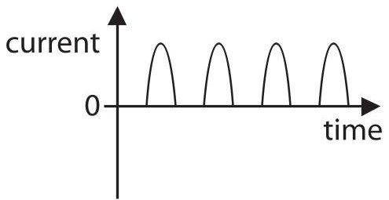

(Total for Question 5 = 10 marks)

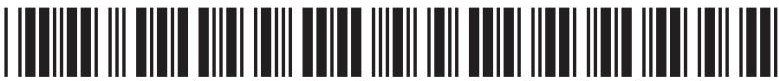

6 (a) Which diagram shows the reflection of a ray of light at a plane mirror?

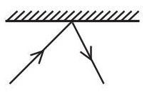

A

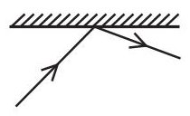

B

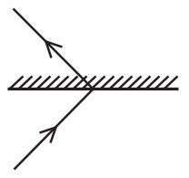

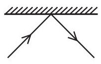

C

D

(b) The diagram below shows a ray of light as it passes from air into a glass block. The angle of incidence is $ 4 3^{\circ} $ and the light is refracted as shown.

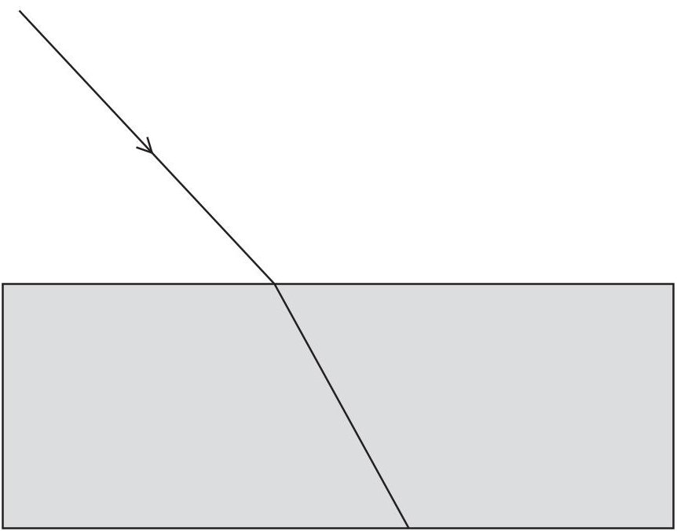

(i) On the diagram, draw the normal for this refraction.

(ii) On the diagram, mark the angle of refraction.

(iii) Measure the angle of refraction.

$$
\mathrm {a n g l e o f r e f r a c t i o n} = \dots \dots

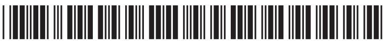

(iv) State the relationship between refractive index, angle of incidence and angle of refraction.

(v) Calculate the refractive index of the glass.

(c) The diagram shows how light can travel in a glass fibre.

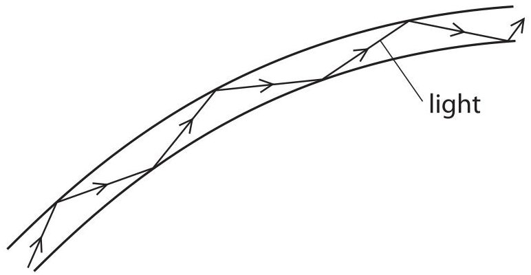

(i) What is the name given to the effect shown?

(ii) Explain what is happening to the light in the glass fibre.

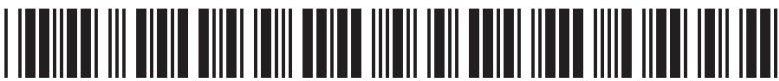

7 Scientists use the term radiation in different ways.

Sometimes radiation means streams of particles and sometimes radiation means high frequency waves.

(a) Draw a straight line from each description to the type of radiation it describes.

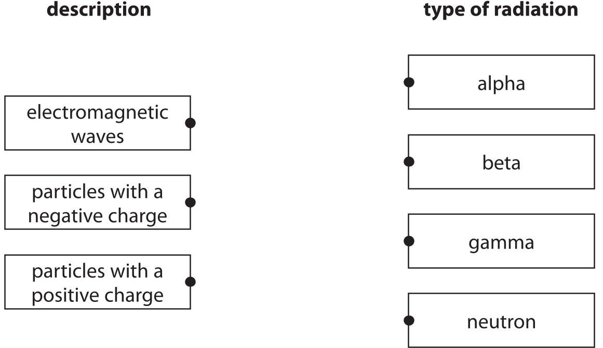

(b) Alpha, beta and gamma radiations are described as ionising.

(i) Complete the table to show alpha, beta and gamma radiations in order of increasing ionisation.

(1) 

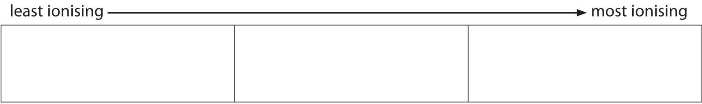

(ii) Describe two ways in which these ionising radiations can cause harm.

(2) 

(c) People who work with ionising radiations need to measure the amount of radiation they are exposed to.

For many years, a film badge was used to detect the radiations.

The diagram shows how a film badge is constructed.

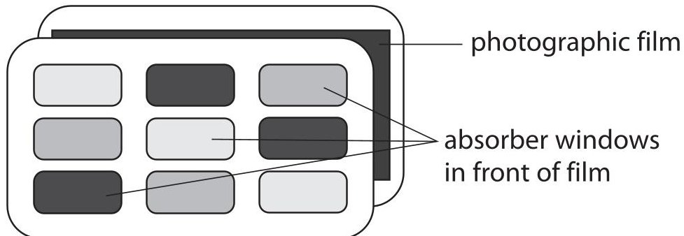

Each absorber window is made from different thicknesses of paper, aluminium or lead.

Complete the table to show if alpha, beta and gamma radiations penetrate each material. Some have been done for you.

Use the words 'goes through' or 'stopped'.

<table border="1"><tr><td></td><td>0.1cm paper</td><td>0.5cm aluminium</td><td>0.5cm lead</td></tr><tr><td>alpha radiation</td><td></td><td></td><td>stopped</td></tr><tr><td>beta radiation</td><td></td><td>stopped</td><td></td></tr><tr><td>gamma radiation</td><td>goes through</td><td></td><td></td></tr></table>

(d) State the name of another device that can be used to detect alpha radiation.

(1) 

(Total for Question 7 = 10 marks)

8 (a) A student uses this apparatus to investigate electromagnetic induction.

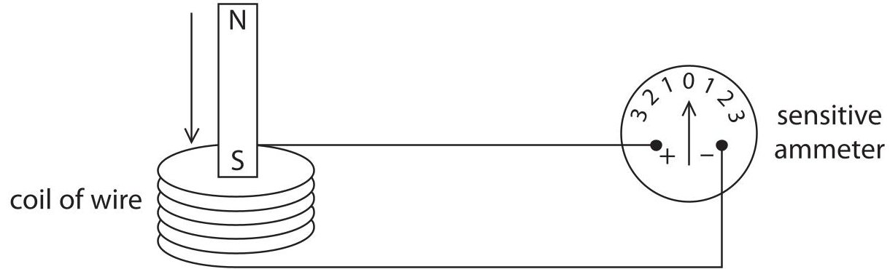

When the S pole of the magnet is moved into the coil, the pointer on the sensitive ammeter moves to the left.

Describe two ways that the student can make the pointer move to the right.

(b) The student has a bicycle with a dynamo (generator) that supplies electricity for its lights. The diagram shows the dynamo.

Key

The friction wheel, W, presses against the bicycle tyre. When the student pedals, the friction wheel turns and causes part Y to rotate.

<table border="1"><tr><td>W</td><td>friction wheel</td></tr><tr><td>X</td><td>axle</td></tr><tr><td>Y</td><td></td></tr><tr><td>Z</td><td></td></tr></table>

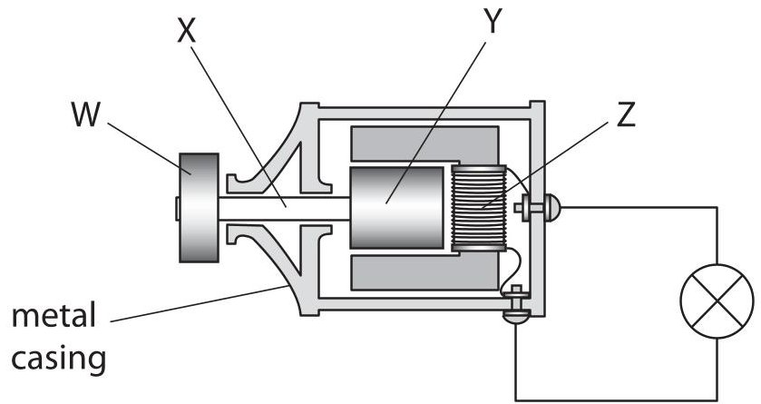

(i) Complete the key for the diagram by giving the names of parts Y and Z.

(2) 

(ii) The graph shows how the output voltage of the dynamo varies with time as the student pedals steadily.

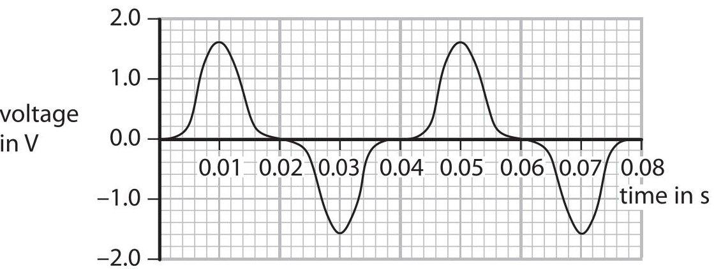

State the maximum output voltage of the dynamo.

$$
\mathrm {m a x i m u m o u t p u t v o l t a g e} =
$$

(iii) Calculate the frequency of the output voltage.

(iv) Which row of the table is correct when the friction wheel turns faster?

<table border="1"><tr><td></td><td>Output voltage is</td><td>Frequency of output voltage is</td></tr><tr><td>A</td><td>lower</td><td>lower</td></tr><tr><td>B</td><td>higher</td><td>lower</td></tr><tr><td>C</td><td>higher</td><td>higher</td></tr><tr><td>D</td><td>lower</td><td>higher</td></tr></table>

(v) Apart from changing the speed of the friction wheel, suggest how the output voltage of the dynamo can be increased.

(c) The student cycles for 290 s.

Her dynamo produces a constant useful power output of 3.1 W and is 72% efficient.

(i) Calculate the total useful energy output.

useful energy output=

(ii) State the relationship between efficiency, useful energy output and total energy input.

(iii) Calculate the total energy input.

total energy input=

(Total for Question 8 = 16 marks)

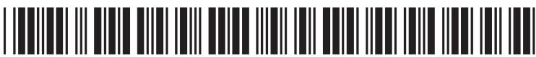

9 A resistance band is a stretchy plastic band that is used when doing exercises.

The diagram shows a student exercising his leg by stretching a resistance band fixed to a wall.

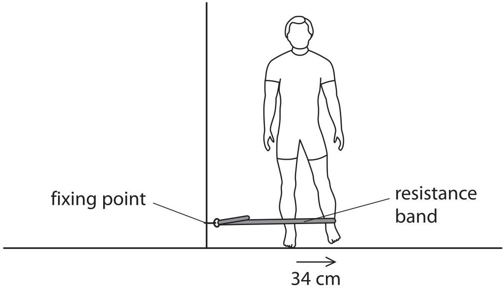

The student moves his leg 34 cm sideways as shown. The average resistance force is 23 N.

(a) (i) State the relationship between work done, force and distance moved.

(ii) Calculate the work done when the student moves his leg sideways once.

work done =

(b) The student repeats this movement 15 times in 1 minute.

Calculate the average power of the student during this exercise.

power = ... W

(Total for Question 9 = 6 marks)

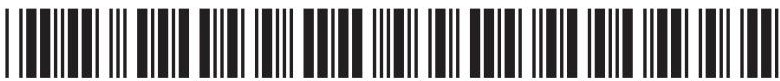

10 Aneroid barometers are used to measure air pressure.

A student makes a model aneroid barometer as shown.

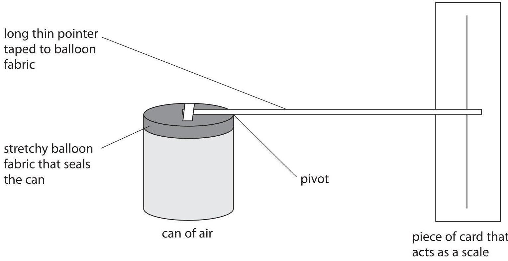

(a) (i) The balloon fabric is attached to the can to stop the air escaping.

Explain how the air inside the can causes a pressure on the balloon fabric.

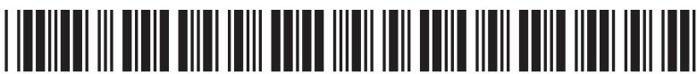

(ii) The balloon fabric is tight and flat. The pointer is horizontal as shown.

Explain what happens to the different parts of the model when the atmospheric pressure increases. [You may assume that the temperature remains constant.]

(iii) Suggest two ways that the model could be altered to increase its sensitivity to changes in atmospheric pressure.

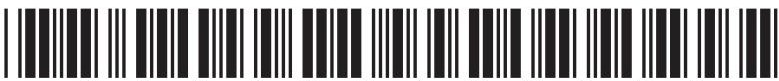

(b) The student heats the air in her can by placing the can in a water bath.

(i) State how this affects the reading shown by the pointer.

(ii) Explain why this happens.

(Total for Question 10 = 12 marks)

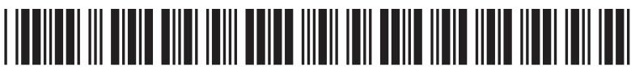

11 A student investigates the extension of an elastic band for different forces.

(a) (i) List the laboratory apparatus that the student needs for this investigation.

(ii) Extension, force and temperature are variables for this investigation. Draw a line from each variable to its type.

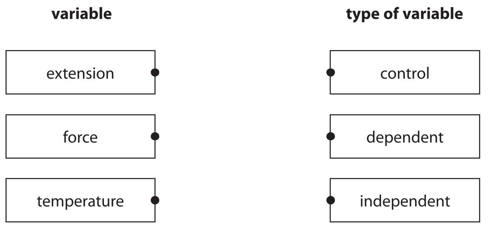

(iii) Describe how the student can measure the extension of the elastic band when he adds a force of 12 N.

(2) 

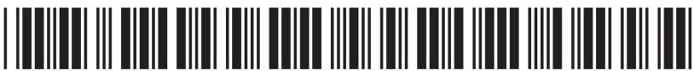

(b) The student obtains this data as he first adds weights to the elastic band (loading) and as he then removes weights from the band (unloading).

<table border="1"><tr><td rowspan="2">Force in N</td><td>Extension in cm</td></tr><tr><td>Loading</td></tr><tr><td>0</td><td>0.0</td></tr><tr><td>2</td><td>2.3</td></tr><tr><td>4</td><td>5.3</td></tr><tr><td>6</td><td>9.8</td></tr><tr><td>8</td><td>15.3</td></tr><tr><td>10</td><td>20.0</td></tr></table>

<table border="1"><tr><td rowspan="2">Force in N</td><td>Extension in cm</td></tr><tr><td>Unloading</td></tr><tr><td>0</td><td>0.0</td></tr><tr><td>1</td><td>1.4</td></tr><tr><td>3</td><td>5.0</td></tr><tr><td>7</td><td>14.8</td></tr><tr><td>9</td><td>19.1</td></tr><tr><td>10</td><td>20.0</td></tr></table>

He plots the loading data on a graph as shown.

(i) Suggest how the student could improve the quality of his data.

(ii) Draw a curve of best fit through the loading data.

(iii) On the same axes, plot the unloading data.

(iv) Draw a curve of best fit through the unloading data.

(v) The student concludes that the band is an elastic material and that it obeys Hooke's law.

Discuss whether his conclusion is correct. You should support your argument with data.

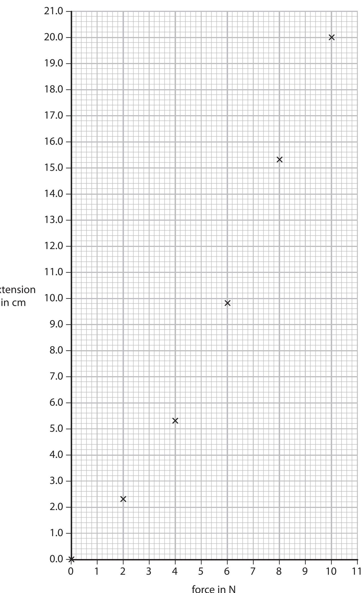

(Total for Question 11 = 16 marks)

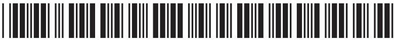

12 An experimental solar updraft tower (SUT) was built in the south of Spain.

This part of Spain has little rainfall and is hot in summer months.

The SUT was used as a 50 kW electricity generator.

The diagram shows the component parts of the tower.

The cover allows visible light to pass through but traps infrared. Rows of blocks under the cover absorb thermal radiation.

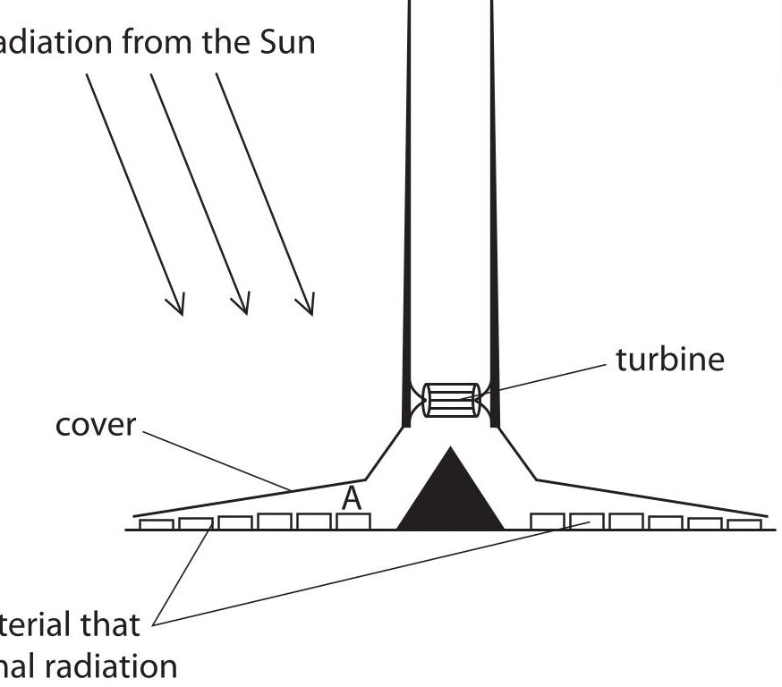

Not to scale

blocks of material that absorb thermal radiation

(a) (i) Explain what happens to the air at A just under the cover.

(3) 

(ii) On the diagram, mark the directions of the air movements over the blocks of material and through the turbine.

(iii) State the name of this effect.

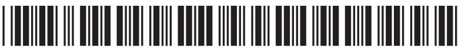

(b) (i) Complete the energy transfer diagram for a SUT.

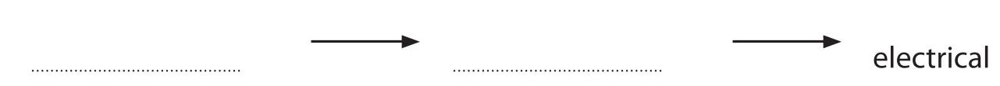

(ii) Describe how a SUT can be used to generate electricity.

(c) (i) Suggest why the SUT generates most electricity during daylight hours.

(ii) Suggest why there are blocks of material that absorb thermal radiation in the SUT.

(iii) Suggest an alternative to these blocks that would improve the total energy output of the SUT.

(Total for Question 12 = 13 marks)

TOTAL FOR PAPER = 120 MARKS

## BLANK PAGE

Every effort has been made to contact copyright holders to obtain their permission for the use of copyright material. Pearson Education Ltd. will, if notified, be happy to rectify any errors or omissions and include any such rectifications in future editions.

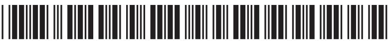
