<table><tr><td colspan="3">Write your name here</td></tr><tr><td>Surname</td><td colspan="2">Other names</td></tr><tr><td>Pearson Edexcel International GCSE</td><td>Centre Number</td><td>Candidate Number</td></tr><tr><td colspan="3">Physics
Unit: 4PH0
Science (Double Award) 4SC0
Paper: 1PR</td></tr><tr><td colspan="2">Wednesday 25 May 2016 – Afternoon
Time: 2 hours</td><td>Paper Reference
4PH0/1PR
4SC0/1PR</td></tr><tr><td colspan="3">You must have:
Ruler, protractor, calculator</td></tr><tr><td colspan="3">Total Marks</td></tr></table>

## Instructions

- Use black ink or ball-point pen.

- Fill in the boxes at the top of this page with your name, centre number and candidate number.

- Answer all questions.

- Answer the questions in the spaces provided

- there may be more space than you need.

- Show all the steps in any calculations and state the units.

## Information

- The total mark for this paper is 120.

- The marks for each question are shown in brackets

- use this as a guide as to how much time to spend on each question.

## Advice

- Read each question carefully before you start to answer it.

- Write your answers neatly and in good English.

- Try to answer every question.

- Check your answers if you have time at the end.

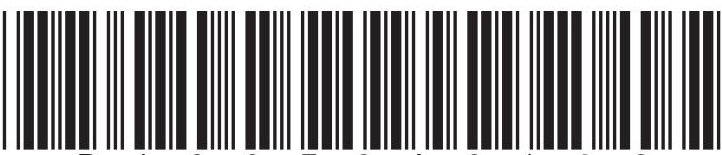

## EQUATIONS

You may find the following equations useful.

$$
\mathrm {e n e r g y t r a n s f e r r e d} = \mathrm {c u r r e n t} \times \mathrm {v o l t a g e} \times \mathrm {t i m e}
$$

$$
E = I \times V \times t
$$

$$
\mathrm {p r e s s u r e} \times \mathrm {v o l u m e} = \mathrm {c o n s t a n t}
$$

$$
p _ {1} \times V _ {1} = p _ {2} \times V _ {2}
$$

$$
f r e q u e n c y = \frac {1}{t i m e p e r i o d}
$$

$$
f = \frac {1}{T}
$$

$$
\mathrm {p o w e r} = \frac {\mathrm {w o r k d o n e}}{\mathrm {t i m e t a k e n}}
$$

$$
P = \frac {W}{t}
$$

$$
\mathrm {p o w e r} = \frac {\mathrm {e n e r g y t r a n s f e r r e d}}{\mathrm {t i m e t a k e n}}
$$

$$
P = \frac {W}{t}
$$

$$
\mathrm {o r b i t a l s p e e d} = \frac {2 \pi \times \mathrm {o r b i t a l r a d i u s}}{\mathrm {t i m e p e r i o d}}
$$

$$
v = \frac {2 \times \pi \times r}{T}
$$

$$
\frac {\mathrm {p r e s s u r e}}{\mathrm {t e m p e r a t u r e}} = \mathrm {c o n s t a n t}
$$

$$
\frac {p _ {1}}{T _ {1}} = \frac {p _ {2}}{T _ {2}}
$$

$$
\mathrm {f o r c e} = \frac {\mathrm {c h a n g e i n m o m e n t u m}}{\mathrm {t i m e t a k e n}}
$$

Where necessary, assume the acceleration of free fall, g=10 m/s $ ^{2}. $

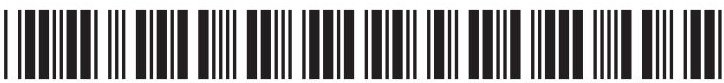

## Answer ALL questions.

1 This question is about electrical components.

(a) Draw a straight line from each electrical component to its correct symbol.

One has been done for you.

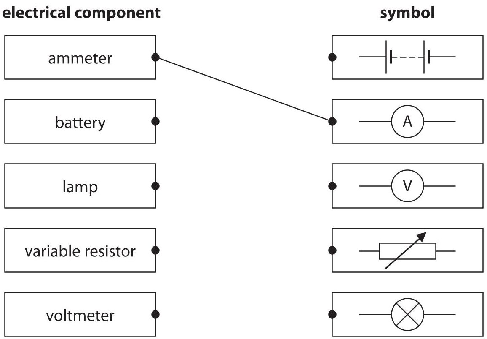

(b) (i) Name an electrical component whose resistance decreases when it is moved into brighter light.

(ii) Name an electrical component whose resistance decreases as its temperature increases.

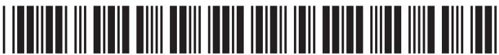

2 (a) These sentences are about astronomy.

Complete the sentences by writing words in the blank spaces.

The Earth is an astronomical object.

One astronomical object smaller than the Earth is ...

Two astronomical objects larger than the Earth are ... and .

The Milky Way is the name given to our...

(b) The diagram shows the path followed by a comet as it moves around the Sun. A, B, C, D and E are points on the comet's orbit.

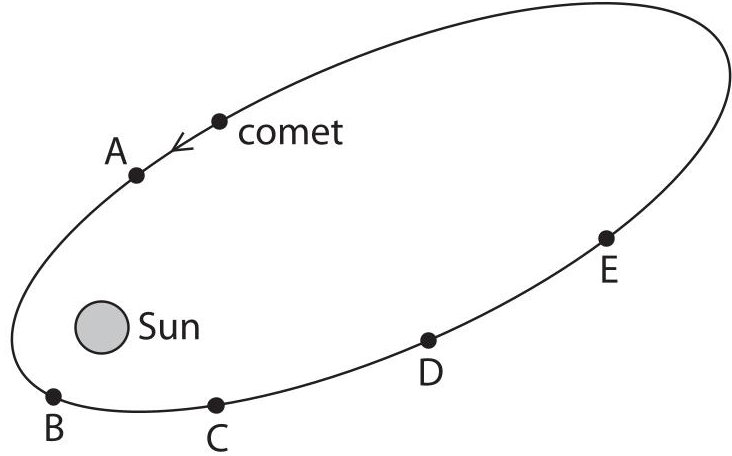

(i) State the name of the force that causes the comet to orbit the Sun.

(ii) At which of the points shown is the force on the comet greatest?

(iii) Draw an arrow at point D to show the direction of the force acting on the comet.

(iv) At which of the points shown does the comet have the greatest kinetic energy?

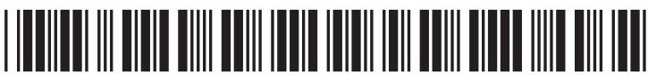

## BLANK PAGE

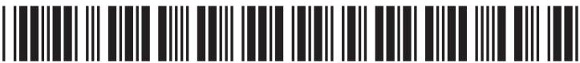

3 The diagram shows some gas particles in a container.

The piston can be moved in or out to change the volume of the gas.

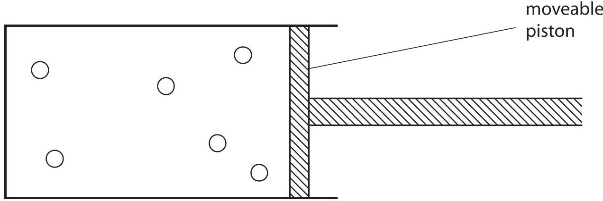

(a) Add arrows to the diagram to show the random motion of the gas particles.

(b) Explain how the motion of the gas particles produces a pressure inside the container.

(c) State what would happen to the pressure if you pushed the piston into the container without changing the temperature.

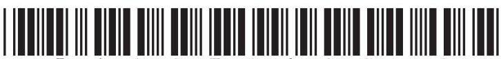

(d) When the gas in the container is heated, the piston moves outwards.

Place ticks ( $ \checkmark $ ) against the three correct statements.

<table border="1"><tr><td>Statement</td><td>Tick(√)</td></tr><tr><td>the gas particles get bigger</td><td></td></tr><tr><td>the mass of the gas particles stays the same</td><td></td></tr><tr><td>the gas particles move faster</td><td></td></tr><tr><td>the average distance between the gas particles increases</td><td></td></tr><tr><td>the temperature of the gas decreases</td><td></td></tr></table>

(Total for Question 3 = 9 marks)

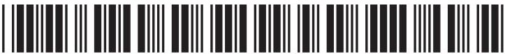

4 A teacher demonstrates different types of wave.

(a) He uses a spring to demonstrate longitudinal waves.

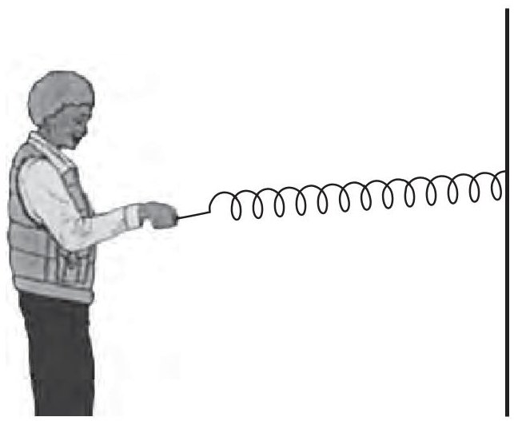

(i) Draw arrows on the diagram to show the directions in which the teacher moves his hand.

(ii) Give an example of a longitudinal wave.

(b) The teacher then demonstrates transverse waves.

He fixes a vertical rod in a pond.

He places a small wooden ring on the rod.

The ring floats on the water and moves up and down the rod as waves go past.

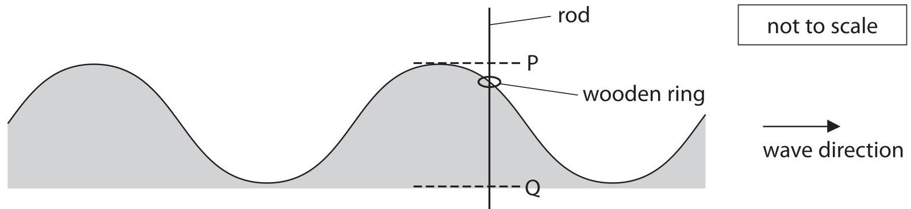

(i) On the diagram, draw a line to show one wavelength. Label your line with the letter W.

(1) 

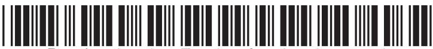

(ii) The distance from P to Q is 5.0 cm.

Determine the amplitude of the wave.

$$
\mathrm {a m p l i t u d e} =
$$

(iii) The wooden ring reaches point P every 15 s.

Calculate the frequency of the wave.

Give the unit.

frequency=

(iv) Explain how the movement of the wooden ring demonstrates that this wave is transverse.

(v) The wave shown is a water wave.

Give a different example of a transverse wave.

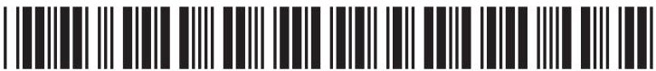

5 The diagram shows a type of power station used to generate electricity.

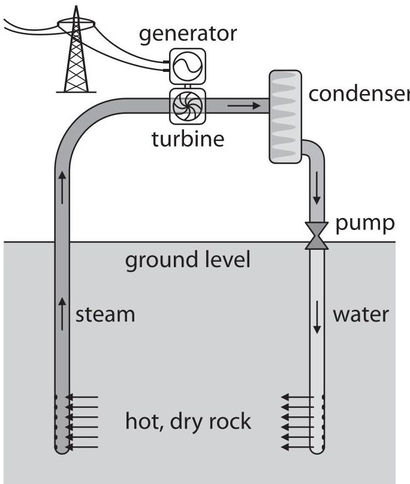

(a) (i) What type of renewable resource does this power station use?

(ii) Name another renewable resource.

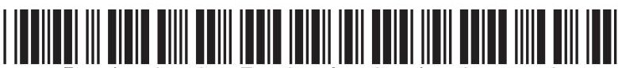

(b) Cold water is pumped down into the hot, dry rock.

Describe the energy transfers at each stage of electricity generation from this resource.

(Total for Question 5 = 6 marks)

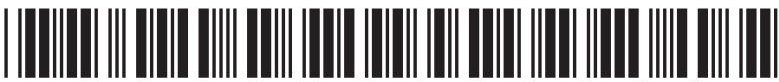

6 This question is about pressure in a liquid.

a) A teacher uses this apparatus to demonstrate pressure difference in water.

The apparatus is hollow and has three short tubes at different depths.

The teacher completely fills the apparatus with water.

Water comes out of all the tubes

Water comes out of all the tubes.

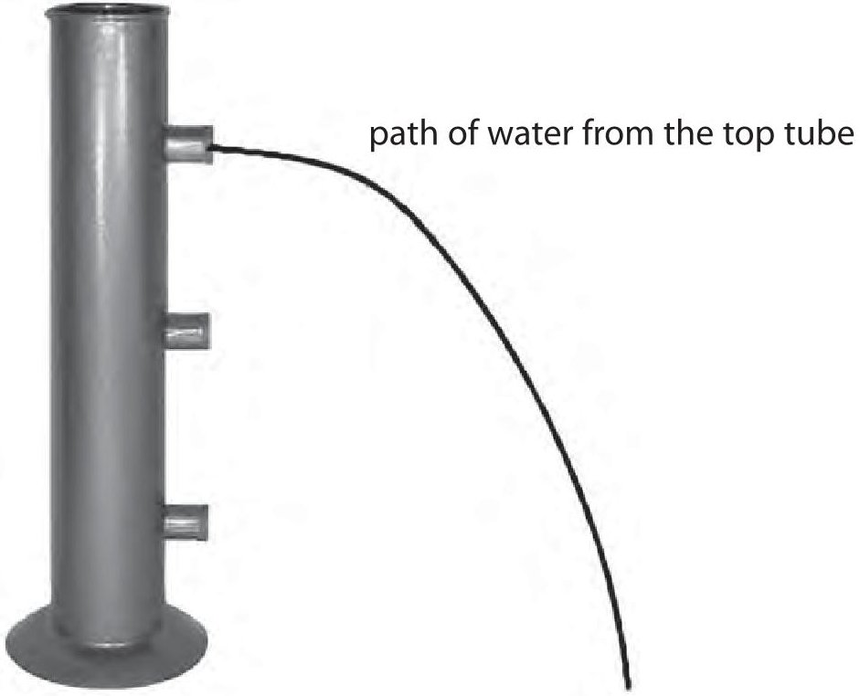

(i) State the relationship between pressure difference, height, density and g.

(ii) The diagram shows the path of water coming from the top tube.

Complete the diagram by drawing the paths of water you would expect to see from the other two tubes.

(iii) Explain the pattern of the paths of water from the tubes.

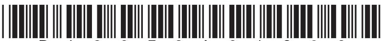

(b) In another demonstration, the teacher uses this container.

The container is made of glass and each section has a different shape.

The teacher pours water into the container until it reaches the level shown in the left-hand section.

water level

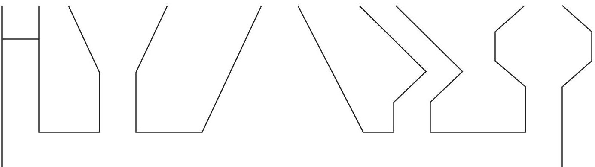

(i) Complete the diagram by drawing the water levels in the other four sections.

(ii) Explain why the water fills the container in the way you have shown.

(Total for Question 6 = 8 marks)

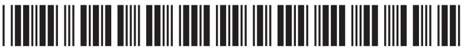

## BLANK PAGE

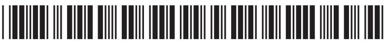

7 A student uses a semicircular glass block to investigate refraction in glass.

(a) List three other pieces of equipment that he needs for this investigation.

(b) He shines a ray of light into the block at point P, as shown. P is the middle of the flat surface.

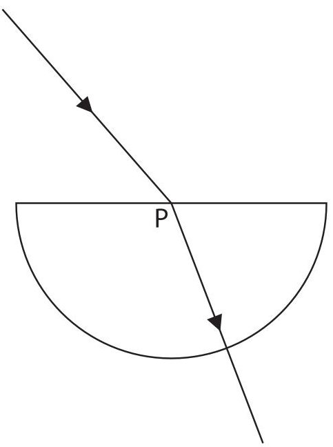

(i) On the diagram, draw the normal at P.

(ii) Measure the angle of incidence and the angle of refraction.

angle of incidence angle of refraction

(iii) Explain why the ray of light changes direction at P.

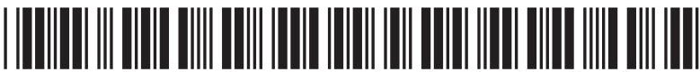

(c) The student varies the angle of incidence and obtains this table of results.

<table border="1"><tr><td>Angle of incidence i</td><td>Angle of refraction r</td><td>sin i</td><td>sin r</td></tr><tr><td>11°</td><td>7°</td><td>0.19</td><td>0.12</td></tr><tr><td>24°</td><td>15°</td><td>0.41</td><td>0.26</td></tr><tr><td>47°</td><td>28°</td><td>0.73</td><td>0.47</td></tr><tr><td>65°</td><td>36°</td><td>0.91</td><td>0.59</td></tr><tr><td>90°</td><td>40°</td><td>1.00</td><td>0.64</td></tr></table>

(i) Plot a graph of sin i against sin r.

(4) 

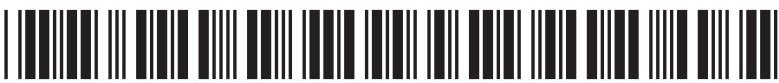

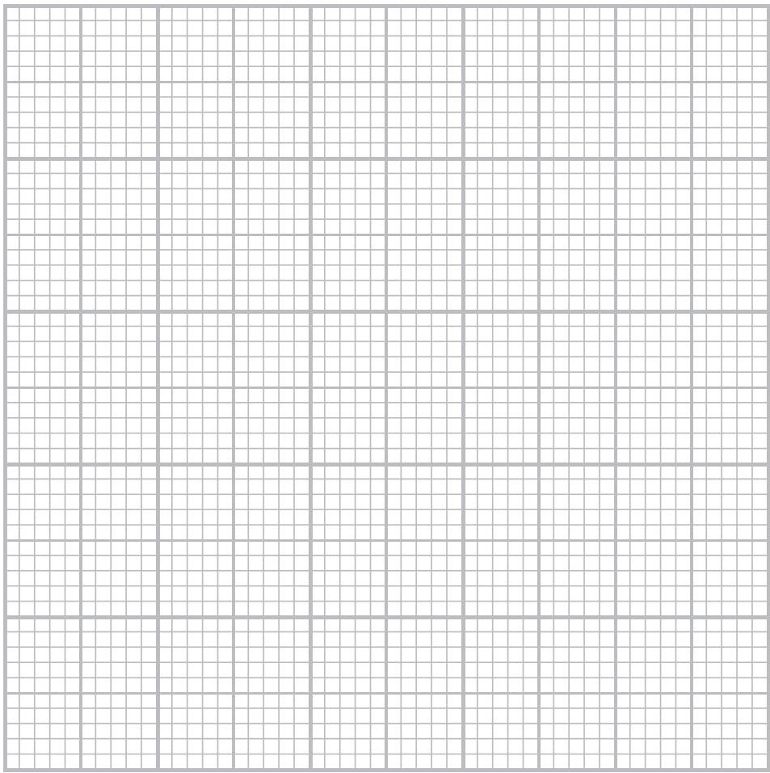

(ii) Draw the straight line of best fit.

(iii) State the relationship between refractive index, angle of incidence and angle of refraction.

(iv) Use your graph to find the refractive index of glass.

refractive index = ...

(Total for Question 7 = 16 marks)

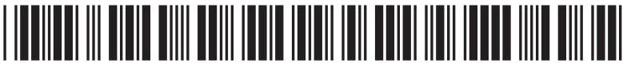

8 The table shows information about three electrical appliances.

<table border="1"><tr><td>Appliance</td><td>Power in W</td><td>Current in A</td></tr><tr><td>lamp</td><td>40</td><td>0.17</td></tr><tr><td>clothes iron</td><td>2200</td><td>9.6</td></tr><tr><td>television</td><td>110</td><td></td></tr></table>

(a) (i) State the relationship between power, current and voltage.

(ii) Calculate the current in the television. [assume that the mains voltage is 230 V]

(b) The photographs show the different cables used for the clothes iron and the lamp.

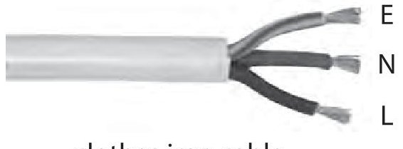

clothes iron cable

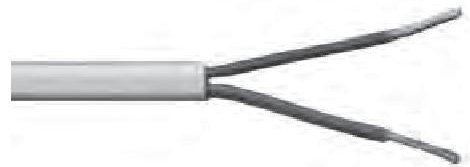

lamp cable

(i) Suggest why the wires in the clothes iron cable are thicker than the wires in the lamp cable.

(1) 

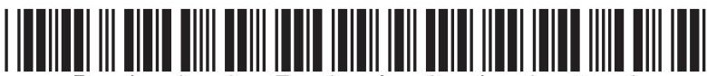

(ii) The clothes iron cable has three wires, E, N and L. Which of these wires is connected to the fuse?

(iii) Suggest why the lamp is safe to use, even though its cable only has two wires.

(c) The lamp is switched on for 55 minutes.

Calculate the energy transferred by the lamp in this time.

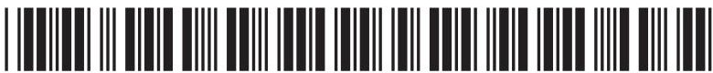

9 Tritium is an isotope of hydrogen that decays by emitting beta particles. It is used in some luminous signs.

(a) (i) The symbol for tritium is $ _{1}^{3}H $ Determine the number of protons and the number of neutrons in a single atom of tritium.

number of protons .. number of neutrons

(ii) Describe three differences between an alpha particle and a beta particle.

(iii) Suggest why tritium cannot emit alpha particles.

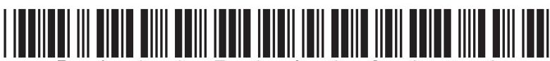

(b) Tritium is used in this luminous sign.

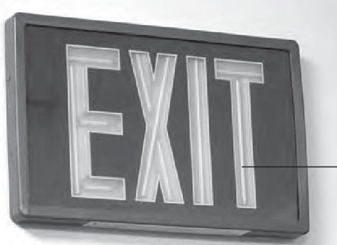

glass tube containing tritium gas

- the letters are made up of glass tubes containing tritium gas

In this sign

- the inside of each tube is coated with a phosphor

- the phosphor emits light when beta particles hit it

Suggest why this sign is safe to use even though beta particles are ionising and can be dangerous.

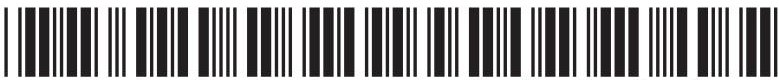

(c) The graph shows how the activity of tritium in this luminous sign varies with time.

activity in counts per minute

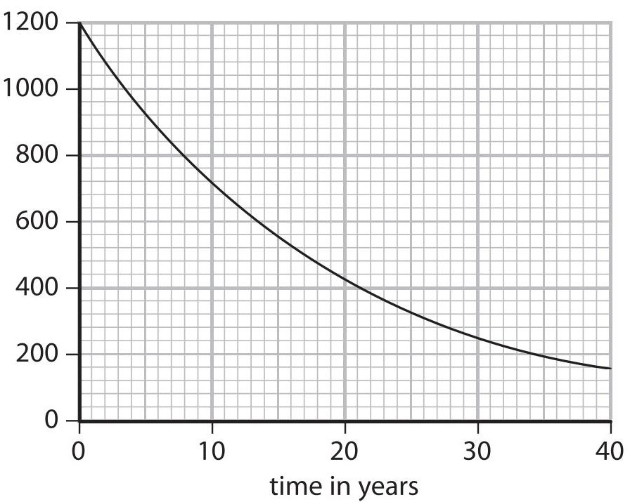

(i) Explain what is meant by the term half-life.

(ii) Use the graph to estimate the half-life of tritium. Show your working.

(d) The manufacturer of this luminous sign claims that the sign will work for more than 20 years.

The minimum activity required for the tubes to emit sufficient light is 400 counts per minute.

Evaluate the manufacturer's claim.

(Total for Question 9 = 14 marks)

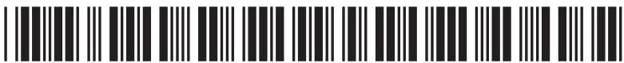

10 The diagram shows a metal device for cooking potatoes.

Potatoes are pushed onto the metal spikes.

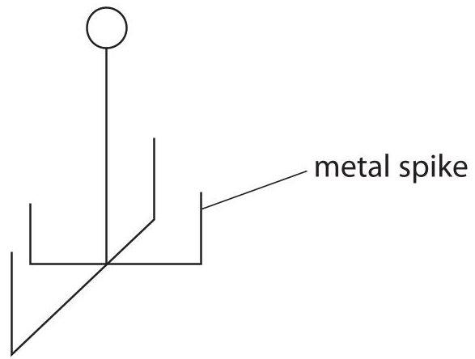

The photograph shows two potatoes cooking in an electric oven.

The inside of the oven is black.

The heating element is at the bottom of the oven.

black inside (of oven)

heating element

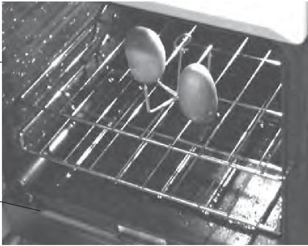

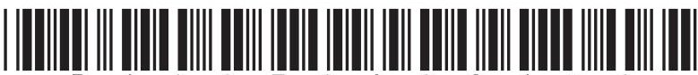

Describe the different ways in which energy is transferred to cook the potatoes.

(Total for Question 10 = 6 marks)

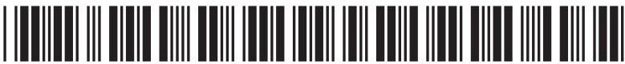

11 A hot-air balloon is tied to the ground by two ropes.

The diagram shows the forces acting on the balloon.

The tension T in each rope is 200 N.

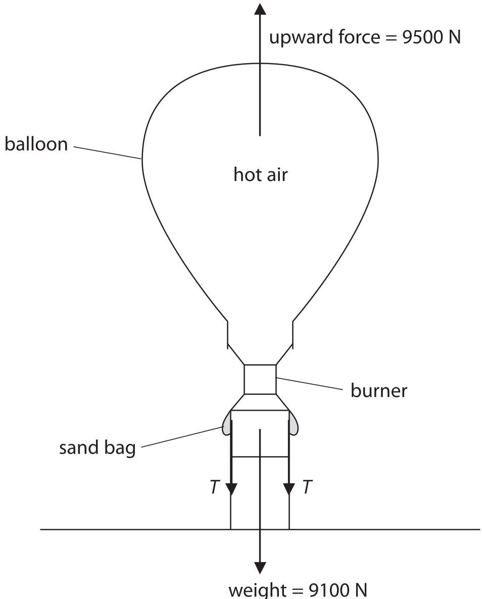

The ropes are untied and the balloon starts to move upwards.

(a) State the value of the force acting downwards on the balloon immediately after the ropes are untied and before the balloon starts moving.

$$
\mathrm {f o r c e d o w n w a r d s} =
$$

(b) (i) State the relationship between unbalanced force, mass and acceleration.

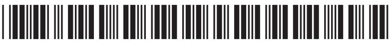

(ii) The balloon has a total mass of 910 kg.

The initial unbalanced force on the balloon is 400 N upwards.

Calculate the initial acceleration.

$$
\mathrm {i n i t i a l a c c e l e r a t i o n} =
$$

(c) Explain how the upward acceleration of the balloon changes during the first few seconds of its flight.

(d) While the balloon is still accelerating, the pilot controls the balloon by pouring some sand from the bags.

Explain how this affects the upward acceleration of the balloon.

(Total for Question 11 = 9 marks)

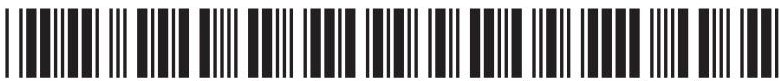

12 A student uses this apparatus to investigate the pressure and volume inside a sealed gas syringe.

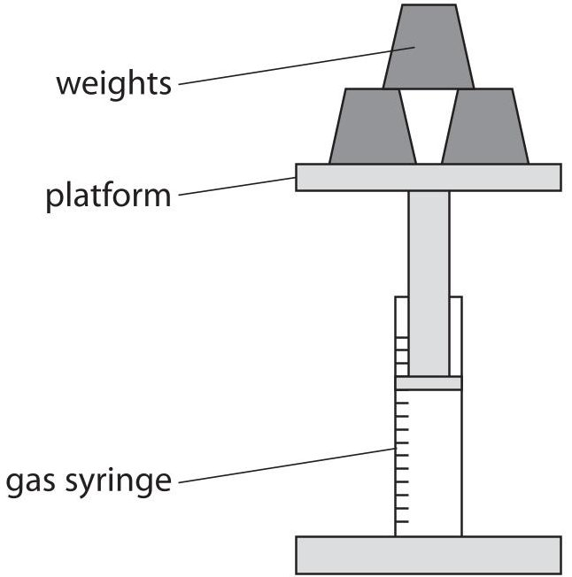

She takes readings of the volume as she increases the pressure (loading) and as she decreases the pressure (unloading).

These are her results.

<table border="1"><tr><td rowspan="2">Pressure in kPa</td><td colspan="3">Volume of gas in cm3</td></tr><tr><td>loading</td><td>unloading</td><td>average(mean)</td></tr><tr><td>100</td><td>50</td><td>50</td><td>50</td></tr><tr><td>90</td><td>56</td><td>55</td><td>55.5</td></tr><tr><td>84</td><td>60</td><td>60</td><td>60</td></tr><tr><td>55</td><td>90</td><td></td><td>92</td></tr><tr><td>60</td><td>85</td><td>83</td><td>84</td></tr><tr><td>50</td><td>101</td><td>101</td><td>101</td></tr></table>

(a) (i) Complete the table by filling in the missing value.

(ii) Suggest why the student takes readings for increasing the pressure and for decreasing the pressure.

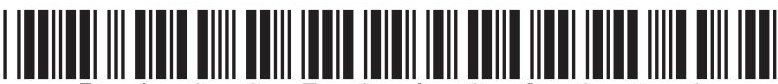

(b) The student plots this graph.

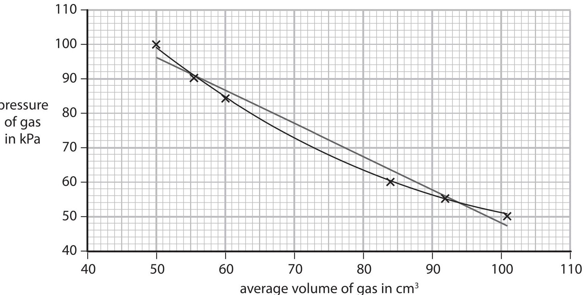

(i) Suggest a reason why the axes do not start from the origin (0,0).

(ii) The student has drawn both a straight line of best fit and a curve of best fit. Discuss which line is correct for this investigation.

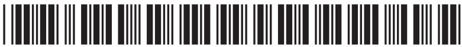

(iii) Suggest a way that the student could make this experiment valid (a fair test).

(iv) Suggest two ways in which the student could improve the quality of her data.

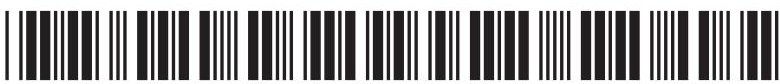

(c) The student concludes that her data validates the relationship between pressure and volume of a fixed mass of gas.

Use data from this table to evaluate her conclusion.

<table border="1"><tr><td>Pressure in kPa</td><td>Average volume in cm3</td><td>Space for calculations</td></tr><tr><td>100</td><td>50</td><td></td></tr><tr><td>90</td><td>55.5</td><td></td></tr><tr><td>84</td><td>60</td><td></td></tr><tr><td>55</td><td>92</td><td></td></tr><tr><td>60</td><td>84</td><td></td></tr><tr><td>50</td><td>101</td><td></td></tr></table>

(Total for Question 12 = 12 marks)

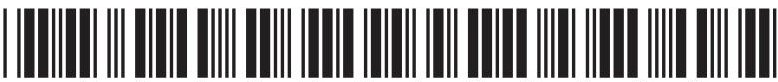

## BLANK PAGE

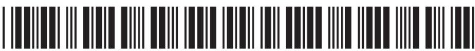

13 (a) A student uses this apparatus to investigate what happens to a current-carrying conductor in a magnetic field.

The student connects the two parallel horizontal metal rails to the positive and negative terminals of a power supply.

The metal rod AB rests across the rails and is free to move.

Explain what happens to the metal rod AB.

(b) This diagram shows the construction of a simple loudspeaker.

A coil of wire is wrapped around a paper tube attached to the loudspeaker cone.

When there is an alternating current in the coil, the cone moves.

Describe how the alternating current generates a sound wave.

You may draw a diagram if it helps your answer.

(Total for Question 13 = 8 marks)

TOTAL FOR PAPER=120 MARKS

## BLANK PAGE

Every effort has been made to contact copyright holders to obtain their permission for the use of copyright material. Pearson Education Ltd. will, if notified, be happy to rectify any errors or omissions and include any such rectifications in future editions.

